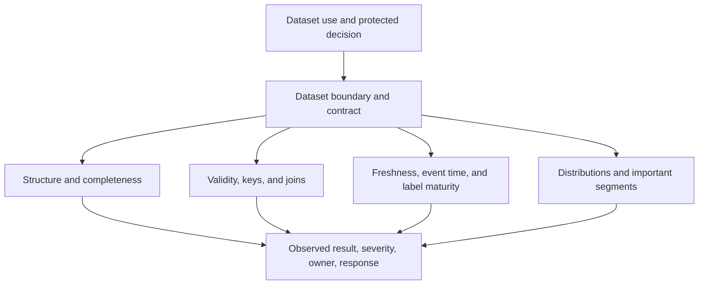

## Data Quality Is Defined Against A Use
<!-- section-summary: A quality check protects a particular dataset boundary, model use, and failure consequence. -->

**Data quality checks** test whether data is fit for a declared ML use. A value can be valid for analytics and unsafe for model training. A table can match its schema while arriving too late. A label can be present while still immature or produced under an obsolete policy.

The check framework has eight dimensions:

1. **Structure** — columns, types, nested shape, and schema version.
2. **Completeness** — required values and acceptable missingness.
3. **Validity** — domains, ranges, formats, and cross-field rules.
4. **Uniqueness and cardinality** — keys, duplicates, and expected entity counts.
5. **Referential integrity** — joins, foreign keys, and row preservation.
6. **Timeliness** — freshness, event time, lateness, and observation windows.
7. **Label quality** — definition, maturity, provenance, disagreement, and leakage.
8. **Distribution and segments** — shifts, balance, coverage, and important slices.

Each check identifies the protected boundary, expected condition, observed value, severity, owner, evidence, and response. The previous article defines how validation gates use these results. This article develops what to test.



The categories work together. A field can exist and use the correct type while carrying an impossible unit. A join can preserve valid values while dropping a whole region. A label can be present while its outcome window remains open. The response record turns each observation into an owned operational decision.

We will use a content-moderation training table to make the mechanics visible. Its grain is one row per `video_id` at `snapshot_at`. The model predicts whether a review will confirm a policy violation. Important fields include `creator_id`, `uploaded_at`, `snapshot_at`, `duration_seconds`, `caption_available`, `caption_language`, `label`, `label_mature_at`, and `policy_version`. This named schema lets us test whether a rule protects shape, meaning, time, or the target.

## Structural Checks Protect The Machine Contract
<!-- section-summary: Schema checks verify required fields, types, shapes, versions, and compatibility before downstream code runs. -->

Structural checks catch missing or renamed columns, changed types, reordered arrays, incompatible nested fields, and unsupported schema versions. They are the first boundary because later checks may be meaningless if the table shape changed.

Compatibility policy should distinguish additive, breaking, and deprecated changes. A new optional column may be safe. Changing `amount_cents` from integer to formatted string is breaking. Silently casting can hide upstream defects.

dbt can enforce warehouse structure and key rules. Pandera can validate dataframes near Python training code. Great Expectations can produce validation results and documentation. TensorFlow Data Validation can infer and compare schemas at scale. The tool is secondary to a versioned contract and owned response.

```yaml
models:
  - name: moderation_training_examples
    columns:
      - name: video_id
        tests: [not_null, unique]
      - name: duration_seconds
        tests: [not_null]
      - name: policy_violation_confirmed
        tests: [not_null]
```

Built-in tests are a foundation. Types and richer shape rules may require warehouse constraints, contracts, or custom tests.

Pandera can enforce the same boundary immediately before Python training code reads the dataframe. Current Pandera guidance uses `pandera.pandas`; the older top-level schema import is being deprecated. The model below checks types, hard ranges, categories, and one cross-field rule.

```python
from datetime import datetime

import pandas as pd
import pandera.pandas as pa
from pandera.typing import Series


class ModerationExamples(pa.DataFrameModel):
    video_id: Series[str] = pa.Field(unique=True, nullable=False)
    creator_id: Series[str] = pa.Field(nullable=False)
    uploaded_at: Series[datetime]
    snapshot_at: Series[datetime]
    duration_seconds: Series[float] = pa.Field(ge=0, le=43_200)
    caption_available: Series[bool]
    caption_language: Series[str] = pa.Field(nullable=True)
    label: Series[int] = pa.Field(isin=[0, 1])
    label_mature_at: Series[datetime]
    policy_version: Series[str] = pa.Field(isin=["policy-2026-04"])

    @pa.dataframe_check
    def timestamps_follow_causality(cls, frame: pd.DataFrame) -> Series[bool]:
        return frame["uploaded_at"] <= frame["snapshot_at"]


validated = ModerationExamples.validate(batch, lazy=True)
```

`lazy=True` collects all observed failures in one run, which makes a diagnostic report more useful than stopping at the first bad row. The pipeline still treats the returned dataframe as untrusted until validation completes. Type coercion stays disabled here because converting the string `"unknown"` to a missing number would hide a source contract break.

## Completeness Distinguishes Missing From Unknown
<!-- section-summary: Missing-value checks define which fields may be absent, why, and what downstream behaviour follows. -->

A null can mean unavailable, not applicable, delayed, redacted, failed to join, or not yet labelled. Replacing all nulls with zero erases these meanings and can create skew.

Completeness checks include required-field null rate, conditional requirements, group-level coverage, and unexpected missingness changes. A caption language may be optional when no caption exists and required when `caption_available=true`. A label may be null before its maturity window and invalid after it.

Defaults need a policy. The default value, trigger condition, missingness indicator, owner, and monitoring should be explicit. A serving fallback that training never saw creates another mismatch.

Coverage should be measured by important segment and source. A global two-percent null rate can hide a source that is missing ninety percent of values.

SQL makes the segment problem easy to inspect. This query measures caption-language completeness only for rows where a caption exists, then groups it by upload client.

```sql
SELECT
  upload_client,
  COUNT(*) AS captioned_rows,
  COUNT_IF(caption_language IS NULL) AS missing_language_rows,
  COUNT_IF(caption_language IS NULL) / NULLIF(COUNT(*), 0) AS missing_rate
FROM moderation_training_examples
WHERE caption_available = TRUE
GROUP BY upload_client
HAVING missing_rate > 0.01;
```

A healthy global rate can coexist with output such as `legacy_tv, 2841, 2650, 0.9328`. That result points to one producer rather than a general imputation problem. The safe response quarantines or repairs the affected client rows, then recomputes class and segment coverage. Filling the values with `"unknown"` without recording the reason would make the training and serving paths disagree about missingness.

## Validity Checks Protect Meaning
<!-- section-summary: Domain, range, format, and cross-field checks reject values that fit the type but violate the feature definition. -->

An integer duration can still be negative. A country code can be syntactically valid and unsupported. A timestamp can be in the future. A probability can exceed one. Validity checks encode these domain rules.

Cross-field rules capture relationships: `event_end` follows `event_start`; a refund amount cannot exceed the order amount; a mature positive label needs a supporting outcome event; a numeric unit agrees with its unit field.

Ranges can be hard physical limits, reviewed business limits, or statistical warnings. Keep them distinct. A physically impossible sensor value can block. A rare but plausible value may route to review rather than deletion.

Category checks need an unknown-value strategy. New categories can indicate product growth, upstream drift, or a broken mapping. Alert and route them deliberately instead of automatically coercing them into an existing class.

Validity failures need a sample that preserves the rule context. For a row with `caption_available=false` and `caption_language="en"`, the report should include both fields because neither value is invalid alone. The check can express that relationship directly:

```python
@pa.dataframe_check
def caption_fields_agree(cls, frame: pd.DataFrame) -> Series[bool]:
    has_language = frame["caption_language"].notna()
    return (
        (frame["caption_available"] & has_language)
        | (~frame["caption_available"] & ~has_language)
    )
```

The expression requires a language when a caption exists and requires null when it does not. A four-row unit fixture covers both valid combinations and both invalid combinations. The recovery path depends on the source of truth. If the caption service emitted the wrong availability flag, repair and replay that event range. If an old client legitimately sends a language without the flag, update the producer contract through a versioned compatibility change. Editing the validation rule until both interpretations pass would keep ambiguous feature meaning in the dataset.

## Uniqueness And Cardinality Protect Entity Grain
<!-- section-summary: Key and count checks ensure each row represents the intended entity and time without duplicates or collapse. -->

Every ML table has a grain: one row per transaction, customer-day, image, prediction, or entity-event time. The primary key should express that grain and be unique.

Duplicate rows can overweight examples, leak entities across splits, and inflate apparent label coverage. Unexpectedly low counts can indicate a dropped partition or failed filter. Unexpectedly high counts can indicate join multiplication.

Cardinality checks include total rows, distinct entities, rows per entity, category count, and group size. Compare them with recent healthy ranges and upstream manifests. A schema-valid empty partition is still unusable.

Join multiplication often creates duplicates after the source table has already passed uniqueness checks. Record counts around each join make the exact boundary visible:

```sql
WITH joined AS (
  SELECT e.video_id, COUNT(*) AS rows_after_join
  FROM eligible_videos e
  JOIN review_events r ON e.video_id = r.video_id
  GROUP BY e.video_id
)
SELECT video_id, rows_after_join
FROM joined
WHERE rows_after_join <> 1
ORDER BY rows_after_join DESC;
```

If one video has three review events, the team must choose a label rule such as latest approved review before the snapshot or final adjudicated review after the maturity window. Adding `DISTINCT` would remove duplicate rows while leaving the target definition unresolved. A regression fixture with multiple reviews should prove that the selected event is deterministic.

## Referential Integrity Protects Joins And Lineage
<!-- section-summary: Join checks verify key coverage, multiplicity, event-time correctness, and preservation of the intended row population. -->

ML datasets often join events, profiles, labels, and features. A left join can introduce nulls. A many-to-many join can multiply rows. A current profile join can leak future information into historical training.

Checks record left and right row counts, matched and unmatched keys, multiplicity, duplicate keys on each side, and post-join row count. Event-time joins verify that the selected feature record existed at prediction time.

Referential rules should follow ownership. A missing creator profile may be expected for deleted accounts and critical for active accounts. The response may exclude, backfill, or preserve a missingness category depending on the target definition.

Point-in-time integrity adds a temporal predicate to the join. The selected profile version must have `profile_effective_at <= snapshot_at`; when several versions qualify, the join chooses the latest one. Verification counts rows whose joined feature timestamp exceeds the snapshot, and the required result is zero. It also checks unmatched active creators separately from deleted creators, because those groups have different expected behaviour.

The join needs to encode that rule rather than relying on a comment beside an ordinary key join:

```sql
WITH profile_candidates AS (
  SELECT
    e.video_id,
    e.snapshot_at,
    e.creator_status,
    p.profile_version,
    p.profile_effective_at,
    p.follower_count,
    ROW_NUMBER() OVER (
      PARTITION BY e.video_id
      ORDER BY p.profile_effective_at DESC, p.profile_version DESC
    ) AS candidate_rank
  FROM moderation_training_examples e
  LEFT JOIN creator_profile_history p
    ON e.creator_id = p.creator_id
   AND p.profile_effective_at <= e.snapshot_at
   AND p.ingested_at <= e.snapshot_at
)
SELECT *
FROM profile_candidates
WHERE candidate_rank = 1;
```

Both temporal predicates matter. `profile_effective_at` says when the profile state applies, while `ingested_at` says when the training system could have known it. The verification report for one release can read `future_profile_rows=0`, `unmatched_active_creators=0`, and `unmatched_deleted_creators=137`. A fixture with profile versions immediately before and after `snapshot_at` proves the query selects the earlier eligible version. Another fixture with an old event that arrived after the snapshot proves availability time also protects the join.

## Timeliness Protects The Prediction-Time World
<!-- section-summary: Freshness and event-time checks ensure data arrived and was observed within the period the model assumes. -->

A table can be complete and valid while one day late. Timeliness checks compare expected and actual partition arrival, maximum event time, ingestion lag, feature age, and label maturity.

Event time describes when something happened. Processing time describes when the system observed it. Both matter for late events and backfills. Training snapshots should use the information available at the historical prediction time rather than the latest corrected record unless the target explicitly allows it.

Freshness thresholds follow feature meaning. Live driver location may tolerate seconds. Account age may tolerate a day. Alerts name the affected window, data source, downstream models, and fallback.

A timeliness result needs both a watermark and a count. `MAX(event_time)` alone can look current when one fresh event arrived beside a missing partition. For the moderation table, record the expected partition list, observed partitions, maximum event time, ingestion delay percentiles, and number of labels whose `label_mature_at` falls after the snapshot. The release gate blocks while any training label remains inside its appeal window.

The partition check can compare an owned manifest with the actual batch:

```sql
SELECT
  m.upload_client,
  m.expected_partition,
  COUNT(e.video_id) AS observed_rows,
  MAX(e.event_time) AS max_event_time,
  MAX(e.ingested_at) AS max_ingested_at,
  COUNT_IF(e.label_mature_at > TIMESTAMP '2026-07-14 00:00:00+00')
    AS immature_labels
FROM expected_moderation_partitions m
LEFT JOIN moderation_training_examples e
  ON m.upload_client = e.upload_client
 AND m.expected_partition = e.event_date
WHERE m.release_id = 'moderation-2026-07-14-r1'
GROUP BY m.upload_client, m.expected_partition
HAVING observed_rows = 0 OR immature_labels > 0;
```

Output such as `legacy_tv, 2026-07-13, 0, null, null, 0` identifies a completely absent producer partition that a maximum timestamp would miss. Output such as `mobile, 2026-07-13, 892104, ..., ..., 412` shows that data arrived while 412 targets remain inside the appeal window. The former routes to the ingestion owner; the latter waits for label maturity or publishes a dataset whose cutoff excludes those rows. A repaired release uses a new immutable version and reruns the same expected-partition manifest.

## Label Checks Protect The Target
<!-- section-summary: Label validation verifies definition, horizon, maturity, provenance, policy version, disagreement, and leakage boundaries. -->

Labels deserve their own quality layer because they define what the model learns. Checks confirm allowed values, class prevalence, observation horizon, maturity, source mix, adjudication, correction rate, and policy version.

A label created after an appeal may supersede the first review. **Censoring** means the observation window ended before the outcome could be known. A video still inside its appeal window has a censored target, so a missing label cannot safely stand for the negative class. A sudden class shift may reflect new policy. Production-label articles develop this lifecycle in depth.

Leakage checks verify that label or post-outcome fields do not enter features. Suspiciously perfect correlations, feature timestamps after prediction, and explanation importance for downstream status fields are important signals.

Label checks should also reconstruct provenance. One released row might carry `label=1`, `label_source="appeal_adjudication"`, `label_event_id="rev_8821"`, `policy_version="policy-2026-04"`, and `label_mature_at="2026-06-15T00:00:00Z"`. Those fields let a reviewer answer which policy and event produced the target. A test fixture where an appeal changes `1` to `0` should prove that the release query selects the final eligible decision and excludes the earlier review.

The adjudication query can express the source priority and maturity cutoff directly:

```sql
WITH mature_videos AS (
  SELECT video_id
  FROM moderation_training_examples
  WHERE label_mature_at <= TIMESTAMP '2026-07-14 00:00:00+00'
),
eligible_decisions AS (
  SELECT
    r.video_id,
    r.review_event_id,
    r.decision,
    r.decision_source,
    r.policy_version,
    r.decided_at,
    ROW_NUMBER() OVER (
      PARTITION BY r.video_id
      ORDER BY
        CASE r.decision_source
          WHEN 'appeal_adjudication' THEN 3
          WHEN 'senior_review' THEN 2
          WHEN 'initial_review' THEN 1
        END DESC,
        r.decided_at DESC,
        r.review_event_id DESC
    ) AS decision_rank
  FROM mature_videos m
  JOIN moderation_review_events r
    ON r.video_id = m.video_id
  WHERE r.decided_at <= TIMESTAMP '2026-07-14 00:00:00+00'
    AND r.policy_version = 'policy-2026-04'
)
SELECT video_id, review_event_id, decision, decision_source, policy_version
FROM eligible_decisions
WHERE decision_rank = 1;
```

For fixture `video_882`, an initial `remove` decision followed by an eligible appeal `allow` produces `label=0` from the appeal event. If the appeal finishes after the release cutoff, the video remains censored and the release query excludes it. Tests cover both timelines and assert the selected `review_event_id`, because checking only the final integer would lose provenance.

## Distribution Checks Protect Coverage And Behaviour
<!-- section-summary: Distribution and segment checks detect material population changes that structural rules cannot see. -->

Compare numerical distributions, category mix, missingness, label balance, and feature relationships with the training or recent healthy reference. **Effect size** measures the magnitude of a difference, while a significance test asks how surprising the difference would be under a statistical assumption. With millions of rows, a tiny operationally irrelevant change can have a small p-value. Review effect size together with sample count and product consequence.

Segment checks protect regions, channels, devices, product types, classes, and policy groups known to matter. They also verify minimum representation in training, validation, and test splits.

Distribution change is diagnostic. It does not automatically mean the data is bad. A new campaign can produce legitimate shift. The drift article explains how to interpret these signals with outcomes and context.

For a numerical feature, a standardized mean difference divides the mean change by the pooled standard deviation. The result has no unit, which helps compare features measured on different scales:

```python
import math

import pandas as pd


def standardized_mean_difference(
    reference: pd.Series,
    candidate: pd.Series,
) -> float:
    pooled_sd = math.sqrt((reference.var(ddof=1) + candidate.var(ddof=1)) / 2)
    if pooled_sd == 0:
        return 0.0 if reference.mean() == candidate.mean() else float("inf")
    return float((candidate.mean() - reference.mean()) / pooled_sd)


duration_effect = standardized_mean_difference(
    healthy["duration_seconds"],
    candidate["duration_seconds"],
)
```

City and upload-client categories use absolute share deltas instead because their values have no numerical distance. One report might show `duration_seconds_smd=0.07`, `new_upload_client_share_delta=0.14`, and `policy_violation_rate_delta=0.002`. The contract can pass the duration change, open review for the new client population, and keep label balance visible without treating every shift as corruption. A segment fixture where only `legacy_tv` changes proves the report groups before aggregation and keeps the affected producer visible.

## Reports Connect Checks To Response
<!-- section-summary: A quality report records observations, severity, affected assets, evidence, owners, and allowed action. -->

A report should include dataset and schema versions, run and window, checks executed, observed values, thresholds, failures, review findings, affected segments, example references, downstream consumers, and owner.

Blocking failures stop publication or training. Review findings may allow work only after the named owner records a decision. Quarantine preserves bad partitions for investigation while keeping them away from consumers. Automatic repair should be limited to transformations whose meaning is unambiguous and recorded.

During an incident, responders first contain downstream use, preserve the failed snapshot and report, identify the first broken dimension, repair the source or contract, rebuild deterministically, and rerun checks. A successful rerun should identify the new snapshot rather than overwrite the failed evidence.

## Tools Implement One Quality Framework
<!-- section-summary: SQL, dbt, Pandera, Great Expectations, and TFDV serve different execution surfaces around shared quality dimensions. -->

Warehouse SQL and dbt fit source and transformation checks close to tables. Pandera fits Python dataframe contracts and unit tests. Great Expectations fits reusable expectation suites and validation reports. TFDV fits large-scale schema, statistics, anomalies, and training-serving comparison in TensorFlow-oriented pipelines.

A platform may use several. The same check ID, owner, severity, and dataset identity should connect their results. Collecting tools without one quality taxonomy creates duplicate rules and inconsistent gates.

A complete verification run should therefore answer four questions. Did the schema code reject a deliberately malformed fixture? Did warehouse queries detect duplicates, join loss, and immature labels? Did the gate preserve failing rows and stop dataset publication? Did the repaired immutable snapshot pass the same contract without changing thresholds? These checks cover implementation, data mechanics, orchestration, and recovery as separate failure boundaries.

## References

- [dbt data tests](https://docs.getdbt.com/docs/build/data-tests)
- [Pandera data validation](https://pandera.readthedocs.io/en/stable/)
- [Pandera DataFrame models](https://pandera.readthedocs.io/en/latest/dataframe_models.html)
- [Great Expectations expectations](https://docs.greatexpectations.io/docs/core/define_expectations/)
- [TensorFlow Data Validation](https://www.tensorflow.org/tfx/data_validation/get_started)
