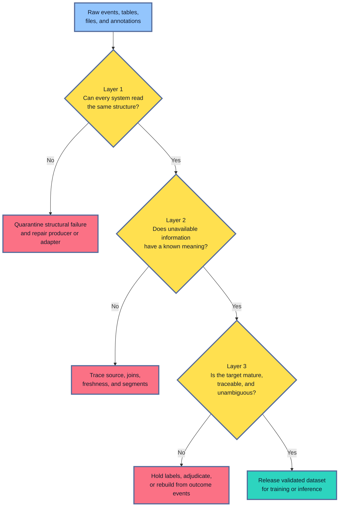
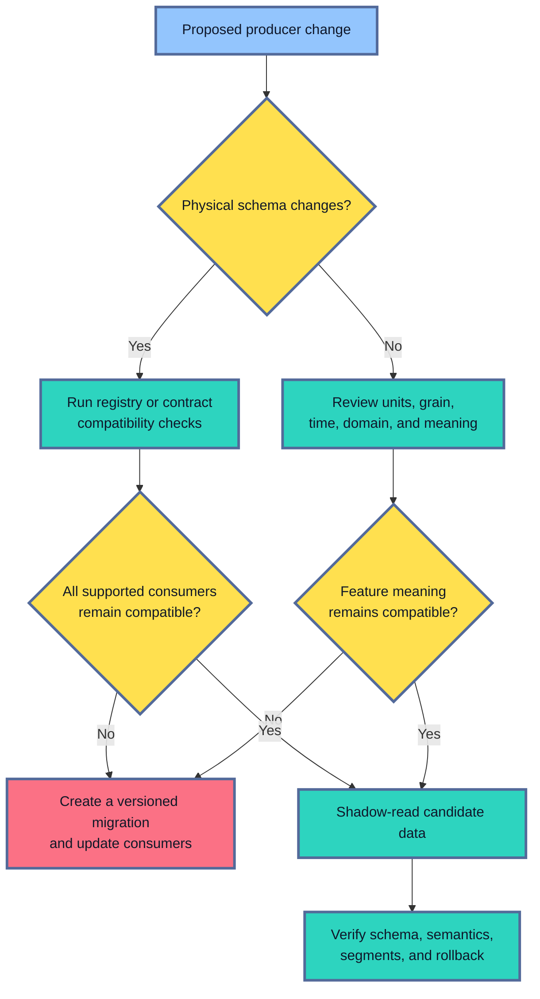
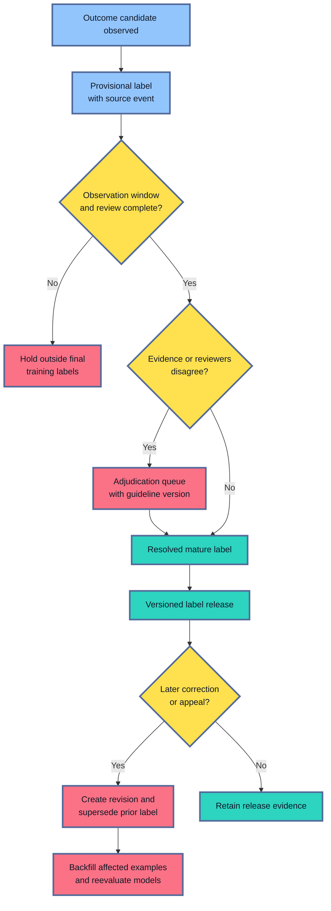
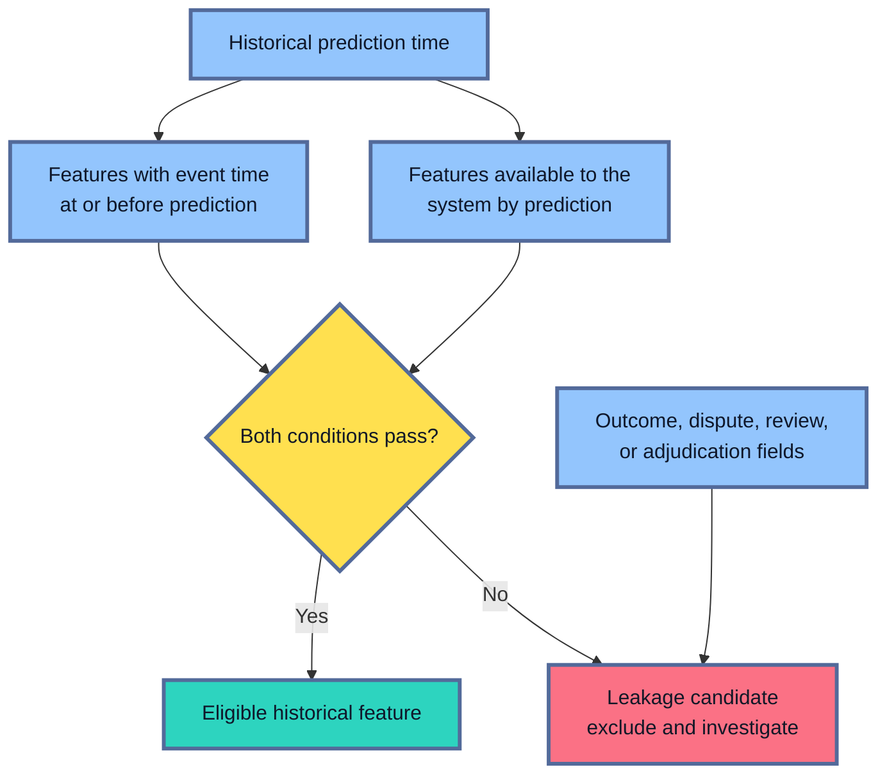
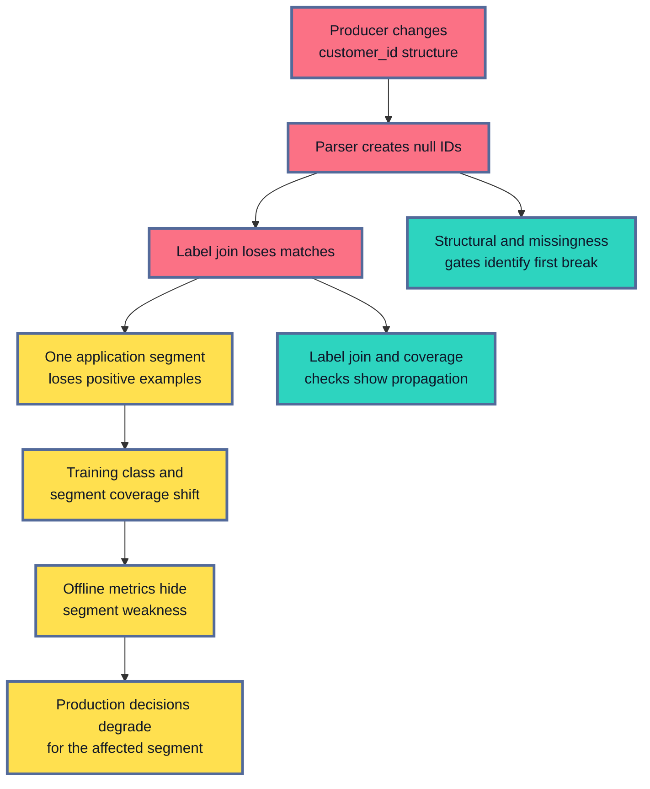
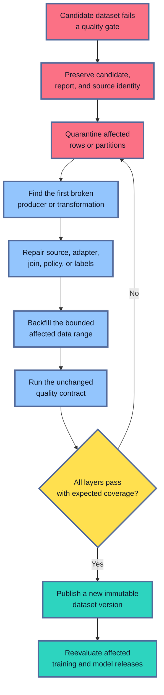

## Table of Contents

1. [What Data Quality Evidence Must Prove](#what-data-quality-evidence-must-prove)
2. [The Three Evidence Layers](#the-three-evidence-layers)
3. [Layer 1: Schema And Structural Validity](#layer-1-schema-and-structural-validity)
4. [Schema Evolution Needs A Compatibility Policy](#schema-evolution-needs-a-compatibility-policy)
5. [Layer 2: Missing-Value Semantics](#layer-2-missing-value-semantics)
6. [Measure Missingness By Segment](#measure-missingness-by-segment)
7. [Layer 3: Label Integrity](#layer-3-label-integrity)
8. [Label Maturity, Revisions, And Adjudication](#label-maturity-revisions-and-adjudication)
9. [Keep Label Leakage Out Of Features](#keep-label-leakage-out-of-features)
10. [How Quality Failures Propagate](#how-quality-failures-propagate)
11. [Quarantine, Repair, And Backfill](#quarantine-repair-and-backfill)
12. [Where Industrial Quality Tools Fit](#where-industrial-quality-tools-fit)
13. [Verify The Complete Quality Path](#verify-the-complete-quality-path)
14. [The Main Idea](#the-main-idea)
15. [References](#references)

## What Data Quality Evidence Must Prove
<!-- section-summary: Data quality evidence shows that a dataset has a trustworthy structure, meaningful missing states, and reliable labels. -->

An ML pipeline can finish successfully and still produce a dangerous dataset. The files may open, every required column may exist, and the training job may report a higher accuracy score. None of those signals proves that the data still means what the model expects.

Consider three ordinary failures:

- A producer changes `parcel_weight_grams` from an integer to a formatted string. The ingestion job quietly converts unreadable values to null.
- An income feature contains nulls from several causes: a customer withheld the value, a join failed, or the source is two months old.
- A fraud label says “no chargeback” before the dispute window has closed. A later chargeback turns that apparent negative into a positive.

The first failure changes the dataset's structure. The second collapses different kinds of missing information into one representation. The third gives the model an unreliable target. Each failure can survive a generic “job succeeded” check.

At a high level, **data quality checks provide evidence that a dataset is fit for its declared ML use**. The word “declared” matters. A null may be acceptable for an optional profile field and unacceptable for a training key. A provisional outcome may be useful for an operations dashboard and unsafe as a final training label.

Good evidence connects five things: the dataset and version, the rule being protected, the observed result, the affected rows or segments, and the action allowed after the check. That connection turns a test result into an operational decision.

## The Three Evidence Layers
<!-- section-summary: Structural validity, missing-value semantics, and label integrity protect different assumptions and need different repairs. -->

The quality framework has three connected layers. Each layer protects a different assumption made by the training pipeline. Reading them in order helps the team find the first broken boundary before repairing downstream symptoms.

**Schema and structural validity** asks whether producers and consumers agree on the shape of the data. Columns, types, nested fields, keys, units, allowed categories, and row grain belong here.

**Missing-value semantics** asks why expected information is unavailable. An absent field describes delivery, while an unknown value describes knowledge and a stale value describes time. Null, inapplicable, and redacted states add other meanings that may require different model behaviour.

**Label integrity** asks whether the target represents the intended outcome. Provenance, observation windows, maturity, ambiguity, revisions, adjudication, and leakage belong here.


```mermaid
flowchart TD
    A["Raw events, tables,<br/>files, and annotations"] --> B{"Layer 1<br/>Can every system read<br/>the same structure?"}
    B -->|"No"| C["Quarantine structural failure<br/>and repair producer or adapter"]
    B -->|"Yes"| D{"Layer 2<br/>Does unavailable information<br/>have a known meaning?"}
    D -->|"No"| E["Trace source, joins,<br/>freshness, and segments"]
    D -->|"Yes"| F{"Layer 3<br/>Is the target mature,<br/>traceable, and unambiguous?"}
    F -->|"No"| G["Hold labels, adjudicate,<br/>or rebuild from outcome events"]
    F -->|"Yes"| H["Release validated dataset<br/>for training or inference"]

    classDef source fill:#93C5FD,stroke:#536A9A,stroke-width:3px,color:#0F172A
    classDef gate fill:#FFE04F,stroke:#536A9A,stroke-width:3px,color:#111827
    classDef repair fill:#FB7185,stroke:#536A9A,stroke-width:3px,color:#111827
    classDef release fill:#2DD4BF,stroke:#536A9A,stroke-width:3px,color:#0F172A
    class A source
    class B,D,F gate
    class C,E,G repair
    class H release
```

The order gives an investigation a stable starting point. Label analysis has little value if a schema change shifted values into the wrong fields. Missingness analysis needs structural evidence so the team knows whether a value was truly null or lost during parsing. A reliable label needs both layers because a broken join can remove labels for one population.

## Layer 1: Schema And Structural Validity
<!-- section-summary: Structural checks prove that rows, fields, types, keys, and meanings still match the contract expected by downstream systems. -->

Schema is the machine-readable shape of data. It says which fields exist, how they are encoded, and which types a reader should expect. Structural validity goes further by checking the row grain, keys, nested shape, category domain, and relationships that make the rows usable.

You can think of a schema as the plug shape between systems. A producer and consumer may both be healthy, yet they cannot exchange data safely if one side changes that plug without coordination.

### A structural failure in practice

Suppose a delivery-time model uses `parcel_weight_grams` as a number. A source application starts sending values such as `"2.4 kg"` after a user-interface release. The warehouse loader keeps the column numeric by coercing those strings to null.

The training table still opens. The training pipeline may even impute the new nulls. The real failure appears later: weight disappears mainly for parcels created through the updated application, so one channel receives poorer predictions. A schema check at ingestion would have exposed the type mismatch before it turned into a segment-specific model problem.

### Physical schema and semantic contract

A **physical schema** covers names, data types, nullability, nested fields, and encoding. A **semantic contract** covers meaning: unit, time zone, row grain, source, derivation, valid domain, applicability, and freshness.

`parcel_weight` can remain a decimal in both versions while the producer changes the unit from grams to kilograms. The physical schema still matches. The semantic contract has broken.

For ML data, a useful contract records:

- one row represents which entity and logical time;
- which fields form the key;
- the type and unit of every model input;
- whether null is allowed and which reasons are valid;
- the event time and availability time;
- the allowed category domain;
- the owner and compatibility policy.

### Investigation and industrial repair

The investigation starts at the first boundary that observed the changed data. Compare the candidate batch schema with the registered producer schema and the consumer contract. Count parse failures and automatic casts. Group failures by source version, application channel, region, and partition. Check recent producer, connector, and transformation releases.

If one application version changed the weight format, the team can stop publication, preserve the raw batch, and route that source version to quarantine. The preferred repair restores the producer contract. A temporary adapter may parse both versions during a coordinated migration, provided it records the source schema version and converts units explicitly.

After repair, rebuild the affected partitions from immutable raw data. The corrected dataset receives a new version or snapshot and passes the same contract used for healthy data.

### Prevention and verification with dbt

dbt model contracts can verify that a SQL model produces the declared column names and data types. Data tests validate contents such as nullability, uniqueness, allowed values, and relationships. Constraint enforcement varies across data platforms, so the pipeline should keep content tests even where a constraint is present.

```yaml
models:
  - name: delivery_training_examples
    config:
      contract:
        enforced: true
    columns:
      - name: training_example_id
        data_type: string
        constraints:
          - type: not_null
        data_tests:
          - unique
      - name: parcel_weight_grams
        data_type: decimal(12, 3)
        constraints:
          - type: not_null
      - name: source_schema_version
        data_type: string
        data_tests:
          - accepted_values:
              arguments:
                values: ["delivery-v3", "delivery-v4"]
```

CI should test a valid fixture, a missing column, a changed type, and a semantically invalid unit. A shadow read of the candidate producer version checks real serialization before rollout. Production verification confirms zero unexpected casts, expected row grain, and healthy coverage for every supported source version.

## Schema Evolution Needs A Compatibility Policy
<!-- section-summary: Schema evolution classifies changes by consumer compatibility and coordinates breaking semantic changes through versioning. -->

Schemas need to change as products evolve. The safe question is, “Which existing producers and consumers can still exchange data after this change?”

An additive optional field is often compatible because older consumers can ignore it. Removing or renaming a required field is usually breaking. Changing a number to a string is breaking for numerical consumers. Widening an integer type may be compatible on one platform and unsupported on another.

Schema registries for Avro, Protobuf, or JSON Schema can enforce backward, forward, full, and transitive compatibility policies. Backward compatibility focuses on whether the new reader can consume older data. Forward compatibility focuses on whether the old reader can consume newly written data. Transitive checking compares a new schema against the full supported history instead of only the latest version.

Semantic changes need their own review because registries inspect encoded structure. A change in unit, category meaning, feature window, or entity grain can pass schema compatibility while changing the model input.


```mermaid
flowchart TD
    A["Proposed producer change"] --> B{"Physical schema changes?"}
    B -->|"Yes"| C["Run registry or contract<br/>compatibility checks"]
    B -->|"No"| D["Review units, grain,<br/>time, domain, and meaning"]
    C --> E{"All supported consumers<br/>remain compatible?"}
    D --> F{"Feature meaning<br/>remains compatible?"}
    E -->|"No"| G["Create a versioned migration<br/>and update consumers"]
    F -->|"No"| G
    E -->|"Yes"| H["Shadow-read candidate data"]
    F -->|"Yes"| H
    H --> I["Verify schema, semantics,<br/>segments, and rollback"]

    classDef change fill:#93C5FD,stroke:#536A9A,stroke-width:3px,color:#0F172A
    classDef gate fill:#FFE04F,stroke:#536A9A,stroke-width:3px,color:#111827
    classDef migration fill:#FB7185,stroke:#536A9A,stroke-width:3px,color:#111827
    classDef verify fill:#2DD4BF,stroke:#536A9A,stroke-width:3px,color:#0F172A
    class A change
    class B,E,F gate
    class C,D,H,I verify
    class G migration
```

A coordinated breaking change normally runs both versions for a migration window. Consumers move deliberately, monitoring compares outputs, and the old version retires after usage reaches zero. This policy keeps an upstream release from silently redefining a feature.

## Layer 2: Missing-Value Semantics
<!-- section-summary: Missing-value checks preserve why information is unavailable so training and serving can apply the correct response. -->

A null is a storage state. The database knows that no value is present, while the team still needs evidence about the cause and the correct response.

Suppose a credit-risk feature called `annual_income` is empty for four applicants. One uses an older application that never sent the field. One submitted the field, but a join failed. One selected “prefer not to say.” One has an income value whose observation is too old for the lending policy.

Treating all four records as zero income tells the model a false story. Treating them all as the mean also hides the operational join failure and the policy decision around stale evidence.

### Null, absent, unknown, and stale

These terms describe different states:

- **Absent** means the field or source record never arrived at the expected boundary. A producer version may omit a JSON field, or a join may find no matching row.
- **Null** means the field exists in the materialized schema and carries no value. It is the representation seen by SQL and dataframe systems.
- **Unknown** means the system has established that the value cannot currently be determined. The state is known even though the value is unavailable.
- **Stale** means a value exists, but its observation time falls outside the allowed age for the decision.

Two other states often matter. **Not applicable** means the field has no meaning for that row. **Withheld or redacted** means policy or user choice prevents use of the value.

The materialized dataset can preserve these meanings with separate fields:

```text
annual_income
annual_income_status
annual_income_observed_at
annual_income_source
annual_income_source_version
```

`annual_income_status` might allow `observed`, `unknown`, `not_applicable`, `withheld`, `source_missing`, and `join_failed`. A stale state can be calculated from `annual_income_observed_at` and the prediction time under a declared maximum age.

### Investigation and industrial repair

Start with the boundary where the value disappeared. Compare producer field presence, source row coverage, join match rate, parse failures, and feature age. Group each result by source, schema version, region, channel, customer type, and other protected product segments.

A join failure calls for a source or key repair followed by a backfill. An optional field absent from an older producer may use a version-aware compatibility rule. An explicitly unknown value can remain as a governed category or missingness indicator. A stale value may use a last-known value only if the contract allows a maximum age and training uses the same rule.

Imputation needs the same discipline as any learned transformation. Fit imputation statistics on the training split, store the fitted transformer with the model pipeline, and apply identical logic during serving. Evaluate the result by segment because global mean or median imputation can distort groups with different distributions.

### Prevention with Lakeflow pipeline expectations

Lakeflow pipeline expectations can enforce row-level SQL conditions inside managed Databricks pipelines. The expectation can warn and retain rows, drop invalid rows, or fail the pipeline update. Critical training semantics usually deserve a failed update or an explicit quarantine path.

```sql
CONSTRAINT meaningful_income_state EXPECT (
  (annual_income_status = 'observed' AND annual_income IS NOT NULL)
  OR
  (
    annual_income_status IN (
      'unknown',
      'not_applicable',
      'withheld',
      'source_missing',
      'join_failed'
    )
    AND annual_income IS NULL
  )
) ON VIOLATION FAIL UPDATE
```

This rule checks agreement between the value and its status. It cannot decide whether the business should accept an unknown value or how long income remains fresh. Those policies belong in the dataset contract and release gate. Lakeflow records expectation metrics in the pipeline event log for supported policies, while a quarantine table preserves invalid rows and failure reasons for investigation.

Verification uses fixtures for every allowed state. It proves that observed values require a timestamp and source, join failures reach quarantine, stale values cross the threshold at the correct prediction time, and training and serving apply the same imputation or fallback logic.

## Measure Missingness By Segment
<!-- section-summary: Segment-level checks reveal concentrated missingness that global averages hide. -->

A global missing rate can look healthy while one population has almost no usable data. Imagine that two percent of all device-age values are unavailable. If ninety percent of those failures come from one mobile operating-system version, a global imputation policy hides a producer defect.

The investigation should measure both **rate** and **coverage**. Rate says what fraction of rows in a segment lack usable values. Coverage says how many rows the segment contributes, which prevents a tiny sample from driving a misleading percentage.

```sql
SELECT
  application_channel,
  region,
  COUNT(*) AS segment_rows,
  COUNT_IF(annual_income_status <> 'observed') AS unavailable_rows,
  COUNT_IF(annual_income_status = 'join_failed') AS join_failed_rows,
  COUNT_IF(
    annual_income_observed_at < :freshness_cutoff
  ) AS stale_rows
FROM credit_training_candidates
GROUP BY application_channel, region
HAVING
  unavailable_rows > 0
  OR stale_rows > 0;
```

The report should compare the candidate with a recent healthy reference and with the intended training population. A segment may pass its own missing-rate threshold yet fall below minimum representation because upstream filtering removed most of its rows.

Industrial repair follows the cause. A channel-specific join failure routes to the integration owner and triggers a bounded backfill. A legitimate increase in withheld values may require model evaluation and policy review. A new region with limited historical data may need an explicit minimum-coverage gate before release.

SodaCL can operationalize warehouse-level missingness, validity, schema, and freshness checks in readable configuration. GX Core can validate Python or SQL-backed batches through Expectation Suites, Validation Definitions, and production Checkpoints. Both tools should emit dataset version, segment, observed metric, and failing-row references so the release system can act on their results.

## Layer 3: Label Integrity
<!-- section-summary: Label integrity proves that each target has a definition, source, maturity state, revision history, and leakage-safe relationship to features. -->

Labels tell the model what outcome to learn. A feature error affects part of the input; a systematic label error can teach the model the wrong task.

Consider a payment-fraud model trained to predict eventual chargebacks. A transaction has no chargeback event one week after purchase, so an early dataset marks it negative. The customer opens a dispute later, and the bank eventually confirms the chargeback. The early negative was an **immature label**: the observation window had not closed.

Label integrity asks more than whether the target column contains `0` or `1`. It asks where the value came from, which definition produced it, whether enough time has passed, whether reviewers agree, whether a later event revised it, and whether any feature revealed the outcome.

### Provenance and definition

Every released label should connect to evidence such as:

- target definition and outcome horizon;
- source event or annotation ID;
- source system and policy version;
- event time, recorded time, and maturity time;
- label state and revision number;
- prior label superseded by the current decision;
- adjudication status and quality metadata.

For human annotations, provenance can include task version, guideline version, annotator group, agreement result, and adjudicator decision. Sensitive worker identities should remain governed and access-controlled.

A model release should reference the label dataset version alongside the final integer target. That reference lets an investigation reconstruct the outcome policy used during training.

### Ambiguity is evidence

Some examples genuinely support more than one interpretation. Two qualified reviewers may disagree because the policy boundary is unclear. Hiding that disagreement behind a majority vote removes useful quality information.

Ambiguous examples can enter an adjudication queue. An adjudicator applies the current guideline, records the resolution and reason, and may identify a policy gap. Repeated disagreement in one category signals that the labeling guide or class definition needs repair.

Agreement metrics need segment context. High overall agreement can hide poor agreement for one language, rare class, or borderline case. Sampling for verification should include those difficult segments instead of drawing only a uniform random sample.

## Label Maturity, Revisions, And Adjudication
<!-- section-summary: A label lifecycle keeps provisional outcomes separate from mature decisions and preserves every revision. -->

A production label usually moves through several states. It may start as provisional, enter review, mature after an outcome window, and later receive a governed correction. Preserving those transitions prevents a current answer from erasing the evidence available to an earlier dataset.

In production, the label builder usually reads an append-only event history. Each event identifies the example, decision, source, effective time, recorded time, maturity time, revision, and adjudication state. The release process selects the newest eligible final event available by its cutoff and keeps unresolved cases outside the final label table. The expected result is either one traceable label for an example or a recorded reason why that example remains unreleased.


```mermaid
flowchart TD
    A["Outcome candidate observed"] --> B["Provisional label<br/>with source event"]
    B --> C{"Observation window<br/>and review complete?"}
    C -->|"No"| D["Hold outside final<br/>training labels"]
    C -->|"Yes"| E{"Evidence or reviewers<br/>disagree?"}
    E -->|"Yes"| F["Adjudication queue<br/>with guideline version"]
    F --> G["Resolved mature label"]
    E -->|"No"| G
    G --> H["Versioned label release"]
    H --> I{"Later correction<br/>or appeal?"}
    I -->|"Yes"| J["Create revision and<br/>supersede prior label"]
    J --> K["Backfill affected examples<br/>and reevaluate models"]
    I -->|"No"| L["Retain release evidence"]

    classDef event fill:#93C5FD,stroke:#536A9A,stroke-width:3px,color:#0F172A
    classDef gate fill:#FFE04F,stroke:#536A9A,stroke-width:3px,color:#111827
    classDef hold fill:#FB7185,stroke:#536A9A,stroke-width:3px,color:#111827
    classDef release fill:#2DD4BF,stroke:#536A9A,stroke-width:3px,color:#0F172A
    class A,B event
    class C,E,I gate
    class D,F,J,K hold
    class G,H,L release
```

A deterministic label-building query selects only evidence available by the declared cutoff. It also excludes unresolved ambiguity:

```sql
WITH eligible_labels AS (
  SELECT
    example_id,
    label_value,
    label_event_id,
    policy_version,
    revision_number,
    effective_at,
    recorded_at,
    ROW_NUMBER() OVER (
      PARTITION BY example_id
      ORDER BY
        revision_number DESC,
        effective_at DESC,
        label_event_id DESC
    ) AS revision_rank
  FROM label_events
  WHERE effective_at <= :label_cutoff
    AND recorded_at <= :label_cutoff
    AND maturity_at <= :label_cutoff
    AND label_status = 'final'
    AND adjudication_status IN ('not_required', 'resolved')
)
SELECT
  example_id,
  label_value,
  label_event_id,
  policy_version,
  revision_number
FROM eligible_labels
WHERE revision_rank = 1;
```

The query uses both `effective_at` and `recorded_at`. An event may describe an earlier real-world outcome while arriving after the historical prediction. The recorded-time boundary prevents the rebuilt dataset from using knowledge the system lacked at that point.

Investigation compares label coverage, class balance, source mix, maturity rate, disagreement, revision rate, and join coverage by segment. Sample rows should trace from final target back to source events and adjudication records.

Repair may require waiting for maturity, correcting a label join, revising annotation guidance, or rerunning adjudication for an affected class. A label correction creates a new version and a bounded backfill. The team then reevaluates models trained on the affected label release.

The prevention gate admits only mature labels with complete provenance and resolved adjudication state. Verification fixtures cover an immature outcome, two conflicting reviews, a resolved adjudication, and a later revision. Each fixture asserts both the selected value and the source event ID so provenance receives the same protection as the target.

## Keep Label Leakage Out Of Features
<!-- section-summary: Leakage checks prevent outcome information and post-decision events from entering historical model inputs. -->

**Label leakage** occurs when a feature contains information that would only be known after the prediction decision or comes directly from the outcome process. Leakage produces impressive offline metrics because the model receives clues unavailable in production.

For a chargeback model, fields such as `dispute_closed_at`, `chargeback_reason`, or `investigation_result` belong to the label process. They cannot appear in features calculated at transaction time. A customer profile update recorded after the transaction also needs an availability-time check even if its effective date points backward.

Two timestamps protect the boundary:

- `event_time` says when the underlying fact happened.
- `available_at` says when the feature system could use that fact.

Historical feature rows should satisfy both `event_time <= prediction_time` and `available_at <= prediction_time`. Dataset splitting should also keep entities or time windows separated according to the evaluation design, because duplicated entities can leak nearly identical examples across train and test.


```mermaid
flowchart TD
    A["Historical prediction time"] --> B["Features with event time<br/>at or before prediction"]
    A --> C["Features available to the<br/>system by prediction"]
    B --> D{"Both conditions pass?"}
    C --> D
    D -->|"Yes"| E["Eligible historical feature"]
    D -->|"No"| F["Leakage candidate<br/>exclude and investigate"]
    G["Outcome, dispute, review,<br/>or adjudication fields"] --> F

    classDef time fill:#93C5FD,stroke:#536A9A,stroke-width:3px,color:#0F172A
    classDef gate fill:#FFE04F,stroke:#536A9A,stroke-width:3px,color:#111827
    classDef safe fill:#2DD4BF,stroke:#536A9A,stroke-width:3px,color:#0F172A
    classDef leak fill:#FB7185,stroke:#536A9A,stroke-width:3px,color:#111827
    class A,B,C,G time
    class D gate
    class E safe
    class F leak
```

Verification uses a fixture containing one feature event before prediction, one event after prediction, and one late-arriving event with an earlier effective time. Only the first row should qualify. Feature-name deny lists can catch obvious outcome fields, while lineage and timestamp tests protect derived or renamed versions.

## How Quality Failures Propagate
<!-- section-summary: A defect in one evidence layer can change downstream missingness, label coverage, model behaviour, and production outcomes. -->

The three layers interact. A structural defect often appears downstream as missing data. Missing data can break a label join. A broken label join can change class balance and model behaviour.

Suppose a producer changes `customer_id` from a fixed string to a nested object. The loader converts unreadable IDs to null. The label join loses those rows. If the change affects one mobile application version, that segment contributes fewer positive outcomes to training. The model learns from a distorted population and performs poorly for users of that application.


```mermaid
flowchart TD
    A["Producer changes<br/>customer_id structure"] --> B["Parser creates null IDs"]
    B --> C["Label join loses matches"]
    C --> D["One application segment<br/>loses positive examples"]
    D --> E["Training class and<br/>segment coverage shift"]
    E --> F["Offline metrics hide<br/>segment weakness"]
    F --> G["Production decisions degrade<br/>for the affected segment"]
    B --> H["Structural and missingness<br/>gates identify first break"]
    C --> I["Label join and coverage<br/>checks show propagation"]

    classDef defect fill:#FB7185,stroke:#536A9A,stroke-width:3px,color:#111827
    classDef impact fill:#FFE04F,stroke:#536A9A,stroke-width:3px,color:#111827
    classDef evidence fill:#2DD4BF,stroke:#536A9A,stroke-width:3px,color:#0F172A
    class A,B,C defect
    class D,E,F,G impact
    class H,I evidence
```

This is why a quality report needs the first broken boundary and the downstream impact. A “label coverage low” alert alone sends the team toward the label system even though the producer schema caused the incident.

## Quarantine, Repair, And Backfill
<!-- section-summary: Quarantine preserves failed evidence, repair fixes the owning boundary, and backfill rebuilds affected partitions under the same contract. -->

Quarantine separates suspect data from approved consumers while preserving it for diagnosis. A useful quarantine record keeps the dataset version, run ID, check ID, row or partition reference, source version, failure reason, and restricted pointer to the original data.

Dropping bad rows without evidence can make quality metrics look healthier while reducing coverage. Critical keys, missing-state contradictions, and unresolved labels usually belong in quarantine or a failed update. A known invalid optional telemetry record may be safe to drop if the contract and metrics make that policy explicit.


```mermaid
flowchart TD
    A["Candidate dataset fails<br/>a quality gate"] --> B["Preserve candidate,<br/>report, and source identity"]
    B --> C["Quarantine affected<br/>rows or partitions"]
    C --> D["Find the first broken<br/>producer or transformation"]
    D --> E["Repair source, adapter,<br/>join, policy, or labels"]
    E --> F["Backfill the bounded<br/>affected data range"]
    F --> G["Run the unchanged<br/>quality contract"]
    G --> H{"All layers pass<br/>with expected coverage?"}
    H -->|"No"| C
    H -->|"Yes"| I["Publish a new immutable<br/>dataset version"]
    I --> J["Reevaluate affected<br/>training and model releases"]

    classDef fail fill:#FB7185,stroke:#536A9A,stroke-width:3px,color:#111827
    classDef work fill:#93C5FD,stroke:#536A9A,stroke-width:3px,color:#0F172A
    classDef gate fill:#FFE04F,stroke:#536A9A,stroke-width:3px,color:#111827
    classDef release fill:#2DD4BF,stroke:#536A9A,stroke-width:3px,color:#0F172A
    class A,B,C fail
    class D,E,F,G work
    class H gate
    class I,J release
```

The backfill should use the same input identities, deterministic logic, and checks as a normal build. Verification compares row counts, missing-state mix, label coverage, revision counts, and important segments with both the failed candidate and a healthy reference. The failed evidence remains available for the incident record.

## Where Industrial Quality Tools Fit
<!-- section-summary: Industrial tools evaluate checks on different execution surfaces while contracts, orchestration, storage, and owners retain distinct responsibilities. -->

Several quality products can evaluate similar-looking rules, which makes the stack appear more complicated than the underlying work. Start with the place where the check must run: a SQL model, a Python batch, a distributed Spark dataset, or a managed data pipeline. Give each chosen tool a clear execution boundary and connect its result to one release decision.

**dbt model contracts and data tests** fit warehouse and lakehouse SQL models. Contracts check the declared shape during model construction. Data tests query built data for failing rows, including nulls, duplicates, accepted values, relationships, and custom business rules. dbt remains strongest where transformations and evidence already live in SQL.

**GX Core (Great Expectations)** is the current Python library for programmatic validation workflows. Expectations describe individual conditions, Expectation Suites group them, Validation Definitions associate suites with batches, and Checkpoints run production validations and actions. GX Core fits Python dataframes and SQL-backed batches that need reusable results and pipeline integration.

**SodaCL and Soda scans** provide human-readable checks for schema, missingness, validity, duplicates, freshness, and reconciliation across supported data sources. Soda works well for teams that want check configuration close to data operations and shared monitoring around scan results.

**Deequ** runs quality verification on Apache Spark. Its `VerificationSuite`, constraints, analyzers, and DQDL support large distributed datasets. AWS Glue Data Quality offers a managed, serverless path built on Deequ and uses DQDL rules. This family fits teams already processing data through Spark or AWS Glue.

**Lakeflow pipeline expectations** evaluate row-level SQL conditions as data moves through managed Databricks pipelines. Warn retains records and records metrics, drop excludes invalid rows, and fail stops the update. Expectations fit constraints inside one pipeline; cross-dataset reconciliation, label maturity workflows, and adjudication still need dedicated transformations and operational processes.

The validation library evaluates the rule. The orchestrator decides when the rule runs and whether publication can continue. The storage and catalog layer preserve candidate and approved dataset identities. Source owners repair producer defects. Data and model owners define missingness policies, label definitions, segments, and acceptance thresholds.

One platform rarely needs every tool. A warehouse team may use dbt contracts and data tests plus Soda monitoring. A Python training pipeline may use dbt upstream and GX Core at the training boundary. A Spark lakehouse may use Deequ or managed Lakeflow expectations. Duplicating the same rule across tools without a shared check ID and owner creates conflicting evidence.

## Verify The Complete Quality Path
<!-- section-summary: Verification proves that checks detect known defects, gates contain them, repairs rebuild safely, and downstream consumers receive corrected data. -->

A check is ready for production after the team has observed it fail on a controlled defect. Passing healthy data proves the happy path; rejecting a known-bad fixture proves that the rule can protect the release boundary. The operational test then confirms that the failed result reaches quarantine, blocks publication, and supports repair.

Structural fixtures should cover a missing field, changed type, unsupported schema version, wrong unit, duplicate key, and changed row grain. Missingness fixtures should cover absent, null, unknown, stale, inapplicable, withheld, source-missing, and join-failed states. Label fixtures should cover provisional outcomes, mature outcomes, reviewer disagreement, adjudication, revisions, and post-prediction leakage.

The pipeline test then proves the operational response. A blocking defect must prevent publication. Quarantined rows must retain check and source references. The previous approved dataset must remain available. A corrected bounded backfill must pass the unchanged contract and publish a new immutable identity.

Finally, verify the downstream effect. Recompute segment coverage and class balance, rebuild the affected training dataset, and rerun model evaluation for impacted populations. A data repair is complete after the production decision path uses the corrected evidence.

## The Main Idea
<!-- section-summary: Trustworthy ML data needs evidence about structure, missing information, and labels at every release boundary. -->

Data quality for ML rests on three questions. Can every system agree on the structure and meaning of each row? Does unavailable information carry a reason and freshness state? Does every label represent a mature, traceable, leakage-safe outcome?

Schema checks, missing-value checks, and label checks protect different assumptions. Their evidence must reconnect at the release gate because one defect can propagate through all three layers.

Industrial tools can execute the checks. Reliable operation also needs contract ownership and segment-aware investigation. Quarantine preserves evidence, deterministic repair fixes the owning boundary, and bounded backfill rebuilds affected data. Downstream model verification confirms that the repair restored the intended behaviour.

## References

- [dbt documentation: Model contracts](https://docs.getdbt.com/docs/mesh/govern/model-contracts)
- [dbt documentation: Data tests](https://docs.getdbt.com/docs/build/data-tests)
- [Great Expectations documentation: GX Core overview](https://docs.greatexpectations.io/docs/core/introduction/gx_overview/)
- [Great Expectations documentation: Run a Checkpoint](https://docs.greatexpectations.io/docs/core/trigger_actions_based_on_results/run_a_checkpoint/)
- [Soda documentation: Write SodaCL checks](https://docs.soda.io/soda-documentation/soda-v3/soda-cl-overview)
- [Soda documentation: Schema checks](https://docs.soda.io/sodacl-reference/schema)
- [Deequ repository and documentation](https://github.com/awslabs/deequ)
- [AWS documentation: AWS Glue Data Quality](https://docs.aws.amazon.com/glue/latest/dg/glue-data-quality.html)
- [Databricks documentation: Lakeflow pipeline expectations](https://docs.databricks.com/aws/en/ldp/expectations)
- [Confluent documentation: Schema evolution and compatibility](https://docs.confluent.io/platform/current/schema-registry/fundamentals/schema-evolution.html)
