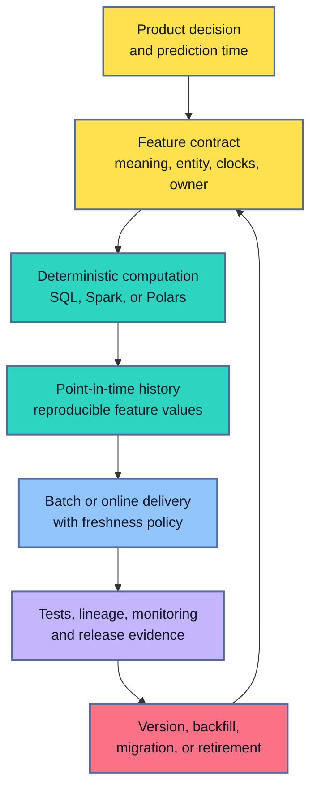
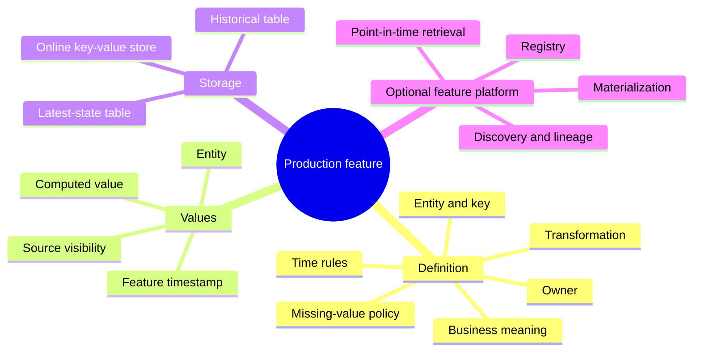
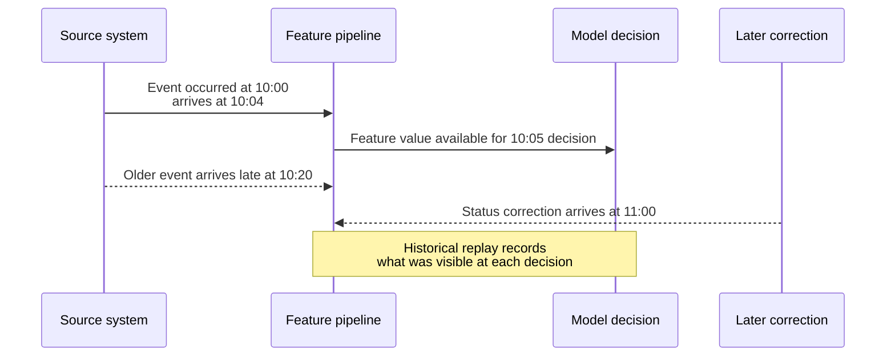
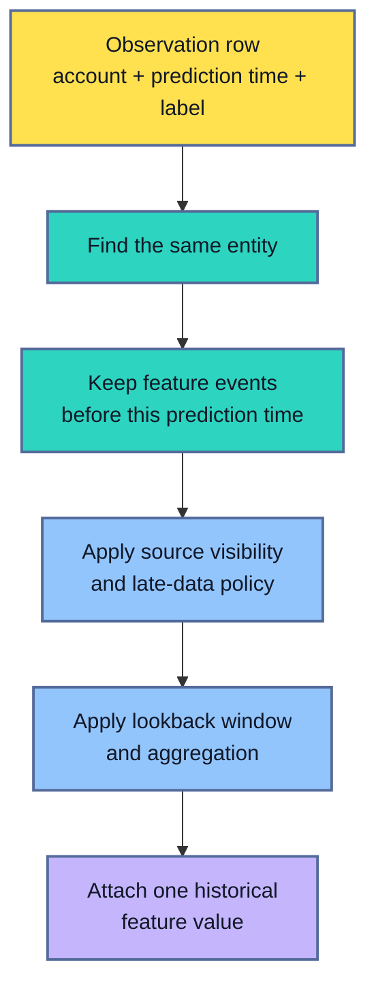
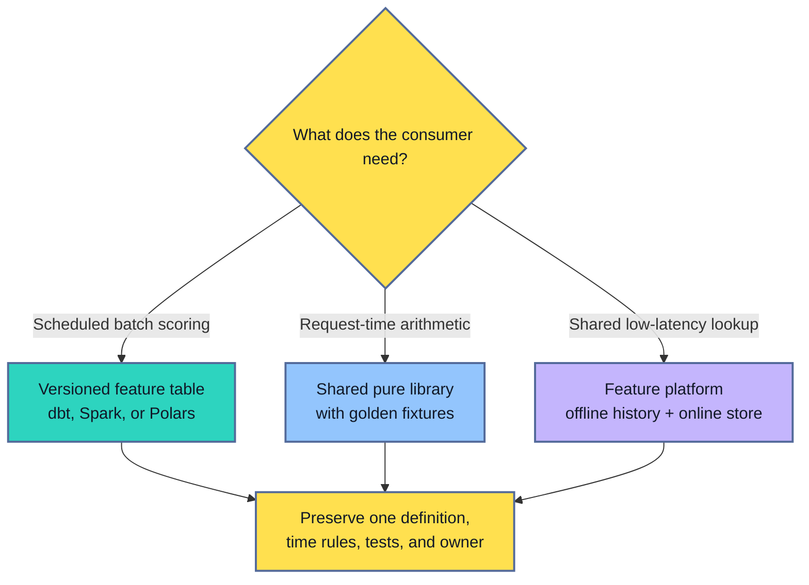
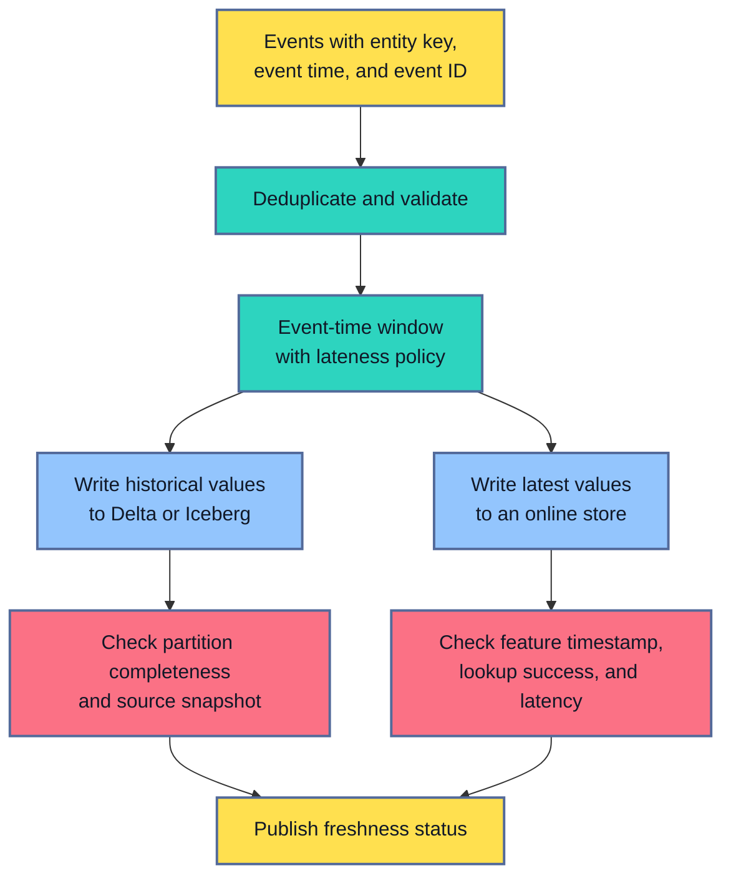
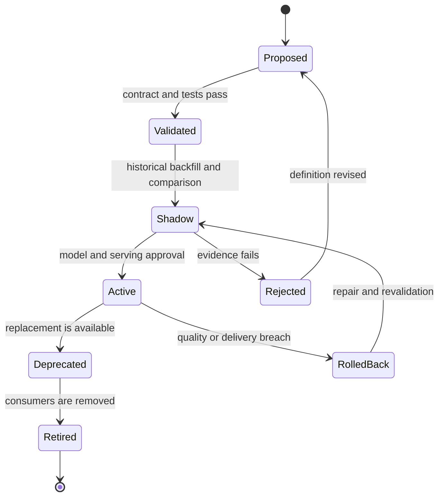

## Table of Contents

1. [From A Notebook Signal To A Production Dependency](#from-a-notebook-signal-to-a-production-dependency)
2. [Feature Definitions, Values, And Stores](#feature-definitions-values-and-stores)
3. [Start With The Decision And Its Prediction Time](#start-with-the-decision-and-its-prediction-time)
4. [Give Every Source A Meaning And An Owner](#give-every-source-a-meaning-and-an-owner)
5. [Build A Deterministic Transformation](#build-a-deterministic-transformation)
6. [Reconstruct Historical Values At Prediction Time](#reconstruct-historical-values-at-prediction-time)
7. [Choose How Training And Serving Reuse The Logic](#choose-how-training-and-serving-reuse-the-logic)
8. [Validate The Feature Contract](#validate-the-feature-contract)
9. [Materialize Values And Protect Freshness](#materialize-values-and-protect-freshness)
10. [Version, Trace, And Monitor The Feature](#version-trace-and-monitor-the-feature)
11. [Change, Backfill, And Retire Features Safely](#change-backfill-and-retire-features-safely)
12. [The Main Idea](#the-main-idea)
13. [References](#references)

## From A Notebook Signal To A Production Dependency
<!-- section-summary: A useful notebook column turns into a production feature only after its meaning, time boundary, computation, delivery, evidence, and ownership are made explicit. -->

Suppose a fraud model gains useful predictive power from `failed_payments_24h`, the number of failed payment attempts associated with an account during the previous 24 hours. The notebook result looks promising. Accounts with several recent failures are more likely to produce a disputed transaction, and the feature improves recall on a historical test set.

### The notebook proves signal, not operational meaning

The same feature can behave very differently after deployment.

The notebook may read a corrected warehouse table in which duplicate events have already been removed. A live pipeline may receive the same payment event twice after a retry. The notebook may calculate the window relative to each old authorization time. A serving job may calculate it relative to the current clock. The historical dataset may treat a missing account as zero failures, while the online lookup may return zero during a store outage. All four systems can produce a valid integer. Only some of those integers express the intended fact.

This is why production feature engineering reaches beyond writing a transformation. In essence, the team is turning a statistical idea into a maintained data product for a model. Its meaning must survive historical training, batch recomputation, live delivery, late events, source changes, and operational failures.

### The lifecycle preserves that meaning



Each step protects a different promise. The contract protects meaning. Deterministic computation gives repeated runs the same rules. Point-in-time history protects the experiment from future information. Delivery controls latency and freshness. Evidence lets a reviewer connect a model to the exact data and code that produced it. Versioning gives consumers a safe way to adopt a change.

A feature store can help with several of these responsibilities, although many teams can operate production features without one. A warehouse table built by dbt may be enough for a batch model. A governed Delta table may support training and batch inference on a lakehouse. Low-latency models shared across many teams may justify a feature platform with historical retrieval, an online store, materialization, and a registry. The architecture should follow the product need.

The lifecycle stays the same across those implementations. A team still has to state what the feature means, which past information it may use, how values are computed, how consumers receive them, how failures are detected, and who owns the repair.

## Feature Definitions, Values, And Stores
<!-- section-summary: A feature definition is the recipe, a feature value is one result, and a feature store is an optional system that manages feature metadata and retrieval. -->

People often use the word **feature** for the calculation, the resulting number, the table that stores it, and the platform that retrieves it. Those objects work together, although each solves a different problem. Separating them gives beginners a much clearer picture of what a team is building and what can fail.

### The definition is the recipe, and the value is one result

A **feature definition** is the recipe. It describes the entity, sources, time rules, transformation, data type, missing-value policy, freshness target, and owner. `failed_payments_24h` is a definition of which payment events count and how their timestamps relate to a prediction.

A **feature value** is one output of that recipe. For example, the value `3` may describe account `A17` at an authorization time of `14:05`. The entity and timestamp are part of the meaning. The number alone is incomplete.

A **feature table** stores many feature values. One row might represent an account at an hourly timestamp; another design might keep only the latest value per account. A time-series feature table preserves history, while a latest-state table serves current values efficiently.

### A feature store is an optional platform layer

A **feature store** is a platform for managing and retrieving features. Common capabilities include a registry, historical point-in-time retrieval, materialization into an online store, discovery, access control, lineage, and consistent lookup metadata. Feast offers an open-source feature-store architecture. Databricks Feature Store integrates governed feature tables and model-feature lineage with Unity Catalog. Managed cloud platforms provide related capabilities within their own ecosystems.



The distinction matters during incidents. A bad definition requires a semantic review and often a new version. Corrupt feature values may require a backfill. A broken online store calls for a delivery repair or fallback. Replacing the store cannot repair a flawed definition, and rewriting the definition cannot restore a failed serving path.

Consider three ordinary situations:

- A weekly churn model reads one governed warehouse snapshot and scores every customer in a batch. Versioned SQL models, tests, and a reproducible table may cover the full requirement.
- Several real-time risk models need the latest account features within a few milliseconds. The team now needs online materialization, freshness controls, lookup monitoring, and a clear fallback.
- Multiple groups independently calculate “active customer” with different rules. A registry and shared definitions can reduce semantic duplication even if no online store is required.

Feature-store adoption carries operating cost. Teams maintain registry changes, storage, materialization jobs, access control, SDK compatibility, and incident procedures. It pays for itself through genuine reuse, recurring point-in-time retrieval, or low-latency delivery. A feature store added only because the project uses machine learning creates another platform without resolving a demonstrated problem.

## Start With The Decision And Its Prediction Time
<!-- section-summary: A feature contract starts from the product decision, the entity being scored, and the exact instant that separates permitted history from unavailable future information. -->

Feature engineering gets much clearer after the team names the decision being supported. That decision supplies the entity, the prediction moment, and the boundary around eligible information. Without those anchors, a technically correct aggregation can still answer the wrong product question.

### The product decision defines the boundary

The safest feature design starts with the decision the model supports. Ask what the product is trying to decide, which object receives the prediction, and what information exists at that moment.

For a payment authorization, the entity may be an account and the prediction time may be the arrival of the authorization request. For next-day demand planning, the entity may be a store-item pair and the prediction time may be the planning cutoff. For a support-priority model, the entity may be a ticket and the prediction time may be its first assignment.

The **prediction time** is the boundary between history and future. It tells the feature pipeline which events are eligible for that prediction. A 24-hour window usually means:

\[
t_{\text{prediction}} - 24h \leq t_{\text{event}} < t_{\text{prediction}}
\]

The strict upper bound matters. An event recorded at or after the decision was made cannot explain what the model knew beforehand. Historical training that includes such an event gives the model information the live service will never receive.

### A contract makes the boundary reviewable

A compact feature contract makes these rules reviewable:

```yaml
feature:
  name: failed_payments_24h
  version: 3
  purpose: measure recent payment friction before authorization

  entity:
    name: account
    join_key: account_id

  source:
    dataset: governed.payments.events
    event_time: occurred_at
    observed_time: ingested_at
    deduplication_key: payment_event_id

  definition:
    window: "[prediction_time - 24h, prediction_time)"
    eligible_statuses: [declined, reversed]
    output_type: int64

  missing_values:
    no_matching_history: 0
    source_unavailable: unavailable

  freshness:
    target: 5m
    maximum: 15m

  owner: payment-risk-data
  consumers: [authorization-risk-v4]
```

The two missing-value cases deserve separate treatment. A genuine absence of failed payments can safely produce zero. A failed source read means the system lacks evidence. Returning zero for both cases hides an outage inside an apparently healthy feature value. Depending on the decision risk, the serving path might use the last trusted value, switch to a model designed for missing features, send the request to review, or reject the prediction.

The contract should also name the population. Does an account feature include guest checkouts? Are merged accounts treated as one entity? Does an employee test account count? These questions sound like data cleaning, yet they define the product meaning of the feature.

Window length belongs to the same discussion. A 24-hour window expresses a hypothesis that recent behavior matters. Changing it to seven days changes the learned signal, expected distribution, storage requirements, and serving freshness. That change deserves evaluation and a versioned release.

## Give Every Source A Meaning And An Owner
<!-- section-summary: Source contracts describe keys, clocks, corrections, units, privacy, and ownership so feature pipelines can interpret records consistently. -->

Every feature inherits assumptions from its source data. Production teams make those assumptions visible because a familiar column name can conceal a different clock, unit, correction policy, or identifier scope. Clear source meaning also identifies who can explain and repair an upstream change.

### Event time and observed time answer different questions

Source data rarely arrives with all of its semantics encoded in column types. A timestamp may mean that an action happened, that a database received it, or that a pipeline processed it. A status may be provisional. An identifier may be recycled, merged, or scoped to one region. Production features need these details before a transformation is written.

Two clocks appear often:

- **Event time** says when the real-world action occurred. A card authorization happened at `occurred_at`.
- **Observed or ingestion time** says when the platform first saw that record. The same authorization entered the analytical platform at `ingested_at`.

Event time controls the business window. Observed time helps the team reason about late data and historical availability. A payment that occurred at 10:00 but arrived at 12:00 belongs to the 10:00 business period. It was unavailable to a model scored at 11:00. A historically honest dataset may need both clocks.

Corrections add another layer. A source system can mark an event as reversed several hours later. The team has to decide whether a backtest should use the record as originally observed or the latest corrected truth. Both views are useful for different questions. An operational replay asks what the model could know then. An analytical report may ask what ultimately happened. Mixing them silently creates optimistic training data.



### Ownership connects source changes to feature repairs

Source ownership turns those semantics into an operating agreement. The source owner controls schema and event meaning. The feature owner controls transformation, quality, and consumer communication. The model owner controls model behavior and fallback. These responsibilities may sit in one team, although the distinction still helps during an incident.

A useful source agreement covers the stable key, event and ingestion timestamps, units, allowed nulls, update or deletion behavior, late-arrival expectations, retention, privacy classification, and change notification. Schema registries, dbt source definitions, Unity Catalog metadata, or a data-contract platform can hold parts of this agreement. The enforceable checks should run in the data path rather than exist only in prose.

For example, a currency amount without its currency code is unsafe for a cross-region model. A customer identifier that changes after account merging can duplicate history. A deletion request may require removal from both historical feature tables and online copies. These are feature-design concerns because they change the values a model sees.

## Build A Deterministic Transformation
<!-- section-summary: Deterministic feature logic fixes ordering, clocks, deduplication, null handling, and source versions so the same inputs produce the same outputs. -->

A production transformation should support the same calculation during development, historical replay, backfill, and incident investigation. In practical terms, the team needs to control every input that might quietly change the answer and record enough evidence to repeat the run.

### Fix every input that can change the result

A deterministic transformation produces the same feature values from the same source snapshot, parameters, and code version. This property supports debugging, backfills, model reproduction, and safe review.

Hidden access to the current clock is a common source of nondeterminism. A query that uses `CURRENT_TIMESTAMP` changes every time it runs. Pass the cutoff time as an explicit parameter instead. Ordering is another source. Selecting “the latest record” without a deterministic tie-breaker can return different rows after repartitioning. Deduplication needs a stable event key and a documented winner, such as the record with the latest observed timestamp and source sequence.

SQL and dbt fit transformations expressed through joins, filters, windows, and aggregations on a warehouse. dbt adds dependency metadata, tests, documentation, and a manifest artifact that records the project graph and compiled resources. The business rule remains visible as SQL.

```sql
with visible_events as (
    select *
    from {{ ref('payment_events') }}
    where ingested_at <= {{ var('feature_timestamp') }}
),

deduplicated as (
    select *
    from visible_events
    qualify row_number() over (
        partition by payment_event_id
        order by ingested_at desc, source_sequence desc
    ) = 1
)

select
    account_id,
    {{ var('feature_timestamp') }} as feature_timestamp,
    count_if(
        status in ('declined', 'reversed')
        and occurred_at >= {{ var('feature_timestamp') }} - interval '24' hour
        and occurred_at < {{ var('feature_timestamp') }}
    ) as failed_payments_24h
from deduplicated
group by account_id
```

The explicit `feature_timestamp` defines both the business window and the availability boundary for this materialized slice. The ordered deduplication rule produces one winner for each event ID. The orchestrator separately records the physical source snapshot used by the run, allowing the same input state to be read again.

### Choose the engine from the workload

Spark is a common choice for large lakehouse datasets, distributed joins, and pipelines that share logic between batch and structured streaming. Databricks commonly combines Spark transformations with governed Delta tables in Unity Catalog. Stable Unity Catalog feature tables are the production baseline for teams using Databricks Feature Store. The newer Databricks Feature Views capability defines reusable windowed features as governed objects, but it is currently Public Preview and requires an explicit maturity review before a critical dependency adopts it.

Polars is useful for single-machine pipelines that fit its execution model. Its lazy API builds a query plan before execution, enables optimizer work such as predicate and projection pushdown, and can stream results to supported sinks. A team may use Polars for compact batch feature jobs without deploying a Spark cluster. Data size, join shape, concurrency, team expertise, and the surrounding platform should drive the choice.

A shared Python or JVM library can reuse one pure transformation across training and serving. This works well for request-time arithmetic, normalization, or parsing with modest dependencies. It works poorly if the library secretly reads a warehouse, relies on environment-specific state, or introduces a heavy runtime into a latency-sensitive service.

Storage also affects determinism. Delta Lake and Apache Iceberg provide table snapshots and time-travel-style queries. Recording a Delta version or Iceberg snapshot ID gives a backfill a precise source state. Retention and maintenance policies must keep that snapshot available for the promised reproduction window.

Regardless of engine, deterministic feature code makes these choices explicit:

- source datasets and snapshots;
- entity keys and duplicate handling;
- event, ingestion, and prediction clocks;
- time zone and interval boundaries;
- null, unknown, and out-of-range behavior;
- category mappings and units;
- parameters and code version;
- output grain and ordering where ordering matters.

## Reconstruct Historical Values At Prediction Time
<!-- section-summary: Historical feature computation rebuilds the information available for each past decision rather than attaching the newest feature state to every row. -->

Training data asks a historical question: what would the model have known at each past decision? Answering it requires more care than joining observations to the latest feature table, because every observation has a different cutoff and may have seen a different set of records.

### Every training row has its own past

Training data usually contains many historical prediction opportunities. Each row has its own entity and prediction timestamp. The feature pipeline must reconstruct the feature value available at that row’s time.

Imagine three authorization rows for one account: Monday morning, Monday afternoon, and Tuesday morning. The account’s current failed-payment count cannot be copied onto all three rows. Monday morning may have zero previous failures, Monday afternoon may have one, and Tuesday morning may have three. Each observation needs its own historical lookup.



This operation is called a **point-in-time join**. In another phrasing, it is an as-of lookup: for each observation, select the newest eligible feature state from that observation’s past, optionally within a maximum lookback.

Raw-event aggregation can express the rule directly:

```sql
select
    p.prediction_id,
    p.account_id,
    count(e.payment_event_id) as failed_payments_24h
from prediction_spine p
left join governed.payment_events e
    on e.account_id = p.account_id
   and e.status in ('declined', 'reversed')
   and e.occurred_at >= p.prediction_at - interval '24' hour
   and e.occurred_at < p.prediction_at
   and e.ingested_at <= p.prediction_at
group by p.prediction_id, p.account_id
```

The **prediction spine** is the set of historical moments the model learns from. Each row represents an entity, a decision time, and usually a later label. The `ingested_at` condition is evaluated against that row’s prediction time. It excludes an event that occurred earlier but reached the platform after the decision, preserving what the model could actually know at that moment.

The dataset job also reads a pinned Delta version, Iceberg snapshot, or equivalent immutable source version. That run-level boundary makes the rebuild reproducible; it cannot replace the per-row availability check. Sources that overwrite corrections need append-only change history or a bitemporal representation with both business-valid and system-observed times.

### Platforms can manage the join after the time rules are clear

Feature platforms can manage this lookup for precomputed feature history. Feast historical retrieval performs point-in-time joins relative to each entity-row timestamp and respects the feature view’s lookback TTL. Databricks time-series feature tables support as-of joins through time-series columns and a `timestamp_lookup_key`. These tools reduce repeated join code, but they still need a correct entity, feature timestamp, source visibility policy, and test data.

Point-in-time lookup and table time travel answer separate questions. The lookup asks, “Which feature value belonged to this past prediction?” Table time travel asks, “Which physical version of the source or feature table did the job read?” A reproducible training dataset often needs both.

## Choose How Training And Serving Reuse The Logic
<!-- section-summary: Training and inference can reuse a table, a transformation library, or a feature platform; the right pattern depends on latency, freshness, and reuse. -->

Training and serving need the same feature meaning, but there are several sound ways to preserve it. A scheduled scoring job can read a shared table. A request-time calculation can use a shared library. A low-latency lookup shared by many models can use a feature platform. The consumer’s latency, freshness, scale, and reuse requirements decide which pattern fits.

### Share a table for scheduled training and inference

The simplest pattern is a shared precomputed table. A scheduled SQL, dbt, Spark, or Polars job writes versioned feature values. Training reads historical partitions, and batch inference reads the newest eligible partition. This pattern works well for daily or hourly scoring. It gives both paths one stored representation and avoids introducing an online system.

### Share a pure library for request-time arithmetic

A shared transformation library fits request-time features. Suppose a model uses `amount / account_limit` from two inputs already present in the request. One small typed function can run in historical dataset creation and in the serving process. Golden fixtures verify that both call sites produce identical values. The library should remain pure: inputs enter through arguments, configuration is versioned, and no hidden network call changes the result.

### Add a feature platform for repeated retrieval and online lookup

A feature platform fits repeated historical retrieval or low-latency shared features. The offline path keeps time-stamped history for training. A materialization job copies the latest eligible values to an online store. The serving path looks up values by entity key. Registry metadata connects the feature identity, storage, and consumers.



For an open-source stack, Feast can register existing batch feature data, perform historical retrieval, and materialize values into supported online stores. Feast’s stable feature views model timestamped data, while its on-demand and stream feature-view capabilities carry explicit alpha labels in current documentation. Critical production paths should avoid treating those alpha capabilities as established defaults.

On Databricks, Unity Catalog Delta tables with declared primary keys can serve as governed feature tables. Time-series feature tables support point-in-time retrieval, and model training can retain lookup metadata and lineage. Real-time use adds publication to an online store or a Databricks Online Feature Store. Teams should verify cloud-region support, latency, capacity, fallback, and cost for the selected serving path.

A dual-path design introduces a synchronization problem. Offline history may be correct while the online value is stale. An online transform may use a different library version. A new field may reach the online store before the model deployment understands it. The detailed controls belong to offline/online architecture and skew analysis, yet one release principle applies here: version the definition and validate representative values across every path before increasing traffic.

## Validate The Feature Contract
<!-- section-summary: Feature validation checks structure, meaning, time behavior, reproducibility, and delivery rather than relying on one distribution test. -->

Validation should prove that the implementation still satisfies the contract. A row count or schema check alone cannot prove that a 24-hour feature respects its time boundary.

### Structural and semantic checks protect different promises

Structural checks first verify the shape of the output. Required columns must exist, data types must match, entity keys must be present, and each entity-time row must be unique. Category values also stay within their contract.

dbt data tests fit warehouse transformations. Great Expectations, Deequ, Soda, or platform-native constraints can add richer checks where the data platform needs them. A small number of high-value assertions usually teaches the system more than a large catalog of weak tests.

Semantic fixtures cover business meaning. A readable fixture for `failed_payments_24h` might contain:

- one eligible failure just inside the window;
- one success that should be ignored;
- one failure exactly at the prediction time that should be excluded;
- one duplicate event that should count once;
- one late event unavailable at the historical visibility cutoff;
- one account with no history;
- one source failure that must stay distinct from a genuine zero.

These records can exercise SQL, Spark, or Polars transformations in CI. The expected values should come from the contract, rather than from copying the current implementation’s output.

Historical validation checks the prediction-time boundary. A useful anti-leakage test deliberately inserts a highly predictive event after the decision and confirms that the feature remains unchanged. Backfill validation runs the same code twice against the same source snapshot and parameters, then compares row counts, schema, checksums, and selected values.

Delivery validation samples recent production entities. The team reads the online value, recomputes the expected value from the governed offline history, and compares value, feature timestamp, and definition version. Mismatches are grouped by reason: late materialization, key mismatch, transformation drift, missing online row, or source correction.

### Release evidence turns checks into a decision

```yaml
release_evidence:
  contract_version: failed_payments_24h:v3
  code_revision: "${GIT_SHA}"
  source_snapshot: "${ICEBERG_SNAPSHOT_OR_DELTA_VERSION}"
  checks:
    schema_and_grain: passed
    semantic_fixtures: passed
    point_in_time_leakage: passed
    deterministic_replay: passed
    sampled_delivery_parity: passed
  limits:
    maximum_freshness: 15m
    parity_mismatch_rate: 0.1%
  approvers:
    - feature_owner
    - model_owner
```

The evidence packet gives CI and reviewers a release decision. A failed point-in-time test blocks training. A freshness miss may block online promotion while allowing a corrected batch table to publish. A small parity difference may trigger investigation if it exceeds the documented tolerance. The result is tied to a version, source snapshot, and code revision.

## Materialize Values And Protect Freshness
<!-- section-summary: Materialization turns a feature definition into stored values, while freshness controls keep those values suitable for the product decision. -->

**Materialization** is the process that computes feature values and writes them to a storage layer used by consumers. A batch materialization may rebuild an hourly Delta or Iceberg partition. An online materialization may copy the latest value for each entity into DynamoDB, Redis, Bigtable, Cosmos DB, or a managed online feature store.

### Batch is the default until the product needs streaming

Batch computation is usually the first choice for features whose freshness target is measured in hours or days. It has fewer moving parts, supports large backfills, and fits warehouse or lakehouse controls. dbt and SQL work well inside warehouses. Spark is common for large distributed datasets. Polars can run efficient single-machine jobs over Parquet or object storage.

Streaming computation is justified by a product deadline that batch processing cannot meet. A fraud decision may need activity from the previous few minutes. Spark Structured Streaming, Flink, Beam, or managed streaming services can compute event-time windows and handle late data.

A production design then specifies the lateness it will accept and how long window state remains. It names the event ID used for deduplication, the checkpoint location, and the replay procedure. Idempotent writes keep a retried event from creating a second feature value.



A **watermark** tells a streaming engine how much late event-time data the pipeline expects to tolerate before old state can be cleaned up. It is an operating tradeoff. A longer delay admits more late events and keeps more state. A shorter delay reduces state while dropping or separately handling more late records. Apache Spark documents the guarantee carefully: records less late than the configured watermark delay are retained; records later than that threshold may still be processed, although the engine does not guarantee it.

### Freshness needs a measured fallback

Freshness should be measured from the feature timestamp that matters to the product. Pipeline completion time alone can look healthy after an upstream source has stopped. Useful signals include the newest source event time, newest feature timestamp, materialization delay, percentage of entities with values, online lookup success, and age of the value returned to the model.

Suppose the online materialization falls 20 minutes behind a 15-minute maximum. The response depends on decision risk:

- A recommendation service may use the last trusted value and attach a stale-feature indicator.
- A fraud service may switch to a fallback model that excludes the feature.
- A medical or credit workflow may pause automation and route the decision to an approved review path.

The feature owner defines the policy with the model and product owners before an incident. The serving system exposes which path was used, monitoring confirms the fallback rate, and recovery compares rematerialized values against the last trusted partition before normal traffic resumes.

Delta Lake and Iceberg provide strong foundations for the historical store because they retain transactional table state, schemas, and snapshots. They do not provide a complete feature lifecycle by themselves. The pipeline still owns contract enforcement, point-in-time logic, freshness, consumer compatibility, and incident response.

## Version, Trace, And Monitor The Feature
<!-- section-summary: A production feature needs evidence that connects its definition, code, source data, materialization runs, model consumers, and live behavior. -->

A feature release affects data pipelines, training datasets, model artifacts, and sometimes an online serving path. Versioning identifies the meaning being used. Lineage connects that version to the work that produced and consumed it. Monitoring checks whether the live path continues to honor the contract.

### Version the meaning and preserve the evidence

Feature versioning protects meaning. A compatible repair might fix a pipeline retry without changing values. A semantic change such as a new window, source, entity key, default, or category mapping usually deserves a new feature version. Keeping the old version available for a migration period lets teams compare models and roll back safely.

A release should identify:

- the feature contract version;
- transformation code and configuration revision;
- source datasets and physical snapshots;
- orchestration run and materialized output;
- validation results;
- training datasets and models that consumed the feature;
- online store or endpoint deployment;
- owner, approval, and rollback target.

MLflow can record dataset inputs, source information, digests, parameters, metrics, models, and artifacts for a training run. For example, `mlflow.log_input()` can link a tracked dataset to the run, while tags can record the feature-contract and source-snapshot identifiers. MLflow evidence complements the data platform’s table history; it does not copy the complete dataset into experiment metadata.

```python
training_data = mlflow.data.from_spark(
    training_df,
    table_name="main.ml_features.authorization_training_v4",
    version=str(delta_version),
    name="authorization_training_v4",
)

with mlflow.start_run():
    mlflow.log_input(training_data, context="training")
    mlflow.set_tags({
        "feature_contract": "failed_payments_24h:v3",
        "feature_code_revision": git_sha,
        "feature_table_snapshot": table_snapshot,
    })
    train_and_log_model(training_df)
```

OpenLineage provides a vendor-neutral model for lineage events. A feature pipeline can emit a Job, a Run, and its input and output Datasets. Facets can carry source-code location, schema, data-quality assertions, and dataset version. Airflow, Spark, dbt, and lineage backends provide integrations at different maturity levels, so the team should verify the fields emitted by its actual stack.

### Monitor the path from source to outcome

Monitoring then answers whether the feature remains usable:

- **Source health:** records arrive, schemas remain compatible, and joins retain expected coverage.
- **Computation health:** jobs complete, stream lag stays bounded, and invalid rows remain below policy.
- **Freshness:** feature timestamps meet the consumer’s service level.
- **Value health:** nulls, ranges, categories, and distributions remain plausible across important segments.
- **Delivery health:** online lookups succeed within the latency budget and use the expected version.
- **Consumer health:** models still request the feature, parity remains acceptable, and fallbacks stay rare.
- **Outcome health:** model and product metrics reveal whether the signal still helps the decision.

Distribution drift alone cannot diagnose the cause. A sudden rise in failed-payment counts could reflect real customer behavior, a duplicated event stream, a status mapping change, or a model routing change. Investigation first confirms source and pipeline integrity, then compares segments, releases, and outcomes. This order prevents a legitimate behavior shift from being “fixed” through an unnecessary data rollback.

The owner needs actionable alerts. “Mean changed by 12%” may offer little direction. “The newest feature timestamp is 23 minutes old for the EU route, the source stream is current, and the online materialization job has failed” identifies the affected path, breached contract, and likely responder.

## Change, Backfill, And Retire Features Safely
<!-- section-summary: Feature changes move through a controlled state sequence so historical data, models, and serving consumers stay compatible. -->

A feature outlives the notebook that introduced it. Sources move, business rules change, models stop using it, and privacy obligations evolve. The lifecycle needs a controlled ending as well as a controlled release.

### Backfill and compare before promotion

A change review first classifies the impact. A documentation correction may leave values untouched. A deterministic bug fix may require recomputing history under a new patch release. A new window, source, unit, default, or entity definition changes the feature’s meaning and usually creates a new version.

Historical backfill runs against a recorded source snapshot policy and explicit time range. It writes to a new output version or isolated staging location. Validation compares coverage, distributions, semantic fixtures, and selected entity-time values with the previous release. The training team then retrains and evaluates affected models. For online use, the platform materializes the new version separately and compares sampled values before traffic moves.



A shadow period lets the new version run without controlling the product decision. Batch models can compare predictions from old and new training datasets. Online models can log both feature values and keep the established version as the decision input. Promotion follows agreed quality, latency, freshness, and outcome evidence.

### Retirement follows the dependencies

Deprecation requires consumer discovery. Registry metadata and Unity Catalog lineage reveal declared consumers. OpenLineage graphs reveal pipeline relationships. Repository search finds static references, while online lookup telemetry finds live reads.

The owner announces the replacement and migration deadline, then watches remaining reads throughout the support window. Retirement first stops new consumption. The team can then remove scheduled jobs and online materializations, followed by access grants, alerts, and retained data according to policy.

Deletion has to include every copy. A sensitive feature may exist in historical Delta or Iceberg tables, an online store, cached serving payloads, training datasets, experiment artifacts, and debug logs. Governance controls and retention policies should identify those locations before the first release.

Ownership connects the whole process. The feature owner approves meaning and validation. The source owner communicates upstream changes. Platform owners operate storage and materialization. Model owners evaluate consumer impact. Product or risk owners approve degraded-mode behavior. Clear ownership keeps a stale or incorrect feature from sitting between teams during an incident.

## The Main Idea
<!-- section-summary: Production feature engineering preserves one reviewed meaning across historical computation, delivery, monitoring, and change. -->

A feature starts as a hypothesis about information that may help a decision. Production engineering gives that hypothesis a durable contract: entity, clocks, source meaning, transformation, missing-value behavior, freshness, evidence, and owner.

The implementation can use dbt and SQL, Spark and Databricks, Polars, or a shared library. Delta Lake and Iceberg can preserve historical table state. Feast or a managed feature store can add registry, point-in-time retrieval, and online materialization after reuse or latency requirements justify the platform. MLflow and OpenLineage can connect training and pipeline evidence to the resulting models.

The tools vary. The core test stays practical: given an entity and a past decision time, can the team explain the value the model received, reproduce it from governed inputs, detect if it is late or wrong, and move consumers safely to a repaired version?

## References

- [dbt data tests](https://docs.getdbt.com/docs/build/data-tests)
- [dbt manifest JSON](https://docs.getdbt.com/reference/artifacts/manifest-json)
- [Apache Spark Structured Streaming programming guide](https://spark.apache.org/docs/latest/streaming/index.html)
- [Polars lazy API](https://docs.pola.rs/user-guide/lazy/)
- [Delta Lake utility commands and table history](https://docs.delta.io/delta-utility/)
- [Apache Iceberg Spark queries](https://iceberg.apache.org/docs/latest/spark-queries/)
- [Apache Iceberg maintenance](https://iceberg.apache.org/docs/latest/maintenance/)
- [Feast feature views](https://docs.feast.dev/getting-started/concepts/feature-view)
- [Feast point-in-time joins](https://docs.feast.dev/getting-started/concepts/point-in-time-joins)
- [Databricks Feature Store](https://docs.databricks.com/aws/en/machine-learning/feature-store/)
- [Databricks Feature Store overview and glossary](https://docs.databricks.com/aws/en/machine-learning/feature-store/concepts)
- [Databricks feature tables in Unity Catalog](https://docs.databricks.com/aws/en/machine-learning/feature-store/uc/feature-tables-uc)
- [Databricks Feature Views](https://docs.databricks.com/aws/en/machine-learning/feature-store/feature-views)
- [MLflow dataset tracking](https://mlflow.org/docs/latest/dataset/)
- [MLflow Tracking](https://mlflow.org/docs/latest/tracking/)
- [OpenLineage object model](https://openlineage.io/docs/spec/object-model/)
