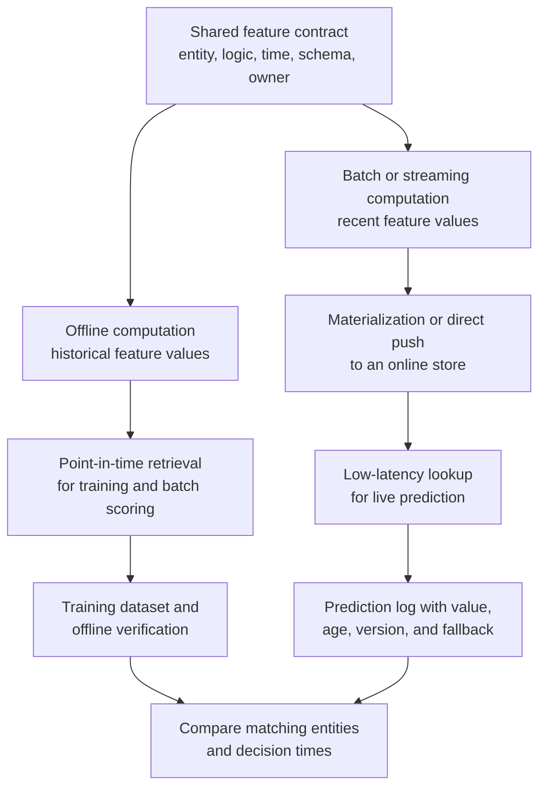
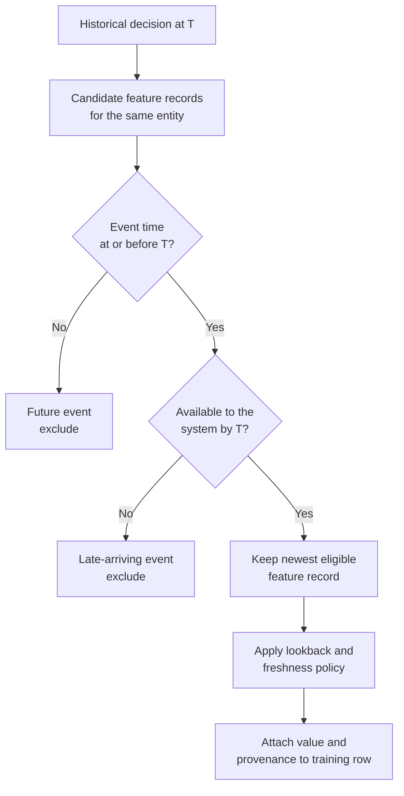
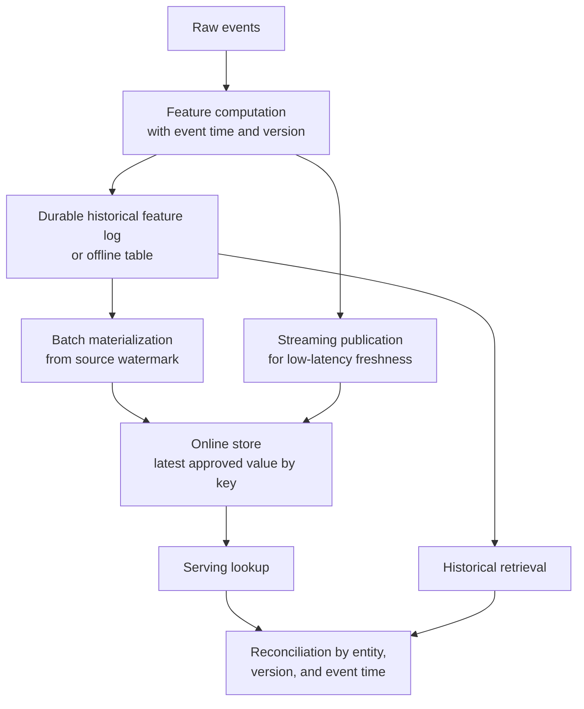
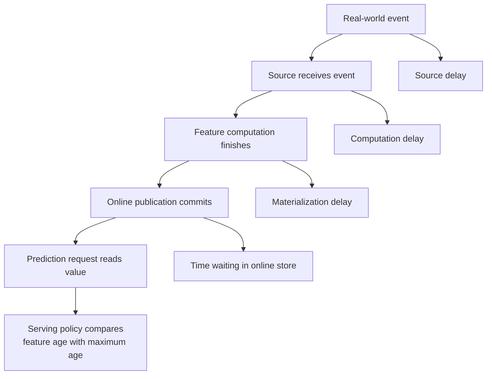
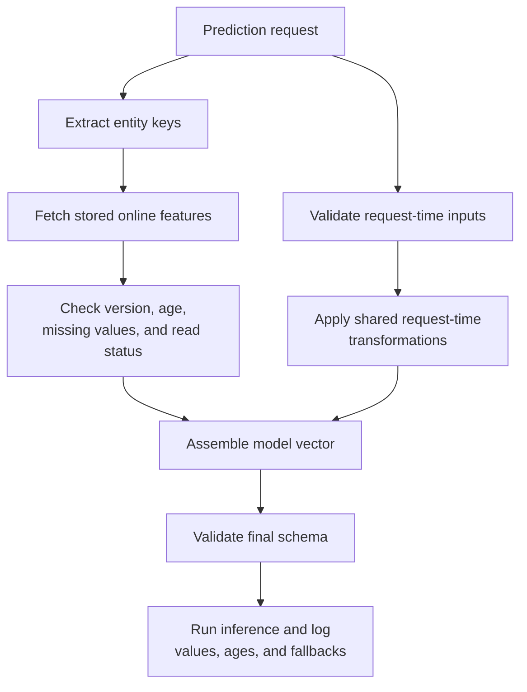
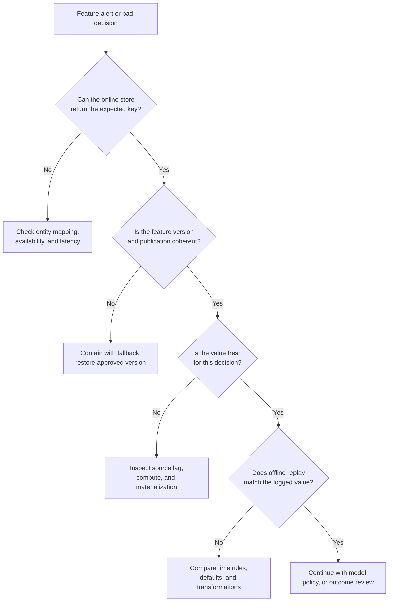
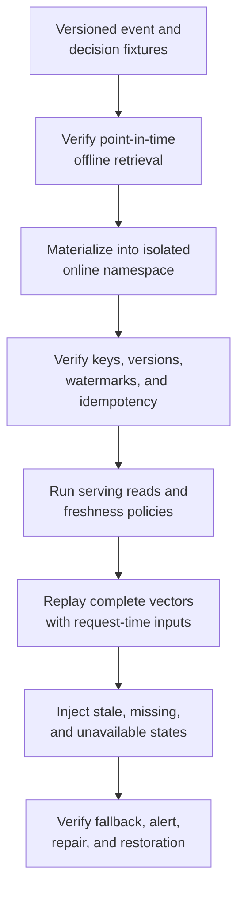

## Table of Contents

1. [What Problem Are We Solving?](#what-problem-are-we-solving)
2. [Why Training And Live Predictions Need The Same Feature Meaning](#why-training-and-live-predictions-need-the-same-feature-meaning)
3. [How Training Retrieves Historical Feature Values](#how-training-retrieves-historical-feature-values)
4. [How Live Predictions Retrieve Current Feature Values](#how-live-predictions-retrieve-current-feature-values)
5. [Use Only Feature Values Available At Each Historical Cutoff](#use-only-feature-values-available-at-each-historical-cutoff)
6. [Publish Calculated Features From Offline Storage To Online Storage](#publish-calculated-features-from-offline-storage-to-online-storage)
7. [Record How Old Each Feature Value Is](#record-how-old-each-feature-value-is)
8. [Keep Historical And Live Calculations Consistent](#keep-historical-and-live-calculations-consistent)
9. [Combine Stored Features With Values Calculated During The Request](#combine-stored-features-with-values-calculated-during-the-request)
10. [Respond Safely To Stale, Missing, Or Mismatched Features](#respond-safely-to-stale-missing-or-mismatched-features)
11. [Test Historical And Live Retrieval With The Same Cases](#test-historical-and-live-retrieval-with-the-same-cases)
12. [Choose A Feature Platform Only When The Workload Needs It](#choose-a-feature-platform-only-when-the-workload-needs-it)
13. [Decide Who Owns Definitions, Storage, And Incidents](#decide-who-owns-definitions-storage-and-incidents)
14. [The Main Idea](#the-main-idea)
15. [References](#references)

## What Problem Are We Solving?
<!-- section-summary: Offline and online feature paths give the same model input two delivery methods suited to historical learning and live decisions. -->

Suppose a payment-risk model uses `failed_attempts_10m`, the number of failed payment attempts for one account during the previous ten minutes.

During training, the team has millions of old payment decisions. For each decision, it needs the count that was available at that historical moment. Reading today's count would give every old row future information.

During production, the service receives one payment request and needs the newest count in a few milliseconds. Running a large warehouse query for each request would make checkout slow and fragile.

This is the actual online-versus-offline decision. The model needs one feature meaning through two retrieval paths:

- The **offline path** reconstructs historical feature values for training, evaluation, batch inference, backfills, and investigations.
- The **online path** retrieves recent feature values for synchronous prediction under a strict latency budget.

An offline store usually keeps history and supports large scans. An online store usually keeps the latest value, or a small recent window, under each entity key. The online path may use Redis, DynamoDB, Cassandra, Bigtable, a managed feature store, or another low-latency database.

Many ML systems need only the offline path. Batch forecasts, periodic customer scores, and models whose inputs arrive entirely inside the request may never need a separate online store. The second path earns its cost when live predictions depend on shared features that are too expensive or too slow to calculate during the request.

## Why Training And Live Predictions Need The Same Feature Meaning
<!-- section-summary: A shared contract fixes feature meaning while each delivery path receives its own time, latency, freshness, and fallback policy. -->

Training looks backward at past decisions, while live prediction needs a current value. Both paths still need the feature to describe the same fact. A shared **feature contract** records that meaning independently of the storage product used to deliver it.

For `failed_attempts_10m`, the contract identifies the account as the entity and payment attempts as the source. It also defines the ten-minute window and the rules for event time and availability time. Data type, default behaviour, owner, and version complete the shared meaning. The online delivery policy adds maximum age, read latency, and fallback.

```yaml
feature:
  name: failed_attempts_10m
  version: v3
  entity_key: account_id
  data_type: int64
  definition: "Failed payment attempts in the ten minutes before decision_time."
  source: payment_attempt_events
  event_time: attempted_at
  available_time: ingested_at
  owner: payments-risk-data

offline:
  point_in_time_key: decision_time
  maximum_lookback: 10m

online:
  maximum_age: 90s
  read_budget_p95: 8ms
  missing_policy: route_to_rules
  stale_policy: route_to_rules
```

`maximum_lookback` describes which events contribute to the calculation. `maximum_age` describes how old the materialized result may be during a live decision. They solve different timing questions.



The contract keeps meaning stable. Delivery configuration lets the offline path favor historical correctness and the online path favor bounded latency and recent data.

## How Training Retrieves Historical Feature Values
<!-- section-summary: Offline retrieval builds historically correct feature values from durable event history for training, evaluation, batch work, and audits. -->

Training needs the feature value that belonged to each past decision, rather than the value stored today. The **offline path** answers that historical question. It rebuilds the information available for every old decision instead of returning today's state.

It commonly runs in a warehouse, lakehouse, or distributed batch engine. Typical foundations include BigQuery, Snowflake, and Databricks. Spark and object storage with Delta Lake or Apache Iceberg support another common design. These systems can scan long histories, join many entities, recompute feature windows, and write versioned training datasets.

Offline feature data usually keeps several records per entity. One account can have a new feature value every minute. History is essential because a training row from last month needs the value from that moment, while a row from yesterday needs a later value.

The offline path supports more than model training:

- Evaluation needs the same historically correct inputs as training.
- Batch scoring retrieves current or as-of features for many entities at once.
- Backfills rebuild older windows after source or logic repairs.
- Investigations reconstruct the vector used around a bad decision.

### A Historical Lookup At One Prediction Time

Imagine a churn model with `support_tickets_30d`. A customer opened two tickets before a renewal decision and three more after it. The training row should contain `2`. A query that joins the latest aggregate gives the row `5` and leaks future behaviour into training.

The offline store therefore needs event timestamps and durable history. It may also need an **available time**, sometimes called created or ingestion time, to show whether the feature system had received the event by the decision.

### What Historical Retrieval Must Guarantee

A trustworthy offline retrieval records the feature version, source snapshot, entity key, decision time, feature event time, and availability time. It should reproduce the same logical values during a rerun and keep late-arriving data under an explicit policy.

Verification starts with tiny time-boundary fixtures. Place one event before the decision, one exactly at the boundary, one after it, and one that happened earlier but arrived later. The contract decides which records qualify, and the test asserts the resulting feature value.

## How Live Predictions Retrieve Current Feature Values
<!-- section-summary: Online retrieval returns recent feature values by entity key within the latency and availability budget of a live prediction. -->

A live prediction needs an approved feature value for the current request. The **online path** retrieves that value under a latency, freshness, and failure policy.

An online store organizes values around fast entity-key lookup. A risk service sends an `account_id`; the store returns the latest approved values for that account. The database may retain only one record per key or a short time window, depending on the product and retrieval pattern.

Low latency matters because feature retrieval shares the request budget with the rest of the service. Authentication, input validation, request-time computation, model inference, policy logic, and network overhead all consume part of that budget. A model endpoint with a 100-millisecond objective cannot spend 90 milliseconds waiting for features.

Teams therefore monitor percentiles such as p50, p95, and p99. An average can hide a small group of requests suffering severe delay. They also bound the number of network round trips. Fetching a feature vector in one batched request is usually safer than making a separate call for every feature.

### The Latest Stored Value May Still Be Too Old

The online result should contain more than the number:

```text
entity_key
feature_name
feature_value
feature_version
event_time
materialized_at
source_watermark
```

These fields let the serving service calculate age and confirm the expected version. A successful key-value read proves availability. It gives no assurance that the value is fresh or that materialization reached the latest source data.

### Define What Happens After A Lookup Fails

Every online feature needs a response for four outcomes. A fresh value continues to inference. A stale or missing value may use a governed default, a recent cached value, or a backup source. A failed read may choose a simpler model, route to deterministic rules, or decline the decision.

The response depends on consequence. A recommendation model may tolerate a default popularity score. A fraud or safety decision may need a conservative rules path after a critical feature expires.

## Use Only Feature Values Available At Each Historical Cutoff
<!-- section-summary: Point-in-time joins select feature values known by each historical decision and block future or late-arriving information. -->

**Point-in-time correctness** means every training row receives feature values that the production system could have used at that row's decision time.

This requires two boundaries:

- **Event time** records when the real-world fact happened.
- **Available time** records when the feature system could use that fact.

Suppose a bank account changed address before a payment, but the change reached the feature pipeline several hours after the decision. The event time is early enough; the available time is too late. Historical training should exclude that update because production lacked it.



A focused SQL pattern ranks only eligible values:

```sql
WITH eligible_features AS (
  SELECT
    d.decision_id,
    d.account_id,
    d.decision_time,
    f.failed_attempts_10m,
    f.feature_event_time,
    f.feature_available_at,
    ROW_NUMBER() OVER (
      PARTITION BY d.decision_id
      ORDER BY
        f.feature_event_time DESC,
        f.feature_available_at DESC,
        f.feature_record_id DESC
    ) AS feature_rank
  FROM historical_decisions d
  LEFT JOIN account_risk_features f
    ON f.account_id = d.account_id
   AND f.feature_event_time <= d.decision_time
   AND f.feature_available_at <= d.decision_time
)
SELECT *
FROM eligible_features
WHERE feature_rank = 1;
```

The final record ID makes selection deterministic where timestamps tie. A bounded feature can add a lookback predicate so very old values produce an explicit missing state.

Feast historical retrieval and Databricks time-series feature tables support point-in-time joins. A warehouse team can implement the same rule in reviewed SQL. The important evidence is the time boundary and selected source record, not the library name.

## Publish Calculated Features From Offline Storage To Online Storage
<!-- section-summary: Materialization publishes computed feature values into low-latency storage while preserving entity, version, and event-time identity. -->

Live requests need recent values in storage that can answer quickly. **Materialization** moves approved feature values from the durable historical source into that online storage before requests arrive.

There are two common patterns.

In a **batch materialization**, a scheduled job reads new or changed feature rows from the offline source and upserts them into the online store. Daily aggregates may run every day. Rapidly changing features may run every few minutes.

In a **streaming publication**, a stream processor computes feature updates and writes them to the online path as events arrive. It should also preserve a historical copy for training and replay. Feast push sources can send values to online and offline destinations. SageMaker Feature Store can ingest records into online and offline storage through batch or streaming APIs.



### Publish Updates Without Mixing Old And New Values

The logical feature identity binds the entity to an approved feature definition and version. The physical lookup key often remains the entity key inside a versioned feature table, feature group, or namespace. Some stores encode more information in the physical key, so the exact layout depends on the implementation. Each record also needs an event timestamp. The writer should reject or ignore an older update arriving after a newer one. Amazon SageMaker Feature Store keeps the record with the latest event time in its online store. Historical records remain available offline.

Retries must be idempotent. Publishing the same record twice should leave one visible latest value. A materialization run records its source watermark, successful end time, written-row count, rejected-old-row count, and destination identity.

Backfills need special care. Rebuilding historical values should update the offline history without replacing a newer online value. If a corrected historical record also changes the current feature, publish that current correction through a reviewed path with a new source watermark.

## Record How Old Each Feature Value Is
<!-- section-summary: Freshness combines source delay, computation delay, publication delay, and serving age into one decision policy. -->

A feature value can have the correct type and meaning yet still be too old for the current decision. That is the role of **freshness**: it tells the serving system whether a value is recent enough to trust for a specific use. Freshness belongs to the feature contract because different decisions tolerate different delays.

For a slowly changing customer tier, yesterday's value may be acceptable. For available inventory or failed payment attempts, a value several minutes old may misrepresent the current situation.

Freshness has several contributing delays:

- **Source delay** measures how late raw events reach the platform.
- **Computation delay** measures how long feature logic takes to produce a value.
- **Materialization delay** measures how long the value waits before reaching the online store.
- **Read age** measures the gap between the request time and the feature's event or availability time.



The feature contract turns those delays into an operational objective. If `failed_attempts_10m` has a maximum age of 90 seconds, the serving service compares request time with the approved timestamp and invokes the stale-value policy after that limit.

Record TTL and feature freshness are separate controls. TTL tells a store when it may remove a record. Freshness tells the application whether the value is still suitable for a decision. A record can remain physically present after its business usefulness has expired.

The request log should capture feature age, source watermark, and fallback outcome. Dashboards then show p50, p95, and p99 age by feature, model route, region, and materialization version.

## Keep Historical And Live Calculations Consistent
<!-- section-summary: Offline and online paths stay synchronized through shared logic, versions, keys, timestamps, defaults, and evidence. -->

Two columns with the same name can still carry different values for valid operational reasons or because one path has drifted.

The paths need agreement across several dimensions:

- entity keys and key normalization;
- feature definition and version;
- source events and filters;
- aggregation windows and boundary inclusion;
- event-time and available-time rules;
- types, units, null semantics, and defaults;
- publication watermark and freshness policy.

Suppose offline SQL defines a ten-minute window as `(T - 10m, T]`, while a stream processor uses `[T - 10m, T)`. Events exactly on a boundary create different values. A shared feature name cannot reveal that difference.

### Choose How The Two Paths Share Logic

The strongest pattern uses one computation to produce versioned values for both durable history and online serving. This works well for streaming features because both paths receive the same result.

Batch features often use the offline table as the source of truth and materialize from it. The online record carries the source row's event time and feature version, which allows reconciliation.

Some systems maintain separate SQL and streaming implementations. Those teams need a golden fixture suite that runs against both engines, plus replay tests over representative event windows.

### Compare Historical And Live Values For The Same Entities

The serving path logs the actual vector or a governed reference to it, including version and timestamps. A comparison job takes sampled prediction requests, reconstructs offline features as of each request time, and compares values under feature-specific tolerances.

Exact categorical values should match. Floating-point aggregates may need a small tolerance if approved execution engines produce minor numerical differences. The report groups mismatches by cause. Freshness and missing-entity groups point to delivery problems. Version, boundary-rule, and default groups point to contract differences. A tolerance group isolates approved numerical variation.

This comparison detects path divergence. It also exposes the operational reason, which gives the owning team a concrete repair.

## Combine Stored Features With Values Calculated During The Request
<!-- section-summary: Request-time features come directly from the live request or a synchronous dependency and join stored features before inference. -->

Some information exists only for the current decision. A route distance depends on the proposed origin and destination. A cart total depends on the items in the current checkout. A query embedding depends on the text the user just submitted.

These are **request-time features**. They usually arrive in the request payload or come from a synchronous service. They join online-store values before model inference.



The transformation from raw request field to model input needs the same versioned logic in offline replay. If production calculates `cart_value_log = log1p(cart_total)` but training used the raw total, the stored features can be perfectly synchronized while the final vectors still differ.

Request-time dependencies also consume latency and need fallbacks. A route service timeout may trigger a cached estimate, a simpler model, or a deterministic response. The prediction log records which path produced each value.

## Respond Safely To Stale, Missing, Or Mismatched Features
<!-- section-summary: Feature-path incidents need containment based on freshness, key correctness, publication state, online availability, and model consequence. -->

Online and offline feature paths cross several systems, so failure can enter at different boundaries. In essence, diagnosis means finding the first boundary where the expected value stopped moving correctly. The serving team should contain unsafe decisions first. Investigators then trace the entity key and feature version back through the path. Timestamps and watermarks reveal the point where data stopped advancing.

A **stalled materialization job** leaves the online store readable but stale. The service checks feature age and follows the stale policy while the data owner restores the job.

A **stream consumer lag** affects rapidly changing features. Containment may route high-risk requests to rules or a simpler model. Restarting the consumer alone is insufficient; the owner verifies offsets, watermarks, and online age after catch-up.

An **entity-key mismatch** produces missing values for valid entities. Investigation compares request keys, offline keys, normalization rules, and lookup miss rate by client version or region.

An **out-of-order update** can replace a recent value with an older one if the writer ignores event time. Repair restores the latest valid record and hardens the write condition.

A **partial feature-group update** can mix values from different publication moments. Critical vectors may require a shared snapshot or publication version so the serving service accepts only a coherent group.

An **online-store latency spike or outage** threatens the request objective. The service uses its pre-approved fallback and the platform owner checks hot keys, throttling, capacity, network health, and recent schema changes.

An **offline backfill collision** may replay old values into the online store. Materialization policy should prevent historical corrections from overwriting a newer event-time record.



Containment policy belongs in the feature contract and serving configuration. The incident is a poor time to invent a default for a safety-critical value.

## Test Historical And Live Retrieval With The Same Cases
<!-- section-summary: End-to-end verification proves historical correctness, online freshness, synchronization, fallback, and recovery before feature release. -->

Feature verification covers the definition, both delivery paths, and the bridge between them. Use an end-to-end rehearsal of the whole feature journey. Construct a known historical value, publish it, read it through serving, and prove the final model vector. This catches problems that an isolated SQL test or online-store health check cannot see.

Start with a versioned fixture of events and historical decisions. Assert the offline value for time boundaries, late-arriving data, missing history, duplicate timestamps, and lookback expiry.

Run materialization into an isolated online namespace. Check the written entity keys, feature version, event time, source watermark, row counts, and rejection of older updates. Retry the same materialization and confirm that the visible values remain unchanged.

Read online features through the same client used by serving. Measure p50, p95, and p99 latency. Verify fresh, missing, stale, wrong-version, and read-error outcomes against the serving policy.

Replay several historical requests through the final vector assembly path. Reconstruct stored features offline, inject the original request-time data, and compare the full vector field by field.

Finally, exercise recovery. Pause materialization or route the client to an unavailable online namespace. Confirm the approved fallback, alert, logs, and restoration checks.



A feature is ready after this path proves the expected values and the expected failure response. A successful online read by itself covers only one small part of the system.

## Choose A Feature Platform Only When The Workload Needs It
<!-- section-summary: Industrial feature stacks combine historical storage, transformation, low-latency serving, orchestration, and optional feature-management platforms. -->

The architecture can begin with ordinary data infrastructure. A feature platform packages recurring responsibilities, but the underlying jobs remain familiar: preserve history, calculate features, publish recent values, retrieve them quickly, and record evidence. The right stack depends on how many models share features and how much platform work the team can operate.

A common baseline uses a warehouse or lakehouse for historical feature values. dbt or Spark performs batch transformations. Kafka with Flink or Spark Structured Streaming handles fast updates, while Redis or DynamoDB provides low-latency lookup. Airflow, Dagster, or a managed workflow service schedules materialization and backfills. This design works well where a small number of models can share clear contracts without a dedicated feature platform.

**Feast** adds an open-source feature registry and retrieval layer over chosen offline and online stores. Its historical retrieval supports point-in-time joins. Materialization loads feature values into the online store, which normally keeps the latest value for each entity key. Push sources can publish fresh values to online and offline destinations. The team still owns feature computation pipelines, storage, orchestration, and operations.

**Amazon SageMaker Feature Store** provides managed feature groups with online, offline, or combined storage. The online store keeps the latest record for low-latency inference, while the offline store preserves historical records in Amazon S3 for training and batch work. Records can enter through streaming or batch ingestion.

**Databricks Feature Engineering in Unity Catalog** provides governed feature tables, lineage, discovery, and point-in-time joins. Its recommended managed serving path is Databricks Online Feature Store, powered by Lakebase Autoscaling. A Unity Catalog feature table remains the durable offline source, and `publish_table` synchronizes its values into the low-latency store.

Databricks supports three synchronization modes. `TRIGGERED`, the default, runs incremental updates through an API call or schedule. `CONTINUOUS` keeps a streaming pipeline running for fast updates. `SNAPSHOT` performs a full point-in-time copy and suits bulk replacement. Teams that need a separately operated store can still publish to a supported third-party destination such as DynamoDB.

The current Online Feature Store and legacy Databricks online tables are different products. Legacy online tables are no longer supported. New feature-serving designs should use the Lakebase-backed Online Feature Store, or a supported third-party store where its operational tradeoffs are intentional.

Cloud-managed and commercial feature platforms can reduce platform engineering. They still need a contract for identity and time so both paths select the same logical value. Freshness and materialization rules control how that value reaches production. Fallback and ownership rules govern failures. A product selection cannot decide how old an inventory count may be or whether a missing risk feature should block a transaction.

## Decide Who Owns Definitions, Storage, And Incidents
<!-- section-summary: Clear owners connect source health, feature meaning, materialization, online reliability, serving fallback, and model use. -->

The two-path design crosses team boundaries. Clear ownership answers two practical questions during an incident: who can repair the broken boundary, and who can decide whether predictions remain safe? Ownership should match the failure boundary.

The source owner maintains event schema, availability, and correction policy. The feature owner maintains the definition, entity keys, time rules, tests, version, and freshness target. The platform owner maintains offline storage, materialization, online capacity, access, and observability. The serving owner maintains lookup integration, request-time transformations, latency budget, fallback, and prediction logging. The model owner confirms that training and serving reference the approved feature version.

Operational objectives follow those responsibilities. Useful signals include source watermark delay, materialization success and lag, online read latency, missing-key rate, feature age, version mismatch, fallback rate, and offline-online comparison results.

An alert should identify the feature, model route, affected segment, latest source watermark, current age, fallback status, and owning team. That context lets the first responder contain the decision path before tracing the deeper cause.

## The Main Idea
<!-- section-summary: One feature meaning needs a historically correct path for learning and a fresh low-latency path for live decisions. -->

Offline and online features are two delivery paths for the same model input. The separation exists because learning from history and serving a live request place very different demands on storage and computation.

The offline path preserves history and reconstructs what was knowable for each past decision. The online path delivers recent values under the live request's latency and availability budget. Materialization or streaming publication connects them.

Reliable operation depends on shared semantics and observable delivery. Entity keys, feature versions, event and availability time, window boundaries, defaults, freshness, request-time transformations, and fallbacks must agree. Point-in-time tests prove historical reconstruction. Online probes prove latency and freshness. Vector replay compares the actual serving input with the value reconstructed from history. Failure injection confirms that stale, missing, or unavailable features follow the approved safety path.

Start with an offline path for every model that learns from historical data. Add an online path only for live decisions that need shared, precomputed features under a tight latency budget. That choice keeps the design proportional to the production problem.

## References

- [Feast documentation: Online store](https://docs.feast.dev/getting-started/components/online-store)
- [Feast documentation: Point-in-time joins](https://docs.feast.dev/getting-started/concepts/point-in-time-joins)
- [Feast documentation: Quickstart workflow and materialization](https://docs.feast.dev/getting-started)
- [Feast documentation: Push sources](https://docs.feast.dev/reference/data-sources/push)
- [Amazon SageMaker AI documentation: Feature Store](https://docs.aws.amazon.com/sagemaker/latest/dg/feature-store.html)
- [Amazon SageMaker AI documentation: Feature Store concepts](https://docs.aws.amazon.com/sagemaker/latest/dg/feature-store-concepts.html)
- [Amazon SageMaker AI documentation: Online store](https://docs.aws.amazon.com/sagemaker/latest/dg/feature-store-storage-configurations-online-store.html)
- [Amazon SageMaker AI documentation: Record TTL](https://docs.aws.amazon.com/sagemaker/latest/dg/feature-store-time-to-live.html)
- [Databricks documentation: Feature Store](https://docs.databricks.com/aws/en/machine-learning/feature-store/)
- [Databricks documentation: Point-in-time feature joins](https://docs.databricks.com/aws/en/machine-learning/feature-store/time-series)
- [Databricks documentation: Online Feature Stores](https://docs.databricks.com/aws/en/machine-learning/feature-store/online-feature-store)
- [Databricks documentation: Migrate from legacy and third-party online tables](https://docs.databricks.com/aws/en/machine-learning/feature-store/migrate-from-online-tables)
- [Databricks documentation: Publish features to a third-party online store](https://docs.databricks.com/aws/en/machine-learning/feature-store/publish-features)
