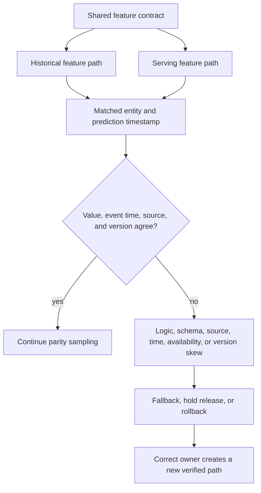

## Skew Is A Broken Feature Contract
<!-- section-summary: Training-serving skew occurs when an apparently shared feature has different values or meaning offline and online. -->

**Training-serving skew** occurs when the feature values used to train a model differ systematically from the values supplied during production prediction. The endpoint can remain healthy and schemas can match while the model interprets a different world.

The complete skew taxonomy includes:

1. Logic and transformation differences.
2. Schema, encoding, unit, and default differences.
3. Source and materialization differences.
4. Event-time, point-in-time, and freshness differences.
5. Request-only or unavailable features.
6. Version and configuration mismatches.

Prevention starts with a shared feature contract. Detection compares offline and online values, validates payloads, checks feature health, and monitors distributions. Incident response identifies the first mismatched layer and applies a safe fallback or rollback.



The comparison needs matched entities and times because two independently sampled populations can differ for legitimate reasons. Classification then points to the responsible layer and response. This avoids treating every skew alert as a model retraining problem.

## The Feature Contract Defines Meaning Once
<!-- section-summary: A feature contract records entity, value, units, transformation, source, event time, freshness, defaults, and ownership. -->

A name such as `nearby_drivers` is insufficient. The contract should say which drivers count, within which distance, at which timestamp, under which eligibility filters, in which unit, and how missing or stale data is handled.

```yaml
feature: nearby_available_drivers_2km
entity: pickup_zone_id
prediction_time: request_ts
definition: "Count online, unassigned standard-ride drivers within 2 km."
offline_source: warehouse.driver_location_snapshots
online_source: dispatch.driver_supply_service
freshness: "latest event at or before request_ts; max age 30 seconds"
dtype: int64
default:
  value: 0
  allowed_when: "fallback policy is active"
owner: dispatch-ml-platform
```

Offline and online implementations can use different systems while obeying the same semantic contract. Golden entities and timestamps make that contract testable.

The production prediction record needs enough state to reproduce one comparison. For request `ride_7842`, the serving path can log the entity, prediction timestamp, feature value, event timestamp, feature-set version, and whether fallback ran:

```json
{
  "request_id": "ride_7842",
  "pickup_zone_id": "zone_17",
  "prediction_ts": "2026-07-14T08:03:25Z",
  "feature_set": "dispatch_features_v12",
  "features": {
    "nearby_available_drivers_2km": {
      "value": 14,
      "event_ts": "2026-07-14T08:03:12Z",
      "source_version": "supply-service-6f82c1",
      "fallback_used": false
    }
  }
}
```

Without the event timestamp, an investigator cannot tell whether `14` was correct and stale or freshly wrong. Without the concrete feature-set and source versions, a canary that mixes versions can hide the failing population inside aggregate metrics. These fields form the join key between online evidence and offline recomputation.

## Logic Skew Changes The Transformation
<!-- section-summary: Logic skew comes from different filters, windows, formulas, units, or preprocessing code. -->

Offline SQL may calculate a thirty-minute median while the online service calculates a mean. One path may exclude cancelled events. One may use kilometres and the other miles. Text preprocessing may lowercase offline and preserve case online.

Shared transformation libraries reduce duplication when both paths can use the same code. They do not solve differences in source systems, time semantics, or deployment version. Code generation from one contract can help, while parity tests remain necessary.

Golden fixtures should run through both implementations and compare values under declared tolerances. Include missing values, boundary times, unseen categories, and fallback conditions.

This contract describes the latest known state of each driver, with a maximum age of 30 seconds. The historical query must first select each driver's latest eligible event, then count only drivers whose selected state matches the availability filters. Counting every available event in a time window would include a driver assigned later in the same window.

```sql
WITH eligible_driver_events AS (
  SELECT
    driver_id,
    pickup_zone_id,
    event_id,
    event_ts,
    distance_meters,
    availability_state,
    ride_type
  FROM driver_supply_events
  WHERE event_ts >= TIMESTAMP '2026-07-14 08:02:55+00'
    AND event_ts <= TIMESTAMP '2026-07-14 08:03:25+00'
    AND ingested_at <= TIMESTAMP '2026-07-14 08:03:25+00'
),
latest_driver_state AS (
  SELECT
    *,
    ROW_NUMBER() OVER (
      PARTITION BY driver_id
      ORDER BY event_ts DESC, event_id DESC
    ) AS state_rank
  FROM eligible_driver_events
)
SELECT COUNT(*) AS nearby_available_drivers_2km
FROM latest_driver_state
WHERE state_rank = 1
  AND pickup_zone_id = 'zone_17'
  AND distance_meters <= 2000
  AND availability_state = 'online_unassigned'
  AND ride_type = 'standard';
```

The `ingested_at` predicate excludes an event that happened before the request and arrived afterward, because the live service could not have used it. The lower bound is inclusive because an event exactly 30 seconds old still satisfies `max age 30 seconds`. Zone filtering happens after ranking. Otherwise an earlier `zone_17` row can look current after the same driver has moved to `zone_18`.

A five-driver fixture makes the result unambiguous. `driver_1` is online at `08:03:10` and counts. `driver_2` is online at `08:02:58` and then assigned at `08:03:20`, so its latest state excludes it. `driver_3` is online at exactly `08:02:55` and counts. `driver_4` is online at `08:02:54` and is stale. `driver_5` is online in `zone_17` at `08:03:10` and moves to `zone_18` at `08:03:22`; ranking across zones excludes its earlier row. The expected count remains `2`. After that fixture passes in both implementations, the production recomputation may return `11` while the online log contains `14`. That paired mismatch directs the team toward latest-state selection, freshness, ingestion time, filters, or units.

## Schema, Encoding, And Defaults Can Preserve Shape While Changing Meaning
<!-- section-summary: Matching column names can hide category, order, unit, missingness, and default mismatches. -->

A categorical encoder can assign different indices after retraining. Feature order can change in an array. A boolean can arrive as a string and be cast unexpectedly. One path may impute median while another uses zero. These inputs can pass a broad schema and still alter predictions.

Version encoders, vocabularies, scalers, feature order, and missing-value policy with the model artifact. Serving loads the approved versions and reports them in telemetry. Payload validation checks names, types, shapes, ranges, units, category policy, and feature-set version.

Missingness should often have its own indicator. A real zero and a fallback zero are different evidence. Prediction logs should record fallback use and reason.

An encoder test should load the exact artifact that travels with the model. For example, a `vehicle_type` vocabulary might map `bike=0`, `car=1`, and reserve `unknown=2`. Training and serving tests should feed the same ordered values through the packaged encoder and compare the resulting tensor, including a category absent from training. Rebuilding the vocabulary from live traffic can assign new integers while keeping the input shape valid.

The serving adapter should also reject a feature-set identity it cannot support. Loading model `eta_v31` with `dispatch_features_v11` should fail startup or readiness, because allowing the process to serve would create a known mismatch. A readiness probe can report both identities so the release controller has evidence for the block.

## Source And Materialization Skew Changes The Underlying Record
<!-- section-summary: Offline warehouses and online stores can contain different update, deduplication, and entity-resolution semantics. -->

The warehouse may use corrected events while the online store contains the first event. One system may deduplicate by event ID and another by entity. A user ID mapping may lag in the serving path. A feature store materialization job may omit a partition.

Lineage should connect each feature version to offline and online sources, transformation jobs, materialization status, and ownership. Backfills need policy: should corrected historical values change training only, serving only, or both from a version boundary?

Parity sampling can compute the offline value for recent production requests and compare it with the logged online value. Large mismatch rates by source or materialization version point directly to this layer.

A practical parity job joins sampled prediction records with recomputed features by request ID. It reports both exact mismatch rate for discrete features and absolute error for continuous features.

```python
import pandas as pd


def parity_report(pairs: pd.DataFrame) -> dict[str, float]:
    delta = pairs["online_value"] - pairs["offline_value"]
    return {
        "rows": float(len(pairs)),
        "mismatch_rate": float((delta != 0).mean()),
        "mean_absolute_delta": float(delta.abs().mean()),
        "p99_absolute_delta": float(delta.abs().quantile(0.99)),
    }


report = parity_report(sampled_pairs)
assert report["mismatch_rate"] <= 0.002
```

The job should group the same report by feature-set version, source version, region, and fallback reason before applying the release threshold. A global 0.1 percent mismatch can still mean every request from one region is wrong. Failed samples remain available behind restricted access so responders can compare raw source events without putting customer identifiers in a dashboard.

## Time Skew Breaks The Prediction-Time World
<!-- section-summary: Event time, availability time, windows, freshness, and late data determine which value was knowable at prediction. -->

Training must reconstruct features as they were available at the historical prediction time. Joining a current profile or future-completed event leaks information. Online serving must use a sufficiently fresh value and record its event timestamp.

Window boundaries require exact rules. “Last thirty minutes” can differ by inclusive endpoints, event time versus processing time, and late-arrival handling. Time zones and daylight-saving transitions create further mismatches.

Point-in-time joins protect training. Feature-age checks protect serving. Parity tests use the same entity and prediction timestamp. Monitoring records feature event time, retrieval time, and maximum allowed age.

For `nearby_available_drivers_2km`, boundary tests include events exactly 30 seconds old, one microsecond too old, and exactly at the request timestamp. They also include two state changes for one driver so both paths prove they select the latest eligible state before filtering. A daylight-saving test uses UTC event timestamps and verifies that presentation-time conversion never participates in freshness. A late-arrival fixture has an old `event_ts` and an `ingested_at` after the request; both implementations exclude it because it was unavailable to the live model.

## Request-Only And Offline-Only Features Need A Deliberate Design
<!-- section-summary: A feature unavailable in one path must be removed, reconstructed, or isolated in a model designed for that path. -->

Serving may know the current request device, session state, or live inventory that is difficult to reconstruct historically. Training may use labels or aggregates unavailable at request time. Adding these features without a plan creates permanent skew or leakage.

Options include logging the request-time value for future training, building historical reconstruction, using a two-stage model, maintaining separate online and batch models, or removing the feature. A fixed fallback value during training rarely teaches the model how the live feature behaves.

The contract should state availability by path and the evidence that supports parity.

## Version And Configuration Skew Changes An Otherwise Shared Path
<!-- section-summary: Different feature code, flags, thresholds, caches, and model companions can create skew after deployment. -->

Training may use feature package version 12 while serving still runs version 11. A feature flag can change a window. A cache key can omit version. A registry alias can move while workers retain old preprocessing.

Release identity should bind model, feature set, preprocessing, encoders, policy, and serving image. Prediction telemetry reports concrete loaded versions. Canary comparisons separate model changes from feature and policy changes.

One release record can make that binding explicit:

```yaml
release: eta-serving-2026-07-14.3
model_version: eta_v31
feature_set: dispatch_features_v12
encoder_digest: sha256:819b7a...
serving_image: registry.example/eta@sha256:3c218f...
fallback_policy: dispatch_fallback_v4
```

The deployment controller compares these fields with the candidate's approved record. A worker also emits them at startup and on every prediction trace. Mutable tags such as `latest` cannot provide this evidence because the referenced bytes may change without a new release record.

Configuration belongs in reviewed versioned state. Runtime overrides are logged and monitored rather than living only in an environment variable.

## Prevention Reduces Independent Implementations
<!-- section-summary: Shared definitions, point-in-time data, versioned assets, feature stores, and release coupling reduce skew opportunities. -->

A feature store can provide shared definitions and offline/online access, but it does not guarantee parity automatically. Teams still design event-time joins, materialization, freshness, and fallback. Some systems need only a shared library and versioned tables; others benefit from a full feature platform.

Prevention controls include contract review, transformation tests, golden fixtures, immutable encoders, point-in-time training joins, materialization checks, feature-version coupling, and staging replay with production payloads.

The aim is to minimize duplicated logic and make unavoidable dual implementations comparable.

## Detection Uses Several Complementary Checks
<!-- section-summary: Value parity, payload validation, feature health, and distribution monitoring detect different skew shapes. -->

**Row-level parity** compares offline and online values for the same entity and timestamp. It is the strongest direct evidence and can run on a sample due to cost.

**Payload validation** checks schema, version, type, range, categories, units, and required freshness at inference time. It catches invalid inputs before prediction.

**Feature-health monitoring** checks nulls, age, fallback, lookup errors, materialization lag, and source version. It detects operational failures quickly.

**Distribution comparison** checks whether online feature and prediction patterns differ from expected references. It can reveal broad mismatch while being less specific than row-level parity.

**Outcome monitoring** shows whether the mismatch affects quality. Labels arrive later, so early parity and health signals remain important.

## Incident Response Follows The Taxonomy
<!-- section-summary: Responders contain product impact, identify the first mismatched boundary, repair it, and verify parity and outcomes. -->

First identify affected models, versions, features, routes, and segments. Apply containment: reject invalid payloads, use a conservative default, disable one feature, route to a fallback model, or restore the previous feature and model release.

Then inspect the contract and compare values at each layer: transformation, schema and encoding, source and materialization, time and freshness, availability, and version. Preserve representative prediction rows and offline recomputations.

Recovery requires more than a healthy endpoint. Parity mismatch returns inside tolerance, feature age and fallback recover, prediction distribution stabilizes, and later outcomes confirm product quality. The incident can produce a new golden fixture or release check.

For the `ride_7842` mismatch, containment could pin the serving deployment to `dispatch_features_v11` together with model `eta_v30`, rather than rolling back only the model. Responders then replay the sampled requests through the repaired v12 path, require the discrete mismatch rate to fall below 0.2 percent in every high-volume region, and confirm the p99 feature age stays under 30 seconds. The team removes containment only after those direct parity checks pass; delayed ETA outcomes provide a later confirmation rather than the first recovery signal.

## Skew Is A Parity Discipline
<!-- section-summary: Stable feature meaning requires shared contracts, versioned paths, direct comparison, and a tested recovery path. -->

Training-serving skew is not one bug pattern. It is the family of ways two feature paths disagree about logic, schema, source, time, availability, or version. The taxonomy gives every mismatch a place to investigate.

Teams reduce skew by defining meaning once, reconstructing prediction-time values, versioning model companions, comparing paired values, monitoring feature health, and treating fallback as visible product behaviour.

## References

- [Google Rules of ML: Training-serving skew](https://developers.google.com/machine-learning/guides/rules-of-ml#training-serving_skew)
- [Feast feature views](https://docs.feast.dev/getting-started/concepts/feature-view)
- [Feast point-in-time joins](https://docs.feast.dev/getting-started/concepts/point-in-time-joins)
- [TensorFlow Data Validation](https://www.tensorflow.org/tfx/data_validation/get_started)
