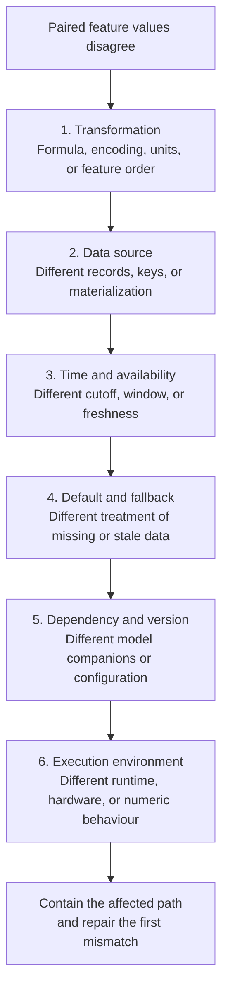
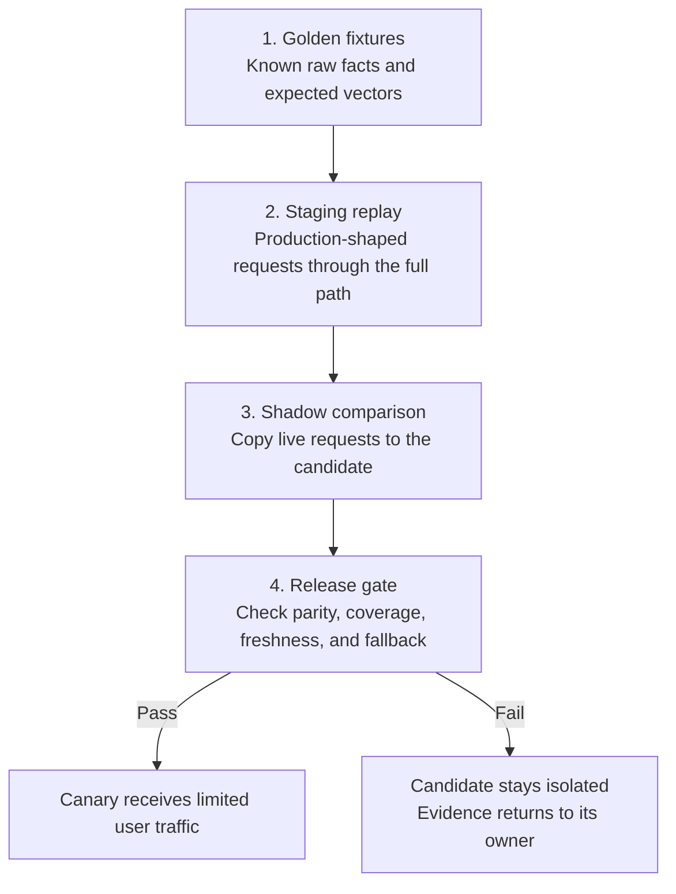
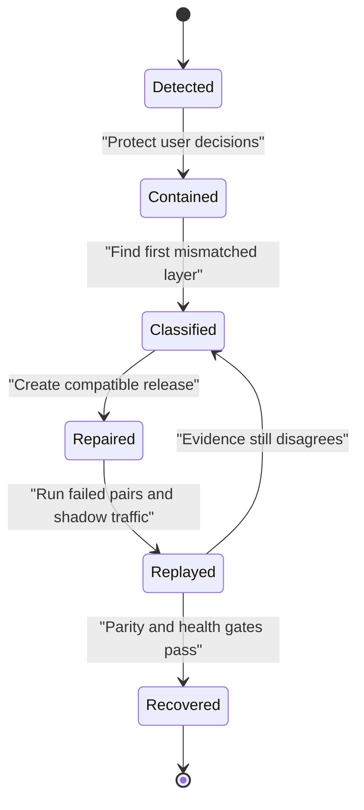

## Table of Contents

1. [A Healthy Endpoint Can Still Feed the Model the Wrong Inputs](#a-healthy-endpoint-can-still-feed-the-model-the-wrong-inputs)
2. [Six Ways Training And Production Inputs Become Different](#six-ways-training-and-production-inputs-become-different)
3. [Define One Meaning For Every Feature](#define-one-meaning-for-every-feature)
4. [Different Transformation Code Changes The Value](#different-transformation-code-changes-the-value)
5. [Different Data Sources Change The Underlying Record](#different-data-sources-change-the-underlying-record)
6. [Different Time Cutoffs Change What The Model Can Know](#different-time-cutoffs-change-what-the-model-can-know)
7. [Different Defaults Change The Meaning Of Missing Data](#different-defaults-change-the-meaning-of-missing-data)
8. [Different Dependency Versions Change Supporting Assets](#different-dependency-versions-change-supporting-assets)
9. [Different Environments Change Runtime Behaviour](#different-environments-change-runtime-behaviour)
10. [Reuse Definitions And Code Across Training And Production](#reuse-definitions-and-code-across-training-and-production)
11. [Compare Training And Production Values For The Same Cases](#compare-training-and-production-values-for-the-same-cases)
12. [Test Training And Production Paths Before Release](#test-training-and-production-paths-before-release)
13. [Contain And Repair A Training-Production Mismatch](#contain-and-repair-a-training-production-mismatch)
14. [Confirm The Feature Values Recovered And Keep Monitoring](#confirm-the-feature-values-recovered-and-keep-monitoring)
15. [References](#references)

## A Healthy Endpoint Can Still Feed the Model the Wrong Inputs
<!-- section-summary: Training-serving skew appears when the production feature path gives a model different evidence from the feature path used during training. -->

A purchase model was trained with `order_total` measured in dollars. A historical value of `$24.50` entered the training table as `24.5`. The production API receives the same amount from a payment service in cents and passes `2450` into the model.

The request has the expected field. Its type is numeric. The endpoint returns `200 OK`, latency stays normal, and the model produces a well-formed score. Every ordinary service check can stay green while the model reads an amount one hundred times larger than the values it learned from.

This is **training-serving skew**: the feature path used for production prediction disagrees with the path that created the model's training inputs. The disagreement can change a value, its meaning, its timestamp, or the policy used to fill a missing value.

Skew needs to be separated from **data drift** during investigation. If holiday shoppers genuinely spend more and both training and serving calculations represent those purchases in dollars, the population has changed. That is data drift. If the offline path uses dollars and the online path uses cents for the same purchase, the engineering paths disagree. That is a direct parity failure.

Some platforms use “training-serving skew” more broadly for any distribution difference between a training baseline and live inputs. That broader signal is useful, although it overlaps with drift. A direct engineering test asks:

**For the same logical example and prediction time, the training and serving paths should produce the same feature meaning and an equivalent value within the feature's declared tolerance.**

This test gives responders something concrete to reproduce. They can pair one online feature value with an offline recomputation, identify the first layer that disagrees, and repair that layer without assuming the model needs retraining.

## Six Ways Training And Production Inputs Become Different
<!-- section-summary: A six-part taxonomy separates calculation, source, time, fallback, version, and runtime differences so each failure reaches the right owner. -->

Skew is a family of failures. One alert may come from a changed SQL formula, another from a stale online store, and another from a different tokenizer library inside the serving image. Treating all of them as “feature drift” hides the responsible system.

A useful investigation follows six layers:


```mermaid

flowchart TD
    A["Paired feature values disagree"] --> B["1. Transformation<br/>Formula, encoding, units, or feature order"]
    B --> C["2. Data source<br/>Different records, keys, or materialization"]
    C --> D["3. Time and availability<br/>Different cutoff, window, or freshness"]
    D --> E["4. Default and fallback<br/>Different treatment of missing or stale data"]
    E --> F["5. Dependency and version<br/>Different model companions or configuration"]
    F --> G["6. Execution environment<br/>Different runtime, hardware, or numeric behaviour"]
    G --> H["Contain the affected path<br/>and repair the first mismatch"]

    class A signal
    class B,C,D,E,F,G layer
    class H action
```

The order starts with the closest explanation and moves outward. If the formula differs, a database investigation adds little value. If the formulas match, the team compares source records and materialization. Time rules follow because the same source may expose several historically valid values. Versions and runtime come later because they often explain a path that appears identical in code review.

Several layers can fail together. A new feature package may change a category vocabulary and introduce a new default. The taxonomy still helps because each mismatch receives its own evidence and recovery check.


*Both jobs may be healthy while their inputs disagree. The six mismatch layers help the team collect the right evidence and route the repair to the responsible boundary.*

## Define One Meaning For Every Feature
<!-- section-summary: A feature contract defines the value, entity, source, time, fallback, version, and tolerance that both paths must preserve. -->

Parity requires a shared statement of what the feature means. A name such as `recent_orders` leaves the customer identity, order states, and clock open to interpretation. The window boundaries, currency, and response to missing history also need an explicit definition.

A **feature contract** records those choices in a form that engineers can test. It belongs in version control and travels into the training and release evidence.

```yaml
feature: completed_order_value_30d_usd
entity: customer_id
value: "Sum completed order value in USD during the previous 30 days."
event_time: completed_at
available_time: feature_available_at
window: "(prediction_at - 30 days, prediction_at]"
dtype: float64
default: {value: 0.0, reason: no_completed_orders}
max_age: 15 minutes
tolerance: {absolute: 0.01}
owner: purchase-features
```

The entity identifies whose value is being calculated. The event and availability clocks decide which records were knowable. The window defines its open and closed boundaries. The default distinguishes a genuine zero from a lookup failure. The tolerance allows harmless floating-point differences while still catching a unit error.

The contract also names the source identities and transformation version in a real implementation. Those values may differ between offline and online storage because the warehouse and low-latency store serve different workloads. Their semantic rules must still agree.

One golden example turns the contract into a test. Given a customer, a fixed prediction timestamp, two completed orders inside the window, one cancelled order, and one late-arriving correction, both paths should return the same expected total. Boundary examples cover an order exactly thirty days old, a value one microsecond outside the window, and a missing customer.

## Different Transformation Code Changes The Value
<!-- section-summary: Transformation skew arises when training and serving use different formulas, filters, units, encoders, feature order, or preprocessing logic. -->

Start with one raw fact that both paths should interpret identically. **Transformation skew** occurs if the paths apply different calculations to that fact. The final feature then changes even though the source record is the same.

The cents-versus-dollars failure is one example. Other common cases include a thirty-day median offline and a mean online, inclusive window boundaries in SQL and exclusive boundaries in Python, lowercased text during training and original case during serving, or category IDs generated in a different order.

Schema validation may miss all of these. A `float64` remains a `float64` after a unit mistake. An input tensor keeps the same shape after two categorical positions swap. The contract and value comparison expose the semantic difference.

The strongest prevention is one executable transformation used by both paths. TensorFlow Transform, for example, can calculate training-wide statistics such as a vocabulary or normalization constants and export the resulting TensorFlow graph for training and serving. The same graph then applies the learned mapping to live examples.

Many teams use different engines for historical and online work, so literal code sharing may be impractical. A warehouse can calculate large historical windows efficiently while a streaming service maintains current aggregates. In that design, shared contracts, generated specifications, and golden examples define the common behaviour. Each engine implements the contract and must pass the same fixture suite.

A transformation test should compare the final vector delivered to the model. Comparing only intermediate tables can miss feature ordering, casting, normalization, or encoder changes in the serving adapter.

## Different Data Sources Change The Underlying Record
<!-- section-summary: Data-source skew appears when offline and online paths select different records, identities, corrections, or materialized states. -->

The formulas may match exactly and still produce different values. **Data-source skew** occurs if the paths read different records, identities, corrections, or materialized states for the same prediction.

An offline table may contain corrected transactions while the online store keeps the first version. The warehouse may resolve an account alias immediately while the serving path still uses the old ID. A materialization job may skip one region, leaving yesterday's feature values in the online store.

Source skew often hides behind a healthy lookup. The online database returns a row quickly, so the request path sees success. The row can still carry an old value or belong to the wrong entity.

The feature contract should name both source paths and their relationship. For a materialized feature, the online value normally derives from a versioned offline table or the same governed event stream. Materialization evidence records the source version, target version, covered partitions, row count, maximum event time, and completion status.

Feast models this split through Feature Views. Historical retrieval performs point-in-time joins against an offline source, while materialization loads the latest eligible values into an online store for low-latency retrieval. Feast's standard Feature View describes feature data and schema; transformation pipelines and materialization correctness remain operational responsibilities for the team.

Databricks Feature Store can bind feature lookup metadata to a logged model. Model Serving can then retrieve required values automatically from supported online stores, and configured inference tables can preserve the augmented dataframe containing looked-up values. That evidence helps compare what the model received with an offline recomputation.

Feature platforms reduce ad hoc source selection. They still need materialization-lag alerts, key-coverage checks, and versioned backfill policies.

## Different Time Cutoffs Change What The Model Can Know
<!-- section-summary: Time skew occurs when historical and live paths disagree about prediction time, event time, availability, windows, freshness, or late data. -->

Features change over time. A training join needs the value available at the historical prediction moment, while online serving needs a sufficiently fresh value available now.

Three clocks keep that distinction clear:

- **event time** records when the business fact occurred;
- **availability time** records when the feature path could use it;
- **prediction time** records when the model made or would have made the decision.

Suppose a transaction happened at 09:50, the prediction ran at 10:00, and a correction arrived at 11:30. A training query executed today can see the correction. That correction was unavailable to the live model at 10:00. Joining only on event time leaks later knowledge into the historical example.

Point-in-time retrieval selects the latest feature value whose event and availability rules satisfy the prediction cutoff. Feast historical retrieval scans backward from each entity-row timestamp within the Feature View time-to-live window. Databricks feature tables also support point-in-time joins when the time-series keys and lookup metadata are defined.

Online retrieval adds freshness. The latest stored value may be two hours old even though the contract allows fifteen minutes. The serving path should record feature event time, retrieval time, observed age, and the action taken after the freshness limit.

Boundary fixtures are essential. Test a value exactly at the start and end of the window, a late arrival, two updates with the same event time, and a daylight-saving transition represented in UTC. These cases force both implementations to make the same choice.

## Different Defaults Change The Meaning Of Missing Data
<!-- section-summary: Default skew appears when training and serving assign different values or meanings to missing, stale, failed, or unseen inputs. -->

A missing value carries information about the data path. Training might fill missing income with the training median. Serving might use zero after a lookup timeout. Both values are numeric and accepted by the model, yet they describe different situations.

Four conditions should stay distinct:

1. the entity genuinely has no history;
2. the feature exists and is stale;
3. lookup failed;
4. the input category was unseen.

One default value can collapse all four into the same model input. This hides incidents and creates a missingness pattern that training and production handle differently.

The contract assigns a value and reason to each allowed fallback. A companion indicator such as `order_value_30d_missing` lets the model distinguish a real zero from an unavailable lookup. The prediction record captures `fallback_used`, `fallback_reason`, feature age, and source status.

Suppose an online store timeout causes 18 percent of requests to receive zero while training used a median of 72.4. Distribution monitoring will detect a spike around zero, and paired comparison will show direct mismatches. The immediate response may use a previous cached value within an approved age limit or route to a fallback model trained without that feature.

Fallbacks are product decisions. They need a maximum duration, an owner, an alert, a model compatibility check, and an exit condition. Quietly returning a default after every lookup error creates a permanent skew path.

## Different Dependency Versions Change Supporting Assets
<!-- section-summary: Version skew occurs when model, feature definitions, encoders, configuration, or preprocessing packages come from different releases. -->

A model rarely travels alone. Its predictions depend on feature definitions, encoder vocabularies, scalers, tokenizers, lookup configuration, policy thresholds, and serving code.

Imagine a model trained with vocabulary version 8, where `mobile=0`, `desktop=1`, and `unknown=2`. A serving deployment rebuilds the vocabulary from recent traffic and assigns `desktop=0`. Every request still produces an integer in the expected range. The model interprets each category using the old mapping.

A release record should bind the model to immutable companion identities:

```yaml
release: purchase-propensity-42
model: models:/purchase_propensity/17
feature_contract: purchase_features_v12
feature_service: purchase_online_v12
encoder_digest: sha256:819b7a...
preprocessing_package: feature_transforms==4.8.2
serving_image: registry.example/purchase@sha256:3c218f...
fallback_policy: purchase_fallback_v5
```

Mutable labels such as `latest` cannot prove which bytes ran. Digests, immutable model versions, and reviewed configuration supply that evidence.

The serving process reports its loaded identities at startup and with bounded prediction telemetry. A readiness check can withhold traffic if model 17 expects `purchase_features_v12` while the process loaded version 11. Canary dashboards group parity and fallback results by the concrete release identity so mixed versions remain visible.

Configuration changes deserve the same control as code. A feature flag that changes a window from thirty to seven days changes the feature definition and requires a new contract or release identity.

## Different Environments Change Runtime Behaviour
<!-- section-summary: Environment skew appears when equivalent code runs with different libraries, runtimes, hardware, locale, precision, or concurrency behaviour. -->

Matching source code still leaves one more layer to verify: the runtime executing it. **Execution-environment skew** occurs if libraries, hardware, locale, precision, or concurrency change the value.

Training may use a newer pandas or scikit-learn release than serving. One container may parse dates in UTC and another in local time. CPU inference may use `float64` while a GPU path casts to `float16`. Different image-resizing libraries can round pixels differently. Concurrent state updates can also change a live aggregate even though a batch test passes.

Small numeric differences are expected for some workloads, so the feature contract declares an absolute or relative tolerance. Categorical IDs, booleans, and feature order usually require exact equality. A blanket tolerance can hide a serious discrete mismatch.

Reproducible environments reduce this risk. Keep direct and transitive dependencies in a lockfile, build one reviewed OCI image, deploy by image digest, and record the hardware or execution provider where it affects results. MLflow Models can record Python dependencies, use a uv project or dependency locking, and validate prediction in an isolated environment before deployment.

Environment parity still requires testing on the production target. A model that passes inside the training image may behave differently after conversion to ONNX, TensorRT, or a mobile runtime. Run the golden feature vectors and expected predictions through the actual serving artifact on each supported architecture.

The test result belongs to the release evidence. It records runtime, image digest, dependency lock digest, hardware class, input fixture version, and observed tolerance.

## Reuse Definitions And Code Across Training And Production
<!-- section-summary: Shared transformations, governed feature retrieval, explicit contracts, and bound release identities remove opportunities for the paths to diverge. -->

Every independent implementation gives training and serving another opportunity to disagree. Prevention reduces those separate decisions while preserving the storage and compute patterns each workload needs.

### Share Transformation Code Where The Workload Allows

Package preprocessing with the model or in a shared versioned library. A scikit-learn `Pipeline` can carry column transformations and the estimator as one artifact. TensorFlow Transform can carry preprocessing statistics and operations in the exported graph. MLflow can package the model, code, dependencies, signature, and input example.

Shared code covers formulas, casts, encoders, and feature order. It cannot make a stale online store fresh or reconstruct a historical cutoff. Those responsibilities need feature retrieval and time-aware storage.

### Use One Feature Definition Across Historical And Online Retrieval

A feature platform earns its place when several models reuse time-sensitive features or need low-latency lookup. Historical retrieval follows entity keys and prediction timestamps. Online retrieval follows the same registered feature references and returns current values from an online store.

Feast supports this pattern with point-in-time historical retrieval, materialization, Feature Services, and online lookup. Databricks supports stable Unity Catalog feature tables, `FeatureLookup`, model lineage, online stores, and automatic lookup in Model Serving. Newer Databricks Feature Views add declarative feature computation, although they remain preview and should stay outside a production default until their lifecycle fits the workload.

The feature platform coordinates definitions and retrieval. Source correctness, materialization coverage, freshness, fallback, and paired parity still need explicit controls.

### Block Releases When Training And Production Checks Disagree

CI runs schema checks and golden fixtures against every transformation change. The training job records the contract and feature source versions used to create the dataset. The model record binds those identities to preprocessing and dependencies. Deployment admits only a compatible set.

This sequence catches a known mismatch before it reaches production and gives later comparisons stable identities.

## Compare Training And Production Values For The Same Cases
<!-- section-summary: Direct detection pairs an online feature value with an offline recomputation for the same prediction, then uses distribution monitoring as supporting evidence. -->

The clearest skew measurement starts from the same logical event. Sample a production prediction, preserve safe feature evidence, and recompute the expected values using the contract, source version, and prediction cutoff that applied to that request.

### Record Enough Input State To Rebuild The Comparison

The prediction record first identifies the request, entity, and prediction time. It also records the feature contract, source or materialization, and serving release versions. Feature event time, observed value, and fallback reason complete the comparison evidence. Sensitive values can stay in a governed evidence store while general telemetry carries safe summaries and references.

Logging only the model input value makes time and source failures hard to separate. Adding feature event time reveals staleness. Adding source version identifies a partial materialization. Adding fallback reason distinguishes genuine missing history from an online lookup error.

### Compare Paired Values And Important Segments

The recomputation joins by prediction ID and feature name. It pins historical data and enforces `available_at <= prediction_at`. Each feature applies its declared equality or numeric tolerance. This numeric example measures an absolute delta; discrete features use exact equality.

```sql
select
  o.feature_name,
  o.release_id,
  o.region,
  count(*) as compared_pairs,
  avg(case when abs(o.value - r.value) > c.abs_tolerance then 1.0 else 0.0 end)
    as mismatch_rate,
  approx_percentile(abs(o.value - r.value), 0.99) as p99_delta
from online_feature_capture o
join offline_recomputation r
  on r.prediction_id = o.prediction_id
 and r.feature_name = o.feature_name
join feature_contract c
  on c.feature_name = o.feature_name
 and c.contract_version = o.contract_version
group by o.feature_name, o.release_id, o.region
```

A global mismatch rate can hide one broken region, model route, or fallback state. The parity job calculates required segment views and reports comparison coverage too. Low coverage may mean the logging or recomputation path failed before it found skew.

### Use Distribution Monitoring As An Early Warning

Distribution comparison is cheaper than recomputing every row. Managed platforms such as Model Monitoring on Gemini Enterprise Agent Platform and warehouse functions such as BigQuery ML's `ML.VALIDATE_DATA_SKEW` can compare serving feature distributions with a training reference.

That signal cannot prove the cause. A real customer shift and a unit conversion bug can both change a distribution. Paired values distinguish engineering parity from population drift, while delayed outcome monitoring shows whether either change harms prediction quality.


*A paired comparison holds the case identity, time, and release constant. Any remaining difference points to transformation, source, fallback, version, or runtime parity.*

## Test Training And Production Paths Before Release
<!-- section-summary: Golden fixtures, staging replay, shadow comparison, and explicit gates expose skew before a candidate serves user-facing decisions. -->

Unit tests catch formula mistakes inside one component. A release crosses more boundaries: storage, retrieval, packaging, configuration, and the serving runtime. The candidate needs evidence from each of them before it receives user-facing traffic.

A strong progression uses four levels:


```mermaid

flowchart TD
    A["1. Golden fixtures<br/>Known raw facts and expected vectors"] --> B["2. Staging replay<br/>Production-shaped requests through the full path"]
    B --> C["3. Shadow comparison<br/>Copy live requests to the candidate"]
    C --> D["4. Release gate<br/>Check parity, coverage, freshness, and fallback"]
    D -->|Pass| E["Canary receives limited user traffic"]
    D -->|Fail| F["Candidate stays isolated<br/>Evidence returns to its owner"]

    class A,B,C test
    class D gate
    class E pass
    class F stop
```

Golden fixtures cover edge conditions cheaply. Staging replay proves the packaged model and retrieval path. Shadow traffic sends a copy of real requests to the candidate while users continue to receive the stable release's response.

Istio can mirror a percentage of live requests out of band, and Kubernetes Gateway API also defines request mirroring. The candidate response is discarded. The shadow service must suppress external side effects such as writing decisions, charging accounts, or sending notifications. It writes comparison evidence under a separate route identity.

The release gate uses product-specific thresholds:

```yaml
parity_gate:
  minimum_pair_coverage: 0.98
  maximum_discrete_mismatch_rate: 0.001
  maximum_p99_continuous_delta: 0.01
  maximum_fallback_rate: 0.02
  maximum_feature_age_seconds: 900
  required_segments: [region, model_route]
```

The gate also requires every expected feature and version identity. A low mismatch rate from a small or biased sample cannot approve the candidate. After the gate passes, a canary release exposes limited user traffic and continues the same comparisons.

## Contain And Repair A Training-Production Mismatch
<!-- section-summary: Incident response limits user impact, classifies the first mismatched layer, repairs its owner boundary, and replays captured evidence. -->

Skew incidents often arrive as a model-quality alert, a distribution change, or a spike in fallback. The first action is containment based on product risk.

Containment may restore the previous complete model-and-feature release, route to a model trained without the failing feature, freeze a last-known-good value within its approved age, or reject requests whose inputs cannot be interpreted safely. Rolling back only the model can preserve the mismatch if the online feature set changed with it.

The investigation then walks the taxonomy:

1. Compare final model input vectors for matched predictions.
2. Check formulas, units, feature order, and encoders.
3. Compare source rows, entity resolution, and materialization versions.
4. Rebuild the time and availability cutoff.
5. Inspect missingness and fallback reasons.
6. Confirm release identities, dependencies, image digest, and runtime.

Suppose parity failures begin immediately after an encoder release, and every mismatch belongs to an unseen device category. The team pins the earlier model and encoder pair, keeps the new candidate isolated, and replays captured requests against a corrected unknown-category mapping. The repaired release must pass exact category-vector equality before it reaches a canary.

Preserve the failed pairs, source references, release record, and contract version. These records turn the incident into a permanent regression fixture without copying sensitive payloads into general logs.


```mermaid
stateDiagram-v2
    [*] --> Detected
    Detected --> Contained: "Protect user decisions"
    Contained --> Classified: "Find first mismatched layer"
    Classified --> Repaired: "Create compatible release"
    Repaired --> Replayed: "Run failed pairs and shadow traffic"
    Replayed --> Recovered: "Parity and health gates pass"
    Replayed --> Classified: "Evidence still disagrees"
    Recovered --> [*]
```

## Confirm The Feature Values Recovered And Keep Monitoring
<!-- section-summary: Recovery requires direct parity, healthy retrieval, stable fallbacks, correct release identities, and later confirmation from outcomes. -->

A healthy endpoint proves only that the service can answer. Recovery needs evidence that the model receives the intended features again.

The direct checks come first:

- matched mismatch rates return inside each feature's tolerance;
- parity comparison covers the required routes and segments;
- feature age and materialization lag recover;
- lookup errors and fallback reasons return to their expected ranges;
- every process reports the approved model, feature, encoder, policy, and image identities;
- captured failed pairs pass through the repaired path.

Prediction distributions should also stabilize relative to an appropriate reference. They may settle at a new healthy level if the population changed during the incident, so direct paired evidence remains the primary recovery test.

Labels arrive later. Outcome metrics eventually confirm that the repaired system restored product quality. Containment and direct parity verification proceed earlier because a severe mismatch can cause harm long before ground truth is available.

Long-term prevention comes from converting the incident into a gate. Add the failed boundary value to the golden fixture suite, add the responsible version combination to compatibility checks, and keep a small governed sample of production pairs flowing through recomputation. This turns training-serving parity into a continuously tested property of the system.


*The feature contract defines acceptable parity. Tests and paired evidence keep that contract active before release, during operation, and through recovery.*

## References

- [Google Rules of Machine Learning: training-serving skew](https://developers.google.com/machine-learning/guides/rules-of-ml#training-serving_skew)
- [Google Rules of Machine Learning: measure training-serving skew](https://developers.google.com/machine-learning/guides/rules-of-ml/#rule_37_measure_trainingserving_skew)
- [TensorFlow Transform pipeline component](https://www.tensorflow.org/tfx/guide/transform)
- [TensorFlow Transform preprocessing recommendations](https://www.tensorflow.org/tfx/guide/tft_bestpractices)
- [Feast Feature Views](https://docs.feast.dev/getting-started/concepts/feature-view)
- [Feast point-in-time joins](https://docs.feast.dev/getting-started/concepts/point-in-time-joins)
- [Feast platform components](https://docs.feast.dev/getting-started/components/overview)
- [Databricks Feature Store](https://docs.databricks.com/aws/en/machine-learning/feature-store)
- [Databricks Model Serving with automatic feature lookup](https://docs.databricks.com/aws/en/machine-learning/feature-store/automatic-feature-lookup)
- [MLflow model dependency management](https://mlflow.org/docs/latest/ml/model/dependencies/)
- [Provide schemas to Gemini Enterprise Agent Platform Model Monitoring](https://docs.cloud.google.com/gemini-enterprise-agent-platform/machine-learning/model-monitoring/schemas)
- [Google Cloud: Vertex AI to Gemini Enterprise Agent Platform naming changes](https://docs.cloud.google.com/gemini-enterprise-agent-platform/release-notes)
- [BigQuery ML.VALIDATE_DATA_SKEW](https://docs.cloud.google.com/bigquery/docs/reference/standard-sql/bigqueryml-syntax-validate-data-skew)
- [Istio request mirroring](https://istio.io/latest/docs/tasks/traffic-management/mirroring/)
