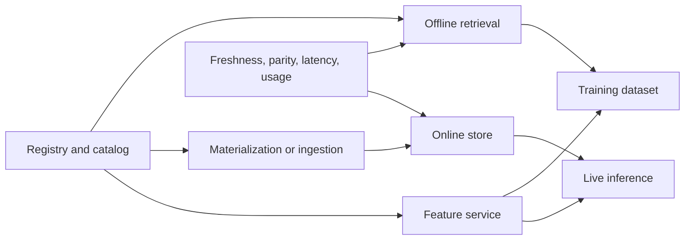
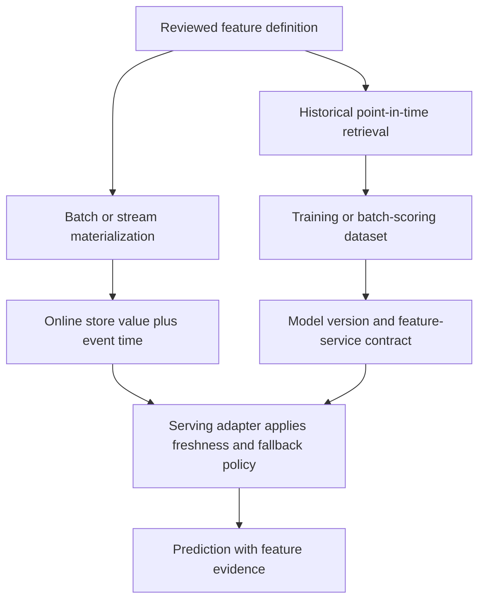

## A Feature Store Is A Shared Feature Platform
<!-- section-summary: A feature store centralises feature discovery, historical retrieval, online reads, materialization, and operational ownership across models. -->

A **feature store** is a shared platform for defining, discovering, retrieving, and serving machine-learning features. It helps several models use the same reviewed feature meaning across historical training and production inference.

The previous two articles already own the underlying ideas. A feature contract defines entity, source, event time, transformation, owner, and validity. Offline and online paths need point-in-time correctness, freshness, and parity. A feature store packages those responsibilities behind reusable interfaces and a catalog. It does not create trustworthy features automatically.

Imagine **CityBite**, a food-delivery company with ETA, courier dispatch, fraud, and restaurant-ranking models. Several teams need `restaurant_avg_prep_minutes_30d`, `restaurant_cancel_rate_7d`, and `zone_orders_last_15m`. Reimplementing those features in notebooks, warehouse SQL, stream jobs, and services has created inconsistent definitions and repeated incident work.

CityBite considers a feature store because reuse and low-latency serving are now platform problems. One monthly batch model would fail to justify the same infrastructure.

## The Architecture Has A Control Plane And Data Planes
<!-- section-summary: The control plane manages definitions and ownership, while offline, online, and materialization data planes move values for training and serving. -->

A clear feature-store architecture separates metadata and policy from value movement:

| Plane or component | Responsibility | CityBite evidence |
|---|---|---|
| **Registry and catalog** | Store feature definitions, entities, schemas, owners, sources, services, and tags | Reviewed feature repository and catalog entry |
| **Offline retrieval** | Build historical training sets from versioned sources using event-time rules | Dataset query, point-in-time result, source snapshots |
| **Online serving** | Return recent feature values by entity key inside a latency budget | Read latency, missing status, value timestamp |
| **Materialization or ingestion** | Move computed values from batch or stream sources into the online store | Job run, watermark, rows written, failure state |
| **Feature service** | Name the feature group one model version expects | Versioned feature list linked to model contract |
| **Access and observability** | Enforce permissions and expose freshness, validity, parity, latency, usage, and lineage | Identity and access management (IAM) policy, dashboards, alerts, consumers |



The registry holds definitions and references rather than every feature value. The offline store often points to an existing warehouse or lakehouse. The online store commonly uses a low-latency key-value database. Materialization connects those paths for precomputed features. Request-time values such as current basket size can still come directly from the application.

## Follow A Feature From Definition To Decision
<!-- section-summary: One feature moves through definition, historical reconstruction, materialization, online retrieval, and a model-specific serving policy. -->

A feature store provides value when the same definition supports two different questions:

- **Historical question:** what value was available for this entity at a past prediction time?
- **Online question:** what is the most recent acceptable value for this entity now?

Those questions use related definitions and different execution paths.



### Definition

A reviewed definition identifies the entity key, feature name and type, source, event-time column, transformation ownership, expected freshness, and consumers. Features that share a source and lifecycle can be grouped into a **feature view**. A **feature service** names the subset expected by one model family or version.

The feature service is a contract, not a deployed microservice. It prevents training from requesting one set of names while serving requests another. It should still be versioned or otherwise tied to the model release because a mutable feature list can change model inputs without changing the model artifact.

### Historical retrieval

Historical training data requires a **point-in-time join**. For every entity row and prediction timestamp, retrieval selects the most recent feature event that was available at or before that time and within the permitted lookback. A later restaurant preparation event cannot train an ETA prediction that happened earlier.

```mermaid
timeline
    title Point-in-time feature selection for one restaurant
    10:00 : feature value 17.8 is recorded
    10:12 : prediction time selects 17.8
    10:20 : feature value 22.1 is recorded
    10:30 : order completes and the label is available
```

Joining on order completion at 10:30 would allow the 10:20 value into a training row for the 10:12 prediction. That is future leakage. The feature store can perform the join only when the entity timestamp and source event time carry the correct meaning.

Some tools expose a TTL or lookback on feature views. In current Feast documentation, feature-view TTL limits how far backward historical retrieval searches. It is separate from the application's online freshness policy. An operator should avoid reading “30-hour TTL” as a universal 30-hour expiry rule for every online value across all stores.

### Materialization

**Materialization** moves computed values into a low-latency online store. A batch materialization has a source snapshot, event-time interval, registry or definition version, target store, row counts, rejected records, and a resulting watermark. A stream ingestion path has offsets or checkpoints with related semantics.

The watermark answers “through which source event time is this view complete?” It should advance only after the target write is verified. A job status of `Succeeded` cannot prove every expected entity arrived. Compare source coverage, rejected rows, and online samples before publishing the new watermark.

Retries need a bounded interval and idempotent keys. Replaying the same time range should converge on the same entity and event-time records. Appending duplicates or overwriting newer values with late older events can create silent skew.

### Online retrieval

Online retrieval looks up entity keys and returns values for the model's feature service. A robust response also exposes enough status to distinguish:

- entity absent;
- feature value missing;
- value present but stale for this model;
- online store timed out;
- schema or type invalid;
- value served from a fallback path.

The serving adapter applies the model's policy. One model may accept a 30-minute-old restaurant statistic; another may require five minutes. Zero can replace a missing value only when the domain contract explicitly defines that rule. Prediction logs should preserve the fallback reason and feature-service identity.

## Map The Framework To Feast Without Making Feast The Framework
<!-- section-summary: Feast entities, feature views, feature services, historical retrieval, and online retrieval provide one implementation of the general architecture. -->

Feast is a useful open-source mapping:

| General responsibility | Feast concept |
| --- | --- |
| Entity join key | `Entity` |
| Group of timestamped features and source | `FeatureView` |
| Model-facing feature group | `FeatureService` |
| Definition catalog | Feast registry |
| Point-in-time training retrieval | `get_historical_features` |
| Latest online retrieval | `get_online_features` |
| Batch movement into online store | materialization |

One small definition fragment shows the mapping:

```python
restaurant_stats = FeatureView(
    name="restaurant_stats",
    entities=[restaurant],
    ttl=timedelta(hours=30),
    schema=[
        Field(name="avg_prep_minutes_30d", dtype=Float32),
        Field(name="cancel_rate_7d", dtype=Float32),
    ],
    source=restaurant_stats_source,
    owner="delivery-data-platform",
)

eta_features = FeatureService(
    name="checkout_eta_v6",
    features=[restaurant_stats],
)
```

The snippet declares identity, schema, source, owner, historical lookback, and model-facing group. Production design still has to choose the offline store, online store, materialization runner, registry deployment, access controls, validation, and recovery path.

Current Feast also supports optional schema validation during materialization and historical retrieval. Validation helps catch missing columns and type mismatches at the platform boundary. It does not establish the business meaning, freshness, distribution, or causal safety of a feature.

## Prove Parity Across The Boundary
<!-- section-summary: Parity testing compares one feature definition across source calculation, historical retrieval, materialization, and online read at controlled entity-time cases. -->

**Offline-online parity** means equivalent feature logic and inputs produce equivalent values across training and serving paths. It does not require the warehouse and online store to use identical technology.

Test a small set of controlled cases end to end:

| Case | What it proves |
| --- | --- |
| Known entity at known event time | core historical and online value agree |
| Event exactly on lookback boundary | temporal policy is interpreted consistently |
| Event just outside boundary | old values are rejected as designed |
| Unknown entity | missing-key behaviour is explicit |
| Late-arriving event | replay and watermark policy are correct |
| Schema change | incompatible definitions fail before serving |
| Online timeout | fallback is visible and safe |

Parity monitoring in production samples features from the online path and reconstructs expected values from the offline source using the same entity and event time. Compare value, timestamp, definition version, and fallback status. Alerting needs a denominator and owner; one mismatch in ten reads and one in ten million have different urgency.

## Choose Build, Open Source, Or Managed
<!-- section-summary: Platform choice follows existing data systems, online latency, cloud ownership, security, operational skill, and the amount of custom behaviour required. -->

Teams usually choose among internal libraries, an open-source platform such as Feast, and a managed cloud feature store. The decision should follow the existing architecture.

| Situation | Likely starting point | Cost to accept |
|---|---|---|
| Batch-only models in one warehouse | Versioned SQL models and a feature catalog | Team maintains conventions and lineage |
| Several online models across existing stores | Feast over current offline and online systems | Platform team operates registry, jobs, stores, and monitoring |
| Workloads already centred on one managed ML platform | Provider-managed feature store | Cloud coupling, provider permissions, service limits, and cost |
| Special streaming, privacy, or tenancy requirements | Internal platform or extended open source | Significant engineering and on-call ownership |

Managed products use different terms. Amazon SageMaker Feature Store uses feature groups, record identifiers, event time, online storage, and S3-backed offline storage. Other providers package similar responsibilities through their current ML and data platforms. Teams should verify present APIs, supported stores, consistency behaviour, IAM, limits, and lifecycle guidance in official documentation before choosing a service.

A product matrix is less useful than a responsibility map. CityBite needs to know who operates ingestion, how a schema change reaches consumers, how online values roll back, how historical values reproduce a model review, and how restricted features receive separate access policies.

The platform decision should include an ownership exercise with an actual failure. Suppose the 02:00 materialization writes only 62 percent of restaurants before its worker dies. The team should know which component stores the watermark, whether retries are idempotent, which previous values remain online, how serving detects their age, and who pauses publication. A managed service can operate infrastructure while the application team still owns feature freshness and fallback consequences.

## Operate The Platform
<!-- section-summary: Feature-store operations connect freshness, validity, parity, latency, availability, usage, lineage, cost, and owner response. -->

A feature store enters the production serving path, so it needs service and data operations together.

| Signal | Question | Response owner |
|---|---|---|
| Materialization watermark | Did the latest eligible values reach the online store? | Data platform |
| Feature freshness | Are values young enough for this model contract? | Feature owner |
| Offline-online parity | Do sampled historical reconstructions match served values within policy? | ML and feature owners |
| Read latency and timeout rate | Can the endpoint meet its budget? | Serving platform |
| Missing and fallback rate | Are keys, joins, or upstream jobs failing? | Feature and service owners |
| Usage and lineage | Which models will a definition or schema change affect? | Catalog owner |
| Storage and compute cost | Do historical scans, materialization, and online retention match value? | Platform owner |

The runbook should support pausing a materialization job, restoring the previous healthy source or transformation version, switching a model to a compatible feature service, and using a reviewed fallback. Replaying a bad time range into the online store can repeat the incident, so recovery records the source snapshot, code version, window, and target store.

For batch-backed Feast views, a scheduled incremental materialization can use the current UTC timestamp as the upper bound:

```bash
CURRENT_TIME=$(date -u +"%Y-%m-%dT%H:%M:%S")
feast -c feature_repo materialize-incremental "$CURRENT_TIME"
```

The incremental command resumes after the bounded materialization end time, so the scheduler still needs exclusive-run or idempotency controls and durable run evidence. CityBite records `start_time`, `end_time`, source snapshot, registry digest, rows read, rows written, rejected rows, and the final watermark. An orchestration success flag alone cannot prove that all expected entities reached the online store.

A verification query compares source coverage with online-read samples after every run. If the expected source contains 12,400 active restaurants and the write reports 7,688, the job marks the feature service unhealthy, keeps the previous release-compatible service active, and prevents a new model rollout. Operators repair the source or job, run a bounded replay for the exact failed interval, and repeat parity and freshness tests before reopening the gate.

The online path also needs a latency failure policy. A feature server timeout can route to a local fallback, a smaller model with request-only features, or an explicit unavailable response depending on product risk. The prediction log records the chosen path. Hiding the timeout behind ordinary default values would make an availability incident look like valid customer behaviour.

Feature retirement also needs a workflow. The catalog identifies consumers, owners approve removal, serving and training references disappear, materialization stops, and retention rules remove values after audit or reproducibility needs expire.

## Decide Whether A Feature Store Earns Its Cost
<!-- section-summary: Adoption makes sense when reuse, online serving, temporal correctness, discovery, and ownership problems outweigh platform complexity. -->

CityBite asks six questions:

1. Do several production models reuse the same feature definitions?
2. Do live decisions need low-latency precomputed values?
3. Has duplicated logic caused training-serving skew or incidents?
4. Do historical datasets need point-in-time retrieval across many sources?
5. Do teams need discovery, lineage, permissions, and consumer ownership?
6. Can a platform team operate stores, ingestion, upgrades, observability, and on-call response?

Several strong yes answers support adoption. Mostly no answers support a simpler design: versioned transformations, dataset manifests, a reviewed feature catalog, and direct batch retrieval. Those practices remain useful if the platform grows later.

## Putting It Together
<!-- section-summary: A feature store earns its place by operating shared feature contracts across historical and online paths with visible ownership and evidence. -->

CityBite uses the feature store as a shared platform. The registry holds definitions and ownership. Offline retrieval builds time-correct training data. Materialization and online storage support live reads. Feature services bind model contracts to reviewed feature groups. Access, lineage, freshness, parity, latency, and usage checks keep the platform operable.

The feature store does not own the meaning of `restaurant_avg_prep_minutes_30d`; the feature owner does. It does not decide whether a 30-minute-old value is safe for checkout; the model and product contract do. The platform makes those decisions reusable, enforceable, and visible across teams.

## References

- [Feast documentation](https://docs.feast.dev/)
- [Feast Feature View](https://docs.feast.dev/getting-started/concepts/feature-view)
- [Feast Feature Retrieval](https://docs.feast.dev/getting-started/concepts/feature-retrieval)
- [Feast Offline Store](https://docs.feast.dev/getting-started/components/offline-store)
- [Feast: Load data into the online store](https://docs.feast.dev/how-to-guides/feast-snowflake-gcp-aws/load-data-into-the-online-store)
- [Feast quickstart retrieval and materialization](https://docs.feast.dev/getting-started/quickstart)
- [Feast CLI reference](https://docs.feast.dev/master/reference/feast-cli-commands)
- [Amazon SageMaker AI Feature Store](https://docs.aws.amazon.com/sagemaker/latest/dg/feature-store.html)
- [Amazon SageMaker AI Feature Store concepts](https://docs.aws.amazon.com/sagemaker/latest/dg/feature-store-concepts.html)
