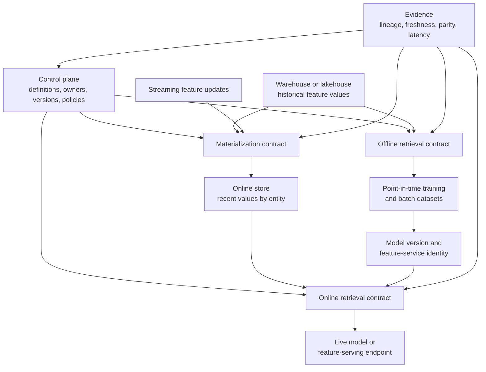
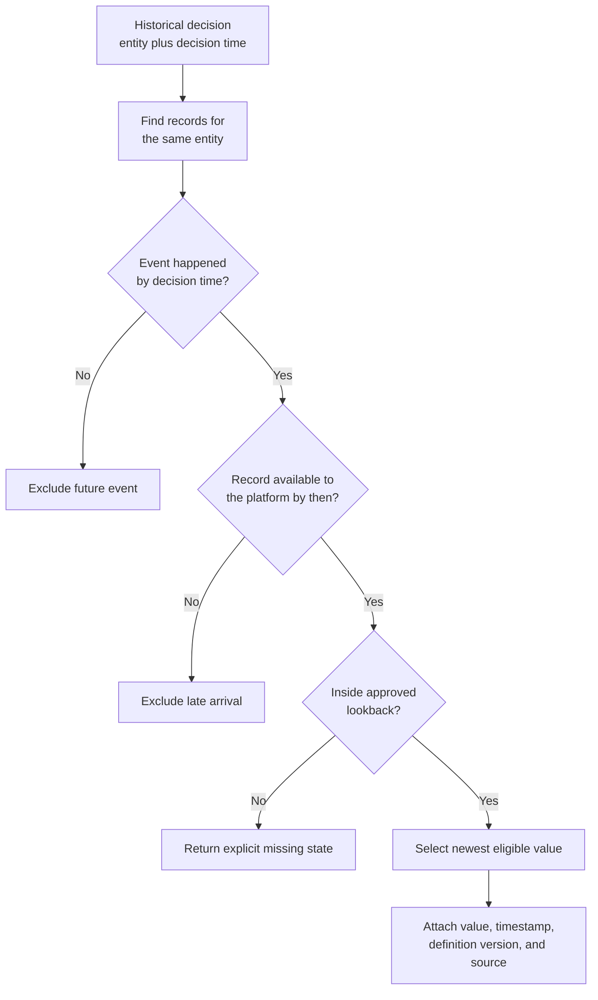
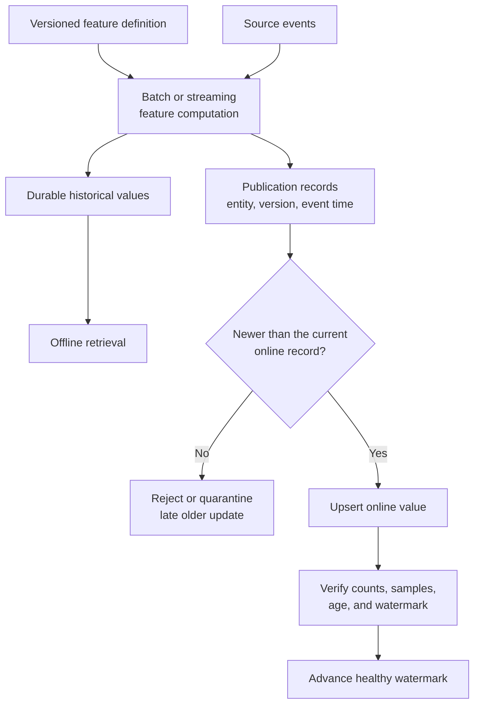
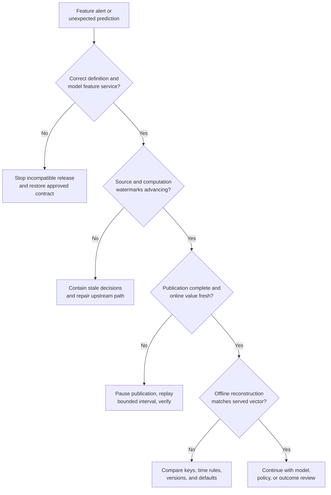
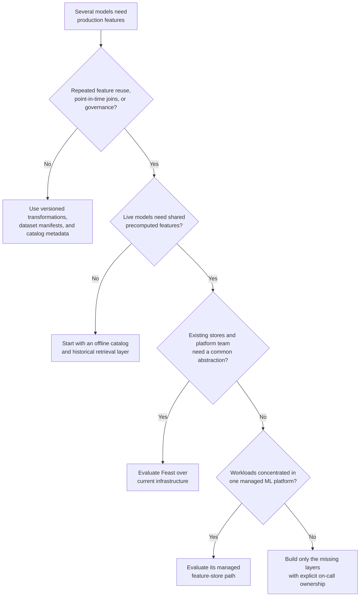

## Table of Contents

1. [Why Teams Need Shared Feature Definitions And Retrieval](#why-teams-need-shared-feature-definitions-and-retrieval)
2. [Separate Feature Definitions From Feature Value Delivery](#separate-feature-definitions-from-feature-value-delivery)
3. [Record Feature Definitions And Owners In One Catalog](#record-feature-definitions-and-owners-in-one-catalog)
4. [Use Entity Keys To Find Values For The Right Object](#use-entity-keys-to-find-values-for-the-right-object)
5. [Retrieve Historical Values For Training](#retrieve-historical-values-for-training)
6. [Retrieve Current Values For Live Predictions](#retrieve-current-values-for-live-predictions)
7. [Copy Calculated Values Into The Online Store](#copy-calculated-values-into-the-online-store)
8. [Keep Live Feature Values Fresh And In The Expected Shape](#keep-live-feature-values-fresh-and-in-the-expected-shape)
9. [Control Access To Definitions, Historical Data, And Live Values](#control-access-to-definitions-historical-data-and-live-values)
10. [Monitor Feature Creation, Publication, And Retrieval](#monitor-feature-creation-publication-and-retrieval)
11. [Assign Owners And Plan For Failures](#assign-owners-and-plan-for-failures)
12. [How Feast Implements These Responsibilities](#how-feast-implements-these-responsibilities)
13. [How Managed Feature Stores Divide The Work](#how-managed-feature-stores-divide-the-work)
14. [Decide Whether To Build, Buy, Or Keep A Simpler Design](#decide-whether-to-build-buy-or-keep-a-simpler-design)
15. [Test The Feature Platform Before Production Models Use It](#test-the-feature-platform-before-production-models-use-it)
16. [The Main Idea](#the-main-idea)
17. [References](#references)

## Why Teams Need Shared Feature Definitions And Retrieval
<!-- section-summary: A feature store gives several ML systems one governed way to define, reconstruct, publish, and retrieve shared model inputs. -->

Several models may need the same input calculated with the same meaning and time rules. A **feature store** is a shared platform that coordinates those definitions and retrieves their values for training, batch prediction, and live inference.

The need usually appears gradually. One model starts with warehouse SQL and a small prediction service. A second model needs the same customer activity count, so another team copies the query. A live model later rewrites that calculation in a stream processor and places the result in Redis. The feature now has several implementations, several owners, and no dependable answer to a basic question: do all models receive the same value for the same customer and time?

A feature store addresses this coordination problem by turning reusable model inputs into governed production assets. It provides a shared definition, identifies the real-world object each value belongs to, reconstructs historical values without future leakage, and delivers recent values within the serving budget.

The word “store” can be misleading. A production feature store is rarely one database. It commonly connects a warehouse or lakehouse, transformation jobs, a metadata registry, an optional online database, retrieval APIs, permissions, and monitoring. Some products manage most of those parts. Others provide a common interface over infrastructure the team already operates.

Many ML systems can remain simpler. A monthly forecasting model may need versioned transformations and reproducible datasets, with no online store or feature server. A feature store earns its cost after reuse, temporal correctness, discovery, or live serving turns into a repeated platform problem.

## Separate Feature Definitions From Feature Value Delivery
<!-- section-summary: The control plane governs feature meaning and policy, while the data plane computes, moves, and retrieves feature values. -->

Feature stores contain two kinds of work. One kind establishes what a feature means and who may use it. The other moves actual values into training and live decisions. Industry architecture separates these responsibilities into a **control plane** and a **data plane**.

The control plane contains definitions and decisions. It knows feature names, schemas, entities, data sources, owners, versions, consumers, permissions, and freshness policies. You can think of it as the catalog and rulebook for the platform.

The data plane handles actual values. It queries historical data, performs point-in-time joins, publishes recent values, reads the online store, and returns feature vectors to training or serving systems. It is the delivery system that follows the control plane's rules.


```mermaid
flowchart TD
    A["Control plane<br/>definitions, owners, versions, policies"] --> B["Offline retrieval contract"]
    A --> C["Materialization contract"]
    A --> D["Online retrieval contract"]
    E["Warehouse or lakehouse<br/>historical feature values"] --> B
    B --> F["Point-in-time training<br/>and batch datasets"]
    E --> C
    G["Streaming feature updates"] --> C
    C --> H["Online store<br/>recent values by entity"]
    H --> D
    D --> I["Live model or<br/>feature-serving endpoint"]
    F --> J["Model version and<br/>feature-service identity"]
    J --> D
    K["Evidence<br/>lineage, freshness, parity, latency"] --> A
    K --> B
    K --> C
    K --> D

    class A,J control
    class B,C,D,E,G data
    class F,H,I serve
    class K evidence
```

This separation explains an important failure pattern. A registry can show a correct definition while the online value remains stale because materialization stopped. The control plane is healthy, but part of the data plane is unhealthy. The reverse can also happen: Redis responds quickly while a mistaken registry change points the model to the wrong feature version.

A dependable platform verifies both planes and the links between them.


*The control plane governs what a feature means. The data plane computes and delivers its values. A dependable feature platform verifies each plane and the connection between them.*

## Record Feature Definitions And Owners In One Catalog
<!-- section-summary: The registry records feature contracts, ownership, sources, schemas, versions, and consumers so teams can discover and review the same definitions. -->

The **feature registry** is the control plane's catalog. It records feature metadata and relationships. It usually stores definitions or references to them, while the feature values remain in offline and online data systems.

### What To Record For Each Feature

A useful registry entry answers ordinary engineering questions. What does the feature measure? Which entity owns each value? Which source and transformation produce it? Which timestamp controls historical joins? How fresh must it be? Who approves changes? Which models consume it?

Consider `account_failed_payments_10m`. A weak entry contains only the name and integer type. A production contract carries enough meaning to reproduce and operate it:

```yaml
feature:
  name: account_failed_payments_10m
  version: v3
  description: "Failed payment attempts for one account in (T - 10m, T]."
  entity: account
  join_key: account_id
  data_type: int64
  source: payments.failed_attempt_events
  event_time: attempted_at
  available_time: ingested_at
  owner: payments-risk-data
  consumers:
    - checkout-risk-v8

serving_policy:
  maximum_age: 90s
  missing: route_to_rules
  stale: route_to_rules
```

The description fixes the aggregation boundary. The event and availability timestamps define what was knowable for historical training. The owner gives reviewers and responders a destination. The consumer link exposes the releases affected by a definition change.

### Review Feature Definition Changes Like Code Changes

Registry changes should follow the same discipline as application changes. Definitions live in version control or another auditable system. Continuous integration checks names, types, sources, owners, compatibility, and tests. A reviewed deployment updates the registry. Mutable definitions changed directly in production make old training runs difficult to reproduce.

The registry also improves discovery. A data scientist searching for payment behaviour can find an approved feature, inspect its meaning and consumers, and decide whether it fits the new model. Discovery creates reuse only when entries are understandable, current, and owned. A large catalog of undocumented columns moves confusion into another interface.

## Use Entity Keys To Find Values For The Right Object
<!-- section-summary: Entities and join keys identify the real-world objects whose feature values training and serving must retrieve consistently. -->

An **entity** is the real-world object described by a feature. Examples include an account, device, product, merchant, or delivery zone. The **join key** is the field used to identify one instance of that entity, such as `account_id`.

This concept matters because a feature value without reliable identity cannot travel safely between systems. Training may call the key `customer_id`, an event stream may emit `user_uuid`, and serving may receive an external account number. The feature store cannot infer whether those identifiers describe the same person. The data contract must provide a governed mapping or choose one canonical key.

Feature systems often group related values that share an entity, source, and update lifecycle. Feast calls this group a **feature view**. SageMaker uses a **feature group**. Databricks uses feature tables in Unity Catalog. The terms differ, but the design question is similar: which values should change, publish, authorize, and recover together?

A product-ranking model might retrieve `product_views_1h` by `product_id` and `user_category_affinity_7d` by `user_id`. The request contains both keys, and the retrieval layer assembles one vector. A key mismatch should produce an explicit missing state. Silently substituting a different identifier or zero can make an integration defect look like normal customer behaviour.

Compound entities need the same clarity. A feature such as `user_product_clicks_7d` may use both `user_id` and `product_id`. The offline join, online lookup, materialization key, and prediction log must preserve the same pair and normalization rules.

## Retrieve Historical Values For Training
<!-- section-summary: Offline retrieval builds historically correct datasets by selecting feature values that were available for each entity at each old decision time. -->

Offline retrieval answers a historical question: “Which feature values could the model have used for this entity at this past decision time?” The result supports training, evaluation, batch prediction, replay, and audits.

### Choose The Latest Value Available Before Each Cutoff

The central operation is a **point-in-time join**. For each historical decision, the retrieval engine selects the newest eligible feature record. Eligibility normally requires the same entity, an event time at or before the decision, and an availability time showing that the platform had received the record. A lookback may exclude values that are too old.


```mermaid
flowchart TD
    A["Historical decision<br/>entity plus decision time"] --> B["Find records for<br/>the same entity"]
    B --> C{"Event happened<br/>by decision time?"}
    C -->|"No"| D["Exclude future event"]
    C -->|"Yes"| E{"Record available to<br/>the platform by then?"}
    E -->|"No"| F["Exclude late arrival"]
    E -->|"Yes"| G{"Inside approved<br/>lookback?"}
    G -->|"No"| H["Return explicit missing state"]
    G -->|"Yes"| I["Select newest eligible value"]
    I --> J["Attach value, timestamp,<br/>definition version, and source"]

    class A input
    class B,C,E,G gate
    class D,F,H reject
    class I,J accept
```

Suppose a support-risk model predicts escalation at 10:15. A ticket-priority change happened at 10:08 but reached the analytics system at 10:22. Its event time is early enough, while its availability time is too late. Including the change teaches the model with information production lacked.

A feature-store retrieval API can standardize this join across teams. It still depends on correct timestamps, entity keys, and source history. The platform cannot reconstruct a fact that the source overwrote or never timestamped.

### Record Which Data And Rules Produced The Training Features

Historical retrieval should return provenance with the dataset. Useful evidence includes the registry version, feature references, entity input, source snapshots, retrieval time, and selected feature timestamps. That evidence lets a later model review rebuild the training input.


*Offline retrieval reconstructs the value available at an old decision time. Online retrieval supplies the current published value quickly. Both paths follow the same governed definition.*

## Retrieve Current Values For Live Predictions
<!-- section-summary: Online serving returns recent feature values by entity key within the latency, freshness, and availability policy of a live model. -->

Online serving answers a current question: “Which approved values can this live decision use now?” The path commonly reads precomputed features from a low-latency database and returns a vector to the prediction service.

### Return Both The Value And Its Status

The online store often retains the latest value for each entity inside a feature table, group, or namespace. Redis, DynamoDB, Cassandra, Bigtable, and managed online feature stores are common choices. The feature store may expose a client library or a network service so applications do not depend directly on the storage schema.

Fast retrieval is only one part of correctness. A successful response also needs feature identity, event time, publication time, and a status for missing or stale values. Without timestamps, the service cannot distinguish a recent zero from an old zero.

A recommendation request may ask for three stored features by `user_id` and combine them with the current query embedding. The stored features arrive from the online path. The embedding is a request-time feature calculated for that interaction. The final vector assembly must follow the same names, types, ordering, defaults, and transformations used during training.

Serving teams monitor p50, p95, and p99 retrieval latency because averages hide slow requests. They also track timeouts, missing keys, stale values, version mismatch, payload size, and fallback use. Batch retrieval of one feature vector usually produces fewer network failures than a separate request for every field.

### Define A Safe Response For Missing Or Stale Values

The fallback depends on consequence. A content recommender may use popular items after a feature timeout. A fraud or safety decision may route to conservative rules or stop the action. The platform should return a typed failure state so the application can follow an approved policy.

## Copy Calculated Values Into The Online Store
<!-- section-summary: Materialization moves approved feature values into low-latency storage while preserving entity, version, event time, and publication evidence. -->

**Materialization** is the publication process between computed feature data and the online store. It makes recent values available before the live request arrives.

### Publish Updates Without Mixing Versions

Batch materialization reads a bounded interval from an offline table and upserts eligible records into the online store. Streaming publication sends updates as events or computed features arrive. Both paths must preserve the logical feature identity, entity key, event time, and definition version.


```mermaid
flowchart TD
    A["Versioned feature definition"] --> B["Batch or streaming<br/>feature computation"]
    C["Source events"] --> B
    B --> D["Durable historical values"]
    B --> E["Publication records<br/>entity, version, event time"]
    D --> F["Offline retrieval"]
    E --> G{"Newer than the current<br/>online record?"}
    G -->|"No"| H["Reject or quarantine<br/>late older update"]
    G -->|"Yes"| I["Upsert online value"]
    I --> J["Verify counts, samples,<br/>age, and watermark"]
    J --> K["Advance healthy watermark"]

    class A contract
    class B,C,D,E,F,G work
    class H reject
    class I,J,K healthy
```

A **watermark** records how far the publication is complete, usually in source event time. It should advance after destination verification. A workflow status of `Succeeded` proves that the process returned successfully; it cannot prove that every expected entity reached the store.

### Confirm Coverage And Freshness Before Marking The Update Complete

Imagine a scheduled job expected 50,000 active merchants but wrote 31,000 before a source partition disappeared. Row counts and entity coverage should block the new watermark. Existing online values may remain readable, so serving follows the stale-value policy while the team repairs and replays the missing interval.

Retries must be idempotent. Replaying the same source interval should converge on the same visible values. Execution time must never let an older backfill record replace a more recent online value; event and version ordering control the update.

## Keep Live Feature Values Fresh And In The Expected Shape
<!-- section-summary: Freshness policies and model-facing feature groups define which values one model version may use and how old those values may be. -->

**Freshness** describes whether a feature value is recent enough for a particular decision. A value can have the correct schema and meaning while its age makes it unsafe.

### Judge Freshness Against The Product Deadline

Freshness includes several delays. Raw events may arrive late. Computation may lag. Materialization may fall behind. The online read may return a record whose event time is old. The serving policy combines those delays into a maximum acceptable age and a response after that limit.

A seven-day customer tier may tolerate a daily update. Available inventory may need updates within seconds. One universal freshness threshold across a feature store would ignore these different business meanings.

### Group The Exact Features A Model Requests

A **feature service** is a named collection of features required by a model or application. In other words, it is the feature side of the model's input contract. The name describes a contract; deployment as a separate network service is optional.

Binding a model version to a feature service prevents an unreviewed catalog change from silently altering its vector. The binding identifies exact feature references or compatible versions, expected types, and request-time inputs. Serving validates that binding before inference and records it with the prediction.

Record retention and freshness solve different problems. A time-to-live setting may remove records from storage. A freshness policy decides whether a physically present value remains suitable for a decision. Teams should verify the meaning of `TTL` in each product because some tools also use the term for historical lookback.

## Control Access To Definitions, Historical Data, And Live Values
<!-- section-summary: Feature governance combines metadata permissions, underlying data access, serving identities, lineage, retention, and reviewed change control. -->

Feature data can contain sensitive behavioural, financial, or operational information. Governance therefore covers the registry, offline data, online values, retrieval services, logs, and exported training datasets.

### Apply Permissions To Every Read And Write Path

The control plane answers who may discover, create, update, approve, or retire definitions. The data plane answers who may read historical values, publish online values, retrieve live vectors, or operate the stores. A registry permission alone cannot protect a warehouse table or Redis deployment reached through another path.

Industrial implementations give each workload a dedicated identity or service principal. Least-privilege roles determine which feature resources it can use. Encrypted transport, encrypted storage, secret rotation, and network controls protect the path around those permissions. Production serving receives read access to the required online feature groups. Materialization receives scoped source-read and target-write access. Training jobs receive approved offline access. Human access follows data classification and purpose.

Lineage connects a source to its feature definition and resulting training datasets. It continues through the model and serving endpoint. Before a schema or definition change, the owner can see which consumers need compatibility testing. Retention rules cover feature values and operational evidence according to audit and privacy requirements.

Open-source boundaries need special attention. Feast supports permission enforcement through its servers with configured authorization. Local-provider API access bypasses that enforcement. Teams must secure the underlying registry and data stores and choose an access path that actually crosses the intended enforcement point.

## Monitor Feature Creation, Publication, And Retrieval
<!-- section-summary: Feature-store observability combines control-plane change evidence with data-plane freshness, parity, latency, failure, usage, and cost signals. -->

Feature-store monitoring needs to answer more than “Is the database up?” A healthy platform proves that the approved definition produced the expected value, that publication reached serving, and that the model received a value suitable for its contract.

### Measure Every Storage And Service Boundary

Control-plane monitoring detects failed definition deployments and incompatible schema changes. It also reports missing owners, stale registry replicas, permission failures, and affected consumers. Data-plane monitoring starts with source and computation delay. It follows materialization state and watermark age, then measures rejected records, online latency, timeouts, missing keys, stale values, and fallback use.

### Compare Historical And Live Values For The Same Cases

Parity adds a bridge between the planes. A scheduled comparison samples prediction requests, reconstructs their features from the offline source at the original decision time, and compares the result with the logged serving vector. Mismatch categories should distinguish identity errors, definition versions, time boundaries, freshness, defaults, and numerical tolerance.


```mermaid
flowchart TD
    A["Feature alert or<br/>unexpected prediction"] --> B{"Correct definition and<br/>model feature service?"}
    B -->|"No"| C["Stop incompatible release<br/>and restore approved contract"]
    B -->|"Yes"| D{"Source and computation<br/>watermarks advancing?"}
    D -->|"No"| E["Contain stale decisions<br/>and repair upstream path"]
    D -->|"Yes"| F{"Publication complete and<br/>online value fresh?"}
    F -->|"No"| G["Pause publication, replay<br/>bounded interval, verify"]
    F -->|"Yes"| H{"Offline reconstruction<br/>matches served vector?"}
    H -->|"No"| I["Compare keys, time rules,<br/>versions, and defaults"]
    H -->|"Yes"| J["Continue with model,<br/>policy, or outcome review"]

    class A alert
    class B,D,F,H gate
    class C,E,G,I action
    class J continue
```

OpenTelemetry can carry traces and metrics across feature servers and serving applications. Prometheus and cloud monitoring systems can alert on service and materialization signals. Warehouse or lakehouse checks provide source and historical-quality evidence. The feature platform must join these signals with feature name, version, entity segment, model route, and owner.

## Assign Owners And Plan For Failures
<!-- section-summary: Clear ownership connects feature meaning, data production, platform reliability, model consumption, and safe fallback during incidents. -->

A feature store crosses several team boundaries. Ownership determines who can repair each boundary and who can decide whether predictions remain safe.

### Assign Owners By Responsibility

The feature owner controls meaning, source assumptions, time rules, tests, version, freshness, and retirement. The data producer controls source schema and delivery. The platform owner maintains the registry and retrieval services. That team also operates materialization, online infrastructure, permissions, and observability. The model or application owner controls the required feature service, latency budget, fallback, and release decision.

### Contain The Specific Layer That Failed

Failure containment follows the affected boundary:

- A rejected schema change stays outside the registry until producers and consumers agree on compatibility.
- A partial materialization keeps the previous healthy watermark and triggers stale-value policy.
- An online-store outage activates the model's approved fallback or stops the decision.
- A sudden missing-key spike isolates entity mapping and the client release that introduced it.
- A parity mismatch pauses the affected feature or model route until the team identifies the divergent time rule, version, or transformation.

### Restore Service Through A Limited Rollout

Recovery needs bounded evidence. The owner first records the source snapshot and feature definition version. The record also identifies the failed interval, destination, and repair. Freshness and parity checks verify the replay result. Re-running an unbounded backfill can repeat the incident or overwrite newer values.

## How Feast Implements These Responsibilities
<!-- section-summary: Feast supplies a registry and retrieval abstraction over chosen data systems while the team still operates feature computation, storage, orchestration, and production controls. -->

Feast is an open-source implementation of the framework. An `Entity` defines join identity. A `FeatureView` groups timestamped features from a source. A `FeatureService` names the set required by a model or application. The registry stores these definitions.

### What Feast Provides

Historical retrieval uses `get_historical_features` for point-in-time datasets. Online retrieval uses `get_online_features`. Batch materialization moves values from the configured offline source into an online store, while push sources support direct updates.

```python
from datetime import timedelta
from feast import Entity, FeatureService, FeatureView, Field
from feast.types import Float32, Int64

account = Entity(name="account", join_keys=["account_id"])

account_activity = FeatureView(
    name="account_activity",
    entities=[account],
    ttl=timedelta(days=7),
    schema=[
        Field(name="failed_payments_10m", dtype=Int64),
        Field(name="average_order_value_30d", dtype=Float32),
    ],
    source=account_activity_source,
    owner="payments-risk-data",
)

checkout_risk = FeatureService(
    name="checkout_risk_v8",
    features=[account_activity],
)
```

The fragment declares identity, grouping, types, source, historical lookback, owner, and a model-facing feature set. It leaves several production decisions outside the snippet.

### What The Platform Team Still Operates

Feast connects to existing offline and online stores. Batch and streaming features generally require a separate transformation engine such as SQL, Spark, or Flink. The team operates the registry deployment and underlying stores. The materialization scheduler keeps values moving between them. The feature server and authentication path control production retrieval. Scaling, upgrades, and recovery remain platform responsibilities unless another service manages those layers.

Feast supports RBAC through configured servers and can expose Prometheus-compatible feature-server metrics. Those capabilities still need production identity, network, telemetry, alerting, and on-call integration. Feast provides reusable interfaces. Feature meaning and application fallback remain with their domain owners.

## How Managed Feature Stores Divide The Work
<!-- section-summary: Managed feature stores operate more infrastructure while feature semantics, freshness, consumer safety, and release evidence remain application responsibilities. -->

Managed platforms reduce the amount of infrastructure a team builds and operates. Their terminology and boundaries differ, so product selection should follow responsibilities instead of matching names alone.

### Amazon SageMaker Feature Store

**Amazon SageMaker Feature Store** organizes features into feature groups. A record identifier supplies the entity key, and event time orders records. A group can use the online store, the offline store, or both. The online store serves the latest record for low-latency inference. The S3-backed offline store preserves historical records for training and batch work, with AWS Glue or Apache Iceberg table formats available. Streaming and batch ingestion move records into the service.

AWS operates the managed storage APIs and their availability boundary. The ML team still owns feature computation, event-time meaning, group design, ingestion completeness, freshness policy, point-in-time dataset logic, IAM design, monitoring, and application fallback.

### Databricks Feature Store

**Databricks Feature Engineering in Unity Catalog** uses governed feature tables for discovery, lineage, sharing, training, and point-in-time joins. The stable foundation is a Unity Catalog feature table with an explicit primary key and, for time-series use, a timestamp key.

For real-time serving, Databricks recommends Databricks Online Feature Store, powered by Lakebase Autoscaling. `publish_table` synchronizes a Unity Catalog feature table into the managed low-latency store. `TRIGGERED` performs incremental updates through an API call or schedule. `CONTINUOUS` uses a streaming pipeline. `SNAPSHOT` performs a full point-in-time copy. DynamoDB remains a supported third-party alternative for teams that intentionally operate that boundary.

The current Online Feature Store is distinct from legacy Databricks online tables. Legacy online tables are no longer supported. Workspace Feature Store is also deprecated for older non-Unity-Catalog workspaces; current designs should use Feature Engineering in Unity Catalog.

Databricks manages more of the registry, governance, lineage, publication, and serving integration. The feature and model owners still decide semantics, source quality, freshness, fallback, compatibility, and release gates.

## Decide Whether To Build, Buy, Or Keep A Simpler Design
<!-- section-summary: The platform choice depends on repeated reuse, temporal retrieval, online serving, governance, existing infrastructure, and available operational ownership. -->

The first decision is whether the organization has a shared feature-platform problem. One batch model with clear warehouse transformations rarely needs the whole platform. Repeated feature reuse or repeated point-in-time joins may justify a shared offline layer. Live models add the need for materialization and low-latency retrieval. The final question is which team can operate the resulting boundary.

### Add Only The Capabilities The Team Needs

Adoption can happen in stages. A team may first standardize feature definitions and historical retrieval over its warehouse. This creates reuse and point-in-time correctness without adding an online dependency. Materialization and an online store arrive later, after live models require shared precomputed values.

The platform choice follows the infrastructure already in place. Feast can coordinate existing stores under a common retrieval layer. A managed feature store can take responsibility for more of the storage and serving path. Custom development should cover a requirement that those options cannot meet and should name the team accepting the on-call burden.


```mermaid
flowchart TD
    A["Several models need<br/>production features"] --> B{"Repeated feature reuse,<br/>point-in-time joins, or governance?"}
    B -->|"No"| C["Use versioned transformations,<br/>dataset manifests, and catalog metadata"]
    B -->|"Yes"| D{"Live models need shared<br/>precomputed features?"}
    D -->|"No"| E["Start with an offline catalog<br/>and historical retrieval layer"]
    D -->|"Yes"| F{"Existing stores and platform team<br/>need a common abstraction?"}
    F -->|"Yes"| G["Evaluate Feast over<br/>current infrastructure"]
    F -->|"No"| H{"Workloads concentrated in<br/>one managed ML platform?"}
    H -->|"Yes"| I["Evaluate its managed<br/>feature-store path"]
    H -->|"No"| J["Build only the missing layers<br/>with explicit on-call ownership"]

    class A,B,D,F,H question
    class C,E simple
    class G,I,J platform
```

A simpler design can use dbt or Spark for versioned transformations. A warehouse or lakehouse holds historical values, while dataset manifests preserve reproducibility. A small metadata catalog supports discovery. Airflow, Dagster, or a managed workflow service can schedule computation. Add Redis or DynamoDB only after live retrieval requires it.

### Compare Who Operates Each Layer

Feast fits teams that already have data and serving infrastructure and want common definitions plus offline and online retrieval. It trades product coupling for platform ownership. A managed feature store fits workloads concentrated on its cloud or lakehouse platform and trades some flexibility for integrated infrastructure, governance, and operations.

An internal platform is justified by requirements that existing products cannot meet, such as specialized tenancy, privacy boundaries, write patterns, or latency. It also creates long-term responsibility for APIs, migrations, compatibility, incident response, capacity, and user support.

Evaluate a candidate with one real feature and one failure. First prove historical join correctness and online p99 latency. Then exercise materialization recovery and access boundaries. Lineage, observability, cost, and operational effort complete the evaluation. A feature demo that returns a value proves very little about production fitness.

## Test The Feature Platform Before Production Models Use It
<!-- section-summary: End-to-end verification proves registry compatibility, historical correctness, publication safety, online behaviour, governance, and recovery. -->

Feature-store verification should exercise the complete contract. Unit tests for SQL or Python transformations remain necessary, but they cannot prove that the registered definition, historical retrieval, materialization, online store, and serving adapter agree.

### Test Historical Retrieval And Online Publication

Begin with controlled event and decision fixtures. Verify entity keys, time boundaries, late-arriving records, missing history, duplicate timestamps, nulls, and schema changes through offline retrieval. Save the resulting dataset provenance.

Publish the fixture into an isolated online namespace. Check entity coverage and feature version first. Confirm event time, rejection of older updates, idempotent retry, and watermark advancement.

### Test Live Lookups, Failure, And Recovery

Read through the same client or feature server used by production. Measure latency and verify the fresh and stale paths. Repeat the check for missing, wrong-version, unauthorized, and unavailable outcomes.

Bind a test model to its feature service and assemble the final vector. Compare that vector with the offline reconstruction field by field. Exercise the approved fallback by pausing publication or making the online dependency unavailable. Confirm alerts, logs, containment, replay, and recovery evidence.

A release gate should require successful contract checks and point-in-time fixtures. Online service objectives and parity comparison cover the serving path. Access tests and a failure rehearsal prove the containment path. Together, this evidence shows that the platform can carry one feature safely through both planes.

## The Main Idea
<!-- section-summary: A feature store is a governed control plane connected to historical and live data paths, with evidence and ownership across every boundary. -->

A feature store gives an organization a shared way to operate reusable model inputs. Its control plane defines meaning, entities, versions, owners, consumers, permissions, and freshness. Its data plane reconstructs historical values, publishes recent values, and serves them to live decisions.

The platform remains trustworthy through the connections between those parts. Point-in-time tests protect training. Materialization watermarks protect publication. Online timestamps and typed failure states protect serving. Parity comparisons connect historical reconstruction with the vector the model actually received. Lineage and ownership make changes and incidents actionable.

Start with the smallest design that solves the production problem. Versioned transformations and an offline catalog may be enough. Add online serving for live models that need shared precomputed values. Adopt Feast or a managed platform after reuse, governance, or operational scale makes the shared layer valuable. Product choice can reduce engineering work, while feature meaning and decision safety remain responsibilities of the teams that own the data and model.


*A feature store earns its place by solving repeated definition and retrieval problems. Materialization, monitoring, access, and ownership keep the shared layer dependable after adoption.*

## References

- [Feast documentation: Architecture overview](https://docs.feast.dev/getting-started/architecture/overview)
- [Feast documentation: Components overview](https://docs.feast.dev/getting-started/components/overview)
- [Feast documentation: Feature views](https://docs.feast.dev/getting-started/concepts/feature-view)
- [Feast documentation: Online store](https://docs.feast.dev/getting-started/components/online-store)
- [Feast documentation: Quickstart and retrieval workflow](https://docs.feast.dev/getting-started)
- [Feast documentation: Role-based access control](https://docs.feast.dev/getting-started/architecture/rbac)
- [Feast documentation: Python feature server metrics](https://docs.feast.dev/reference/feature-servers/python-feature-server)
- [Amazon SageMaker AI documentation: Feature Store](https://docs.aws.amazon.com/sagemaker/latest/dg/feature-store.html)
- [Amazon SageMaker AI documentation: Feature Store concepts](https://docs.aws.amazon.com/sagemaker/latest/dg/feature-store-concepts.html)
- [Amazon SageMaker AI documentation: Storage configurations](https://docs.aws.amazon.com/sagemaker/latest/dg/feature-store-storage-configurations.html)
- [Amazon SageMaker AI documentation: Offline store](https://docs.aws.amazon.com/sagemaker/latest/dg/feature-store-offline.html)
- [Databricks documentation: Feature Store](https://docs.databricks.com/aws/en/machine-learning/feature-store/)
- [Databricks documentation: Feature Store overview and glossary](https://docs.databricks.com/aws/en/machine-learning/feature-store/concepts)
- [Databricks documentation: Point-in-time feature joins](https://docs.databricks.com/aws/en/machine-learning/feature-store/time-series)
- [Databricks documentation: Online Feature Stores](https://docs.databricks.com/aws/en/machine-learning/feature-store/online-feature-store)
- [Databricks documentation: Migrate from legacy and third-party online tables](https://docs.databricks.com/aws/en/machine-learning/feature-store/migrate-from-online-tables)
- [Databricks documentation: Publish features to a third-party online store](https://docs.databricks.com/aws/en/machine-learning/feature-store/publish-features)
