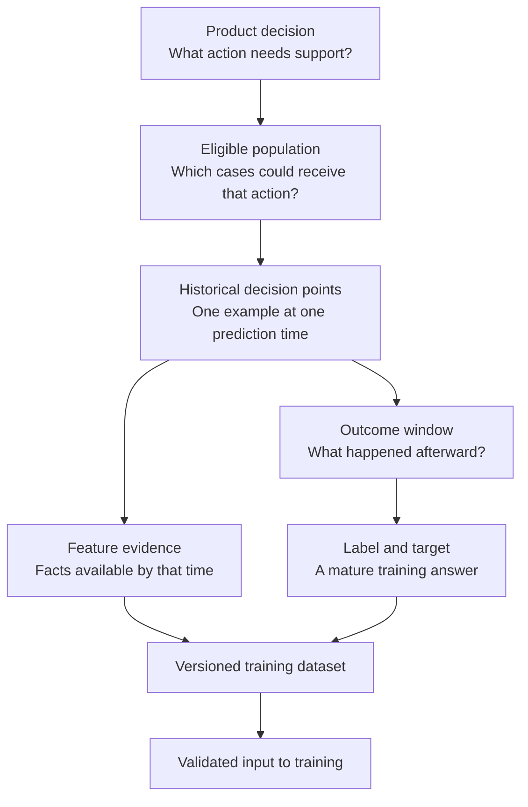
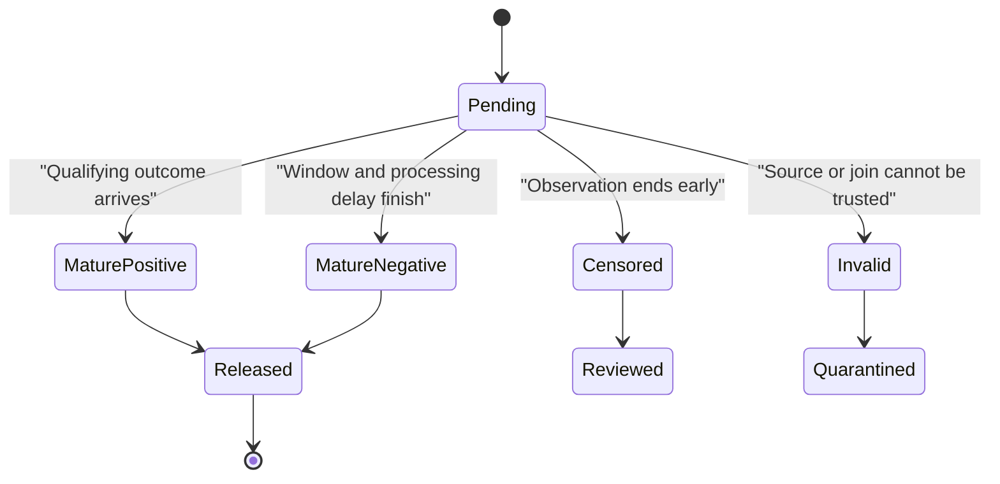

## Table of Contents

1. [A Training Row Describes One Past Decision](#a-training-row-describes-one-past-decision)
2. [Define Which Cases Become Rows And What Each Row Represents](#define-which-cases-become-rows-and-what-each-row-represents)
3. [Use Only Information Available At The Prediction Time](#use-only-information-available-at-the-prediction-time)
4. [Use Later Outcomes As The Answer The Model Learns](#use-later-outcomes-as-the-answer-the-model-learns)
5. [Keep Pending Outcomes Separate From Negative Outcomes](#keep-pending-outcomes-separate-from-negative-outcomes)
6. [Keep Future Information And Answers Out Of Features](#keep-future-information-and-answers-out-of-features)
7. [Write Down How The Product Question Maps To Dataset Rows](#write-down-how-the-product-question-maps-to-dataset-rows)
8. [Build The Dataset So The Same Version Can Be Recreated](#build-the-dataset-so-the-same-version-can-be-recreated)
9. [Give Every Published Dataset A Fixed Version](#give-every-published-dataset-a-fixed-version)
10. [Check Both Data Shape And Real-World Meaning](#check-both-data-shape-and-real-world-meaning)
11. [Verify One Example From Source To Training](#verify-one-example-from-source-to-training)
12. [The Main Idea](#the-main-idea)
13. [References](#references)

## A Training Row Describes One Past Decision
<!-- section-summary: A supervised training row recreates what the production system could have known at one historical decision and attaches the answer observed later. -->

At 09:00, a support system has to decide whether a newly opened ticket needs a specialist. At that moment it knows the ticket category, the customer plan, the current queue size, and the customer's earlier support history. The ticket is escalated at 16:00.

One useful training row recreates that 09:00 decision. Its input columns contain the facts available by 09:00. Its answer records that an escalation happened inside the next 24 hours. A private note written at 14:00 may explain the escalation to a human investigator. The production model could never have seen it at 09:00, so that note cannot enter the model's input.

This is the basic shape of **supervised machine learning**: the model learns a relationship between input evidence and known answers from historical cases. Each case is called an **example**. In a tabular dataset, an example usually starts as one row. Image, audio, text, and sequence models may represent one example through several stored objects.

The row has two sides:

- **features** contain the evidence supplied to the model;
- the **target** contains the value the training algorithm tries to predict.

The target comes from a **label**, meaning an observed, inferred, or human-reviewed answer attached to the historical case. Teams sometimes use *label* and *target* as synonyms. A small production distinction clarifies the data path. The label records what the data or reviewer said happened. The target records the exact value derived from that evidence for training.

A collection of rows needs several shared definitions. The team decides who belongs, what one row represents, and which clock separates past evidence from future outcomes. It also records how the rows can be rebuilt. Those choices encode the product problem before any learning algorithm sees the data.



The flow has a deliberate time boundary. Features look backward from the historical decision. The label looks forward. Dataset engineering joins those two views without allowing the future answer to leak into the earlier evidence.


*The row recreates one historical decision. Features capture what the system could know at prediction time, while the label and target come from an outcome observed later.*

## Define Which Cases Become Rows And What Each Row Represents
<!-- section-summary: Population, entity, grain, and prediction time define which historical cases exist and what each row means. -->

Before choosing columns, describe the cases that the product could actually score. This description prevents a technically valid table from representing the wrong decision.

### Choose Which Cases Can Enter The Dataset

The **population** is the full set of cases eligible for the prediction. A delivery-delay model may cover parcels accepted by a particular service, while excluding cancelled shipments and routes outside the supported network. Those rules affect what the model learns. If training quietly excludes difficult rural deliveries while production scores them, the training population and serving population disagree.

### Define The Object, Level Of Detail, And Time For Each Row

An **entity** is the real thing being described, such as an account, device, parcel, patient, document, or transaction. The entity key connects data from several sources. It also reveals repeated history: one account can create many transactions, and one device can produce many maintenance observations.

The **dataset grain** states what one row represents. “One row per customer” is incomplete if customers can receive weekly predictions. A precise grain would be “one row per eligible account at each weekly renewal decision.” Many production datasets therefore use `entity + prediction time` as the row key. A distinct event such as `transaction_id` can also provide the grain if its timestamp supplies the decision point.

The **prediction time** is the moment the production model would receive its inputs. Some teams call it the observation time or example timestamp, especially for offline studies. For a model that will drive a product action, prediction time is the clearer term. It asks what the running system could have known before taking that action.

Consider a machine-maintenance model. One machine generates sensor readings every minute, receives a risk score each hour, and may fail several days later. The machine is the entity. One hourly score is the example. The grain is one row per machine per scoring hour. The prediction time is the end of that hour. Several rows may therefore belong to the same machine.

That repetition affects later work. Dataset splitting may need to keep related rows together or separate them by time. Sample weighting may prevent frequently observed entities from dominating training. The grain also determines uniqueness: `machine_id` alone cannot be the row key, while `(machine_id, prediction_time)` may be valid.

A short design record should answer six questions before extraction starts:

1. Which product action will use the prediction?
2. Which cases are eligible to receive that action?
3. What real entity is being scored?
4. What event or schedule creates an example?
5. What columns uniquely identify one row?
6. At what instant must every input have been available?

These answers define the rows. Features and labels can now attach to a stable decision point.

## Use Only Information Available At The Prediction Time
<!-- section-summary: Features are model inputs whose meaning, source, transformation, and availability rule reproduce what production could know at the decision. -->

A **feature** is an input value supplied to the model. A raw field such as parcel weight can serve directly as a feature. A transformed value such as deliveries delayed on the same route during the previous seven days combines several events into one feature.

### Separate When An Event Happened From When It Became Available

The important property is availability. An event may occur before prediction time and still reach the system afterward. Suppose a payment happened at 08:50, the model scored an account at 09:00, and a correction containing the final amount arrived at 11:00. A historical warehouse queried today can see the corrected value. The live model lacked that corrected value at 09:00.

Production datasets often need two clocks for this reason:

- **event time** says when the business event happened;
- **availability time** says when the feature pipeline could use the record.

A feature is eligible only if its availability rule passes the prediction-time cutoff. This rule protects the model from learning with cleaner or newer information than production will receive.

Each feature definition connects the value to an entity and source. Its calculation, window, and availability rule define how time affects that value. The data type and missing-value policy define its representation. An owner and version identify who controls future changes.

“Orders in the last month” leaves several choices hidden. “Count completed orders available by prediction time in `(prediction_time - 30 days, prediction_time]`” gives both historical and serving implementations a testable meaning.

### Retrieve Historical Values Using The Feature Definition

Warehouse-scale batch data often uses SQL with dbt. Spark handles larger distributed histories, while Polars fits data that can run on one machine. The workload and the team's operating environment determine the engine.

A feature platform such as Feast earns its operating cost after several models need shared time-sensitive features, point-in-time historical retrieval, or low-latency online lookup. Product and domain owners define the feature meaning first. Feast then retrieves that definition consistently.

A **point-in-time join** selects the feature value that belonged to each entity at that row's prediction time. Feast historical retrieval scans backward from the timestamps in an entity dataframe and applies each Feature View's time-to-live limit. The source still has to preserve the required arrival and availability semantics; the retrieval layer cannot infer that a late record was absent from the live system. A warehouse query can implement the same responsibility with temporal conditions and deterministic tie-breaking. Either path needs tests for late records, duplicate timestamps, window boundaries, and missing history.

## Use Later Outcomes As The Answer The Model Learns
<!-- section-summary: Labels preserve outcome evidence and its provenance, while targets turn that evidence into the exact value optimized during training. -->

The label answers the historical prediction question after enough time has passed. For a ticket-routing model, the outcome might be escalation within 24 hours. For a demand model, it might be the number of units sold during the next seven days. For image classification, it may come from a reviewer who examined the image.

### A Label Records What Happened Later

Labels can come directly from the event the product cares about, or from a proxy. A **direct label** records the desired outcome itself, such as a verified payment chargeback. A **proxy label** uses another signal, such as a customer clicking “helpful” to approximate satisfaction. A proxy may arrive sooner or cover more examples, yet it can teach the model to optimize the proxy's quirks.

Label provenance records where the answer came from and how it was produced. For an event-derived label, useful evidence includes the source table, event type, event time, arrival time, deduplication rule, correction policy, and extraction version. For a human label, provenance also includes the annotation guide, reviewer or reviewer pool, adjudication state, and label-set version. Sensitive identities stay in a restricted evidence system; the training record can carry a governed reference.

### A Target Converts The Outcome Into A Learnable Value

The **target** is the training representation derived from that evidence. A cancellation event may produce a binary target called `cancelled_30d`. A qualifying cancellation maps to `1`. A fully observed 30-day period with no cancellation maps to `0`. A ranking task may derive pairwise preferences. A regression task may cap, transform, or normalize a measured quantity.

That derivation deserves its own version. A longer outcome window changes the learning problem. So does excluding a new event category or replacing a direct label with a proxy. The target column could keep the same name through all three changes, so its definition needs an explicit version.

Labels are observations with known limitations. Events can be missing, joins can fail, reviewers can disagree, and product actions can influence what happens next. If an earlier model sent the riskiest accounts to a retention team, their later cancellation labels reflect both customer intent and the intervention. Provenance and population analysis make those limitations visible.

## Keep Pending Outcomes Separate From Negative Outcomes
<!-- section-summary: Pending, censored, and invalid outcomes must remain separate from confirmed negative labels. -->

A future outcome takes time to observe. A row created yesterday cannot yet answer whether an event will happen during the next 30 days. Assigning `0` today would teach the model that “still pending” means “negative.”

### Pending And Negative Mean Different Things

An example has a **mature label** after its full outcome window and normal processing delay have passed. The delay matters because a qualifying event may reach the label source several hours or days after it occurred. The dataset release therefore needs a fixed **label as-of time**: the latest arrival time the build is allowed to use.

Some rows never receive a complete observation window. An account may leave the measurable system, a sensor may stop reporting, or the data-sharing agreement may end. This is **censoring**. A censored row tells us that the outcome was unobserved after a known point; the negative outcome remains unconfirmed.

One explicit label state prevents these cases from collapsing together:



Ordinary binary training usually admits the mature positive and mature negative states. Pending rows wait for a later dataset release. Invalid rows enter a quarantine path for repair.

### Account For Outcomes That Have Not Had Time To Appear

Some rows have only partial follow-up because the observation period ended, the entity left the system, or data collection stopped. These are **censored** outcomes. The dataset may exclude them while reporting coverage, or use a survival or time-to-event method designed for partial follow-up.

The choice can change the population. If customers with poor connectivity are censored more often, dropping every censored row underrepresents them. The build report should compare maturity and censoring rates across important segments before training proceeds.

A focused label query makes the cutoff visible. Here the outcome window is 24 hours and the source is allowed two additional hours to deliver events:

```sql
SELECT
  d.example_id,
  d.prediction_ts,
  CASE WHEN COUNT(o.outcome_id) > 0 THEN 1 ELSE 0 END AS escalated_24h
FROM eligible_decisions d
LEFT JOIN outcome_events o
  ON o.entity_id = d.entity_id
 AND o.occurred_at > d.prediction_ts
 AND o.occurred_at <= d.prediction_ts + INTERVAL 24 HOURS
 AND o.available_at <= :label_as_of
WHERE d.prediction_ts <= :label_as_of - INTERVAL 26 HOURS
GROUP BY d.example_id, d.prediction_ts;
```

The `WHERE` clause admits only mature examples. The join looks forward solely for the target. Feature retrieval remains a separate backward-looking operation. A production implementation also records cancelled decisions, source outages, and censoring rules instead of silently converting them to zero.


*Prediction time separates inputs from answers. Pending outcomes remain unknown until the maturity window closes, and future evidence never crosses backward into the features.*

## Keep Future Information And Answers Out Of Features
<!-- section-summary: Leakage occurs when a feature reveals future information, the target itself, or evidence unavailable to the production decision. -->

Training metrics can look excellent for the wrong reason. **Data leakage** occurs if the model learns from information that would be unavailable or forbidden at the real prediction moment.

The clearest form is **target leakage**. A feature such as `refund_processed` would almost reveal a refund target directly. Leakage can also hide behind a plausible timestamp. A final case status written two days after a risk score may describe the same entity and still belong to the future.

Temporal joins are a common source. A query that selects the latest customer record today can attach a later address, plan, or balance to an earlier decision. Preprocessing can leak too: fitting an imputer, vocabulary, or normalizer on the full dataset allows validation and test rows to influence training parameters.

Two reviews catch different problems. A semantic review asks whether the feature contains or closely encodes the answer. A time review proves `available_at <= prediction_time` for every feature source. Automated lineage can reveal that a target-source column feeds a feature transformation, while boundary fixtures test values immediately before and after the cutoff.

Suppose a delivery model uses `latest_driver_status`. Historical inspection finds that late deliveries often have status `investigation_open` several hours afterward. Replacing the current-state lookup with a point-in-time status history removes the future record. The team then rebuilds the dataset, reruns temporal assertions, and expects model quality to fall to a more honest level before evaluating a candidate.

Leakage has several deeper forms involving splits, related entities, preprocessing, and policy feedback. The foundational rule remains stable: every feature must reproduce evidence the deployed model could legally and operationally receive for that decision.

## Write Down How The Product Question Maps To Dataset Rows
<!-- section-summary: A dataset contract records the population, grain, time boundaries, features, target, provenance, and acceptance rules shared by product and engineering owners. -->

Several teams may touch a training dataset. Product defines the action, domain experts define meaningful outcomes, data engineering builds sources, and ML engineering trains the model. A **dataset contract** gives them one reviewable statement of the problem encoded by the rows.

The contract covers meaning as well as schema. Column names and types cannot explain a 24-hour outcome window. They also cannot prove that a corrected event arrived in time or explain why an account was excluded.

This compact example records the load-bearing choices:

```yaml
dataset: escalation_examples
contract_version: 4
owner: support-ml

population: "Tickets eligible for automated routing at initial assignment."
grain: "One row per ticket at initial routing."
example_key: ticket_id
entity_key: account_id
prediction_time: first_routed_at

feature_policy:
  cutoff: "available_at <= prediction_time"
  definitions: feature-contracts/support-v7.yaml

target:
  name: escalated_24h
  source: governed.support_outcomes
  window: "(prediction_time, prediction_time + 24 hours]"
  processing_delay: 2 hours
  label_states: [pending, mature, censored, invalid]

release_policy:
  require_mature_label: true
  maximum_duplicate_rate: 0
  minimum_label_join_coverage: 0.98
```

The contract gives each review a concrete object. Product can challenge the population and action. A domain owner can review qualifying outcomes. Data engineering can verify sources, clocks, and processing delay. ML engineering can verify feature availability, target encoding, and release checks.

A mature contract also records permitted use, sensitive fields, retention, deletion rules, and owners for each source. Dataset documentation such as a datasheet can explain collection history, known gaps, intended uses, and excluded uses in more depth. The executable contract protects the pipeline; the documentation preserves the human context needed to use the data responsibly.

## Build The Dataset So The Same Version Can Be Recreated
<!-- section-summary: A production build uses versioned sources, reviewed transformations, deterministic parameters, and an immutable output instead of an ad hoc notebook export. -->

The contract now needs a repeatable build. Reviewed code creates rows from pinned inputs under fixed parameters. Tests decide whether the result may be released. A named owner handles failures and approves the new output.

### Join Each Row Using Its Historical Cutoff

The build starts from a table of eligible historical decisions. This anchor table contains the example key, entity key, prediction time, and population evidence. Feature jobs join backward from those rows using availability cutoffs. The label job joins forward within the outcome window, waits for maturity, and records provenance. The final projection keeps feature columns separate from target and evidence columns.

### Choose A Processing Tool That Fits The Data

SQL and dbt are a strong default if the source data already lives in a warehouse. dbt model contracts can enforce column names and data types for supported materializations. Data tests then check row content such as uniqueness, nulls, accepted values, and relationships.

Spark fits large distributed joins and feature histories. Polars offers a lighter local engine for data that fits one machine. Orchestration can use the team's existing Airflow or Dagster estate, or a managed ML pipeline inside the selected platform.

### Record The Data Version, Code, And Build Run

Storage should preserve one complete, addressable dataset state. A cloud warehouse can provide immutable tables or snapshots. Object storage may use S3, Google Cloud Storage, or Azure Data Lake Storage. Delta Lake and Apache Iceberg add transactional snapshots and time travel over those files. Snapshot retention must cover the model's audit and reproduction horizon; an expired version cannot support a later rebuild.

Point-in-time feature retrieval belongs in the build only after time-varying reuse justifies a feature platform. Feast can join registered historical features onto an entity dataframe containing entity keys and timestamps. A simpler scheduled model may achieve the same contract with reviewed SQL and versioned warehouse tables.

Lineage connects the output back to the jobs and input datasets that produced it. Native catalogs cover this inside many managed platforms. OpenLineage provides a vendor-neutral event model and dataset facets for source identity, schema, versions, and data-quality evidence. Lineage identifies dependencies; it still needs contract versions and runtime parameters to explain the exact row logic.

## Give Every Published Dataset A Fixed Version
<!-- section-summary: A dataset release binds the resulting rows to source snapshots, transformation code, contract, parameters, label cutoff, and validation evidence. -->

A path such as `s3://ml-data/training/latest/` identifies a location whose contents can change. A query string identifies logic without freezing the tables it read. Reproducing a model requires an identity for the output and the evidence used to create it.

A useful release record binds together:

- the dataset name and release ID;
- the output table snapshot or immutable object manifest;
- every source table snapshot;
- the transformation Git commit and locked runtime;
- the dataset and feature contract versions;
- the population filter and build parameters;
- the prediction-time range and label as-of time;
- row counts, segment counts, and a content fingerprint;
- the validation run and approval state.

The content fingerprint, often called a **digest**, detects a different result. It should complement the durable snapshot instead of replacing it. Some dataframe digests sample or summarize data, and a logged source may point to a table that received further transformations before training.

MLflow Tracking can attach dataset metadata to the training run. This focused example records a Spark dataframe derived from a specific Delta table version and names the supervised target:

```python
import mlflow

training_data = mlflow.data.from_spark(
    training_df,
    table_name="ml_training.escalation_examples",
    version="842",
    targets="escalated_24h",
    name="escalation_examples_v4",
)

with mlflow.start_run():
    mlflow.log_input(training_data, context="training")
```

MLflow records the dataset name, digest, source, schema, profile, and training context where available. The run should also carry the contract version, code revision, label as-of time, and validation reference. The table snapshot supplies the durable data state; MLflow connects that state to the training attempt and resulting model evidence.

## Check Both Data Shape And Real-World Meaning
<!-- section-summary: Release validation checks structure, row meaning, time boundaries, label maturity, population coverage, distributions, and reproducibility before training consumes the data. -->

A training framework will happily fit a model to duplicated rows, immature negatives, missing segments, or leaked answers. Dataset validation needs to ask whether the release still represents the contract.

### Check Every Row Against The Dataset Rules

Start with **structural checks**. Required columns exist and types match. The example key is unique at the declared grain. Target values use the allowed domain, and required fields contain no nulls. Database constraints and dbt contracts catch some failures during table construction.

Then check **row semantics**. Every row belongs to the eligible population. Feature availability is at or before prediction time. Positive outcomes fall inside the target window. Negative targets have a completed observation window. Join multiplicity preserves the declared one-example grain.

### Check Population Size, Coverage, And Distributions

**Dataset-level checks** reveal failures spread across many valid-looking rows. Compare row count, label rate, missingness, feature coverage, censoring, and key segments with an approved reference. A sudden loss of one region may barely affect the global row count while leaving that population absent from training.

Native warehouse queries and dbt data tests are usually the smallest credible starting point. Great Expectations adds reusable expectation suites across supported dataframe and SQL data sources. TensorFlow Data Validation can compute statistics, compare them with a reviewed schema, and detect anomalies across training and serving datasets. Choose the tool from the data engine and existing operating model; the contract decides what must be checked.

### Block Failed Data And Publish Repairs As A New Version

A failed critical check stops publication. The pipeline quarantines the bad partition or release, keeps the previous approved snapshot available, and routes evidence to the source or transformation owner. After repair, it backfills the affected range and rebuilds under the same fixed parameters. Every gate runs again before a new immutable release is published. Editing a failed release in place would destroy the evidence needed for investigation.

The validation report belongs beside the dataset identity. A later model review should answer which checks passed, which warnings were accepted, who approved them, and which rows were excluded.

## Verify One Example From Source To Training
<!-- section-summary: Row-level reconstruction proves that the abstract contract produces the intended feature evidence and label for a real historical decision. -->

Aggregate tests can pass while one important join is wrong. Before approving a dataset, trace a small reviewed sample from the original decision through features, label, target, and final row.

Choose boundary cases on purpose. Include outcomes immediately inside and outside the target window. Add a feature arriving immediately after prediction time, an entity with no history, a corrected label, and a censored observation. For each case, an investigator should be able to recover:

1. why the case belonged to the population;
2. the entity, example key, and prediction time;
3. every feature source record and its availability time;
4. the label source, outcome window, and maturity decision;
5. the target transformation;
6. the contract, code, source snapshots, and output release.

Suppose a row has prediction time 10:00. A source event occurred at 09:52 and arrived at 10:04. The reviewed reconstruction excludes it from the features. A qualifying outcome at 13:00 enters the label because it sits inside the future window and arrived before the fixed label cutoff. The final row should reflect both decisions.

The same boundary fixture runs in CI against transformation code and in the scheduled pipeline against real storage. After a source migration, replaying it proves that identifier mapping, clocks, and joins still preserve the contract. A full rebuild from pinned snapshots should reproduce row counts and content fingerprints within the documented rules.

This verification gives the training run a trustworthy starting point. Model metrics can then measure learning quality instead of accidentally measuring a broken dataset construction path.

## The Main Idea
<!-- section-summary: Trustworthy training data is a versioned reconstruction of eligible historical decisions, bounded by time and backed by provenance and validation. -->

A supervised training dataset is a historical reconstruction of product decisions. The population defines which cases count. The entity and grain define one example. Prediction time separates available feature evidence from future outcome evidence. The label records what was observed, and the target turns that observation into the value the algorithm learns.

Production quality comes from preserving those meanings through the whole build. Source and label provenance explain where values came from. Explicit maturity and censoring states keep unknown outcomes away from confirmed negatives. Point-in-time rules protect the feature boundary. Contracts, immutable snapshots, dataset tracking, and validation make each release reviewable and reproducible.

The most useful final test is concrete. Select one row and explain why it exists and what the model could know. Then identify how the answer was observed and which exact dataset release supplied it to training. If the evidence supports every step, the model is learning from the problem the team intended to encode.


*A trustworthy dataset can be rebuilt, explained, and validated from source records to feature values, label, and target. The contract keeps each build tied to the intended product decision.*

## References

- [Google Machine Learning Glossary: examples, features, and labels](https://developers.google.com/machine-learning/glossary/fundamentals)
- [Google Rules of Machine Learning](https://developers.google.com/machine-learning/guides/rules-of-ml)
- [Google Machine Learning Crash Course: labels](https://developers.google.com/machine-learning/crash-course/overfitting/labels)
- [Google Production ML Systems: checking for label leakage](https://developers.google.com/machine-learning/crash-course/production-ml-systems/monitoring#check_for_label_leakage)
- [Feast point-in-time joins](https://docs.feast.dev/getting-started/concepts/point-in-time-joins)
- [dbt model contracts](https://docs.getdbt.com/docs/mesh/govern/model-contracts)
- [dbt data tests](https://docs.getdbt.com/reference/resource-properties/data-tests)
- [Delta Lake documentation](https://docs.delta.io/)
- [Apache Iceberg time-travel queries](https://iceberg.apache.org/docs/latest/spark-queries/#time-travel-queries-with-sql)
- [MLflow dataset tracking](https://mlflow.org/docs/latest/dataset/)
- [MLflow data API](https://mlflow.org/docs/latest/api_reference/python_api/mlflow.data.html)
- [OpenLineage object model](https://openlineage.io/docs/spec/object-model/)
- [Great Expectations: define expectations](https://docs.greatexpectations.io/docs/core/define_expectations/)
- [TensorFlow Data Validation guide](https://tensorflow.github.io/tfx/guide/tfdv/)
- [Datasheets for Datasets](https://arxiv.org/abs/1803.09010)
