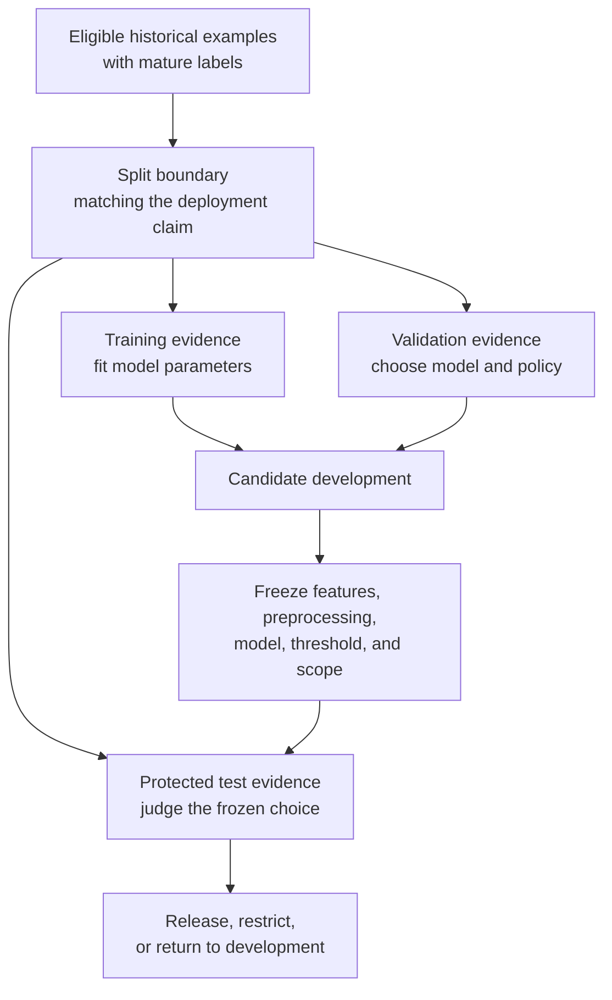
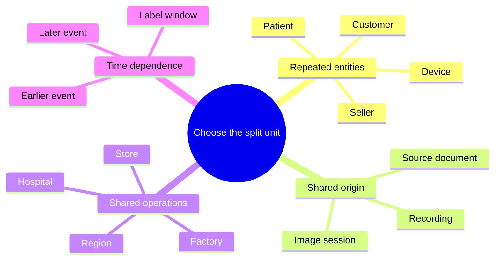
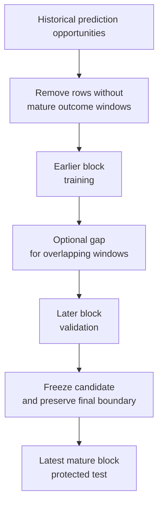
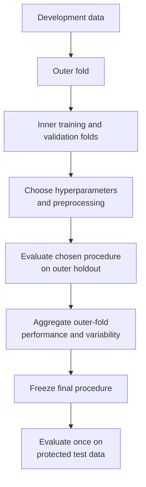
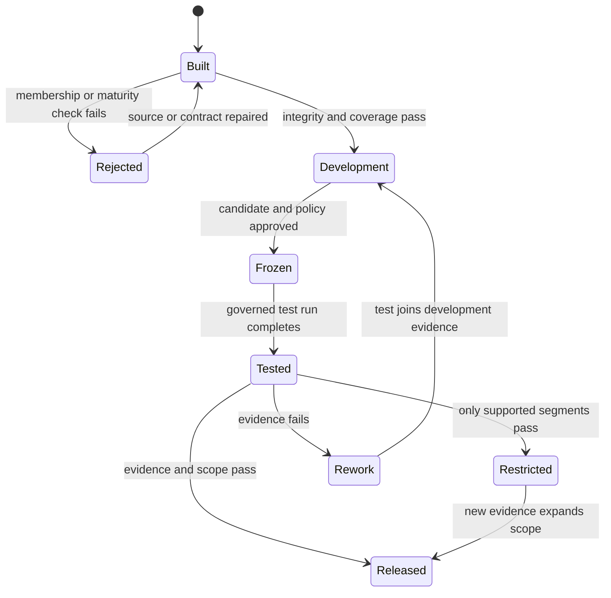

## Table of Contents

1. [Training, Model Selection, And Final Testing Need Separate Data](#training-model-selection-and-final-testing-need-separate-data)
2. [Train, Validation, And Test Have Different Roles](#train-validation-and-test-have-different-roles)
3. [Repeated Tuning Can Make Held-Back Results Less Trustworthy](#repeated-tuning-can-make-held-back-results-less-trustworthy)
4. [Keep Repeated Cases In The Same Split](#keep-repeated-cases-in-the-same-split)
5. [Split By Time When Production Predicts The Future](#split-by-time-when-production-predicts-the-future)
6. [Hold Out Whole Groups When Production Will See New Ones](#hold-out-whole-groups-when-production-will-see-new-ones)
7. [Keep Enough Positive, Rare, And Segment Examples In Every Split](#keep-enough-positive-rare-and-segment-examples-in-every-split)
8. [Use Cross-Validation Inside Development](#use-cross-validation-inside-development)
9. [Write The Split Rules And Save Exact Row Membership](#write-the-split-rules-and-save-exact-row-membership)
10. [Build The Splits With Tools That Fit The Data Size](#build-the-splits-with-tools-that-fit-the-data-size)
11. [Check Split Integrity Before Releasing The Model](#check-split-integrity-before-releasing-the-model)
12. [The Main Idea](#the-main-idea)
13. [References](#references)

## Training, Model Selection, And Final Testing Need Separate Data
<!-- section-summary: Training, model selection, and final release evaluation answer different questions, so they need evidence with different exposure to the development process. -->

A team trains a classifier, measures it on held-back data, and gets a promising score. The team then changes the features and checks the same held-back data again. It adjusts the model family, threshold, class weights, and missing-value policy, checking that same score after every change. The reported result improves after dozens of iterations.

Production performance can still disappoint them. The model never directly fitted those held-back labels, yet the development process did. Every decision moved toward what worked on that particular sample. The score now describes both the model and the team’s repeated exposure to the data.

Dataset splitting controls that exposure. The model-development process needs three genuinely different questions answered:

1. **Can the algorithm learn useful patterns from the available history?**
2. **Which candidate and operating policy should the team choose?**
3. **How well does the frozen choice support the claimed deployment scenario?**

The training set answers the first question. Validation evidence guides the second. A protected test set answers the third after the candidate and decision policy are frozen.



The word **held back** is only part of the design. A random row split may separate files while allowing records from the same patient, customer, device, document, or future period onto both sides. The resulting score can answer a much narrower question than the product team intends.

The right boundary follows the **generalization claim**. A support model may need to handle future tickets from known customers. A medical model may need to work at hospitals absent from development data. A vision model may need to inspect new components from machines already represented in training. Those claims call for different splits.

## Train, Validation, And Test Have Different Roles
<!-- section-summary: The three partitions differ by how the development process may use them, rather than by a universal percentage allocation. -->

The familiar three-way split separates three responsibilities. The percentages can vary with dataset size, event rarity, and the claim the test must evaluate. The role of each partition remains fixed.

### Use The Training Split To Fit Model Parameters

The **training set** is the data used by the estimator’s fitting process. A linear model learns coefficients from it. A decision tree chooses splits from it. A neural network updates weights from it. Oversampling, data augmentation, and class weighting belong inside this development path.

Preprocessing that learns from data also fits on training evidence. This includes imputation values, scaling statistics, category vocabularies, target encodings, feature selection, dimensionality reduction, and learned embeddings. In scikit-learn, a `Pipeline` helps keep those fitted transformations inside each training fold.

### Use The Validation Split To Choose The Model

The **validation set** guides choices around the fitted model. Those choices include the model family, hyperparameters, feature groups, preprocessing design, loss, calibration method, decision threshold, fallback policy, and product scope.

Suppose an alerting model produces probabilities. The team may choose a threshold that keeps review volume within staffing capacity while preserving a required recall. That threshold is part of the released system, so choosing it consumes validation evidence.

A model can be refitted on combined training and validation data after selection. That decision needs a reproducible procedure. The final test still evaluates the refitted candidate only after its features, preprocessing, hyperparameters, and threshold are fixed.

### Use The Test Split For One Final Evaluation

The **test set** estimates performance for the release claim. The team should avoid using it to choose features, thresholds, hyperparameters, exclusions, or the best candidate. The evaluation run records the frozen candidate and produces overall, segment, uncertainty, and operational metrics.

A failed test is useful evidence. It may reveal drift, weak segment coverage, or a brittle modeling choice. The result returns the work to development. Repeatedly modifying the system and rerunning the same test turns that test into another validation set. A later final review needs newly protected evidence, commonly from a later period or a separately governed holdout.

There is no universal 70/15/15 rule. Large datasets can reserve a smaller fraction and still retain strong test precision. Rare outcomes may require a longer test period. A costly site holdout may contain far more than 20% of the rows. Split size follows the uncertainty and coverage needed for the release decision.

## Repeated Tuning Can Make Held-Back Results Less Trustworthy
<!-- section-summary: Any dataset that repeatedly influences model choices participates in tuning, even if no training function directly fits on its labels. -->

Evaluation contamination is often described too narrowly as “training on the test set.” The deeper issue is adaptive decision-making. A human or automated search observes a result and changes the system in response.

### The Best Validation Score May Reflect Sample Noise

Imagine testing one hundred feature and hyperparameter combinations on one validation set. Some candidates will score unusually well through sample noise. Selecting the highest score favors both real signal and good luck. More searching increases the chance of choosing a candidate that exploits peculiarities in that validation period.

Validation remains valuable because development needs feedback. The response is to measure uncertainty, limit unprincipled search, use cross-validation where appropriate, and keep final evidence outside the loop. A tuning log should record which dataset influenced each decision.


*Training fits the model, validation guides development choices, and the protected test set supplies one final estimate after those choices are frozen.*

### Do Not Use Test Results To Tune The Model

The test set can be opened for the governed final evaluation. Its metrics then inform the release decision. That exposure should be recorded. If reviewers investigate individual test errors and redesign the system around them, the data has supplied development knowledge.

The old test data remains useful for later development and regression testing. It no longer supplies an untouched estimate for the revised candidate. The team protects a new final set or waits for a sufficiently independent future evaluation window.

Automated model selection follows the same rule. A CI pipeline that promotes whichever candidate wins on the test set is tuning on that set. The label “test” in a filename cannot preserve independence; only the data’s actual use can.

## Keep Repeated Cases In The Same Split
<!-- section-summary: The split unit should contain all rows that share information capable of making evaluation examples too familiar. -->

A row is often smaller than the real independent unit. One customer can create many transactions. One patient can have many visits. One device can emit thousands of sensor windows. One original photograph can produce many crops. Random row splitting can place near-duplicates or related observations into every partition.

### Entity Overlap Can Make Memorization Look Like Generalization

Suppose a model predicts whether a machine will fail. Each machine contributes hourly windows. A random row split lets the model learn the vibration baseline of machine `M42` from training and receive later windows from the same machine in test. That may be valid if deployment scores future windows from known machines. It gives weak evidence for a claim about entirely new machines.

The **split unit** is the smallest group that must stay together to support the claim. It may be a customer, patient, device, seller, household, source document, image session, or site. Every derived row and duplicate belonging to that unit follows the same assignment.



Duplicate control runs before and after assignment. Exact duplicate IDs should not cross partitions. Near-duplicate text, perceptual image hashes, repeated sensor windows, or records copied through reconciliation may need domain-specific detection. Removing only exact rows can leave almost identical evidence on both sides.

### Split By The Repeated Entity Even If Metrics Use Rows

A patient-level split can still report visit-level predictions. The uncertainty calculation should account for correlated visits, often through patient-level bootstrap sampling or aggregation. Treating every visit as independent can produce confidence intervals that look more precise than the evidence supports.

The same reasoning applies to users with many interactions and devices with many windows. Split membership protects independence across partitions. Metric estimation must also respect the dependency structure inside each partition.

## Split By Time When Production Predicts The Future
<!-- section-summary: Time-based splits train on earlier decisions and evaluate on later ones, preserving label maturity and realistic gaps between feature and outcome windows. -->

Many production models learn from the past and score later events. A time-based split rehearses that direction: training precedes validation, and validation precedes the protected test period.

### Place Rows According To Their Prediction Time

Use the timestamp of the real prediction opportunity. Order fulfillment time is too late for a model that scores at checkout. Diagnosis completion is too late for a model that assists triage. The split timestamp should match the decision moment defined by the dataset contract.

For a delayed outcome, recent rows may lack mature labels. A churn label defined over the next 30 days needs at least 30 days of outcome observation, plus an operational buffer for late events. Immature examples stay outside supervised evaluation.



A **gap** or **embargo** can protect boundaries where examples use overlapping history or future label windows. For example, a feature may summarize 14 days of device activity and a label may observe failure over the next seven days. Rows immediately beside a boundary can share much of the same raw evidence. The gap length follows those windows and the leakage threat.

### Test Several Future Periods When Data Allows

A single time holdout can be unusually calm, seasonal, or affected by one incident. Rolling-origin evaluation repeats the historical rehearsal across several cutoffs. Each fold trains on earlier data and evaluates on its next period. Reviewers can see average performance, variability, and sensitivity to specific regimes.

scikit-learn’s `TimeSeriesSplit` provides expanding time-ordered folds with optional `gap`, `test_size`, and `max_train_size`. Its documentation notes that equally spaced samples are needed for comparable fold durations. Event datasets with irregular spacing, multiple entities, or complex label windows often need a custom splitter or a SQL-built manifest.

The latest mature period can remain outside rolling development as the final test. Cross-validation over earlier periods supports selection; the final period tests the frozen procedure against the most recent eligible evidence.

## Hold Out Whole Groups When Production Will See New Ones
<!-- section-summary: Group-aware splits keep related rows together and can hold out whole entities, organizations, devices, or sites that deployment must generalize to. -->

Group-based splits answer a different question from ordinary time splits. A time split can include the same entities in earlier and later periods. A group split asks how the model behaves on groups absent from fitting.

### Choose Groups That Match The Real Deployment

A medical model deployed to new hospitals should hold out hospitals, rather than only patients. A personalization model that serves returning users may allow user overlap across time. Its cold-start claim needs a separate user-held-out evaluation. A quality model expected to move to a new factory needs factory-level evidence even if each factory contains many machines.

GroupKFold keeps every group in one fold. GroupShuffleSplit creates randomized group-level holdouts. StratifiedGroupKFold attempts to preserve class proportions while keeping groups separate. scikit-learn describes stratification here as an engineering aid for workable folds; it cannot guarantee a perfect class balance under restrictive group structures.

### Combine Time And Group Boundaries When Both Matter

A model may need to score future events for both established and new customers. One evaluation can contain two cohorts:

- later events from entities represented in the training period;
- later events from entities first observed after the training cutoff.

The overall score answers the mixed production workload. Separate cohort metrics reveal whether cold-start behavior is weaker. Another design may reserve entire sites across every time period and perform rolling evaluation inside the remaining sites.

There is no universal library call for every combination. Large platforms often build assignments in SQL, Spark, or a dataset pipeline from explicit entity, site, and time rules. The resulting manifest is then consumed by training libraries instead of recreating the split inside each experiment.


*The split boundary should match the way production must generalize, preventing both entity overlap and future information from entering development.*

## Keep Enough Positive, Rare, And Segment Examples In Every Split
<!-- section-summary: A structurally correct boundary still needs enough outcomes and product segments to support the metrics used in a release decision. -->

A clean split can still produce weak evidence. A fraud test set with five confirmed positives cannot support a stable recall claim. A medical holdout containing one small hospital cannot establish broad site performance. Coverage design asks whether each partition contains enough of the cases the product decision cares about.

### Balance Classes Only Inside The Allowed Time And Group Boundaries

**Stratification** tries to preserve a class distribution across partitions or folds. It is useful for independent rows with an imbalanced target. It should not break the more important entity or time boundary. A perfectly balanced random split can still leak users or future information.

For time splits, natural prevalence changes are often part of the deployment challenge. Forcing every period to have the same rate can erase the shift the evaluation is meant to reveal. Record the observed prevalence and choose metrics that remain meaningful under imbalance.

Training data may use oversampling, undersampling, or synthetic examples. Validation and test sets should preserve the evaluation population. Artificially balancing the test set changes predictive values and hides operational workload unless the metrics are reweighted back to deployment prevalence.

### Rare Events Need More Independent Examples

Rare outcomes often require a longer evaluation window, several rolling periods, or broader governed data access. Reviewers should see the number of positives and negatives behind each metric.

The metric should match the decision. Precision-recall curves and average precision describe ranking under class imbalance. Recall at a fixed review workload describes an operating point. Calibration metrics show whether predicted probabilities support risk-based action.

Uncertainty should accompany the estimate. Bootstrap intervals can resample the independent unit, such as customers or hospitals. Very small counts may need exact binomial intervals for simple rates. A wide interval is a truthful result; suppressing it only hides uncertainty.

### Each Reported Segment Needs Enough Evidence

Required segments come from product scope, risk analysis, geography, device type, channel, and policy obligations. For each split, record row count, independent-unit count, positive count, label rate, missingness, and key feature coverage. Intersectional segments may reveal failures hidden in one-dimensional reports.

If a required segment lacks evidence, the release can wait for more data, narrow its supported scope, add human review, or launch with an explicit monitoring gate. A global metric supports only the populations represented by adequate evidence.

## Use Cross-Validation Inside Development
<!-- section-summary: Cross-validation reuses development data across structured folds, while a separately protected test remains outside model and policy selection. -->

Cross-validation helps a team learn from limited data. It rotates which development examples act as validation evidence and summarizes performance across folds. Its value comes from making better use of development evidence; the folds still need a boundary that matches the deployment claim.

### Apply The Same Leakage Rules To Every Fold

Ordinary K-fold validation assumes rows can be exchanged across folds. GroupKFold protects repeated entities. StratifiedGroupKFold also tries to preserve class proportions. TimeSeriesSplit preserves order. Custom folds may be needed for sites, overlapping windows, spatial dependence, or combined entity-time constraints.

Every fitted transformation belongs inside each fold. If a scaler, imputer, vocabulary, or feature selector is fitted once on the full development dataset before cross-validation, validation folds influence the transform. A pipeline should fit those components on the training portion of each fold.

### Use An Outer Evaluation Loop For Heavily Tuned Models

Repeated hyperparameter search can overfit cross-validation results. **Nested cross-validation** adds an inner loop for model selection and an outer loop for evaluation. The outer score estimates the whole selection procedure rather than the single best inner-fold result.



Nested CV costs more computation and can be unnecessary for large datasets with strong, representative holdouts. It is useful for small datasets, extensive tuning, and situations where selection bias materially affects the claim.

### Keep The Final Test Outside Cross-Validation

The protected test estimates the frozen development procedure on evidence untouched by inner and outer selection. For a future-deployment claim, it can be the latest mature time block. For a new-site claim, it can be separately held-out sites. Its design should remain consistent with the same grouping, time, and label-maturity rules.

## Write The Split Rules And Save Exact Row Membership
<!-- section-summary: A split contract records the intended boundary, while a versioned manifest records the exact membership produced by that boundary. -->

A seed and a percentage leave important details unresolved. Source rows can arrive in a different order, duplicates can be corrected, labels can mature, and library algorithms can evolve. Reproduction needs both the rule and the exact data version.

### Record Why Each Boundary Was Chosen

A **split contract** explains the deployment claim, unit, clocks, label maturity, boundaries, exclusions, coverage requirements, and allowed use of each partition.

```yaml
split_contract:
  version: 4
  claim: future events for known and newly arriving accounts

  source:
    dataset: governed.risk_examples
    snapshot: ${TABLE_SNAPSHOT}
    example_id: decision_id

  boundary:
    prediction_time: decision_at
    group_key: account_id
    order: time
    train: earliest_12_periods
    validation: next_2_periods
    test: final_2_mature_periods
    embargo_days: 7

  label_maturity:
    outcome_window_days: 30
    late_event_buffer_days: 3

  allowed_use:
    train: fit transforms and model parameters
    validation: select candidate, threshold, and release scope
    test: one governed evaluation after candidate freeze

  required_reports:
    - overall
    - returning_accounts
    - new_accounts
    - required_product_segments
```

Relative period names keep the contract reusable. The materialized manifest resolves them to precise cutoffs for one dataset release. The source snapshot may be a Delta version, Iceberg snapshot, warehouse snapshot, immutable object prefix, lakeFS commit, or DVC-tracked revision.

### Save Which Rows Belong To Each Split

The **split manifest** is a small, durable dataset that maps each immutable example ID to `train`, `validation`, `test`, `gap`, or `excluded`. It also records the contract version, source snapshot, assignment reason, group ID or hash, prediction time, and label-maturity status.

Storing the manifest as Parquet or a governed table scales better than copying the full dataset into three folders. Training jobs join against it. Review queries can prove that an entity or example appears in only one protected partition. A checksum or digest detects accidental changes.

Randomized assignments still record a seed, splitter name, library version, and source ordering policy. Hash-based assignment can remain stable as data grows. Hash the protected unit itself: `account_id` keeps the account together, while `transaction_id` can scatter one account across partitions.

## Build The Splits With Tools That Fit The Data Size
<!-- section-summary: Production stacks build a versioned assignment once, validate it in the data platform, and pass the same membership to training and evaluation tools. -->

The implementation can stay small after the boundary is well defined. The important design choice is to produce one authoritative assignment rather than letting every notebook invent its own split.

### Use Library Splitters For Local And Moderate-Size Data

scikit-learn provides `train_test_split` for independent random rows, GroupShuffleSplit for group holdouts, StratifiedGroupKFold for class-aware grouped folds, and TimeSeriesSplit for ordered folds. This group-aware three-way split keeps each account in one partition:

```python
from sklearn.model_selection import GroupShuffleSplit

outer = GroupShuffleSplit(n_splits=1, test_size=0.20, random_state=17)
development_idx, test_idx = next(
    outer.split(rows, labels, groups=rows["account_id"])
)

inner = GroupShuffleSplit(n_splits=1, test_size=0.25, random_state=29)
train_local, validation_local = next(
    inner.split(
        rows.iloc[development_idx],
        labels.iloc[development_idx],
        groups=rows.iloc[development_idx]["account_id"],
    )
)

train_idx = development_idx[train_local]
validation_idx = development_idx[validation_local]
```

The second 25% split applies only to the 80% development portion, producing an approximate 60/20/20 allocation. Group counts, row counts, and class balance will vary. CI should verify coverage rather than assuming the requested fractions guarantee it.

### Build Large Or Combined Splits In The Data Platform

SQL, dbt, Spark, Databricks, BigQuery, Snowflake, or another governed data platform is often a better place for large time-and-group assignments. The job reads a pinned snapshot, filters mature labels, assigns periods and groups, writes the manifest, and runs data tests.

dbt tests or equivalent checks can enforce unique example IDs, accepted split names, non-null group keys, and referential coverage. Custom queries verify zero forbidden group overlap, chronological ordering, gaps, positive counts, and segment coverage. Delta Lake or Iceberg preserves the physical data version used to create the manifest.

DVC fits file-oriented projects that need data references versioned alongside Git. lakeFS can provide Git-like commits over object-store data. These tools solve data-version identification and reproduction; the split contract still defines the statistical boundary.

### Attach Split Evidence To The Model Run

MLflow datasets can record a name, source, digest, schema, profile, and target. Each partition can be logged with a distinct context:

```python
for name, frame in split_frames.items():
    dataset = mlflow.data.from_pandas(
        frame,
        source=manifest_uri,
        name=f"risk_examples_{name}",
        targets="label",
    )
    mlflow.log_input(dataset, context=name)
```

The manifest URI, source snapshot, contract version, and tuning-history reference should also be run tags or artifacts. Tracking metadata improves traceability. The governed table or versioned object remains the source needed to rebuild the rows.

Managed training systems such as SageMaker, Gemini Enterprise Agent Platform Managed Training, Azure Machine Learning, and Databricks can consume explicit channels, tables, queries, or files for each split. Their experiment trackers and registries help retain evidence. None can infer the correct entity, time, site, or label boundary from generic train and test filenames.

## Check Split Integrity Before Releasing The Model
<!-- section-summary: Release gates prove partition integrity, candidate independence, coverage, and reproducibility before anyone relies on the final metric. -->

A trustworthy split produces testable facts about membership, timing, coverage, and process independence. The data pipeline verifies the data-boundary facts before training. The release workflow then verifies that model selection and final evaluation used each partition only for its assigned purpose.

### Check For Overlap And Boundary Violations

Every eligible example receives exactly one assignment. Train, validation, and test example IDs are disjoint. Forbidden group overlap is zero. Time windows follow the required order. Embargo rows stay outside adjacent partitions. Every supervised row has a mature label.

The job also detects duplicate and near-duplicate leakage using domain-appropriate identifiers. Preprocessing pipelines are fitted from training evidence inside each fold. A feature-availability audit checks that each example uses information available at its prediction time.

### Check Sample Size And Segment Coverage

Each partition reports total examples, independent units, target prevalence, positive count, missingness, and required segment coverage. Evaluation metrics include uncertainty and operational context. A threshold metric should state its workload, such as recall at a maximum review rate.

For a time claim, rolling results reveal stability across periods. For a new-site claim, site-level results reveal whether one large site dominates the aggregate. For rare outcomes, the gate can require a minimum event count or narrow the release scope.

### Confirm The Test Stayed Independent And Can Be Recreated

The release record identifies every candidate compared on validation evidence and confirms that the test remained outside those choices. It pins code, parameters, feature definitions, source snapshot, split contract, manifest digest, model artifact, and metric implementation.



A failing test should preserve the failure rather than overwrite it with another “final” run. The team diagnoses the cause, updates the model or scope, and returns to validation. A newly protected test window supports the revised release.

Reproducibility verification reruns the manifest job against the pinned snapshot and contract. It compares membership counts and digest with the released manifest. The model evaluation then reruns from the frozen artifact and metric code. Matching results leave a reproducible audit record tied to the released manifest and model artifact.

## The Main Idea
<!-- section-summary: A good split protects independent answers to learning, selection, and final release questions while matching the real deployment boundary. -->

Train, validation, and test describe how evidence may influence development. The split shape describes which examples belong together. Both parts matter.

Random stratification can suit independent rows from a stable population. Time blocks rehearse future deployment. Group holdouts test unseen entities or sites. Rolling and nested cross-validation strengthen development evidence under limited data. A final protected test judges the frozen procedure and product scope.

The practical standard is clear: state the deployment claim, protect the unit that can repeat, respect prediction time and label maturity, verify rare outcomes and segments, record exact membership, and preserve the data and code versions behind the result. A model score deserves trust only if the team can explain what question its split actually answered.


*A durable split contract records the unit, time and group rules, seed, exact row membership, and integrity checks behind the evaluation.*

## References

- [scikit-learn cross-validation guide](https://scikit-learn.org/stable/modules/cross_validation.html)
- [scikit-learn train_test_split](https://scikit-learn.org/stable/modules/generated/sklearn.model_selection.train_test_split.html)
- [scikit-learn GroupShuffleSplit](https://scikit-learn.org/stable/modules/generated/sklearn.model_selection.GroupShuffleSplit.html)
- [scikit-learn StratifiedGroupKFold](https://scikit-learn.org/stable/modules/generated/sklearn.model_selection.StratifiedGroupKFold.html)
- [scikit-learn TimeSeriesSplit](https://scikit-learn.org/stable/modules/generated/sklearn.model_selection.TimeSeriesSplit.html)
- [scikit-learn nested versus non-nested cross-validation](https://scikit-learn.org/stable/auto_examples/model_selection/plot_nested_cross_validation_iris.html)
- [scikit-learn common pitfalls and data leakage](https://scikit-learn.org/stable/common_pitfalls.html)
- [dbt data tests](https://docs.getdbt.com/docs/build/data-tests)
- [Delta Lake table history](https://docs.delta.io/delta-utility/)
- [Apache Iceberg Spark queries](https://iceberg.apache.org/docs/latest/spark-queries/)
- [MLflow dataset tracking](https://mlflow.org/docs/latest/dataset/)
- [DVC data and pipeline versioning](https://dvc.org/doc/user-guide)
- [lakeFS data versioning concepts](https://docs.lakefs.io/latest/understand/model/)
