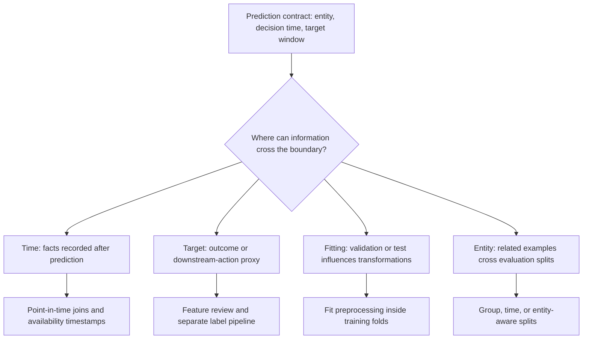
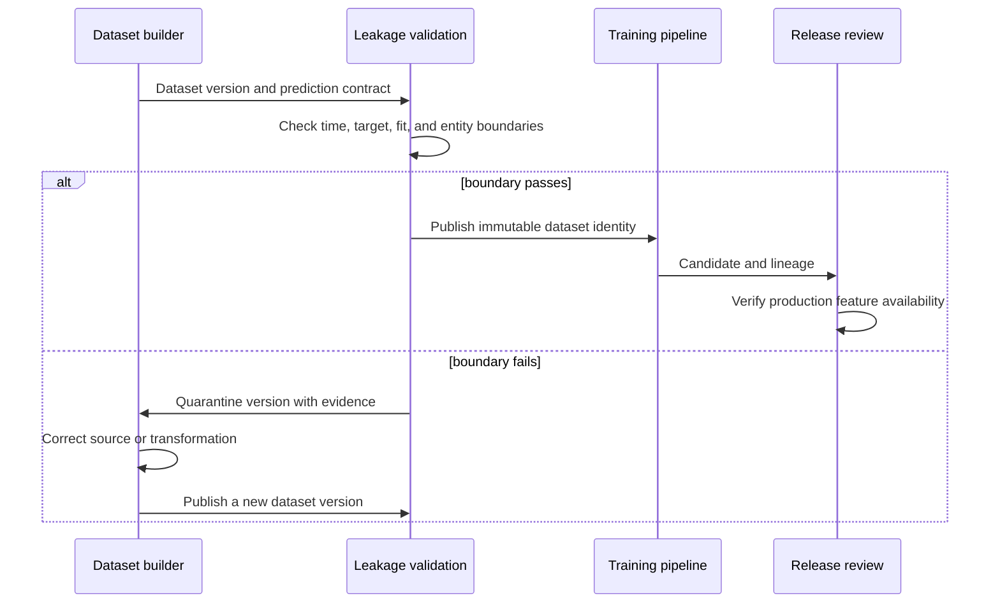

## Data Leakage Lets The Model Learn From Forbidden Information
<!-- section-summary: Data leakage happens when model training or evaluation uses data that would be unavailable at prediction time. -->

**Data leakage** happens when a model learns from information that would be unavailable when the model runs in production. The score can look excellent during development because the model sees hints from the future, the target, or repeated entities across splits. Production then exposes the truth because those hints are absent.

Leakage has four major paths. **Temporal leakage** uses facts created after prediction time. **Target leakage** includes the answer or a proxy created by the outcome process. **Transformation leakage** lets validation or test data influence preprocessing, selection, or tuning. **Entity contamination** puts related or duplicate examples on both sides of an evaluation boundary. Point-in-time joins, pipeline fitting boundaries, group-aware splits, and lineage checks address different paths; no one train-test split prevents all four.



This map gives each leakage path a matching control. A point-in-time join can prevent future records from entering a feature, yet it cannot stop a target encoder from learning category statistics from validation labels. A training-only preprocessing pipeline protects the fitting boundary, yet it cannot detect two accounts from the same household on opposite sides of a split. The review needs the full taxonomy because each control protects a different information boundary.

The previous article explained split purpose and shape. Leakage analysis asks a stricter question about every value and transformation: could the deployed system have produced this input, using only information and fitted state available at that prediction moment? This question covers timestamps, but also target-derived fields, globally fitted encoders, duplicates, household relationships, and human decisions made after a model score.

## A Subscription Churn Model As A Supporting Example
<!-- section-summary: A churn example shows temporal, target, preprocessing, and entity leakage around one weekly prediction moment. -->

**StreamNest** is a video subscription product. The team wants to predict whether an active subscriber will cancel in the next 30 days, so the retention team can offer help, plan content recommendations, or improve onboarding. The model runs every Monday morning for active subscribers.

For StreamNest, one example represents one subscriber at one weekly scoring date. The entity is `subscriber_id_hash`, the prediction timestamp is `score_week_start_ts`, and the target is `churned_next_30d`. Features should describe activity before Monday morning: watch minutes, failed payments before the score time, support tickets already opened, plan type, tenure, and device mix.

The tempting fields arrive later. Cancellation reason, win-back offer response, final invoice status, last-watch date after the scoring date, and support tickets opened after the scoring date all describe the future. They can help analysts explain churn after it happens, yet they should stay out of the model inputs for Monday morning scoring.

Here is the contract the team reviews:

| Field | Allowed as feature? | Reason |
|---|---|---|
| `watch_minutes_14d_before_score` | yes | Known before Monday scoring |
| `failed_payment_count_30d_before_score` | yes | Known before Monday scoring |
| `support_ticket_count_7d_before_score` | yes | Known before Monday scoring |
| `cancel_reason` | no | Filled after a subscriber cancels |
| `days_until_cancel` | no | Derived from the future target window |
| `retention_offer_accepted` | no | Happens after the model selects outreach candidates |

This review is plain, and that is why it works. Every feature needs an availability rule tied to `score_week_start_ts`. Any field without that rule should pause the release review.


*The score-time boundary makes leakage visible: features can use facts known before scoring, while future cancellation evidence stays blocked.*

## Future Information Leakage
<!-- section-summary: Future information leakage uses data recorded after the prediction timestamp as if it were available before scoring. -->

**Future information leakage** is the most direct leakage path. It uses a value recorded after prediction time to train a model that will run earlier. StreamNest might accidentally include `last_watch_ts` from the full customer history. That field gives the model a strong hint because subscribers who cancel often stop watching before the label window ends.

The fix starts with source filters. Feature queries should limit source events to values at or before `score_week_start_ts`. The query should also create feature names that include the lookback window, because a name like `watch_minutes` hides the timing rule.

```sql
SELECT
  e.subscriber_id_hash,
  e.score_week_start_ts,
  SUM(w.watch_minutes) AS watch_minutes_14d_before_score
FROM ml_examples.churn_scoring_weeks e
LEFT JOIN warehouse.watch_events w
  ON w.subscriber_id_hash = e.subscriber_id_hash
  AND w.event_ts >= TIMESTAMP_SUB(e.score_week_start_ts, INTERVAL 14 DAY)
  AND w.event_ts < e.score_week_start_ts
GROUP BY e.subscriber_id_hash, e.score_week_start_ts;
```

The important rule is the upper bound on `w.event_ts`. The feature query only uses events before the scoring week starts. This same shape should appear in payments, support tickets, recommendations, and other time-windowed features.

## Target And Preprocessing Leakage
<!-- section-summary: Target leakage and preprocessing leakage let the label or evaluation data influence feature creation before training. -->

**Target leakage** happens when a feature directly or indirectly includes the answer. StreamNest could create `has_cancel_ticket_next_30d`, `retention_offer_sent`, or `refund_issued_after_cancel`. Those fields predict churn because they describe the churn process itself.

**Preprocessing leakage** happens when transformations learn from validation or test data before model review. For example, a scaler can compute means from the full dataset, or a target encoder can use labels from the validation month while building category statistics. The model may then receive information from rows that should have stayed outside training.

In Python, the safer pattern is to fit preprocessing on training rows and apply it to validation or test rows through a pipeline:

```python
from sklearn.compose import ColumnTransformer
from sklearn.impute import SimpleImputer
from sklearn.pipeline import Pipeline
from sklearn.preprocessing import OneHotEncoder, StandardScaler
from sklearn.linear_model import LogisticRegression

numeric_features = ["watch_minutes_14d_before_score", "failed_payment_count_30d_before_score", "tenure_days"]
categorical_features = ["plan_type", "primary_device_family"]

preprocess = ColumnTransformer(
    transformers=[
        ("num", Pipeline([("imputer", SimpleImputer()), ("scaler", StandardScaler())]), numeric_features),
        ("cat", OneHotEncoder(handle_unknown="ignore"), categorical_features),
    ]
)

model = Pipeline(
    steps=[
        ("preprocess", preprocess),
        ("classifier", LogisticRegression(max_iter=1000)),
    ]
)

model.fit(X_train, y_train)
validation_scores = model.predict_proba(X_validation)[:, 1]
```

The pipeline fits imputers, scalers, encoders, and the classifier during `model.fit(X_train, y_train)`. Validation data only flows through the already fitted transformation path. This pattern aligns with scikit-learn's guidance to avoid leakage during preprocessing.


*Preprocessing stays leakage-safe when it learns statistics from training rows first, then applies those fitted steps to validation and test rows.*

## Entity Leakage Across Splits
<!-- section-summary: Entity leakage happens when the same real-world person, account, device, or item appears on both sides of a split in a way that inflates evaluation. -->

**Entity leakage** appears when the same real-world entity crosses split boundaries and gives the model an easy memory path. StreamNest scores subscribers weekly, so one subscriber can appear many times. If the team randomly splits weekly rows, the model may train on a subscriber in March and evaluate on the same subscriber in April.

Sometimes that design is acceptable because production also scores the same subscriber repeatedly. The danger comes when the evaluation question claims the model generalizes to new subscribers while the split contains repeated subscribers across train and test. The split should match the claim.

StreamNest can run an overlap check:

```sql
WITH train_entities AS (
  SELECT DISTINCT subscriber_id_hash
  FROM ml_curated.churn_examples
  WHERE split_name = 'train'
),
test_entities AS (
  SELECT DISTINCT subscriber_id_hash
  FROM ml_curated.churn_examples
  WHERE split_name = 'test'
)
SELECT
  COUNT(*) AS overlapping_subscribers
FROM train_entities tr
JOIN test_entities te
  USING (subscriber_id_hash);
```

If the release review targets all active subscribers, a time split with repeated entities can make sense. If the model supports a new-market launch with many new subscribers, the team may need an entity holdout or a separate new-subscriber test slice.

## Point-In-Time Joins
<!-- section-summary: Point-in-time joins attach historical feature values as they existed at each prediction timestamp. -->

A **point-in-time join** attaches feature values to examples as of each row's prediction timestamp. This is the core operation behind leakage-free training data for time-based models. The join should choose the latest valid feature record at or before the scoring timestamp, with freshness limits where needed.

For StreamNest, a subscriber plan feature may update whenever the user changes plans. The model should use the plan that was active on Monday morning, not the plan after cancellation. A point-in-time query can express that rule:

```sql
WITH ranked_plan AS (
  SELECT
    e.subscriber_id_hash,
    e.score_week_start_ts,
    p.plan_type,
    p.updated_ts,
    ROW_NUMBER() OVER (
      PARTITION BY e.subscriber_id_hash, e.score_week_start_ts
      ORDER BY p.updated_ts DESC
    ) AS plan_rank
  FROM ml_examples.churn_scoring_weeks e
  JOIN warehouse.subscriber_plan_history p
    ON p.subscriber_id_hash = e.subscriber_id_hash
    AND p.updated_ts <= e.score_week_start_ts
)
SELECT
  subscriber_id_hash,
  score_week_start_ts,
  plan_type
FROM ranked_plan
WHERE plan_rank = 1;
```

Feature-store systems such as Feast provide point-in-time retrieval so teams avoid rewriting this logic for every model. Even when a team writes SQL directly, the same principle applies: the feature value must represent what the model could have known at prediction time.

## Prove The Prediction-Time Boundary
<!-- section-summary: A leakage review checks feature availability, label definitions, preprocessing, entity overlap, and suspicious metric jumps. -->

Leakage reviews should happen before model approval, especially when a new feature group creates a large score jump. The reviewer should ask for evidence, not reassurance. A short checklist helps the team make the review repeatable.

| Check | Evidence to request | StreamNest example |
|---|---|---|
| Prediction timestamp exists | Dataset column and contract | `score_week_start_ts` on every row |
| Feature availability rule exists | Feature definition file | All windows end before score time |
| Label query is separate from features | SQL review | `churned_next_30d` only appears as target |
| Preprocessing fits on train only | Pipeline code or test | Encoders and scalers fitted in training pipeline |
| Entity overlap is intentional | Overlap query and release claim | Weekly repeat subscribers reviewed explicitly |
| Metric jump has explanation | Diff report and feature review | New support-ticket feature checked for future tickets |

The team should also add a suspicious-feature report. Very high single-feature importance for a field with vague timing should trigger review. A model that suddenly reaches near-perfect validation performance usually deserves a data investigation before any release celebration.

Leakage checks should run at several boundaries. Dataset construction checks timestamps and join eligibility. Training checks which rows fit transforms and tune hyperparameters. Evaluation checks entity overlap and confirms that the protected test set influenced no model choice. Release review checks whether every feature can be produced with the same source, timing, and policy in production.

When a check fails, quarantine the affected dataset version and preserve its manifest, queries, and report. The data owner determines whether the source timestamp is wrong, the join used a future record, the label entered the feature path, or the split contract was violated. The team then rebuilds a new dataset identity and reruns every experiment that used the contaminated version. Editing the dataset under the old version would leave earlier run evidence pointing at changed content.



This response path matters because leakage invalidates the meaning of the evaluation, not only one metric row. A model trained from contaminated evidence should return to the candidate state even when its serving tests pass.

## Habits That Prevent Leakage
<!-- section-summary: Leakage prevention improves when teams make prediction time, label windows, and train-only preprocessing normal review habits. -->

Leakage prevention is easier when it is part of the normal dataset workflow. StreamNest adds three habits to every training-data pull request. First, each example table must have a prediction timestamp. Second, the label query must state the future window it uses. Third, preprocessing code must show which rows are used for fitting encoders, imputers, and scalers.

Those habits make review concrete. Instead of asking whether the dataset "looks safe," a reviewer can inspect the timestamp, label window, and fit boundary. That keeps leakage from hiding inside a clever join or a convenient preprocessing helper.

## Putting It Together
<!-- section-summary: Leakage prevention protects the promise that model evaluation reflects the information production will actually have. -->

For StreamNest, leakage prevention means every feature has a time boundary, every target comes from a reviewed label query, preprocessing fits only on training rows, and entity overlap matches the release claim. These habits keep the model from learning future cancellation evidence that Monday morning scoring would never have.

The next article stays with labels and asks how teams create trustworthy targets when humans must interpret examples. It covers annotation instructions, blind overlap, agreement, adjudication, versioned label releases, and the operating checks that keep the labeling process healthy.


*A leakage review asks for concrete evidence around time, labels, preprocessing, and entity overlap before the team trusts the model score.*

## References

- [scikit-learn common pitfalls: data leakage](https://scikit-learn.org/stable/common_pitfalls.html#data-leakage)
- [Feast point-in-time joins documentation](https://docs.feast.dev/getting-started/concepts/point-in-time-joins)
- [TensorFlow Data Validation get started guide](https://www.tensorflow.org/tfx/data_validation/get_started)
- [dbt data tests documentation](https://docs.getdbt.com/docs/build/data-tests)
