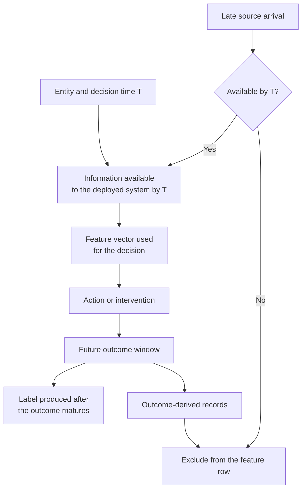
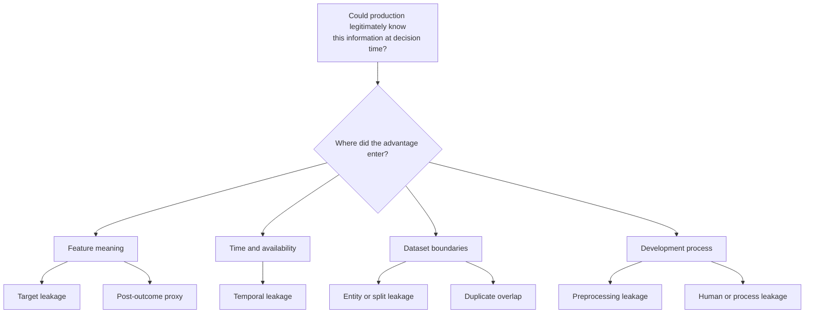
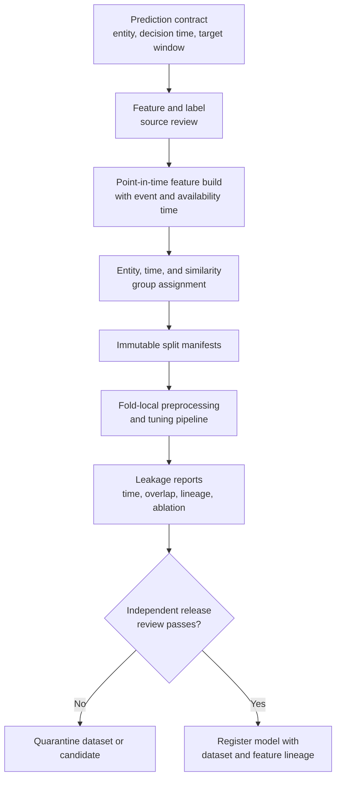
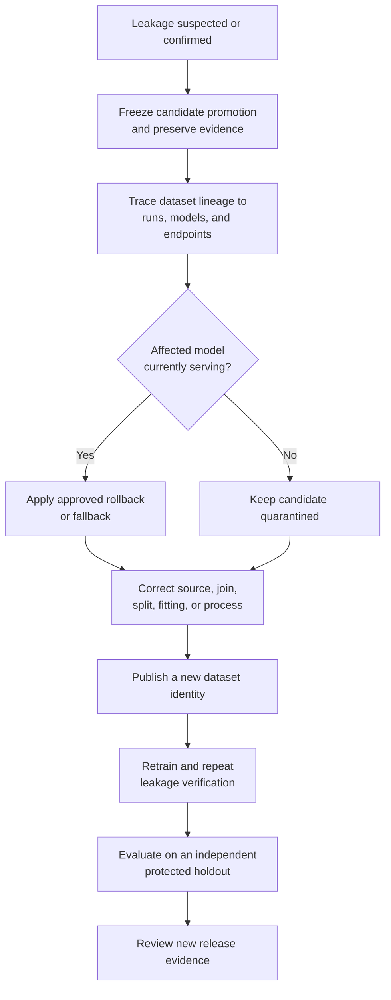

## Table of Contents

1. [What Data Leakage Means](#what-data-leakage-means)
2. [Define Which Information The Model May Use](#define-which-information-the-model-may-use)
3. [Seven Ways Information Leaks Into Model Development](#seven-ways-information-leaks-into-model-development)
4. [Target Leakage Gives The Model The Answer](#target-leakage-gives-the-model-the-answer)
5. [Future Or Late-Arriving Information Causes Time Leakage](#future-or-late-arriving-information-causes-time-leakage)
6. [Entity Overlap Can Make Memorization Look Like Generalization](#entity-overlap-can-make-memorization-look-like-generalization)
7. [Fit Preprocessing Only On Training Data](#fit-preprocessing-only-on-training-data)
8. [Remove Fields Created After The Outcome](#remove-fields-created-after-the-outcome)
9. [Keep Duplicate And Near-Duplicate Cases In One Split](#keep-duplicate-and-near-duplicate-cases-in-one-split)
10. [Keep Evaluation Answers Away From Model Development](#keep-evaluation-answers-away-from-model-development)
11. [Investigate Leakage Through Time, Cause, And Data History](#investigate-leakage-through-time-cause-and-data-history)
12. [Prevent Leakage While Building Data And Training](#prevent-leakage-while-building-data-and-training)
13. [Choose Tools For Historical Joins, Splits, And Data Checks](#choose-tools-for-historical-joins-splits-and-data-checks)
14. [Block A Release Until Leakage Checks Pass](#block-a-release-until-leakage-checks-pass)
15. [Contain, Rebuild, And Re-Evaluate After Leakage](#contain-rebuild-and-re-evaluate-after-leakage)
16. [The Main Idea](#the-main-idea)
17. [References](#references)

## What Data Leakage Means
<!-- section-summary: Leakage gives model development information that the real decision could not legitimately use, creating an evaluation advantage that disappears in production. -->

At a human level, **data leakage** means the model gets an unfair look at information during development. The real decision would have no legitimate access to that information, yet training, tuning, or evaluation receives it anyway.

Imagine a model that predicts whether a payment will later be confirmed as fraud. During development, one input says whether the transaction was refunded. Refunds often happen after investigators confirm fraud. The model appears highly accurate because the organization has already reacted to the outcome. At authorization time, that reaction has not happened.

Leakage creates a false evaluation. The score measures performance in a privileged development environment instead of the production decision. Deployment removes the privilege, and the model loses the relationship it depended on.

The forbidden information can enter through a feature column, a join, a split, a preprocessing step, a duplicate example, or a human workflow. It can also influence model choice without appearing in the final training table. This is why leakage review covers the whole development process.

The practical leakage test asks: for this exact entity and decision time, could the deployed system legitimately produce this value and fitted transformation before the outcome began?

Every important control in leakage prevention comes from making that question precise.

## Define Which Information The Model May Use
<!-- section-summary: A prediction contract defines the entity, decision time, available information, target window, split claim, and action the model will support. -->

Leakage cannot be judged from a column name alone. The same field may be legitimate for one prediction and forbidden for another. Teams first need a **prediction contract** that describes the real decision.

The contract identifies the entity being scored and the moment the score is required. It defines the future outcome window used for the label. It also records the action that follows the prediction and the population the evaluation claims to represent.

Consider a maintenance model that runs at 08:00 and predicts equipment failure during the next seven days. A temperature reading received at 07:55 is potentially valid. A technician report entered at 11:00 is unavailable. A repair code created after failure is part of the outcome process. A random row split across repeated readings from the same machine may test familiarity with machines instead of performance on new equipment.

Four timestamps make the boundary visible:

- **Event time** records the real-world moment a fact occurred.
- **Available time** records the moment the ML system could retrieve that fact.
- **Decision time** records the moment the prediction must be produced.
- **Outcome time** records the event used to create the target.


```mermaid
flowchart TD
    A["Entity and decision time T"] --> B["Information available<br/>to the deployed system by T"]
    B --> C["Feature vector used<br/>for the decision"]
    C --> D["Action or intervention"]
    D --> E["Future outcome window"]
    E --> F["Label produced after<br/>the outcome matures"]
    G["Late source arrival"] --> H{"Available by T?"}
    H -->|"Yes"| B
    H -->|"No"| I["Exclude from the feature row"]
    E --> J["Outcome-derived records"]
    J --> I

    class A contract
    class B,C valid
    class D,E,F,G,H work
    class I,J future
```

The causal direction matters as much as the timestamps. If the outcome or a response to the outcome creates the feature, the value usually belongs outside the input boundary. A timestamp check can miss that relationship where systems backfill a late field with an earlier date.

## Seven Ways Information Leaks Into Model Development
<!-- section-summary: Seven recurring leakage paths cross feature, time, split, fitting, process, and similarity boundaries in different ways. -->

Leakage enters through several different boundaries. Naming the failed boundary tells the team which evidence to inspect and which control can stop the same path. Seven patterns cover most production cases:

1. **Target leakage** places the answer, or a direct transformation of it, inside the inputs.
2. **Temporal and availability leakage** uses facts the system could not know by decision time.
3. **Split and entity leakage** places related entities or time periods on both sides of an evaluation boundary.
4. **Preprocessing leakage** fits transformations or feature selection with validation or test information.
5. **Post-outcome proxy leakage** uses fields created by the organization's response to the outcome.
6. **Duplicate and near-duplicate leakage** places the same underlying example in training and evaluation.
7. **Human and process leakage** lets protected evaluation knowledge influence features, labels, tuning, or release choices.


```mermaid
flowchart TD
    A["Could production legitimately know<br/>this information at decision time?"] --> B{"Where did the advantage enter?"}
    B --> C["Feature meaning"]
    B --> D["Time and availability"]
    B --> E["Dataset boundaries"]
    B --> F["Development process"]
    C --> G["Target leakage"]
    C --> H["Post-outcome proxy"]
    D --> I["Temporal leakage"]
    E --> J["Entity or split leakage"]
    E --> K["Duplicate overlap"]
    F --> L["Preprocessing leakage"]
    F --> M["Human or process leakage"]

    class A,B question
    class C,D,E,F boundary
    class G,H,I,J,K,L,M leak
```

Each path needs a different control. A chronological split cannot remove a refund flag created after fraud confirmation. A scikit-learn pipeline protects fitting scope, yet it cannot stop two copies of the same document from crossing splits. The taxonomy keeps prevention tied to the actual information path.

## Target Leakage Gives The Model The Answer
<!-- section-summary: Target leakage places the label or a direct derivation of the label among the model inputs. -->

The most obvious leakage path puts the answer inside the model input. It often comes from convenience columns retained during dataset assembly or from helpers used to construct the label.

**Target leakage** means the feature contains the label itself or a direct calculation from the label.

A churn dataset may include `days_until_cancellation`. A credit model may include `defaulted_within_90d` under a renamed field. A document classifier may receive a file path containing the category label. The learning algorithm has little reason to discover a useful pattern because the answer is already encoded.

Target leakage can enter during table construction. A broad `SELECT *` may retain the target and helper columns used to build it. An analyst may create a convenience field such as `target_date - decision_date` and forget to remove it. Feature selection then identifies the field as extremely predictive.

### Remove Answer-Derived Fields Before Training

Keep feature and label pipelines logically separate. The feature path ends at decision time. The label path opens after the outcome window matures. Join the resulting target onto examples by a reviewed key, then expose only an explicit allowlist of features to training.

Schema tests should fail if the target, label timestamp, outcome identifier, or target-building helpers appear in the feature set. A high-importance review adds another layer, because renamed or transformed target fields can pass a simple name check.

### Check Whether Top Features Reveal The Answer

Inspect the strongest individual features before approving a surprising metric. Trace each one to its source expression and owner. Remove the field and retrain. A dramatic collapse provides an investigation signal. It identifies the dependency that deserves causal and time review without establishing the cause by itself.

## Future Or Late-Arriving Information Causes Time Leakage
<!-- section-summary: Temporal leakage attaches future or late-arriving facts to an earlier decision, even where their event timestamps appear valid. -->

**Temporal leakage** uses information from after the decision to predict an earlier outcome. The common version joins a historical row to the latest record in a mutable table. Every old example then receives today's account state, current plan, or final case status.

Availability leakage is subtler. A fact may have happened before the decision but reached the platform later. Suppose a payment failed at 09:50, the model scored an account at 10:00, and the event arrived at 10:12. Event time says the failure happened early enough. Available time shows that production could not use it.

### Retrieve Only Values Available Before Each Prediction

A point-in-time join selects the newest record that was both valid and available for each historical decision. The SQL shape below keeps the timing rule close to the data:

```sql
WITH eligible AS (
  SELECT
    d.decision_id,
    d.account_id,
    d.decision_time,
    f.failed_payments_10m,
    f.event_time,
    f.available_at,
    f.feature_record_id,
    ROW_NUMBER() OVER (
      PARTITION BY d.decision_id
      ORDER BY
        f.event_time DESC,
        f.available_at DESC,
        f.feature_record_id DESC
    ) AS feature_rank
  FROM ml_decisions d
  LEFT JOIN account_features f
    ON f.account_id = d.account_id
    AND f.event_time <= d.decision_time
    AND f.available_at <= d.decision_time
)
SELECT *
FROM eligible
WHERE feature_rank = 1;
```

The two upper bounds protect different facts. The event-time condition blocks future events. The availability condition blocks information that arrived too late.

The source contract must define the winning record for tied timestamps through a stable key such as `feature_record_id`, or quarantine ambiguous duplicates before retrieval.

Feast historical retrieval and Databricks time-series feature tables provide point-in-time joins. Reviewed warehouse or lakehouse SQL can implement the same contract. The technology helps execute the rule; source history and timestamps determine whether the rule is possible.

### Rebuild Historical Rows And Check Their Timestamps

Build tiny boundary fixtures. Place one event before the decision, one at the boundary, one after it, and one late-arriving event with an earlier event time. Assert the selected value and provenance. Re-run the query against a historical snapshot to verify reproducibility.

## Entity Overlap Can Make Memorization Look Like Generalization
<!-- section-summary: Split leakage places related entities, groups, or overlapping time windows in training and evaluation, weakening the claim that the model generalizes. -->

**Split leakage** occurs when the evaluation set is too closely related to training. The model may recognize an entity, household, device, location, patient, document source, or nearby time period instead of learning a pattern that transfers to the intended population.

Suppose one patient contributes twenty visits. A random row split places some visits in training and others in validation. The model can learn patient-specific signals. That design may answer “How well do we score future visits for known patients?” It cannot support a claim about unseen patients.

The correct split follows the deployment claim. Use an entity or group holdout for unseen entities. Use a chronological holdout for future periods. Use both where the model must face new entities in a future period. Label windows that overlap a boundary may require a gap so training outcomes cannot cross into evaluation time.

### Keep Repeated Entities In One Split

scikit-learn's `GroupKFold` keeps each group on one side of a cross-validation fold. `TimeSeriesSplit` preserves temporal order for equally spaced time-series samples. Industrial pipelines often create explicit split assignments in Spark, dbt, or warehouse SQL and persist those assignments with the dataset manifest.

An overlap check should compare more than the row identifier. Review account, household, device, source document, location, and any domain group that could provide a memory path. Record which overlaps are expected and which evaluation claim they permit.

### Check Entity Overlap With A Set Comparison

For a support model, the release claim targets new organizations. The team groups rows by `organization_id` before cross-validation. A second report measures whether the same contact, email domain, or conversation thread appears across folds. The organization split protects the main claim; the additional report catches hidden identity links.

## Fit Preprocessing Only On Training Data
<!-- section-summary: Preprocessing leakage learns transformation state from validation or test rows before evaluation. -->

Models learn more than estimator weights. Imputers learn replacement values. Scalers learn means and variances. Encoders learn categories or target statistics. Feature selectors and dimensionality reducers learn which directions look useful.

**Preprocessing leakage** occurs if those steps fit on validation or test data. Even an unsupervised scaler reveals properties of the held-out distribution. A target encoder can reveal label rates directly if it sees protected labels.

The safe order is split first, then fit. Cross-validation must refit every learned transformation inside each training fold. Validation rows receive `transform` or `predict`; they never contribute to `fit`.

```python
from sklearn.impute import SimpleImputer
from sklearn.linear_model import LogisticRegression
from sklearn.model_selection import GroupKFold, cross_val_score
from sklearn.pipeline import make_pipeline
from sklearn.preprocessing import StandardScaler

pipeline = make_pipeline(
    SimpleImputer(strategy="median"),
    StandardScaler(),
    LogisticRegression(max_iter=1000),
)

cv = GroupKFold(n_splits=5)
scores = cross_val_score(
    pipeline,
    X,
    y,
    groups=organization_id,
    cv=cv,
    scoring="roc_auc",
)
```

The pipeline fits the imputer, scaler, and classifier separately inside each training fold. `GroupKFold` keeps organizations from crossing folds. The snippet protects two boundaries with separate mechanisms.

Target encoding needs additional care. Training rows should receive out-of-fold encodings, while validation and test rows use statistics fitted from the training partition. Feature selection, PCA, text vocabulary building, and learned embeddings follow the same fitting rule.

Hyperparameter search belongs inside the development boundary. The final test set remains sealed until model and preprocessing choices are fixed.

## Remove Fields Created After The Outcome
<!-- section-summary: Post-outcome proxies encode actions, statuses, or administrative records created because the outcome occurred or was suspected. -->

A **post-outcome proxy** is a field produced by the outcome process. It may have a different name and business purpose from the target, yet it carries the organization's response to that target.

Examples include a refund issued after confirmed fraud, a cancellation reason added after churn, a repair code entered after equipment failure, or a treatment prescribed after diagnosis. These fields can be powerful predictors because humans and systems created them after observing evidence close to the answer.

### Ask Whether The Feature Could Exist Before The Decision

Ask what caused the field to exist. If confirmation of the target, investigation of the target, or an intervention after the target produced the field, the feature sits downstream of the outcome. Moving its timestamp backward or joining it from a current-state table cannot make it legitimate.

Suppose a model predicts whether a support case will escalate within 24 hours. `senior_agent_assigned` may appear before the formal escalation timestamp. A senior agent was assigned because the frontline team already saw signs of escalation. The field may encode a human judgment unavailable at the initial routing decision.

### Define The Feature For The Exact Prediction Moment

The same field can be valid for a later decision. Senior-agent assignment may help predict resolution time after escalation has started. Prediction contracts determine legitimacy by decision time and purpose.

Feature review should include a causal note: who or what creates the field, which event triggers it, and whether the proposed model action happens before that trigger.

## Keep Duplicate And Near-Duplicate Cases In One Split
<!-- section-summary: Exact or semantically similar examples across splits let evaluation reward memorization and repeated content. -->

Duplicate leakage places the same underlying example in training and evaluation. Exact row identifiers catch only the simplest form. Copies may differ in formatting, metadata, image crop, timestamp, language, or a small edit while preserving nearly identical predictive content.

A document classifier may train on one copy of a policy page and test on the same page with a new crawl timestamp. An image model may see two crops from the same original image. A transaction model may receive retry records for one purchase in different splits.

Research on language-model datasets has shown that near-duplicate train-test overlap can distort evaluation and increase memorization. The same principle applies to smaller production models: a held-out copy is weak evidence of generalization.

### Find Similar Cases Before Splitting

Normalize stable content and compute exact hashes first. For text, MinHash or locality-sensitive hashing can form similarity clusters. Image perceptual hashes or embedding similarity can identify transformed copies. Domain identifiers such as original document, session, order, or study provide stronger grouping where available.

Assign the whole duplicate cluster to one split. Deduplicating each split independently leaves cross-split overlap in place. The manifest records the normalization version, similarity method, threshold, cluster count, removed examples, and remaining overlap.

### Check The Real Unit That Can Repeat

Some repeated examples are legitimate production frequency. Removing every duplicate may change the population the model will serve. The evaluation boundary still needs independent underlying cases. Keep frequency through weights or training policy while protecting the test set from copies of training examples.

## Keep Evaluation Answers Away From Model Development
<!-- section-summary: Human choices leak protected information through repeated test use, outcome-aware feature design, annotation context, and manual data repair. -->

Leakage can happen outside code. People see evaluation results, inspect outcomes, modify features, and choose the best-performing candidate. Those choices transmit information back into development.

Repeatedly checking the test set turns it into a validation set. A team tries many feature sets, keeps the one with the highest test score, and reports that same score as independent evidence. The final model has indirectly fitted human decisions to the test set.

Annotation can create another path. A reviewer labels an early-risk case while seeing later notes that reveal the outcome. A data-cleaning analyst repairs ambiguous rows after reading the target. A domain expert proposes a feature after studying failed test examples. Each action may be reasonable for exploration, but the protected evaluation claim has changed.

### Separate Development, Review, And Final Testing Access

Use separate development, validation, and test responsibilities. Track model and feature choices against validation evidence. Restrict test-set access, record every evaluation, and create a new protected holdout after extensive test reuse.

Labeling instructions should state the observation cutoff. Annotation interfaces hide post-decision notes and outcomes for tasks that require an earlier perspective. Adjudication records the evidence visible to reviewers.

Human review remains valuable. The control is to distinguish exploratory feedback from independent evaluation and to version the dataset after protected information influenced a decision.

## Investigate Leakage Through Time, Cause, And Data History
<!-- section-summary: Detection combines prediction-time reconstruction, causal review, split overlap, pipeline inspection, suspicious metrics, and source lineage. -->

No single test can prove a dataset is leakage-free. Detection works by following information from its source to the prediction and asking whether each crossing is legitimate.

### Rebuild One Prediction From Its Available Inputs

Choose a few historical examples and replay them from the source systems. Use the original decision time and source snapshots. Confirm that every input existed, had arrived, passed its freshness rule, and used transformation state fitted from earlier development data.

This exercise often finds problems hidden by aggregate checks: a mutable dimension table, a label helper retained by `SELECT *`, an ingestion delay, or a human status field created downstream.

### Ask When And Why Each Feature Exists

For every important feature, record its producer, triggering event, event time, available time, and relationship to the target. Ask whether the outcome or a response to the outcome causes the feature. Ask whether production can retrieve it before the action.

Feature importance and excellent metrics are investigation signals. They cannot establish legitimacy. A genuinely strong feature may dominate the model, while a subtle leak may spread across many columns.

### Compare Random, Time, And Group Splits

Compare a random split with time, group, and duplicate-cluster holdouts that reflect the deployment claim. A large score drop reveals dependence on proximity or identity. The stricter score may be the honest estimate.

Run exact and near-duplicate overlap reports. Measure entity, household, device, session, location, and source overlap according to the domain. Verify that preprocessing and tuning fit only within each training fold.

### Trace Each Feature Back To Its Source

Follow the dataset lineage from raw tables through transformations, feature tables, split assignments, training runs, and model versions. Inspect SQL and pipeline changes behind sudden metric improvements. Lineage turns a vague concern into a concrete source expression and affected release set.

## Prevent Leakage While Building Data And Training
<!-- section-summary: A reliable data path enforces the prediction contract through reviewed sources, point-in-time retrieval, split-aware fitting, immutable identities, and release evidence. -->

Leakage controls belong in dataset construction, splitting, preprocessing, training, and release. Each stage blocks a different route by which forbidden information can enter model development. The complete path below starts from the permitted decision boundary, carries that boundary through historical retrieval and split-aware fitting, then blocks any candidate whose checks fail. This turns leakage prevention into repeatable pipeline behaviour instead of a final manual review.

The important objects are the prediction contract, time-aware feature and label sources, fixed split membership, a preprocessing pipeline fitted only on training rows, and reports that prove the boundaries held. A failed time check, overlap check, or fold-local fitting check stops the dataset or model from moving forward. A passing path registers the model with the exact dataset, feature, and split records that reviewers inspected.


```mermaid
flowchart TD
    A["Prediction contract<br/>entity, decision time, target window"] --> B["Feature and label<br/>source review"]
    B --> C["Point-in-time feature build<br/>with event and availability time"]
    C --> D["Entity, time, and similarity<br/>group assignment"]
    D --> E["Immutable split manifests"]
    E --> F["Fold-local preprocessing<br/>and tuning pipeline"]
    F --> G["Leakage reports<br/>time, overlap, lineage, ablation"]
    G --> H{"Independent release<br/>review passes?"}
    H -->|"No"| I["Quarantine dataset or candidate"]
    H -->|"Yes"| J["Register model with<br/>dataset and feature lineage"]

    class A contract
    class B,C,D,E,F,G,H work
    class I block
    class J release
```

### Store Event Time And Availability Time

Every example carries an entity, decision time, and label window. Time-varying sources keep event and availability timestamps. Point-in-time tests cover boundary and late-arrival cases. Mutable current-state tables stay outside historical training unless the platform can reconstruct earlier states.

### Save Exact Split Membership

Create split assignments before preprocessing and tuning. Group related entities and duplicate clusters according to the evaluation claim. Persist the assignment logic, seed where relevant, row counts, group counts, time ranges, and overlap reports.

### Fit Transformations On Training Rows Only

Package imputation, scaling, encoding, feature selection, and the estimator in one pipeline. Cross-validation refits that pipeline for every training fold. Target-dependent transforms use out-of-fold values for training examples.

### Record Sources, Code, Splits, And Checks

Give every dataset build a new immutable identity. Record source snapshots, transformation code, feature definitions, label query, split manifest, deduplication version, and validation reports. Link that identity to experiment runs and registered models.

## Choose Tools For Historical Joins, Splits, And Data Checks
<!-- section-summary: Industrial stacks provide time-aware retrieval, split-safe fitting, data tests, similarity processing, lineage, and immutable experiment evidence. -->

Leakage prevention is a system of controls. Different tools enforce time-aware retrieval, fitting scope, split independence, source quality, and lineage. The prediction contract supplies the meaning that connects those technical controls to the real decision.

### Use Point-In-Time Joins For Historical Features

Warehouses and lakehouses such as BigQuery, Snowflake, and Databricks execute point-in-time SQL over versioned sources. Delta Lake and Apache Iceberg snapshots support reproducible source reads. dbt or Spark can build feature and label tables under separate models. Feast and Databricks Feature Engineering provide point-in-time feature retrieval where the source has suitable history and timestamps.

### Use Pipelines To Keep Training And Evaluation Separate

scikit-learn `Pipeline` and `ColumnTransformer` keep learned preprocessing with the estimator. `GroupKFold` protects group boundaries, and `TimeSeriesSplit` supports ordered time-series evaluation. Distributed teams can generate fixed fold or split assignments in Spark and pass those identities to training frameworks.

Target encoders, feature selectors, and embedding models need fold-local fitting even where the API sits outside scikit-learn. Pipeline structure matters more than a particular library name.

### Add Data Tests And Duplicate Detection

dbt tests, Great Expectations, Soda, or Deequ can verify schema, keys, null rules, accepted ranges, and source relationships. Add domain-specific assertions for `available_at <= decision_time`, forbidden columns, split overlap, and label windows. Generic data quality checks cannot infer whether a refund is downstream of fraud; feature review supplies that causal knowledge.

Exact hashes work in SQL or Spark. Large text and image collections may use MinHash, locality-sensitive hashing, perceptual hashing, or embedding similarity. The similarity job outputs durable cluster identifiers so split assignment can keep related examples together.

### Attach Data History And Split Evidence To Each Run

MLflow dataset tracking records dataset names, digests, schemas, profiles, and sources as run inputs. OpenLineage connects jobs, runs, and datasets across orchestrators and data platforms. Native catalog lineage in systems such as Unity Catalog can expose affected tables and models.

These systems improve traceability. Reproducibility still requires immutable or version-addressable source content because a metadata link to a mutable table cannot restore the rows used by an old run.

## Block A Release Until Leakage Checks Pass
<!-- section-summary: A release gate requires concrete evidence for timing, feature legitimacy, split independence, fitting scope, duplication, lineage, and protected evaluation. -->

A release reviewer should be able to verify the prediction boundary without trusting an informal assurance that the data is safe.

The dataset package identifies entity, decision time, label window, action, and evaluation population. Every feature has an owner, source, event-time rule, availability rule, and causal explanation. Point-in-time fixtures prove boundary behaviour.

The split package reports time ranges, group assignments, entity overlap, duplicate clusters, and any allowed overlap. Training evidence shows preprocessing and feature selection fitted within training folds. The experiment record links the dataset digest, code version, parameters, model, and evaluation result.

Protected test evidence records who ran the evaluation and how many model choices had access to its results. Repeated use requires a new independent holdout or an honest reclassification of the old test set as development data.

A suspicious metric jump pauses approval until the team traces the added features and pipeline changes. The gate records the explanation and evidence. High performance can pass after the information path is legitimate and reproducible.

## Contain, Rebuild, And Re-Evaluate After Leakage
<!-- section-summary: Leakage repair quarantines contaminated evidence, traces affected models, rebuilds a new dataset, retrains candidates, and restores trust through independent evaluation. -->

A leakage incident invalidates the evaluation claim. Serving health checks may remain green while the model relies on an input or relationship absent from the intended production decision.

Containment starts by stopping promotion of affected candidates. For a deployed model, the owner evaluates consequence and switches to an approved earlier model, rules path, or other safe fallback. The contaminated dataset and reports stay preserved under their original identities for investigation.


```mermaid
flowchart TD
    A["Leakage suspected or confirmed"] --> B["Freeze candidate promotion<br/>and preserve evidence"]
    B --> C["Trace dataset lineage to<br/>runs, models, and endpoints"]
    C --> D{"Affected model<br/>currently serving?"}
    D -->|"Yes"| E["Apply approved rollback<br/>or fallback"]
    D -->|"No"| F["Keep candidate quarantined"]
    E --> G["Correct source, join,<br/>split, fitting, or process"]
    F --> G
    G --> H["Publish a new dataset identity"]
    H --> I["Retrain and repeat<br/>leakage verification"]
    I --> J["Evaluate on an independent<br/>protected holdout"]
    J --> K["Review new release evidence"]

    class A alert
    class B,C,E,F,G,H,I work
    class D,J gate
    class K healthy
```

Lineage identifies every run and model trained from the contaminated dataset. The investigation classifies the failed boundary and determines the first affected version. Teams repair the source, query, split logic, fitting scope, similarity grouping, or human process that introduced the information.

The corrected build receives a new dataset identity. All affected experiments rerun because earlier metrics no longer describe a legitimate evaluation. A fresh protected holdout may be necessary if test knowledge influenced human choices.

The incident review adds a durable control. Examples include an availability-time assertion, a forbidden lineage edge from outcome tables, a group-overlap test, pipeline enforcement, a similarity report, or stricter test access. Monitoring then compares real production performance with the corrected offline estimate.

## The Main Idea
<!-- section-summary: Leakage prevention preserves the promise that development and evaluation use the same legitimate information available to the real decision. -->

Data leakage gives model development an information advantage that the real decision cannot use. The advantage may come from the target, the future, related entities, globally fitted preprocessing, post-outcome records, duplicate examples, or human exposure to protected evaluation.

The prediction contract is the foundation. It defines the entity, decision time, available information, target window, action, and population. Point-in-time joins enforce the time boundary. Group and similarity-aware splits enforce independence. Pipelines enforce fitting scope. Causal feature review finds outcome-derived proxies. Lineage and immutable dataset identities make every claim traceable.

The strongest release evidence reconstructs the complete information path for representative decisions. It shows what production knew, how the feature was computed, which data fitted each transformation, which examples remained independent, and which protected evidence guided model choice. A model can then earn trust from a realistic evaluation instead of a privileged development shortcut.

## References

- [scikit-learn documentation: Common pitfalls and data leakage](https://scikit-learn.org/stable/common_pitfalls.html#data-leakage)
- [scikit-learn documentation: Pipeline](https://scikit-learn.org/stable/modules/generated/sklearn.pipeline.Pipeline.html)
- [scikit-learn documentation: GroupKFold](https://scikit-learn.org/stable/modules/generated/sklearn.model_selection.GroupKFold.html)
- [scikit-learn documentation: TimeSeriesSplit](https://scikit-learn.org/stable/modules/generated/sklearn.model_selection.TimeSeriesSplit.html)
- [Feast documentation: Point-in-time joins](https://docs.feast.dev/getting-started/concepts/point-in-time-joins)
- [Databricks documentation: Point-in-time feature joins](https://docs.databricks.com/aws/en/machine-learning/feature-store/time-series)
- [MLflow documentation: Dataset tracking](https://mlflow.org/docs/latest/dataset/)
- [OpenLineage documentation](https://openlineage.io/docs/)
- [dbt documentation: Data tests](https://docs.getdbt.com/docs/build/data-tests)
- [Kaufman et al.: Leakage in Data Mining — Formulation, Detection, and Avoidance](https://doi.org/10.1145/2382577.2382579)
- [Kapoor and Narayanan: Leakage and the Reproducibility Crisis in ML-based Science](https://arxiv.org/abs/2207.07048)
- [Lee et al.: Deduplicating Training Data Makes Language Models Better](https://research.google/pubs/deduplicating-training-data-makes-language-models-better/)
