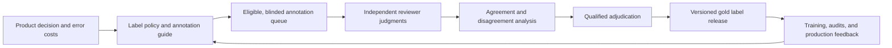

## Why Label Quality Needs a Workflow
<!-- section-summary: Label quality comes from clear definitions, trained annotators, independent review, adjudication, versioning, and production feedback. -->

A **label** is the answer a supervised model learns to predict. An **annotation** is one person's recorded judgment about an example. The two words often appear together, yet the distinction matters. Three people can annotate one ticket and produce three judgments. The released dataset may contain one final label after the team resolves their disagreement.

Imagine **RelayDesk**, a company that provides customer support software. RelayDesk wants a model to identify urgent tickets so the operations team can place them in a fast-response queue. A message about a password reset can wait. A report that every checkout request is failing for a large retailer needs immediate attention. The model target has three values: `routine`, `urgent`, and `critical`.

The first pilot uses labels copied from the old ticket priority field. Model accuracy reaches 94%, which sounds excellent. During review, the team discovers that many agents left every ticket at the default priority. Other agents marked difficult customers as urgent even when the product worked normally. The model learned those habits. The metric measured agreement with an inconsistent field rather than agreement with RelayDesk's current incident policy.

Reliable label quality needs a production workflow:

| Part | Plain meaning | RelayDesk artifact |
|---|---|---|
| Label policy | The business meaning of every class | `urgency-policy-v3.md` |
| Annotation guide | Rules and examples for human reviewers | `annotation-guide-v3.pdf` |
| Overlap | Several reviewers label the same hidden sample | `overlap_batch_2026_07_10` |
| Agreement | A measurement of how consistently reviewers apply the guide | Pairwise matrix and Krippendorff's alpha |
| Adjudication | A qualified reviewer resolves disputed cases | `adjudication_events` table |
| Gold set | A protected set of reviewed examples used for training and quality checks | `urgency_gold_v3` |
| Release manifest | The exact examples, policy version, and checks in one dataset release | `labels-2026-07-12.yml` |

This workflow treats human judgment as a source of data that needs design, testing, ownership, and change control. It also protects annotators. Clear instructions, appropriate access, training time, realistic workload, and a route for questions are parts of data quality rather than administrative details.



The workflow separates individual judgments from the released label. Agreement measures expose unclear guidance or difficult categories, while adjudication records the final decision and reason. Production feedback can reveal policy gaps and starts a reviewed update rather than silently relabeling history.

## Define the Decision Before the Labels
<!-- section-summary: The team should define the product action and error costs before asking annotators to choose classes. -->

RelayDesk first defines what the model's answer will change. A critical prediction pages the incident desk and moves the ticket ahead of routine support work. An urgent prediction creates a 30-minute response target. A routine prediction stays in the normal queue. These actions make label mistakes concrete.

A **false negative** happens when the label or model misses a genuinely urgent case. A **false positive** happens when it escalates a routine case. Missing a major outage can delay recovery for many customers. Escalating too many routine tickets can overwhelm the incident desk. The label policy therefore describes both the class and the action behind it.

```yaml
label_policy:
  name: relaydesk-ticket-urgency
  version: 3
  owner: support-operations-quality
  classes:
    routine:
      definition: "Normal product or account help with no active material service loss."
      action: "Standard support queue."
    urgent:
      definition: "Material service loss for one customer or a time-sensitive security concern."
      action: "Response target of 30 minutes."
    critical:
      definition: "Confirmed or strongly evidenced widespread outage, active compromise, or severe safety impact."
      action: "Page the incident desk immediately."
  abstain_label: needs_more_context
  policy_effective_at: "2026-07-01T00:00:00Z"
```

The **abstain label** gives annotators a safe answer when the evidence cannot support a class. RelayDesk uses `needs_more_context` when the message refers to an outage but omits the affected product, customer scope, and time. The annotation system sends these examples to a context-enrichment queue instead of forcing a guess.

The team also identifies the evidence annotators may use. The annotation screen shows the ticket subject, message body, account tier, product, current service-status snapshot, and previous two customer messages. It hides the existing priority and model prediction because those fields can anchor the reviewer to an old or automated answer.

Before collection starts, security and privacy owners review the data. Customer messages can contain names, email addresses, API keys, payment details, or health information. RelayDesk masks common secrets and direct identifiers, restricts project access, records export events, and sets a retention period. The annotation vendor receives only the fields required for the task. A team should involve its privacy and legal specialists when the work includes personal data, regulated records, human-subjects research, or worker monitoring.

## Write an Annotation Guide
<!-- section-summary: A useful annotation guide defines every class, shows positive and negative examples, covers edge cases, and records policy changes. -->

An **annotation guide** turns the label policy into instructions a reviewer can apply to one example. It needs more detail than a class name. Google Cloud's labeling guidance recommends clear instructions with common examples and corner cases, and that advice matches what production teams learn quickly: unclear edge cases create systematic label noise.

RelayDesk writes each rule with six fields:

1. The class definition in plain language.
2. Evidence that supports the class.
3. Evidence that is insufficient by itself.
4. Positive examples.
5. Near-miss examples from another class.
6. The escalation path for uncertainty.

Here is one guide entry:

```yaml
guide_entry:
  rule_id: critical-widespread-outage
  class: critical
  choose_when:
    - "The ticket reports active failure across several customer locations."
    - "A current service-status incident or monitoring alert supports the report."
  insufficient_by_itself:
    - "The customer writes 'everything is broken' with no product or scope details."
    - "The customer has an enterprise account."
    - "The message uses capital letters or angry language."
  positive_example: "Checkout returns HTTP 503 in 42 stores; status incident PAY-1842 is active."
  near_miss_example: "One store cannot sign in after an administrator changed SSO settings."
  uncertainty_action: needs_more_context
```

The near-miss example helps reviewers see the boundary. Technical severity needs evidence beyond account size, and outage scope needs evidence beyond frustrated writing. These distinctions prevent the label from turning into a proxy for customer tier or tone.

RelayDesk tests the guide with a calibration batch of 100 tickets. Annotators label the batch independently, then discuss disagreements with the policy owner. The owner updates the guide when several trained reviewers interpret one rule differently. A one-off mistake may need coaching. Repeated disagreement around the same boundary usually points to the guide, available context, or class design.

Every guide release keeps a change log. If version 4 changes security reports from `urgent` to `critical`, the team can identify which old labels used version 3 and decide whether those examples need relabeling. Silent policy changes create a dataset that mixes incompatible meanings under one column.

## Build the Annotation Queue
<!-- section-summary: The annotation queue should sample representative cases, assign blind overlap, protect sensitive fields, and preserve provenance. -->

The **annotation queue** is the set of examples and assignments that move through the labeling tool. RelayDesk uses Label Studio in this example, while other teams may use a managed cloud service or an internal interface. Tool choice matters less than the controls around sampling, assignment, provenance, and export.

Random sampling alone can underrepresent rare critical tickets. RelayDesk builds a stratified queue with routine tickets, known incident windows, security-related keywords, languages, account sizes, products, and newly launched features. Stratification means the team deliberately samples from important groups. The final training distribution can use separate weights; the review queue needs enough examples to measure quality in risky slices.

```sql
CREATE OR REPLACE TABLE labeling.urgency_queue_2026_07_10 AS
WITH candidates AS (
  SELECT
    ticket_id,
    created_at,
    product_area,
    language,
    account_tier,
    incident_window,
    masked_subject,
    masked_body,
    ROW_NUMBER() OVER (
      PARTITION BY product_area, language, incident_window
      ORDER BY FARM_FINGERPRINT(ticket_id)
    ) AS sample_rank
  FROM privacy_safe.support_ticket_annotation_view
  WHERE created_at >= TIMESTAMP '2026-06-01 00:00:00 UTC'
)
SELECT *
FROM candidates
WHERE sample_rank <= 500;
```

The queue stores `example_id`, `source_snapshot`, `policy_version`, `guide_version`, `assignment_id`, `annotator_role`, `started_at`, `submitted_at`, and tool export version. The public training table uses **pseudonymous** annotator IDs: stable substitute identifiers that do not directly reveal a person's identity. A restricted operations table maps those IDs to workforce records only when coaching, payment, access review, or an investigation requires it.

RelayDesk assigns 20% of examples to two independent annotators and 5% to three. This **blind overlap** keeps each reviewer's answer hidden from the others until submission. The remaining examples receive one annotation unless an automated rule, low confidence, or later model review sends them to a second reviewer. The team changes these percentages according to risk, budget, class rarity, and observed disagreement.

## Measure Agreement Carefully
<!-- section-summary: Agreement metrics reveal inconsistent judgments, while class-level reviews and sampled audits explain why the disagreement exists. -->

**Inter-annotator agreement** measures how consistently reviewers apply the labeling policy to the same examples. Raw agreement is the fraction of overlapped examples with the same answer. It is easy to explain, yet it can look high when one class dominates. If 95% of tickets are routine, two careless reviewers can agree often by choosing `routine` every time.

RelayDesk reports raw agreement, a chance-adjusted statistic, class-level confusion, and slice-level results. Krippendorff's alpha is useful because it supports multiple annotators and missing judgments. Cohen's kappa can work for exactly two annotators. The team documents which statistic, distance function, and missing-data rules it uses because an agreement score without its calculation policy is hard to compare.

```python
from collections import Counter


def raw_agreement(pairs: list[tuple[str, str]]) -> float:
    if not pairs:
        raise ValueError("agreement needs at least one annotation pair")
    matching = sum(left == right for left, right in pairs)
    return matching / len(pairs)


def disagreement_table(pairs: list[tuple[str, str]]) -> Counter:
    return Counter(
        tuple(sorted((left, right)))
        for left, right in pairs
        if left != right
    )
```

The weekly report might show 87% raw agreement and alpha of 0.71 overall. The important detail is the confusion table: `urgent` versus `critical` accounts for most disagreements, especially for security reports without a confirmed incident. Spanish tickets also have lower agreement because one translated example in the guide uses ambiguous wording.

Agreement measures consistency, while correctness needs evidence about the policy and real outcome. A whole team can apply a flawed rule consistently. RelayDesk therefore audits a sample with a senior support incident manager and compares labels with later operational outcomes such as confirmed incident scope and response action. The team also checks per-class recall on a protected **gold set**, a held-back collection whose correct labels were adjudicated by trusted experts. Agreement, expert audit, and downstream evidence answer different questions, and the release report includes all three.

## Adjudicate Disputed Examples
<!-- section-summary: Adjudication resolves disagreement through a qualified reviewer, records the reason, and sends recurring ambiguity back into the guide. -->

**Adjudication** is the process of deciding the released label when annotations conflict or the example carries unusual risk. An adjudicator needs domain authority and a clear scope. RelayDesk uses trained incident managers for critical-versus-urgent disputes and security specialists for suspected compromise. A labeling operations lead handles routine process questions.

The adjudicator sees the original evidence, both blind annotations, each reviewer's optional rationale, and the relevant guide rule. The screen still hides the model prediction. The adjudicator may choose one class, request more context, exclude the example, or send a policy question to the owner.

```yaml
adjudication_event:
  example_id: ticket_841922
  policy_version: 3
  submitted_labels: [urgent, critical]
  final_label: needs_more_context
  reason_code: missing_incident_scope
  rule_ids:
    - critical-widespread-outage
    - urgent-single-customer-impact
  adjudicator_role: incident-manager
  guide_change_requested: true
  resolved_at: "2026-07-11T14:22:10Z"
```

Reason codes turn disputes into operational data. RelayDesk charts them every week. A rise in `missing_incident_scope` can lead to a product change that asks customers how many sites are affected. A rise in `unclear-security-boundary` can lead to a new guide example and specialist training. Adjudication should improve the system around future labels rather than act only as a cleanup queue.

The team keeps adjudicated examples out of the ordinary agreement calculation because the final answer has access to more evidence and authority. It reports the adjudication rate separately. A rising rate may signal a changed product, weak instructions, insufficient context, or rushed annotator onboarding.

## Release a Versioned Label Set
<!-- section-summary: A label release records source data, policy, guide, annotation events, final labels, checks, and known limitations as one immutable dataset version. -->

A labeled dataset needs the same traceability as code and model artifacts. RelayDesk creates an immutable release manifest after quality checks pass. The manifest links every final label to the source snapshot and policy version without exposing restricted annotator identities.

```yaml
label_release:
  id: relaydesk-urgency-labels-2026-07-12
  source_snapshot: warehouse.support_tickets@2026-07-10T23:59:59Z
  queue_query_commit: 81db2f4
  policy_version: 3
  guide_version: 3.2
  tool_export_sha256: 4df17b6e...
  examples: 18420
  overlap_rate: 0.20
  adjudication_rate: 0.083
  quality:
    raw_agreement: 0.87
    krippendorff_alpha: 0.71
    gold_set_accuracy: 0.91
  exclusions:
    privacy_review: 42
    corrupt_content: 19
    unresolved_context: 311
  owners:
    labeling: support-operations-quality
    privacy: privacy-engineering
    model: ticket-intelligence
```

The pipeline validates unique example IDs, allowed classes, complete timestamps, current policy versions, export hashes, overlap assignment, and exclusion reason codes. It also compares class and slice distributions with the planned queue. A large unexpected shift blocks release until an owner explains it.

The test set receives stricter protection. Separate credentials keep its labels outside hyperparameter search, prompt iteration, and feature design. RelayDesk records every evaluation and creates a new test release when product behavior changes enough that the old set no longer represents production.

## Operate the Labeling System
<!-- section-summary: Production labeling needs dashboards for queue health, agreement, adjudication, slice coverage, policy drift, privacy, and annotator support. -->

Label quality changes over time because products, customers, policies, and annotator teams change. RelayDesk monitors queue age, completion time, abstention rate, agreement, adjudication rate, gold-set performance, class distribution, slice coverage, and privacy exclusions. It avoids using speed as a quality score. Fast annotation can reflect an easy batch, strong training, or rushed work, so operations reviews speed beside quality and workload evidence.

Production feedback closes the loop. Confirmed incidents, agent overrides, customer escalations, and post-incident reviews create candidates for relabeling. The team samples these cases rather than copying operational outcomes directly. An agent override can be wrong, and an incident classification can change after investigation.

The monthly runbook asks:

- Did any class definition or business action change?
- Which disagreement reason increased most?
- Do language, product, customer, and accessibility slices have enough reviewed examples?
- Did gold-set performance fall for a new annotator cohort?
- Are abstentions revealing missing context that the interface can supply?
- Did any export, access, retention, or privacy control fail?
- Which released datasets need deprecation after a policy change?

NIST's AI Risk Management Framework emphasizes documented roles, representative evaluation, human oversight, and testing under conditions similar to deployment. A labeling workflow supports those outcomes by keeping human decisions, responsibilities, limitations, and changes visible.

## Detect And Correct Label Workflow Failures
<!-- section-summary: Common labeling failures include vague classes, hidden anchoring, unrepresentative queues, forced guesses, weak adjudication, and silent policy mixing. -->

The first failure is a vague class such as `bad` or `high risk`. The fix is a product action, evidence rules, near-miss examples, and an abstain path. The second failure is anchoring: reviewers see an old priority or model prediction and copy it. Blind annotation and controlled model-assisted labeling reduce that risk.

The third failure is a representative-looking random sample that misses rare harmful cases. Stratified sampling and slice coverage checks create enough evidence for review. The fourth failure is treating agreement as truth. Expert audits, protected gold examples, and later operational evidence test whether consistent judgments match the intended decision.

The fifth failure is silent policy mixing. A table can contain labels from guide versions 1, 2, and 3 while exposing only `final_label`. Release manifests and row-level policy versions let the team relabel or filter incompatible records. The sixth failure is weak worker support. Annotators need training, questions, feedback, reasonable time, secure access, and clear escalation. Quality controls that only punish individuals will miss unclear instructions and broken tools.

Before release, RelayDesk runs these checks:

```sql
SELECT
  COUNT(*) AS examples,
  COUNT(DISTINCT example_id) AS unique_examples,
  COUNTIF(final_label NOT IN ('routine', 'urgent', 'critical')) AS invalid_labels,
  COUNTIF(policy_version != 3) AS wrong_policy_version,
  COUNTIF(final_label IS NULL) AS missing_final_labels,
  COUNTIF(adjudicated AND adjudication_reason IS NULL) AS missing_reasons
FROM labeling.relaydesk_urgency_labels_2026_07_12;
```

The counts should show one row per example, zero invalid labels, zero wrong policy versions, zero missing final labels, and zero adjudicated rows without a reason. The release job then stores the query result with the manifest.

## Putting It Together
<!-- section-summary: Trustworthy labels come from a documented decision, clear instructions, controlled assignments, agreement review, adjudication, and a versioned release. -->

RelayDesk started with an old priority field that produced an impressive metric and weak training evidence. The team replaced that shortcut with a labeling system. Product and operations owners defined the action behind each class. Annotation leads wrote examples and edge cases. The queue sampled risky slices and assigned blind overlap. Agreement reports exposed unclear boundaries. Qualified adjudicators resolved disputes and recorded reasons. A release manifest joined the labels to their policy, source snapshot, checks, owners, and limitations.

This workflow gives the model team a training target it can explain. It also gives operations a path to improve labels when the product changes. Label quality is ongoing production work, and the evidence should travel with every dataset and model version that uses it.

This closes Training Data Basics. The Data Quality submodule follows with automated schema, missing-value, range, label, and training-serving skew checks that protect every dataset release before a model uses it.

## References

- [Google Cloud: What is data labeling?](https://cloud.google.com/use-cases/data-labeling) - Official overview of labeling workflows, quality controls, representative data, privacy, and annotator guidance.
- [Google Cloud Document AI: Label documents](https://docs.cloud.google.com/document-ai/docs/label-documents) - Official guidance on instructions, common cases, corner cases, and trainee quality review.
- [Label Studio: Label and annotate data](https://labelstud.io/guide/labeling.html) - Official open-source tool documentation for annotation tasks and collaborative review.
- [Label Studio: Measure inter-annotator agreement and build consensus](https://labelstud.io/tutorials/how_to_measure_inter_annotator_agreement_and_build_human_consensus) - Official tutorial for agreement, consensus, ground truth, and model comparison.
- [NIST AI RMF Core](https://airc.nist.gov/airmf-resources/airmf/5-sec-core/) - Primary framework outcomes for roles, human oversight, data suitability, representative evaluation, documentation, and independent review.
- [NIST AI RMF Appendix C: Human-AI Interaction](https://airc.nist.gov/airmf-resources/airmf/appendices/app-c-ai-risk-management-and-human-ai-interaction/) - Primary guidance on defined human roles and the limits of converting complex judgments into measurable values.
- [NIST AI Metrology Center](https://airc.nist.gov/metrology/) - Primary catalog of AI measurement methods, including annotator agreement evaluation.
- [Artstein and Poesio: Inter-Coder Agreement for Computational Linguistics](https://aclanthology.org/J08-4004/) - Primary research survey covering agreement concepts and common statistics.
