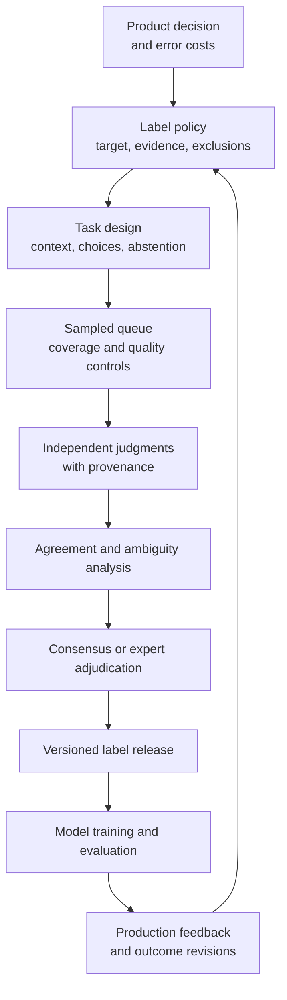
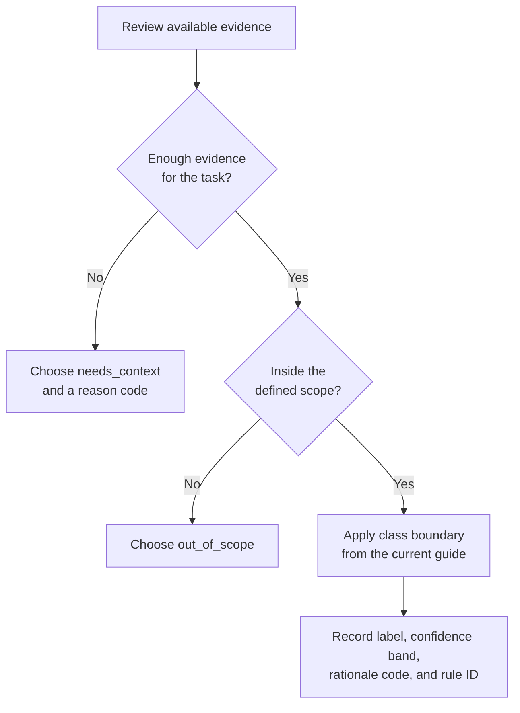
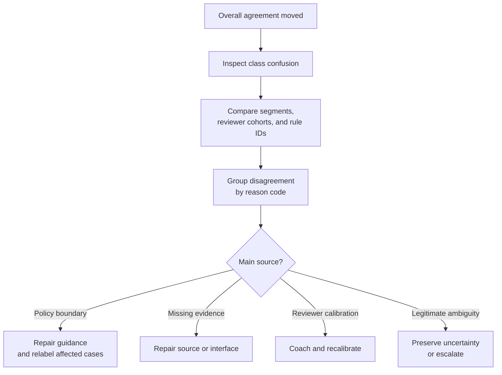
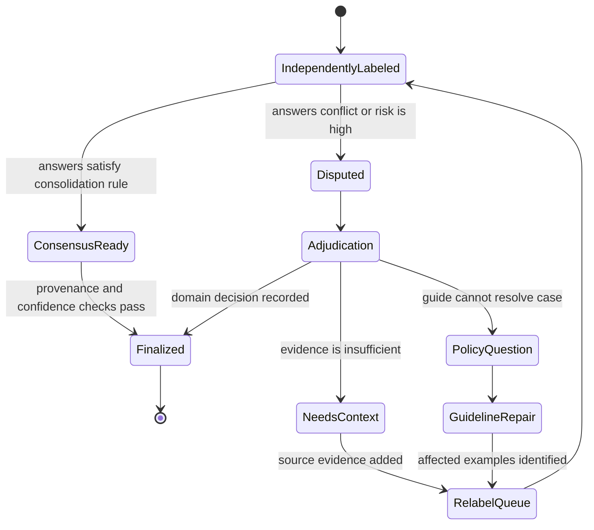
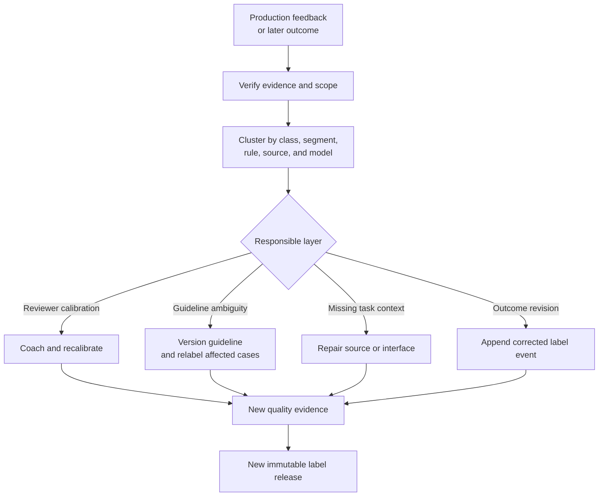

## Table of Contents

1. [How Real Outcomes Become Labels For Training](#how-real-outcomes-become-labels-for-training)
2. [Define The Question Before Asking People To Label Data](#define-the-question-before-asking-people-to-label-data)
3. [Design A Task That A Reviewer Can Actually Answer](#design-a-task-that-a-reviewer-can-actually-answer)
4. [Choose Which Items Reviewers See](#choose-which-items-reviewers-see)
5. [Keep Every Reviewer Decision And Its Source](#keep-every-reviewer-decision-and-its-source)
6. [Use Reviewer Disagreement To Find Ambiguous Cases](#use-reviewer-disagreement-to-find-ambiguous-cases)
7. [Choose How Conflicting Reviewer Decisions Are Resolved](#choose-how-conflicting-reviewer-decisions-are-resolved)
8. [Calibrate Reviewers And Protect The Workforce](#calibrate-reviewers-and-protect-the-workforce)
9. [Check Labels Created Automatically From Product Events](#check-labels-created-automatically-from-product-events)
10. [Publish Labels As A Versioned Dataset](#publish-labels-as-a-versioned-dataset)
11. [Use Production Outcomes To Improve Labeling Guidelines](#use-production-outcomes-to-improve-labeling-guidelines)
12. [The Main Idea](#the-main-idea)
13. [References](#references)

## How Real Outcomes Become Labels For Training
<!-- section-summary: A label is the governed answer a model learns from, created from human judgments or operational outcomes under a specific policy. -->

Suppose a team wants a model to route incoming support requests. The target has three classes: routine, urgent, and critical. The names look clear until reviewers see real messages.

One message says that “everything is down” but provides no product, location, or timestamp. One reports a failed login for a single user at a large customer. Another includes evidence that checkout has failed across dozens of stores. Reviewers can disagree because they lack context, interpret severity differently, or follow different assumptions about customer size.

If those judgments are copied directly into a training table, the model learns the inconsistency. It may treat angry wording as urgency, customer tier as technical severity, or one reviewer’s habits as policy. Higher model accuracy against those labels only shows that the model reproduced the collected answers.

The same issue appears in labels generated by operational processes. A chargeback event can serve as a fraud label, a readmission can serve as a clinical outcome, and an account closure can serve as churn. Each event still follows a policy. Chargebacks can be reversed. Readmission data can arrive late. A closed account may represent fraud prevention, relocation, or a duplicate account. The database event is observable; its meaning as a target requires design.

In essence, labeling converts evidence into the answer the model is asked to learn. A reliable system separates the raw evidence, each judgment, the final released label, and the policy that connected them.


```mermaid
flowchart TD
    D["Product decision<br/>and error costs"] --> P["Label policy<br/>target, evidence, exclusions"]
    P --> T["Task design<br/>context, choices, abstention"]
    T --> Q["Sampled queue<br/>coverage and quality controls"]
    Q --> J["Independent judgments<br/>with provenance"]
    J --> A["Agreement and ambiguity analysis"]
    A --> C["Consensus or expert adjudication"]
    C --> R["Versioned label release"]
    R --> M["Model training and evaluation"]
    M --> F["Production feedback<br/>and outcome revisions"]
    F --> P

    class D,P yellow;
    class T,Q teal;
    class J,A,C blue;
    class R,M,F pink;
```

The workflow has two quality loops. The annotation loop improves guidance, reviewer calibration, and dispute handling. The production loop compares released labels with later evidence and real decision outcomes. Both loops preserve history so a guideline repair never silently changes the meaning of an older dataset.

## Define The Question Before Asking People To Label Data
<!-- section-summary: A label policy connects a product decision to a target, eligible evidence, time boundary, ambiguity path, owner, and revision process. -->

Reviewers need a question grounded in a real action. “Is this ticket bad?” leaves the construct open to personal interpretation. “Does this request contain evidence that meets the incident desk’s paging policy at submission time?” identifies the action, evidence threshold, and decision moment.

### Describe The Real Concept And The Evidence Reviewers Can See

A **construct** is the idea the team wants to measure, such as urgency, fraud, relevance, toxicity, or clinical deterioration. Most constructs cannot be read directly from one database field. The label policy states how observable evidence represents that idea.

For each class, define the qualifying evidence, exclusions, and downstream action. A critical support label may require evidence of widespread active service loss. Customer size and emotional language may be explicitly insufficient. A routine label may mean that the available evidence shows no active material loss; it should never mean that the reviewer was uncertain.

The error costs shape the policy. Missing a widespread outage delays incident response. Escalating routine requests exhausts the incident desk. The labeling team needs both consequences because the class boundary encodes that tradeoff.

```yaml
label_policy:
  name: support_impact
  version: 5
  decision_time: request_received_at
  owner: service-operations-quality

  classes:
    routine:
      evidence: no active material service loss
      action: standard support queue
    urgent:
      evidence: active service loss with limited scope
      action: expedited operational review
    critical:
      evidence: active widespread loss, compromise, or safety impact
      action: page the incident desk

  insufficient_evidence:
    - customer tier by itself
    - emotional language by itself
    - historical incident without current impact

  ambiguity:
    abstain: needs_context
    exclude: out_of_scope
    escalation: domain_reviewer
```

### Define The Time Window, Eligible Cases, And Negative Labels

The label must use evidence available at the model’s prediction time. A later incident review can establish the ultimate scope, but a routing model at request arrival could not see it. A dataset may store both the initial decision label and the later outcome label because they answer different questions.

Population rules also matter. Does the task include automated alerts, employee test accounts, unsupported languages, duplicates, and messages with missing attachments? Exclusions should carry reason codes. Quietly deleting hard examples produces a cleaner dataset and a weaker deployment claim.

Negative labels need special care. “No recorded chargeback” can mean a legitimate transaction, an immature dispute window, an unobserved dispute at another processor, or a missing feed. Only the first case is a confirmed negative under many fraud definitions. A maturity and observation policy keeps the others out of supervised training until the evidence supports an answer.

### Assign An Owner For Label Meaning

The policy owner has authority to answer domain questions and approve changes. Labeling operations owns task delivery and workforce quality. Data engineering owns source integrity and release construction. The model owner documents how labels affect training and evaluation. Privacy, security, legal, and safety specialists own controls within their domains.

Clear ownership prevents an annotation vendor or ML engineer from redefining the business target through an implementation shortcut. It also gives reviewers a route for policy questions that cannot be resolved through examples alone.

## Design A Task That A Reviewer Can Actually Answer
<!-- section-summary: Annotation quality depends on the context, instructions, response options, and interface available for one concrete judgment. -->

A sound policy can still produce poor labels if the task hides necessary context or asks too much at once. Task design translates policy into one reviewable unit.

### Show Only The Context Needed For A Reliable Judgment

The interface should expose the evidence needed by the policy. A support reviewer may need the request and affected product. Current service status and the recent conversation can establish scope. A vision reviewer may need the source image and relevant region.

Extra fields can create anchoring or privacy risk. An old priority may pull the reviewer toward an obsolete policy. Model predictions and customer-value scores can also steer judgment away from the evidence.

For complex tasks, split the work into stages. One reviewer can identify candidate text spans, another can classify the extracted evidence, and a domain reviewer can resolve high-risk cases. Label Studio supports multiple annotations per task and can preserve whether regions originated from a model or a person. Argilla supports structured fields, questions, suggestions, responses, metadata, and vectors around each record. The surrounding policy determines which features belong in the workflow.

### Explain Difficult Boundary Cases In The Guidelines

A useful guide explains each class in plain language, lists qualifying and insufficient evidence, and includes positive, negative, and near-boundary examples. Near misses teach more than obvious examples because they show why two similar records receive different answers.

Guidance should explain the main sources of uncertainty. It covers duplicates and missing context, then states how to handle conflicting or multi-label evidence. Separate rules address offensive content and domain escalation. Each rule needs a stable ID so an annotation or adjudication can cite it. A change log connects modified rules to affected labels.


```mermaid
flowchart TD
    E["Review available evidence"] --> S{"Enough evidence<br/>for the task?"}
    S -->|"No"| U["Choose needs_context<br/>and a reason code"]
    S -->|"Yes"| O{"Inside the<br/>defined scope?"}
    O -->|"No"| X["Choose out_of_scope"]
    O -->|"Yes"| B["Apply class boundary<br/>from the current guide"]
    B --> R["Record label, confidence band,<br/>rationale code, and rule ID"]

    class E,S yellow;
    class O,B teal;
    class U,X,R blue;
```

An **abstain** option means that the evidence cannot support a class. It differs from a low-confidence guess. Track why reviewers abstain: missing source context, policy gap, unreadable input, unsupported language, or domain escalation. Those reasons reveal task and product repairs.

### Pilot The Task Before Scaling It

A pilot uses a diverse calibration batch and a small group of trained reviewers. Reviewers work independently, then discuss disagreements with the policy owner. Repeated confusion around one rule usually points to a guide, interface, evidence, or class-design problem.

The pilot also measures completion time distribution, abandoned tasks, interface errors, and accessibility. Speed is operational context, not a direct quality score. An unusually fast response may reflect an easy task, a good shortcut, or rushed work.

Model suggestions can accelerate annotation after the baseline workflow is understood. Suggestions must carry model and version provenance. Blind audit tasks remain free of suggestions so the team can measure anchoring and independent human performance.

## Choose Which Items Reviewers See
<!-- section-summary: Annotation queues combine representative sampling, rare-case coverage, difficult examples, and blind quality controls with known sampling provenance. -->

The queue determines which parts of the world receive careful human attention. Pure random sampling estimates common cases well and may contain too few rare, harmful, or newly introduced examples. Pure uncertainty sampling finds difficult cases and distorts the apparent production distribution.

### Separate Production Sampling, Rare Cases, And Quality Checks

A production queue commonly includes four streams:

- a random sample for an unbiased view of the eligible population;
- stratified samples for required classes, languages, products, sites, and risk segments;
- difficult or uncertain examples for boundary learning and active learning;
- protected gold and overlap tasks for reviewer-quality measurement.

Each task stores its sampling stream and selection score. Training can weight or resample examples later. Quality reports should avoid treating an intentionally enriched queue as a natural prevalence estimate.

Active learning prioritizes records that may teach the model most, often through uncertainty, disagreement, novelty, or expected error reduction. It needs exploration because a model can be confidently wrong in unseen regions. A continuing random stream and segment coverage report protect against that blind spot.

### Send High-Risk Items To More Than One Reviewer

**Overlap** sends the same example to multiple reviewers independently. High-risk classes, new rules, new reviewer cohorts, and ambiguous examples deserve more overlap. Mature, low-risk tasks can use less.

Blind overlap hides peer answers and model suggestions until submission. The overlap rate belongs in the queue manifest. Dynamic allocation can send a third reviewer after disagreement, although the first two judgments should remain immutable.

### Check Class And Segment Coverage

Coverage reports start with example and independent-unit counts for each required segment. Label counts establish how much evidence supports each class. Separate rates describe abstention, disagreement, adjudication, and source missingness. A language with high abstention may need translated guidance or qualified reviewers. A rare class with only a few gold examples provides weak calibration evidence.

Intersectional segments matter where risk depends on combinations such as language and product, device and environment, or site and demographic group. The workflow can expand sampling or narrow the release scope after a coverage gap appears.

## Keep Every Reviewer Decision And Its Source
<!-- section-summary: Immutable annotation events keep raw judgments separate from consolidated labels and record who, what, how, and under which policy produced each answer. -->

One final-label column erases the history needed to debug quality. The system should retain individual annotation events, adjudication events, and released labels as related records.

### Store Reviewer Decisions As Append-Only Records

An annotation event identifies the example, task, reviewer pseudonym, and reviewer role. It records the policy, guide, interface, and evidence versions used for the judgment. The answer carries any abstention or rationale code, timestamps, sampling stream, and suggestion provenance. Edits append a revision or replacement event so the original answer remains auditable.

```json
{
  "annotation_id": "ann_7f31",
  "example_id": "request_82c4",
  "assignment_id": "queue_v8_0142",
  "reviewer_key": "worker_pseudo_19",
  "reviewer_role": "primary",
  "policy_version": 5,
  "guide_version": "5.2",
  "evidence_snapshot": "support_requests@184",
  "label": "needs_context",
  "reason_code": "missing_affected_scope",
  "suggestion": null,
  "sampling_stream": "random_audit",
  "submitted_at": "event_timestamp"
}
```

The public ML dataset uses pseudonymous reviewer keys or omits them. A restricted workforce system holds any identity mapping needed for access review, coaching, payment, or incident investigation. Retention and access follow the sensitivity of the source and worker data.

### Keep Raw Decisions Separate From Final Labels

A consolidated label may come from majority vote, a probabilistic aggregation method, or expert adjudication. Store the method and input annotation IDs. AWS Ground Truth documentation, for example, describes task-specific consolidation across multiple workers and warns that its confidence scores are meaningful for comparisons within a labeling job, not as universal correctness probabilities.

That platform is now closed to new customers and maintained for existing users without planned feature expansion. Existing deployments can continue under their support constraints. Ground Truth should no longer serve as the default choice for a new annotation program.

### Link Each Judgment To Its Source Item And Guidelines

The label record should identify the exact source snapshot. Delta and Iceberg table versions, immutable object paths, warehouse snapshots, or versioned document collections make the evidence reproducible. The task export, annotation events, adjudication history, and final label manifest each receive a digest.

OpenLineage can connect labeling jobs to input and output datasets. MLflow can log the released label dataset as a training or evaluation input. These records complement the governed source; they do not replace it.

## Use Reviewer Disagreement To Find Ambiguous Cases
<!-- section-summary: Agreement metrics measure consistency under one policy, while class, segment, and reason analysis explain where judgments diverge. -->

**Inter-annotator agreement** describes how consistently reviewers answer the same tasks. It is a diagnostic for guidance, task difficulty, reviewer calibration, and class boundaries.

### Inspect The Exact Cases Reviewers Disagreed About

Raw agreement is the fraction of overlap tasks with matching answers. It is easy to explain and can look high under severe class imbalance. Two reviewers who choose the dominant class for every example may agree often while missing every rare critical case.

Cohen’s kappa adjusts for chance agreement between two reviewers. Fleiss’ kappa extends a related idea to multiple raters under specific assumptions. Krippendorff’s alpha supports multiple annotators, missing judgments, and different measurement levels through a chosen disagreement function.

No statistic supplies a universal pass threshold. The report should name the metric, unit, missing-data treatment, class weighting or distance function, overlap sampling design, and uncertainty interval. Compare the result with prior calibrated batches and the risk of the task.


```mermaid
flowchart TD
    M["Overall agreement moved"] --> C["Inspect class confusion"]
    C --> S["Compare segments,<br/>reviewer cohorts, and rule IDs"]
    S --> R["Group disagreement<br/>by reason code"]
    R --> Q{"Main source?"}
    Q -->|"Policy boundary"| G["Repair guidance<br/>and relabel affected cases"]
    Q -->|"Missing evidence"| I["Repair source or interface"]
    Q -->|"Reviewer calibration"| K["Coach and recalibrate"]
    Q -->|"Legitimate ambiguity"| A["Preserve uncertainty<br/>or escalate"]

    class M,C yellow;
    class S,R teal;
    class Q,G,I,K,A blue;
```

### Measure Agreement Separately From Correctness

Reviewers can agree on a flawed policy. Correctness needs a reference grounded in domain authority or later verified outcomes. Protected gold tasks, expert audits, source evidence, and downstream investigations provide different forms of reference.

Gold labels also carry uncertainty. An adjudicated example may later change after new evidence. Store who approved it, which policy applied, and which evidence was available. Gold-set versions keep reviewer calibration aligned with the current definition.

Per-class and per-segment views matter more than one average. A high overall score can hide confusion between urgent and critical, lower agreement in one language, or a new product area with missing context. Pairwise reviewer analysis can reveal calibration needs, but small sample sizes and task allocation must be considered before judging individuals.

## Choose How Conflicting Reviewer Decisions Are Resolved
<!-- section-summary: Consolidation handles routine variation, while qualified adjudication resolves policy-sensitive or high-risk disputes and records the reason. -->

Disagreement is data about the task. The response depends on whether the case reflects ordinary noise, a difficult perception task, a domain-policy boundary, or genuinely insufficient evidence.

### Use Consensus For Well-Defined Repeated Judgments

Majority vote can work for clear categorical tasks with independent, similarly qualified reviewers. Geometry tasks may aggregate bounding boxes or segmentations through overlap rules. Probabilistic methods can estimate latent labels and reviewer reliability.

Consensus should never hide the original answers. A 2–1 vote and a unanimous decision carry different information. Low consensus, rare classes, high-risk actions, and policy-sensitive disputes route to review.

### Give A Qualified Expert The Final Decision

**Adjudication** gives a qualified reviewer or panel the authority to choose the released label, request more evidence, preserve uncertainty, exclude the example, or raise a policy question. The adjudicator sees the source evidence, independent annotations, reviewer rationales, and relevant guide rules. Model predictions remain hidden for independent quality review.


```mermaid
stateDiagram-v2
    [*] --> IndependentlyLabeled
    IndependentlyLabeled --> ConsensusReady: answers satisfy consolidation rule
    IndependentlyLabeled --> Disputed: answers conflict or risk is high
    ConsensusReady --> Finalized: provenance and confidence checks pass
    Disputed --> Adjudication
    Adjudication --> Finalized: domain decision recorded
    Adjudication --> NeedsContext: evidence is insufficient
    Adjudication --> PolicyQuestion: guide cannot resolve case
    PolicyQuestion --> GuidelineRepair
    GuidelineRepair --> RelabelQueue: affected examples identified
    NeedsContext --> RelabelQueue: source evidence added
    RelabelQueue --> IndependentlyLabeled
    Finalized --> [*]
```

Reason codes turn adjudication into system feedback. Examples include missing context, class-boundary ambiguity, conflicting sources, unsupported language, and policy exception. Trends in those codes point toward guideline, interface, source, or product repairs.

Adjudicated labels should stay outside ordinary agreement calculations because the adjudicator has a different role and often sees more information. Report adjudication rate and resolution reasons separately.

## Calibrate Reviewers And Protect The Workforce
<!-- section-summary: Reviewer quality depends on recurring calibration, fair feedback, appropriate expertise, secure access, and safeguards for sensitive work. -->

Label quality is a property of the full work system. Reviewer knowledge matters, along with instructions, evidence, interface, workload, management, compensation, and psychological safety.

### Calibrate Before And During Production Work

Onboarding uses training examples, explanation, and a calibration batch. Reviewers need to explain class boundaries and use abstention correctly before receiving production tasks. Domain-specific work may require credentials or specialist roles.

Recurring calibration mixes hidden current gold tasks into the queue and runs periodic blind overlap. Scores are reviewed by class and rule. A cohort-wide drop often points to changed data or stale guidance. An individual drop may reflect training needs, task mismatch, access problems, or workload.

Gold tasks can become memorized. Rotate them, limit exposure, and maintain a separate expert-audit stream. Reviewer feedback should include reasons and corrected guidance. Punitive scoreboards encourage guessing and concealment.

### Govern Sensitive Content And Worker Data

Apply data minimization before annotation. Mask direct identifiers and secrets, restrict fields to the task, separate identity mappings, encrypt storage and transport, log exports, limit retention, and use least-privilege access. Public crowd work may be unsuitable for personal, confidential, regulated, or proprietary data.

Harmful content requires exposure controls. Give advance notice and offer voluntary task assignment where possible. Rotation, breaks, an escalation route, wellness resources, and qualified supervision reduce sustained exposure. Never infer worker well-being from speed or error metrics alone.

Workforce governance also covers clear instructions, accessible interfaces, realistic time, payment for required calibration and review, a dispute process, and non-retaliatory reporting of policy gaps. NIST AI RMF outcomes emphasize defined human roles, documented oversight, representative evaluation, and accountability for risk decisions.

### Keep Quality Measurement Separate From Worker Surveillance

Pseudonymous reviewer analytics support calibration and investigation. Access to identifiable performance data should be restricted, purpose-limited, and retained under policy. Aggregate trends can guide system repair without broadcasting individual rankings.

The annotation program should document which automated assistance, productivity measures, and quality scores affect work allocation or compensation. Reviewers need a route to challenge incorrect gold answers and tool failures.

## Check Labels Created Automatically From Product Events
<!-- section-summary: Operational events become reliable labels only after maturity, observation coverage, policy mapping, and later revisions are represented explicitly. -->

Many labels originate in software workflows. Payment disputes, deliveries, readmissions, account renewals, and incident resolutions can create strong evidence. They also carry delay, censoring, missingness, and policy effects.

### Do Not Treat Every Product Event As The Target

A process-generated label first defines the eligible population, prediction time, and outcome window. It names the source systems and observation requirement. Positive, confirmed-negative, reversal, and exclusion rules then map the observed events to target states.

For example, a transaction may count as a confirmed fraud positive after an upheld dispute. A transaction with no dispute qualifies as a negative only after the dispute window matures and every relevant processor feed is complete. Open disputes and missing feeds remain unresolved.

```sql
select
  transaction_id,
  case
    when dispute_status = 'upheld' then 'fraud'
    when outcome_window_mature
     and processor_coverage_complete
     and dispute_status is null then 'legitimate'
    else 'unresolved'
  end as label,
  outcome_observed_at,
  policy_version
from governed.transaction_outcomes;
```

The unresolved state protects the model from false negatives. Training pipelines filter or model that state according to the contract. They should avoid silently converting it to zero.

### Track When Labels Become Final And When They Change

Labels can move through provisional, mature, corrected, and withdrawn states. Append label events with `valid_from`, `observed_at`, `supersedes_label_id`, and reason. A current view can expose the latest accepted answer, while historical releases retain the version used by each model.

A policy change may alter old examples. Revisions should identify the affected population, rebuild labels from a pinned source, rerun quality checks, and create a new release. Models trained on superseded labels are discoverable through dataset and experiment lineage.

### Audit The System That Produces Outcome Events

Operational labels can reflect human intervention or product policy. A fraud team may investigate only high-scoring transactions, leaving low-scoring fraud unobserved. A support resolution code may be chosen for reporting convenience. A recommendation click depends on what the old model displayed.

These feedback effects need an observation policy, randomized audits where feasible, and careful interpretation. The process owner and model owner should document how selection, intervention, and missing outcomes shape the label.

## Publish Labels As A Versioned Dataset
<!-- section-summary: A label release freezes source evidence, policies, judgments, final labels, quality results, coverage, limitations, and owners into one traceable dataset version. -->

A production label set is an immutable release. It can be reproduced, compared, deprecated, and linked to every model that consumes it.

### Build The Release From Reviewed Source Data And Guidelines

The release pipeline reads a pinned source snapshot, immutable annotation events, adjudication events, and process-generated outcome revisions. It resolves one accepted label per example under a named policy. It writes the final table and a manifest.

```yaml
label_release:
  id: support_impact_v12
  source_snapshot: \${SOURCE_SNAPSHOT}
  policy_version: 5
  guide_version: "5.2"
  queue_manifest_digest: \${QUEUE_DIGEST}
  annotation_export_digest: \${ANNOTATION_DIGEST}
  released_table: governed.labels.support_impact_v12

  quality_evidence:
    overlap_sample: recorded
    agreement_report: \${AGREEMENT_REPORT}
    gold_audit: \${GOLD_AUDIT}
    adjudication_report: \${ADJUDICATION_REPORT}
    segment_coverage: \${COVERAGE_REPORT}

  known_limits:
    - unsupported language cohort excluded
    - newest outcomes remain immature

  owners:
    policy: service-operations-quality
    data: ml-data-platform
    workforce: annotation-operations
```

The manifest records counts and artifact locations. Quality gates remain specific to the risks of each class and segment.

### Check Integrity, Quality, Coverage, And Access Before Publication

Integrity checks verify unique example IDs, accepted classes, and valid policy versions. They also confirm source references, required timestamps, and complete provenance. Disputed cases need consolidation or adjudication status. Exclusions and abstentions need reason codes.

Quality checks cover agreement with its calculation policy, class-confusion patterns, gold and expert audits, reviewer calibration, and adjudication rate. Coverage checks protect required classes, segments, languages, sites, and independent entities. Governance checks verify access, privacy review, retention, worker safeguards, and approval.

Failures lead to specific controls. A source mismatch stops the build. Low agreement around one rule returns affected examples to guideline repair. Thin rare-class coverage expands sampling or narrows model scope. A privacy breach quarantines the release and triggers the incident process. Recovery produces a new immutable release.

### Record Which Models Use The Labels And Their Maturity

Delta or Iceberg tables can retain label-release history. MLflow can log the versioned dataset as training, validation, or evaluation input. A registry or catalog records owners, policy, sensitivity, and deprecation. OpenLineage can connect source, labeling jobs, release tables, training datasets, and models.

Label Studio and Argilla are common foundations for configurable human annotation and structured feedback. Internal interfaces remain common for specialized evidence or policy. Managed and outsourced services can supply workforce and tooling. The organization retains ownership of target meaning, privacy, quality thresholds, and audit evidence.

AWS Ground Truth remains relevant for existing customers under its maintenance status. Its current closure to new customers makes it unsuitable as the default recommendation for a new program.

## Use Production Outcomes To Improve Labeling Guidelines
<!-- section-summary: Production errors and later outcomes feed a controlled repair loop that updates guidance, relabels affected examples, and preserves previous releases. -->

The deployed model reveals cases the original queue missed. Overrides, appeals, confirmed incidents, post-event reviews, delayed outcomes, and high-confidence errors can all become candidates for analysis.

### Review Production Feedback Before Changing Labels

An operator override is one judgment under production pressure. A customer complaint may identify a real failure or a disagreement with policy. A model-human disagreement can come from either side. Route these events into a sampled review queue with source and model provenance.

Compare feedback by class, segment, guide rule, source, model version, and decision path. A cluster of missed critical cases may reveal insufficient context in the task, a changed product, weak rare-class sampling, or a feature problem.

### Change The Narrowest Source Of Error

A reviewer mistake calls for coaching and recalibration. Repeated ambiguity calls for a guideline or class-design change. Missing context calls for a source or interface repair. A process-label reversal calls for maturity or revision logic. A shifted population calls for new sampling and coverage.

Policy changes create a new version. The owner identifies affected examples through rule IDs and reason codes, sends them through relabeling or deterministic recomputation, and releases a new dataset. Training and evaluation then use compatible label definitions.


```mermaid
flowchart TD
    F["Production feedback<br/>or later outcome"] --> V["Verify evidence and scope"]
    V --> C["Cluster by class, segment,<br/>rule, source, and model"]
    C --> R{"Responsible layer"}
    R -->|"Reviewer calibration"| K["Coach and recalibrate"]
    R -->|"Guideline ambiguity"| G["Version guideline<br/>and relabel affected cases"]
    R -->|"Missing task context"| I["Repair source or interface"]
    R -->|"Outcome revision"| O["Append corrected label event"]
    K --> N["New quality evidence"]
    G --> N
    I --> N
    O --> N
    N --> L["New immutable label release"]

    class F,V yellow;
    class C,R teal;
    class K,G,I,O,N,L blue;
```

The loop also measures repair effectiveness. A new guideline should reduce the targeted disagreement without damaging another class. Reviewer calibration should improve on fresh gold tasks. A maturity repair should reduce later label reversals. The evidence travels with the new release.

## The Main Idea
<!-- section-summary: Trustworthy labels preserve the connection between a product decision, available evidence, individual judgments, final resolution, and later revisions. -->

Labels are model inputs created through policy. Human reviewers, operational systems, and automated suggestions all contribute evidence under limits that need to be explicit.

The production framework starts with the target and decision time. It turns that policy into an answerable task, samples the queue for coverage and learning, preserves every judgment, uses agreement to locate ambiguity, and resolves disputes with the right authority. Reviewer calibration and workforce safeguards support both quality and responsible operation.

Process-generated outcomes need mature observation and a revision history. Every release pins its sources and policy, then connects the accepted labels to their annotation provenance. The manifest carries quality and segment evidence. It also states known limits and ownership. Production feedback repairs the responsible layer and creates a new traceable version.

A strong label set lets the team answer practical questions: what did this label mean, which evidence supported it, who or what produced it, how was disagreement resolved, which policy applied, and which models learned from it?

## References

- [Label Studio labeling guide](https://labelstud.io/guide/labeling.html)
- [Label Studio agreement and consensus tutorial](https://labelstud.io/tutorials/how_to_measure_inter_annotator_agreement_and_build_human_consensus)
- [Argilla dataset records, fields, questions, and metadata](https://docs.argilla.io/latest/how_to_guides/dataset/)
- [Argilla annotation workflow](https://docs.argilla.io/latest/how_to_guides/annotate/)
- [Amazon SageMaker Ground Truth enhanced data labeling and service status](https://docs.aws.amazon.com/sagemaker/latest/dg/sms-data-labeling.html)
- [Amazon SageMaker Ground Truth annotation consolidation](https://docs.aws.amazon.com/sagemaker/latest/dg/sms-annotation-consolidation.html)
- [Amazon SageMaker Ground Truth output data and provenance](https://docs.aws.amazon.com/sagemaker/latest/dg/sms-data-output.html)
- [NIST AI Risk Management Framework Core](https://airc.nist.gov/airmf-resources/airmf/5-sec-core/)
- [NIST AI RMF Human-AI Interaction](https://airc.nist.gov/airmf-resources/airmf/appendices/app-c-ai-risk-management-and-human-ai-interaction/)
- [Inter-Coder Agreement for Computational Linguistics](https://aclanthology.org/J08-4004/)
- [Delta Lake table history](https://docs.delta.io/delta-utility/)
- [Apache Iceberg Spark queries](https://iceberg.apache.org/docs/latest/spark-queries/)
- [MLflow dataset tracking](https://mlflow.org/docs/latest/dataset/)
- [OpenLineage object model](https://openlineage.io/docs/spec/object-model/)
