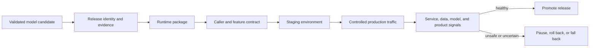
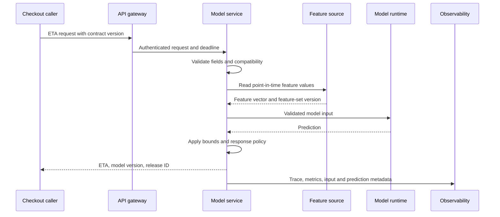

## Deployment Turns a Candidate Into a Product Dependency
<!-- section-summary: Model deployment connects a validated candidate to a caller contract, runtime, environment, traffic plan, observability, and recovery path. -->

**Deploying a model** means placing a trained model inside a production path that real systems can use. That path may be an online API, a scheduled batch job, a stream processor, a mobile application, or an edge device. The model artifact remains important, while the release now includes everything needed to call, operate, and recover it.

A training run asks whether a model performed well on prepared evidence. Deployment asks a wider set of questions. Can callers send valid inputs? Can the runtime load the exact artifact and dependencies? Will the system meet latency, throughput, and cost limits? Can the team expose a small amount of traffic first? Which signals will stop the release? Can operators restore a known-safe version?



The sequence shows why deployment is a release discipline. A container image alone cannot prove which model and evaluation it contains. A healthy endpoint cannot prove that features match training. A traffic split cannot protect users without stop conditions and a rollback target. Each responsibility depends on the previous one.

## The Production Release Unit Has Seven Parts
<!-- section-summary: A complete release binds model identity, package, contract, environment, traffic, signals, and recovery into one reviewed unit. -->

### Release identity

The release names the exact model version, training run, dataset lineage, code revision, evaluation report, and approval decision. It also names the serving code and configuration that will use the model. This prevents a strong evaluation for one candidate from being attached to another artifact by mistake.

### Runtime package

The package contains the model loader, serving or scoring code, dependencies, and runtime settings. It may be a container image, a managed endpoint deployment, a batch-job image, or a mobile bundle. Immutable image digests and dependency locks identify the content that passed testing.

### Caller and feature contract

The caller contract defines request fields, types, optional values, response fields, error behaviour, and compatibility. The feature contract defines where values come from, when they are available, how missing data is handled, and which version matches the model. Both contracts protect the boundary between training assumptions and production data.

### Environment

The environment supplies compute, network access, secrets, workload identity, feature sources, storage, observability, and capacity. Staging should exercise the same important boundaries as production even when its scale is smaller. An environment is more than a label attached to the same uncontrolled credentials.

### Traffic control

Traffic control limits exposure while the team gathers live evidence. A canary can receive a small percentage of requests. A shadow deployment can receive copied traffic while its responses stay hidden from users. A blue-green release can keep two complete environments and switch routing after validation.

### Observability

Release evidence covers service health, input health, prediction behaviour, and product outcomes. Each event needs the release and model identity so operators can separate candidate behaviour from the current production baseline.

### Recovery

Recovery restores a safe product path. It may route traffic to the previous release, disable the model and use rules, stop a batch publication, or revert an on-device rollout. The previous model, runtime, contract, configuration, and feature path must still work together for rollback to be real.

These seven parts form the release unit. Teams can implement them through Kubernetes, SageMaker AI, Vertex AI, Azure Machine Learning, Databricks, KServe, BentoML, Ray Serve, Triton, or internal systems. The responsibilities remain the same across tool choices.

## Follow One Prediction Through the Runtime
<!-- section-summary: A request crosses validation, feature retrieval, model execution, post-processing, response, and telemetry boundaries that each need ownership. -->

An online prediction illustrates what the model joins after deployment. A checkout service sends an order to a delivery-time model. The model service validates the request, retrieves or receives features, runs preprocessing, invokes the model, applies reviewed post-processing, returns a response, and records telemetry.



This path contains several failure boundaries. The gateway can reject an unauthenticated call. Request validation can reject an impossible distance. Feature retrieval can time out or return stale values. The model can fail to load. Post-processing can apply a safety bound or fallback. Telemetry can sample sensitive content according to policy while preserving the identities needed for diagnosis.

Batch and streaming patterns have different request shapes, yet their release path has the same concerns. A batch job reads a versioned input partition and writes a versioned output. A stream processor consumes events and publishes predictions under delivery and ordering rules. The team still needs contracts, identity, runtime packaging, monitoring, and recovery.

## Package the Model and Serving Logic Together Deliberately
<!-- section-summary: Packaging creates a repeatable runtime from the model, code, dependencies, entry point, and loading policy. -->

A model artifact rarely serves itself. It needs code that validates inputs, applies preprocessing, loads dependencies, calls the model, shapes outputs, and records signals. Packaging decides how those pieces travel together.

One design bundles the model inside the container image. This gives the image and model one immutable identity and allows startup without a registry download. Large models can make images slow to build and distribute. Another design keeps the model in a registry or artifact store and loads an approved version at startup. This keeps serving code reusable but adds startup, permission, availability, and cache considerations.

Managed model endpoints express the same choice through model resources, deployment resources, containers, and endpoint configuration. Kubernetes commonly uses a Deployment or specialized serving controller. Batch scoring uses a job or pipeline component. Edge deployment produces a device-compatible package with a signed update path.

Whichever shape the team chooses, the release record should answer:

- Which model bytes load?
- Which serving code and dependencies run?
- Which preprocessing and post-processing versions apply?
- Which hardware and resource limits are expected?
- Which identity can read the artifact and dependencies?
- What happens when loading fails?
- How can an operator prove which package is live?

The startup path needs a readiness rule. A process listening on a port may still have no loaded model or feature connectivity. Readiness should require the resources needed to serve a valid request. Large-model warm-up may need its own state so the traffic router waits until execution is genuinely ready.

## Make the Contract Visible Before Traffic Arrives
<!-- section-summary: Versioned request, response, and feature contracts let callers and model releases change without surprising one another. -->

An **API contract** is the promise a service makes to its callers. It defines accepted fields and types, required and optional values, response shape, errors, timeouts, and compatibility. A model signature describes the input and output schema expected by the model. MLflow signatures and input examples can preserve this information with the model and support validation across the model lifecycle.

The service contract and model signature are related, but they can differ. A public request may contain an order ID, while the service retrieves internal features and constructs the tabular model input. The release should test the transformation between the two contracts.

Compatibility matters because callers and model services rarely update at the same instant. Additive optional fields are usually easier to roll out than renaming or removing required fields. A compatibility window lets old and new callers coexist. Logs should show which contract version each caller uses so the team knows when an older path can be retired.

Feature compatibility needs the same care. A model trained on `restaurant-eta-v7` should not quietly receive `restaurant-eta-v6` values with similar column names. The release record names the feature set, defaults, freshness rules, and online source. A staging replay can compare online feature assembly with the training dataset for the same entities and timestamps.

## One Manifest Connects the Release Evidence
<!-- section-summary: A release manifest gives automation and reviewers one place to resolve the model, runtime, contracts, deployment target, signals, and rollback unit. -->

A compact manifest can connect the parts without copying every report:

```yaml
release_id: eta-api-2026-07-05.2
model:
  name: eta-arrival
  version: "25"
  training_run: eta-xgb-2026-07-04-0915
  evaluation_report: s3://harborcart-ml/reviews/eta/25/report.json
runtime:
  image: ghcr.io/harborcart/eta-api@sha256:91ab4c22
contracts:
  request: eta-request-v3
  feature_set: restaurant-eta-v7
deployment:
  target: eta-api-production
  strategy: canary
  first_step_percent: 5
recovery:
  previous_release: eta-api-2026-06-20.4
  fallback: rules://eta-fallback-v8
owners:
  engineering: ml-platform
  product: logistics
  incident: eta-release-primary
```

The manifest is a set of links and identities. CI can verify that the model and image exist, the evaluation is approved, the contracts are current, and the recovery targets resolve. The deployment system can record the exact manifest digest that reached each environment.

The environment should supply secrets and workload identity rather than putting credentials in this file. Thresholds and policy can live in versioned release rules when several services share them. The release manifest still points to those rule versions so an incident responder can reconstruct the decision.

## Staging Tests the Production Boundaries
<!-- section-summary: Staging verifies contracts, loading, identity, dependencies, performance, and observability before production users provide the first realistic test. -->

Staging gives the team a place to exercise the complete package. It should load the model through the production mechanism, use the same contract checks, authenticate with a staging workload identity, reach staging dependencies, emit the same telemetry, and run on representative hardware.

Tests should cover a successful request and the failure boundaries. Send missing and invalid fields. Make the feature source unavailable. Verify timeouts and fallbacks. Restart the runtime while requests arrive. Confirm that logs, traces, and metrics carry the release identity. Measure cold-start and steady-state latency separately.

A **replay test** sends recent or synthetic requests through the packaged service and compares its outputs with reviewed expectations. It catches differences between notebook evaluation and serving code, such as a changed preprocessing library or column order. Sensitive production records need approved handling and de-identification or synthetic alternatives according to policy.

Staging also verifies rollback compatibility. The previous release should still load and answer current callers. A database, feature, or contract migration can make an older model unusable even when its artifact remains available.

## Progressive Delivery Limits the Blast Radius
<!-- section-summary: Canary, shadow, and blue-green releases gather production evidence while limiting which users or decisions depend on the candidate. -->

Progressive delivery exposes the candidate in reviewed steps. A canary might receive 5%, then 25%, then all traffic. Each step has a minimum evidence window and stop conditions. The window should cover enough requests and relevant segments to support the decision.

A percentage alone can hide important routing. Five percent of random traffic may contain no high-risk region or device type. The release plan can stratify traffic, exclude unsupported cases, or require segment sample counts before promotion. Stateful and personalized products also need stable assignment so one user does not bounce between incompatible behaviours.

Shadow traffic helps compare candidate outputs without using them in the product. It still consumes compute and can trigger side effects if the boundary is poorly designed. Shadow execution should isolate writes and clearly mark telemetry.

Blue-green releases run two complete production environments and switch routing after validation. They provide a clear recovery target but cost more during overlap. Managed endpoints and service-mesh or progressive-delivery controllers can implement these patterns. The team should verify how the selected router calculates weights, especially with small replica counts.

## Release Signals Need Four Views
<!-- section-summary: A model release uses service, input, prediction, and product signals because each view catches a different failure. -->

**Service signals** include latency percentiles, error rate, saturation, queue depth, memory, accelerator use, and dependency failures. They show whether the runtime meets its software objectives.

**Input signals** include missing values, schema failures, category changes, freshness, feature-source fallbacks, and training-serving parity. They show whether the model receives the data it was designed for.

**Prediction signals** include score distributions, confidence or interval behaviour where defined, class rates, output bounds, and protected segments. They catch sudden changes before final labels arrive.

**Product signals** include manual overrides, support events, conversion, wait time, safety events, and mature label-based quality. They show whether a technically healthy model helps the actual decision.

Every signal must carry the model version and release ID. During mixed traffic, the team needs separate candidate and baseline views. A global error rate can hide a broken canary because most requests still reach the healthy baseline.

Promotion should be deterministic where possible. A rule can require p95 latency under 120 milliseconds, 5xx rate below 2%, no feature-contract break, enough segment samples, and an ETA distribution inside reviewed bounds. A named release owner handles ambiguous evidence and records the reason for continuing, pausing, or stopping.

## Rollback Restores a Complete Known-Safe Path
<!-- section-summary: Rollback succeeds only when the previous model, package, contract, configuration, features, and routing path remain compatible and available. -->

Rollback changes production routing or deployment back to a reviewed release. The previous release needs its artifact, image, configuration, secrets, feature access, contract compatibility, and capacity. A single model version number cannot provide that complete recovery unit.

Some failures need **fallback** instead. If the shared feature source is corrupt, both model versions may fail. A rules-based estimate, cached result, delayed batch, or manual process may protect the product while teams repair the dependency.

Recovery decisions need to account for external effects. Rolling back a prediction service does not undo decisions already made from its outputs. Incident response should identify affected requests, stop new harm, preserve evidence, and trigger correction or communication where the product requires it.

The rollback path should be tested before release. Operators need a runbook that says who can act, how traffic changes, which signals confirm recovery, how to verify the previous release, and which evidence to preserve. Regular rollback exercises catch expired images, lost permissions, incompatible contracts, and missing capacity.

## How the Pieces Work Together
<!-- section-summary: Model deployment binds a candidate to a complete release unit and moves it through tested environments, controlled traffic, evidence, and recovery. -->

Deployment changes a model from an experiment artifact into an operated dependency. The release identity connects the candidate to its evidence. Packaging supplies a repeatable runtime. Caller and feature contracts protect interfaces. Environments supply identity, dependencies, and capacity. Progressive delivery limits exposure while observability gathers evidence. Rollback and fallback preserve a safe product path.

The model artifact is one part of that system. A production release is ready when the team can prove which model and runtime are live, which callers and features they support, which traffic step is active, which signals control promotion, and which complete recovery unit can take over.

## References

- [MLflow Model Signatures and Input Examples](https://mlflow.org/docs/latest/ml/model/signatures/)
- [Amazon SageMaker AI: Deploy models for inference](https://docs.aws.amazon.com/sagemaker/latest/dg/deploy-model.html)
- [Vertex AI: Deploy a model to an endpoint](https://cloud.google.com/vertex-ai/docs/general/deployment)
- [Azure Machine Learning: Managed online endpoints](https://learn.microsoft.com/en-us/azure/machine-learning/concept-endpoints-online)
- [Kubernetes Deployments](https://kubernetes.io/docs/concepts/workloads/controllers/deployment/)
- [OpenTelemetry Signals](https://opentelemetry.io/docs/concepts/signals/)
