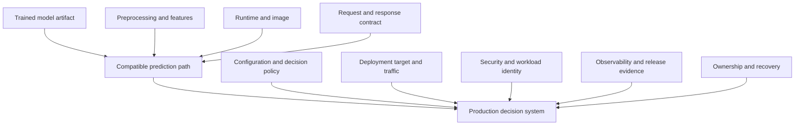
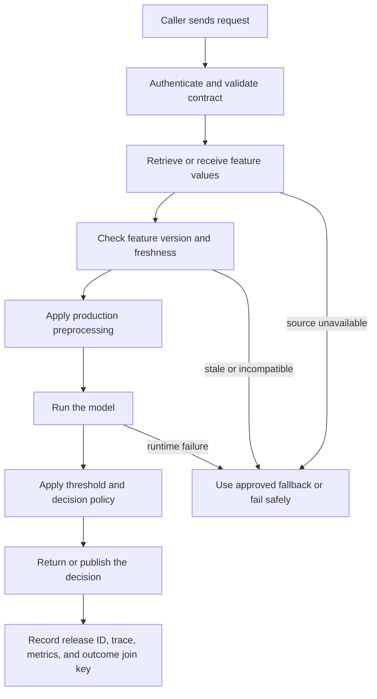
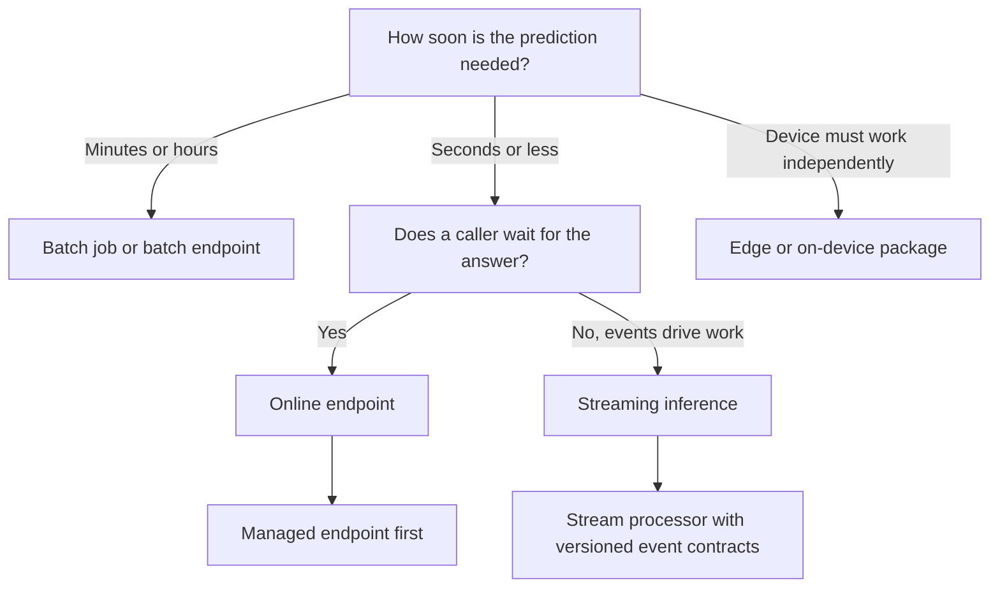
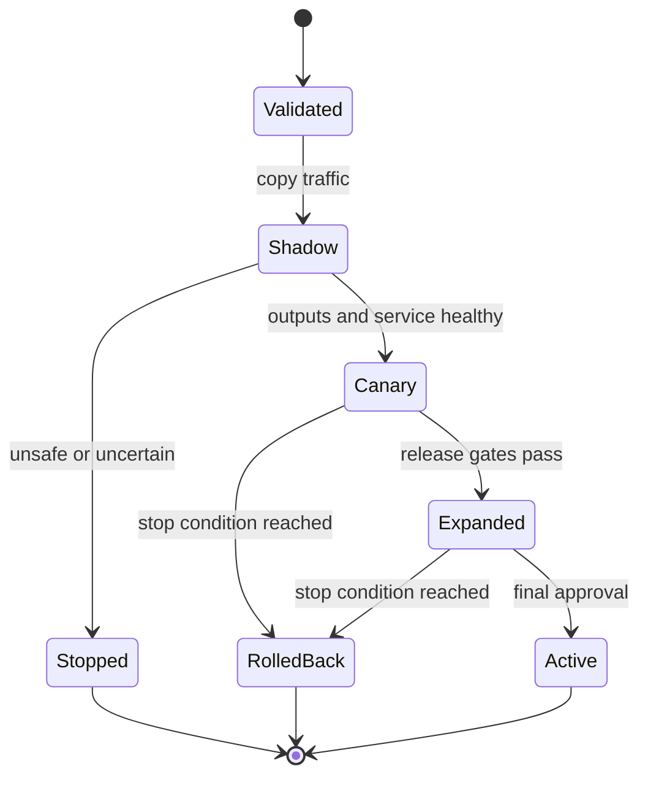

## Table of Contents

1. [A Trained Model Is Only the Predictive Core](#a-trained-model-is-only-the-predictive-core)
2. [The Release Unit Surrounds the Model](#the-release-unit-surrounds-the-model)
3. [Follow One Request From Input to Decision](#follow-one-request-from-input-to-decision)
4. [Package One Compatible Execution Unit](#package-one-compatible-execution-unit)
5. [Protect the Inference and Feature Contracts](#protect-the-inference-and-feature-contracts)
6. [Treat Configuration, Policy, and Security as Release Behaviour](#treat-configuration-policy-and-security-as-release-behaviour)
7. [Choose a Deployment Target From the Product Need](#choose-a-deployment-target-from-the-product-need)
8. [Prove the Production Boundaries Before Release](#prove-the-production-boundaries-before-release)
9. [Admit Production Traffic in Stages](#admit-production-traffic-in-stages)
10. [Observability Turns a Deployment Into an Operated Service](#observability-turns-a-deployment-into-an-operated-service)
11. [Rollback Restores the Complete Decision Path](#rollback-restores-the-complete-decision-path)
12. [The Main Idea](#the-main-idea)
13. [References](#references)

## A Trained Model Is Only the Predictive Core
<!-- section-summary: Deployment surrounds a trained artifact with every component required to produce reliable decisions for real callers. -->

At a high level, **model deployment** connects a trained model to a real product or business process. The result might be an API that answers in milliseconds, a nightly batch job that scores millions of rows, a stream processor that reacts to events, or a model packaged inside a device. In every form, deployment gives callers a reliable way to use the model under production conditions.

A trained artifact is usually a file or directory containing learned parameters. It can calculate an output after the correct library loads it and supplies inputs in the expected shape. Production asks for much more. A caller needs a stable contract. Feature values must have the same meaning they had during training. The runtime needs enough compute and memory for the workload. Authentication protects the service, while monitoring explains its behaviour. Traffic control limits exposure, and clear ownership connects an incident to recovery.

Consider a model that estimates the probability of a late delivery. An offline evaluation may show strong precision and recall on historical data. The live system still has unanswered questions. Can the service retrieve current route features before its deadline? Does the deployed image contain the same preprocessing library used during evaluation? What should happen during a feature-store timeout? Which threshold sends an order for manual review? How can operators identify every decision produced by the new release?

Offline success provides evidence about predictive performance on a prepared dataset. Production readiness adds evidence about software, data, infrastructure, security, and operations. A release needs both kinds of proof.


```mermaid
flowchart TB
    A["Trained model artifact"] --> B["Compatible prediction path"]
    B --> C["Production decision system"]

    P["Preprocessing and features"] --> B
    R["Runtime and image"] --> B
    K["Request and response contract"] --> B
    Y["Configuration and decision policy"] --> C
    D["Deployment target and traffic"] --> C
    S["Security and workload identity"] --> C
    O["Observability and release evidence"] --> C
    W["Ownership and recovery"] --> C
```

The model sits near the centre of this system. Each surrounding component can change the final behaviour, so each one belongs in release design and validation.

## The Release Unit Surrounds the Model
<!-- section-summary: A production release binds the predictive core, execution boundary, and operating boundary into one reviewed and recoverable unit. -->

A **release unit** is the complete set of versioned components that move through testing and production together. You can think of it as the smallest package whose behaviour the team can approve, deploy, observe, and restore. Promoting only a model version leaves too many production decisions unresolved.

### The predictive core defines the calculation

The core includes the **model artifact**, its preprocessing, and the feature definitions it expects. Preprocessing can include tokenisation, scaling, categorical encoding, image resizing, or column ordering. A tiny difference in any of these steps can produce a valid-looking input with a different meaning.

Feature dependencies extend beyond column names. The release needs the feature-set version, source, freshness expectation, missing-value behaviour, and any transformation shared with training. An `account_age` field measured in days and the same field measured in seconds pass a numeric type check while producing very different predictions.

### The execution boundary makes the calculation callable

The execution boundary includes the **inference contract**, serving code, dependency environment, runtime or container image, and configuration. The contract describes valid requests and responses. The runtime loads the artifact, validates input, runs preprocessing, invokes the model, applies post-processing, and returns or stores the result.

The image or managed environment pins operating-system packages, language libraries, inference servers, and hardware expectations. A dependency lock records Python packages. An OCI image digest identifies the exact container content. These identities let staging and production run the same tested execution unit.

### The operating boundary controls real-world impact

The operating boundary includes the deployment target, traffic rules, observability, security controls, evidence, ownership, and rollback path. These pieces determine who can call the model, how much traffic reaches it, which signals govern promotion, who responds to trouble, and how the product returns to a safe state.

A practical release record joins the boundaries under one release ID:

```yaml
release_id: risk-api-r42
model_uri: models:/risk-classifier/18
image: registry.example/ml/risk-api@sha256:4f8c...
contract_version: risk-request-v3
feature_set: account-risk-v7
policy_version: review-policy-v12
deployment_target: risk-api-production
previous_release: risk-api-r41
```

The record contains immutable identities or links to governed records. Secrets stay in a secrets manager, and deployment workloads receive access through workload identity. Evaluation reports, approvals, test results, and image attestations can remain in their specialist systems while the release ID connects them.

## Follow One Request From Input to Decision
<!-- section-summary: A live prediction crosses several boundaries between the caller and the final action, and each boundary can alter or stop the result. -->

The simplest way to understand a deployed model is to follow one request. Imagine a payment service asking for a risk assessment before approving a transaction. The request enters through an authenticated endpoint, passes schema validation, gathers features, reaches the model, and then passes through a decision policy.

Each step owns a different promise. The endpoint promises that the caller is allowed to use the service. The contract promises that the request has a supported shape. The feature layer promises that every value has the expected meaning and age. The model promises a calculation from those values, and the policy turns that calculation into a product action.

A failure at any boundary needs an explicit result. Invalid input can return a clear client error. A stale critical feature can send the request to a reviewed fallback. A runtime failure can produce a retryable service error within a strict deadline. Silent substitution is dangerous because the caller receives a plausible response without knowing that the decision path changed.


```mermaid
flowchart TB
    A["Caller sends request"] --> B["Authenticate and validate contract"]
    B --> C["Retrieve or receive feature values"]
    C --> D["Check feature version and freshness"]
    D --> E["Apply production preprocessing"]
    E --> F["Run the model"]
    F --> G["Apply threshold and decision policy"]
    G --> H["Return or publish the decision"]
    H --> I["Record release ID, trace, metrics, and outcome join key"]

    C -->|"source unavailable"| J["Use approved fallback or fail safely"]
    D -->|"stale or incompatible"| J
    F -->|"runtime failure"| J
```

The authentication step verifies the caller and its permissions. Contract validation rejects malformed or unsupported input before it reaches the model. Feature checks protect the meaning and age of the data. Preprocessing converts product fields into the tensors or columns expected by the artifact. The model produces a score, class, embedding, forecast, or generated output.

The model output may still require a product decision. A risk score of `0.73` has no operational meaning by itself. A versioned policy might send scores above `0.70` for manual review, allow lower-value transactions under a separate rule, and use a conservative action whenever a critical feature is stale. Changing the threshold from `0.70` to `0.80` can change the user outcome while the model bytes remain identical.

This is why the production path records both the model version and the policy version. The final decision depends on both. The same record also needs an outcome join key so delayed ground truth can later connect back to the release that made the decision.

Batch and streaming systems follow the same logic with different transport. A batch scorer validates a versioned input partition, creates versioned output, and publishes it only after quality checks pass. A stream processor validates event versions, handles late or repeated events, and writes predictions with a release identity. The surrounding release responsibilities stay consistent.

## Package One Compatible Execution Unit
<!-- section-summary: Packaging preserves the model, preprocessing, serving code, dependencies, and loading rules that produced the reviewed behaviour. -->

**Packaging** creates a repeatable execution unit from the predictive core. In essence, it answers a practical question: how will a clean production machine load this model and reproduce the tested prediction?

### Preserve preprocessing with the model path

The safest shape is usually a pipeline that owns preprocessing and prediction together. A scikit-learn `Pipeline`, a PyTorch module with its transforms, or a custom MLflow `pyfunc` model can keep the transformation path close to the artifact. Shared feature logic may live in a feature platform, yet its version still needs to be pinned.

MLflow can store an input example, infer a model signature, and record dependency metadata with the model:

```python
with mlflow.start_run():
    mlflow.sklearn.log_model(
        sk_model=training_pipeline,
        name="model",
        input_example=X_train.head(5),
        registered_model_name="risk-classifier",
    )
```

Here, `training_pipeline` contains the fitted preprocessing and estimator. The input example lets MLflow infer and validate the expected schema. A separate smoke test can call `mlflow.models.predict` in an isolated `uv` environment, which catches missing dependencies before the release reaches an endpoint.

### Pin the runtime that loads the artifact

A model can pass evaluation under one library version and fail or change behaviour under another. Teams commonly lock Python dependencies with `uv`, Poetry, or a generated requirements file, then build an OCI container for online or batch execution. The release refers to the image digest because a mutable tag such as `latest` can point to different bytes over time.

Some platforms support a managed MLflow deployment with little custom serving code. Others use a custom container built around FastAPI, KServe, NVIDIA Triton Inference Server, or Ray Serve. The tool choice follows the workload. A standard tabular model often fits a managed endpoint. High-throughput GPU inference may need Triton or a specialised managed serving runtime. A team with complex Python model composition may choose Ray Serve. Kubernetes adds value when the organisation already operates it and needs its scheduling or portability controls.

The model may be copied into the image or loaded from a registry at startup. Bundling creates one image-model identity and removes a startup download. External loading keeps large artifacts separate and allows a reusable serving image. External loading also introduces permissions, network availability, cache consistency, and startup-time concerns. The chosen design should pin an immutable model URI or checksum and fail readiness if the expected artifact cannot load.

### Separate process health from model readiness

A listening web process can still be unable to predict. The artifact may be downloading, GPU memory may be warming, or the feature connection may be unavailable. Production needs a readiness check that reflects the ability to accept useful traffic.

Kubernetes expresses three different questions through probes. A startup probe gives slow initialisation time to finish. A readiness probe removes an unavailable replica from service traffic. A liveness probe restarts a process that can no longer make progress. Managed endpoints provide similar health and deployment states through platform controls.

## Protect the Inference and Feature Contracts
<!-- section-summary: Service, model, and feature contracts protect the meaning of data as it moves from a caller to the trained artifact. -->

A **contract** is an explicit agreement about data crossing a boundary. You can think of it as the shared language between two independently changing components. Deployment usually has three related contracts.

### The service contract belongs to callers

The service contract defines request fields, response fields, accepted content types, errors, authentication, and timeouts. OpenAPI is a common industrial standard for HTTP APIs. Protobuf often serves gRPC systems, and event schemas serve streaming systems.

Suppose an API accepts `{"amount": 120.50, "currency": "GBP"}` and returns a risk band plus a decision ID. The service contract can reject a missing currency, a negative amount, or an unsupported contract version. These checks give the caller a clear error and keep invalid data away from the model.

Callers and model services rarely upgrade at exactly the same moment. Additive optional fields can support a compatibility window. Removing a field or changing its meaning needs a new version and a migration plan. Contract tests run representative requests from supported caller versions against the packaged service.

### The model contract belongs to the artifact

The model signature describes the columns, tensors, parameters, and outputs expected by the artifact. A public request can differ from this signature. For example, the caller supplies an account ID while the service retrieves eight internal features and constructs the model input.

The transformation between service input and model input is a critical test boundary. A **golden request** stores a small reviewed input and its expected transformed values or prediction tolerance. Running the same request in training, CI, staging, and production smoke tests catches changed column order, encoders, numerical precision, and dependency behaviour.

### The feature contract preserves meaning and time

A feature contract describes more than type. It identifies who owns the feature and where its source data comes from. It defines the entity key and the transformation that produces the value, including units and accepted ranges. Freshness and missing-value rules explain whether a live value is still safe to use. A version keeps these semantics stable across releases. Online models also need training-serving parity: the production feature path should reproduce the values used to build historical training rows for the same entity and event time.

For a concrete example, a model may expect the number of failed logins during the previous 24 hours. A live pipeline that counts events since midnight supplies a valid integer with different semantics. A parity test selects known entities and timestamps, reconstructs their historical online features, and compares them with the training dataset. Feature stores such as Feast and managed feature platforms help manage definitions and retrieval, while the team still owns the semantic test.

## Treat Configuration, Policy, and Security as Release Behaviour
<!-- section-summary: Versioned policy controls how predictions affect users, while security controls who can invoke the service and which resources it can reach. -->

Production behaviour often changes through configuration. Decision thresholds, enabled segments, fallback rules, timeouts, feature flags, and safety limits can alter outcomes without rebuilding the model. These settings belong to a reviewed, versioned policy and should be associated with the release evidence.

A lending model might return a probability of repayment. Policy determines which probability range receives automatic approval, which range enters human review, and which additional legal or affordability rules apply. During an incident, restoring the previous model while leaving a newly changed threshold active can preserve the harmful behaviour. Recovery therefore considers model and policy together.

Configuration needs typed validation, ownership, approval rules proportional to risk, and an audit trail. High-impact values should move through the same environment promotion path as code. Dynamic configuration can still be useful for urgent controls, provided every evaluation records the resolved policy version.

### Give the workload an identity

The serving process usually reads model storage and feature sources. It also sends data to a telemetry exporter and may retrieve sensitive configuration from a secrets manager. Current cloud and Kubernetes practice uses a workload identity or service account with narrowly scoped permissions. Long-lived credentials embedded in source code, images, or release YAML create avoidable exposure.

Inbound controls authenticate callers and authorise the requested operation. Network policy or private endpoints can restrict access to internal services. Outbound controls limit which destinations the runtime can reach. Logs and traces need redaction rules because raw features, prompts, and outputs may contain sensitive data.

### Verify what enters production

An industrial software-supply-chain path identifies the model artifact, container digest, source revision, build process, and dependency inventory. OCI provides the container image format. An SBOM records included software components. SLSA provenance describes how an artifact was produced. Sigstore Cosign can verify signatures and attestations tied to an image digest.

These controls answer different questions. A digest checks exact content identity. A signature connects that content to an approved signer. Provenance records the build path. Vulnerability scanning evaluates known package risks. Release policy can require these records before the deployment system accepts the image.

## Choose a Deployment Target From the Product Need
<!-- section-summary: The required response time, input shape, scale, connectivity, and operational capacity determine the serving target. -->

The deployment target should follow the way the product consumes predictions. Put another way, start with the decision deadline and the movement of data. A nightly planning process can wait for a batch job, while a user-facing checkout flow may need an online response in milliseconds. Event-driven automation and disconnected devices introduce their own boundaries.

This choice changes the release mechanism. Batch systems publish complete output datasets. Online systems keep a stable endpoint available under concurrent traffic. Stream processors preserve event and state semantics across upgrades. Edge systems distribute signed packages to device cohorts that may reconnect at different times.


```mermaid
flowchart TB
    A["How soon is the prediction needed?"] -->|"Minutes or hours"| B["Batch job or batch endpoint"]
    A -->|"Seconds or less"| C["Does a caller wait for the answer?"]
    C -->|"Yes"| D["Online endpoint"]
    C -->|"No, events drive work"| E["Streaming inference"]
    D --> F["Managed endpoint first"]
    E --> G["Stream processor with versioned event contracts"]
    A -->|"Device must work independently"| H["Edge or on-device package"]
```

### Batch inference serves delayed, high-volume work

Batch suits decisions that can wait and can be processed together: daily demand forecasts, weekly account reviews, or scoring a catalog after new model approval. The release unit is usually a job image plus model identity, input contract, output location, schedule, and publication checks. Managed batch endpoints, Spark jobs, and orchestrated Python jobs are common choices.

Batch recovery often stops publication, reruns a previous release, or replaces a bad output partition. Idempotent writes and versioned destinations make that practical. A completed process exit alone is weak evidence; the team also checks row coverage, schema, null rates, prediction distributions, and the intended input snapshot.

### Online inference serves synchronous decisions

Online endpoints fit product paths where a caller waits for an answer, such as ranking search results or estimating delivery time. The main constraints are latency, availability, concurrency, and predictable failure behaviour. Autoscaling, timeouts, readiness, authentication, and controlled traffic matter as much as raw model speed.

Managed endpoints are a practical default because the provider handles much of the compute lifecycle and traffic routing. Amazon SageMaker AI uses endpoints with production variants. Vertex AI deploys one or more `DeployedModel` resources behind an endpoint. Azure Machine Learning managed online endpoints route to deployments and support traffic mirroring. Databricks Model Serving routes traffic among served entities. Each platform uses different resource names for the same broad separation: a stable caller endpoint and one or more versioned deployments behind it.

### Streaming and edge inference have different boundaries

Streaming inference reacts to events without keeping a caller waiting. The event contract defines ordering and duplicate handling. The processor needs bounded retries and backpressure so a slow model cannot overwhelm the pipeline. Stateful jobs also preserve compatible checkpoints across upgrades. The model release therefore joins the stream job with its event schema and feature state.

Edge inference runs on a device with limited compute, memory, power, or connectivity. Its release includes model conversion or quantisation, supported hardware, signed distribution, staged device cohorts, and a safe local fallback. Recovery can take longer because devices may remain offline, so backward compatibility and remote kill controls deserve early design.

## Prove the Production Boundaries Before Release
<!-- section-summary: Pre-production validation checks the complete packaged path against contracts, infrastructure, failure modes, and rollback expectations. -->

Staging exists to answer a different question from offline evaluation: can this exact release operate safely across production-like boundaries? It should use the packaged artifact, production contract logic, representative hardware, workload identity, dependency topology, and telemetry path. Scale may be smaller, while the important interfaces stay realistic.

### Start with loading and prediction equivalence

CI loads the model inside the release environment and runs golden requests. The outputs can use exact equality for deterministic transformations or reviewed tolerances for floating-point and accelerator differences. This test catches missing libraries, incompatible serialization, changed preprocessing, and hardware-specific behaviour.

Then validate service and feature contracts. Send valid requests from every supported caller version. Send malformed values and verify stable error responses. Compare online feature assembly with historical training rows for known entity-time pairs. Confirm that the feature source, model signature, and service adapter agree on names, types, units, and missing-value handling.

### Test performance with the real execution shape

Measure cold start, warm latency percentiles, throughput, queueing, memory, accelerator use, and cost under representative request sizes. Average latency hides slow requests, so online services commonly inspect p50, p95, and p99. Batch systems measure total completion time and work skew. Streaming systems measure consumer lag and end-to-end event delay.

Capacity testing should include the complete dependency path. A model that runs in 20 milliseconds can still miss a 100-millisecond deadline after feature retrieval, network hops, serialisation, and queueing. The test also needs a defined overload behaviour. The service can accept a bounded queue and shed lower-priority work after that limit. A product with an approved alternative may use its fallback, while another product may return a clear retryable error.

### Exercise failure and recovery paths

Make a feature source slow or unavailable. Start a replica with a missing artifact. Revoke an expected permission in staging. Send an oversized request. Restart instances during traffic. Verify timeouts, retries, circuit breakers, fallbacks, and telemetry for each case. Retries need strict bounds because repeated inference or downstream writes can amplify an incident.

For a Kubernetes deployment, a focused probe configuration separates these conditions:

```yaml
startupProbe:
  httpGet: { path: /startup, port: 8080 }
  failureThreshold: 30
  periodSeconds: 10
readinessProbe:
  httpGet: { path: /ready, port: 8080 }
  periodSeconds: 5
livenessProbe:
  httpGet: { path: /live, port: 8080 }
  periodSeconds: 10
```

`/startup` succeeds after the model and required runtime assets load. `/ready` reflects the current ability to receive traffic. `/live` checks whether the process can still make progress. A dependency outage may fail readiness and preserve the process for recovery, while an internal deadlock may fail liveness and trigger a restart.

The final pre-production check deploys the previous release through the same path. This confirms that rollback artifacts, permissions, contracts, and capacity remain usable.

## Admit Production Traffic in Stages
<!-- section-summary: Shadow, canary, and blue-green strategies collect live evidence while controlling the number of decisions exposed to a candidate. -->

Production supplies traffic patterns, dependency timing, and user behaviour that staging can only approximate. **Progressive delivery** limits exposure while the team collects this evidence. Each stage has an entry condition, a minimum evidence requirement, stop conditions, an owner, and a recovery action.

The stages answer progressively harder questions. Shadow traffic asks whether the candidate can process live inputs safely. A canary asks whether a limited group can rely on its decisions. Expansion asks whether the evidence stays healthy across more load and more segments. Full activation comes after the release owner accepts the combined operational and product evidence.

The path can stop at every stage. Stop conditions are defined before exposure, so an operator can act without inventing a threshold during an incident. The previous complete release stays available until the candidate has passed its recovery window.


```mermaid
stateDiagram-v2
    [*] --> Validated
    Validated --> Shadow: copy traffic
    Shadow --> Canary: outputs and service healthy
    Canary --> Expanded: release gates pass
    Expanded --> Active: final approval
    Shadow --> Stopped: unsafe or uncertain
    Canary --> RolledBack: stop condition reached
    Expanded --> RolledBack: stop condition reached
    Stopped --> [*]
    RolledBack --> [*]
    Active --> [*]
```

### Shadow traffic compares without controlling the product

A shadow deployment receives a copy of real requests, and the product continues using the current release response. This is useful for comparing predictions, latency, feature compatibility, and resource use. Shadow execution must isolate side effects so copied requests cannot create duplicate writes, notifications, charges, or user actions.

Amazon SageMaker AI supports shadow variants, and Azure Machine Learning supports traffic mirroring to another online deployment. Other platforms can implement the pattern through gateways or application routing. The comparison needs matched request IDs and a clear decision about which fields are safe to retain.

### Canary traffic exposes a controlled slice

A canary serves real responses for a limited share of traffic. Percentage routing is only one dimension. Teams may hold out high-risk segments, require stable assignment for each user, or start with internal traffic. A 5% canary provides little evidence for a rare region if it receives only a handful of examples, so promotion gates should include sample coverage for important segments.

SageMaker production variants, Vertex AI endpoint traffic splits, Azure endpoint traffic allocation, and Databricks served-entity traffic configuration all support weighted routing. The team still defines the statistical and operational meaning of each step.

### Blue-green keeps a complete recovery environment

Blue-green deployment runs the current and candidate environments side by side. Routing moves after validation, and the old environment stays available during the recovery window. This gives operators a clear target and consumes additional capacity during overlap.

Promotion should combine service health, input integrity, prediction behaviour, and product evidence. Label-based accuracy may arrive days or weeks later, so early gates use service objectives, schema and freshness checks, distribution guardrails, sampled review, and immediate product signals. High-impact releases may keep a longer observation window before full promotion.

## Observability Turns a Deployment Into an Operated Service
<!-- section-summary: Telemetry connects each request and outcome to the release that produced it, giving owners evidence for promotion and incident response. -->

At a high level, **observability** gives the team enough evidence to understand what the deployed system is doing. OpenTelemetry is a vendor-neutral standard for generating, collecting, and exporting traces, metrics, and logs. Traces follow individual requests across components. Metrics summarise behaviour over time. Logs preserve discrete events and diagnostic detail.

### Watch four views of the release

Service health covers latency, error rate, saturation, queue depth, restarts, and dependency failures. Input health covers contract errors, missing values, feature freshness, category changes, and fallback use. Prediction health covers score distributions, class rates, output bounds, and segment behaviour. Product evidence covers overrides, user outcomes, safety events, and delayed label-based quality.

Imagine a canary whose API latency and error rate look healthy. Its predicted approval rate is twice the baseline because a currency conversion feature is stale. Service signals alone would approve the rollout. Input and prediction views expose the real problem before mature outcome labels arrive.

Each event needs enough release context for comparison:

```json
{
  "release_id": "risk-api-r42",
  "model_version": "18",
  "policy_version": "review-policy-v12",
  "contract_version": "risk-request-v3",
  "decision_id": "7c1...",
  "feature_status": "fresh",
  "result": "manual_review"
}
```

Metrics should use bounded labels. A release label separates candidate and baseline data. Route and region labels reveal where behaviour differs, while a small result-class label distinguishes outcomes. Raw user IDs and request IDs create high cardinality and belong in traces or governed logs. Sensitive inputs and outputs should be collected only for an approved purpose. Access controls restrict who can inspect them. Retention rules limit storage time, and redaction removes unnecessary fields before export.

### Promotion produces a durable evidence record

The deployment platform reports what is running. The release record explains why it was allowed to run. A promotion decision can link evaluation results, contract tests, performance tests, supply-chain verification, canary dashboards, approver identity, and the active traffic step.

Automation handles measurable gates. For example, it can stop a canary after a latency objective breach, a feature contract error, or a prediction-rate guardrail violation. A named release owner handles ambiguous evidence and records the decision. Product, model, platform, security, and incident ownership should be clear before traffic starts.

## Rollback Restores the Complete Decision Path
<!-- section-summary: Effective recovery restores a compatible model, runtime, feature path, policy, contract, and traffic route that the product can use immediately. -->

**Rollback** routes work back to a known-safe release. In essence, recovery restores the previous decision path instead of changing only the model file. That path includes the image and its model, plus compatible preprocessing and feature definitions. It also restores the contract, policy, permissions, deployment configuration, and capacity that were proven together.

Suppose a new model release also introduces a renamed feature and a stricter decision threshold. Repointing the registry alias to the old artifact may leave the new service adapter and policy active. A reliable rollback instead moves traffic to the complete previous deployment whose components were tested together.

Some incidents need a **fallback** because every model version shares the failed dependency. If the online feature source is corrupt, a low-risk product might use a conservative rule or a recent cached value. A higher-impact decision may need to pause or enter a manual review queue. Fallback behaviour should be designed, monitored, and exercised like any other production path.

Recovery also needs to account for decisions already made. Switching traffic cannot undo an action that has already reached a user or another system. A declined application may need review, and a published batch file may need replacement. The incident plan identifies affected decision IDs and stops further impact. It also preserves evidence and defines correction or communication steps.

A rollback exercise should verify four things:

1. The previous complete release still resolves and starts.
2. Current callers and feature sources remain compatible with it.
3. Routing can move within the required recovery time.
4. Service, input, prediction, and product signals confirm recovery.

Keeping the previous deployment warm improves recovery speed for high-criticality online systems. Batch systems can keep immutable output partitions and republish a corrected version. Edge systems often use staged device cohorts and a signed previous package because some devices reconnect slowly.

## The Main Idea
<!-- section-summary: Model deployment creates a governed production decision system from a trained artifact and its surrounding operational dependencies. -->

A trained model knows how to calculate an output from a specific input representation. Deployment gives that calculation a safe place in a real system. The release unit binds the model to preprocessing, features, contracts, runtime, configuration, policy, deployment target, traffic, observability, security, evidence, ownership, and recovery.

The team proves this unit in layers: reproduce the prediction inside the packaged environment, validate service and feature boundaries, exercise performance and failure behaviour, expose controlled production traffic, and compare the candidate with a known baseline. A release is ready for wider use after its evidence supports both predictive quality and operational safety.

## References

- [MLflow Model Signatures and Input Examples](https://mlflow.org/docs/latest/ml/model/signatures/)
- [MLflow Model Dependencies](https://mlflow.org/docs/latest/ml/model/dependencies/)
- [OpenAPI Specification](https://spec.openapis.org/oas/latest.html)
- [OCI Image Manifest Specification](https://specs.opencontainers.org/image-spec/manifest/)
- [SLSA Provenance](https://slsa.dev/spec/v1.2/provenance)
- [Sigstore Cosign Verification](https://docs.sigstore.dev/cosign/verifying/verify/)
- [Amazon SageMaker AI Deployment Guardrails](https://docs.aws.amazon.com/sagemaker/latest/dg/deployment-guardrails.html)
- [Amazon SageMaker AI Shadow Tests](https://docs.aws.amazon.com/sagemaker/latest/dg/model-validation.html)
- [Vertex AI Model Deployment](https://docs.cloud.google.com/vertex-ai/docs/predictions/deploy-model-api)
- [Azure Machine Learning Online Endpoints](https://learn.microsoft.com/en-us/azure/machine-learning/concept-endpoints-online)
- [Databricks Model Serving Traffic Splits](https://docs.databricks.com/aws/en/machine-learning/model-serving/serve-multiple-models-to-serving-endpoint)
- [Kubernetes Liveness, Readiness, and Startup Probes](https://kubernetes.io/docs/concepts/workloads/pods/probes/)
- [Kubernetes Deployments](https://kubernetes.io/docs/concepts/workloads/controllers/deployment/)
- [OpenTelemetry Signals](https://opentelemetry.io/docs/concepts/signals/)
- [OpenTelemetry Traces](https://opentelemetry.io/docs/concepts/signals/traces/)
