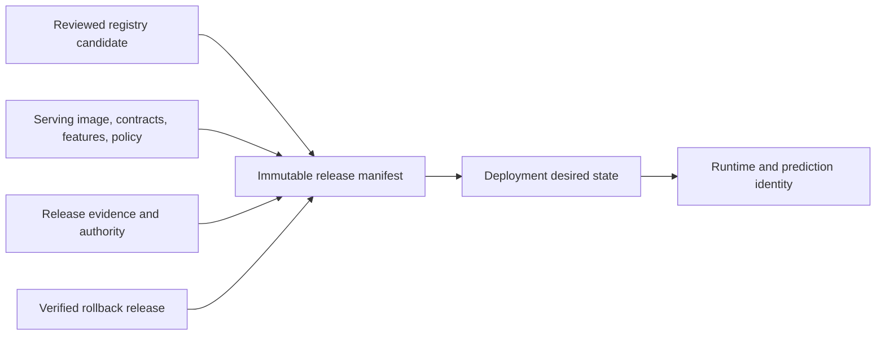
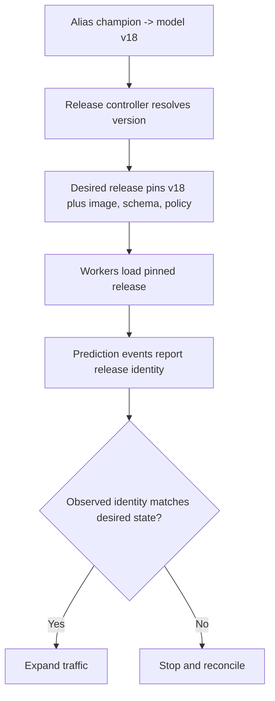

## Production Versioning Identifies The Complete Release
<!-- section-summary: Production versioning combines a reviewed model candidate with every runtime and policy input needed to deploy, observe, and restore its behaviour. -->

The registry hands release management an immutable model candidate with lineage and evaluation evidence. Production still needs to decide what executable system will use that candidate. **Production model versioning** combines the candidate with its serving runtime, contracts, feature and decision policy, traffic role, approval, and rollback target under one immutable release identity.

A model version and a production release version are related but not interchangeable. The same model version can appear in two releases when a serving-code fix changes the image. A threshold change can create another release without retraining the model. Conversely, two model versions cannot safely share a release ID merely because an alias moved.

The production framework has six parts:

1. **Reviewed candidate input** pins the exact registry version and candidate evidence received at handoff.
2. **Release manifest** pins model, image, schemas, features, policy, evidence, and rollback as one unit.
3. **Compatibility contract** defines which callers, stored predictions, and feature producers can safely cross the release.
4. **Desired traffic state** records which environment, population, and route should use the release.
5. **Observed runtime identity** records which release actually handled requests or batch partitions.
6. **Restorable release** preserves a previously verified complete tuple rather than only old weights.



The immutable release path supports investigation and rollback. Deployment state expresses intent, while runtime and prediction telemetry prove what users received. Mixing the registry candidate, release manifest, and observed runtime into one movable label creates silent changes, so each layer needs its own identity and owner.

## Define the Complete Release Identity
<!-- section-summary: A production release pins model bytes together with the runtime, input contract, feature definitions, policy, and evidence that affect decisions. -->

A **model version** usually means one immutable registry entry or artifact digest. That identity is necessary and still incomplete for production. Two services can load the same weights and produce different results because they use different tokenizers, feature defaults, numerical libraries, thresholds, or post-processing rules.

The production unit should include:

| Identity | What it pins | Example failure without it |
|---|---|---|
| Model version and digest | Weights and bundled preprocessing assets | A mutable object is overwritten after approval |
| Serving image digest | Inference code and dependencies | A library update changes preprocessing |
| Input and output schema | Types, required fields, and response meaning | A caller sends a renamed feature |
| Feature version | Online and offline transformations | Training and serving calculate different values |
| Decision policy | Thresholds, caps, fallbacks, and routing | A threshold changes workload without a new model |
| Evidence identity | Evaluation protocol and approval | A report for one artifact is attached to another |

This group of identities forms a **release manifest**. The manifest receives its own immutable ID because these parts can change at different times. A serving-code fix can create a new release while keeping the model version. A newly calibrated threshold can require another review without retraining the weights.

```yaml
release_id: ticket-triage-prod-2026-07-17.1
model:
  registry_name: prod.support.ticket_triage
  version: "18"
  sha256: 91d8...
runtime:
  image: ghcr.io/pinedesk/triage-api@sha256:4c19...
contracts:
  request: ticket-features/v6
  response: triage-decision/v3
policy:
  version: triage-policy/12
evidence:
  evaluation: eval-8742
  approval: approval-1188
rollback_to: ticket-triage-prod-2026-06-28.2
```

The short manifest exposes the important relationship without embedding every report. Durable links point to larger evidence. Digests protect the boundary against mutable tags and overwritten files.

## Accept The Reviewed Candidate Without Reinterpreting It
<!-- section-summary: Release intake verifies the pinned registry handoff, then adds release-specific runtime and operational evidence without rewriting candidate history. -->

The registry candidate arrives with model digests, lineage links, evaluation reports, intended use, exclusions, limitations, and an accountable owner. Release intake verifies that handoff rather than reconstructing it from a mutable alias or a folder of reports. If the candidate digest or required evidence no longer matches, the release does not proceed.

Production evidence then attaches to the release manifest. Compatibility tests, latency and capacity results, target-environment checks, monitoring readiness, approval scope, and rollback proof describe the executable release, not the bare model version. This distinction explains why one reviewed candidate can generate several release attempts and why a serving-image change needs a new release ID even when the weights remain fixed.

The release record keeps durable links back to the registry candidate. It never copies candidate lineage into editable production tags and treats the copy as a new truth. Incident responders can move from a live prediction to the release manifest, then from the manifest to the exact candidate and its original evidence.

## Resolve Aliases Once At The Release Boundary
<!-- section-summary: A release may use an alias to discover a candidate, but it pins the concrete version before building desired production state. -->

Registry aliases such as `candidate` or `champion` are movable discovery aids. Their design belongs to the registry workflow. Production versioning has one rule for them: resolve once, verify the reviewed candidate record, and store the concrete version and digest in the release manifest.

If every worker resolves `champion` whenever it restarts, an alias move can gradually change traffic outside the rollout controller. Production therefore keeps three states visible:

The safer pattern keeps three states visible:

- The **registry alias** communicates intent and helps locate a version.
- The **deployment record** pins the exact release that an environment should run.
- The **runtime report** states what each serving process loaded.



This design catches stale workers, partial rollouts, and cache problems. An alias can point to version 18 while some pods still serve version 17. The release manifest and telemetry reveal the actual production state; the alias does not.

## Compare Complete Releases, Not Bare Versions
<!-- section-summary: Production comparison attributes traffic and outcomes to complete releases so model, runtime, contract, and policy changes remain distinguishable. -->

Version numbers describe registration order, not quality. The Model Evaluation module defines how a candidate and baseline should be compared before release. Production versioning adds another requirement: comparison events identify the complete baseline and candidate releases, because differences may come from the model, runtime, feature contract, threshold, or route.

For a support-ticket triage service, useful evidence may include macro F1, urgent-ticket recall, language segments, human-queue volume, latency, timeout rate, and fallback use. A candidate can improve classification while generating more urgent alerts than the support team can handle. The product workflow belongs in the comparison.

Prediction events need a shared request ID plus release, model, feature, policy, and route identities. Once labels mature, the evaluation job can join outcomes to the exact release that produced each decision. If events record only an alias or model version, a later alias move or policy change can make historical data ambiguous.

Changes should receive human-readable release notes. A useful note explains changed training data, features, algorithm, calibration, threshold, dependency, or policy; expected impact; known limitations; and migration requirements. The diff helps reviewers understand why metrics moved and which failure modes deserve attention.

## Join Asset Versions Under One Release ID
<!-- section-summary: Registries, container stores, data systems, and source control keep their own identities, while the release manifest joins the exact production tuple. -->

No single tool versions every MLOps asset well. Git identifies source and configuration. Dataset systems or immutable warehouse snapshots identify training data. Object stores retain large artifacts. Container registries identify runtime images. Model registries connect models to runs, metadata, tags, and aliases. A release manifest joins them.

Teams can use sequential registry numbers, content-derived digests, timestamps, or semantic release names for individual assets. Sequential numbers are readable inside one registered model. Digests verify bytes. Timestamps help operations order events. Semantic names communicate compatibility but require disciplined rules. The release ID should not pretend these schemes are interchangeable; it records their exact values together.

The key requirements are immutability, uniqueness inside the relevant namespace, durable links, and a way to compare. A version should never depend only on a local path or mutable storage key. The Artifact Promotion article takes responsibility for preserving those identities across environment trust boundaries and deciding whether the target copies bytes or references a shared immutable object.

## Version Contracts and Migrations Deliberately
<!-- section-summary: Compatibility versions tell callers and operators which inputs, outputs, features, and stored results can safely cross a release boundary. -->

Model identity alone does not tell a caller whether it can use a release. **Contract versioning** records changes to request fields, response fields, feature meaning, and decision semantics. Adding an optional response field may preserve compatibility. Renaming a required input, changing units from minutes to seconds, or redefining a confidence score can break callers even when the service still returns HTTP 200.

A contract change needs a migration plan. The service can accept old and new request shapes during a transition, calculate both feature versions, or expose a new API route. Producers and consumers agree on an end date for the old shape. Telemetry reports which contract each caller uses so the team knows whether removal is safe.

Stored predictions also carry versioned meaning. A warehouse table with `prediction=0.8` is ambiguous without the model, policy, schema, and score interpretation. Prediction records should preserve enough identity to reconstruct the decision later. If a new version changes class labels or calibration, downstream dashboards and feedback jobs may need their own migration.

Feature versions deserve special attention because online and offline systems must agree. A feature named `customer_value_30d` can change its source, late-data rule, currency, or aggregation window without changing its column name. A versioned feature contract records those semantics and lets a release reject incompatible values before serving.

Compatibility decisions should appear in the release evidence. The team tests old callers against the new service, validates new callers against the retained rollback release when needed, and checks mixed-version periods during canary. This prevents a technically correct rollback from breaking a caller that already migrated to a new schema.

## Detect Versioning Failures in Production
<!-- section-summary: Reconciliation and audit checks find mutable artifacts, mixed releases, incomplete telemetry, and references that no longer resolve. -->

Versioning controls need routine verification. A reconciliation job compares deployment desired state with service metadata and recent prediction events. Every ready replica should report the approved release. The job also checks that the model digest exists, the serving image is retained, evidence links resolve, and the rollback target remains loadable.

Mixed releases can be legitimate during canary, so the check uses expected traffic roles and percentages. If version 18 should receive ten percent of city traffic, the report compares observed assignments with that policy. Traffic outside the approved population or a stale version on an unrelated route triggers an alert.

Identity coverage is itself a metric. Teams can require every prediction event to include `release_id`, `model_version`, `model_digest`, and `traffic_role`. Missing identity should fail a release gate because later quality analysis cannot attribute outcomes reliably. The event pipeline should also record timeouts and fallbacks; logging only successful predictions makes a failing version appear healthier.

Common failure patterns include overwriting an object behind an existing version, rebuilding a model during environment promotion, using the `latest` image tag, moving an alias without a deployment record, and deleting a rollback asset while a manifest still references it. Scheduled integrity checks can hash retained artifacts, verify signatures or provenance, and follow every live reference to its target.

An audit trail records who created a version, attached evidence, moved an alias, approved a scope, changed deployment state, and invoked rollback. These events should use authenticated identities and immutable timestamps. The history explains both the model lifecycle and the authority that changed production.

## Roll Back the Complete Release
<!-- section-summary: Rollback restores a retained model, runtime, schema, feature contract, and policy that already passed production checks. -->

Rollback should target a known complete release rather than “the previous model file.” A candidate may require a new image or feature schema that the prior model cannot use. Restoring only weights can create an incompatible mixture.

The rollback process changes desired state to the retained release, reduces or removes candidate traffic, and verifies that service metadata and prediction events report the target. A registry alias move can support the workflow, while the deployment controller still has to reconcile running processes.

Retention policy should preserve rollback releases, their artifacts, images, schemas, configuration, and evidence for a period that covers likely detection delay. Some model failures appear only after labels mature days or weeks later. Storage lifecycle rules must understand those references before deleting assets.

## Versioning Preserves Meaning Across the Lifecycle
<!-- section-summary: Stable identities and explicit relationships let teams move from training evidence to live decisions and back to a safe release. -->

Production model versioning creates a durable chain from data and code to a model, from the model to a complete release, and from the release to live decisions. Immutable identities preserve history. Lineage explains origin. Evidence and approval explain allowed use. Aliases provide readable pointers. Deployment records and telemetry expose real production state.

This structure gives teams reliable comparison, controlled rollout, incident attribution, and rollback without treating a mutable file name as the source of truth.

## References

- [MLflow Model Registry workflows](https://mlflow.org/docs/latest/ml/model-registry/workflow/)
- [MLflow Model Registry tutorials](https://mlflow.org/docs/latest/ml/model-registry/tutorial)
- [Databricks: Manage model lifecycle in Unity Catalog](https://docs.databricks.com/aws/en/machine-learning/manage-model-lifecycle/)
- [W&B Registry overview](https://docs.wandb.ai/models/registry)
- [SLSA provenance](https://slsa.dev/spec/v1.2/provenance)
