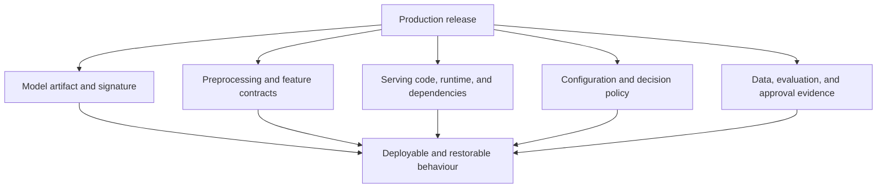
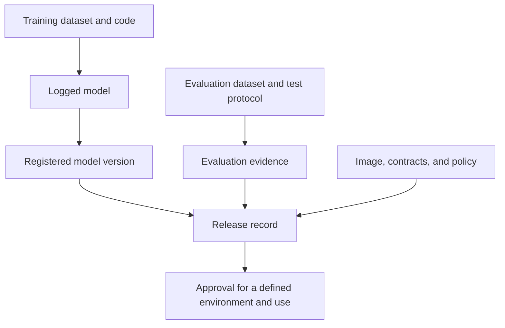
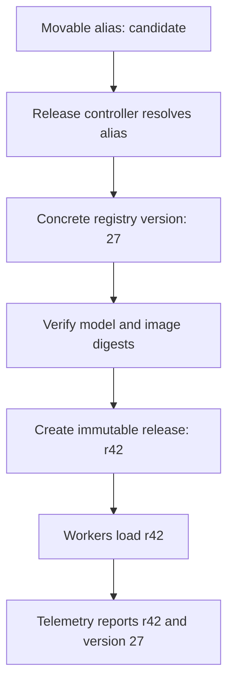
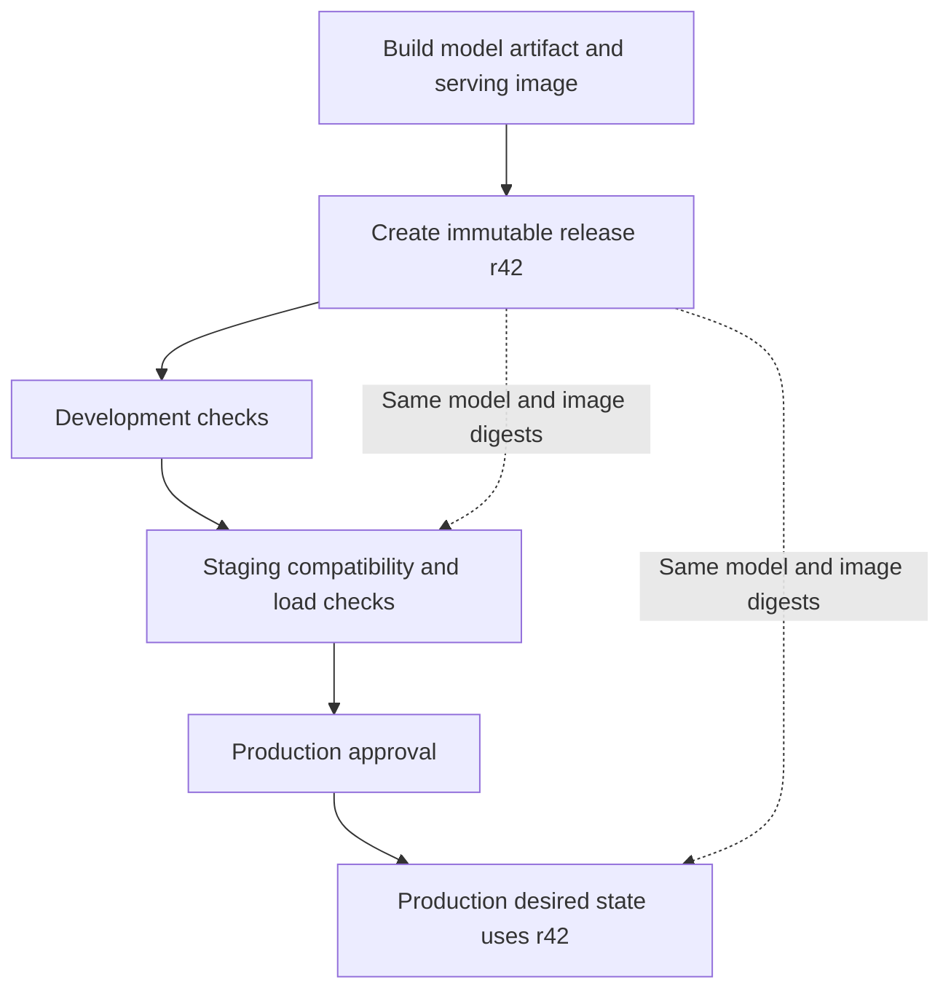

## Table of Contents

1. [What Model Versioning Means In Production](#what-model-versioning-means-in-production)
2. [Why Model Versioning Must Cover The Whole Prediction Path](#why-model-versioning-must-cover-the-whole-prediction-path)
3. [1. Start With The Model Artifact And Its Signature](#1-start-with-the-model-artifact-and-its-signature)
4. [2. Pin Preprocessing And Feature Contracts](#2-pin-preprocessing-and-feature-contracts)
5. [3. Preserve Code, Runtime, And Dependencies](#3-preserve-code-runtime-and-dependencies)
6. [4. Version Configuration And Decision Policy](#4-version-configuration-and-decision-policy)
7. [5. Record Which Data And Evaluation Approved The Release](#5-record-which-data-and-evaluation-approved-the-release)
8. [What A Registry Records And What Lineage Records](#what-a-registry-records-and-what-lineage-records)
9. [How To Verify That Release Files Are Authentic And Unchanged](#how-to-verify-that-release-files-are-authentic-and-unchanged)
10. [How Versions, Aliases, And Tags Identify Models](#how-versions-aliases-and-tags-identify-models)
11. [Promote The Same Release Through Each Environment](#promote-the-same-release-through-each-environment)
12. [How To Keep Callers And Rollbacks Compatible](#how-to-keep-callers-and-rollbacks-compatible)
13. [Record Which Release Made Every Prediction](#record-which-release-made-every-prediction)
14. [How To Restore A Known-Good Release](#how-to-restore-a-known-good-release)
15. [Keep Old Releases Long Enough For Rollback And Audit](#keep-old-releases-long-enough-for-rollback-and-audit)
16. [How Production Platforms Store Model Versions](#how-production-platforms-store-model-versions)
17. [Test Whether A Release Is Truly Restorable](#test-whether-a-release-is-truly-restorable)
18. [The Main Idea](#the-main-idea)
19. [References](#references)

## What Model Versioning Means In Production
<!-- section-summary: Production model versioning gives every deployed decision system a precise and restorable identity. -->

An incident responder must identify exactly what is running before choosing a safe replacement. **Model versioning gives every releasable model system a precise identity.** That identity answers four questions: What is running? How was it created? What evidence approved it? Which complete release can replace it?

The word *model* can make this subject sound smaller than it is. During training, a model may look like one file containing learned weights. In production, the prediction also depends on code that prepares the input and on governed feature definitions. Python libraries, the serving image, thresholds, fallback rules, and configuration also affect the result. Change any of those parts and users may receive a different decision from the same weights.

Consider a credit-risk score. Version 14 of the weights produces a probability of `0.78`. One service approves applications at `0.75`; another uses `0.80`. Both services loaded version 14, yet they make different decisions. The weights identify the mathematical scorer. They do not identify the complete production behaviour.


*The model version identifies the scorer; the release must also identify the policy and every other component that changes production behaviour.*

A production version therefore represents a **release bundle**: a recipe for reconstructing the same prediction path.


```mermaid
flowchart TD
    A["Production release"] --> B["Model artifact and signature"]
    A --> C["Preprocessing and feature contracts"]
    A --> D["Serving code, runtime, and dependencies"]
    A --> E["Configuration and decision policy"]
    A --> F["Data, evaluation, and approval evidence"]
    B --> G["Deployable and restorable behaviour"]
    C --> G
    D --> G
    E --> G
    F --> G

    class A release
    class B,C,D,E,F part
    class G outcome
```

The bundle receives its own immutable `release_id`. Individual systems still keep their native identities. MLflow has a logged-model ID and a registry version. Git has a commit. An OCI registry has an image digest, and the feature platform has a feature-set version. The release record joins those identities without pretending they are one object.

## Why Model Versioning Must Cover The Whole Prediction Path
<!-- section-summary: Complete release identity covers every input that can change a model's production behaviour. -->

Suppose a team saves an old model file for rollback. An incident occurs, so the deployment loads that file into the current service image. The current image contains a newer tokenizer and a newer version of the numerical library. The endpoint starts successfully, though its scores differ from the original release.

The file was preserved. The behaviour was lost.

This is the central problem that production versioning solves. A release is complete only if an operator can use its recorded identities to recreate the behaviour that passed testing. The release record usually pins:

- the exact model artifact and model signature.
- preprocessing code, tokenizer, label map, and feature definitions.
- source commit, serving image digest, runtime, and dependency lock.
- non-secret configuration, thresholds, calibration, routing, and fallback policy.
- training-data and evaluation-data identities.
- evaluation reports, approvals, intended-use limits, and owners.
- the preceding compatible release that can serve as a rollback target.

Secrets stay in a secrets manager. The release stores the required secret name or interface version, never the secret value. Capacity settings and endpoint names may vary by environment as well. The important boundary is behaviour: any value capable of changing a prediction, its interpretation, or its safety path needs a controlled identity.

A compact release manifest might look like this:

```yaml
release_id: risk-score/r42

model:
  registered_name: risk.score
  registry_version: "27"
  logged_model_id: m-7f3a...
  artifact_digest: sha256:2a91...

contracts:
  signature: risk-score-signature/v5
  feature_set: risk-features/v8

runtime:
  source_commit: 8f17...
  image: registry.example/risk-api@sha256:7c44...
  dependency_lock: sha256:af12...

policy:
  version: risk-decision-policy/v12
  threshold: 0.82
  fallback: manual-review/v3

evidence:
  training_dataset: risk-training@sha256:98bc...
  evaluation_report: evaluation/risk-score-27
  approval: approval/risk-score-27-production

rollback_to: risk-score/r41
```

The manifest stays small because it stores durable references and digests. Evaluation reports, model cards, dependency files, and datasets live in systems designed for those assets. The manifest's job is to state the exact combination approved for release.

## 1. Start With The Model Artifact And Its Signature
<!-- section-summary: The artifact stores learned behaviour, while the signature defines the inputs and outputs that make the artifact usable. -->

A **model artifact** is the saved result of training. Depending on the framework, it may contain learned parameters, a computation graph, preprocessing assets, or custom prediction code. Examples include an MLflow Model, an ONNX file, a TensorFlow SavedModel, and a set of sharded model weights.

An artifact needs an immutable identity. A registry version such as `risk.score` version `27` gives people a stable name inside the registry. A content digest such as `sha256:2a91...` verifies the exact bytes. Keeping both is useful: the registry version is readable and connected to metadata, while the digest protects against an overwritten or incorrectly copied object.

The **model signature** describes the interface around the artifact. You can think of it as a contract. It states which inputs the model accepts, their types and shapes, supported parameters, and the returned output.

For a tabular model, a signature might require `age` as an integer and `account_balance` as a double. For an image model, it may require a tensor with a fixed number of colour channels. For a language model wrapper, it may describe a list of messages plus inference parameters.

Without that contract, the artifact may load correctly and still receive invalid data. An API can send an integer field as a string or swap a tensor dimension. It may omit a required column or interpret a returned score as a class label. Signature validation catches many of these failures close to the service boundary.

MLflow 3 treats logged models as first-class objects and assigns each one a `model_id`. Providing an input example lets MLflow infer and store a signature for common model flavours:

```python
import mlflow

with mlflow.start_run():
    model_info = mlflow.sklearn.log_model(
        sk_model=model,
        name="risk_score",
        input_example=X_example,
        pip_requirements="requirements.lock",
    )

print(model_info.model_id)
print(model_info.model_uri)
```

The logged-model ID identifies the MLflow object created by the training process. Registration then places that object under a governed registered-model name and assigns a registry version. Databricks Unity Catalog requires a model signature for registered models, which makes the input and output contract part of the governed record.

## 2. Pin Preprocessing And Feature Contracts
<!-- section-summary: Preprocessing and feature contracts preserve the meaning of the values supplied to the model. -->

The model sees numbers, tokens, or tensors. It relies on another layer to give those values meaning. **Preprocessing** turns raw input into model-ready input. A **feature contract** defines how a feature is calculated, named, typed, and retrieved.

Imagine a churn model with a feature called `spend_30d`. The name stays unchanged, though the feature pipeline switches from gross spend to net spend after refunds. The model receives a valid number with the expected type. Its interpretation has changed underneath it.

Versioning the feature contract prevents this quiet mismatch. A useful contract records the data source, transformation, time window, late-data rule, units, null behaviour, and online lookup key. The release then pins `customer-features/v8` instead of relying on a column name alone.

Preprocessing assets deserve the same care. A text classifier may depend on a tokenizer vocabulary, normalization rules, maximum sequence length, and label map. An image model may depend on resize behaviour, channel order, and normalization constants. A tabular pipeline may depend on category encoders and fitted scaling parameters.

There are two common ways to keep these parts aligned:

1. **Bundle fitted preprocessing with the model artifact.** A scikit-learn `Pipeline` or an MLflow `pyfunc` wrapper can package transformations that must travel with the model.
2. **Version external feature logic explicitly.** A feature platform or transformation repository can own shared definitions, while the release pins the exact feature-set version and verifies offline/online parity.

The boundary follows ownership. Fitted state that belongs to one model, such as a scaler learned from its training data, usually travels with the artifact. Shared business features, such as a governed thirty-day balance, often live in a feature platform. Both still appear in the release identity.

Before approval, a compatibility test should replay representative requests through the exact preprocessing and feature path. The test checks field presence, types, tensor shapes, units, null handling, and a small set of known outputs. That evidence catches semantic drift that a file checksum cannot detect.

## 3. Preserve Code, Runtime, And Dependencies
<!-- section-summary: Reproducible serving requires the same application code, system libraries, runtime, and dependency graph. -->

A model executes inside software. The serving application parses requests, loads the artifact, fetches features, runs preprocessing, calls the model, applies post-processing, and formats a response. Every step can affect the result.

The **runtime** is the execution environment for that software: Python or another language runtime, operating-system libraries, CPU or GPU libraries, and hardware-specific components. **Dependencies** are the packages imported by the model and serving code.

Suppose a recommender uses the same artifact after a NumPy and BLAS upgrade. Most outputs remain close, yet tie-breaking changes for a small group of users. A source commit alone cannot reproduce the old behaviour because the dependency graph changed. A list containing only top-level packages may also be insufficient because a transitive dependency can move independently.

Production teams commonly preserve this layer in two forms:

- a dependency lock records exact package versions and hashes;
- an OCI container image packages the serving code, runtime, system libraries, and installation result.

The release points to the image by digest:

```text
registry.example/risk-api@sha256:7c44...
```

An image tag such as `risk-api:production` is convenient for people and deployment automation, though its target can move. The digest identifies the exact OCI manifest selected for the release.

MLflow Models also record environment files such as `requirements.txt`, `python_env.yaml`, and `conda.yaml`. That model-level environment improves portability.

The serving image needs its own digest too. It covers the API code and operating-system packages. It also covers health checks, instrumentation, and runtime pieces outside the model package.

The most reliable pattern is **build once, test the immutable image, and promote the same digest**. Rebuilding from the same source in each environment creates several opportunities for dependency resolution or base images to change.

## 4. Version Configuration And Decision Policy
<!-- section-summary: Configuration and decision policy control how a model score turns into a production action. -->

A model often returns a score; the product needs a decision. The rules that turn that score into an action form the **decision policy**.

Thresholds and calibration shape the result. Class mappings explain its meaning. Guardrails, routing percentages, fallback behaviour, and human-review rules control the action around it.

For example, a fraud model returns `0.84`. Policy version 6 blocks transactions above `0.80`; policy version 7 sends scores from `0.80` to `0.90` to manual review. The model artifact is unchanged, while the customer experience and operational workload are very different.

Policy changes need their own version, review evidence, and release record. A threshold is often treated as “just configuration.” Its value can change approval rates and safety risk. It can also change fairness across segments and the size of a human-review queue. The release manifest should preserve the exact policy used by each prediction.

Configuration falls into three useful groups:

- **Behavioural configuration** can change a prediction or action. It belongs in the versioned release identity.
- **Environment configuration** connects the release to an endpoint, region, secret reference, or capacity setting. It belongs in environment-specific desired state.
- **Secrets** live in a managed secret store. The release records the expected secret interface or reference, never the value.

This separation allows a release to run with four replicas in staging and forty in production while keeping its model behaviour identical. It also prevents an unreviewed threshold edit from hiding inside a deployment variable.

## 5. Record Which Data And Evaluation Approved The Release
<!-- section-summary: Data identities and evaluation evidence explain what the model learned and why a particular release was approved. -->

A production version should lead back to the evidence that justified it. The weights answer “what was saved?” Lineage and evaluation answer “where did it come from, how was it tested, and what use was approved?”

The **training-data identity** may be a table version, lakehouse snapshot, object manifest, or dataset digest. The **evaluation-data identity** pins the exact examples used for offline comparison.

Both identities need useful context. Their metadata should explain the schema, source, time range, and important filters.

MLflow dataset tracking can record a dataset name, source, schema, profile, and digest alongside a run. MLflow 3 also links model metrics to specific datasets and logged models. Managed registries add model cards, approval status, tags, and governance metadata around the registered version.

Consider two evaluation reports with identical accuracy. One used a representative holdout set; the other accidentally excluded the hardest segment. The metric value alone cannot show that difference. The release needs a durable link to the evaluation protocol, dataset identity, segment results, test code, and reviewer decision.

Evidence belongs at the right level. Training metrics describe the logged model. API compatibility and load tests describe the serving image plus model. A threshold-impact review describes the decision policy. The release record connects all three, preserving which evidence supports each component.


```mermaid
flowchart TD
    A["Training dataset and code"] --> B["Logged model"]
    B --> C["Registered model version"]
    D["Evaluation dataset and test protocol"] --> E["Evaluation evidence"]
    C --> F["Release record"]
    E --> F
    G["Image, contracts, and policy"] --> F
    F --> H["Approval for a defined environment and use"]

    class A,D,G origin
    class B,C,E identity
    class F release
    class H approval
```

## What A Registry Records And What Lineage Records
<!-- section-summary: Registry versions identify governed model entries, while lineage connects those entries to their origins and evidence. -->

A **model registry** is a governed catalogue for model assets. It gives a registered model a stable name and creates ordered versions beneath that name. It also stores metadata and controls lifecycle actions such as approval or alias movement.

The registered name groups versions of the same production responsibility. `risk.score` might contain versions 25, 26, and 27. Version 27 identifies one immutable registry entry. The number usually expresses creation order inside that registered model. Quality still comes from evaluation evidence.

**Lineage** is the chain of relationships behind the version. It can connect version 27 to a logged-model ID, source run, Git commit, training dataset, feature definitions, evaluation results, and producing pipeline. In another term, the registry tells you which governed model object you selected, while lineage tells you how that object came to exist.

During an incident, lineage guides the investigation toward shared causes. If several weak releases share the same training-data snapshot, the team can investigate that common source. If one release differs only by serving image, the investigation can focus on runtime code and dependencies. A version number without lineage gives the team a label and very little explanation.

The release manifest adds a final relationship: it connects the registry version to the exact runtime, contracts, and policy deployed around it. Registries increasingly store more of this metadata. The production application may still need a dedicated release record. That record joins identities from Git and OCI with the feature, policy, and data systems.

## How To Verify That Release Files Are Authentic And Unchanged
<!-- section-summary: A digest identifies bytes, a cryptographic signature verifies an attestation, and provenance describes the build that produced an artifact. -->

Three security terms often appear together: digest, signature, and provenance. They protect different parts of release trust. Understanding the difference helps a beginner see why a production gate may check all three instead of choosing one.

A **digest** is a content-derived identifier. The OCI image specification uses descriptors that include a digest, media type, and size. Pulling `image@sha256:...` asks for content matching that digest. A changed byte produces a different digest, which protects the release from mutable tags and accidental replacement.

A **cryptographic signature** proves that a trusted key or identity signed a particular statement. Tools such as Cosign can verify signatures associated with a container image digest. Verification answers whether the signature is valid under the team's trust policy.

**Provenance** describes how an artifact was built. SLSA provenance can bind artifact subject digests to a build definition and build-run details. It helps a reviewer see which source, builder, parameters, and process produced the asset.

Think of the three controls as different questions:

- Digest: “Are these the exact bytes named by the release?”
- Signature: “Did an accepted identity sign the attestation for these bytes?”
- Provenance: “Which build process and inputs produced these bytes?”

An immutable digest alone cannot tell the team whether the build was trustworthy. A signed statement without a pinned digest can leave the subject ambiguous. Mature release gates combine digest pinning, signature verification, provenance policy, vulnerability scanning, and access control.

The same idea applies beyond containers. Model artifacts, dependency locks, evaluation reports, and dataset manifests can carry hashes. A release controller verifies those hashes before deployment and reports a failure if a referenced asset has changed or disappeared.

## How Versions, Aliases, And Tags Identify Models
<!-- section-summary: Versions preserve history, while aliases and tags provide movable names for discovery and automation. -->

A **version** is the durable identity of one registry entry. An **alias** is a readable name that points to a version. `candidate`, `champion`, or `rollback` can communicate a version's current role without changing the version itself.

Aliases are deliberately movable. In MLflow Model Registry, an alias can be reassigned from one model version to another. Model Registry on Gemini Enterprise Agent Platform follows a similar idea. An OCI tag also acts as a human-readable pointer whose target can move.

That mutability is useful for discovery and automation. It is unsafe as the only production identity.

Suppose an autoscaled worker loads `models:/risk.score@champion` at startup. The alias points to version 27 in the morning and version 28 later. Existing workers keep version 27 while new workers load version 28. Traffic now crosses two versions outside the rollout controller.

The controlled pattern resolves the alias at the release boundary and pins the result:


```mermaid
flowchart TD
    A["Movable alias: candidate"] --> B["Release controller resolves alias"]
    B --> C["Concrete registry version: 27"]
    C --> D["Verify model and image digests"]
    D --> E["Create immutable release: r42"]
    E --> F["Workers load r42"]
    F --> G["Telemetry reports r42 and version 27"]

    class A pointer
    class B,D control
    class C,E immutable
    class F,G runtime
```

MLflow's old model stages are deprecated. Current workflows use aliases and tags, often with separate registered models or governance boundaries for development, staging, and production. The crucial production rule stays the same across products: aliases help locate a candidate; deployment records pin concrete versions and digests.


*Resolve a movable alias once at the release boundary, then make workers load the pinned version and digests recorded by the immutable release.*

## Promote The Same Release Through Each Environment
<!-- section-summary: Environment promotion reuses the tested immutable assets and changes only approved environment-specific desired state. -->

Development, staging, and production serve different purposes. Development supports rapid experiments. Staging tests a realistic deployment and its dependencies. Production handles real users and stronger governance. Those differences should not cause the model or image to be rebuilt at every step.

**Promotion** means moving an approved identity into a stronger trust boundary. The release controller takes the identities that passed the earlier gate. It records the model version, image digest, contracts, policy, and evidence used in the target environment.


```mermaid
flowchart TD
    A["Build model artifact and serving image"] --> B["Create immutable release r42"]
    B --> C["Development checks"]
    C --> D["Staging compatibility and load checks"]
    D --> E["Production approval"]
    E --> F["Production desired state uses r42"]
    B -. "Same model and image digests" .-> D
    B -. "Same model and image digests" .-> F

    class A build
    class B release
    class C,D,E gate
    class F production
```

Endpoint names, replica counts, secret references, and regional capacity can differ across environments. Those values belong to environment desired state. Model bytes, image bytes, feature semantics, and decision policy stay pinned unless a reviewed change creates a new release.

Managed registries support several promotion shapes. Azure Machine Learning registries can share models, environments, components, and data assets across workspaces. Databricks Unity Catalog provides governed models and aliases across workspaces attached to the metastore. SageMaker Model Registry uses model package groups and model versions with approval metadata. The exact API differs, while the architecture remains build once, identify precisely, approve deliberately, and deploy the same assets.

## How To Keep Callers And Rollbacks Compatible
<!-- section-summary: Compatibility rules describe which callers, features, stored records, and older releases can safely coexist. -->

A release can be accurate and fully reproducible yet still break the surrounding product. **Compatibility** asks whether the new release can communicate safely with existing callers, feature producers, stored predictions, dashboards, and rollback targets.

Suppose an API changes an input field from `monthly_income` in dollars to `monthly_income_cents`. The new model and client agree. During a partial rollout, older clients still send dollars. Both values are numeric, so schema validation may pass even though the meaning is wrong.

A contract version needs to cover semantics as well as types. Useful compatibility checks include:

- old clients against the new service.
- new clients against the retained rollback service.
- old and new feature producers during a mixed-version period.
- stored prediction consumers against new class labels or score meaning.
- canary and fallback paths under both contract versions.

Breaking changes need a migration path. The service may accept both request shapes for a limited period, calculate two feature versions in parallel, or expose a new API route. Telemetry records contract usage by caller group so removal follows evidence instead of guesswork.

Rollback compatibility deserves explicit testing. If clients adopt a new required response field, restoring the prior service may break them. A team can retain a compatibility adapter or delay the client requirement. Another option prepares a rollback release that includes the old model with the compatible API layer.

## Record Which Release Made Every Prediction
<!-- section-summary: Runtime and prediction records connect real user outcomes to the exact release that produced them. -->

The release manifest describes approved intent. Production telemetry shows what actually ran. Both are needed because a deployment can contain stale workers, failed rollouts, unexpected fallbacks, or traffic outside the approved scope.

Every prediction record should carry a compact set of identities such as:

```json
{
  "prediction_id": "pred_01...",
  "release_id": "risk-score/r42",
  "model_name": "risk.score",
  "model_version": "27",
  "logged_model_id": "m-7f3a...",
  "image_digest": "sha256:7c44...",
  "feature_contract": "risk-features/v8",
  "policy_version": "risk-decision-policy/v12",
  "traffic_role": "candidate"
}
```

These fields allow a later outcome to join to the exact decision path. If quality drops only for predictions from release `r42`, the team can compare its model, image, feature, and policy identities with the baseline. If predictions carry only the alias `champion`, a later alias move can make historical attribution ambiguous.

Runtime metadata also supports reconciliation. A controller expects ten percent of traffic on `r42` and ninety percent on `r41`. Service metadata and prediction counts reveal whether that split exists in practice. A worker reporting an unapproved image digest can be removed before its predictions contaminate the evaluation.

Sensitive input values do not belong in high-cardinality metric labels. Exact prediction identity belongs in governed logs, traces, or decision records. Metrics can aggregate by bounded fields such as release, route, result, and region.

## How To Restore A Known-Good Release
<!-- section-summary: A safe rollback restores the model, runtime, contracts, and policy that passed earlier production checks. -->

Rollback is the strongest test of the versioning design. If the team can restore only the old weights, it has saved one artifact and lost the rest of the release identity.

A **rollback target** is a retained, compatible release that has already passed the required checks. It includes the prior model, image, feature contract, request and response contract, policy, and configuration interface. The deployment controller changes desired state to that release and verifies the observed runtime identities afterward.

Imagine release `r42` increases error rates because its API image contains a faulty preprocessing path. Restoring model version 26 inside the same faulty image leaves the incident active. Restoring complete release `r41` brings back its model version and its previously verified image together.

A practical rollback runbook covers four stages:

1. Stop traffic expansion and preserve incident evidence.
2. Point desired state to the retained rollback release.
3. Verify loaded release IDs, image digests, health signals, and contract compatibility.
4. Confirm user and model outcomes before closing the incident.

Alias movement can be part of the control plane, though it cannot prove that every worker loaded the target. Deployment status and runtime telemetry provide that proof.

## Keep Old Releases Long Enough For Rollback And Audit
<!-- section-summary: Reference-aware retention preserves complete rollback releases, while audit events explain every lifecycle change. -->

Old releases consume storage, so teams need a retention policy. Deleting them solely by age is risky. A release may still be the active rollback target or support an older batch partition. An investigation with delayed labels may also need it weeks later.

**Reference-aware retention** follows the release manifest. It keeps each asset referenced by an active deployment, rollback target, legal hold, or unresolved incident. That includes model artifacts, images, dependency locks, contracts, policies, and evidence records. Garbage collection can remove unreferenced assets after the required evaluation and audit window.

Periodic restore tests protect against false confidence. A manifest may still exist even though an image repository expired a layer or a model artifact lost access permissions. Loading the retained release in an isolated environment verifies that every reference resolves and that the smoke-test predictions still match expected outputs.

The **audit trail** records who performed each lifecycle action. Useful events include model logging, registration, evidence attachment, approval, alias movement, release creation, environment promotion, desired-state change, emergency override, rollback, and asset deletion. Each event carries an authenticated actor, timestamp, target identity, reason, and resulting state.

Audit history answers questions that lineage cannot. Lineage explains how an artifact was produced. Audit explains who authorized its use and who changed production. Together they support incident review, regulated evidence, and ordinary operational accountability.

## How Production Platforms Store Model Versions
<!-- section-summary: Modern registries and OCI tooling cover important parts of release identity, while a release record joins the complete production system. -->

Production model versioning usually spans several systems. A model registry stores model identities and review metadata. An OCI registry stores custom runtime images. Source control, data platforms, and deployment systems preserve the remaining versions. The release record connects them into one restorable production unit.

### MLflow 3 and Databricks Unity Catalog

MLflow 3 gives each logged model a `model_id` and connects model metrics to datasets and checkpoints. MLflow Model Registry adds registered names, immutable versions, aliases, tags, and descriptions. Databricks Unity Catalog adds central governance, permissions, lineage, and cross-workspace access for registered models.

This stack works well for teams that want open model packaging and experiment tracking with either an open-source registry or a governed lakehouse registry. The release record should still pin the serving image digest, feature contract, decision policy, and target-environment approval around the registered model version.

### Managed Cloud Model Registries

Amazon SageMaker Model Registry groups versions in model package groups and can associate model artifacts, inference images, metrics, model cards, lineage, and approval status. Model Registry on Gemini Enterprise Agent Platform provides model versions and aliases, plus integration with Gemini Enterprise Agent Platform Endpoints. Azure Machine Learning registries share models, environments, components, and data assets across workspaces.

These services reduce the amount of registry infrastructure a team operates. They also integrate with their cloud's IAM, deployment, metadata, and monitoring services. The same release discipline applies. Pin concrete versions and preserve complete evidence. Keep movable aliases separate from immutable deployment identity. Test rollback as a full system.

### OCI Images And Supply-Chain Verification

Docker-compatible OCI registries are the common packaging boundary for custom model services, KServe, Kubernetes deployments, and many managed endpoints. Image digests give the runtime an immutable content identity. Cosign signatures and SLSA provenance can add trust and build-history checks around that digest.

Managed endpoints may hide part of the container lifecycle. The team still needs a stable environment or image identity supplied by the platform, plus a way to connect it to the model version and release evidence.

The practical default uses a governed model registry for model identity and an OCI registry for custom runtime identity. Git identifies source, a lock file identifies language dependencies, and immutable dataset or table versions identify data. One release record joins them.

## Test Whether A Release Is Truly Restorable
<!-- section-summary: A release passes the versioning gate only after its identities resolve, its contracts work, and its behaviour can be recreated. -->

Versioning quality can be tested directly. Take the release manifest into a clean environment and attempt to reconstruct the service without relying on a developer's laptop or a mutable alias.

The verification should prove that:

1. every registry version and content digest resolves;
2. the model loads from the recorded artifact;
3. the image pulls by digest and passes signature or provenance policy;
4. the dependency and runtime identities match the release record;
5. representative requests satisfy the model and API contracts;
6. feature definitions and preprocessing produce expected values;
7. policy tests reproduce approved decisions at important boundaries;
8. lineage reaches the training data, code, run, and evaluation evidence;
9. runtime telemetry reports the correct release identity;
10. the retained rollback release also loads and passes its smoke tests.

One especially useful test uses scores close to a decision threshold. If release `r42` says `0.82` triggers manual review, inputs producing `0.819` and `0.821` should follow the expected paths. That check confirms the policy and model combination, not just model loading.

Teams automate these checks in CI/CD and repeat restore tests on a schedule. A passing result turns “we kept the files” into credible evidence that the production behaviour can be recovered.

## The Main Idea
<!-- section-summary: Production versioning preserves the complete meaning and behaviour of a deployed model release. -->

A model file captures learned parameters. A production release captures the system that turns real input into a real decision.

Strong model versioning gives that system one durable release identity. The release links to the exact artifact, signature, preprocessing, features, code, runtime, dependencies, policy, data, evidence, and approval. Concrete versions and digests preserve history. Aliases communicate current intent. Lineage explains origin. Runtime records show what users actually received. Retained complete releases make rollback dependable.

The final standard is practical: another operator should be able to identify, explain, deploy, observe, and restore the release from its recorded identities.


*A versioning system earns trust when a clean environment can reconstruct both the approved release and its retained rollback target.*

## References

- [MLflow 3 migration guide](https://mlflow.org/docs/latest/ml/mlflow-3/)
- [MLflow Models](https://mlflow.org/docs/latest/ml/model/)
- [MLflow model signatures and input examples](https://mlflow.org/docs/latest/ml/model/signatures/)
- [MLflow model dependency management](https://mlflow.org/docs/latest/ml/model/dependencies/)
- [MLflow Model Registry](https://mlflow.org/docs/latest/ml/model-registry/)
- [MLflow Model Registry workflows](https://mlflow.org/docs/latest/ml/model-registry/workflow/)
- [MLflow dataset tracking](https://mlflow.org/docs/latest/dataset/)
- [Databricks: Manage model lifecycle in Unity Catalog](https://docs.databricks.com/aws/en/machine-learning/manage-model-lifecycle/)
- [Amazon SageMaker Model Registry](https://docs.aws.amazon.com/sagemaker/latest/dg/model-registry.html)
- [Model Registry on Gemini Enterprise Agent Platform: Model Version Aliases](https://docs.cloud.google.com/gemini-enterprise-agent-platform/machine-learning/model-registry/model-alias)
- [Google Cloud: Gemini Enterprise Agent Platform Name Changes](https://docs.cloud.google.com/gemini-enterprise-agent-platform/vertex-ai-name-changes)
- [Azure Machine Learning registries for MLOps](https://learn.microsoft.com/en-us/azure/machine-learning/concept-machine-learning-registries-mlops?view=azureml-api-2)
- [Open Container Initiative image descriptor specification](https://github.com/opencontainers/image-spec/blob/main/descriptor.md)
- [Sigstore Cosign verification](https://docs.sigstore.dev/cosign/verifying/verify/)
- [SLSA provenance](https://slsa.dev/spec/v1.2/provenance)
