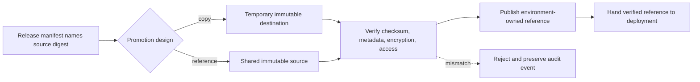
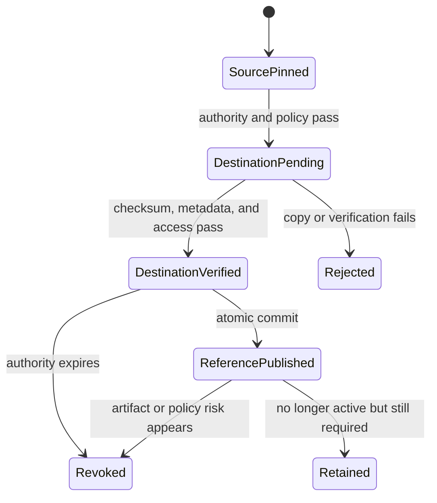

## Artifact Promotion Crosses A Trust Boundary
<!-- section-summary: Artifact promotion makes one immutable artifact available to a more controlled environment without changing or rebuilding its bytes. -->

The Model Versioning article defines the complete release identity. **Artifact promotion** answers a narrower question: how does the exact artifact named by that release become available across a staging or production trust boundary without being rebuilt, overwritten, or exposed to the wrong identity?

The promotion framework has six connected parts:

1. **Source identity** names the already reviewed artifact and digest.
2. **Destination policy** defines which workload may write, read, copy, or revoke it in the target environment.
3. **Transfer design** chooses between a verified copy and a controlled reference to shared immutable storage.
4. **Atomic transition** prevents a target reference from pointing to partial or mixed assets.
5. **Destination verification** proves the target resolves to the approved bytes with the required metadata and access.
6. **Audit and lifecycle controls** make retries, revocation, retention, and investigation predictable.

Promotion fails when teams reduce it to copying a file into a folder named `production`. A path is not a trust boundary, a copy command is not an authorization decision, and a successful upload does not prove that the destination contains the reviewed bytes.



The artifact stays immutable through this flow. Promotion changes which environment identity may resolve it, then verifies the destination before deployment receives the reference. Live traffic and runtime identity are deliberately outside this article's boundary.

## Source Identity Anchors The Boundary
<!-- section-summary: Promotion consumes the model version and digest from the release manifest rather than inventing another source identity. -->

Names such as `latest.pkl` or `final-model-v2.pkl` describe a temporary human opinion. A release needs a model name, an immutable version, and a content digest. The digest is a fingerprint calculated from bytes; if the artifact changes, the digest changes.

The model can be a bundle containing weights, tokenizers, preprocessing assets, calibration parameters, and label maps. Production versioning decides which of these assets belong to the complete release. Promotion consumes that decision. It does not decide the feature contract, serving image, threshold, or rollback release again.

An object store holds large files. A model registry records versions, aliases, metadata, and links. An experiment tracker records training runs. These systems may exist inside one product, but they answer different questions: where are the bytes, which model version do they represent, and how was that version produced?

A small release record can connect those identities:

```json
{
  "model_name": "search-ranker",
  "version": "42",
  "model_digest": "sha256:8b6d...",
  "serving_image_digest": "sha256:bd71...",
  "training_run": "run-7c1b2e",
  "dataset_snapshot": "search-training-2026-06-30",
  "feature_schema_hash": "sha256:bb01..."
}
```

This record supports the boundary; it is not the promotion decision. If the named artifact digest changes, promotion rejects it. If another release input changes, production versioning creates a new release manifest and submits a new promotion request.

## Release Authority Is An Input, Not A Registry Tag
<!-- section-summary: Promotion verifies that an active decision authorizes this exact source identity and destination environment. -->

Model evaluation decides whether evidence supports the intended use, while release governance decides who may accept the remaining risk. Artifact promotion does not repeat either review. It verifies that an active, authenticated decision names the exact source digest, destination environment, requested operation, and validity window.

For example, authority to copy a search-ranking model into staging does not authorize a production read path. Authority to make the artifact available in production does not decide whether it receives five percent or all traffic. The target environment and operation remain explicit so a broad tag such as `approved=true` cannot grant more access than reviewers intended.

Detailed reports remain in the evaluation and governance systems. The promotion audit stores their durable decision IDs and digests so investigators can prove which authority allowed the boundary crossing. It does not copy reports into environment storage and turn them into an editable second source of truth.

## Environment Boundaries Separate Creation From Use
<!-- section-summary: Distinct identities and storage permissions prevent experiments, training jobs, and serving runtimes from changing one another's trusted artifacts. -->

Development notebooks create experiments. Scheduled training creates candidates. Release automation promotes approved versions. Production serving reads the selected artifact. These responsibilities should use different identities and permissions.

The training job may read approved datasets and write candidate artifacts. Its identity lacks permission to alter the production deployment. The serving runtime may read approved model objects. Its identity lacks permission to replace or delete them. Only the release path can change the version production is configured to use.

Large platforms often enforce this with separate cloud accounts or projects. Smaller systems can begin with separate buckets or prefixes, service accounts, encryption keys, and access policies. The important property is enforceability. A naming convention that everyone promises to respect is weaker than a boundary the storage and identity systems apply.

## Copying And Referencing Are Two Valid Promotion Designs
<!-- section-summary: A platform may copy immutable artifacts across environment boundaries or keep one immutable object and promote a controlled reference. -->

Some organizations copy an approved artifact into an environment-specific store. This works well when staging and production use separate accounts, keys, or retention policies. The copy process must verify checksums and preserve lineage so it cannot turn an unknown file into a trusted release.

Other platforms keep one immutable artifact location and change a registry alias or deployment reference. This reduces duplicate bytes and can simplify lineage. The shared object must still be protected from overwrite, and environment-specific access must remain narrow.

Many teams combine the approaches: keep the original immutable model, copy only the required artifact bundle into an environment-owned area, and update an approved destination reference. The design choice depends on isolation and compliance needs. The invariant is that promotion never rebuilds the model or relies on a mutable `latest` path.

## Treat Promotion as a Checked State Transition
<!-- section-summary: A promotion transaction validates source state, evidence, destination policy, and final identity before it commits the new release reference. -->

Promotion changes artifact availability from one allowed state to another, such as `candidate_source` to `staging_available` or `staging_verified` to `production_available`. The transition has explicit preconditions. The source exists and matches its digest. Authority names that digest and destination. The target storage, encryption, retention, and access policies satisfy the environment contract.

The release controller should recheck these conditions immediately before it updates desired state. A review may have passed in the morning while an exception expired, a dependency was revoked, or the destination policy changed later. Using an old green result without checking its validity window can promote a release whose authority has already ended.

Cross-account copying needs a two-phase pattern. First, copy to a temporary immutable destination and verify size, checksum, encryption, metadata, and access. Then publish the destination version in the registry or release record. Updating the reference before the copy is verified creates a period where production points to missing or incomplete bytes.

Reference-based promotion also needs atomicity. The controller writes one desired release tuple that contains model, image, schema, and policy identities. Updating each field independently can create a mixed release, such as a new model with an old feature contract. A versioned release document or Git commit gives the controller one unit to reconcile.



This state machine records environment availability rather than traffic state. A rejected transfer can leave the original source untouched. A retained target can lose active environment authority while remaining available for rollback, audit, or a legal hold.

## Publish An Environment-Owned Reference
<!-- section-summary: Promotion commits one verified destination identity that deployment can consume without resolving a mutable source alias. -->

After verification, promotion publishes an environment-owned reference to the destination object or approved shared object. That reference contains the concrete release ID, artifact URI, digest, and promotion record. It never contains only `latest`, `candidate`, or another source alias.

The write should be atomic. A versioned catalog record, signed release document, or Git commit can provide one commit point. Until that commit succeeds, the prior environment reference remains authoritative. This prevents a failed transfer from leaving production pointed at incomplete bytes.

Deployment consumes the verified reference and adds desired traffic state. It should not repeat the copy or choose a newer source version. Conversely, publishing the environment reference does not itself route a request, restart a worker, or prove that a runtime loaded the artifact. Those checks belong to Model Versioning and Model Release Strategies.

## Verify The Destination Before Handoff
<!-- section-summary: Destination verification proves byte identity, metadata, access, and recoverability before the environment reference becomes visible. -->

A successful storage API response proves only that an operation was accepted. Promotion reads the destination back through the target environment's identity and checks several independent properties:

| Verification | What it catches |
| --- | --- |
| Content digest and object size | Truncated, changed, or wrong source bytes |
| Bundle inventory | Missing tokenizer, label map, or preprocessing asset |
| Encryption key and storage class | Object written under the wrong environment policy |
| Provenance and decision IDs | Destination cannot be traced to the reviewed source and authority |
| Reader and writer policy | Serving can read while training and notebook identities cannot overwrite |
| Immutability or object lock | A later write cannot change the approved identity in place |
| Clean-environment load fixture | Destination is readable and structurally complete |

The load fixture is intentionally narrow. It loads the promoted package and runs fixed inputs to prove that the destination is usable. Capacity tests, caller compatibility, canary behaviour, and prediction telemetry evaluate the complete running release later.

A compact promotion record preserves the boundary decision:

```yaml
promotion_id: promote-document-classifier-42-prod-01
release_id: document-classifier-prod-2026-07-12.1
operation: copy
source:
  uri: s3://ml-candidates/document-classifier/version=42/model/
  sha256: 7a9b4c...
destination:
  uri: s3://ml-prod-releases/document-classifier/version=42/model/
  sha256: 7a9b4c...
  encryption_key: prod-ml-artifacts
  allowed_reader: document-classifier-runtime
authority: GOV-2841
status: destination_verified
```

The same shape works for a reference-based design: `operation` becomes `reference`, the destination records the environment-owned catalog entry, and verification proves that the production reader can access the shared immutable source without granting production credentials back to development.

## Make Retries And Competing Promotions Safe
<!-- section-summary: Idempotency and compare-and-set rules stop retries or concurrent decisions from publishing a different artifact. -->

Promotion jobs fail and retry. The idempotency key should bind the source digest, destination environment, release ID, operation, and authority. Repeating the same request returns the existing verified destination. Reusing the key with a different digest fails rather than updating the object.

Two releases can reach the same environment close together. A compare-and-set transition records which environment reference the decision expected to replace. If another promotion or incident response changed that reference first, automation preserves both immutable artifacts but refuses to overwrite the newer decision. An operator or policy engine must reconcile the competing intent.

Temporary copy locations need cleanup rules, but cleanup must not hide failed evidence. The audit record keeps the source, attempted destination, verification results, actor, and failure even after incomplete temporary bytes are removed.

## Reverse Or Revoke The Environment Reference
<!-- section-summary: Environment recovery restores or removes an approved artifact reference without reconstructing model bytes. -->

If destination verification fails before publication, promotion leaves the existing reference unchanged and removes or quarantines the temporary object. If authority expires later, revocation prevents new deployments from resolving the reference while retaining the artifact as policy permits.

A deployment rollback may need a previous release. Artifact promotion supports that operation by keeping the previous environment object and reference readable for the declared rollback window. Model Versioning owns the complete rollback tuple and runtime reconciliation; promotion owns whether the exact required bytes still exist behind an authorized environment path.

Reconstructing last week's model from an experiment workspace is not recovery. The artifact may rebuild differently, the workspace may have broader permissions, and the original digest may be impossible to prove. Recovery selects an already verified environment object or performs a new audited promotion of the exact retained source.

## Handle Revocation, Deletion, and Retention Separately
<!-- section-summary: Revocation removes authority, deletion removes bytes, and retention preserves evidence or recovery assets for a declared period. -->

**Revocation** says an environment may no longer resolve an artifact for a declared use. A vulnerability, invalid dataset, supplier withdrawal, or incident can trigger it. Promotion policy blocks new consumers and marks the reference revoked; deployment and incident systems decide how to move active traffic. The artifact and evidence usually remain available to authorized investigators.

**Deletion** removes stored bytes. It may follow privacy, contract, security, or storage policy, and it needs a dependency check. Before deletion, the system finds deployment records, aliases, rollback targets, evaluation reports, and audit entries that still refer to the object. A legal or privacy requirement may demand deletion even when reproducibility would prefer retention, so the record should preserve the deletion decision and any allowed non-sensitive metadata.

**Retention** sets how long artifacts and evidence remain recoverable. Production rollback targets need a retention window that covers the time required to detect delayed quality failures. Training data and prediction evidence may follow different periods because they carry different privacy and operational risks. One lifecycle rule for every object often deletes something important or keeps sensitive data longer than necessary.

## Promotion Preserves Trust Across Environments
<!-- section-summary: Sound promotion preserves one source identity while changing which environment may resolve it. -->

A sound artifact-promotion system can answer which source digest crossed the boundary, whether it was copied or referenced, which authority allowed the operation, what destination policy protects it, whether verification passed, and which identity can revoke or retain it.

The model bytes remain fixed. The release manifest supplies the identity. Environment policy controls authority. Copy-or-reference design controls movement. Destination verification proves byte and access integrity. An atomic environment reference hands the result to deployment. Runtime identity, traffic, and rollback of the complete release remain the responsibility of the neighbouring release articles.

## References

- [MLflow Model Registry](https://mlflow.org/docs/latest/ml/model-registry/)
- [MLflow Model Registry workflows](https://mlflow.org/docs/latest/ml/model-registry/workflow/)
- [Databricks: manage model lifecycle in Unity Catalog](https://docs.databricks.com/aws/en/machine-learning/manage-model-lifecycle/)
- [Amazon S3 object lifecycle management](https://docs.aws.amazon.com/AmazonS3/latest/userguide/object-lifecycle-mgmt.html)
- [Google Cloud Storage Object Lifecycle Management](https://cloud.google.com/storage/docs/lifecycle)
