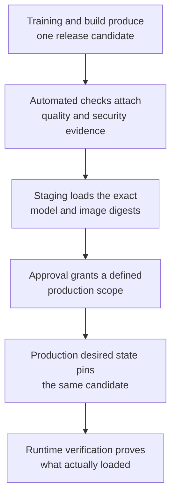
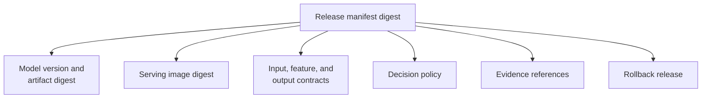
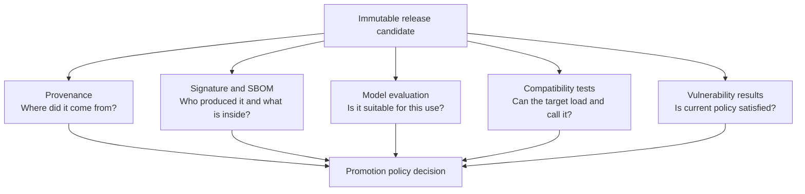
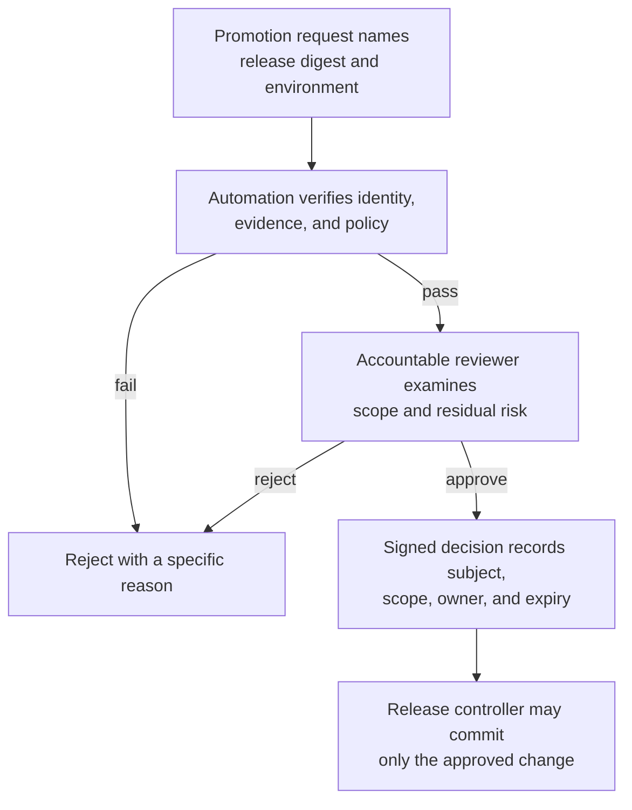
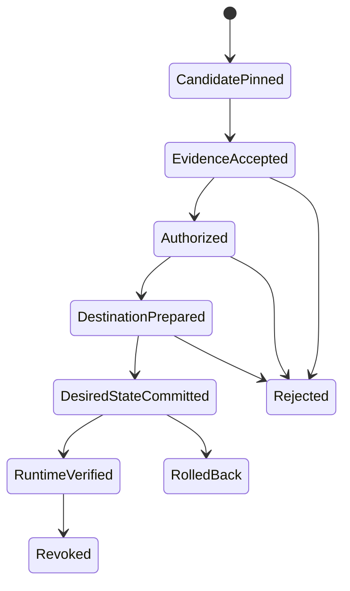
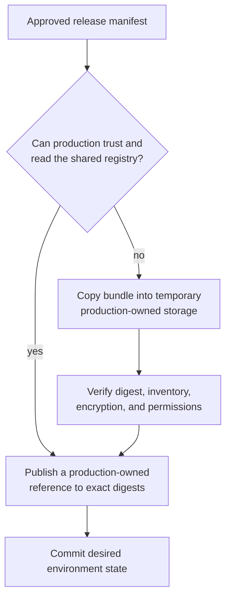
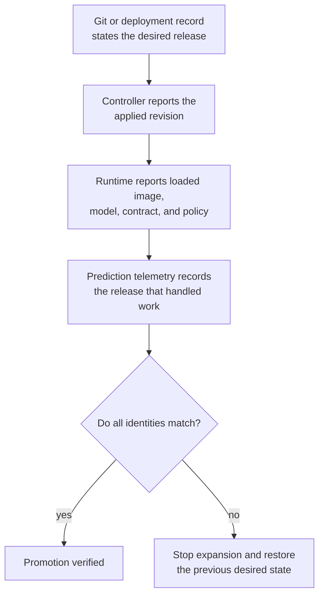

## Table of Contents

1. [What Artifact Promotion Means](#what-artifact-promotion-means)
2. [Give Every Release Candidate An Immutable Identity](#give-every-release-candidate-an-immutable-identity)
3. [Keep Test Results And Approvals Attached To The Candidate](#keep-test-results-and-approvals-attached-to-the-candidate)
4. [Use Registry Versions And Aliases To Show Release Status](#use-registry-versions-and-aliases-to-show-release-status)
5. [Keep Environment Settings Separate From The Artifact](#keep-environment-settings-separate-from-the-artifact)
6. [Record Who Approved The Release And For Which Use](#record-who-approved-the-release-and-for-which-use)
7. [Prevent Partial Or Conflicting Promotion Updates](#prevent-partial-or-conflicting-promotion-updates)
8. [Choose How The Approved Release Reaches Each Environment](#choose-how-the-approved-release-reaches-each-environment)
9. [Verify The Exact Release In Each Environment](#verify-the-exact-release-in-each-environment)
10. [How To Restore A Retained Release](#how-to-restore-a-retained-release)
11. [Keep Exceptions Narrow And Temporary](#keep-exceptions-narrow-and-temporary)
12. [The Main Idea](#the-main-idea)
13. [References](#references)

## What Artifact Promotion Means
<!-- section-summary: Artifact promotion authorizes one immutable, tested release candidate for use in a more controlled environment. -->

At a high level, **artifact promotion is the process of allowing one tested release candidate to move into a more controlled environment without changing what was tested**. The candidate might move from a development registry into staging, or from a staging-approved state into production. Its model bytes, serving image, preprocessing assets, contracts, and content digests remain fixed throughout that journey.

Suppose a classification model passes evaluation in staging. The team knows that model version `18`, container image digest `sha256:4c19...`, and request contract `v6` work together. Rebuilding the image for production could select a newer base image or dependency. Retraining could read newer data or produce different weights. Either action creates a different candidate, even if the file names and source commit look familiar.

Promotion preserves the candidate and changes the authority around it. A production identity gains permission to read the artifacts. A production release record points to their exact versions. An approval names the intended environment and use. The deployment controller then reconciles production toward that recorded state.

You can picture the candidate as a sealed package moving through checkpoints. Each checkpoint examines different evidence, while the package identity remains the same.


```mermaid
flowchart TD
    A["Training and build produce<br/>one release candidate"] --> B["Automated checks attach<br/>quality and security evidence"]
    B --> C["Staging loads the exact<br/>model and image digests"]
    C --> D["Approval grants a defined<br/>production scope"]
    D --> E["Production desired state pins<br/>the same candidate"]
    E --> F["Runtime verification proves<br/>what actually loaded"]

    class A create
    class B,C prove
    class D authorize
    class E,F operate
```

This is the **build-once promotion model**. Some organisations deliberately run training inside each environment because data residency, account isolation, or platform policy demands it. That production training run produces a new artifact with a new digest and provenance record. It starts another candidate lifecycle and belongs to the retraining path.

## Give Every Release Candidate An Immutable Identity
<!-- section-summary: A release manifest binds every deployable artifact and contract under one content-addressed candidate identity. -->

A model file rarely describes the complete thing that production will run. The model may depend on a tokenizer, label map, preprocessing code, Python packages, serving image, feature contract, and decision policy. If any of those parts changes, the system can produce different decisions from the same input.

The practical answer is a **release manifest**: a small immutable record that binds the exact parts tested together. Each large artifact keeps the identity provided by its own system. The container registry supplies an image digest. The model registry supplies a concrete model name and version. Git supplies a commit. The release manifest joins those identities and receives its own digest.

```yaml
release_id: claims-router-r47
model:
  registered_name: prod.ml_team.claims_router
  version: "18"
  logged_model_id: m-a7d41c
  artifact_sha256: 91d8...
runtime:
  image: ghcr.io/ml-platform/claims-api@sha256:4c19...
contracts:
  request_schema: claims-request/v6
  feature_set: claim-features/v12
  decision_policy: claims-policy/v9
evidence:
  model_evaluation: eval-8742
  compatibility: compat-2207
  vulnerability_scan: scan-6138
  provenance: attestation-94f1
rollback_release: claims-router-r42
```

The digest after `@sha256:` identifies the exact OCI image manifest. A human-readable tag such as `v47` can still point to that image, although the tag can move or be overwritten in many registries. Production therefore stores the digest.

The model version performs a similar role inside the model registry. MLflow 3 also gives each Logged Model a unique `model_id`, which connects a trained artifact to model-specific metrics and datasets. Registration adds a governed model version for lifecycle management. The release manifest can keep both identities because they answer different questions: which trained object produced the evidence, and which governed version may enter release management?

The bundle has one important boundary. Environment values such as replica count, credentials, production endpoint names, and regional storage paths live outside the artifact. The manifest pins the configuration contract and any behavior-changing policy, while the target environment supplies its own operational values. That separation allows the same candidate to run under different infrastructure without hiding a model change inside configuration.


```mermaid
flowchart TD
    R["Release manifest digest"] --> M["Model version and<br/>artifact digest"]
    R --> I["Serving image digest"]
    R --> C["Input, feature, and<br/>output contracts"]
    R --> P["Decision policy"]
    R --> E["Evidence references"]
    R --> B["Rollback release"]

    class R release
    class M,I,C,P,E,B part
```

Immutability means a change creates another identity. A corrected tokenizer, a patched image, or an altered threshold produces another release manifest. Reusing `claims-router-r47` after any of those changes would detach the approval and test evidence from the system that production receives.

## Keep Test Results And Approvals Attached To The Candidate
<!-- section-summary: Promotion evaluates several evidence types because provenance, security, model quality, and compatibility answer different risk questions. -->

A digest proves byte identity. It cannot explain who produced those bytes, whether the model performs well, whether the image contains a vulnerable library, or whether the target runtime can load the bundle. Promotion therefore consumes a set of evidence records linked to the exact release manifest.

### How To Record Where The Candidate Came From

**Provenance** records where an artifact came from and how it was produced. For a serving image, SLSA build provenance can identify the source repository, revision, build platform, and build process. For a model, useful lineage also includes the training run, code revision, training-data snapshot, feature definitions, and framework environment.

An attestation is a signed statement about an artifact. One attestation might state that a hosted CI workflow built an image from a particular commit. Another might attach a software bill of materials. The **software bill of materials (SBOM)** lists packages and components inside the artifact so a scanner or incident team can find exposure to a newly reported vulnerability.

OCI registries can associate signatures, SBOMs, and attestations with an image digest through the OCI referrers relationship. Sigstore Cosign can verify the signer identity and confirm that the signature payload names the same image digest:

```bash
cosign verify "$IMAGE_AT_DIGEST" \
  --certificate-identity "https://github.com/ml-platform/release/.github/workflows/build.yml@refs/heads/main" \
  --certificate-oidc-issuer "https://token.actions.githubusercontent.com"

cosign verify-attestation "$IMAGE_AT_DIGEST" \
  --certificate-identity "https://github.com/ml-platform/release/.github/workflows/build.yml@refs/heads/main" \
  --certificate-oidc-issuer "https://token.actions.githubusercontent.com"
```

The expected workflow identity matters as much as signature validity. A valid signature from an unrelated workflow should fail the policy. The release controller also checks the attestation subject digest, because a trusted workflow can produce many artifacts.

### How Tests Show Whether The Candidate Is Ready

Model-quality evidence identifies the evaluation dataset, label definition, and intended use. It records metrics against a baseline, then shows results for important segments and decision thresholds. A single `accuracy=0.94` tag lacks enough context for a release decision. Promotion needs the durable evaluation record that says which candidate achieved that value and under which protocol.

Compatibility evidence asks a different question: can the candidate operate inside the target release? A clean environment loads the model, validates its MLflow signature or equivalent input contract, runs fixed inference fixtures, and checks preprocessing plus output semantics. A model can pass predictive evaluation and still fail because production supplies a missing column or the serving image lacks a required native library.

Security evidence also has a time dimension. A vulnerability scan records findings against a particular database at a particular time. A candidate that passed last week can become affected after a new CVE appears. Teams using ECR with Amazon Inspector, Google Artifact Analysis, another managed scanner, or an organisation-wide scanner can re-evaluate the retained image digest before production promotion and continue scanning deployed images afterward.

The model artifact itself can carry executable risk. Python formats built on `pickle` or `cloudpickle` may execute code during deserialization, and custom MLflow Python models can package user code. Promotion therefore loads verified artifacts under an isolated validation identity with restricted network and data access. PyTorch's `weights_only=True` narrows its unpickling surface for compatible checkpoints, while the trusted-source rule still applies. Signature verification identifies the producer; artifact policy decides whether that producer and format are allowed.


```mermaid
flowchart TD
    A["Immutable release candidate"] --> P["Provenance<br/>Where did it come from?"]
    A --> S["Signature and SBOM<br/>Who produced it and what is inside?"]
    A --> Q["Model evaluation<br/>Is it suitable for this use?"]
    A --> C["Compatibility tests<br/>Can the target load and call it?"]
    A --> V["Vulnerability results<br/>Is current policy satisfied?"]
    P --> G["Promotion policy decision"]
    S --> G
    Q --> G
    C --> G
    V --> G

    class A subject
    class P,S,Q,C,V evidence
    class G decision
```

Each gate keeps its own meaning. A signature supports authenticity and integrity. It offers no claim about fairness or recall. A model evaluation supports the reviewed use case. It offers no inventory of operating-system packages. Promotion combines these records while preserving their separate owners and failure reasons.

## Use Registry Versions And Aliases To Show Release Status
<!-- section-summary: Registries store governed versions and useful movable labels, while release records pin the concrete version selected for an environment. -->

A model registry gives teams a governed place to find model versions, lineage, evidence, and lifecycle metadata. It also provides readable status labels such as `validation_status=passed` or aliases such as `candidate` and `champion`. These labels help people and automation communicate intent.

An **alias** is a movable name that points to one concrete version. It is useful for discovery: an evaluation job can ask for `candidate`, and a batch job can ask for `champion`. The movement is exactly why a production release cannot depend on resolving the alias during every process restart. If the alias changes after approval, two workers could load different versions under the same release name.

The release controller resolves the alias once and stores the concrete version in the manifest:

```python
from mlflow import MlflowClient

client = MlflowClient()
name = "prod.ml_team.claims_router"
candidate = client.get_model_version_by_alias(name, "candidate")

release_subject = {
    "registered_model": candidate.name,
    "model_version": candidate.version,
    "source_uri": candidate.source,
    "run_id": candidate.run_id,
}
```

MLflow Model Registry stages such as `Staging` and `Production` are deprecated. Current MLflow workflows use tags to describe status, aliases for movable references, and environment-specific registered models or access boundaries where that design fits. MLflow's `copy_model_version()` supports a simple cross-model promotion pattern. A release controller still needs to verify the resulting source identity and record the exact destination version.

Managed registries express the same responsibility with different objects. Amazon SageMaker AI groups model package versions and gives each version an approval status that can trigger delivery automation. Model Registry on Gemini Enterprise Agent Platform provides mutable version aliases. Azure Machine Learning registries share versioned models and environments across workspaces. Databricks Models in Unity Catalog adds governed names, permissions, lineage, audit, versions, and aliases across workspaces.

The registry status is useful evidence, while the **deployment record** remains the environment truth. `Approved` can mean eligible for production without proving that production currently runs the model. `Champion` can move without restarting an endpoint. Promotion reads the registry decision, pins a version, and writes the desired environment state through the deployment system.

Databricks MLflow 3 deployment jobs can connect evaluation, approval, and deployment around Unity Catalog models. The feature currently remains in Public Preview. Teams that require a settled production control plane can keep Lakeflow Jobs as the workflow runner, Git as the desired-state record, and their existing approval service as the authority while evaluating the preview workflow.

## Keep Environment Settings Separate From The Artifact
<!-- section-summary: Promotion reuses the same model and image while a reviewed environment record supplies infrastructure values, secrets, and deployment policy. -->

Staging and production usually differ. They may use separate accounts, identities, network boundaries, encryption keys, endpoint names, replica counts, and observability destinations. Trying to bake those values into separate artifacts forces a rebuild and destroys the identity link between the two environments.

The safer pattern keeps the candidate fixed and supplies environment configuration during deployment. GitOps repositories, managed deployment specifications, Helm or Kustomize overlays, and Terraform modules can all express this desired state. The record pins the candidate by digest and names the environment-specific values it needs:

```yaml
environment: production
release_id: claims-router-r47
image: ghcr.io/ml-platform/claims-api@sha256:4c19...
model:
  name: prod.ml_team.claims_router
  version: "18"
  artifact_sha256: 91d8...
runtime:
  service_account: claims-router-production
  replicas: 6
  feature_endpoint: https://features.internal/v12
  secret_refs:
    - claims-router-api-credentials
config_revision: git:7fd21b4
```

This file stores only secret references. The target platform resolves those references through its secret manager and workload identity. The production serving identity can read the approved model and required secrets. Training jobs and notebooks cannot overwrite the production artifact or alter the endpoint.

Configuration needs a behavioral boundary. Replica count, region, and telemetry destination can vary without changing the model's calculation.

Thresholds and fallback rules can alter which action follows a score. Label maps, feature definitions, and tokenizers can change the score itself. Those behavior-changing values belong in the release manifest or a pinned policy artifact, followed by the appropriate evaluation and approval.

Calling every value “environment configuration” would create an unreviewed path for changing model behavior.

GitOps makes the desired release reviewable. A pull request changes the production file from one immutable release ID to another. Argo CD or Flux compares the committed state with the live Kubernetes state and reconciles the difference. For managed endpoints, the same principle can use a provider deployment specification and a durable deployment event. Terraform or OpenTofu usually owns longer-lived infrastructure such as registries, IAM, networks, and endpoint resources; release automation then updates the versioned model and image fields through the smallest safe control surface.

## Record Who Approved The Release And For Which Use
<!-- section-summary: An approval authorizes one release manifest for a defined environment, use, rollout scope, and validity period. -->

An approval answers: who accepts the remaining risk of allowing this exact candidate into this exact environment? The answer needs a specific subject. A broad `approved=true` tag can survive after the model, image, policy, or intended use changes.

A durable approval record binds the approver to the release-manifest digest, destination environment, intended use, allowed traffic or batch scope, evidence set, validity period, and rollback release. The promotion controller compares those fields with the current request. Any subject mismatch stops the transition.

Automated rules and human approval solve different parts of the decision. Automation verifies reproducible facts: signatures, digests, required reports, policy thresholds, compatibility fixtures, and vulnerability status. A human reviewer evaluates residual risk, exceptions, use restrictions, and operational readiness. GitHub deployment environments, GitLab protected environments, cloud-native approval tasks, or an internal governance service can enforce the human checkpoint.


```mermaid
flowchart TD
    R["Promotion request names<br/>release digest and environment"] --> A["Automation verifies identity,<br/>evidence, and policy"]
    A -->|fail| X["Reject with a specific reason"]
    A -->|pass| H["Accountable reviewer examines<br/>scope and residual risk"]
    H -->|reject| X
    H -->|approve| D["Signed decision records subject,<br/>scope, owner, and expiry"]
    D --> P["Release controller may commit<br/>only the approved change"]

    class R request
    class A,H check
    class X stop
    class D,P allow
```

Approval scope matters in ordinary operations. Evidence for a nightly batch process may say little about a low-latency API. Approval for one region may depend on a particular data boundary. Approval for a five-percent canary grants less authority than a full rollout. The deployment system enforces that scope; a console click cannot silently widen it.

Signatures strengthen this design by authenticating the decision and its subject. Accountable review remains a separate control. The signed record proves which identity made a claim about a digest. Promotion policy decides whether that identity had authority and whether the claim satisfies the required gate.

## Prevent Partial Or Conflicting Promotion Updates
<!-- section-summary: Promotion advances through explicit states so partial copies, stale evidence, expired approvals, and concurrent releases cannot publish ambiguous desired state. -->

Promotion can fail halfway through. The model may reach production storage while its tokenizer does not, an approval may expire before deployment, or another release may reach production first. The controller therefore needs an all-or-nothing update: it commits the complete release transition or leaves the current release unchanged. This property is called **atomicity**.

Treating promotion as a state transition keeps those cases visible. The controller evaluates the source identity and evidence, obtains approval, prepares any destination copy, commits the desired-state reference atomically, and verifies reconciliation.


```mermaid
stateDiagram-v2
    [*] --> CandidatePinned
    CandidatePinned --> EvidenceAccepted
    EvidenceAccepted --> Authorized
    Authorized --> DestinationPrepared
    DestinationPrepared --> DesiredStateCommitted
    DesiredStateCommitted --> RuntimeVerified
    EvidenceAccepted --> Rejected
    Authorized --> Rejected
    DestinationPrepared --> Rejected
    DesiredStateCommitted --> RolledBack
    RuntimeVerified --> Revoked
```

Each transition stores its actor, input digest, policy version, evidence IDs, time, and result. The controller rechecks volatile evidence immediately before commitment. A security result that changed after approval can block the release without erasing the earlier decision history.

The desired-state update needs one atomic unit. Updating the model version, serving image, and decision policy in three independent operations can create a mixed release. A Git commit, versioned release document, or transactional deployment API gives the controller one subject to compare and reconcile.

Retries use an idempotency key derived from the release digest, destination, requested scope, and approval decision. Repeating the same request returns the same promotion record. Reusing that key for another digest fails. A compare-and-set check also records which environment release the request expects to replace. A concurrent promotion then produces a visible conflict and preserves the newer intent.

## Choose How The Approved Release Reaches Each Environment
<!-- section-summary: Teams can reference shared immutable artifacts or copy them into environment-owned storage, provided both patterns preserve identity and evidence. -->

Some platforms let every environment read one governed model registry and one OCI registry. Promotion changes permissions, a registry alias, or a deployment reference to the shared immutable artifact. This pattern reduces duplicate storage and keeps lineage direct. It fits environments that share a trusted control plane and can enforce narrow read access.

Other organisations isolate production in a separate cloud account, project, subscription, region, or network. Production may be unable to reach the development registry. Promotion then copies the exact artifact into an environment-owned store. The copy lands under a temporary immutable name, the target computes or verifies its digest, and the environment reference appears only after the complete bundle passes validation.

Managed services support variations of both patterns. SageMaker AI can share model package groups and the supporting ECR and S3 resources across accounts under explicit resource policies. Azure Machine Learning registries can share model and environment assets across workspaces. Unity Catalog can govern models across Databricks workspaces. A production copy may still be required for residency, encryption, retention, or independent recovery.

OCI registries are the common home for serving images. OCI Distribution is content-addressed and can also carry other artifact types plus referrers, so some teams package the release manifest, model bundle, SBOM, and attestations alongside the image. Registry support and managed-service integration vary, so a model registry plus object storage remains a sensible default for many teams. The architecture should preserve one digest chain without forcing every asset into one product.


```mermaid
flowchart TD
    A["Approved release manifest"] --> B{"Can production trust and<br/>read the shared registry?"}
    B -->|yes| C["Publish a production-owned<br/>reference to exact digests"]
    B -->|no| D["Copy bundle into temporary<br/>production-owned storage"]
    D --> E["Verify digest, inventory,<br/>encryption, and permissions"]
    E --> C
    C --> F["Commit desired environment state"]

    class A start
    class B choice
    class D,E work
    class C,F done
```

The two paths share the same invariant: production receives the candidate that passed review. A copy preserves the digest and provenance link. A reference resolves to immutable storage. A mutable `latest` tag, an engineer's local file, or a fresh training run cannot enter through the promotion path.

## Verify The Exact Release In Each Environment
<!-- section-summary: Promotion closes only after desired state, target storage, deployment control, and observed runtime all agree on the release identity. -->

A successful registry update or deployment API call proves that the control plane accepted a request. It gives no guarantee that production can read the model, every replica loaded it, or traffic reaches the intended release. Verification compares several independent views.

Before commitment, the controller verifies the source and destination digests, bundle inventory, signatures, attestations, model-quality record, compatibility result, target encryption, and access policy. It checks that the production serving identity can read the candidate while notebook and training identities cannot replace it. It also loads the retained rollback release through the same target path.

After commitment, the deployment record connects desired and observed state:

```json
{
  "deployment_id": "deploy-51b8",
  "environment": "production",
  "desired_release": "claims-router-r47",
  "desired_manifest_sha256": "7ef2...",
  "observed_image_sha256": "4c19...",
  "observed_model_version": "18",
  "observed_model_sha256": "91d8...",
  "config_revision": "git:7fd21b4",
  "controller_revision": "argocd:4f2a...",
  "verification": "passed"
}
```

The serving process should expose its release ID, model version, artifact digest, image digest, and policy version through a protected version endpoint or runtime metadata signal. Prediction events carry the same release ID so an operator can prove which system produced a decision. A fixed live fixture confirms that the endpoint accepts the expected input contract and returns a structurally valid result.


```mermaid
flowchart TD
    G["Git or deployment record<br/>states the desired release"] --> C["Controller reports the<br/>applied revision"]
    C --> R["Runtime reports loaded image,<br/>model, contract, and policy"]
    R --> T["Prediction telemetry records<br/>the release that handled work"]
    T --> Q{"Do all identities match?"}
    Q -->|yes| P["Promotion verified"]
    Q -->|no| S["Stop expansion and restore<br/>the previous desired state"]

    class G desired
    class C,R,T observed
    class Q choice
    class P pass
    class S fail
```

For a batch release, verification checks the job definition, model identity in worker logs, expected partition coverage, and output publication record. For an online endpoint, it checks ready replicas, loaded identities, request fixtures, and initial telemetry. Progressive traffic and delayed outcome evaluation add further evidence after this artifact-level handoff.

A mismatch has a concrete response. The controller freezes the release at its current scope, records the observed identities, and preserves the candidate for investigation. It can retry a missing copy, repair a permission error, or restore the prior desired-state commit. The approved artifact remains immutable throughout the repair.

## How To Restore A Retained Release
<!-- section-summary: Rollback restores a previously verified complete release and proves that the target environment loaded it again. -->

Promotion creates a recovery obligation. The previous release needs to remain complete throughout the declared rollback window. Its image and model bundle preserve executable bytes. Its configuration revision and contracts preserve behavior. Its evidence and access path keep the retained release verifiable and loadable. Old model weights alone can leave the team without a compatible runtime or feature path.

Rollback selects a previously verified release manifest and commits it as the new desired state. In a GitOps setup, that can be a reviewed revert or a new commit that pins the retained digests. Argo CD or Flux reconciles the cluster. A managed endpoint update performs the equivalent change through its deployment API. The team then repeats runtime identity and fixture checks until observed state matches the rollback release.

An alias move alone may leave existing workers untouched because they already loaded a concrete model version. Rollback therefore acts through the deployment controller and verifies the running processes. The registry alias can be updated afterward to communicate the restored lifecycle intent.

Compatibility determines whether rollback remains possible. A new release may introduce a request field, feature definition, or stored-output format that older code cannot consume. Additive schemas and versioned API routes can keep old consumers working. Dual-reading can preserve both feature shapes during migration. A tightly coupled producer change may need its own coordinated rollback. The release gate should exercise the chosen recovery path before production needs it.

If a newly disclosed vulnerability affects the previous image, returning to it may create a larger security risk than retaining the current model issue. The incident owner can choose a deterministic fallback, disable one route, or use a separate patched release. The release record makes those tradeoffs explicit because it identifies the complete candidate on each path.

## Keep Exceptions Narrow And Temporary
<!-- section-summary: An exception waives one named policy for one immutable release and scope while preserving identity, accountability, compensation, and expiry. -->

Real release systems need an exception path. A scanner may be unavailable during an urgent fix. A low-severity dependency finding may have no patch even though the affected package is unreachable in the serving process. Labels for one segment may mature after the business deadline.

A useful exception record starts with the exact release digest and failed policy. It identifies the evidence, owner, reason, target environment, and allowed scope. A compensating control limits exposure. Expiry and revocation conditions end the waiver.

The release still needs a valid artifact identity and provenance chain. Compatibility evidence, a deployment record, and a rollback target remain required. An exception changes one gate decision and grants no authority to replace the artifact later.

For example, a team may approve a release for one low-risk batch population while segment labels finish maturing. The deployment record enforces that population, predictions outside it use the retained release, monitoring watches the affected segment, and the exception expires automatically. Expanding the population requires the missing evidence and another approval.

Emergency rollback is another controlled exception. It can skip the normal progression schedule because the target is a retained, pre-verified release. The controller still records who invoked it, which release it restored, and whether runtime verification succeeded. This preserves incident speed and the evidence needed afterward.

Expired exceptions should fail closed for new promotions. Existing traffic needs an explicit policy: rollback, contain, obtain a renewed decision, or continue temporarily under incident authority. Silent renewal turns a narrow waiver into permanent hidden policy.

## The Main Idea
<!-- section-summary: Promotion preserves one tested candidate while evidence, authority, desired state, and runtime verification change around it. -->

Artifact promotion carries one immutable release candidate across an environment boundary. A release manifest joins the model, serving image, contracts, policy, evidence, and rollback target. Registries organize versions and lifecycle intent. Digests, signatures, attestations, SBOMs, quality results, and compatibility tests establish different parts of trust.

The destination supplies its own identities, secrets, infrastructure values, and access policy. A scoped approval authorizes the exact manifest. GitOps, infrastructure-as-code, or a managed deployment control plane commits the desired state. Deployment records and runtime telemetry then prove which release the environment actually received.

Build once, identify every part, authorize a precise scope, and verify observed state. Retraining or rebuilding produces another candidate and starts the evidence path again.

## References

- [MLflow 3 Tracking and Logged Models](https://mlflow.org/docs/latest/tracking)
- [MLflow Model Registry workflows](https://mlflow.org/docs/latest/ml/model-registry/workflow)
- [MLflow model signatures and input examples](https://mlflow.org/docs/latest/ml/model/signatures/)
- [PyTorch `torch.load` security guidance](https://docs.pytorch.org/docs/stable/generated/torch.load.html)
- [Databricks: manage model lifecycle in Unity Catalog](https://docs.databricks.com/aws/en/machine-learning/manage-model-lifecycle/)
- [Databricks MLflow 3 deployment jobs](https://docs.databricks.com/aws/en/mlflow/deployment-job)
- [Amazon SageMaker AI model approval status](https://docs.aws.amazon.com/sagemaker/latest/dg/model-registry-approve.html)
- [Amazon SageMaker AI cross-account model deployment](https://docs.aws.amazon.com/sagemaker/latest/dg/model-registry-deploy.html)
- [Model Registry on Gemini Enterprise Agent Platform: Model Version Aliases](https://docs.cloud.google.com/gemini-enterprise-agent-platform/machine-learning/model-registry/model-alias)
- [Google Cloud: Gemini Enterprise Agent Platform Name Changes](https://docs.cloud.google.com/gemini-enterprise-agent-platform/vertex-ai-name-changes)
- [Azure Machine Learning registries](https://learn.microsoft.com/en-us/azure/machine-learning/concept-machine-learning-registries-mlops?view=azureml-api-2)
- [OCI Distribution Specification](https://github.com/opencontainers/distribution-spec/blob/main/spec.md)
- [Sigstore Cosign signature verification](https://docs.sigstore.dev/cosign/verifying/verify/)
- [SLSA provenance](https://slsa.dev/spec/v1.2/provenance)
- [GitHub artifact attestations](https://docs.github.com/en/actions/how-tos/secure-your-work/use-artifact-attestations/use-artifact-attestations)
- [Argo CD overview](https://argo-cd.readthedocs.io/en/stable/)
- [Terraform plan workflow](https://developer.hashicorp.com/terraform/tutorials/cli/plan)
