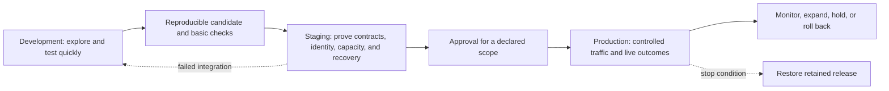
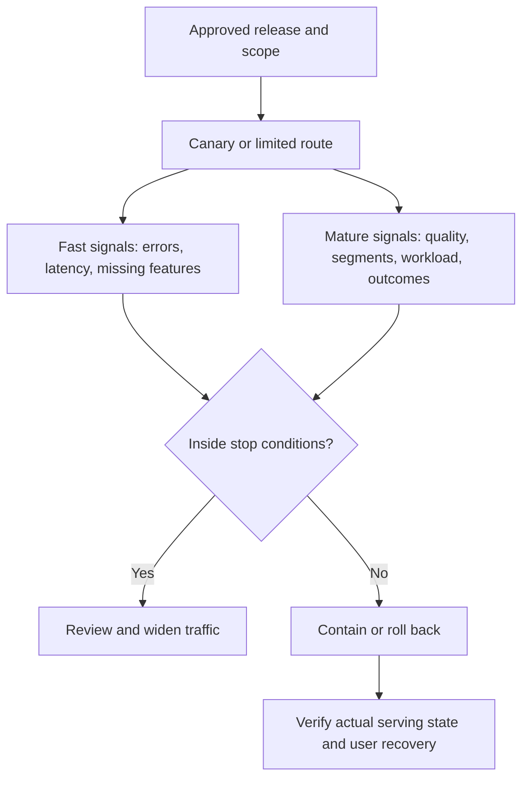

## ML Environments Separate Learning, Proof, and Customer Impact
<!-- section-summary: Development supports fast learning, staging proves production boundaries, and production applies controlled authority to real traffic. -->

An **environment** is a controlled combination of infrastructure, identity, data access, configuration, and deployment authority. Development, staging, and production environments let a team answer different questions before a model influences more consequential traffic.

- **Development** asks whether an idea, pipeline, or service works well enough to continue.
- **Staging** asks whether the exact release can integrate with production-like contracts and controls.
- **Production** asks whether the approved release remains safe and useful under real traffic.

The environments form a trust progression rather than three folders. Each one changes who may act, which data they may access, which evidence they must produce, and what harm a failure can cause. ML adds model artifacts, feature pipelines, delayed labels, large datasets, accelerators, and probabilistic behaviour to the usual software concerns.



Promotion should move one immutable release through this flow. Rebuilding the model separately in every environment weakens comparability because each build can use different data, packages, randomness, or hardware.

## Design Environments Around Boundaries
<!-- section-summary: Useful environments separate identities, data, infrastructure, configuration, and authority through controls the platform can enforce. -->

An environment name has value only when the system enforces its boundary. A staging bucket called `staging` offers little protection if development notebooks can overwrite it and production can read arbitrary experiment paths.

Five boundary types matter:

| Boundary | Development | Staging | Production |
|---|---|---|---|
| Identity | Individual and sandbox workload identities | CI/CD and test service identities | Narrow serving and operations identities |
| Data | Synthetic, sampled, or approved de-identified data | Controlled replay or masked production-like data | Live inputs and governed outcome data |
| Infrastructure | Flexible, smaller, disposable | Production-like topology and contracts | Resilient capacity and strict change control |
| Configuration | Fast iteration with safe defaults | Exact release candidate and production-shaped settings | Reviewed desired state and secret references |
| Authority | No customer decisions | Test-only or isolated shadow | Explicit traffic and action scope |

Separate cloud accounts or projects provide strong administrative and billing boundaries. Smaller teams can use namespaces, buckets, service accounts, encryption keys, and network policies. The correct design follows consequence and team size, while permissions still need to block unauthorized paths.

The production serving identity should read approved model artifacts and feature views without writing them. The training identity can create candidates without changing production routes. The release identity can update deployment state only after policy verifies evidence and approval. This separation reduces accidental and malicious changes.

## Use Development for Fast, Reproducible Feedback
<!-- section-summary: Development keeps iteration fast while preserving enough identity and repeatability for a useful candidate to enter review. -->

Development supports notebooks, local tests, sampled data, disposable jobs, and early service prototypes. Engineers should be able to change code and parameters quickly. Fast iteration still needs basic reproducibility: a code revision, configuration, environment lock or container, dataset reference, seed where relevant, and logged output.

The goal is to produce a candidate that another system can rebuild or load. A notebook cell state that exists only on one laptop cannot enter staging safely. Teams usually move reusable transformations and training logic into packages or jobs, then run unit tests, data-contract checks, and a small end-to-end fixture.

Development should use the least sensitive data that answers the question. Synthetic records can test schemas and error paths. Approved samples can expose realistic distributions. Access to raw production data should require a clear purpose, narrow identity, and audit trail rather than being the default convenience.

Cost controls also differ. Development jobs can use small datasets, short retention, lower quotas, and preemptible capacity where failure carries little consequence. Those choices should stay visible so a fast sandbox result is not confused with production capacity evidence.

## Use Staging to Prove Production Boundaries
<!-- section-summary: Staging runs the exact release against production-shaped contracts, identities, observability, traffic, and recovery procedures. -->

Staging provides **production-like** conditions for the boundaries that matter. It rarely needs a full copy of production scale or sensitive data. It needs the same request and response contracts, feature semantics, secret-delivery method, network path, telemetry fields, deployment controller, and rollback mechanism.

A staging replay can feed recorded or generated requests through the candidate and compare outputs with expected invariants. The test checks missing fields, old callers, large payloads, timeouts, fallbacks, and malformed values. It confirms that the service records release identity on every prediction event.

Load testing measures representative request sizes and concurrency, including warm-up and model-loading behaviour. It should test the capacity assumption behind the proposed canary. A tiny staging cluster can still reveal resource scaling and latency shape, though the report must state which production conclusions it cannot support.

Recovery testing is a first-class staging task. The team deploys the candidate, invokes the documented rollback or fallback, and verifies actual serving state. It also tests partial failure: one stale replica, unavailable feature data, expired credentials, or a monitoring sink outage. These cases reveal whether the controls fail safely.

Staging data creates privacy and leakage risk. A replay dataset should follow approved minimization, masking, access, and retention rules. Labels or outcomes that arrived after the original prediction time must remain separate when the test aims to reproduce online behaviour.

## Use Production for Controlled Learning
<!-- section-summary: Production applies a reviewed release to real traffic through limited exposure, complete telemetry, stop conditions, and accountable operations. -->

Production starts with an approved scope rather than immediate full traffic. The release may enter shadow mode, a canary, a single region, or a selected customer group. Routing must enforce the decision, and telemetry must distinguish production, candidate, shadow, and fallback outcomes.

Service health signals such as latency, errors, and saturation detect runtime failures quickly. Model and product signals track feature freshness, prediction distributions, decision rates, segment outcomes, human workload, and mature labels. Proxy signals support early detection; delayed outcomes confirm whether user value and harm changed.

Every rollout needs stop conditions with owners and a recovery target. A latency breach may roll traffic back immediately. A delayed quality regression may pause expansion while product and ML owners review enough labels. A privacy or security incident may revoke the release even when predictive metrics remain healthy.



The production environment keeps approval and deployment separate. A model can be approved for a ten-percent canary and deployed to production capacity while routing still caps its authority. Increasing traffic requires evidence from the current scope.

## Promote One Release, Not Three Rebuilds
<!-- section-summary: Build-once promotion keeps the model, runtime, contracts, and evidence consistent while environment-specific configuration stays outside the artifact. -->

The pipeline should build and identify one release, then promote that immutable unit. The release includes model digest, serving image digest, feature and API contracts, policy configuration, evaluation links, and rollback target. Environment-specific values such as endpoints, replica counts, and secret references belong in controlled configuration.

```yaml
release_id: no-show-risk-2026-07-17.1
model_version: "10"
model_sha256: 61a4...
serving_image: ghcr.io/metrocare/no-show@sha256:b812...
feature_contract: appointment-features/v5
decision_policy: reminder-policy/v3
evidence: eval-5521
approved_scope: pilot-clinics-10-percent
rollback_to: no-show-risk-2026-06-20.2
```

CI can build, test, scan, and publish this release. CD or GitOps changes the environment's desired release reference after gates pass. Argo CD or Flux can reconcile Kubernetes state from Git, while the model registry records model versions and evidence. The tools own different responsibilities; a registry alias alone should not bypass the deployment controller.

Environment configuration needs validation. The pipeline checks required keys, secret references, feature endpoints, policy versions, quotas, and schema compatibility. Secrets stay in a secret manager or workload-identity system rather than inside the manifest.

## Measure and Control Environment Drift
<!-- section-summary: Drift checks compare the production-shaped properties that staging tested with the properties production actually uses. -->

**Environment drift** is an unintended difference between environments or between declared and actual state. Some differences are expected: staging has less traffic and uses masked data. Dangerous differences affect the assumptions the release tested, such as another feature implementation, older image, missing network policy, different timeout, or unobserved secret-delivery path.

Teams should classify configuration as shared, environment-specific, or forbidden. Shared values include contract and policy versions. Environment-specific values include replica count and endpoint. Forbidden values include mutable image tags and plaintext credentials. Policy tests can enforce these categories before deployment.

Runtime reconciliation compares desired state with service metadata and recent events. It checks release identity, feature contract, routing percentage, telemetry coverage, and rollback readiness. A green deployment with one stale worker still fails release verification because users can reach mixed state.

Staging parity also has limits. Real traffic, user feedback, scale, dependencies, and rare data conditions cannot all be recreated. The release process should record those gaps and use canary evidence to address them, rather than claiming that staging proved every production outcome.

## Design a Data Strategy for Each Environment
<!-- section-summary: Environment data should provide enough realism for the test while minimizing sensitive access, leakage, retention, and accidental production effects. -->

ML environments need an explicit data strategy because realistic examples often contain customer, employee, financial, or health information. Copying a production database into staging creates broad access, long-lived replicas, and confusion about whether downstream actions are real. Using only random synthetic rows can miss the distributions and correlations that break model pipelines.

Teams usually combine several data types. Handwritten fixtures cover contracts and known edge cases. Generated data covers size, invalid values, and high load. Approved sampled or masked data provides realistic distributions. Recorded request replays test current integration. Each dataset should have a purpose, owner, access rule, retention period, and marker that prevents it from triggering production actions.

Masking direct identifiers may still leave sensitive information in free text, rare categories, timestamps, or linked fields. The data owner should assess re-identification and allowed use rather than assuming a transformed copy is safe. When staging reads live production features, the identity should remain read-only and the test should avoid writing predictions into production feedback tables.

Label timing also matters. A replay that evaluates prediction-time behaviour should reconstruct features as they existed then. Later outcomes can score the result after inference, while they should never enter the model input. This preserves the same time boundary used in offline evaluation.

Data freshness differs by question. Contract tests can use stable fixtures. Drift and integration tests need recent representative samples. Capacity tests need realistic payload shapes rather than real identities. Matching the dataset to the question reduces both risk and misleading confidence.

## Choose the Smallest Environment Structure That Enforces the Risk Boundary
<!-- section-summary: Teams can use fewer physical environments when tests and identities still separate experimentation, release proof, and customer authority. -->

Three named environments are common, though the underlying requirement is separation of trust and consequence. A small batch-scoring system may use local development, isolated CI jobs, and one production account with a shadow output table. A high-impact online service may need separate accounts, regional staging, pre-production traffic, and dedicated security boundaries.

Extra environments add cost and maintenance. They need patching, secrets, data, observability, and drift control. A neglected staging cluster can provide false confidence because it runs old dependencies and synthetic traffic no longer related to production. Teams should add an environment when it protects a distinct boundary or produces evidence unavailable elsewhere.

Ephemeral preview environments can test individual changes and disappear after review. Shared staging supports expensive integrations, capacity fixtures, and coordinated rollback drills. Production can include several logical rings or cells for progressive delivery. These designs still follow the same framework: declare the authority, pin the release, run the appropriate proof, and prevent test work from influencing unapproved users.

## Environments Form One Evidence Path
<!-- section-summary: Development creates a reproducible candidate, staging proves integration and recovery, and production tests user outcomes under controlled authority. -->

Development, staging, and production each own a distinct learning boundary. Development supports rapid exploration and creates traceable candidates. Staging proves the exact release against production-shaped contracts, identity, observability, and recovery. Production introduces real traffic through enforceable scope and measures the outcomes that earlier environments cannot reproduce.

One immutable release and a visible evidence chain connect them. Strong identity and data boundaries keep experiments away from customer systems. Promotion gates keep authority aligned with proof. Drift checks and runtime verification confirm that the system users reach still matches the release the team reviewed.

## References

- [MLflow Model Registry workflows](https://mlflow.org/docs/latest/ml/model-registry/workflow/)
- [GitHub Actions: Deployment environments](https://docs.github.com/en/actions/reference/workflows-and-actions/deployments-and-environments)
- [GitLab deployment safety](https://docs.gitlab.com/ci/environments/deployment_safety/)
- [Argo CD: Declarative GitOps CD for Kubernetes](https://argo-cd.readthedocs.io/en/stable/)
- [Flux documentation](https://fluxcd.io/flux/)
- [Kubernetes namespaces](https://kubernetes.io/docs/concepts/overview/working-with-objects/namespaces/)
