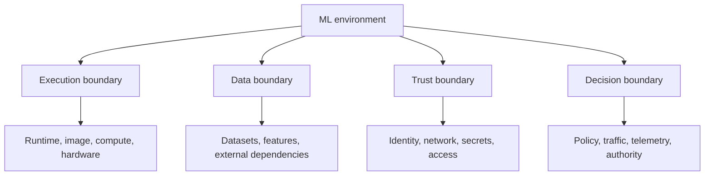
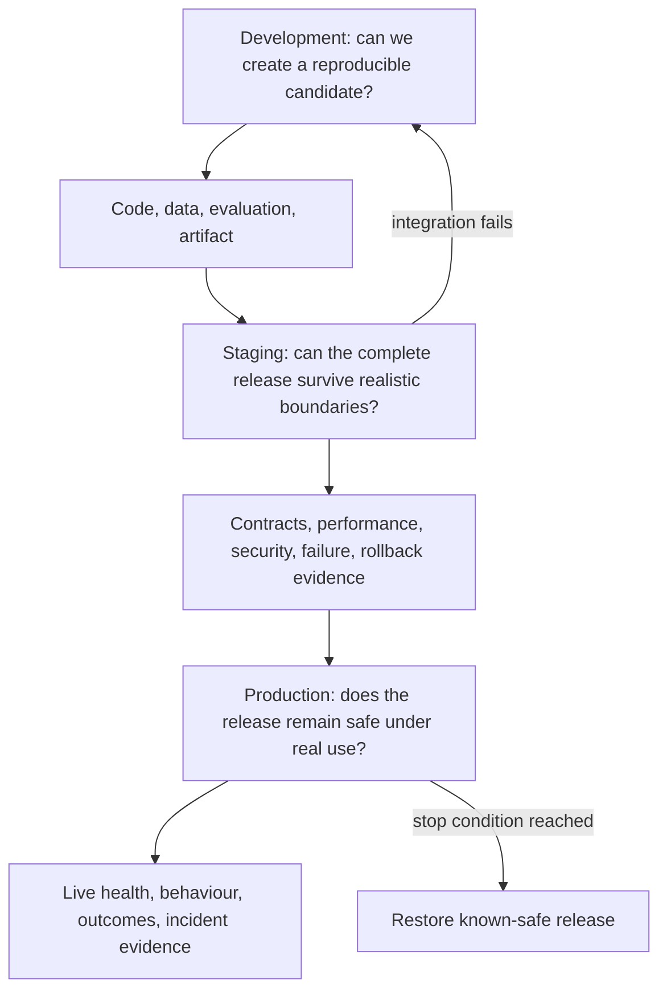
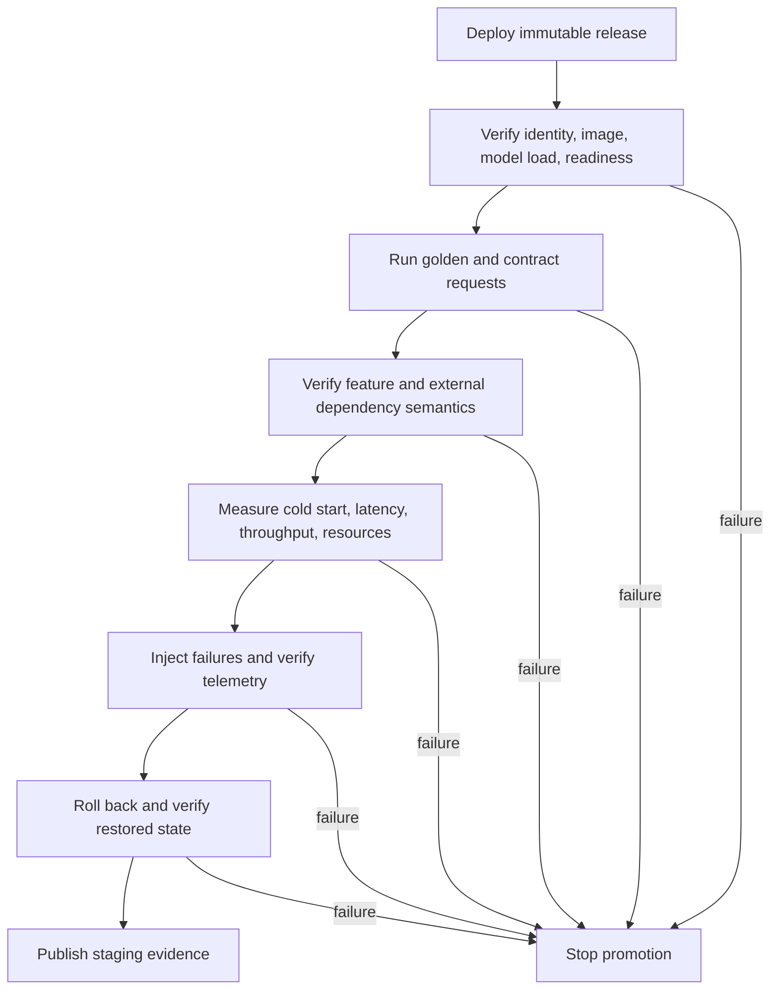
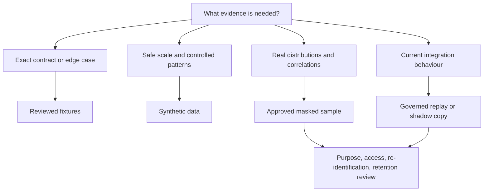

## Table of Contents

1. [An ML Environment Is a Controlled World](#an-ml-environment-is-a-controlled-world)
2. [Each Environment Answers a Different Question](#each-environment-answers-a-different-question)
3. [Parity Preserves the Boundaries That Matter](#parity-preserves-the-boundaries-that-matter)
4. [Promote One Release and Supply Environment Configuration](#promote-one-release-and-supply-environment-configuration)
5. [Enforce Identity, Network, Secret, and Dependency Boundaries](#enforce-identity-network-secret-and-dependency-boundaries)
6. [Development Optimises the Learning Loop](#development-optimises-the-learning-loop)
7. [Staging Proves the Complete Release](#staging-proves-the-complete-release)
8. [Give Every Environment a Deliberate Data Strategy](#give-every-environment-a-deliberate-data-strategy)
9. [Production Governs Real Decisions](#production-governs-real-decisions)
10. [Promotion Moves Evidence With the Release](#promotion-moves-evidence-with-the-release)
11. [Detect Environment Drift and Verify Reality](#detect-environment-drift-and-verify-reality)
12. [Test Rollback Across the Same Boundaries](#test-rollback-across-the-same-boundaries)
13. [Choose Boundaries According to Consequence](#choose-boundaries-according-to-consequence)
14. [The Main Idea](#the-main-idea)
15. [References](#references)

## An ML Environment Is a Controlled World
<!-- section-summary: An ML environment combines infrastructure, data, identity, dependencies, policy, and authority around a model workload. -->

At a high level, an **environment** is the controlled world in which an ML workload runs. Compute is one part of that world. The environment also determines which data the workload can read, which identity it uses, which feature source it calls, where secrets come from, which network paths are open, which policy values apply, and whether its outputs can affect real users.

This wider meaning matters because the same model code can behave differently across environments. A prediction service might run correctly on a developer laptop with a local CSV, then fail in staging because its workload identity cannot read the model registry. It might pass staging and still make poor production decisions because the live feature source measures account age in a different unit. The process stays alive in all three places, while the meaning and authority of its work change.

Traditional applications also need environments. ML adds variation from the data snapshot and the artifact learned from it. Feature pipelines and delayed labels introduce time-dependent behaviour. Numerical libraries and accelerators can change runtime results, while decision thresholds change how predictions affect the product. An environment design has to control these dependencies without making experimentation painfully slow.


```mermaid
flowchart TB
    A["ML environment"] --> B["Execution boundary"]
    A --> C["Data boundary"]
    A --> D["Trust boundary"]
    A --> E["Decision boundary"]

    B --> B1["Runtime, image, compute, hardware"]
    C --> C1["Datasets, features, external dependencies"]
    D --> D1["Identity, network, secrets, access"]
    E --> E1["Policy, traffic, telemetry, authority"]
```

You can think of development, staging, and production as three controlled worlds with different purposes. Development gives people room to learn. Staging gives the release a realistic exam. Production gives an approved release limited authority over real decisions.

## Each Environment Answers a Different Question
<!-- section-summary: Development tests ideas, staging tests the complete release, and production tests real-world operation under governed authority. -->

Environment design starts with the question each world must answer. A name such as `staging` has little value unless its access, infrastructure, and tests support a distinct kind of proof.

### Development asks whether the idea deserves more investment

Development supports exploration, debugging, feature work, training experiments, and early service integration. Feedback speed matters. Engineers may use notebooks, local containers, short-lived cloud jobs, sampled datasets, or disposable endpoints.

The output of development is a reproducible candidate. It carries no customer-facing authority. A useful candidate records its code revision and parameters, then links them to the data reference and dependency environment. Its evaluation travels with the resulting model artifact. That evidence lets another person or automated system load the candidate without relying on a notebook's hidden state.

For example, an engineer testing a new text classifier can begin with a small approved sample and a CPU runtime. The early question concerns tokenisation, label quality, and basic predictive value. Production-scale GPU throughput can wait until the idea has enough evidence to justify a more expensive test.

### Staging asks whether the exact release works as a system

Staging tests the packaged release across production-shaped boundaries. It loads the exact model and image, validates supported caller contracts, reaches a controlled feature source, uses a staging workload identity, emits production-format telemetry, and exercises deployment and rollback automation.

The goal is confidence in integration and operation. Staging asks whether a cold replica can load the model, whether a request reaches the correct preprocessing path, whether a secret is delivered through the intended mechanism, and whether a feature timeout produces the approved fallback. It also tests performance on representative hardware and payloads.

Staging carries no authority over real product decisions. A copied request can exercise the candidate while writes and notifications remain isolated. This separation lets teams create realistic failures without harming users.

### Production asks whether the approved release remains safe in reality

Production serves real traffic or publishes outputs consumed by real processes. It introduces traffic through an approved scope and watches the combined service, data, prediction, and product evidence. Production also supplies conditions that staging cannot fully reproduce: rare inputs, real dependency contention, shifting user behaviour, and delayed outcomes.

The environment therefore enforces stronger change control, access, retention, incident ownership, and recovery objectives. A model can be deployed at production capacity while routing still limits it to a shadow or canary. Deployment presence and decision authority are separate controls.


```mermaid
flowchart TB
    D["Development: can we create a reproducible candidate?"] --> E1["Code, data, evaluation, artifact"]
    E1 --> S["Staging: can the complete release survive realistic boundaries?"]
    S --> E2["Contracts, performance, security, failure, rollback evidence"]
    E2 --> P["Production: does the release remain safe under real use?"]
    P --> E3["Live health, behaviour, outcomes, incident evidence"]
    S -->|"integration fails"| D
    P -->|"stop condition reached"| R["Restore known-safe release"]
```

## Parity Preserves the Boundaries That Matter
<!-- section-summary: Environment parity keeps behaviourally important interfaces equivalent while allowing intentional differences in scale, data, and cost. -->

**Environment parity** means preserving the assumptions that a release depends on as it moves toward production. Three identical copies of every resource are unnecessary. Full duplication can be expensive and risky, especially for large datasets and accelerator fleets.

The useful question is: which differences could invalidate the evidence collected earlier?

### Keep semantic interfaces equivalent

The request and response contract should have the same meaning in staging and production. Feature definitions should use the same transformation logic, units, missing-value policy, and freshness rules. The release should load through the same artifact path and run the same preprocessing. Telemetry should carry the same field names and release identifiers.

The underlying resources can differ. Staging may call an isolated feature table populated with controlled records, while production calls the live feature table. The table contents and scale differ; the schema and feature semantics stay aligned.

### Match hardware where hardware can change behaviour

A small CPU staging service may be enough for contract tests. It cannot prove GPU memory use, kernel compatibility, numerical tolerance, model warm-up, or accelerator throughput. If production depends on a GPU or specialised inference chip, at least one pre-production test should use that hardware family and the same runtime image.

Scale can stay smaller while preserving the shape of the test. A two-replica staging endpoint can verify health checks, load balancing, rolling replacement, and scale-out triggers. Capacity modelling then combines measured per-replica behaviour with production traffic assumptions. The evidence should state where extrapolation begins.

### Keep intentional differences visible

Every environment will have legitimate differences. Development may use short retention and low quotas. Staging may use masked data and a disabled notification sink. Production may use private networking, multi-zone capacity, longer evidence retention, and stricter policy approval.

Documenting these differences prevents accidental drift from hiding among approved variation. A practical classification gives each setting one of three meanings: shared release behaviour, environment-specific value, or forbidden override. Contract versions belong to shared behaviour. Replica counts are usually environment-specific. Mutable image tags and plaintext credentials should be forbidden everywhere.

## Promote One Release and Supply Environment Configuration
<!-- section-summary: Build-once promotion preserves the tested artifact while controlled configuration connects it to each environment. -->

The strongest promotion path builds the model and serving package once, gives them immutable identities, and moves those identities through the environments. Rebuilding in staging or production can change dependency resolution, source inputs, compiler output, random state, or artifact bytes. The new build lacks the evidence attached to the earlier one.

The immutable release usually includes the model digest or registry version, serving image digest, preprocessing code, dependency lock, service contract, feature contract, and policy package. The environment supplies deployment values such as endpoint name, replica count, region, network attachment, feature-source address, secret references, and telemetry destination.

A compact desired-state record can keep that separation visible:

```yaml
release:
  id: risk-api-r42
  model: models:/risk-classifier/18
  image: registry.example/ml/risk-api@sha256:4f8c...
  contract: risk-request-v3
  policy: review-policy-v12
environment:
  name: staging
  replicas: 2
  feature_source: account-risk-staging
  secret_ref: risk-api-staging
```

Promotion changes `environment.name` and approved environment references while keeping the release block fixed. A policy check can reject an unknown model digest, an environment-specific contract override, or a production secret reference in staging.

Managed ML platforms express this pattern through model resources, deployment resources, and endpoints. Kubernetes teams commonly keep a shared Deployment or KServe base and apply small environment overlays through Helm or Kustomize. Argo CD and Flux reconcile declared state into clusters. The implementation differs, while the release/configuration boundary remains the same.

Secrets receive special treatment. The configuration stores a secret reference. The environment's workload identity gains permission to resolve that reference. The credential value stays out of Git, container layers, model metadata, and deployment logs.

## Enforce Identity, Network, Secret, and Dependency Boundaries
<!-- section-summary: Real environment separation comes from access and connectivity controls that prevent lower-trust work from gaining production authority. -->

A folder name or deployment label cannot create a trust boundary by itself. The platform must enforce who can deploy, which data a workload can read, where it can connect, and which actions it can perform.

### Separate human, automation, training, and serving identities

People, CI/CD, training jobs, and prediction services have different responsibilities. Individual developers need access to development resources. A training identity can write candidate artifacts while lacking permission to change production routing. A release identity can update approved deployment resources after gates pass. A production serving identity usually reads a specific model and feature source while holding no registry-write permission.

Cloud workload identity and short-lived credentials are the current default pattern. Kubernetes ServiceAccounts provide non-human identities inside a cluster and connect to RBAC or cloud identity federation. Each workload should receive its own ServiceAccount and the minimum required permissions. Assigning every Pod to a powerful shared identity collapses the environment boundary.

### Control inbound and outbound network paths

Production endpoints may need private ingress from internal callers. Serving workloads usually read from a model store and a feature source. They send operational signals to a telemetry collector and may call a small set of approved APIs. Staging should exercise an equivalent connectivity path using staging resources, since open internet access can hide missing private DNS, firewall, or certificate configuration.

Managed platforms expose these controls through project or workspace networking. Azure Machine Learning managed online endpoints can use private endpoints for inbound requests and managed virtual networks for outbound access. Vertex AI offers private endpoint options. Kubernetes uses NetworkPolicy for Pod traffic, provided the installed network implementation enforces that API.

Namespaces organise namespaced Kubernetes resources and work well with RBAC, quotas, and network policies. A namespace alone leaves cluster-scoped resources and shared control-plane concerns outside its boundary. Separate clusters, cloud accounts, projects, or subscriptions offer stronger isolation for high-consequence production systems.

### Resolve secrets inside the destination environment

Development, staging, and production should use separate secret identities and values. A staging workload must never gain a production database credential through a shared name. Secret stores, managed identities, and environment-scoped CI secrets restrict access to the destination that needs them.

Kubernetes Secrets require additional protection. Official guidance calls for encryption at rest, least-privilege RBAC, restricted Pod access, and consideration of an external secret-store provider. Databricks Model Serving supports secret-backed environment variables; credentials belong in Databricks secrets instead of plain environment values.

### Treat external dependencies as part of the environment

Data dependencies include feature stores, databases, and object stores. Queues and model APIs shape request timing. Notification services can create external side effects, and telemetry backends determine which failures operators can see. Development can use local substitutes for early logic tests. Staging needs contract-compatible sandboxes or isolated instances for the dependencies that affect release evidence. Production uses governed live services with defined timeout and fallback behaviour.

A useful dependency record names the destination, contract version, identity, timeout, retry policy, and failure action. It also states whether staging uses the same service, an isolated tenant, or a validated substitute.

## Development Optimises the Learning Loop
<!-- section-summary: Development gives practitioners fast feedback while retaining enough reproducibility and data discipline to create a trustworthy candidate. -->

Development should make common experiments cheap and fast. A practitioner can inspect data, alter features, train short runs, and debug prediction code without waiting for production deployment controls. Freedom still needs boundaries so an experiment can mature into a credible candidate.

### Use the smallest realistic setup for the current question

A unit test can use five handwritten rows. A preprocessing investigation may need a representative sample. A distributed-training change may need a short remote job on the target accelerator. Matching the tool to the question saves time and cost while preserving useful evidence.

Local development commonly uses Python environments managed by `uv` or Poetry, Docker for runtime parity, and MLflow or Weights & Biases for experiment tracking. Remote jobs on SageMaker AI, Vertex AI, Azure Machine Learning, or Databricks provide managed compute for larger tests. The candidate records the code, parameters, data reference, environment, and output regardless of where the experiment runs.

### Remove hidden state before candidate review

Notebook exploration is valuable, yet execution order and local variables can hide dependencies. Reusable transformations should move into versioned code, and a clean process should run the training or prediction path from declared inputs. Dependency locks or container images preserve the runtime.

Suppose a model works only after an engineer manually downloads a tokenizer into a home directory. A clean-room test exposes that hidden dependency. The fix can package the tokenizer, pin an immutable artifact reference, or add an authenticated startup fetch with a readiness check.

### Keep development authority narrow

Development endpoints use sandbox callers and isolated outputs. Email, payment, case-management, and notification integrations should point to test sinks. Resource quotas limit accidental cost, especially for GPU jobs. Short retention can clear temporary artifacts, while candidates entering review move to a governed registry with durable evidence.

Development telemetry can use the same OpenTelemetry signal names as production and route them to a separate backend or environment partition. This gives engineers realistic instrumentation without mixing experiments into production alerts.

## Staging Proves the Complete Release
<!-- section-summary: Staging tests the immutable candidate across production-shaped data, runtime, security, dependency, telemetry, and recovery boundaries. -->

Staging is the first place where the complete release should operate as one system. The same model, image, contracts, and policy package proposed for production run through the destination deployment mechanism. The environment supplies staging identities, data, endpoints, scale, and secret references.

### Begin with deployment and loading proof

Deploy through the same controller used for production. A managed-endpoint team creates or updates a staging endpoint through its SDK, CLI, or infrastructure code. A Kubernetes team lets Argo CD or Flux reconcile the staging overlay. The release then proves that its image pulls, identity resolves, model loads, readiness passes, and expected release ID appears in the platform state.

A health check that only opens a TCP port gives weak evidence. Readiness should depend on model loading and every critical local asset. External dependency failures may remove a replica from traffic or trigger a product fallback according to the service design.

### Exercise the boundaries in a deliberate order

Start with golden requests that verify preprocessing and prediction equivalence. Add contract tests for current and older supported callers. Check feature version, freshness, units, and missing-value handling. Confirm workload permissions and network routes. Then test cold start, warm latency, throughput, memory, accelerator use, autoscaling behaviour, and cost assumptions.

Failure tests complete the proof. Make the feature source slow, rotate a secret, remove an optional dependency, send an oversized request, and restart a replica during load. Verify the returned error or fallback and confirm that traces, metrics, and logs identify the release and failed boundary.


```mermaid
flowchart TB
    A["Deploy immutable release"] --> B["Verify identity, image, model load, readiness"]
    B --> C["Run golden and contract requests"]
    C --> D["Verify feature and external dependency semantics"]
    D --> E["Measure cold start, latency, throughput, resources"]
    E --> F["Inject failures and verify telemetry"]
    F --> G["Roll back and verify restored state"]
    G --> H["Publish staging evidence"]

    B -->|"failure"| X["Stop promotion"]
    C -->|"failure"| X
    D -->|"failure"| X
    E -->|"failure"| X
    F -->|"failure"| X
    G -->|"failure"| X
```

### State the limits of staging evidence

A smaller endpoint can validate request shape and scaling mechanics. It may provide weak evidence for full production throughput. Masked records can preserve many distributions while changing rare-category relationships. A sandbox dependency can confirm API compatibility while missing production contention.

The staging report should state these gaps. Production canary gates then collect the missing evidence under controlled exposure. Honest limits create a stronger release decision than a vague claim of “production-like” testing.

## Give Every Environment a Deliberate Data Strategy
<!-- section-summary: Fixtures, synthetic records, protected samples, and request replays answer different test questions and carry different privacy risks. -->

ML tests need realistic data because schema validity alone misses distributional behaviour. Real records may be sparse, correlated, or heavily skewed. Rare cases form a long tail, and labels may arrive well after prediction time. Privacy and leakage risk grow with realism. Replayed records can also trigger real side effects if isolation fails. The right data source depends on the question being tested.

### Fixtures make contracts and edge cases repeatable

A fixture is a small, reviewed dataset with known meaning. Teams write fixtures for required fields, missing values, boundary values, unsupported categories, and expected predictions. They are easy to keep in version control after sensitive fields are removed and the content is approved.

Fixtures excel at regression tests and failure paths. They provide little evidence about production distributions or capacity. Their value comes from precise intent instead of realism at scale.

### Synthetic data creates safe volume and controlled cases

Synthetic generators create records from rules or learned distributions. Rule-based data can produce millions of requests with chosen payload sizes and error rates for load tests. More advanced generators can preserve statistical relationships.

Synthetic data can still mislead. A generator built from incomplete assumptions reproduces those assumptions. A generator trained on sensitive records may leak rare examples or preserve re-identification risk. Teams should validate synthetic distributions and govern the source data and generation process.

### Masked samples preserve selected production characteristics

An approved sample from production can expose real categories, missingness, and correlations. De-identification may use redaction, masking, tokenisation, date shifting, or generalisation. Google Cloud Sensitive Data Protection is one managed implementation of these techniques; equivalent cloud and enterprise tools exist.

Removing names and email addresses is insufficient for many datasets. Free text, exact timestamps, rare diagnoses, location combinations, and linked identifiers can reveal a person. The data owner should review re-identification risk, purpose, access, encryption, retention, and deletion before the copy enters a lower environment.

### Replays test current integration behaviour

A replay sends recorded request shapes through a candidate. Shadow traffic can produce matched candidate and baseline outputs without using the candidate response. Replays are useful for contract compatibility, performance, feature retrieval, and prediction comparison.

Side effects must stay isolated. A replayed transaction should never charge an account, send a message, update a customer record, or enter a production feedback table. Sensitive payload fields can be removed or tokenised before storage, and retention can be limited to the evidence window.

Time leakage deserves special attention. A historical replay should reconstruct features available at the original decision time. Labels and later events can score the prediction after inference, while the candidate input remains limited to information available then.


```mermaid
flowchart TB
    Q["What evidence is needed?"] --> A["Exact contract or edge case"]
    Q --> B["Safe scale and controlled patterns"]
    Q --> C["Real distributions and correlations"]
    Q --> D["Current integration behaviour"]
    A --> A1["Reviewed fixtures"]
    B --> B1["Synthetic data"]
    C --> C1["Approved masked sample"]
    D --> D1["Governed replay or shadow copy"]
    C1 --> G["Purpose, access, re-identification, retention review"]
    D1 --> G
```

## Production Governs Real Decisions
<!-- section-summary: Production combines limited release authority with resilient capacity, live dependencies, complete telemetry, and accountable incident response. -->

Production is the environment where model outputs influence users, operations, or regulated processes. Its controls should match that consequence. Stronger identity, networking, change approval, retention, resilience, and incident ownership are common because a mistake can affect real decisions.

### Separate deployment from traffic authority

A candidate can exist in production with zero decision traffic. Shadowing copies requests while the baseline response controls the product. A canary sends a bounded share to the candidate. Blue-green deployment keeps current and candidate fleets available during the switch.

Managed endpoint platforms provide current industrial implementations. SageMaker AI deployment guardrails support blue-green canary and linear traffic shifting with CloudWatch alarms and automatic rollback. Vertex AI endpoints can route percentages among deployed models. Azure Machine Learning managed online endpoints support multiple deployments, traffic allocation, and mirroring. Databricks Model Serving endpoints can divide traffic among served entities.

These controls move traffic; the team defines the evidence. A rollout gate can combine latency, errors, feature freshness, prediction rates, segment coverage, and immediate product signals. Delayed labels may extend the observation window for higher-risk decisions.

### Keep production capacity and dependencies explicit

Production configuration declares minimum and maximum replicas, instance or accelerator type, request limits, autoscaling signals, timeout budgets, and regional placement. Every dependency has an owner and failure action. The model service may fail closed, return a retryable error, use a safe rule, or route work for manual review.

The exact response follows product risk. A delayed recommendation may tolerate a cached result. A safety decision may require a hard stop. Environment configuration can select destination addresses and capacity, while the fallback policy stays versioned with the release.

### Attach telemetry to environment and release identity

OpenTelemetry resources describe the entity producing signals. The stable semantic attribute `deployment.environment.name` can distinguish development, staging, and production. Service name, release ID, model version, and policy version allow dashboards to separate candidate, baseline, and fallback behaviour.

Production access to raw telemetry should follow data governance. Metrics use bounded dimensions. Traces and logs may carry request-level identifiers under approved access and retention. Raw features and outputs require a clear diagnostic or monitoring purpose.

## Promotion Moves Evidence With the Release
<!-- section-summary: Promotion grants a tested release more authority after its evidence satisfies the destination environment's entry conditions. -->

**Promotion** means granting an existing release access to a higher-consequence environment. The release stays fixed. The destination evaluates evidence and supplies its own configuration, identity, and authority.

Development evidence usually covers reproducibility, unit tests, data checks, offline evaluation, model signature, dependency lock, and basic security scanning. Staging adds deployment proof, contract compatibility, feature parity, representative performance, failure behaviour, telemetry, security boundaries, and rollback. Production expansion adds live canary evidence and product outcomes.

CI/CD platforms can enforce destination gates. GitHub Actions environments support required reviewers, branch restrictions, environment secrets, wait timers, and custom protection rules. GitLab protected environments restrict deployment authority and can require approvals. Cloud deployment pipelines and internal release systems provide equivalent controls.

A focused GitHub Actions job can bind deployment to the protected production environment:

```yaml
deploy-production:
  needs: verify-staging
  environment: production
  concurrency: ml-production
  permissions:
    contents: read
    id-token: write
  steps:
    - run: ./deploy-release "$RELEASE_ID" production
```

The `environment` applies configured protection rules before the job starts. `concurrency` prevents overlapping production deployments in the same group. OIDC-based identity can exchange the short-lived job identity for limited cloud access, avoiding a stored long-lived cloud key.

Approval should name the scope being granted. A reviewer might approve shadow execution, a 5% canary, or full batch publication. Each scope has its own stop conditions and required evidence. Recording the approver, release ID, evidence links, and traffic scope creates a durable decision trail.

## Detect Environment Drift and Verify Reality
<!-- section-summary: Drift control compares declared and actual state so staging evidence continues to describe the production system users reach. -->

**Environment drift** is an unintended difference between the expected environment and the system that actually runs. Some drift changes infrastructure, such as a manually edited timeout or an older image on one replica. Other drift changes meaning, such as a different feature transformation, policy version, or external endpoint.

### Compare desired state with observed state

Infrastructure as code declares networks, identities, storage, and managed endpoints. GitOps controllers such as Argo CD and Flux reconcile Kubernetes resources. Policy engines reject forbidden overrides. These controls reduce manual variation, while runtime verification confirms the result.

After deployment, query the platform for the active model, image digest, replica state, traffic allocation, identity, and endpoint configuration. Send a smoke request and verify the release ID in its response or telemetry. Confirm that every healthy replica reports the same release. A successful deployment command is an intent signal; observed serving state is the proof.

### Compare environments at semantic boundaries

Raw text diffs produce noise because replica counts, URLs, and secret references are expected to differ. A useful parity check compares shared contracts and classified configuration. It confirms matching model and image identities, feature and policy versions, request schemas, telemetry fields, and deployment behaviour. It separately validates approved differences such as capacity and destination names.

### Recognise common failure patterns

Configuration copied by hand often leaves staging on an old timeout or feature version. Mutable image tags can resolve to different bytes across environments. Shared credentials give development unexpected production access. A staging endpoint with open networking can pass while production private DNS fails. Tests built only from clean synthetic rows miss nulls and rare categories. A rollback artifact can expire even though its registry record remains.

Each failure points to a concrete control: immutable digests, typed configuration, workload identity, production-shaped network tests, representative data, retained recovery artifacts, and post-deployment verification. Drift monitoring should alert on differences that invalidate release evidence, instead of alerting on every approved environment variation.

## Test Rollback Across the Same Boundaries
<!-- section-summary: A rollback drill proves that the previous release can still start, connect, receive traffic, and serve current callers in the destination environment. -->

A rollback record is only a plan until the destination environment proves it. The previous release may have lost registry access, feature compatibility, secret permission, deployment capacity, or caller support. Staging should deploy the candidate, move to the previous release through the real recovery mechanism, and verify the restored path.

The drill checks model and image availability first. It then verifies current request contracts, feature sources, policy references, network routes, workload identity, and telemetry. A smoke request should reach every active replica, and the platform should report the intended traffic state.

Production recovery may use a retained managed-endpoint deployment, a Kubernetes rollout revision, a GitOps revert, or a complete fallback path. SageMaker AI can connect CloudWatch alarms to automatic rollback during supported deployment guardrails. Kubernetes Deployment history can restore a prior Pod template, while teams still need to confirm that external model and configuration references remain compatible.

Rollback cannot reverse decisions already consumed. A corrected batch may need a new output version. A declined request may need review. A notification may require follow-up. The incident plan connects affected decision IDs to correction steps and keeps the evidence needed to explain the event.

## Choose Boundaries According to Consequence
<!-- section-summary: Physical environment structure should be strong enough to isolate risk without creating neglected replicas of the platform. -->

Three environment names are common, and each can use a different physical scale. A small offline scorer may use local development and isolated CI validation, followed by one production account with versioned output paths. A high-impact online service may use separate cloud accounts or projects. Its production design can add dedicated networking, a representative staging endpoint, and several rollout cells.

Shared clusters can use namespaces and dedicated ServiceAccounts as the starting structure. RBAC and admission policy control authority. Quotas protect shared capacity, while NetworkPolicy and secret isolation limit connectivity and credential exposure. Separate clusters reduce shared control-plane and node risk. Separate cloud accounts, projects, or subscriptions add stronger IAM and administrative boundaries, plus independent billing controls. The appropriate choice follows data sensitivity, regulatory obligations, availability goals, team size, and incident blast radius.

Extra environments also create work. Their software needs patching, and their data needs an intentional refresh process. Teams must operate separate secrets and telemetry, then control cost and drift over time. A neglected staging system running old dependencies can create false confidence. Add an environment where it protects a distinct trust boundary or produces evidence unavailable from a cheaper ephemeral test.

Ephemeral preview environments work well for change-specific contract and UI tests. Shared staging supports expensive dependencies, representative hardware, and rollback drills. Production rings or cells support progressive exposure. The labels can vary; the three questions remain: can the team learn quickly, can the complete release pass realistic proof, and can real decision authority stay governed?

## The Main Idea
<!-- section-summary: Development, staging, and production separate learning, production-like proof, and real decision authority while one immutable release connects their evidence. -->

An ML environment is the complete controlled world around a workload. It includes runtime and compute, plus data, feature sources, identity, network paths, secrets, external dependencies, telemetry, policy, and deployment authority.

Development optimises learning and produces a reproducible candidate. Staging proves the exact release across production-shaped boundaries and exercises recovery. Production introduces real authority in controlled stages and measures live outcomes. Parity preserves the semantics that make earlier evidence relevant, while scale, cost, and sensitive data can differ deliberately.

Strong environment design lets one immutable release gain authority as its evidence grows. Clear boundaries protect production from experiments. Explicit differences control cost and privacy. Drift checks and rollback drills confirm that the system users reach still matches the release the team approved.

## References

- [GitHub Actions Deployments and Environments](https://docs.github.com/en/actions/reference/workflows-and-actions/deployments-and-environments)
- [GitHub Actions OpenID Connect](https://docs.github.com/en/actions/concepts/security/openid-connect)
- [GitLab Protected Environments](https://docs.gitlab.com/ci/environments/protected_environments/)
- [Amazon SageMaker AI Deployment Guardrails](https://docs.aws.amazon.com/sagemaker/latest/dg/deployment-guardrails.html)
- [Vertex AI Model Deployment](https://docs.cloud.google.com/vertex-ai/docs/predictions/deploy-model-api)
- [Azure Machine Learning Online Endpoints](https://learn.microsoft.com/en-us/azure/machine-learning/concept-endpoints-online)
- [Azure Machine Learning Managed Endpoint Network Isolation](https://learn.microsoft.com/en-us/azure/machine-learning/concept-secure-online-endpoint)
- [Databricks Model Serving Traffic Splits](https://docs.databricks.com/aws/en/machine-learning/model-serving/serve-multiple-models-to-serving-endpoint)
- [Databricks Model Serving Resource Access](https://docs.databricks.com/aws/en/machine-learning/model-serving/store-env-variable-model-serving)
- [Kubernetes Namespaces](https://kubernetes.io/docs/concepts/overview/working-with-objects/namespaces/)
- [Kubernetes Service Accounts](https://kubernetes.io/docs/concepts/security/service-accounts/)
- [Kubernetes Network Policies](https://kubernetes.io/docs/concepts/services-networking/network-policies/)
- [Kubernetes Secrets](https://kubernetes.io/docs/concepts/configuration/secret/)
- [Kubernetes Resource Quotas](https://kubernetes.io/docs/concepts/policy/resource-quotas/)
- [Kubernetes Deployments](https://kubernetes.io/docs/concepts/workloads/controllers/deployment/)
- [OpenTelemetry Resources](https://opentelemetry.io/docs/concepts/resources/)
- [OpenTelemetry Deployment Attributes](https://opentelemetry.io/docs/specs/semconv/registry/attributes/deployment/)
- [Google Cloud Sensitive Data Protection De-identification](https://docs.cloud.google.com/sensitive-data-protection/docs/deidentify-sensitive-data)
- [Argo CD Documentation](https://argo-cd.readthedocs.io/en/stable/)
- [Flux Documentation](https://fluxcd.io/flux/)
