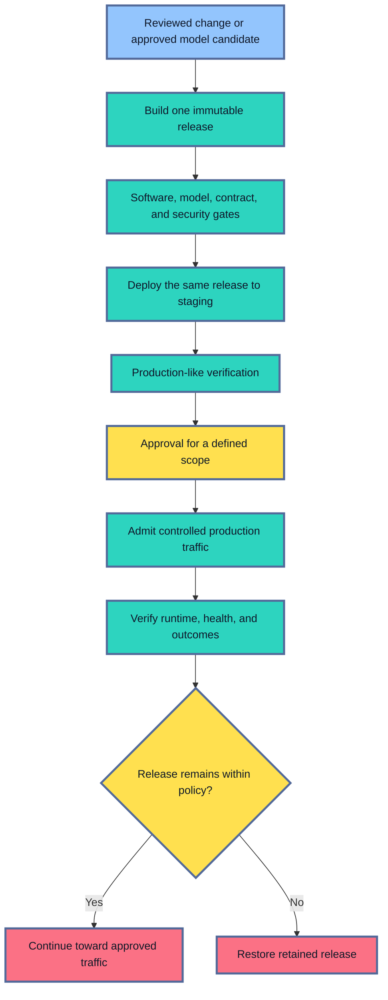
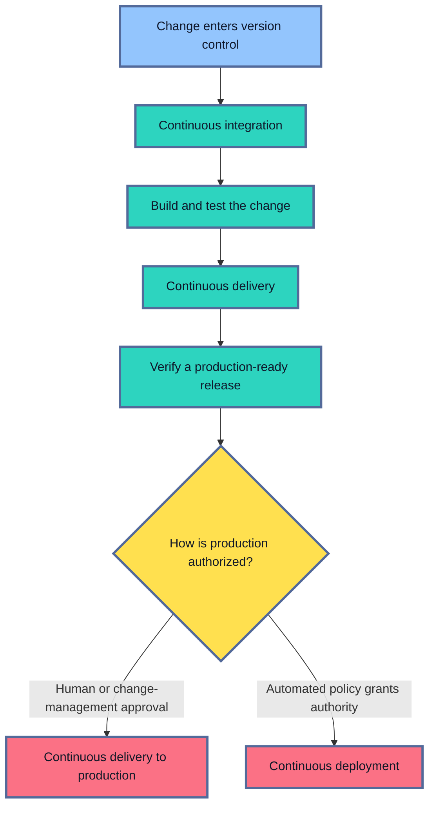
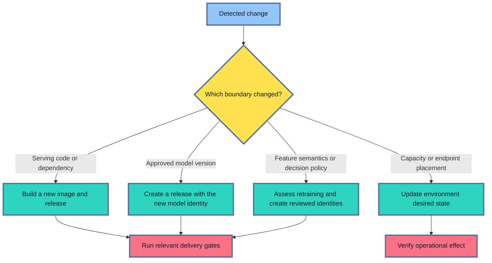
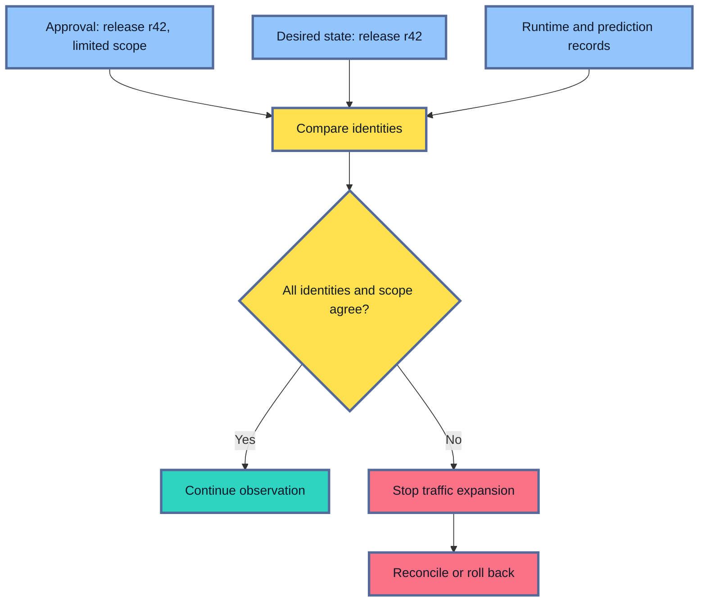

## Table of Contents

1. [What Continuous Delivery Means For An ML Service](#what-continuous-delivery-means-for-an-ml-service)
2. [CI, Continuous Delivery, And Continuous Deployment](#ci-continuous-delivery-and-continuous-deployment)
3. [A Delivery Pipeline Starts From A Defined Release Trigger](#a-delivery-pipeline-starts-from-a-defined-release-trigger)
4. [Training Produces A Candidate; Delivery Promotes It](#training-produces-a-candidate-delivery-promotes-it)
5. [The Delivery Path Builds Confidence In Stages](#the-delivery-path-builds-confidence-in-stages)
6. [Build And Package One Immutable Release](#build-and-package-one-immutable-release)
7. [Software, Contract, And Supply-Chain Gates Protect The Service](#software-contract-and-supply-chain-gates-protect-the-service)
8. [Model-Specific Gates Protect Prediction Behaviour](#model-specific-gates-protect-prediction-behaviour)
9. [Staging Tests The Release As A Production System](#staging-tests-the-release-as-a-production-system)
10. [Approval Controls Production Authority](#approval-controls-production-authority)
11. [Production Admission Limits Initial Exposure](#production-admission-limits-initial-exposure)
12. [Delayed Labels Change The Meaning Of A Successful Deployment](#delayed-labels-change-the-meaning-of-a-successful-deployment)
13. [Post-Deploy Verification Compares Intent With Reality](#post-deploy-verification-compares-intent-with-reality)
14. [Rollback Restores The Complete Release](#rollback-restores-the-complete-release)
15. [Choose The Delivery Stack Around The Deployment Target](#choose-the-delivery-stack-around-the-deployment-target)
16. [A Focused GitHub Actions Delivery Workflow](#a-focused-github-actions-delivery-workflow)
17. [The Evidence Record Makes Every Transition Explainable](#the-evidence-record-makes-every-transition-explainable)
18. [Test The Delivery System Itself](#test-the-delivery-system-itself)
19. [The Main Idea](#the-main-idea)
20. [References](#references)

## What Continuous Delivery Means For An ML Service
<!-- section-summary: Continuous delivery automates the path from a reviewed change to a production-ready model release while preserving evidence and production control. -->

At a high level, **continuous delivery is a repeatable path that keeps a tested release ready for production**. A change enters the path, automated checks gather evidence, the same immutable release moves through staging, and production waits behind a controlled decision.

The word *continuous* describes readiness and repeatability. Production release frequency can still match the product's risk. A team may deliver several low-risk internal services each day and release a regulated decision model less often. Both can use continuous delivery if every candidate follows the same automated path and remains ready for an authorized release decision.

An ordinary web service often centres its release on one container image. An ML service carries a wider set of dependencies. Its behaviour can depend on:

- a registered model version and model signature;
- preprocessing code, tokenizer, or feature contract;
- serving code, runtime libraries, and container image;
- thresholds, calibration, fallbacks, and other decision policy;
- offline evaluation, segment results, security evidence, and approval scope.

This extra evidence exists because a model service can fail in two directions. The service can fail operationally by returning errors, timing out, or exhausting memory. It can also remain fast and available while its predictions are unsuitable for a segment, incompatible with current features, or attached to the wrong decision threshold.

Continuous delivery automates the repeatable work around both directions. It builds and identifies artifacts, runs tests, verifies evidence, deploys to staging, requests approval, admits limited production traffic, checks real runtime identity, and starts rollback if a stop condition fires.



The pipeline is therefore more than a script that calls a deployment API. It is the control system that connects an approved release identity to evidence, authority, real production state, and recovery.

## CI, Continuous Delivery, And Continuous Deployment
<!-- section-summary: Continuous integration proves a change can join the shared branch, continuous delivery proves a release is ready, and continuous deployment sends every passing release to production automatically. -->

The abbreviations *CI* and *CD* are often combined, though they describe different decisions. CI answers whether a change can join shared work. Delivery answers whether an identified release is ready for production. Deployment decides whether that ready release enters production automatically.

**Continuous integration (CI)** checks whether a source change can safely join the shared branch. A pull request or merge request triggers fast feedback such as unit tests, type checks, linting, contract tests, dependency checks, and a build. CI ends with evidence about the change and may produce an immutable artifact.

**Continuous delivery** takes an identified release through the checks required for production readiness. It deploys to pre-production environments, verifies the complete service, gathers approval evidence, and waits for production authority. The final production decision is explicit.

**Continuous deployment** removes that final manual decision. Every release that satisfies the automated policy proceeds into production. Teams sometimes call this approach “fully automated CD.”



Many ML teams choose continuous delivery with a production approval gate. Offline evaluation has uncertainty, labels may mature slowly, and a threshold change can affect real people or operational queues. A reviewer can examine segment results, intended use, rollback readiness, and the exact traffic scope before granting authority.

Full continuous deployment still has a place. A low-consequence internal ranking model with strong automated tests and rapid outcome feedback may justify it. The choice should follow the harm and reversibility of a wrong decision. The initials *CD* alone never answer that risk question.

## A Delivery Pipeline Starts From A Defined Release Trigger
<!-- section-summary: A release trigger names the reviewed change and determines which artifacts and evidence need to be rebuilt. -->

A pipeline needs a precise answer to “What changed?” That answer determines which work is required and prevents automation from creating an accidental release.

Four triggers are common in model services.

### A serving-source change

API code, preprocessing code, a base image, or a dependency lock changed. The pipeline builds a new serving image, runs software and model compatibility tests, and creates a new release identity. The approved model version may stay fixed.

A security patch is a good example. The model weights remain version 27, while the patched image receives a new digest. Production behaviour still needs verification because library and runtime changes can alter loading, preprocessing, numerical output, or performance.

### An approved model candidate

A training pipeline registered a new concrete model version and attached its evaluation evidence. Approval of that candidate can emit an event that starts delivery. The serving source may stay fixed, while the release pins the new model version and verifies compatibility with the existing image and feature contract.

Amazon SageMaker projects can trigger deployment from an approved Model Registry version. Other platforms implement the same boundary through registry webhooks, event buses, or an explicit workflow dispatch.

### A feature or policy change

A feature definition, threshold, calibration map, fallback rule, or routing policy changed. Some changes require a new model candidate because the input meaning changed. Others create a new policy version around the existing model.

Suppose a threshold moves from `0.80` to `0.85`. No retraining is required by default. The release still needs a new identity and policy evidence because the change alters action rates and potentially segment outcomes.

### An environment desired-state change

Replica count, region, endpoint capacity, maintenance window, or a secret reference changed. These values may create a new deployment revision without changing the model release itself.

The boundary deserves care. Increasing replicas preserves behaviour and belongs to desired state. Changing an environment variable that contains a prediction threshold changes behaviour and belongs in a new release. A clear configuration schema prevents behavioural settings from hiding among infrastructure values.



## Training Produces A Candidate; Delivery Promotes It
<!-- section-summary: Training and delivery are separate control paths so production receives the exact model that earned evaluation and approval. -->

A training pipeline searches, fits, evaluates, and registers model candidates. A delivery pipeline consumes one approved candidate. Keeping those responsibilities separate protects a crucial promise: the model sent to production is the model that reviewers evaluated.

Quiet retraining inside deployment breaks that promise. Random initialization, changing data, updated dependencies, and nondeterministic compute can produce different weights. Even a highly reproducible training process creates a new artifact identity that needs its own evidence.

Consider a deployment job that receives `risk.score` version 27, reruns training from the associated source, and deploys the result. The registry evidence describes version 27. Production now serves an unregistered model produced later. The pipeline may report success, while the approved and deployed subjects have diverged.

The safe boundary is clear:

1. The training pipeline creates and registers a concrete model candidate.
2. Evaluation jobs attach offline, segment, robustness, and lineage evidence to that candidate.
3. Approval names the candidate's immutable identity.
4. The delivery pipeline retrieves and verifies those exact bytes.
5. Staging and production reuse the same model identity.

A feature-semantic change may require retraining. In that case, the change returns to the training path and produces a new candidate. A dependency patch in serving code usually builds a new image around the same model. A replica change updates desired state. CD should encode these routes explicitly instead of running training “just in case.”

## The Delivery Path Builds Confidence In Stages
<!-- section-summary: Each delivery stage answers a different question and passes the same immutable release to the next trust boundary. -->

The delivery path builds confidence in stages because each environment exposes a different class of failure. Early checks are fast and isolated. Later checks are slower and closer to real consequence. Every stage keeps the same release identity.

**Build and package** asks whether the reviewed source and approved model identities can produce one immutable release. **Fast tests** check the software in isolation and prove that the model and contracts load together. **Supply-chain verification** connects artifact digests to reviewed inputs and trusted automation.

**Staging deployment** asks whether the exact release can run inside production-like infrastructure and communicate with its real boundaries. Representative requests, load, dependency failures, feature lookups, telemetry, and a rollback drill add evidence about the complete system.

**Approval** grants the exact release authority for a defined environment and traffic scope. **Production admission** applies that bounded scope to real traffic. **Post-deploy verification** then proves that the platform loaded the approved model, image, feature contract, and policy.

**Rollback** answers the recovery question. The controller must restore the retained release and prove recovery through runtime and user-facing signals.

These questions create an evidence chain. A later stage uses earlier evidence and adds a new kind. Staging never substitutes a fresh build, and a production approval never floats with a mutable alias.

## Build And Package One Immutable Release
<!-- section-summary: Build automation creates content-addressed model and runtime artifacts, then records them together as one release. -->

The build stage turns reviewed inputs into immutable assets. For a custom model service, the main runtime asset is usually an OCI container image. The image includes serving code, system packages, language dependencies, health endpoints, and telemetry libraries.

The model can travel in two common ways.

**Bundled model:** The image contains the model artifact. One image digest identifies the runtime and model bytes together. This is operationally convenient for modest artifacts and tightly coupled preprocessing.

**External registered model:** The image loads a concrete model version from MLflow, Databricks Unity Catalog, SageMaker Model Registry, Vertex AI Model Registry, Azure Machine Learning, or another governed store. The release pins both the image digest and model identity. Readiness should fail if the downloaded artifact has the wrong digest or signature.

Neither shape changes the single-build rule. CI builds the image, pushes it to an OCI registry, records the resulting digest, and attaches provenance or an attestation. Staging and production select that digest. A tag such as `candidate` can help people find it, while the release identity uses `image@sha256:...`.

The release record then joins:

- source commit and dependency-lock digest;
- OCI image digest and build provenance;
- concrete registered-model version and model digest;
- signature, preprocessing, and feature-contract versions;
- decision-policy version;
- evaluation and approval references;
- compatible rollback release.

CD uses this bundle as its unit of movement. If any behavioural identity changes, the pipeline creates a new release and reruns the relevant gates.

## Software, Contract, And Supply-Chain Gates Protect The Service
<!-- section-summary: General delivery gates prove that the service is correct, compatible, buildable from trusted inputs, and safe to operate. -->

Software gates cover familiar engineering failures. Unit tests exercise request validation, preprocessing helpers, post-processing, policy code, and fallback paths. Integration tests load the packaged model and call the service through its actual interface. Contract tests verify that callers and the service agree on fields, types, status codes, and response meaning.

Imagine a serving change that renames `account_age_days` to `account_age`. The model signature may still expect the original column. A normal API smoke test can return HTTP 200 if a default silently fills the missing value. A contract fixture that asserts the prepared model input catches the semantic error before staging.

Supply-chain gates ask a different set of questions:

- Does the image use an approved base and pass vulnerability policy?
- Does the dependency lock match the installed environment?
- Does the image digest match the release record?
- Does build provenance connect the digest to the reviewed source and trusted runner?
- Does the workload use approved identities, network paths, and secret references?

GitHub Actions can generate artifact attestations for container images. Cosign can sign and verify images by digest. SLSA provenance provides a common way to describe build inputs and process. These controls establish trust in the runtime package; model evaluation still owns predictive quality.

Infrastructure changes need review too. Terraform or Pulumi can define endpoints, networks, IAM, monitoring, and cluster resources. The delivery gate should inspect a plan or preview before applying a production infrastructure change. A model release that only updates an existing endpoint may avoid a full infrastructure apply.

## Model-Specific Gates Protect Prediction Behaviour
<!-- section-summary: Model gates test quality, feature meaning, training-serving parity, policy behaviour, performance, and limitations that software tests cannot cover. -->

Model-service delivery needs evidence beyond “the endpoint returned a valid response.” A valid response proves that one request completed. Model gates ask whether the release preserves predictive quality, feature meaning, policy behaviour, and safe operating limits across the intended population.

### Offline and segment quality

The candidate is compared with the current production baseline on a frozen evaluation protocol. Metrics should reflect the product task, such as precision and recall, ranking quality, calibration, forecast error, or task-specific safety measures.

Aggregate improvement cannot hide a serious segment regression. If overall recall rises while recall for a high-consequence region drops sharply, the segment gate can block release. The gate records sample size and uncertainty so a tiny group avoids creating false confidence.

### Data and feature compatibility

The service checks whether the candidate's expected fields exist in the live feature contract. Types, units, category vocabularies, tensor shapes, null rules, point-in-time semantics, and freshness expectations all matter.

Suppose training used account balance in dollars while the online feature producer now emits cents. Both values are numeric and pass a type check. A contract fixture with known input and expected transformed value reveals the unit mismatch. Feature compatibility therefore includes meaning, not just schema.

### Training-serving parity

Parity checks compare the transformations used during training with the path used during inference. Representative records should produce equivalent feature vectors and model-ready tensors in both paths.

Packaging fitted preprocessing with the model reduces one class of mismatch. Shared feature systems still need offline/online consistency checks. A small golden dataset can exercise timestamps, missing values, rare categories, text normalization, and boundary cases.

### Model signature and output meaning

The model signature defines inputs, outputs, and supported inference parameters. The service should validate representative requests against that signature and confirm the output's interpretation.

A field called `score` can mean a probability, an uncalibrated margin, or an anomaly value whose direction is reversed. Contract tests should assert class order, score range, calibration version, and response mapping where relevant.

### Decision-policy boundaries

Thresholds and guardrails turn scores into actions. Small tests around every important boundary provide strong evidence. If manual review starts at `0.82`, fixtures producing `0.819` and `0.821` should follow different expected paths.

Policy tests also cover fallbacks, abstention, caps, blocked segments, and human-review routing. A model can pass offline metrics while an incorrect threshold doubles the queue handled by operations.

### Latency, capacity, and cost

Model versions can change memory use, accelerator requirements, batch size, token generation, and latency. A staging load test should use production-like payload sizes and concurrency. It measures end-to-end latency, queueing, throughput, memory, accelerator utilization, fallback rate, and cost drivers.

An LLM endpoint needs token-aware capacity evidence because one request can contain vastly more work than another. A vision service may need image-size bands. A batch model needs completion time and record coverage against its deadline.

### Security and misuse boundaries

The service image receives ordinary vulnerability and configuration checks. The model path may also need adversarial inputs, prompt-injection tests, unsafe-output checks, sensitive-data controls, or abuse-rate limits. The required evidence follows the model's capability and product consequence.

Each gate should name its owner, input evidence, pass rule, and failure action. A failing segment gate cannot be outweighed by a passing image scan. They protect different risks.

## Staging Tests The Release As A Production System
<!-- section-summary: Staging verifies the exact release against realistic infrastructure, dependencies, traffic shapes, and failure paths. -->

Staging answers a larger question than “Can the container start?” It asks whether the exact release works as a system inside a production-like boundary.

The deployment uses the same model and image digests planned for production. Environment-specific values can differ: endpoint names, secrets, replicas, and isolated datasets belong to staging. Behavioural values such as feature semantics and decision policy stay pinned to the release.

Verification starts close to the process and moves outward:

1. The image pulls by digest and the process starts.
2. Readiness confirms the exact model, feature contract, and policy loaded.
3. Golden requests exercise normal, edge, and malformed inputs.
4. The service reaches its feature, policy, registry, and telemetry dependencies.
5. Load tests exercise realistic payloads, concurrency, and resource limits.
6. Failure tests cover timeouts, stale features, unavailable dependencies, and fallback.
7. A rollback drill restores the retained release and checks its identity.

The order helps diagnosis. A load failure has little meaning if half the replicas loaded the wrong model. Identity and contract checks establish the subject before performance testing.

Staging still has limits. It cannot reproduce every production input, traffic surge, or social effect. It also cannot manufacture labels that naturally arrive later. Its job is to remove known integration uncertainty and provide credible evidence for a controlled production admission.

## Approval Controls Production Authority
<!-- section-summary: Approval grants a named immutable release permission to enter a defined production scope. -->

An approval is a decision about consequence. It should name the exact release, target environment, permitted traffic scope, important exclusions, expiry or review conditions, and rollback target.

Approving “the latest model” creates moving authority. If an alias changes after review, the approval can silently cover a different model. Approving release `risk-score/r42` with concrete model and image digests binds the decision to one subject.

The amount of separation should match risk.

For a low-consequence internal helper, automated policy plus an owning engineer may be enough. A customer-facing recommendation system may require the service owner and model owner.

High-consequence decisions need stronger separation. Credit, healthcare, employment, or safety use may require an independent risk reviewer and a change-management record. The person who trained the model should have different authority from the person who approves production.

GitHub environments can require reviewers and prevent self-review for deployment jobs. GitLab protected environments can restrict deployers and require deployment approvals. Jenkins Pipeline can pause for input, though teams must design its permissions and audit boundaries themselves.

The emergency path deserves the same design effort. It should be predefined, narrowly scoped, time-limited, and auditable. Typical emergency actions restore a retained release, disable a candidate route, or switch to a reviewed fallback. Emergency authority should never permit an unregistered model from a laptop to enter production.

## Production Admission Limits Initial Exposure
<!-- section-summary: Production admission gives an approved release a bounded amount of real traffic under explicit stop conditions. -->

Passing staging gives the release permission to face reality in a limited way. **Production admission** is the stage that assigns a bounded traffic share or population to the candidate and watches immediate evidence.

The approval record states the ceiling. It may allow a small percentage of requests, one internal user group, one region, or mirrored traffic that cannot affect responses. The deployment controller or managed endpoint enforces that scope.

Immediate stop conditions usually cover:

- runtime identity mismatch;
- elevated errors, timeouts, or fallback;
- latency, queue, memory, accelerator, or cost pressure;
- invalid prediction distributions or action-rate jumps;
- feature freshness and contract failures;
- safety or business guardrail breaches.

Shadow, canary, and blue-green strategies provide different ways to admit traffic. CD focuses on the common control boundary: apply the approved scope, observe the defined signals, prevent unauthorized expansion, and retain a tested recovery path.

## Delayed Labels Change The Meaning Of A Successful Deployment
<!-- section-summary: Immediate deployment evidence proves operational safety and input plausibility, while delayed labels are needed for real prediction-quality conclusions. -->

Traditional service health appears within seconds or minutes. True model outcomes may take hours, days, or weeks. A loan can be served successfully today while its repayment label will not exist for months.

This delay changes what the pipeline can claim. Successful readiness, low latency, valid feature distributions, and stable action rates show that the release is operating as designed. They cannot prove final predictive quality on live traffic.

Teams handle the gap in layers:

1. Offline evaluation provides quality evidence before release.
2. Staging proves contracts, parity, performance, and recovery.
3. Early production checks watch service health, features, score distributions, actions, and safety guardrails.
4. Mature-label jobs later compare outcomes by release and segment.
5. Traffic expansion pauses at the approved boundary if high-consequence evidence is still pending.

For a fraud model, investigators may confirm labels several weeks after a transaction. The candidate can enter a limited canary with strong offline evidence. The team watches score and manual-review rates immediately, then evaluates confirmed fraud outcomes after labels mature. The evidence record should say “live quality pending” during the gap instead of treating absence of failures as proof of accuracy.

## Post-Deploy Verification Compares Intent With Reality
<!-- section-summary: Post-deploy verification proves that the platform loaded the approved release and that real traffic reaches it within health policy. -->

A successful deployment API call means the control plane accepted a request. Production can still contain stale replicas, cached aliases, failed model downloads, traffic misrouting, or an unexpected fallback.

Post-deploy verification compares three identities:

- **Approved identity** names the release and scope authorized by the gate.
- **Desired identity** names the release the deployment controller intends to run.
- **Observed identity** comes from ready replicas and prediction events.

All three should agree. Each service instance can expose a protected version endpoint with its `release_id`, image digest, model version, feature contract, and policy version. Prediction logs carry the same compact identities for real requests.



Verification also checks end-to-end health. It confirms readiness, request success, latency objectives, traffic share, feature freshness, fallback use, queue pressure, and cost signals. A synthetic prediction can verify a known path where privacy and product rules allow it.

The pipeline records a durable result. “Deployment command exited zero” is weak evidence. “Every ready replica reported r42, observed traffic stayed within the approved share, no stop condition breached, and the rollback target remained healthy” is an operational conclusion.

## Rollback Restores The Complete Release
<!-- section-summary: Delivery rollback reapplies a retained release and verifies that production traffic and user-facing health have recovered. -->

A model-service rollback restores more than weights. It restores the compatible serving image, model version, preprocessing, feature contract, decision policy, and environment desired state represented by the retained release.

Suppose the new image contains faulty text normalization. Moving a registry alias to the old model leaves the faulty image in place. Suppose the new feature contract changed units. Restoring only the image can load values with the wrong meaning. The rollback target needs the whole compatible bundle.

The recovery path has a clear shape:

1. Stop traffic expansion and preserve incident evidence.
2. Select the retained rollback release named in the manifest.
3. Reapply its desired state through the same trusted deployment controller.
4. Verify loaded identities across every ready replica.
5. Confirm traffic, latency, errors, fallbacks, and product guardrails recover.
6. Keep the failed release and its evidence for investigation.

Managed endpoints, Kubernetes Deployments, Argo Rollouts, and cloud traffic routers provide useful rollback mechanisms. The CD system still owns the product-safe target and the recovery proof. A platform controller cannot infer whether an older model remains compatible with a new feature producer.

## Choose The Delivery Stack Around The Deployment Target
<!-- section-summary: Industrial delivery stacks combine a CI orchestrator, governed registries, a deployment controller, infrastructure as code, and observability according to the target platform. -->

The tools fit into a small set of responsibilities. A CI orchestrator runs the workflow. Registries hold immutable model and image identities. A deployment controller changes desired state. Infrastructure as code manages durable platform resources. Observability supplies production evidence.

### CI orchestrators coordinate the evidence path

GitHub Actions is a practical default for repositories already hosted on GitHub. Its environments can protect production jobs, withhold environment secrets until approval, and integrate artifact attestations. GitLab CI/CD offers protected environments and deployment approvals inside GitLab. Jenkins remains common in established enterprises that need self-managed runners, extensive integrations, or existing shared pipeline libraries.

These systems should orchestrate purpose-built checks. They should not replace the model registry, invent model lineage from file names, or hold a floating `latest` reference as the release identity.

### Managed ML deployment is the default starting point

Managed endpoints reduce infrastructure work and integrate model identities, IAM, autoscaling, monitoring, and deployment APIs.

SageMaker Model Registry can associate versions with artifacts, inference images, metrics, lineage, and approval status. Approved versions can trigger deployment automation to SageMaker endpoints. Vertex AI separates registered model versions from deployed models on endpoints. Azure Machine Learning managed online endpoints support multiple deployments, traffic allocation, mirroring, and Azure Monitor integration. Databricks Model Serving deploys registered MLflow models from Unity Catalog or the workspace registry behind managed endpoints.

The provider-specific object names differ. The delivery logic stays recognizable: resolve a concrete model version, create or update a candidate deployment, verify it without broad traffic, apply the approved traffic scope, and observe the result.

### Kubernetes and GitOps need a genuine reason

Kubernetes can be justified by shared platform investment, custom networking, specialized GPU scheduling, sidecars, portable serving runtimes, or multi-model operational requirements. KServe can provide model-serving abstractions. A service mesh or gateway can control traffic. Prometheus and OpenTelemetry can supply evidence.

Argo CD and Flux add a GitOps control loop. CI updates the desired release in a reviewed Git repository; the in-cluster controller reconciles the cluster to that commit. This shape reduces direct cluster credentials in CI and creates a visible desired-state history.

GitOps adds operational responsibility too. Teams must govern the manifest repository and controller permissions. They also own reconciliation, secrets, drift, and rollback interactions. A managed endpoint is usually a better first choice for a team that only needs to serve several models reliably.

### Infrastructure as code owns durable foundations

Terraform or Pulumi can create networks, IAM roles, registries, endpoints, clusters, observability resources, and policy boundaries. Plans or previews expose infrastructure changes for review.

Per-release automation should update the smallest required resource. A new model version may update a managed endpoint deployment without recreating the network. Separating platform lifecycle from model-release lifecycle keeps delivery faster and reduces infrastructure blast radius.

## A Focused GitHub Actions Delivery Workflow
<!-- section-summary: A compact workflow can verify an approved model, build and attest one image, deploy the same release to staging, and protect production through an environment gate. -->

The workflow here illustrates the control boundaries with GitHub Actions, an MLflow-compatible registry, an OCI registry, and a managed endpoint. The repository owns the small `delivery` commands because model gates and provider deployment calls depend on the service.

The input requires a concrete registry version such as `models:/risk.score/27`. The package job verifies that candidate, builds one image, attests its digest, and writes the release manifest. Staging and production download that same manifest. Before staging deploys, it reads the exact `image@sha256:...` reference from the manifest and verifies its GitHub provenance against the expected source repository.

```yaml
name: Deliver model service

on:
  workflow_dispatch:
    inputs:
      release_id:
        type: string
        required: true
        description: Immutable release ID
      model_uri:
        type: string
        required: true
        description: Concrete registry URI, never an alias

jobs:
  package:
    runs-on: ubuntu-latest
    permissions:
      contents: read
      packages: write
      id-token: write
      attestations: write
      artifact-metadata: write
    outputs:
      image_digest: ${{ steps.build.outputs.digest }}
    steps:
      - uses: actions/checkout@v6
      - name: Verify model evidence and release contracts
        run: |
          ./delivery verify-candidate "$MODEL_URI"
          ./delivery test-release "$MODEL_URI"
        env:
          MODEL_URI: ${{ inputs.model_uri }}
      - uses: docker/login-action@v4
        with:
          registry: ghcr.io
          username: ${{ github.actor }}
          password: ${{ secrets.GITHUB_TOKEN }}
      - id: build
        uses: docker/build-push-action@v7
        with:
          push: true
          tags: ghcr.io/example/model-service:${{ github.sha }}
      - uses: actions/attest@v4
        with:
          subject-name: ghcr.io/example/model-service
          subject-digest: ${{ steps.build.outputs.digest }}
          push-to-registry: true
      - name: Write immutable release manifest
        run: |
          ./delivery create-release --release "$RELEASE_ID" --model "$MODEL_URI" --image "ghcr.io/example/model-service@$IMAGE_DIGEST"
        env:
          RELEASE_ID: ${{ inputs.release_id }}
          MODEL_URI: ${{ inputs.model_uri }}
          IMAGE_DIGEST: ${{ steps.build.outputs.digest }}
      - uses: actions/upload-artifact@v7
        with:
          name: release-manifest
          path: release.json

  staging:
    needs: package
    runs-on: ubuntu-latest
    environment: staging
    permissions:
      contents: read
      packages: read
      attestations: read
      id-token: write
    steps:
      - uses: actions/checkout@v6
      - uses: actions/download-artifact@v8
        with:
          name: release-manifest
      - name: Verify the image provenance at its exact digest
        run: |
          echo "$GHCR_TOKEN" | docker login ghcr.io --username "$GITHUB_ACTOR" --password-stdin
          IMAGE_AT_DIGEST="$(jq -er '.image | select(type == "string" and test("@sha256:[0-9a-f]{64}$"))' release.json)"
          gh attestation verify "oci://$IMAGE_AT_DIGEST" --repo "$GITHUB_REPOSITORY"
        env:
          GH_TOKEN: ${{ github.token }}
          GHCR_TOKEN: ${{ secrets.GITHUB_TOKEN }}
      - run: ./delivery deploy staging release.json
      - run: ./delivery verify-environment staging release.json

  production:
    needs: staging
    runs-on: ubuntu-latest
    environment: production
    permissions:
      contents: read
      id-token: write
    steps:
      - uses: actions/checkout@v6
      - uses: actions/download-artifact@v8
        with:
          name: release-manifest
      - run: ./delivery deploy production release.json --traffic-scope initial
      - run: ./delivery verify-environment production release.json
```

The package job alone can push packages, create attestations, and write linked-artifact metadata. Staging receives read access for the private image and its attestation. Production receives source read access and OpenID Connect authority for the provider deployment path.

The staging verification extracts the full image reference from `release.json`. Its regular expression requires a SHA-256 digest, and GitHub CLI verifies the provenance subject plus the signing repository. Authentication to GHCR lets the CLI retrieve a private image manifest. A missing digest, invalid attestation, or repository mismatch stops the job before the deploy command.

The production environment is configured in GitHub with required reviewers, restricted branches, and provider authentication. OpenID Connect is preferable to long-lived cloud keys where the provider supports it. The workflow receives production credentials only after the environment gate passes.

The important detail is identity flow. `model_uri` identifies an already approved candidate. `steps.build.outputs.digest` identifies the image built by CI. `release.json` joins those identities. Every later job consumes that file instead of rebuilding or resolving a movable alias.

The team-owned commands should return non-zero status for policy failures and store evidence outside the runner. For example, `verify-candidate` can require a model signature, an approved evaluation record, segment results, and an allowed-use tag. `verify-environment` can compare the release manifest with runtime metadata and recent prediction records.

## The Evidence Record Makes Every Transition Explainable
<!-- section-summary: A delivery record binds gate results, approval scope, observed production state, and rollback readiness to one immutable release. -->

The workflow log is useful for debugging. A durable evidence record is stronger because it captures the decision in a stable, queryable form.

```json
{
  "release_id": "risk-score/r42",
  "subject": {
    "model_uri": "models:/risk.score/27",
    "model_digest": "sha256:2a91...",
    "image_digest": "sha256:7c44...",
    "feature_contract": "risk-features/v8",
    "policy_version": "risk-policy/v12"
  },
  "gates": {
    "software": "passed",
    "model_quality": "passed",
    "segment_quality": "passed",
    "serving_compatibility": "passed",
    "security": "passed"
  },
  "approval": {
    "environment": "production",
    "traffic_scope": "initial",
    "decision": "approved"
  },
  "observed": {
    "runtime_identity_match": true,
    "stop_conditions": []
  },
  "live_quality": "pending_mature_labels",
  "rollback_release": "risk-score/r41"
}
```

The `subject` prevents evidence from floating to another build. The gate states show which failure boundaries were checked. Approval limits authority. Observed state proves what production loaded. The live-quality field communicates the delayed-label limitation directly.

Every transition should append an authenticated event: who or which policy created the release, attached evidence, approved scope, changed traffic, invoked an emergency action, or restored the rollback target. Lineage explains how the artifact was produced. The audit trail explains how it gained production authority.

## Test The Delivery System Itself
<!-- section-summary: A reliable CD pipeline is tested with rejected releases, stale identities, failed dependencies, unauthorized transitions, and real rollback drills. -->

Delivery automation can fail like any other production system. A green path proves too little. The pipeline needs tests for rejection and recovery.

A useful test suite exercises these cases:

1. A model alias is supplied instead of a concrete version, so intake rejects it.
2. The model digest differs from the registry record, so packaging stops.
3. A required segment metric is missing, so production approval remains unavailable.
4. The image attestation fails verification, so staging never receives the release.
5. One replica reports another model version, so traffic expansion stops.
6. Requested traffic exceeds approval scope, so the transition is denied.
7. Outcome labels are immature, so live quality stays pending.
8. The rollback artifact is missing, so release readiness fails before production.
9. The rollback drill restores the declared release and telemetry confirms recovery.

Teams should also rehearse CI-provider and deployment-provider outages. A release may need to pause safely with staging active and production unchanged. Emergency recovery should remain available through a controlled path even if the normal orchestration service is unavailable.

Pipeline metrics complete the operational view. Track lead time, gate failures by category, approval wait, deployment duration, rollback frequency, false stop conditions, identity mismatches, and time to verified recovery. These measures reveal where delivery is slow or unsafe without rewarding teams for pushing traffic before evidence is ready.

## The Main Idea
<!-- section-summary: Continuous delivery turns a reviewed model candidate and serving change into an immutable, evidenced, authorized, observable, and recoverable production release. -->

Continuous delivery for an ML service automates repeatable evidence gathering and deployment work. It preserves human or policy control over production consequence.

The training path creates a concrete model candidate. The delivery path combines that candidate with one image, feature contract, policy, and evidence record. CI proves the change can integrate. Staging proves the release works as a system. Approval grants bounded authority. Production admission limits exposure. Runtime verification proves what users reached. Rollback restores the complete retained release.

The standard is practical: every production prediction should trace to the exact release that earned its evidence and authority, and the team should be able to restore a known-good release through the same trusted control path.

## References

- [AWS: What is continuous delivery?](https://aws.amazon.com/devops/continuous-delivery/)
- [GitHub Actions: Deployments and environments](https://docs.github.com/en/actions/reference/workflows-and-actions/deployments-and-environments)
- [GitHub Actions: Artifact attestations for build provenance](https://docs.github.com/en/actions/how-tos/secure-your-work/use-artifact-attestations/use-artifact-attestations)
- [GitLab CI/CD protected environments](https://docs.gitlab.com/ci/environments/protected_environments/)
- [GitLab deployment safety](https://docs.gitlab.com/ci/environments/deployment_safety/)
- [Jenkins Pipeline](https://www.jenkins.io/doc/book/pipeline/)
- [MLflow Model Registry workflows](https://mlflow.org/docs/latest/ml/model-registry/workflow/)
- [Amazon SageMaker Model Registry](https://docs.aws.amazon.com/sagemaker/latest/dg/model-registry.html)
- [Amazon SageMaker: Deploy a model from the registry](https://docs.aws.amazon.com/sagemaker/latest/dg/model-registry-deploy.html)
- [Google Cloud: Vertex AI model aliases](https://docs.cloud.google.com/vertex-ai/docs/model-registry/model-alias)
- [Google Cloud: Vertex AI endpoints](https://docs.cloud.google.com/sdk/gcloud/reference/ai/endpoints)
- [Azure Machine Learning online endpoints](https://learn.microsoft.com/en-us/azure/machine-learning/concept-endpoints-online?view=azureml-api-2)
- [Databricks Model Serving](https://docs.databricks.com/aws/en/machine-learning/model-serving)
- [Kubernetes: Update a Deployment and roll back](https://kubernetes.io/docs/tasks/run-application/update-deployment-rolling/)
- [Argo CD automated sync policy](https://argo-cd.readthedocs.io/en/stable/user-guide/auto_sync/)
- [Flux image update automation](https://fluxcd.io/flux/guides/image-update/)
- [Terraform core workflow](https://developer.hashicorp.com/terraform/intro/core-workflow)
- [Pulumi infrastructure as code](https://www.pulumi.com/docs/iac/)
- [Open Container Initiative image descriptor](https://github.com/opencontainers/image-spec/blob/main/descriptor.md)
- [Sigstore Cosign verification](https://docs.sigstore.dev/cosign/verifying/verify/)
- [SLSA provenance](https://slsa.dev/spec/v1.2/provenance)
