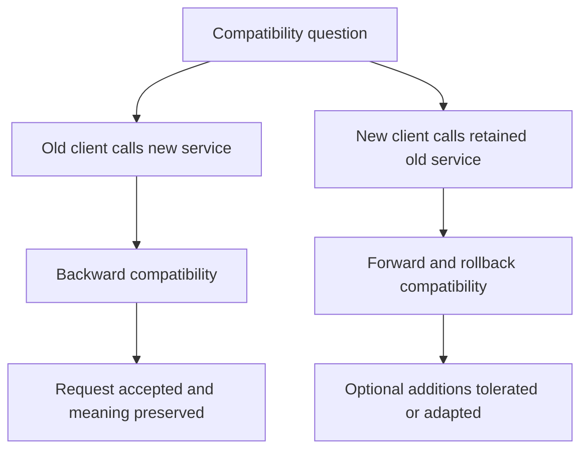
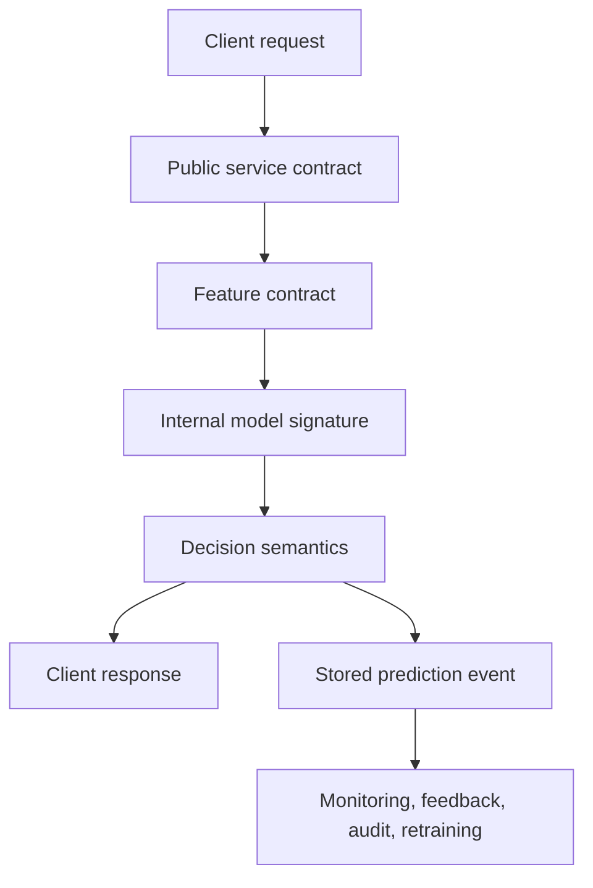
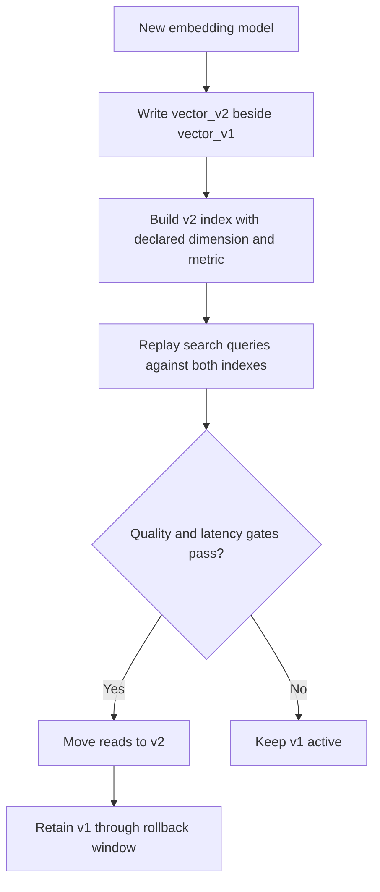
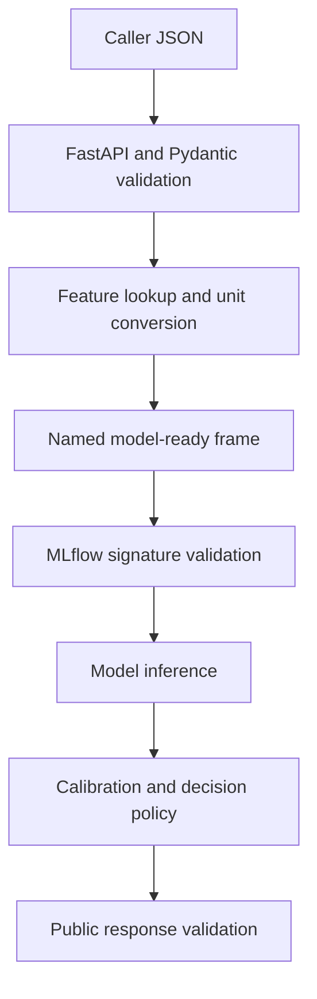
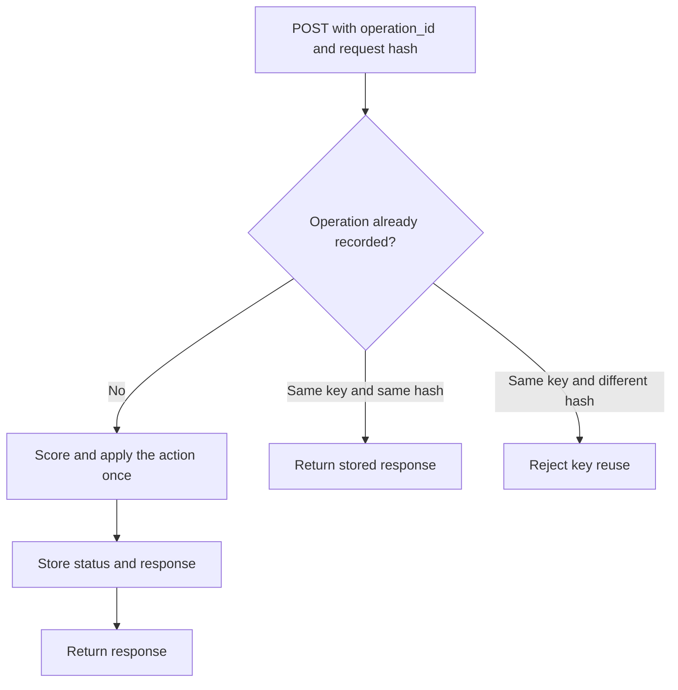
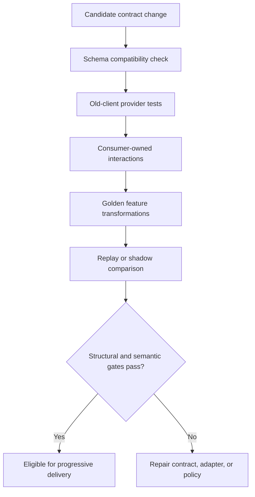
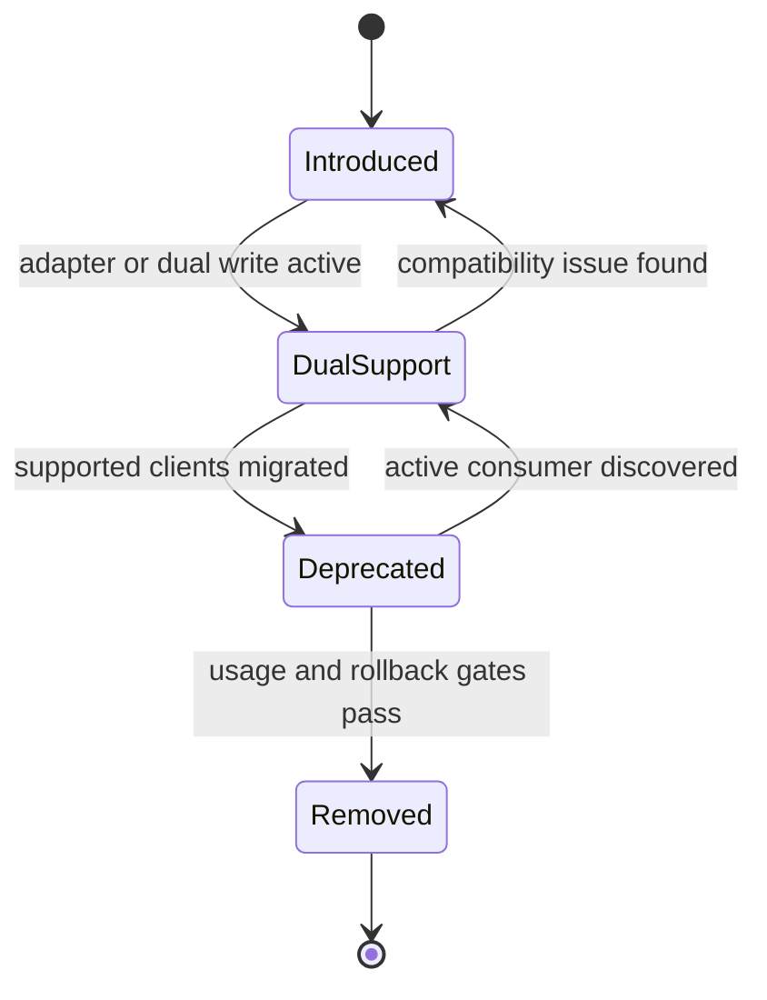
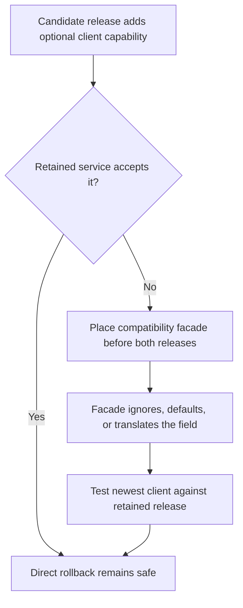

## Table of Contents

1. [What Backward Compatibility Means For A Model API](#what-backward-compatibility-means-for-a-model-api)
2. [The Five Contracts A Model API Must Keep Compatible](#the-five-contracts-a-model-api-must-keep-compatible)
3. [Keep Request And Response Shapes Compatible](#keep-request-and-response-shapes-compatible)
4. [Keep The Meaning Of Inputs And Outputs Stable](#keep-the-meaning-of-inputs-and-outputs-stable)
5. [Use Model Signatures To Check Internal Inputs And Outputs](#use-model-signatures-to-check-internal-inputs-and-outputs)
6. [Make Retried Requests Produce Safe, Predictable Results](#make-retried-requests-produce-safe-predictable-results)
7. [Keep Stored Predictions Compatible With Their Readers](#keep-stored-predictions-compatible-with-their-readers)
8. [Test Compatibility From Several Views](#test-compatibility-from-several-views)
9. [Change Contracts In Deliberate Stages](#change-contracts-in-deliberate-stages)
10. [Keep The Rollback Release Compatible With New Clients](#keep-the-rollback-release-compatible-with-new-clients)
11. [The Main Idea](#the-main-idea)
12. [References](#references)

## What Backward Compatibility Means For A Model API
<!-- section-summary: Compatibility keeps an existing client's request valid after the service, model, or surrounding data system changes. -->

A mobile application or batch job should not require an emergency release because a model changed behind its endpoint. **Model API compatibility** means that existing clients can keep requesting predictions after a new implementation is released. Requests remain valid, responses preserve their expected meaning, and failure and retry behaviour stays predictable.

Some compatibility failures are obvious. Removing a required response field can crash a strict client. Changing a number into a string can fail deserialization. ML systems also produce a more dangerous kind of failure: the request succeeds, the server returns `200 OK`, and the response has the expected fields, yet the meaning has changed.

Consider a fraud API that has always returned `risk_score` as a probability from `0.0` to `1.0`. A new model returns an uncalibrated ranking score on the same numerical range. The checkout service still parses the response. Its rule still blocks scores above `0.85`. The integration appears healthy, while the business decision is now based on a different quantity. HTTP success has hidden a semantic break.


*Matching field names and number ranges do not preserve compatibility when the score no longer means the same thing.*

Two directions of compatibility matter:

- **Backward compatibility** asks whether an older approved client can use the newer service. An app released several weeks ago sends the old request and receives a response it understands.
- **Forward compatibility** asks whether a newer client can tolerate an older service or older data. This matters during partial rollouts and rollbacks. A newly deployed client may send an optional field that the retained service has never seen, or read an event written by an older producer.



Compatibility therefore covers shape and meaning. Ask: **Which existing clients and stored records must remain usable after this change?** The answer defines the compatibility window and the evidence required before release.

## The Five Contracts A Model API Must Keep Compatible
<!-- section-summary: A production prediction crosses five contracts, each with its own consumers, owners, and failure modes. -->

A prediction endpoint looks like one interface from the outside. Internally, it crosses several boundaries. Treating all of them as one schema makes reviews confusing because a safe internal model change may have no effect on callers, while a tiny policy change may alter every product decision.

It helps to separate five contracts:

1. **Public service contract.** The HTTP or RPC request, response, errors, timeouts, authentication expectations, and retry behavior visible to callers.
2. **Internal model signature.** The columns, tensors, parameters, and outputs accepted by the loaded model artifact.
3. **Feature contract.** The names, types, units, freshness limits, default rules, and ordering used to prepare model inputs.
4. **Decision semantics.** The business meaning applied to model output, including labels, calibration, thresholds, abstention rules, and policy versions.
5. **Stored event and output contract.** The prediction records consumed later by monitoring jobs, feedback joins, audits, analytics, and retraining pipelines.



Suppose a new churn model replaces three one-hot columns with one categorical column. The model signature has changed, but the public API can remain stable because the service performs the new transformation internally. A different release may keep the model artifact unchanged and lower the retention-offer threshold from `0.70` to `0.55`. The JSON and model signature remain stable, yet decision semantics have changed and require a policy review.

The stored event deserves equal attention. A live response can be correct while a monitoring pipeline quietly loses the ability to join predictions to outcomes. For example, renaming `prediction_id` inside an event can reduce label-join coverage days after the release. The online service stays green; quality monitoring loses its evidence.

Each contract needs an owner and a version or release identifier. That identifier does not need to appear in the URL. A response can carry `contract_version`, `model_version`, and `policy_version`, while the stable route remains `/v1/predict`. Separate identifiers make incidents diagnosable because they reveal which layer changed.


*A single prediction crosses several contracts, and each contract can fail independently even when the endpoint still returns a successful response.*

## Keep Request And Response Shapes Compatible
<!-- section-summary: Structural compatibility preserves fields, types, requiredness, status codes, and other machine-readable rules used by clients. -->

**Structural compatibility** concerns the parts a program can validate mechanically: field names, types, required fields, enum values, message numbers, status codes, and content types. OpenAPI is the common contract language for HTTP APIs. Protobuf schemas play a similar role for gRPC and event messages.

An additive change is usually the safest form of evolution. A service can add an optional request field with a documented default, or add an optional response field that older clients ignore. The provider still needs evidence that real clients tolerate unknown fields. Some generated clients reject them, and some teams configure JSON deserializers strictly.

The direction matters. An optional request field lets an old client call the new service, so it supports backward compatibility. A newly updated client can still fail against a retained service that rejects unknown fields. Before clients start sending the field, update the retained release or place a compatibility facade in front of both releases. An optional response field has the opposite risk: older clients must ignore a field they have never seen.

Structural breaks include:

- removing or renaming a field that a client reads;
- changing `integer` to `string`, or scalar to array;
- turning an optional request field into a required one;
- removing an enum value still present in stored records;
- changing a successful response from JSON to a different media type;
- replacing a stable error object with free-form text;
- shortening a timeout below the caller's established latency budget.

A focused FastAPI boundary makes these rules executable. Pydantic validates the request, FastAPI validates and filters the declared response, and both models feed the generated OpenAPI document.

```python
from fastapi import FastAPI
from pydantic import BaseModel, ConfigDict, Field

app = FastAPI()

class RiskRequest(BaseModel):
    model_config = ConfigDict(extra="forbid")
    account_id: str
    amount_minor: int = Field(ge=0)
    currency: str
    channel: str | None = None  # additive; service owns the default

class RiskResponse(BaseModel):
    prediction_id: str
    risk_score: float = Field(ge=0, le=1)
    decision: str
    reason_codes: list[str] = Field(default_factory=list)
    policy_version: str | None = None  # additive response field

@app.post("/v1/risk", response_model=RiskResponse)
def score(request: RiskRequest) -> RiskResponse:
    return score_with_current_release(request)
```

This code protects the shape. Separate semantic tests confirm that `amount_minor` means the smallest currency unit, `risk_score` is calibrated, and `decision` uses the approved threshold.

### How Requests Can Change Safely

New model inputs rarely need to become new caller requirements. A serving layer can derive a feature, fetch it from an online store, or use an explicit missing-value path. If clients eventually need to supply the value, introduce it as optional and publish its meaning. Adoption telemetry then shows whether a deliberately versioned required field is practical.

For example, a ranking model may start using `device_class`. Existing clients omit it. The service assigns `UNKNOWN`, logs that fallback, and exposes an adoption metric by client version. Once every supported client sends a validated value, the team can decide whether requiredness adds enough value to justify a new contract.

### How Responses And Errors Can Change Safely

Required response fields should keep their names, types, units, and nullability throughout the promised support window. Optional metadata can grow around that stable core. Error responses also form a contract: callers may retry `503`, fix input after `422`, and stop after an authorization error. Stable error codes such as `FEATURE_UNAVAILABLE` are safer for programs than human messages, which can change for clarity or localization.

Timeout behavior belongs here too. If the server deadline is three seconds and a new enrichment call routinely needs four, callers see a compatibility failure even though the OpenAPI schema is unchanged. Define deadlines, cancellation behavior, retryable status codes, and any fallback response as part of the public service contract.

## Keep The Meaning Of Inputs And Outputs Stable
<!-- section-summary: Semantic compatibility keeps the same business interpretation even if fields and types appear unchanged. -->

**Semantic compatibility** asks whether the same value still means the same thing. This is the central ML concern because model outputs are estimates, ranks, labels, or vectors whose interpretation depends on data and policy.

### Preserve Units, Labels, And Ranges

A field called `amount` could represent pounds, pence, dollars, or a normalized training value. A duration could use seconds in one release and milliseconds in another. Both fit inside a number. The contract should name the unit directly, such as `amount_minor` or `latency_ms`, and tests should use boundary values that reveal conversion errors.

Labels need the same care. Suppose a client understands `HIGH` as a risk band and applies its own policy. Replacing that value with `BLOCK` turns an observation into an action. A safe migration adds `decision` while retaining `risk_band`. Callers move to the new field during the support window. Usage telemetry later provides the evidence for removing the old field.

### Preserve Calibration, Threshold, And Policy Meaning

A probability answers a different question from a ranking score. A calibrated `0.8` should correspond to roughly eight positive outcomes among comparable predictions over an appropriate evaluation set. An uncalibrated score of `0.8` may only mean “ranked higher than another case.” A client threshold cannot safely cross that boundary.

Keep raw model output and product decision distinguishable:

```yaml
prediction_id: "pred_7f2a"
risk_score: 0.82
score_semantics: "calibrated_probability"
calibration_version: "isotonic-4"
decision: "REVIEW"
policy_version: "manual-review-7"
```

This record tells an investigator that the model produced a calibrated probability and a separate policy converted it into an action. A threshold update can then move through policy review without pretending that the model changed. A recalibrated model can move through model review without hiding behind the same policy version.

### Preserve Freshness, Missing-Value, And Feature-Order Rules

Feature values carry context beyond type. A balance observed ten seconds ago differs from a balance observed two days ago. A missing value may mean “unknown,” “not applicable,” “source unavailable,” or a genuine zero. Replacing all missing values with zero can turn an infrastructure problem into confident predictions.

A useful feature contract records:

- source and transformation version;
- unit and allowed range;
- maximum age at prediction time;
- missing-value meaning and fallback;
- ordering for positional arrays;
- action after a freshness or validation failure.

In an account-risk service, a stale balance might trigger `REVIEW` through a conservative policy. In a low-risk recommendation service, the same issue might use a popularity fallback. The right action depends on the cost of an incorrect prediction. The contract makes that choice explicit so a feature outage has a designed outcome.

Feature ordering deserves special attention for NumPy arrays, tensors, and exported models. Swapping `age_days` and `balance_minor` can produce valid shapes and absurd predictions. Named columns, validated signatures, and golden transformation fixtures reduce that risk.

### Preserve Embedding Dimensions And Meaning

Embeddings create another silent boundary. A search index built with one embedding model should not receive query vectors from a different space. Equal dimensions do not guarantee equal meaning; different dimensions create an immediate structural failure.

A vector contract should carry an embedding model identifier, dimension, normalization rule, and distance metric. A migration usually builds a new index or column, writes both representations for a period, reads from the selected version, and compares retrieval quality before traffic moves. Overwriting the existing vector column removes the rollback path and mixes incompatible spaces.



## Use Model Signatures To Check Internal Inputs And Outputs
<!-- section-summary: The public API validates caller input, while the MLflow signature validates the model-ready data after enrichment and transformation. -->

An **MLflow model signature** declares the inputs, outputs, and optional inference parameters expected by a model artifact. It protects the boundary closest to the model. The public API contract protects a different boundary: the one between the product caller and the service.

The distinction matters because callers rarely send a model-ready matrix. A request may contain an account identifier, amount, currency, and request context. The service fetches governed features, converts units, encodes categories, orders columns, and then calls the model. Requiring the public request to mirror the internal tensor couples every client to the training implementation.



MLflow can infer a signature from representative input and output data during logging. Production teams should still review the inferred result. A sample may miss optional columns, nullable values, parameter constraints, or an important output structure.

```python
from mlflow.models import infer_signature

model_input = training_frame[MODEL_COLUMNS].head(20)
signature = infer_signature(model_input, model.predict_proba(model_input))

mlflow.sklearn.log_model(
    sk_model=model,
    name="model",
    input_example=model_input.head(3),
    signature=signature,
)
```

An internal signature can change without creating a public API version. The serving adapter can map the stable request to the new signature. Its tests check the exact column names and order, then exercise missing values, unit conversions, and stale features. The public validator protects callers, while the model signature protects inference.

## Make Retried Requests Produce Safe, Predictable Results
<!-- section-summary: Retry compatibility defines whether repeating a request is safe and how the service recognizes a duplicate action. -->

A prediction request can finish on the server after the client has already timed out. The client sees no response and has to decide whether a retry is safe. A pure scoring endpoint can often recompute the prediction, although a model release between attempts may produce a different answer. An endpoint that also creates a durable action needs stronger protection.

Imagine a risk endpoint that scores a payout and automatically places high-risk payouts on hold. The first POST creates the hold, but the response is lost. A blind retry could create a second case or send a second notification. The client should send a stable operation key, and the service should store the completed result against that key.



The operation record should outlive the client's retry window. It should bind the key to a canonical request hash so accidental reuse cannot apply a stale result to different input. The returned prediction, decision, policy version, and action identifier should match the first successful attempt.

HTTP defines safe and idempotent method semantics, but many prediction APIs use POST. The application contract therefore has to state whether POST is retryable, which failures permit a retry, how long deduplication lasts, and whether a second computation may observe a newer model release. Clients should not infer these rules from a generic `500` response.

## Keep Stored Predictions Compatible With Their Readers
<!-- section-summary: Prediction events remain contracts long after the online response has finished. -->

Production predictions are often stored or emitted to a stream. Those records support delayed quality measurement, outcome joins, incident investigation, regulatory evidence, analytics, and retraining. Their compatibility window can be much longer than the online API's window because old events may remain in object storage or a warehouse for months or years.

A complete prediction event contains durable identifiers and provenance:

- `prediction_id` for feedback joins and incident lookup;
- `contract_version`, `model_version`, and `policy_version`;
- event time and feature observation time;
- raw score and final decision, if policy is separate;
- a governed reference to input data or an approved feature snapshot;
- enough routing context to segment quality without storing unnecessary sensitive data.

Protobuf is common for typed events and RPC messages. Field numbers are the wire identity, so a deleted number must never be reused. Reserved names also protect ProtoJSON and generated clients from an old field returning with a new meaning.

```proto
syntax = "proto3";
package predictions.v1;

message PredictionRecorded {
  string prediction_id = 1;
  string contract_version = 2;
  string model_version = 3;
  double risk_score = 4;
  string decision = 5;

  reserved 6;
  reserved "legacy_label";

  optional string policy_version = 7;
}
```

Buf can compare the proposed schema with the version on the main branch and fail CI on incompatible Protobuf changes:

```yaml
# buf.yaml
version: v2
breaking:
  use:
    - FILE
```

```bash
buf breaking --against '.git#branch=main'
```

`FILE` is a conservative policy that also protects generated source compatibility. `WIRE_JSON` is a useful minimum for systems that expose Protobuf through JSON because JSON field names are part of the encoded data. Binary Protobuf handles unknown fields more flexibly than ProtoJSON, so teams should choose the rule category from their real transport and consumer set.

Schema checks still miss business meaning. A producer can keep `risk_score` as `double` and quietly change it from probability to ranking score. Add semantic fixtures and replay tests beside Buf. Monitoring should also track event production rate, decode failures, unknown versions, feedback-join coverage, and lag by contract version.

## Test Compatibility From Several Views
<!-- section-summary: Schema checks, consumer tests, transformation fixtures, and production-like replays catch different compatibility failures. -->

No single test can prove compatibility because the contracts fail in different ways. A strong CI gate combines fast structural checks with a small amount of production-like evidence.

### Run Schema And Provider Checks

Compare the proposed OpenAPI or Protobuf schema with the released baseline. Then start the candidate service and replay requests from every supported public contract. Assert the status code, required fields, types, error codes, and timeout budget. Keep examples small and representative: an ordinary request, optional fields absent, unknown enum, boundary values, missing features, and a dependency failure.

### Run Consumer-Driven Contract Tests

Consumer-driven contracts help if independently deployed teams use the API. With Pact, each consumer records the minimal request and response interaction it relies on. Provider verification replays those interactions against the candidate provider. A Pact Broker compatibility check can then answer whether the selected consumer and provider versions have a verified combination for an environment.

This adds coordination infrastructure, so it should solve a real ownership problem. A single service and client released from one repository may get enough value from typed builds, OpenAPI comparison, and end-to-end fixtures. A shared platform API with many independently released clients benefits much more from consumer-owned expectations.

### Compare Known Inputs With Expected Transformations

A **golden fixture** is a reviewed input with an expected intermediate representation. It tests the adapter between the public request and model-ready data. Golden fixtures should cover unit conversion, category encoding, column order, missing values, and freshness decisions.

```python
def test_public_request_maps_to_model_signature():
    frame = to_model_frame(load_fixture("old_client_missing_channel.json"))

    assert list(frame.columns) == MODEL_COLUMNS
    assert frame.loc[0, "amount_minor"] == 12_500
    assert frame.loc[0, "channel"] == "UNKNOWN"
    assert frame.loc[0, "balance_is_stale"] == 0
```

The expected prediction itself should usually use a tolerance or semantic property. Floating-point output can shift across compatible model releases. More durable assertions include score range, monotonic relationships, allowed labels, interval ordering, and a stable policy decision for protected fixtures.

### Use Replay And Shadow Traffic For Production Evidence

Replay a governed sample of recent requests through the current and candidate paths. First count rejected requests and cases that use the missing-feature path. Check whether the latency budget still holds. Then inspect score distributions, decision changes, and important user segments. Shadow traffic can provide fresher evidence without exposing candidate decisions to users. Apply the normal production-data controls to every replay sample.



Production telemetry closes the gap left by CI. Record contract version, client version, model version, policy version, validation result, deprecated-field usage, adapter path, and fallback reason. These fields let the team see which clients still depend on an old contract and whether the candidate creates a new failure pattern.

## Change Contracts In Deliberate Stages
<!-- section-summary: Safe migrations introduce the new contract alongside the old one, measure adoption, and remove old behavior only after evidence supports it. -->

Some changes cannot stay additive forever. A field may have a misleading name, an event may carry sensitive data, or a score may need a new semantic definition. A staged migration creates time for clients and stored data to move safely.

A common sequence is:

1. **Introduce.** Add the new field, route, or event version. Keep the old path working.
2. **Adapt.** Translate old requests into the new internal form. For stored data, dual-write both formats or publish a versioned event with an explicit converter.
3. **Observe.** Measure reads, writes, validation failures, and client versions for both paths.
4. **Deprecate.** Publish the replacement, owners, support window, and removal conditions. Alert owners of active consumers.
5. **Remove.** Stop the old path only after usage reaches the agreed threshold, archives remain readable, rollback is safe, and the responsible owners approve.



Adapters are especially useful at the public boundary. An old request can map to the new internal feature contract without forcing every caller to understand model details. Dual-read is useful during storage migrations: readers prefer the new field and fall back to the old field. Dual-write supports mixed consumers, although it needs a consistency check because two representations can diverge.

### Choose Where The Contract Version Lives

A new URL such as `/v2/risk` is clear and easy to route, document, and retire. It also duplicates endpoint surface and asks callers to migrate. Use it for a genuinely incompatible public meaning or structure.

A media-type or header version keeps the URL stable and can support fine-grained negotiation. It is less visible in browser tools, gateway configuration, and casual debugging. It works best if the organization already has strong API governance around negotiated versions.

Event versions often belong in the schema name or topic, such as `predictions.v2.PredictionRecorded`, because old records and consumers live for a long time. A version field inside one loosely typed event is convenient, but every consumer must branch correctly and schema tooling has less power.

A new model does not automatically need a new public API major version. The same contract can continue if request shape and response meaning remain stable. Decision policy and reliability expectations must remain inside their published bounds too. Public versioning follows caller-visible incompatibility, not the model registry version.

## Keep The Rollback Release Compatible With New Clients
<!-- section-summary: A release is safely reversible only if clients deployed during the release can still use the retained service or a compatibility adapter. -->

Rollback plans often focus on the server: keep the previous container or model version, then route traffic back. That is only half of the problem. Clients may have deployed during the release and started using an additive field or a new event version. Sending those clients to an older server can turn a model rollback into an API outage.

Before release, test the combinations that can exist during recovery:

- oldest supported client with candidate service;
- newest client with retained service;
- candidate producer with retained event consumer;
- retained producer with candidate event consumer;
- both model versions behind the current decision policy;
- both model signatures through the serving adapter.



The compatibility facade can ignore an optional field, supply a stable default, translate an old name, or route a request to a compatible implementation. Keep it thin and observable. Log every adapter path and retire it through the same migration evidence used for public fields.

Data rollback needs equivalent planning. If the candidate writes a new event or vector format, the retained reader must understand it, or the migration must preserve the old representation. Backward-compatible storage is what makes server rollback operationally real.

## The Main Idea

Model API compatibility is the discipline of preserving useful behavior across change. The public service, model signature, feature preparation, decision semantics, and stored prediction event are related contracts with different consumers and lifetimes.

OpenAPI with FastAPI and Pydantic can protect an HTTP boundary. MLflow signatures can validate model-ready input and output. Protobuf with Buf can protect RPC and event schemas. Pact can capture expectations owned by independently deployed consumers. These tools find structural problems; semantic fixtures, replay comparisons, contract telemetry, and explicit policy versions protect meaning.

The strongest release process asks three questions. Can every supported old client use the candidate? Can the newest client use the retained release during rollback? Do identical-looking values still carry the same units, freshness, score semantics, and decision policy? Clear answers turn compatibility from a documentation claim into release evidence.


*A compatible release tests every supported version combination, preserves semantic meaning, and removes old behavior only after usage and rollback gates pass.*

## References

- [OpenAPI Specification](https://spec.openapis.org/oas/latest.html)
- [FastAPI request body validation](https://fastapi.tiangolo.com/tutorial/body/)
- [FastAPI response models](https://fastapi.tiangolo.com/tutorial/response-model/)
- [MLflow model signatures](https://mlflow.org/docs/latest/ml/model/signatures/)
- [Protocol Buffers language guide](https://protobuf.dev/programming-guides/proto3/)
- [Protocol Buffers compatibility practices](https://protobuf.dev/best-practices/dos-donts/)
- [ProtoJSON format and compatibility](https://protobuf.dev/programming-guides/json/)
- [Buf breaking change detection](https://buf.build/docs/breaking/)
- [Buf breaking rules and categories](https://buf.build/docs/breaking/rules/)
- [Pact provider and consumer verification](https://docs.pact.io/getting_started/how_pact_works)
- [Pact Broker deployment compatibility checks](https://docs.pact.io/pact_broker/can_i_deploy)
- [RFC 9110: HTTP semantics](https://www.rfc-editor.org/rfc/rfc9110.html)
