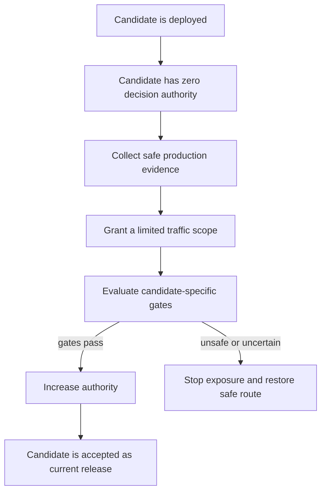
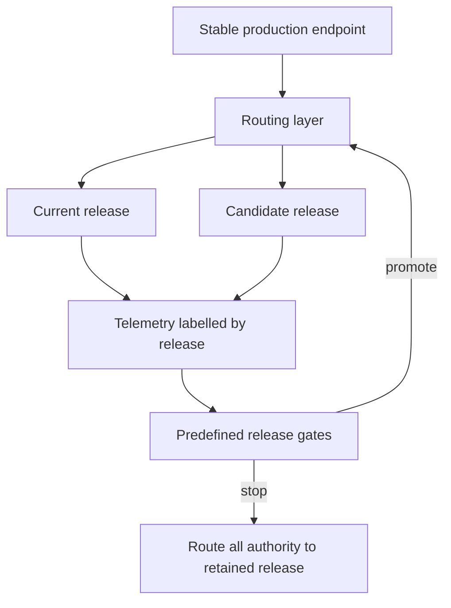
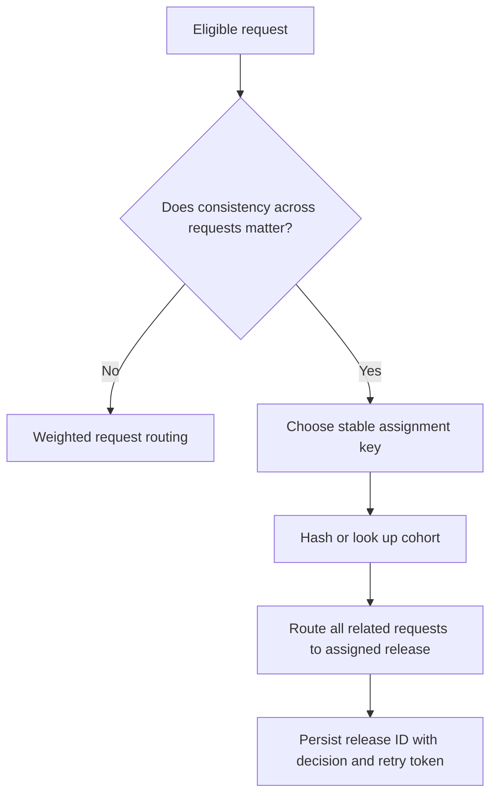
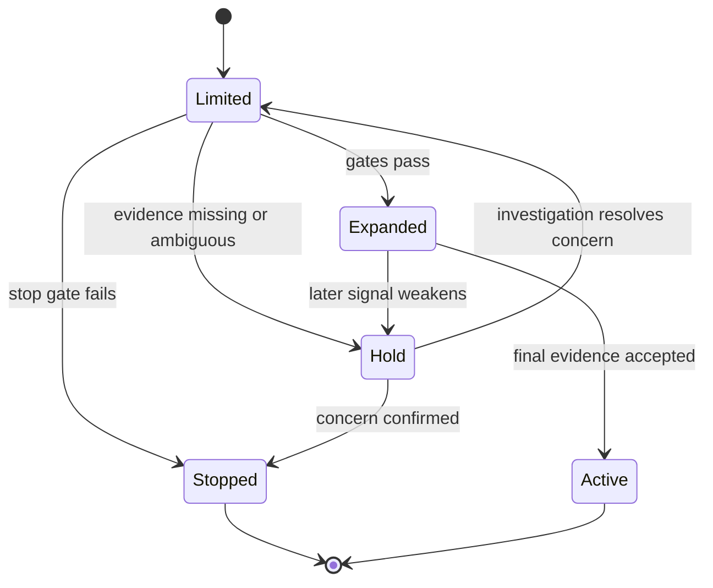

## Table of Contents

1. [Deployment And Production Exposure Are Separate Steps](#deployment-and-production-exposure-are-separate-steps)
2. [What Every Release Strategy Needs](#what-every-release-strategy-needs)
3. [How Blue-Green Deployment Switches Production Traffic](#how-blue-green-deployment-switches-production-traffic)
4. [How Canary Deployment Limits Initial Exposure](#how-canary-deployment-limits-initial-exposure)
5. [How Shadow Deployment Tests Without Controlling Decisions](#how-shadow-deployment-tests-without-controlling-decisions)
6. [How Rolling Deployment Replaces Instances Gradually](#how-rolling-deployment-replaces-instances-gradually)
7. [Choose Between Percentage Routing And Consistent User Assignment](#choose-between-percentage-routing-and-consistent-user-assignment)
8. [Keep Contracts Compatible During Mixed-Version Traffic](#keep-contracts-compatible-during-mixed-version-traffic)
9. [How Release Gates Decide Whether To Increase Traffic](#how-release-gates-decide-whether-to-increase-traffic)
10. [Use Release-Specific Signals For Automatic Rollback](#use-release-specific-signals-for-automatic-rollback)
11. [How Production Platforms Implement These Strategies](#how-production-platforms-implement-these-strategies)
12. [Choose And Combine Strategies From Product Risk](#choose-and-combine-strategies-from-product-risk)
13. [The Main Idea](#the-main-idea)
14. [References](#references)

## Deployment And Production Exposure Are Separate Steps
<!-- section-summary: Release strategies separate the presence of a candidate in production from the authority of its output over real decisions. -->

At a high level, a **release strategy** controls how a candidate—the proposed new release—moves from “running in production” to “trusted with production decisions.” Those are two different states. A model service can be fully deployed, healthy, and receiving copied requests while every user still receives the current release's answer.

This distinction gives a team room to gather evidence before granting wider authority. The candidate can prove that it loads on production hardware, accepts live request shapes, reaches the feature source, meets its latency budget, and produces plausible outputs. Real user exposure can then grow in reviewed steps.

ML systems benefit from this separation because several failures appear only after deployment. A model can pass offline evaluation and still encounter missing live features, unseen categories, numerical differences, slow inference, or a decision-policy mismatch. A new runtime image can also regress while the model remains unchanged.

Four common strategies control different risks:

- **Blue-green** prepares two complete serving stacks and controls the switch between them.
- **Canary** gives the candidate a limited share of live decision traffic.
- **Shadow** copies live requests to the candidate while the current release controls the product response.
- **Rolling deployment** replaces serving instances in bounded batches to preserve capacity.

These strategies can overlap. SageMaker AI, for example, implements canary traffic shifting as a mode of blue-green endpoint deployment. Kubernetes teams may use a blue-green or canary controller around workloads whose Pods still update in controlled ReplicaSets. The important question concerns which risk each mechanism controls.



## What Every Release Strategy Needs
<!-- section-summary: Current and candidate releases need a stable router, comparable telemetry, predefined gates, and a retained recovery path before traffic changes. -->

A release strategy starts before the first routing change. The team needs a current release that can continue serving, a candidate release with immutable identity, and a stable routing layer in front of both. Callers use the stable endpoint while the router changes the destination behind it.

### Identify The Complete Current And New Releases

The current and candidate labels should resolve to complete, compatible release units. Each unit includes the model, serving image, preprocessing, feature contract, API contract, decision policy, and runtime configuration. A label such as `candidate` is useful for people; an immutable version or digest is required for evidence and recovery.

Every request, prediction event, trace, and relevant metric should carry the resolved release ID. During mixed traffic, endpoint-level averages can hide a failing candidate because the healthy current release produces most of the data. Candidate and baseline views must remain separable.

### Keep Traffic Routing Separate From Model Loading

The router can be a managed ML endpoint, gateway, service mesh, load balancer, application assignment layer, or Kubernetes Service controlled by a rollout controller. Its job is to send a defined request scope to each ready release. The serving process still verifies which model it loaded and reports that identity.

Routing state also needs an observed view. A desired 10% canary is only an instruction. Operators should verify actual request counts by release, ready capacity behind each route, and the release identity returned through telemetry.

### Define Release Gates Before Sending Traffic

A gate states which evidence permits the next traffic step and which condition stops the rollout. It names an owner, an observation window, minimum sample coverage, and a recovery action. Missing telemetry should pause the release because an unobserved candidate is an unknown candidate.

### Keep A Tested Recovery Path

The current release needs enough capacity to receive full traffic again. Its image, model, feature access, policy, and caller compatibility must remain valid. Scaling the current stack down too early saves money and lengthens recovery.



## How Blue-Green Deployment Switches Production Traffic
<!-- section-summary: Blue-green keeps current and candidate stacks ready side by side so routing can switch between complete environments. -->

**Blue-green deployment** runs two complete production-capable stacks. Blue is the current release behind the stable route. Green is the candidate stack. The candidate first receives preview, synthetic, or replay traffic through an isolated route. Promotion switches the active route to green.

You can think of blue-green as preparing a replacement stage before moving the audience. It controls switch risk and recovery time. It provides less live decision evidence before the switch unless the team adds mirroring or weighted traffic.

### How Blue-Green Traffic Moves And What To Measure

Before promotion, real decision traffic stays on blue. Green can receive health probes, golden requests, internal traffic, or governed replays. That evidence verifies loading, contracts, feature access, security, performance, and telemetry. A routing switch then gives green full authority, or a separate traffic manager can introduce a smaller share first.

Users usually receive a response from one complete stack. During router propagation, a short overlap can occur, so both releases need compatible caller and downstream contracts. Session state should live outside the replicas or remain readable by both versions.

### Blue-Green Recovery Speed And Capacity Cost

Recovery sends the stable route back to blue. This can be fast if blue stays warm and retains full capacity. The team then verifies actual routing and the release ID behind new requests.

The main tradeoff is capacity. Running two full GPU fleets can be expensive or impossible under quota. A preview stack can start smaller, then scale before promotion. That lowers idle cost and adds scale-up time to the release path.

### Common Blue-Green Failure

A green stack can pass readiness while using the wrong feature view or policy version. Health probes prove service availability; release verification proves semantic identity. Another common failure is a shared, incompatible database or event-schema migration that removes blue's ability to resume. Blue-green recovery depends on backward-compatible shared dependencies.

Argo Rollouts implements blue-green on Kubernetes through an active Service and an optional preview Service. It changes Service selectors to point at the chosen ReplicaSet and supports pre-promotion analysis. Its documentation also calls out routing propagation delay and a specific downtime risk for blue-green with ALB Ingress, so the selected traffic integration needs its own verification.

## How Canary Deployment Limits Initial Exposure
<!-- section-summary: Canary routing lets a candidate control a bounded share of real decisions while the current release serves the remainder. -->

A **canary release** gives the candidate a small share of live traffic, evaluates it, and expands the share through planned steps. Candidate responses reach users in that share. The strategy therefore gathers real product evidence while limiting the number of affected decisions.

### How Canary Traffic Moves And What To Measure

The stable endpoint routes each eligible request to the current or candidate release. A plan might use 1%, 5%, 25%, and 100% steps, with evidence windows between them. Choose each step from request volume, risk, segment coverage, and label delay.

Canary traffic can measure service latency, errors, feature health, output distributions, immediate product signals, and eventually ground-truth quality. Candidate metrics must be compared with the current release over the same period. Traffic volume alone is insufficient if the canary misses an important device, geography, or customer segment.

### User Experience And Stable Assignment

A request-level percentage can send the same user to different releases on consecutive calls. That may be acceptable for independent predictions. A ranking or recommendation path often depends on earlier responses. Conversational sessions and cached decisions also carry state across calls. Workflows with retries may need to reproduce the original decision. The routing layer can hash an account or session key, or the application can pass a reviewed route choice.

### Canary Recovery Speed And Capacity Cost

Abort sets candidate decision traffic to zero and sends eligible work back to the current release. The current stack should retain capacity for that return. The candidate stack needs enough resources for its assigned share plus headroom, while the baseline may continue at full capacity for fast recovery. Cost sits between a small extra fleet and near-blue-green duplication as traffic grows.

### Common Canary Failure

Aggregated metrics often hide a bad canary. A 1% candidate with a 20% error rate adds only a small amount to an endpoint-wide average. Release labels and candidate-scoped queries prevent that masking. Another failure is early promotion from too few requests or poor segment coverage. The gate should require both time and evidence volume.

Databricks Model Serving can route one endpoint across served entities. A focused configuration can assign 90% to the current entity and 10% to the candidate:

```json
{
  "traffic_config": {
    "routes": [
      {"served_model_name": "current", "traffic_percentage": "90"},
      {"served_model_name": "candidate", "traffic_percentage": "10"}
    ]
  }
}
```

The endpoint configuration also defines each served entity and its immutable model version. Direct invocation of an individual served model bypasses the traffic setting, which is useful for explicit smoke tests and needs separate access control.

## How Shadow Deployment Tests Without Controlling Decisions
<!-- section-summary: Shadow traffic lets a candidate process live requests without allowing its response or side effects to control the product. -->

A **shadow release** copies selected live requests to the candidate. The current release still produces the response used by the product. Candidate output is recorded for comparison or discarded.

The defining rule is clear: shadow output has zero decision authority. Sending 10% of requests to a candidate and returning those answers is canary traffic. Copying 10% while returning only current-release answers is shadow traffic.

### How Shadow Traffic Moves And What To Measure

The router sends the original request to the current release and a copy to the candidate. A correlation ID connects the two results. The team can compare request compatibility, feature retrieval, errors, latency, resource use, prediction distribution, and per-request output differences.

Shadowing gives limited evidence for product impact because users never act on candidate output. A candidate ranking can be compared with the current ranking, while candidate-driven clicks and purchases are absent. Delayed ground truth can still score both predictions for tasks whose labels are independent of the action, though many product outcomes are influenced by what the user saw.

### User Experience And Shadow Recovery

Users receive the current response, so candidate quality has no direct product effect. Recovery stops request copying and removes or scales down the candidate. The baseline route stays unchanged.

### Shadow Resource And Privacy Cost

Shadow execution consumes compute, feature-store reads, network bandwidth, and telemetry capacity. Mirroring all traffic can nearly double inference load. A sampled shadow often provides enough coverage at lower cost.

The candidate receives real request data, so privacy controls still apply. Raw payloads and candidate outputs need an approved purpose, access, and retention. Hiding the response from users leaves the sensitivity of production data unchanged.

### Common Shadow Failure

Copied requests can repeat side effects. A shadow service must avoid charges, messages, writes, queue publication, and feedback events that belong to the production decision. Use read-only dependencies, a shadow execution flag enforced by downstream services, isolated output stores, or a pure scoring boundary.

SageMaker AI shadow variants copy a portion of requests, return only the production-variant response, and can log shadow responses for comparison. SageMaker shadow tests exclude several endpoint types, including serverless inference, asynchronous inference, multi-model endpoints, multiple-container endpoints, Marketplace containers, and Inf1 endpoints. Azure managed online endpoints also support mirroring. Its current managed-endpoint path mirrors to one deployment, caps the mirrored share at 50%, and excludes Kubernetes online endpoints.

## How Rolling Deployment Replaces Instances Gradually
<!-- section-summary: Rolling deployment replaces serving instances in bounded batches to preserve availability and limit temporary capacity. -->

A **rolling deployment** gradually replaces old instances with new ones. It primarily controls availability and capacity during replacement. It offers weaker traffic isolation than a canary driven by a dedicated router.

### How Rolling Traffic Moves And What To Measure

In a Kubernetes Deployment, a new ReplicaSet scales up while the old ReplicaSet scales down. The Service sends traffic to ready Pods across both sets during the mixed period. `maxUnavailable` limits how much desired capacity can be absent, and `maxSurge` limits extra Pods above the desired count.

```yaml
strategy:
  type: RollingUpdate
  rollingUpdate:
    maxUnavailable: 0
    maxSurge: 25%
```

This configuration keeps desired capacity available and permits temporary surge capacity. Readiness gates whether a new Pod joins service. Kubernetes tracks rollout progress and revisions, while application-specific prediction gates require additional telemetry and automation.

### User Experience And Version Compatibility

Users may reach either release during the update. Consecutive requests and retries can cross versions. The API, feature path, policy, shared state, and downstream events must support that mixed period. Workloads requiring stable assignment need a routing layer above the native Deployment.

### Rolling Recovery Speed And Capacity Cost

Rolling replacement uses less peak capacity than two full stacks. It can still exceed the desired replica count through `maxSurge`, and terminating Pods may temporarily increase observed resource use. Rollback reverses the Pod template revision and then replaces candidate Pods. Recovery can take longer than a route flip.

Kubernetes revision rollback restores the Deployment Pod template. External model aliases, feature versions, secrets, and policies need their own restoration path. A complete ML release identity should keep those dependencies tied to the image or desired-state record.

### Common Rolling Failure

A shallow readiness check can admit a candidate Pod that listens on a port before its model or critical assets are ready. Another failure appears if the old and new versions cannot share requests, state, or events. Rolling updates assume mixed-version compatibility.

Argo Rollouts adds a separate custom resource and controller for canary and blue-green strategies. With an integrated traffic manager, `setWeight` controls request traffic independently from replica count. Without that integration, Argo Rollouts approximates canary weight through whole Pod counts, which limits precision for small fleets. Unsuccessful analysis can abort the rollout.

## Choose Between Percentage Routing And Consistent User Assignment
<!-- section-summary: Weighted routing controls aggregate exposure, while stable cohort assignment preserves a consistent release for related requests. -->

**Percentage routing** asks the router to send an aggregate share of requests to each release. It is effective for limiting load and decision volume. The exact request choice may vary from call to call according to the platform's routing behaviour.

**Stable cohort assignment** selects a release from a durable key such as user, account, device, tenant, or session. Related requests stay on the same release for the assignment period. This protects consistency and keeps each user's outcomes associated with one release.

Consider a recommendation service. The first call builds a candidate-specific cache entry, and a retry reaches the current release. The response can conflict with the cached state. Stable assignment keeps both calls on one release. A stateless image classifier with independent requests may need only weighted routing.



Retries also need idempotency. The decision record can preserve the original release and result so a repeated request returns a consistent answer without repeating an external action. Stateful services should keep session state in a version-compatible store or route the complete session to one release.

Some managed endpoints support explicit targeting alongside weighted traffic. SageMaker AI `TargetVariant` selects a production variant and overrides random distribution. Azure callers can target an online deployment with the `azureml-model-deployment` header. These controls can implement internal tests or application-managed assignment, provided caller permissions and routing policy prevent arbitrary public selection.

## Keep Contracts Compatible During Mixed-Version Traffic
<!-- section-summary: Any strategy with overlapping releases depends on compatible caller contracts, features, policy, state, and downstream events. -->

Blue-green has a short propagation overlap. Canary and rolling releases intentionally run mixed versions. Shadowing sends the same request through two paths. All four strategies therefore need a compatibility plan.

### Keep API Contracts Compatible

Both releases should accept every caller version expected during the rollout. Additive request fields with safe defaults support gradual migration. Removing a field, changing its meaning, or changing response semantics needs a versioned contract and an ordered caller migration.

A response may also enter a cache, queue, database, or downstream API. Those consumers need to understand outputs from both releases during the overlap. Versioned events and tolerant readers help preserve that boundary.

### Keep Feature Contracts Compatible

The current and candidate models may expect different feature sets. The serving layer can retrieve both versions explicitly, or the feature platform can keep a backward-compatible view during the release. A mutable feature name that changes meaning under both models creates an unsafe mixed state.

Online and training semantics remain important. Each prediction event should record the resolved feature version and freshness status so candidate evidence can be separated from feature-path drift.

### Keep Policy And State Compatible

Policy turns a model score into a product action. Candidate and current releases may use different thresholds or fallback rules, so the policy version belongs in telemetry and recovery. Shared databases and caches need migrations that both releases can use. The same compatibility rule applies to session stores and queues.

An expand-and-contract migration is common: add the new field or event form, teach both releases to coexist, move traffic, and remove the old form after the recovery window. Destructive migration before full promotion can eliminate the retained release's ability to resume.

## How Release Gates Decide Whether To Increase Traffic
<!-- section-summary: Release gates combine fast operational signals with ML behaviour, segment coverage, and product evidence appropriate to the current traffic scope. -->

A release gate converts evidence into one of three actions: promote, hold, or stop. Strong gates compare candidate and current behaviour and state how much data is enough for the decision.

### Check Whether The New Release Can Serve Reliably

Service evidence includes request count, error rate, timeout rate, latency percentiles, saturation, queue depth, restart rate, and dependency failures. These signals arrive quickly and support automatic stops. They should use candidate release or deployment labels.

### Check That Inputs And Features Keep The Same Meaning

Input evidence covers schema failures, missing values, unseen categories, feature-source errors, fallback rate, and freshness. A healthy API can produce harmful predictions from stale or incompatible features. Compare candidate and baseline over the same traffic segments.

### Check Prediction Behaviour Before Labels Arrive

Prediction evidence includes score or class distribution, output bounds, uncertainty where defined, action rate, and candidate-baseline disagreement. These are diagnostic signals. A changed distribution can be expected after a deliberate model improvement, so reviewed bounds and segment context matter.

### Require Enough Traffic From Important Segments

A global sample count can hide empty or tiny subgroups. The gate should name important regions, device types, model routes, risk tiers, or customer groups and require enough observations from each. Unsupported segments can stay on the current release until their path is validated.

### Wait For Product Evidence At The Right Speed

Immediate product signals come from events close to the decision. A manual override can reveal operator disagreement, while a failed workflow or downstream rejection can reveal an unusable output. Empty results and support events provide other early warnings. Ground-truth quality can arrive hours, days, or months later. Fast signals can stop obvious harm. Delayed labels may require a longer limited release. Teams can also use retrospective evaluation or require another approval before full authority.



## Use Release-Specific Signals For Automatic Rollback
<!-- section-summary: Automatic rollback can contain fast, measurable failures only if alarms isolate the candidate and the retained release is complete. -->

**Automatic rollback** connects a measurable stop condition to a recovery action. It is effective for fast, objective failures such as high error rate, excessive latency, failed readiness, or feature-source errors. Ambiguous product movement and delayed labels often need a hold plus human review.

### Limit Alarms To The New Release

An endpoint-wide alarm can miss a small broken canary. Candidate metrics need a release, variant, deployment, or route dimension. The query should also verify that expected candidate traffic and telemetry are present. Zero errors from zero candidate requests provide no safety evidence.

SageMaker AI deployment guardrails connect CloudWatch alarms to canary, linear, blue-green, or rolling updates for supported endpoint types. The new endpoint configuration can be selected in alarm dimensions, and a tripped alarm during the monitoring period initiates rollback. Feature exclusions apply, so the deployment plan should verify endpoint support.

Argo Rollouts AnalysisRuns can query providers such as Prometheus. An unsuccessful analysis aborts the rollout. Accurate labels and queries remain the team's responsibility; a controller cannot repair mixed or missing telemetry semantics.

### Restore The Complete Compatible Release

Routing traffic away from the candidate is the first recovery step. The current release needs its original model and image. Its feature contract and decision policy must still resolve, and its secrets must still be accessible. Enough capacity must be ready for returning traffic. A registry alias change alone may leave candidate serving code or policy active.

After rollback, verify the route, actual request counts, active release IDs, feature health, and product recovery. Preserve candidate evidence for investigation.

### Repair Decisions Already Made

Rollback stops new candidate decisions. Earlier actions remain. A declined application may need review, a sent notification may need follow-up, and a published batch may need a corrected version. Decision IDs connect affected outcomes to remediation.

Automatic recovery should also have a failure path. If the current stack cannot regain capacity or the router update fails, incident handling needs a fallback such as a safe rule, delayed response, manual queue, or controlled service stop.

## How Production Platforms Implement These Strategies
<!-- section-summary: Managed ML endpoints and Kubernetes controllers provide different combinations of routing, mirroring, rollout automation, and recovery. -->

Industrial platforms use different resource names while implementing the same broad controls. Compare four capabilities: how the platform keeps current and candidate releases separate, how it routes or copies requests, how it labels candidate evidence, and how it restores traffic.

Similar strategy names can describe different mechanics. SageMaker AI canary traffic shifting operates inside its blue-green deployment guardrails. Azure documentation uses blue-green for multiple deployments with percentage allocation. Native Kubernetes rolling updates replace ready Pods and provide no model-aware release gate. Teams should verify the actual traffic and recovery semantics of the selected platform.

Amazon SageMaker AI endpoints support weighted production variants and explicit `TargetVariant` routing. Deployment guardrails provide blue-green all-at-once, canary, and linear modes, plus rolling updates and alarm-driven rollback for supported real-time and asynchronous endpoint configurations. Shadow variants copy requests and hide candidate responses, subject to documented endpoint exclusions.

Gemini Enterprise Agent Platform Endpoints hold multiple deployed models and a `traffic_split` map whose percentages add to 100. A model absent from that map receives zero endpoint traffic. This supplies weighted routing; the release pipeline still owns staged gates, cohort semantics, and complete-release recovery.

Azure Machine Learning managed online endpoints place multiple deployments behind a stable endpoint. They support percentage traffic allocation, direct deployment targeting, and mirrored traffic. Mirroring currently has a 50% cap, targets one deployment, and is unavailable for Kubernetes online endpoints.

Databricks Model Serving uses served entities and `traffic_config` routes. The endpoint can split traffic across models or versions, and callers can invoke a named served model directly. The application still needs release-labelled telemetry and a stable-assignment layer if related requests must stay together.

Native Kubernetes Deployments provide rolling replacement through ReplicaSets. `maxSurge` and `maxUnavailable` control capacity, readiness controls traffic admission, and rollout status reports progress. Revision history supports Pod-template rollback. Model-aware gates, shadow traffic, and precise weighted canaries sit outside the native Deployment controller. Argo Rollouts is an additional progressive-delivery controller. It adds blue-green and canary steps, plus analysis and traffic-manager integrations. Without a traffic manager, canary weights are approximated through replica counts.

## Choose And Combine Strategies From Product Risk
<!-- section-summary: The best strategy follows the failure to control, the evidence required, available capacity, and the speed of recovery. -->

Choose **blue-green** where a complete environment switch and fast route reversal matter most. It fits major runtime changes, isolated stacks, and releases whose full capacity can run in parallel. Budget and quota need room for overlap. Add a preview route, shadow copy, or small traffic split if real-input evidence is required before the switch.

Choose **canary** where the candidate needs real user and product evidence under a bounded blast radius. It works best with enough traffic for timely comparison, release-specific telemetry, representative segment coverage, and a baseline ready to recover full load.

Choose **shadow** where live inputs are valuable and candidate decisions are still too risky. It is especially useful for contract, latency, resource, and output-comparison evidence. It cannot establish the causal product effect of candidate decisions, and side effects must stay isolated.

Choose **rolling deployment** where availability and capacity efficiency during instance replacement are the main concerns. It suits compatible stateless services with strong readiness checks. Add a progressive-delivery controller or managed routing layer if the release needs candidate-specific traffic steps and gates.

Strategies often form one release path. A team can shadow a candidate to validate live compatibility, admit a stable internal cohort, start a small canary, expand through gates, and retain a blue stack for rapid recovery. The underlying instances may use rolling replacement inside each stack. Each layer should have one clear responsibility so recovery remains understandable.

Use the smallest design that controls the actual risk. A low-risk batch scorer may need versioned outputs and a publication gate instead of an online traffic router. A high-impact, low-latency decision service may justify shadowing, stable cohorts, canary analysis, and a warm blue recovery fleet.

## The Main Idea
<!-- section-summary: Release strategies control how a deployed candidate gains decision authority and how quickly the system can return to a compatible release. -->

A deployed candidate can remain harmless until routing grants its output authority. Blue-green controls the switch between complete stacks. Canary controls how many live decisions use the candidate. Shadow collects live-input evidence while the baseline controls the product. Rolling deployment controls capacity and availability during instance replacement.

Every strategy depends on immutable current and candidate releases behind a stable route. Release-labelled telemetry feeds predefined gates. Compatible mixed-version boundaries keep both paths usable, and a retained recovery release provides the stop path. Percentage exposure also needs stable assignment where users, sessions, and retries require consistent behaviour.

Strong release decisions combine service, feature, prediction, segment, and product evidence. Automatic rollback contains fast measurable failures after candidate-specific alarms fire. Complete recovery restores the whole decision path and follows up on actions already taken.

## References

- [Amazon SageMaker AI Deployment Guardrails](https://docs.aws.amazon.com/sagemaker/latest/dg/deployment-guardrails.html)
- [Amazon SageMaker AI Production Variants](https://docs.aws.amazon.com/sagemaker/latest/dg/model-ab-testing.html)
- [Amazon SageMaker AI Shadow Variants](https://docs.aws.amazon.com/sagemaker/latest/dg/model-validation.html)
- [Amazon SageMaker AI Shadow Test Exclusions](https://docs.aws.amazon.com/sagemaker/latest/dg/shadow-tests.html)
- [Gemini Enterprise Agent Platform: Deploy a Model and Split Endpoint Traffic](https://docs.cloud.google.com/gemini-enterprise-agent-platform/machine-learning/predictions/deploy-model-api)
- [Google Cloud: Gemini Enterprise Agent Platform Name Changes](https://docs.cloud.google.com/gemini-enterprise-agent-platform/vertex-ai-name-changes)
- [Azure Machine Learning Online Endpoints](https://learn.microsoft.com/en-us/azure/machine-learning/concept-endpoints-online)
- [Azure Machine Learning Safe Online Rollout](https://learn.microsoft.com/en-us/azure/machine-learning/how-to-safely-rollout-online-endpoints?view=azureml-api-2)
- [Databricks Model Serving Traffic Splits](https://docs.databricks.com/aws/en/machine-learning/model-serving/serve-multiple-models-to-serving-endpoint)
- [Kubernetes Deployments](https://kubernetes.io/docs/concepts/workloads/controllers/deployment/)
- [Kubernetes Rolling Update](https://kubernetes.io/docs/tasks/run-application/update-deployment-rolling/)
- [Argo Rollouts Canary Strategy](https://argo-rollouts.readthedocs.io/en/stable/features/canary/)
- [Argo Rollouts Blue-Green Strategy](https://argo-rollouts.readthedocs.io/en/stable/features/bluegreen/)
- [Argo Rollouts Analysis](https://argo-rollouts.readthedocs.io/en/stable/features/analysis/)
- [Argo Rollouts Traffic Management](https://argo-rollouts.readthedocs.io/en/stable/features/traffic-management/)
