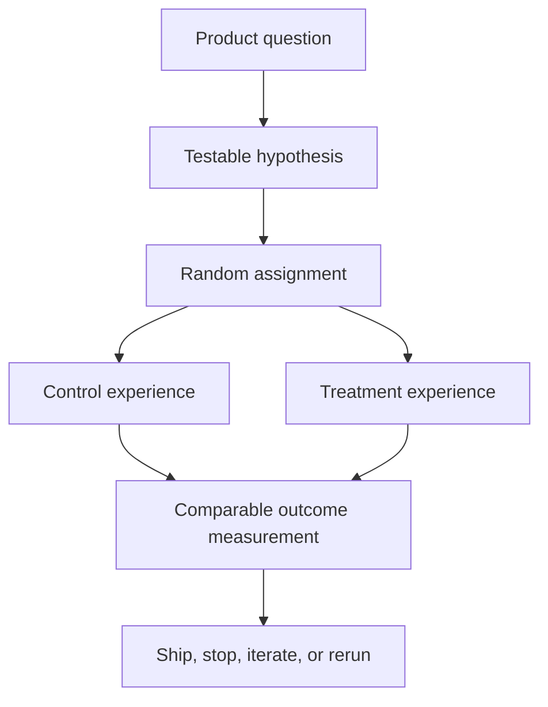
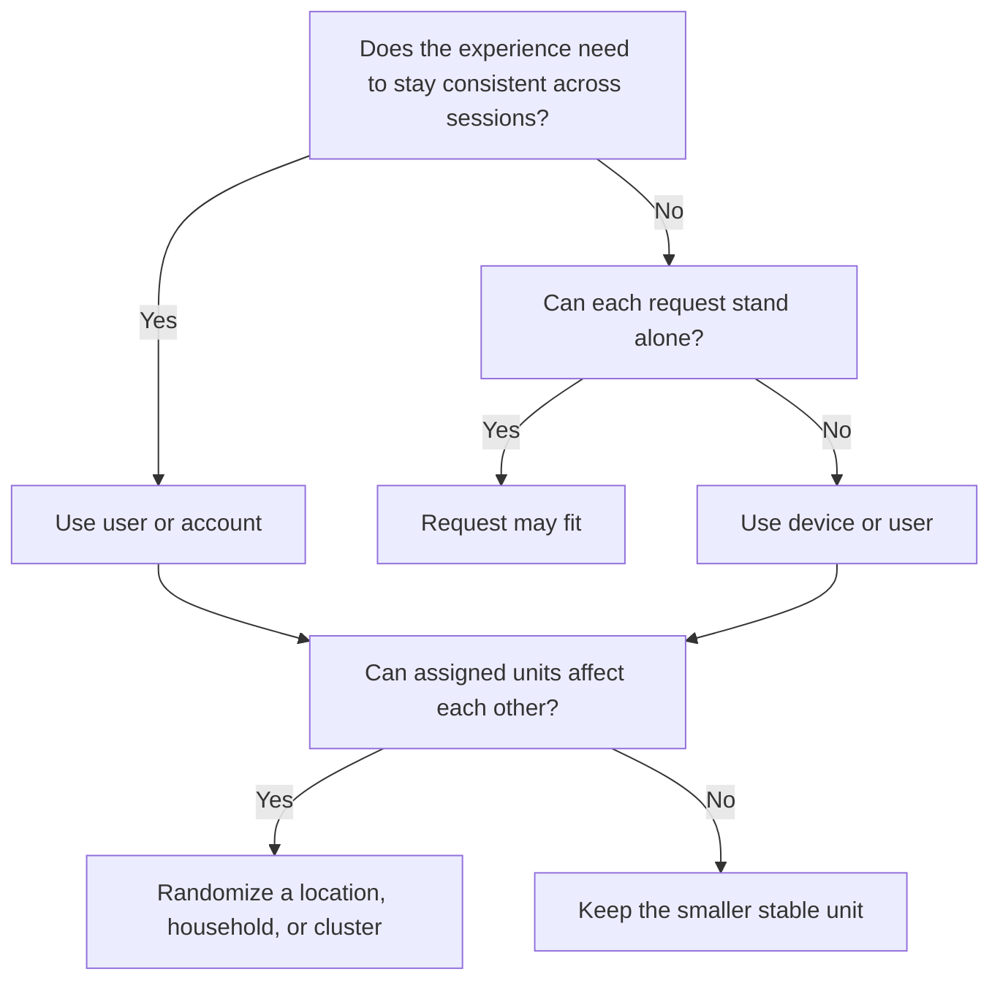
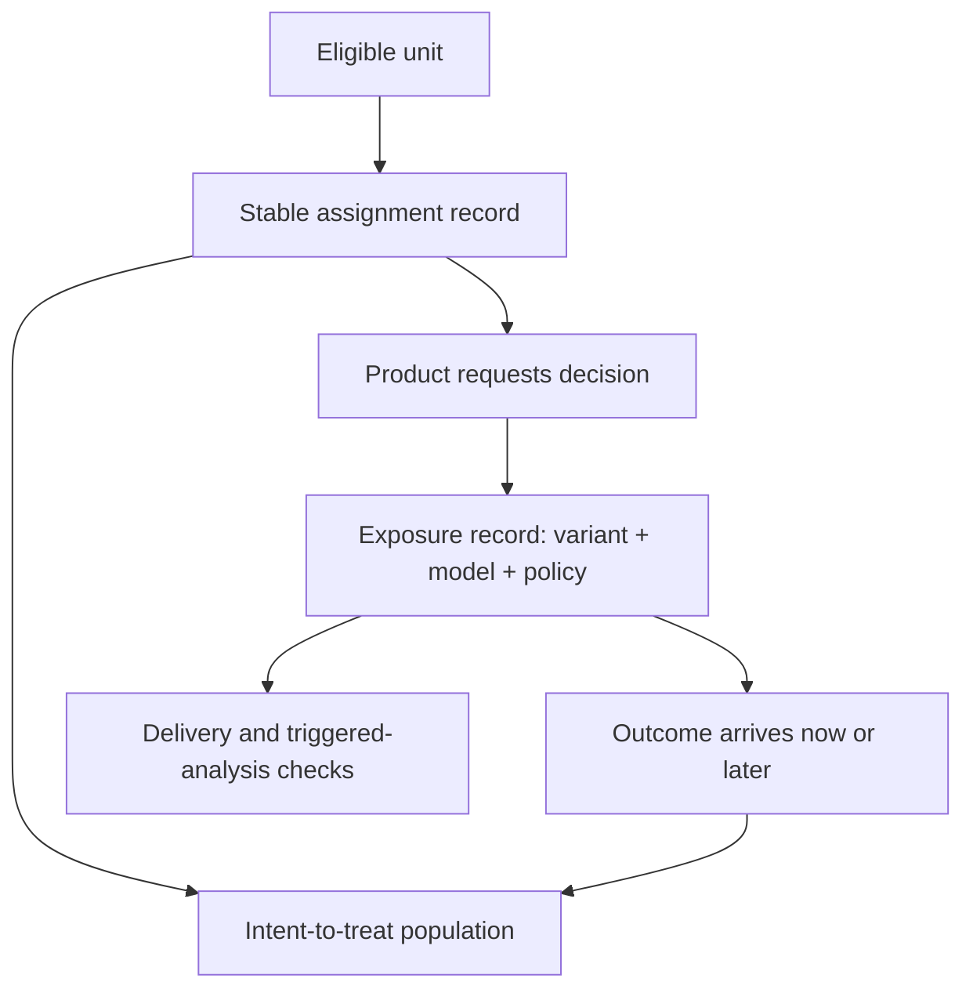
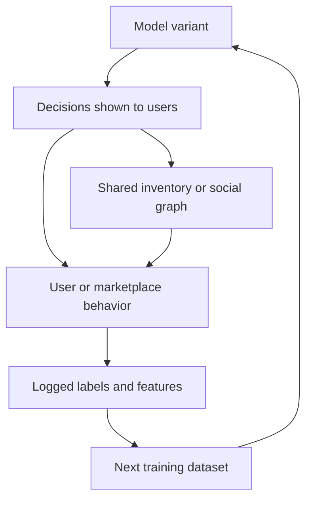
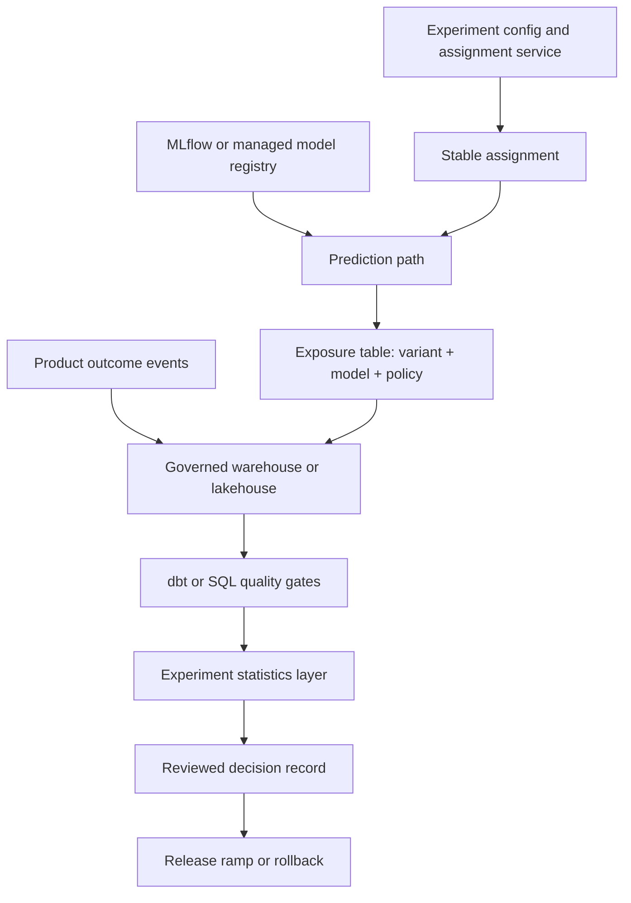

## Table of Contents

1. [What A/B Testing Can Tell You About Product Impact](#what-ab-testing-can-tell-you-about-product-impact)
2. [A Rollout and an Experiment Answer Different Questions](#a-rollout-and-an-experiment-answer-different-questions)
3. [The Terms Used In A Controlled Experiment](#the-terms-used-in-a-controlled-experiment)
4. [Choose What Gets Randomly Assigned](#choose-what-gets-randomly-assigned)
5. [Record Assignment, Exposure, And Outcome Separately](#record-assignment-exposure-and-outcome-separately)
6. [Choose Metrics That Can Decide The Experiment](#choose-metrics-that-can-decide-the-experiment)
7. [Handle Delayed Outcomes and Decision Policies](#handle-delayed-outcomes-and-decision-policies)
8. [Plan How Many Units And How Long To Run The Test](#plan-how-many-units-and-how-long-to-run-the-test)
9. [Analyze The Same Population That Was Randomized](#analyze-the-same-population-that-was-randomized)
10. [Check Experiment Integrity Before Reading The Result](#check-experiment-integrity-before-reading-the-result)
11. [Avoid Time Bias And Repeated-Testing Errors](#avoid-time-bias-and-repeated-testing-errors)
12. [Detect Interference And Feedback Loops](#detect-interference-and-feedback-loops)
13. [Build Reliable Assignment, Logging, And Outcome Pipelines](#build-reliable-assignment-logging-and-outcome-pipelines)
14. [Write the Decision Rules Before Launch](#write-the-decision-rules-before-launch)
15. [Know Where Randomized Testing Is Inappropriate](#know-where-randomized-testing-is-inappropriate)
16. [The Main Idea](#the-main-idea)
17. [References](#references)

## What A/B Testing Can Tell You About Product Impact
<!-- section-summary: An ML A/B test estimates whether a model-driven product change caused a meaningful change in user or business outcomes. -->

Suppose a team wants to know whether a new ranking model improves successful searches rather than merely changing an offline score. An **A/B test** makes a fair comparison between the current and candidate product experiences. Eligible users, accounts, devices, or other units are randomly placed into groups, and the team compares real outcomes.

The word **causal** matters here. A causal question asks whether the candidate experience produced the observed change. A dashboard may show that users served by a new ranking model purchased more items. That pattern alone leaves several other explanations open: those users may come from a higher-spending region, the comparison may span different days, or a marketing campaign may have reached one group first. Random assignment gives every eligible unit the same chance of entering either group, so these background differences tend to balance.

Consider a candidate search-ranking model with a higher offline relevance score. The product decision is still unresolved. Users may find answers faster, scroll through more irrelevant results, abandon the page, or receive slower responses. The experiment turns that uncertainty into a precise question.

**Experiment question:** Does the candidate ranker increase successful searches per eligible user while search abandonment, harmful-result reports, and response latency remain inside agreed limits?

The model is one part of the change. The experiment evaluates the experience created by the model, its features, serving path, thresholds, fallbacks, and surrounding product policy.



## A Rollout and an Experiment Answer Different Questions
<!-- section-summary: A rollout limits release risk, while a controlled experiment estimates product impact. -->

A **rollout** asks, “Can we deliver this change safely?” A **controlled experiment** asks, “Did this change improve the product?” Both practices may split traffic, yet the reason for the split is different.

During a canary rollout, a team may send a small percentage of requests to a candidate endpoint and watch errors, latency, saturation, and rollback signals. That protects production from a faulty container, incompatible feature lookup, or expensive inference path. The canary can pass every operational check even if the candidate produces worse decisions.

A baseline-versus-canary dashboard also gives weak causal evidence. Canary traffic may come from one cluster, one region, or one time window. Returning users may cross between versions. A weighted endpoint can route one request to the candidate and the next request from the same person to the baseline. These differences make the groups harder to compare as product populations.

An A/B test adds the missing experimental controls: a declared population, random assignment, stable group membership, exposure records, outcome definitions, and a statistical decision plan. The release system still owns health checks and rollback. The experiment system owns the product comparison.

Cloud endpoints from SageMaker AI, Gemini Enterprise Agent Platform Endpoints, Azure Machine Learning, and Databricks Model Serving can distribute requests across deployments. Their traffic weights are valuable delivery controls. Stable user cohorts, exposure-to-outcome joins, and statistical analysis still require an experiment layer or equivalent application logic.


*Rollout controls limit operational risk; experiment controls create comparable product populations and measure whether the candidate caused a meaningful outcome.*

## The Terms Used In A Controlled Experiment
<!-- section-summary: A small set of terms describes who enters the experiment, what changes, what is measured, and how a decision is made. -->

Experiment discussions get confusing if “user,” “request,” and “exposure” are used as though they mean the same thing. The following terms describe separate parts of the design.

### Treatment and control

The **control** is the current product experience. The **treatment** is the candidate experience under evaluation. For a fraud model, control might use the current model and review threshold; treatment might use a new model with a recalibrated threshold.

The comparison should capture the full behavior that differs. If treatment changes the model and threshold together, the experiment estimates their combined product effect. It cannot later prove how much came from each component without another experiment or a factorial design.

### Random assignment and the experimental unit

**Random assignment** uses chance to place eligible units into control or treatment. The **experimental unit**, also called the randomization unit, is the entity being assigned: a request, user, device, account, store, city, or cluster.

Randomization creates comparable groups in expectation. Stable assignment keeps the selected experience consistent for the chosen unit. These are related requirements. A random result regenerated independently on every request can create a 50/50 traffic split while giving a single user a mixed experience.

### Exposure and outcome

An **assignment** says which group a unit belongs to. An **exposure** says that the unit actually encountered the changed experience. An **outcome** is the later event or measurement used to judge impact.

For a recommendation test, opening the application can create an assignment. Rendering the recommendation rail creates an exposure. A saved item, skip, purchase, or later return visit creates an outcome. Keeping these events distinct reveals whether treatment was delivered and whether the outcome feed arrived.

### Hypothesis, primary metric, and guardrail

A **hypothesis** predicts a direction and a reason: “The candidate ranker will increase successful sessions because it places relevant results earlier.” The **primary metric** is the main numerical outcome used for the decision. A **guardrail metric** protects an area where harm would block launch, such as severe-error rate, cancellation rate, fairness disparity, or p95 latency.

An **analysis population** defines whose outcomes enter the estimate. This choice deserves a written rule before launch because filtering people after observing their behavior can destroy the balance created by randomization.

## Choose What Gets Randomly Assigned
<!-- section-summary: The randomization unit should match the boundary across which the treatment can remain consistent and outcomes can remain reasonably independent. -->

The best randomization unit follows the product interaction. Choose it by asking two questions: “Which entity needs a consistent experience?” and “Can one assigned entity affect another entity’s outcome?”

### Request, user, and device units

Request-level assignment can fit a stateless infrastructure optimization where each request stands alone. It usually fits poorly for personalization. A person who sees different recommendation policies across consecutive page loads may adapt to both, creating **crossover** between variants.

User-level assignment fits signed-in products where behavior spans sessions and devices. Device-level assignment supports anonymous experiences, although the same person may use several devices and several people may share one device. A stable cookie or platform-generated stable identifier keeps an anonymous device in one group.

### Account, location, and cluster units

Account-level assignment fits team products because people inside one account share settings, workflows, and outcomes. Location-level assignment can fit store operations, logistics, or marketplace supply. Cluster assignment groups connected users, households, classrooms, or geographic areas if their actions influence each other.

Larger units reduce contamination, yet they also reduce the number of independent observations. Ten thousand users inside twenty stores produce twenty randomized store units. The calculation therefore has twenty independent units, even though the experiment observes many more people. The sample-size calculation and statistical method must use the level of randomization.



The unit choice should also account for repeated sessions, shared inventory, and social effects. A pricing experiment can change remaining inventory for later shoppers. A feed-ranking experiment can change what creators produce. A fraud model can alter attacker behavior. Each case creates links between units that a simple user-level design may miss.

## Record Assignment, Exposure, And Outcome Separately
<!-- section-summary: Trustworthy experiments preserve stable assignment and record the actual product exposure that connects a model release to later outcomes. -->

Stable assignment is the foundation. You can think of it as attaching a durable experiment label to the chosen unit. A person assigned to treatment on one visit receives treatment again on later visits. This consistency protects the product experience and keeps behavior connected to one experimental group.

A common implementation hashes an experiment identifier together with a persistent unit identifier, then maps the result into a bucket. The hash converts the two identifiers into a repeatable number. A percentage range maps that number to control or treatment, so the same inputs return the same group.

```python
from hashlib import sha256

def variant(experiment: str, unit_id: str) -> str:
    digest = sha256(f"{experiment}:{unit_id}".encode()).digest()
    bucket = int.from_bytes(digest[:8], "big") % 10_000
    return "treatment" if bucket < 5_000 else "control"
```

Production teams commonly obtain this behavior from Statsig, LaunchDarkly, Optimizely, or an internal allocation service. A managed service adds reviewed targeting, persistent assignment, holdouts, audit history, and experiment health checks. An internal allocator carries the same responsibilities and needs careful testing around salts, allocation changes, identifier loss, and concurrent experiments.

Assignment alone cannot prove delivery. A user may be assigned to treatment and never open the screen that calls the model. The application should write an exposure at the point where the model-driven result reaches the product experience. That record should include:

- experiment and variant identity;
- randomization-unit identifier or governed join key;
- exposure time and product surface;
- model registry name and immutable model version;
- release, feature, and policy versions;
- prediction or trace identifier for operational investigation.

Model identity matters because an endpoint name can move between artifacts during a long-running experiment. Policy identity matters because a threshold, eligibility rule, post-ranking filter, or fallback can change the decision users receive even if the model artifact stays fixed.

The join key should support outcome analysis without copying unrestricted personal data into every telemetry system. A governed pseudonymous identifier, documented retention policy, and access-controlled mapping table are common choices.




*Assignment records preserve the randomized population, exposure records prove delivery, and outcome records become decision evidence only after join and integrity checks pass.*

## Choose Metrics That Can Decide The Experiment
<!-- section-summary: A primary metric expresses the intended benefit, while guardrails and counter-metrics reveal unacceptable costs. -->

A metric is a rule for turning events into a number. “Engagement” is a topic. “Completed searches per eligible user during seven days after assignment” is a metric definition. The second version identifies the unit, event, denominator, and time window.

### Choose one primary metric

The primary metric should represent the product benefit named in the hypothesis. For a candidate recommendation model, click-through rate may react quickly, yet clicks can reward curiosity or misleading content. Saves per eligible user, completed listening sessions, or retained users may reflect the intended value more closely. The right choice depends on the product decision.

Selecting one primary metric protects the team from searching a large scorecard for any positive result. Secondary metrics can explain how behavior changed. They should carry labels such as diagnostic, supporting, or exploratory so their role stays clear.

### Add guardrails and counter-metrics

Guardrails define unacceptable harm. A conversion model could improve purchases while increasing refunds. A support-routing model could reduce handling time while increasing reopened tickets. A fraud model could reduce losses while blocking too many legitimate customers.

A **counter-metric** captures the plausible downside created by optimizing the primary outcome. If the primary metric rewards clicks, long-term satisfaction and complaint rate can counter short-term click seeking. If the primary metric rewards automated approvals, later default rate and manual-review burden can reveal transferred risk.

Service metrics belong in the same plan. Error rate, timeout rate, p95 or p99 latency, resource saturation, and inference cost protect the delivery path. Prometheus, OpenTelemetry, and cloud monitoring can alert on these signals during the run. Product outcomes usually come from warehouse or lakehouse events and mature on a slower schedule.

### Decide which segments can block launch

Aggregate improvement can hide local harm. Prewritten segment checks might cover new users, device classes, regions, product tiers, or groups relevant to fairness and accessibility. A team should name decision-gating segments in advance. Post-hoc slicing remains valuable for investigation, though repeated searching across dozens of segments raises the chance of a lucky pattern.

## Handle Delayed Outcomes and Decision Policies
<!-- section-summary: ML outcomes often arrive after the prediction, so experiments need explicit attribution windows, maturity rules, and policy identity. -->

Many ML decisions receive their ground truth later. A recommendation impression can lead to a purchase hours later. A credit decision may mature over months. A predictive-maintenance alert may need the next inspection. An experiment readout is premature until the relevant outcome window has closed for the included cohort.

An **attribution window** defines how long an outcome can be linked to an assignment or exposure. A seven-day purchase metric, for example, counts qualifying purchases from assignment through the next seven days. Every analyzed unit needs the same opportunity to produce that outcome. Units assigned near the end of enrollment must finish their window before the final readout.

Missing outcomes need a semantic rule. No purchase event can correctly mean zero purchases if event collection is healthy. A missing payment feed, incomplete label join, or absent regional export means unknown data. Converting telemetry failure into zero silently biases the result. Data freshness, join coverage, and event-volume checks should distinguish an absent user action from a failed measurement.

The user-facing treatment may also include policy around the model score:

```text
features -> model score -> threshold -> business rule -> fallback -> action
```

Suppose treatment uses a new fraud model while a risk-policy service changes the review threshold halfway through the test. The resulting effect mixes two changes, so attribution is difficult. Freeze decision-policy versions during the experiment, include them in exposure logs, or design separate randomized factors under statistical review.

## Plan How Many Units And How Long To Run The Test
<!-- section-summary: Sample size depends on the smallest valuable effect, normal outcome variation, desired power, error tolerance, and randomization unit. -->

An experiment needs enough independent units to distinguish a meaningful effect from ordinary variation. Three planning terms make this practical.

The **minimum detectable effect (MDE)** is the smallest change the experiment is designed to detect. Teams should tie it to a product decision. A 0.1 percentage-point gain may be valuable at enormous scale and irrelevant for a small workflow with high operating cost.

**Statistical power** is the probability that the planned test detects an effect at least as large as the MDE if that effect exists. **Significance level**, often written as alpha, controls the planned false-positive tolerance. Higher power, smaller MDE, noisier metrics, and stricter error tolerance all require more units.

For a simplified two-arm test of a conversion rate, assume a 10% baseline, a one percentage-point MDE, 5% two-sided alpha, 80% power, and equal groups. A normal approximation gives:

```text
n per arm ≈ 2 × (1.96 + 0.84)² × 0.10 × 0.90 ÷ 0.01²
          ≈ 14,100 independent units
```

This planning illustration provides no universal sample count. Unequal allocation, clustered randomization, repeated observations, rare events, variance reduction, and heavy-tailed revenue can change the requirement substantially. Teams commonly use their experiment platform, a reviewed statistics library, or simulation over historical unit-level data.

Duration adds product context that sample size alone misses. The run should cover relevant weekly cycles, delayed-outcome maturity, and expected learning or novelty. A high-traffic site may collect the planned sample in one afternoon while still producing a misleading result if weekday and weekend behavior differ.

## Analyze The Same Population That Was Randomized
<!-- section-summary: Intent-to-treat analysis preserves the balance created by random assignment and measures the effect of offering the treatment. -->

The usual primary analysis follows **intent to treat (ITT)**. Every eligible unit stays in its assigned group, including units that never reached the model-driven surface. ITT estimates the effect of assigning or offering the candidate experience under real product usage.

This can feel counterintuitive. If half the assigned users never open the relevant screen, the measured effect is diluted. That dilution is often the product truth: shipping the feature to the whole eligible population produces impact only through people who encounter it.

Filtering to units that actually received treatment creates a **treatment-on-the-treated (ToT)** or triggered view. This view can estimate the effect among reached units only under stronger assumptions. Exposure itself may depend on treatment. A faster recommendation model could make the page render, while a slower control could cause abandonment before the exposure event. Keeping only observed exposures would then compare different types of users.

A trustworthy triggered analysis uses a qualification rule that can be evaluated for both groups, often through counterfactual trigger logging, and verifies that excluded units behave like an A/A comparison. ITT remains the default decision estimate. ToT serves a clearly stated secondary purpose with statistical review.

The SQL shape below preserves assigned units. It also keeps exposure coverage visible as a diagnostic:

```sql
SELECT
  a.variant,
  COUNT(*) AS assigned_units,
  COUNT(DISTINCT e.unit_id) AS exposed_units,
  AVG(COALESCE(o.completed_actions, 0)) AS actions_per_assigned_unit
FROM experiment_assignments AS a
LEFT JOIN first_exposures AS e
  ON a.experiment_id = e.experiment_id
 AND a.unit_id = e.unit_id
LEFT JOIN mature_outcomes AS o
  ON a.experiment_id = o.experiment_id
 AND a.unit_id = o.unit_id
WHERE a.experiment_id = :experiment_id
GROUP BY a.variant;
```

Here, absent completed-action events count as zero only after the pipeline has verified outcome-feed completeness. Exposure coverage appears beside the ITT metric so delivery failures stay visible.

## Check Experiment Integrity Before Reading The Result
<!-- section-summary: Assignment balance, identifier integrity, exposure delivery, outcome freshness, and join coverage must pass before a metric difference is trusted. -->

The first experiment readout should test the evidence itself. A polished lift chart built from broken assignments or missing events can create a confident wrong decision.

### Sample ratio mismatch

**Sample ratio mismatch (SRM)** means the observed group counts differ more than random variation would reasonably explain from the planned allocation. A 50/50 design that repeatedly records a large imbalance may have an assignment bug, identifier loss, eligibility difference, cache problem, logging filter, or warehouse transformation error.

SRM is an alarm about experiment validity. The team should pause interpretation, trace counts from allocator through exposure stream and analytical table, repair the cause, and restart or invalidate affected data according to the analysis plan.

### Crossover and identifier failures

Crossover occurs if one unit appears in several variants. Common causes include changing from device ID to user ID, inconsistent salts between client and server, lost cookies, and allocation changes without persistent assignment. Experiment diagnostics should report crossover rate and assignment reasons.

### Logging and join failures

Exposure counts should reconcile with product traffic. Outcome events need the same unit identifier or an approved mapping. Freshness checks should compare expected arrival time with the latest partition. Join coverage should be reviewed by variant and major segment, because a region-specific export failure can create a false treatment effect.

dbt data tests fit this layer well. Built-in `unique`, `not_null`, `accepted_values`, and `relationships` assertions cover basic contracts; custom SQL tests can fail on duplicate assignments, crossovers, stale partitions, unexpected allocation ratios, or low exposure-to-outcome coverage.

```yaml
models:
  - name: experiment_assignments
    columns:
      - name: assignment_key
        data_tests: [unique, not_null]
      - name: variant
        data_tests:
          - accepted_values:
              arguments:
                values: [control, treatment]
```

## Avoid Time Bias And Repeated-Testing Errors
<!-- section-summary: Novelty, learning, peeking, and multiple comparisons can make an early positive result look stronger than the lasting effect. -->

User behavior can change during a test. A **novelty effect** is an early response to a new experience that fades. A **learning effect** grows as users discover how to use a new workflow. Plotting treatment effect by enrollment cohort and time since first exposure can reveal both patterns. The planned duration should cover the period needed for the product claim.

Repeatedly checking a fixed-horizon test and stopping at the first favorable result raises the false-positive rate. This practice is often called **peeking**. Safety monitoring can continue throughout the run because harm needs rapid action. Success decisions should follow the planned maturity and sample rule, or use a preselected sequential method whose boundaries account for repeated looks.

Multiple metrics create a related problem. Twenty independent tests at a 5% threshold provide many chances for a lucky positive result. A clear primary metric keeps the main decision focused. Experiments with several primary outcomes or variants need a documented multiplicity procedure, such as family-wise error or false-discovery control, selected before analysis.

Concurrent launches can also contaminate interpretation. Experiment layers or mutual-exclusion groups prevent units from entering combinations with known interactions. Teams should record overlapping experiment assignments so unexpected interactions can be investigated.

## Detect Interference And Feedback Loops
<!-- section-summary: Some ML treatments change the environment shared by control and treatment, weakening the assumption that units act independently. -->

Some products connect participants through shared resources or direct interaction. A change delivered to one participant can therefore alter the experience available to someone in the other group. **Interference** is the name for this cross-group effect.

Standard A/B analysis assumes one unit’s assignment has no effect on another unit’s outcome. Interference weakens that assumption, so the measured difference may combine direct treatment impact with changes to the shared environment.

In a marketplace, a treatment that ranks certain listings higher changes inventory available to control users. In a social product, ranking changes affect which posts receive reactions, which then changes what creators publish. In delivery operations, a route-optimization treatment reallocates drivers shared by both groups. The control environment has now been altered by treatment.

Possible responses include cluster randomization, geographic switchbacks, time-based switchback experiments, marketplace-specific estimators, or a design that measures equilibrium effects. Each method changes the statistical assumptions. A team should involve an experimentation specialist early instead of applying a user-level test to a connected system.

ML feedback loops add another layer. Treatment-generated clicks may enter the next training dataset, causing future models to learn from behavior created by the experiment. Preserve variant and policy identity in training events, define whether experimental data can enter retraining, and keep a stable holdout if the long-term effect matters.



## Build Reliable Assignment, Logging, And Outcome Pipelines
<!-- section-summary: Industrial experiments connect assignment, immutable release identity, governed event tables, data-quality tests, statistical analysis, and decision records. -->

An industrial experiment is a small production system. Its job is to preserve the causal comparison from product configuration through the final decision. Every layer carries a different piece of evidence, and those pieces must join through stable identities.

The control plane defines eligibility, allocation, unit type, metrics, and stop rules. The request path obtains a stable assignment. The product logs actual exposure with immutable release identity. A governed warehouse or lakehouse joins outcomes after their maturity window. A statistics layer estimates effects and uncertainty. A decision record connects the result to the next release action.



A representative stack might use Statsig for assignment and experiment analysis, MLflow Model Registry for immutable model identity, product events in BigQuery, Snowflake, or a Databricks lakehouse, and dbt for analytical models and data tests. LaunchDarkly, Optimizely, or an internal allocator can fill the assignment role. A managed cloud registry can fill the registry role. The architecture matters more than matching one vendor combination.

Operational ownership should be explicit:

- product and data science own the hypothesis, MDE, metrics, and segment interpretation;
- application engineering owns assignment placement and true exposure logging;
- ML engineering owns model, feature, policy, and release identity;
- data engineering owns event contracts, maturity, joins, and quality checks;
- an experimentation or statistics owner reviews power, estimators, and decision validity;
- the release owner executes ramp, rollback, or follow-up work.

This separation prevents an experiment dashboard from becoming the only evidence. Raw contracts, transformations, model lineage, analysis version, and decision history remain inspectable.

## Write the Decision Rules Before Launch
<!-- section-summary: A prewritten analysis plan states what success, harm, inconclusive evidence, and invalid evidence will trigger. -->

A **pre-registration** or analysis plan records the important choices before results can influence them. It can be a reviewed configuration, experiment brief, or versioned document. The plan should include:

- product hypothesis and eligible population;
- randomization unit, allocation, and assignment persistence;
- control and treatment release identities;
- primary metric, guardrails, counter-metrics, and attribution windows;
- MDE, power target, estimator, duration, and stopping rule;
- decision-gating segments and multiplicity method;
- evidence-quality gates such as SRM, crossover, freshness, and join coverage;
- immediate harm-stop thresholds and rollback owner;
- actions for win, loss, inconclusive evidence, and invalid evidence.

A win can lead to a gradual release ramp with continued service and product monitoring. A loss can keep control in place and use diagnostic evidence to guide another candidate. An inconclusive result may call for more units, a lower-variance metric, or a redesigned treatment. Invalid evidence calls for instrumentation repair and a fresh run; extending corrupted data rarely restores randomization.

Decision thresholds should express practical value as well as statistical uncertainty. A tiny effect can be statistically distinguishable at large scale while remaining too small to justify inference cost or operational complexity. A wide interval can include both valuable benefit and unacceptable harm, which supports an inconclusive decision.

## Know Where Randomized Testing Is Inappropriate
<!-- section-summary: Some decisions carry legal, ethical, privacy, or safety consequences that require stronger governance or a different evaluation design. -->

Random assignment is a method; it grants no automatic permission to expose people to avoidable risk. High-impact decisions involving health, employment, credit, housing, education, public benefits, or physical safety need legal, risk, domain, and ethics review. Existing protections, known beneficial treatment, informed-consent duties, and anti-discrimination obligations may rule out a conventional control group.

The experiment should minimize personal data, limit access, document retention, and evaluate whether the randomization unit or outcomes reveal sensitive attributes. Guardrails need enough authority to stop harm immediately. Some risks are too severe or too delayed for a live test to manage safely.

Alternatives include retrospective causal analysis, shadow evaluation, simulation, expert review, phased observational studies, or testing a lower-risk workflow component. The NIST AI Risk Management Framework offers a useful governance structure through its Govern, Map, Measure, and Manage functions. Organizational policy and applicable law determine the final route.

## The Main Idea
<!-- section-summary: A trustworthy ML A/B test connects random assignment to real exposure, mature outcomes, evidence checks, and a prewritten product decision. -->

ML A/B testing estimates whether a model-driven product change caused a meaningful outcome. The framework starts with a causal question, chooses a stable randomization unit, records assignment and actual exposure, waits for mature outcomes, checks evidence integrity, and analyzes the population defined in advance.

Release controls and experiments work together. Canary, blue-green, shadow, and weighted routing protect delivery. Randomized assignment, exposure logs, outcome contracts, and statistical rules establish product impact. The final result should support one clear action: ship carefully, keep control, iterate, or rerun with repaired evidence.

The practical lesson is to treat the experiment record as part of the release evidence. A model registry can identify the candidate artifact, yet the decision also needs its assignment rule, policy version, exposure coverage, outcome window, data-quality results, uncertainty estimate, and approved follow-up action.


*A trustworthy decision follows the plan written before results: validate the evidence, estimate practical value and uncertainty, then take the action assigned to that outcome.*

## References

- [Statsig: Experiments overview](https://docs.statsig.com/experiments/overview)
- [Statsig: Raw experiment events and unit identifiers](https://docs.statsig.com/metrics/raw-events)
- [Statsig: Server persistent assignment](https://docs.statsig.com/server/concepts/persistent_assignment)
- [Statsig: Experiment health checks](https://docs.statsig.com/experiments/monitor)
- [LaunchDarkly: Continuous experiments](https://launchdarkly.com/docs/fed-docs/guides/cheatsheets/continuous-experiments)
- [MLflow: Model Registry](https://mlflow.org/docs/latest/ml/model-registry/)
- [dbt: Data tests](https://docs.getdbt.com/docs/build/data-tests)
- [Microsoft Research: Diagnosing sample ratio mismatch](https://www.microsoft.com/en-us/research/publication/diagnosing-sample-ratio-mismatch-in-online-controlled-experiments-a-taxonomy-and-rules-of-thumb-for-practitioners/)
- [Microsoft Research: Trustworthy analysis of online A/B tests](https://www.microsoft.com/en-us/research/publication/trustworthy-analysis-of-online-a-b-tests-pitfalls-challenges-and-solutions/)
- [Microsoft Research: Post-experiment patterns and triggered analysis](https://www.microsoft.com/en-us/research/group/experimentation-platform-exp/articles/patterns-of-trustworthy-experimentation-post-experiment-stage/)
- [Microsoft Research: External validity and novelty effects](https://www.microsoft.com/en-us/research/articles/external-validity-of-online-experiments-can-we-predict-the-future/)
- [Microsoft Research: Metric interpretation pitfalls](https://www.microsoft.com/en-us/research/publication/a-dirty-dozen-twelve-common-metric-interpretation-pitfalls-in-online-controlled-experiments/)
- [NIST: Selecting sample sizes](https://www.itl.nist.gov/div898/handbook/prc/section2/prc222.htm)
- [NIST: AI Risk Management Framework](https://www.nist.gov/itl/ai-risk-management-framework)
- [Amazon SageMaker AI: Test models with production variants](https://docs.aws.amazon.com/sagemaker/latest/dg/model-ab-testing.html)
- [Gemini Enterprise Agent Platform: Deploy a Model and Split Endpoint Traffic](https://docs.cloud.google.com/gemini-enterprise-agent-platform/machine-learning/predictions/deploy-model-api)
- [Google Cloud: Gemini Enterprise Agent Platform Name Changes](https://docs.cloud.google.com/gemini-enterprise-agent-platform/vertex-ai-name-changes)
- [Azure Machine Learning: Managed online endpoints](https://learn.microsoft.com/en-us/azure/machine-learning/concept-endpoints-online)
- [Databricks Model Serving: Serve multiple models from one endpoint](https://docs.databricks.com/aws/en/machine-learning/model-serving/serve-multiple-models-to-serving-endpoint)
