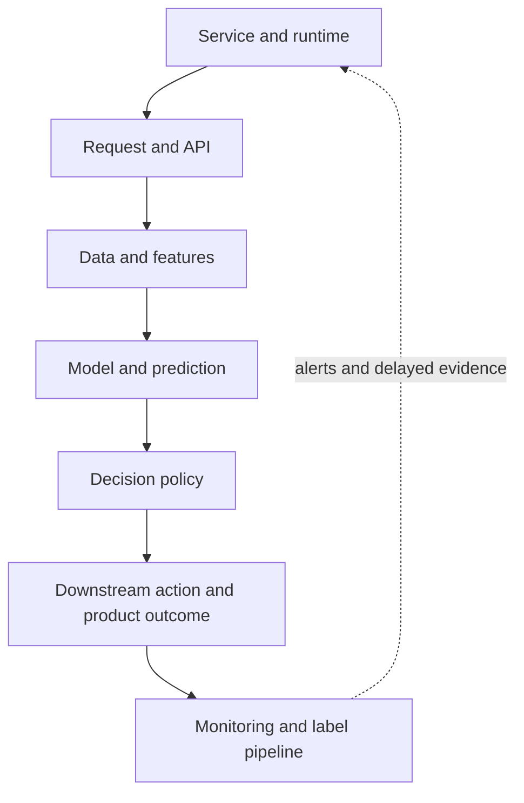
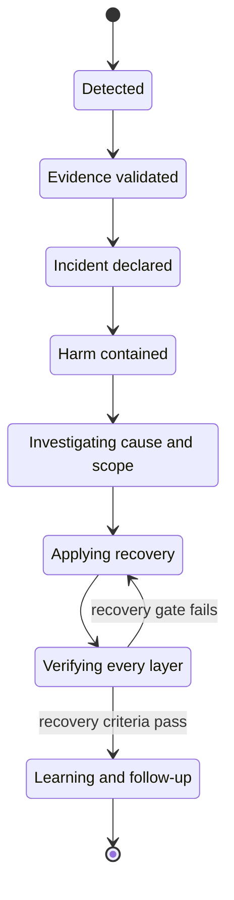
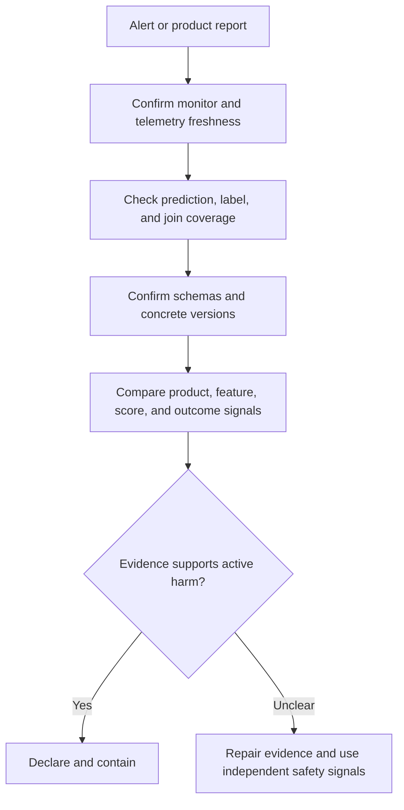
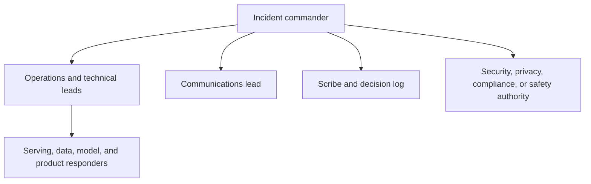
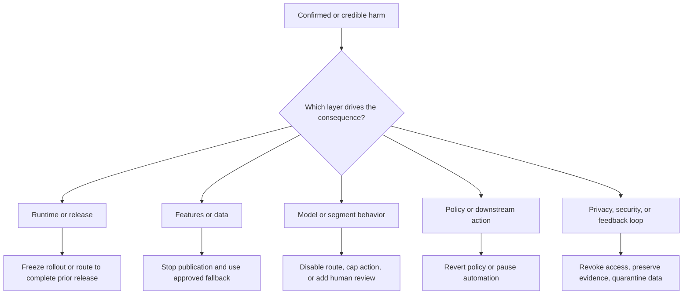
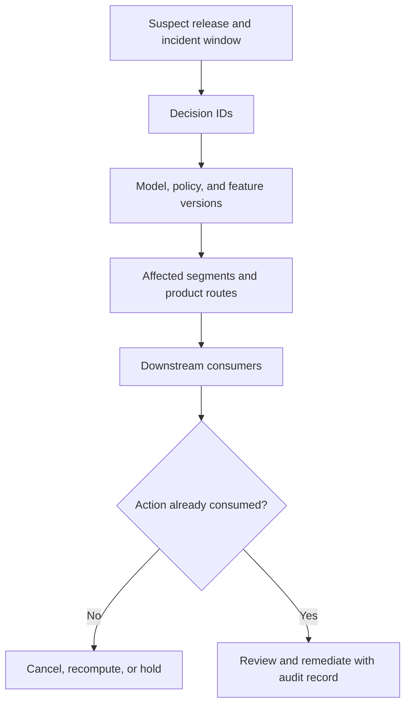
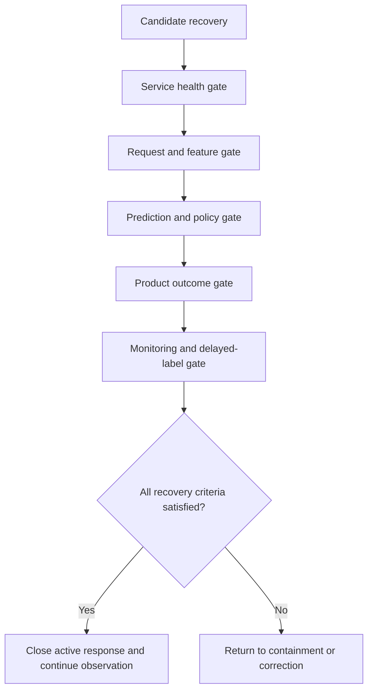
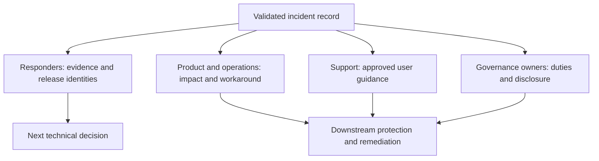
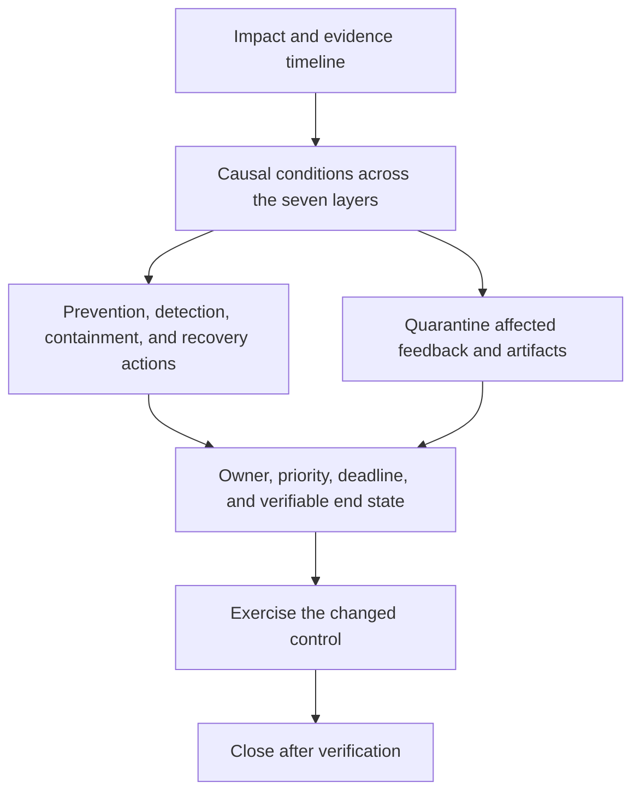

## Table of Contents

1. [A Healthy Service Can Still Produce Harmful Decisions](#a-healthy-service-can-still-produce-harmful-decisions)
2. [Check The Seven Layers Of An ML Decision System](#check-the-seven-layers-of-an-ml-decision-system)
3. [Follow A Clear Incident Response Lifecycle](#follow-a-clear-incident-response-lifecycle)
4. [Check Monitoring And Outcome Data Before Changing Production](#check-monitoring-and-outcome-data-before-changing-production)
5. [Declare the Incident and Assign Authority](#declare-the-incident-and-assign-authority)
6. [Contain Harm Before Correcting the System](#contain-harm-before-correcting-the-system)
7. [Investigate The Decision Path In A Deliberate Order](#investigate-the-decision-path-in-a-deliberate-order)
8. [Find Every Affected Decision And Repair The Harm](#find-every-affected-decision-and-repair-the-harm)
9. [Prove Recovery Across Every Layer](#prove-recovery-across-every-layer)
10. [Use Incident Communication To Coordinate Technical Work](#use-incident-communication-to-coordinate-technical-work)
11. [Fix The System Weaknesses Revealed By The Incident](#fix-the-system-weaknesses-revealed-by-the-incident)
12. [The Main Idea](#the-main-idea)
13. [References](#references)

## A Healthy Service Can Still Produce Harmful Decisions
<!-- section-summary: An ML incident is a production event in which an ML-enabled system creates unacceptable harm, risk, or loss of trust. -->

A customer may receive a harmful decision even though the model endpoint remains available. An **ML incident** is a production event in which the complete ML-enabled system creates unacceptable harm, risk, or loss of trust. The cause may sit in a model, feature pipeline, decision rule, API, monitoring job, or downstream workflow. The definition starts with impact because users experience the whole decision system.

Some incidents look familiar to any software engineer. The prediction API times out, GPU memory is exhausted, or a batch job never finishes. Other incidents remain quiet at the infrastructure layer. The endpoint returns `200 OK`, latency stays below its objective, and containers report healthy. The system still fails because its decisions are stale, unfair to a segment, detached from current behavior, or based on corrupted inputs.

Consider an eligibility model that returns valid JSON for every request. A feature pipeline has stopped refreshing income data, so the service keeps reading week-old values. Approval rates fall sharply for recently employed applicants. CPU, error rate, and request latency remain normal. This is a serious ML incident because technically successful responses are producing harmful decisions.

The same principle applies to a recommender that repeatedly amplifies unsafe content, a fraud model that misses a new attack pattern, or a demand forecast that sends the wrong quantities into automated purchasing. Service availability answers “Can the system produce a response?” Incident response must also answer “Is the response safe and fit for its product purpose?”

Cybersecurity guidance offers a helpful foundation. [NIST SP 800-61r3](https://www.nist.gov/publications/incident-response-recommendations-and-considerations-cybersecurity-risk-management-csf) connects preparation, detection, response, recovery, and organizational learning across normal risk-management work. ML teams apply that discipline to a broader set of production harms, while security and privacy specialists retain authority over incidents in their domains.

## Check The Seven Layers Of An ML Decision System
<!-- section-summary: Seven observable layers help responders locate a failure without assuming that the model itself is the cause. -->

Calling every quality problem a “bad model” sends the investigation toward the most visible ML component. A production decision crosses several layers, and each layer can create the same outward symptom. A sudden drop in approvals could come from request validation, a stale feature, a new model, a threshold change, or a broken outcome join that only makes the dashboard look worse.

Seven observable layers give responders a shared map:

1. **Service and runtime.** Compute capacity, containers, accelerators, dependencies, queues, latency, errors, and resource saturation.
2. **Request and API.** Request schema, client version, authentication, timeouts, serialization, traffic mix, and retry behavior.
3. **Data and features.** Source availability, schema, units, freshness, missing values, transformations, and online/offline consistency.
4. **Model and prediction.** Loaded artifact, model signature, score distribution, calibration, uncertainty, segment behavior, and fallback path.
5. **Decision policy.** Thresholds, business rules, abstention, human-review routing, policy version, and action limits.
6. **Downstream action and product outcome.** The action taken from a prediction and its effect on users, operations, revenue, safety, or trust.
7. **Monitoring and label pipeline.** Telemetry collection, monitoring-job freshness, outcome labels, prediction-to-outcome joins, alert rules, and dashboards.



Failures travel through these layers. A source delay creates stale features. The model accepts them because their types are valid. Scores shift, a policy converts those scores into extra manual reviews, and the review queue grows until users face long delays. The original fault lives in data freshness, while the largest visible symptom appears in product operations.

The final layer can also create a false incident story. A label job may stop joining outcomes to predictions after a schema change. Reported accuracy collapses because the remaining joined cases are unrepresentative. The model may still be performing normally. That is why evidence integrity leads the investigation.


*The first meaningful divergence is stale feature data, even though the loudest product symptom appears later and the service dashboard remains green.*

## Follow A Clear Incident Response Lifecycle
<!-- section-summary: The incident lifecycle provides a stable sequence for reducing harm, restoring service, and learning from the event. -->

Incident response works best as a lifecycle that connects evidence, authority, action, and verification. The phases overlap, especially communication and evidence collection, yet each phase answers a distinct question.

**Detect** identifies a credible sign of harm. It may come from an alert, a support escalation, a product metric, an audit, or a responder who notices abnormal decisions.

**Validate the evidence** checks whether the signal is fresh, complete, and correctly joined to the release under investigation. This phase prevents a broken monitor from triggering a harmful rollback.

**Declare and assess severity** creates a recognized incident, names authority, and describes impact in user terms. The team can now coordinate through one response structure.

**Contain** limits further harm. The immediate action may freeze a rollout, disable an automated decision, isolate a segment, or move traffic to a known complete release.

**Investigate** builds and tests explanations across the seven layers. Responders compare versions, time windows, segments, and recent changes while preserving evidence.

**Recover** restores an approved operating state and addresses decisions already consumed downstream.

**Verify** proves that the service, inputs, predictions, decisions, and product outcomes have returned to acceptable bounds. Delayed labels may keep verification open after immediate user harm has stopped.

**Communicate and learn** maintain shared state during the response, document decisions, review the causal chain, and turn findings into owned improvements.



Containment can begin before the full diagnosis if current harm is clear. A privacy exposure, unsafe automated action, or rapidly growing financial loss may require an immediate stop. Evidence validation still continues in parallel so responders know what they contained and can choose a safe recovery.

## Check Monitoring And Outcome Data Before Changing Production
<!-- section-summary: Evidence validation checks whether the alert and its supporting data describe the live system accurately. -->

The first investigation asks whether the evidence can be trusted. This does not dismiss an alert. It establishes whether the signal describes the live system, an old release, a partial population, or a damaged monitoring pipeline.

Start with **freshness**. Confirm the latest successful monitoring run, the event time of its inputs, and the time range represented by the alert. A dashboard refreshed a minute ago can still display labels that are two days old. Compare the incident window with the monitor's evaluation window and with the normal delay for ground truth.

Next check **coverage**. Count predictions, outcomes, and successful joins between them. Break join coverage down by client, route, region, model version, and policy version. A global 90 percent join rate can hide near-zero coverage for the exact segment that triggered the alert.

Then inspect **schema and identity**. Confirm the request contract, prediction-event schema, label schema, and join-key format. Resolve mutable aliases to concrete model versions. Record the service artifact, model version, policy version, feature-set version, and monitoring-code version. An alias such as `champion` describes a pointer; the concrete version identifies what actually answered a request.

Finally compare **signal agreement**. A quality alert deserves more confidence if product complaints, decision-rate changes, feature anomalies, and model-output shifts point to the same interval and segment. Disagreement directs the team toward missing telemetry or a narrower fault.

An outcome feed illustrates the value of this order. A monitoring job reports that precision fell from its normal range to almost zero. The team finds that label volume also fell sharply and prediction-to-outcome join coverage dropped after a producer changed the identifier format. Rolling back the model would leave the broken join in place and introduce a second production change. The correct first action is to restore trustworthy monitoring evidence, while product-side safety signals determine whether separate containment is needed.




*A broken outcome join can create a false model-quality story; validate the measurement path before introducing another production change.*

## Declare the Incident and Assign Authority
<!-- section-summary: A declared incident gives the response clear authority, roles, severity, and one shared record of decisions. -->

A declared incident creates a recognized coordination structure. It gives responders permission to pause releases, change traffic, disable automation, and contact affected stakeholders according to pre-approved policy. Without that structure, several experts may investigate in parallel while nobody owns the next decision.

[Google's Incident Management Guide](https://sre.google/resources/practices-and-processes/incident-management-guide/) emphasizes coordination, communication, and control through explicit incident roles. ML incidents use the same core structure and add domain owners according to the consequence.

The **incident commander** owns the direction of the response. This person sets severity, chooses the next priority, and delegates work. They maintain the overall state while technical leads investigate. A commander buried in queries cannot coordinate new evidence and approvals or respond to stakeholder needs.

The **operations or technical lead** directs production investigation and changes. For a broad incident, separate leads may cover serving, data, model behavior, and product impact. One clearly identified lead should control production mutations so two responders do not apply conflicting mitigations.

The **communications lead** sends regular, audience-appropriate updates and receives questions from stakeholders. The **scribe** maintains the timeline and decision log: evidence considered, action approved, owner, command or change reference, observed result, and rollback condition.

Additional authority follows the risk. A product owner clarifies acceptable fallback behavior. Security and privacy responders lead access revocation, evidence preservation, and disclosure processes. Compliance, legal, safety, or responsible-AI owners may be required for regulated decisions or harmful segment behavior. Their involvement should be designed before an incident so responders do not invent approval paths under pressure.

Small teams can combine people while preserving role boundaries. One engineer may act as commander and communications lead, while another performs technical work and a third maintains the log. Saying the roles aloud still clarifies who can approve containment and who can modify production.

Severity starts with the consequence. Ask how many decisions are affected and how quickly the harm is growing. Then ask whether consumed decisions can be reversed and whether the action touches safety, privacy, or a regulated duty. A failed retraining job can stay low severity if a healthy approved model continues serving. A silent policy regression affecting a protected group may require the highest response even with normal latency.



## Contain Harm Before Correcting the System
<!-- section-summary: Containment limits current harm, while correction removes the underlying cause and restores a durable operating state. -->

**Containment** reduces the immediate consequence of an incident. **Correction** removes the cause and returns the system to a durable approved state. The two actions may differ. Routing uncertain decisions to human review can protect users quickly; repairing the feature pipeline and retraining a contaminated model may take much longer.

The containment choice should match the consequence and the faulty layer.

### Service failure and bad deployment

High error rate or latency may call for traffic shedding, extra capacity, a degraded endpoint, or a pause on batch submissions. If the incident follows a deployment, freeze the rollout and route to the previous **complete release**. Complete means a tested combination of service image, model, preprocessing code, feature contract, and policy. Moving only the model alias can preserve an incompatible service or feature transformation.

### Corrupt or stale features

Stop publication of the faulty feature source and prevent new predictions from consuming it. A low-risk product may use a reviewed default or fallback model. A high-stakes decision may require abstention or human review because a convenient default could create confident harm. Repair includes restoring the source, validating the backfill, and proving freshness before normal automation resumes.

### Drift and harmful segment behavior

Concept drift means the relationship between inputs and outcomes has changed. A quick retrain on recent data can amplify an unstable period, so containment usually narrows exposure first. Disable the affected route or segment, apply a safe rule, cap the action, or send cases to review. Preserve unaffected traffic only if segment identification is reliable and product owners accept the remaining risk.

Harm can concentrate in one group even if the global quality metric looks healthy. The affected group might share a language or location. It might use an accessibility mode or device type that changes the request path. Demographic effects require governance-approved analysis and careful access to sensitive attributes. Pause the affected action first. Preserve the evidence under approved access and bring in the responsible product and governance owners. A threshold tweak may reduce immediate harm, but it still needs verification across other groups and decision costs.

### Policy and threshold error

If the model score is healthy and the policy changed, revert the policy or disable the automated action. A model rollback adds uncertainty without addressing the causal layer. Store policy versions beside every decision so investigators can separate score production from action logic.

### Broken outcome feed

Pause model-quality conclusions derived from the damaged feed. Restore label volume and join coverage, then recompute the affected windows. Independent product evidence may still justify containment. For example, complaint volume and manual-review findings can show active harm even while delayed labels are unavailable.

### Privacy, security, and feedback-loop contamination

A data or model exposure can require immediate access revocation, credential rotation, export suspension, evidence preservation, and notification through the security or privacy process. Deleting evidence casually can interfere with investigation and legal duties.

A feedback loop can contaminate future training data if model decisions influence the labels later treated as ground truth. Stop the writeback or training publication path, mark the affected interval, and quarantine derived datasets and artifacts. Recovery needs clean-data provenance before retraining resumes.



Every containment action needs a named owner. Define the signal that should change and the period used to observe it. Also record the condition that would reverse the action. “Switch to fallback” is incomplete if nobody knows its capacity, segment coverage, or quality limits. The incident commander records why the action is safer than current behavior and which evidence will confirm that judgment.

## Investigate The Decision Path In A Deliberate Order
<!-- section-summary: A consistent investigation order separates damaged evidence from genuine production changes and reduces unnecessary interventions. -->

Investigation starts with evidence integrity, then narrows the time window and affected population. After that, compare concrete release identities and inspect the seven layers from the first divergence toward the downstream consequence.

### Find The Trustworthy Incident Window

Record the earliest confirmed harmful decision and the last known healthy decision. Include event time and processing time because delayed pipelines can make a failure appear later than it occurred. Check telemetry gaps, monitor schedules, clock skew, sampling changes, and retention boundaries. The interval should remain provisional until multiple signals agree.

### Compare Immutable Release Identities

Record immutable service artifact or image digest, model version, preprocessing version, feature-set version, policy version, API contract version, and monitoring-code version. A mutable registry alias helps routing, but it cannot prove which version served an earlier decision. Store the resolved model version in prediction records and telemetry at inference time.

OpenTelemetry provides standard resource attributes such as `service.name`, `service.version`, and `deployment.environment.name`. These identify the software release and environment across traces, metrics, and logs. Low-cardinality application attributes can add model, policy, and feature-set versions. Configure the collector or observability backend to expose only the selected release attributes as metric labels. Keep `decision_id` in governed records, logs, or sampled traces; putting a unique identifier on every metric series would create damaging metric cardinality.

A focused Prometheus query can compare action rates across release identities:

```promql
sum by (service_version, model_version, policy_version, feature_set_version) (
  rate(ml_decisions_total{
    service_name="eligibility-api",
    deployment_environment_name="production",
    action="manual_review"
  }[10m])
)
```

Suppose manual-review traffic rises only for `policy_version="policy-18"`, while the model and feature versions span both healthy and affected requests. That pattern moves the investigation toward policy logic. If the increase follows one feature-set version across two model releases, the feature layer deserves priority.

### Find The First Meaningful Divergence

Start with the earliest layer showing a real change. Confirm request mix and client versions before attributing a score shift to the model. Compare feature freshness and missing-value paths before examining model internals. Check calibration and score distributions before studying policy actions. Finally, confirm that downstream systems consumed the action as designed.

Use counterfactual replays carefully. Reconstruct a governed sample of affected requests and evaluate it with the previous complete release, candidate release, and current policy. Keep production side effects disabled. The result can separate a model change from a feature or policy change, although it may still miss live dependencies and feedback effects.

Keep competing hypotheses visible in the decision log. For each hypothesis, record supporting evidence, contradicting evidence, and the next discriminating test. This prevents the loudest early theory from absorbing the whole response.

## Find Every Affected Decision And Repair The Harm
<!-- section-summary: Blast-radius analysis identifies affected decisions precisely and connects them to remediation in downstream systems. -->

The **blast radius** is the set of users, decisions, systems, and time periods affected by the incident. Counting failed requests is enough for a conventional outage only in limited cases. An ML service can return successful predictions that later trigger a declined application, hidden listing, blocked payment, incorrect forecast, or delayed review.

Start from immutable decision or prediction identifiers. Join them to concrete service, model, policy, and feature versions. Add the provisional incident window, then segment by route, client, geography, product surface, and any protected or high-risk group approved for investigation. Compare affected and unaffected populations so the scope does not inherit the same bias as the original alert.

A governed decision table can support a focused query:

```sql
select
  model_version,
  policy_version,
  feature_set_version,
  segment,
  count(*) as decisions,
  count(action_consumed_at) as consumed_decisions,
  count(outcome_id) * 1.0 / nullif(count(*), 0) as outcome_join_coverage
from governed_ml.decision_records
where decided_at >= :incident_start
  and decided_at < :containment_complete
  and release_id in (:suspect_releases)
group by model_version, policy_version, feature_set_version, segment;
```

This query identifies scope by version and segment without placing sensitive payloads into an operational dashboard. Investigation access should follow the dataset's existing controls, and the incident record should link to an approved query or saved result.

Decisions already consumed need a remediation plan. Pending actions may be cancelled or recomputed with an approved release. Completed digital actions could require manual review or account restoration. Physical and financial effects may need inventory correction, a refund, or direct user communication. The appropriate remedy depends on product policy and legal obligations.

Preserve the original decision and append its remediation state. Silent overwrites destroy the audit trail and make outcome analysis unreliable. A remediation record should connect the original decision ID, incident ID, approved correction, owner, completion state, and any user notification.

Blast-radius work continues after traffic is contained. Delayed batch consumers, caches, exports, and partner feeds may still hold affected outputs. Search each downstream path until owners can account for stored and consumed decisions.



## Prove Recovery Across Every Layer
<!-- section-summary: Recovery is complete after the system and its decisions satisfy defined technical, ML, and product criteria. -->

A green endpoint proves that requests are reaching a service. Recovery needs additional evidence that features are fresh, scores carry the expected meaning, policy actions are safe, and delayed quality has recovered. Use acceptance criteria across the same layers used for investigation.

At the **service layer**, confirm error rate, latency, saturation, queue age, dependency health, and fallback capacity. Verify the release identity actually serving each route. A registry alias or deployment status alone cannot prove that caches and long-lived workers loaded the intended artifact.

At the **request and data layers**, confirm schema acceptance, traffic mix, source completeness, feature freshness, missing-value paths, and transformation versions. Re-run representative requests, including the affected segment and important boundary cases.

At the **prediction and policy layers**, inspect score distributions, calibration evidence, abstention rate, decision rate, and segment behavior. Compare them with approved baselines and the containment hypothesis. A restored global average can still hide continuing harm in a small group.

At the **product layer**, confirm that downstream actions execute correctly and that remediation queues remain controlled. Product metrics, manual-review findings, complaint volume, and operational workload often reveal problems that model dashboards miss.

At the **monitoring layer**, verify monitor freshness, label volume, join coverage, alert evaluation, and notification delivery. Recompute damaged windows after repairing an outcome feed. Keep delayed verification open until enough labels arrive to evaluate the recovered system with the agreed confidence.



The incident commander declares recovery from written criteria, with confirmation from the relevant technical and product owners. NIST recovery guidance likewise emphasizes checking restoration integrity, confirming normal operations with system owners, monitoring restored systems, and completing incident documentation.

## Use Incident Communication To Coordinate Technical Work
<!-- section-summary: Clear communication protects coordination, supports affected teams, and preserves the reasoning behind production decisions. -->

Incident communication is more than a status message. It controls who changes production, gives downstream teams time to protect their workflows, and preserves the reasoning behind each decision.

Maintain one recognized incident channel and one live incident record. The record should state current impact, severity, commander, technical leads, containment state, affected versions, leading hypotheses, next decision point, and links to governed evidence. The decision log captures production changes and their observed results.

Updates should use user and product language. “The prediction API is healthy” gives little comfort if eligible users are being declined. A stronger update says which decision is affected, which users or routes are in scope, what containment is active, whether previously consumed decisions need review, and the time of the next update.

Different audiences need different detail. Responders need exact release identities and evidence queries. Product and operations teams need the current impact and workaround. Support teams need approved language plus an escalation path. Security, privacy, compliance, or legal owners may control external disclosure for incidents in their scope.

Keep investigation separate from coordination. Technical threads can explore competing hypotheses, while the main record carries validated evidence and approved decisions. This separation lets specialists reason deeply without forcing every stakeholder to follow an unfiltered stream of theories.

Handoffs need an explicit transfer of command. The outgoing responder describes current impact and containment, then identifies unresolved risks and evidence gaps. They also explain active production changes and the next decision. The incoming responder confirms ownership in the incident record.



## Fix The System Weaknesses Revealed By The Incident
<!-- section-summary: A post-incident review explains the causal system and produces owned changes with verifiable completion criteria. -->

The post-incident review reconstructs how the system produced harm and how the organization responded. Its purpose is learning and risk reduction. [Google's postmortem guidance](https://sre.google/workbook/postmortem-culture/) recommends focusing on system conditions, using blameless language, and giving action items clear ownership and verifiable completion.

Begin with impact and scope. Describe affected users, decisions, segments, duration, and downstream remediation. Then build a timeline from the first causal change through detection, declaration, containment, recovery, and delayed verification. Separate facts from remaining uncertainty.

The causal analysis should cross layers. A feature source may have failed, but the incident also grew because freshness was not enforced, the model accepted stale values, the policy allowed automatic action, the monitor lacked segment coverage, and the fallback had never been tested under full load. Naming these conditions produces stronger controls than assigning the incident to one faulty job.

Corrective actions should address prevention, detection, containment, and recovery. Examples include a feature freshness gate, a contract test for join keys, segment-level policy limits, a tested complete-release rollback, an alert on outcome-join coverage, or a remediation workflow for consumed decisions. Update the runbook with commands and evidence paths verified during the incident. Remove dead steps that delayed the response.

Each action needs one accountable owner, a priority, a deadline, and a verifiable end state. “Improve monitoring” has no completion test. “Page the model on-call if outcome-join coverage stays below the approved threshold for two evaluation windows, then test the alert in staging” can be demonstrated and reviewed.

Training data created during the incident needs an explicit disposition. Quarantine predictions, labels, and feedback influenced by the faulty release or policy. Data owners can later approve exclusion, correction, or controlled reuse. This prevents the failure from entering a new model as apparent ground truth.

Review the response process too. Ask whether severity matched impact, authority was clear, evidence was trustworthy, containment reduced harm, communication reached the right owners, and recovery criteria covered delayed outcomes. Exercises should rehearse the changed controls so the follow-up work improves real response capability.



## The Main Idea

ML incident response protects the full decision system. A healthy endpoint can still serve stale features, misleading scores, harmful thresholds, or actions detached from product reality. Monitoring can also fail and create a false story about model quality.

The seven observable layers locate those possibilities. The lifecycle organizes the work: detect, validate evidence, declare, contain, investigate, recover, verify, communicate, and learn. Clear authority keeps coordination separate from technical investigation. Concrete release and decision identities connect alerts to blast radius and downstream remediation.

Recovery closes only after technical health, input integrity, prediction behavior, product outcomes, and delayed monitoring evidence satisfy written criteria. The post-incident review then converts the causal chain into owned, testable changes and keeps contaminated feedback out of future training data.


*Contain the consequence, correct the causal layer, prove every part of the decision path, and preserve remediation and training-data evidence before closure.*

## References

- [NIST SP 800-61r3: Incident Response Recommendations and Considerations](https://www.nist.gov/publications/incident-response-recommendations-and-considerations-cybersecurity-risk-management-csf)
- [Google SRE Incident Management Guide](https://sre.google/resources/practices-and-processes/incident-management-guide/)
- [Google SRE: Managing Incidents](https://sre.google/sre-book/managing-incidents/)
- [Google SRE: Postmortem Culture](https://sre.google/workbook/postmortem-culture/)
- [OpenTelemetry resources](https://opentelemetry.io/docs/concepts/resources/)
- [OpenTelemetry service semantic attributes](https://opentelemetry.io/docs/specs/semconv/registry/attributes/service/)
- [OpenTelemetry deployment semantic attributes](https://opentelemetry.io/docs/specs/semconv/registry/attributes/deployment/)
- [Prometheus alerting rules](https://prometheus.io/docs/prometheus/latest/configuration/alerting_rules/)
- [MLflow Model Registry workflows](https://mlflow.org/docs/latest/ml/model-registry/workflow/)
