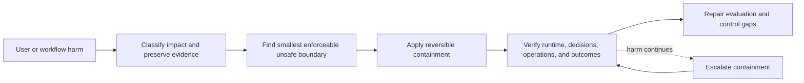
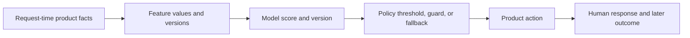

## Treat The Decision As The Incident
<!-- section-summary: A bad-prediction incident begins when model-driven decisions harm users or operations, whether or not the service itself is failing. -->

A **bad-prediction incident** occurs when a model-driven decision harms users, operations, money, or policy outcomes. The API may remain fast and available because service health only proves that computation completed. Incident response must protect the product decision while preserving evidence about the model, features, policy, and runtime that produced it.

The response framework has six stages:

| Stage | Question | Failure when skipped |
|---|---|---|
| **Impact classification** | Which user action or operational workflow is unsafe, and how severe is it? | The team optimizes a technical symptom while harm continues |
| **Evidence preservation** | Which model, feature, policy, route, and outcome records describe the event? | Emergency changes erase the path needed for diagnosis |
| **Boundary discovery** | Which enforceable traffic, segment, action, or dependency contains the failure? | The team disables healthy traffic or leaves the risky slice active |
| **Reversible containment** | Which guard, fallback, threshold, route, or rollback reduces harm fastest? | A speculative permanent fix expands the incident |
| **Recovery verification** | Did runtime state, product decisions, and user outcomes return to an acceptable range? | A successful command gets confused with recovered users |
| **System repair** | Which evaluation, data, policy, release, or monitoring control allowed escape? | Retraining alone leaves the same path open for the next failure |



This loop keeps protection and diagnosis connected. The team can contain a known harmful boundary before it proves the root cause, then widen containment if recovery signals remain outside the acceptable range.

Containment choices carry different costs. A global threshold change acts quickly but can overload a review queue. Segment restriction preserves healthy traffic but requires a stable decision-time boundary. Model rollback helps when the previous artifact remains compatible. A deterministic guard belongs outside the model when the product rule must hold for every version.

Severity comes from consequence and exposure rather than the size of a metric movement. A single unsafe automated action can justify immediate containment in a high-impact workflow. A small quality regression across millions of low-risk decisions can also create large aggregate harm. The incident owner records affected users, decision authority, traffic share, duration, reversibility, and downstream side effects before choosing the response level.

FreshBasket illustrates the framework with a grocery-substitution model. Complaints report vegan orders containing dairy and gluten-free orders receiving ordinary bread while model version 42 returns well-formed scores. The later sections use this incident to show how each response stage works.

## Separate Prediction Error, Decision Error, and Product Harm
<!-- section-summary: Responders trace the chain from model output through policy and product action because each layer can create or prevent harm. -->

A **prediction** is the model output, such as a substitution score. A **decision policy** turns that output into an action, such as automatic acceptance above a threshold. The product then applies the action inside a workflow where a picker, customer, or downstream system can change the final outcome.

This chain gives the incident several possible failure boundaries. The model can score an unsuitable replacement highly. Product metadata can mark an item incorrectly. A threshold can grant too much automatic authority. A fallback can select an unsafe default after a timeout. A user interface can hide information that a reviewer needs to correct the suggestion.

The response should reconstruct every step:



The distinction changes containment. A reliable hard rule can block dietary conflicts even while the ML team investigates model and feature causes. If the issue comes from corrupt metadata, model rollback may leave the same harmful input in place. If the policy expanded automatic acceptance, restoring the earlier policy may reduce harm faster than replacing the model.

Responders should avoid calling every disagreement a bad prediction. Some examples lack clear ground truth, and some product harms arise from correct predictions used for an unsuitable purpose. The incident definition follows consequence and breached product expectations, while later analysis determines which layer failed.

## Reconstruct What Changed
<!-- section-summary: Prediction and decision records connect user harm to model, feature, policy, and release changes. -->

The incident owner starts with the affected decisions. Each substitution record includes the ordered item, proposed replacement, model version, feature-set version, score, threshold, policy result, and whether the picker or customer rejected it. Dietary attributes are stored as governed product metadata rather than inferred from customer identity.

Before version 42, FreshBasket automatically accepted 48 percent of substitutions. After release, that rate rose to 61 percent. Picker overrides doubled, customer rejection rose from 7 to 15 percent, and dietary mismatches rose from 0.3 to 2.8 percent. Those numbers show more than a small accuracy regression: the release changed how often the product acted without review.

The team compares four histories around the start of the incident. The model registry shows version 42 entering traffic. The feature catalog shows a new product-embedding source. The policy repository shows an unchanged auto-accept threshold. The serving image did not change. This narrows the investigation without claiming yet whether the model or new feature data caused the behaviour.

An incident query can reconstruct those identities for every harmful decision:

```sql
SELECT
  d.decision_id,
  d.decided_at,
  d.model_version,
  d.feature_version,
  d.policy_version,
  d.ordered_item_id,
  d.ordered_dietary_flags,
  d.replacement_item_id,
  d.replacement_dietary_flags,
  d.auto_accepted,
  o.customer_rejected,
  o.picker_overrode
FROM substitution_decisions AS d
LEFT JOIN substitution_outcomes AS o USING (decision_id)
WHERE d.decided_at >= TIMESTAMP '2026-07-14 10:00:00+00:00'
  AND d.decided_at < TIMESTAMP '2026-07-14 12:00:00+00:00'
  AND d.model_version IN ('41', '42');
```

The output keeps model, features, and policy separate. If mismatches rise only on version 42 while feature and policy versions stay fixed, model rollback has stronger evidence. If both models fail only when `feature_version='product-embedding-v18'`, feature containment deserves priority. The decision ID lets responders preserve exact examples before routing changes.

## Find The Smallest Unsafe Boundary
<!-- section-summary: Segment analysis identifies where the product is unsafe so containment can protect users without disabling healthy traffic. -->

Global metrics hide the shape of this incident. FreshBasket groups decisions by ordered dietary flag, product category, store region, model version, and whether the new embedding was present. Bakery substitutions for gluten-free orders have a 9.1 percent mismatch rate. Vegan dairy substitutions show 7.4 percent. Ordinary household-item substitutions remain close to baseline.

This analysis reveals a boundary the routing system can enforce: dietary-sensitive orders should not be auto-accepted. The team sends those cases to picker review or refund while leaving ordinary substitutions available. That is faster and less disruptive than turning off the entire model.

Segment containment is safe only when the segment is reliable at decision time. A vague analytical group such as “users similar to past complainants” would be hard to enforce and easy to misuse. Here, the product already has explicit dietary requirements attached to the ordered item, so the boundary is visible and testable.

## Choose A Reversible Containment
<!-- section-summary: The team selects the quickest reversible action that reduces harm and matches the evidence available. -->

FreshBasket has several possible controls. Raising the auto-accept threshold would reduce automatic decisions everywhere, but it might still allow a confidently wrong dietary substitution. Rolling back version 42 would restore known model behaviour, but only if version 42 is the cause and version 41 remains compatible with current features. Rolling back the feature feed might help if the new embeddings are corrupt, but other consumers could depend on it.

Containment selection uses three dimensions: **time to reduce harm**, **scope of affected traffic**, and **reversibility**. A product guard can act within minutes and target a known policy boundary. A model rollback may take longer while restoring a reviewed baseline across many segments. A feature rollback can repair several consumers and also create a larger blast radius. The incident owner chooses the control with the strongest evidence and the smallest acceptable secondary cost, then records the next escalation if that control fails.

The incident owner first disables automatic acceptance for dietary-sensitive substitutions. A rules-based guard sends exact dietary conflicts directly to refund and sends uncertain cases to a picker. This action protects the affected customers immediately and does not require the team to settle the model-versus-data question.

The emergency policy is explicit and versioned:

```yaml
policy_version: substitution-safety-2026-07-14.1
rules:
  - when: ordered.dietary_flags intersects [vegan, gluten_free, nut_free]
    if: replacement.dietary_flags does_not_satisfy ordered.dietary_flags
    action: refund
  - when: ordered.dietary_flags intersects [vegan, gluten_free, nut_free]
    action: picker_review
  - when: true
    action: model_policy
expires_at: 2026-07-16T12:00:00Z
owner: substitution-incident-commander
```

The exact-conflict rule executes before any model threshold. The second rule catches sensitive cases whose catalog data does not prove compatibility. The expiry forces an owner to review the temporary capacity cost instead of leaving an emergency setting invisible for months.

Before activation, the team replays preserved decisions through the policy. Every known dietary mismatch must route to refund or review, while ordinary household substitutions retain their original path. After activation, a query checks that `auto_accepted=true` has zero rows for the protected flags. Any violating row pages the incident owner because the policy and traffic router disagree.

The team preserves a replayable sample before changing traffic. It records the request-time features, model and policy versions, output, product action, and later outcome under the applicable privacy controls. That sample lets engineers compare candidate causes after containment without relying on a production state that has already changed.

The review queue now grows, so containment has an operational cost. Store operations adds reviewers for the afternoon and watches queue age. A control that avoids model harm but leaves orders waiting for hours would create a different product failure.

After replaying recent decisions, the ML team finds that version 42 relies too strongly on the new embedding when product metadata is sparse. Version 41 performs better on the affected slice and is compatible with the current request schema. The release owner rolls model traffic back to version 41 while keeping the dietary guard active.

## Keep Humans In A Real Decision Role
<!-- section-summary: Human review helps only when reviewers have sufficient context, clear authority, and a path to disagree with the model. -->

During containment, the picker interface shows the ordered item, proposed replacement, dietary facts, price difference, and stock alternatives. It does not present the model score as proof that the suggestion is correct. The reviewer can choose a different item, refund the order, or flag incorrect catalog metadata.

These outcomes are valuable evidence, but they are not automatically perfect labels. A hurried picker may accept the first option, stores may interpret policy differently, and some customer preferences are absent from the catalog. FreshBasket separates the reviewer's action from the later customer acceptance and from any adjudicated dietary-policy label.

This separation prevents the retraining pipeline from teaching the next model that every emergency reviewer action was ground truth. The feedback team samples disagreements and sends ambiguous cases to a senior catalog specialist before using them for model repair.

## Verify Recovery In The Product
<!-- section-summary: Recovery is demonstrated by safer decisions, healthy review operations, and confirmed runtime state rather than a successful rollback command. -->

The deployment system reports that the rollback completed, but FreshBasket verifies the running path. Prediction telemetry shows version 41 receiving traffic. The dietary policy reports that automatic acceptance is disabled for the protected segment. Picker queue wait remains within the temporary staffing target.

Over the next hour, new dietary mismatches fall below the team's incident threshold. Customer rejection and picker override rates move back toward their previous ranges. Support reports fewer new cases. These signals cover model state, policy state, operational load, and user impact; any one of them alone would give an incomplete picture.

Recovery evidence is recorded as one result rather than scattered screenshots. The `picker_queue_p95_minutes` field is the 95th-percentile wait: 95 percent of picker tasks waited that long or less.

```json
{
  "incident": "SUB-2841",
  "traffic_model_version": "41",
  "dietary_auto_accept_violations": 0,
  "dietary_mismatch_rate_60m": 0.0021,
  "picker_queue_p95_minutes": 6.4,
  "new_customer_reports_30m": 1,
  "fixture_replay": "48/48 passed",
  "state": "contained_monitoring"
}
```

The state remains `contained_monitoring` while customer outcomes continue to arrive. Runtime identity and policy violations can recover immediately; outcome evidence takes longer. The incident closes only after the reviewed window passes and the temporary guard receives an explicit keep, replace, or remove decision.

FreshBasket keeps the guard after version 41 returns until enough reviewed outcomes confirm that the product is stable. It also records the time and owner for the later decision, so a temporary emergency control cannot quietly remain as permanent behaviour.

Delayed and irreversible effects need their own recovery work. A harmful recommendation can trigger a purchase, denial, message, or queue change before the system rolls back. Restoring the previous model protects future decisions while leaving earlier effects in place. The incident plan should identify affected decision IDs, notify the team that owns remediation, and record which actions can be reversed.

Some products can automatically cancel or recompute decisions. Others need customer support, refunds, corrected notifications, or human review. High-impact workflows may require a preserved list of affected people under strict access controls. Recovery evidence should report both the current safe state and the backlog of prior harm still being repaired.

## Repair The System That Allowed The Failure
<!-- section-summary: The permanent fix addresses model evaluation, feature contracts, and release safeguards revealed by the incident. -->

The investigation shows that offline evaluation had one broad “grocery substitutions” result but no meaningful dietary slices. Sparse product metadata was replaced with a neutral embedding without a visible missingness feature. The canary dashboard tracked acceptance and latency, but not dietary mismatch or picker override by model version.

The repair therefore spans more than retraining. The catalog pipeline validates required dietary metadata. The model receives an explicit missingness signal. Evaluation adds policy-relevant slices and replays the incident examples. Release monitoring compares picker override, customer rejection, and dietary mismatch during canaries. The guarded product rule remains independent of the learned model because some constraints should be enforced directly.

The team trains a new candidate only after these changes are in place. It compares the candidate with version 41 on the original holdout, recent production feedback, and the incident set. A model that fixes the headline slice while damaging ordinary substitutions does not pass.

## A Safe Response Narrows Uncertainty
<!-- section-summary: Effective bad-prediction response protects users first, then uses connected evidence to identify and repair the failing layer. -->

FreshBasket first addressed the product decision that was harming customers, found the smallest enforceable unsafe segment, and applied a reversible control. It then used versioned prediction, feature, policy, and outcome records to select a rollback and verify recovery.

That sequence is useful across ML products. Contain the decision, preserve the evidence, verify the running system, and repair the conditions that let the failure escape. A model rollback is one tool inside that response, not the definition of the response itself.

## References

- [Google SRE Workbook: Incident Response](https://sre.google/workbook/incident-response/)
- [Google SRE Workbook: Canarying Releases](https://sre.google/workbook/canarying-releases/)
- [NIST AI Risk Management Framework](https://www.nist.gov/itl/ai-risk-management-framework)
- [MLflow model aliases](https://mlflow.org/docs/latest/ml/model-registry/workflow/)
