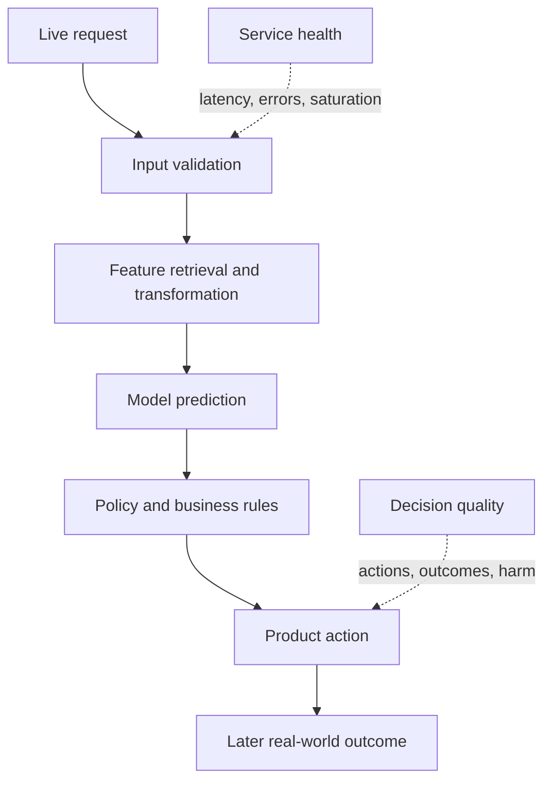
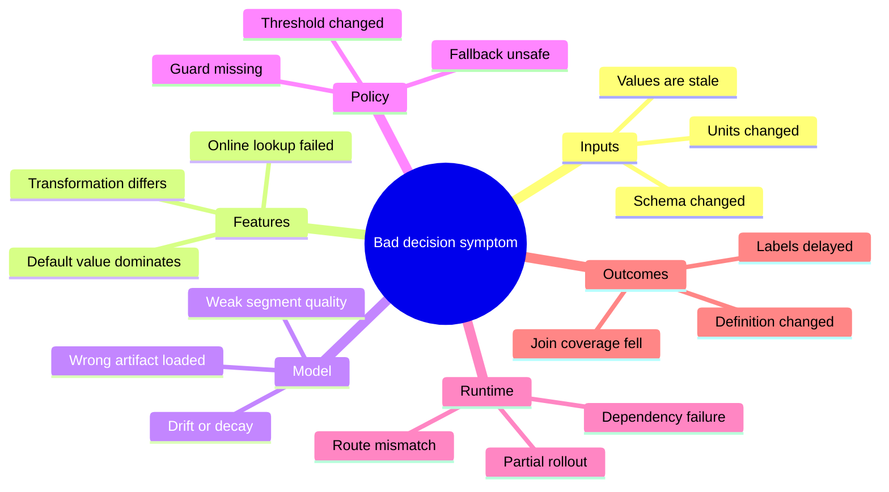
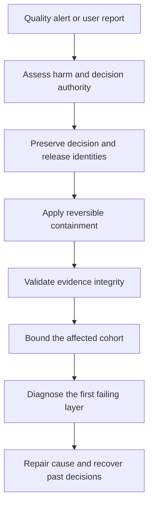
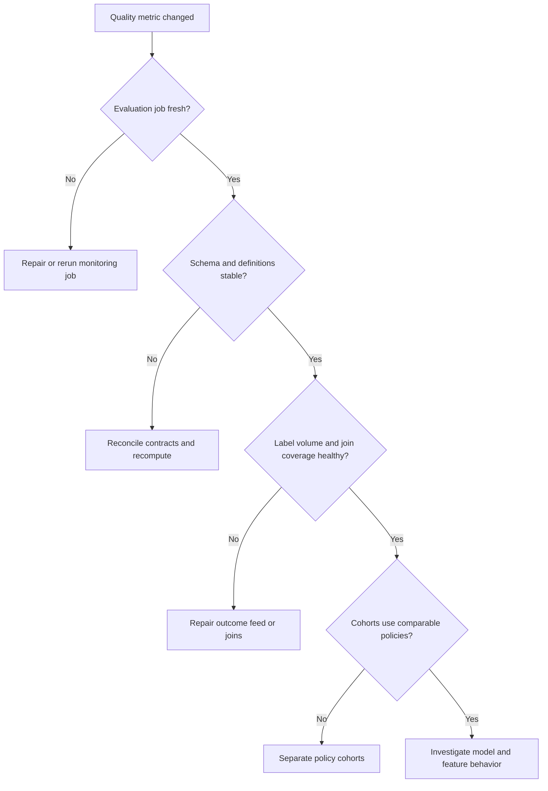
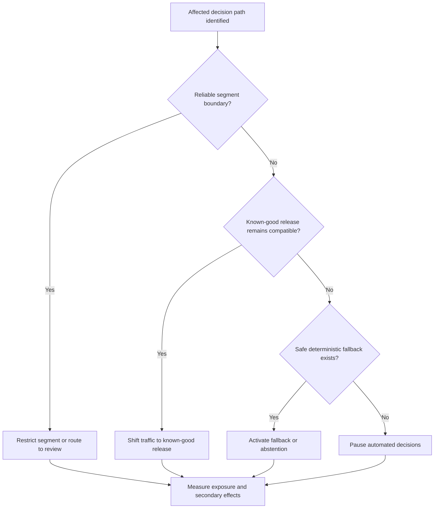
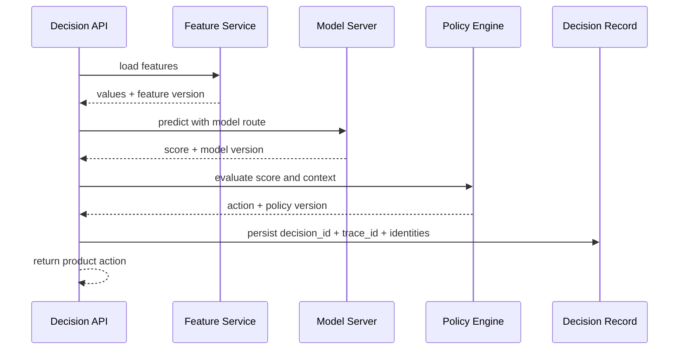
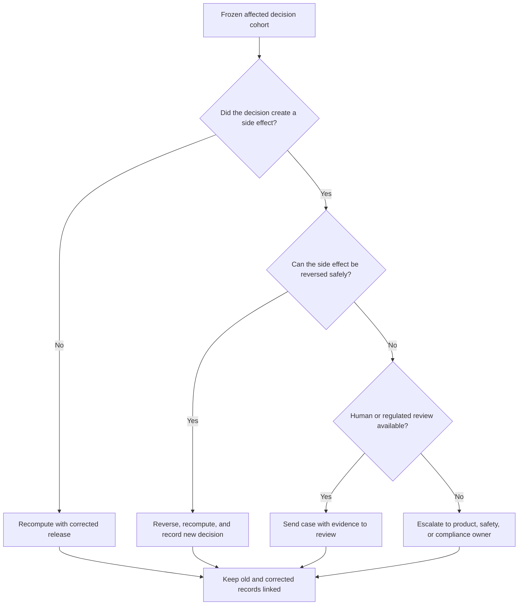

## Table of Contents

1. [A Service Can Return HTTP 200 And Still Make Bad Predictions](#a-service-can-return-http-200-and-still-make-bad-predictions)
2. [Separate The Visible Symptom From The Actual Cause](#separate-the-visible-symptom-from-the-actual-cause)
3. [Protect Users And Save The Evidence Needed For Investigation](#protect-users-and-save-the-evidence-needed-for-investigation)
4. [Verify Prediction And Outcome Data Before Changing The Model](#verify-prediction-and-outcome-data-before-changing-the-model)
5. [Find Every Decision That May Be Affected](#find-every-decision-that-may-be-affected)
6. [Group Affected Decisions Into Concrete Cohorts](#group-affected-decisions-into-concrete-cohorts)
7. [Choose Containment That Matches the Evidence](#choose-containment-that-matches-the-evidence)
8. [Diagnose the Decision Path Layer by Layer](#diagnose-the-decision-path-layer-by-layer)
9. [Trace One Decision Through the Live System](#trace-one-decision-through-the-live-system)
10. [Repair the Layer That Actually Failed](#repair-the-layer-that-actually-failed)
11. [Recover Decisions That Already Happened](#recover-decisions-that-already-happened)
12. [Prove That Recovery Is Real](#prove-that-recovery-is-real)
13. [Build the Response Path Before the Incident](#build-the-response-path-before-the-incident)
14. [The Main Idea](#the-main-idea)
15. [References](#references)

## A Service Can Return HTTP 200 And Still Make Bad Predictions
<!-- section-summary: A prediction-quality incident can continue while the serving API remains fast, available, and technically successful. -->

At a high level, **handling bad predictions** means protecting people from harmful ML-driven decisions and then discovering which part of the decision system failed. The difficult part is that the serving API may look perfectly healthy. It can return `200 OK`, meet its latency target, and produce a valid JSON response for every request while the product makes increasingly poor choices.

An HTTP success code answers a narrow operational question: *Did the service process the request?* It cannot answer: *Was the score correct? Was the action appropriate? Did the user receive a safe result?* This is why service-health monitoring and decision-quality monitoring serve different purposes.

Consider a credit-risk service that keeps responding in 80 milliseconds. Approval rates suddenly fall for one region because a currency conversion upstream is wrong. The model server is healthy. The resulting decisions are harmful. Restarting the server changes nothing because the fault lives in the input path.

The full production path usually looks like this:


```mermaid
flowchart TD
    A["Live request"] --> B["Input validation"]
    B --> C["Feature retrieval and transformation"]
    C --> D["Model prediction"]
    D --> E["Policy and business rules"]
    E --> F["Product action"]
    F --> G["Later real-world outcome"]

    H["Service health"] -. "latency, errors, saturation" .-> B
    I["Decision quality"] -. "actions, outcomes, harm" .-> F
```

Incident response follows the whole decision path. The model is one component inside a larger system, and any component can produce a bad outcome.

## Separate The Visible Symptom From The Actual Cause
<!-- section-summary: A visible quality problem is evidence that something changed, while the underlying cause may sit in data, features, models, policies, runtime, outcomes, or releases. -->

A **symptom** is the first visible sign of trouble. Examples include a spike in customer complaints, an unusual approval rate, more human overrides, lower measured accuracy, or a sudden change in score distribution. A **cause** is the failure that produced that sign.

The distinction matters because the same symptom can come from very different causes. Suppose measured precision falls sharply:

- The live population may have changed, leaving the model outside its familiar data range.
- A feature pipeline may have replaced missing values with zero.
- A policy threshold may have changed from `0.80` to `0.65`.
- A serving image may load the wrong preprocessing code.
- The outcome feed may have dropped successful cases, making quality look worse than it is.
- A new release may combine individually valid components in an incompatible way.

Retraining addresses only a subset of those causes. It will not repair a currency conversion, restore missing labels, revert a threshold, or load the correct feature transformer. In some cases, retraining on corrupted evidence teaches the model the failure.

In essence, the initial alert says, “Investigate this decision path.” It has not yet earned the conclusion, “Replace the model.”


```mermaid
mindmap
  root((Bad decision symptom))
    Inputs
      Schema changed
      Units changed
      Values are stale
    Features
      Transformation differs
      Online lookup failed
      Default value dominates
    Model
      Weak segment quality
      Drift or decay
      Wrong artifact loaded
    Policy
      Threshold changed
      Guard missing
      Fallback unsafe
    Runtime
      Route mismatch
      Dependency failure
      Partial rollout
    Outcomes
      Labels delayed
      Join coverage fell
      Definition changed
```

## Protect Users And Save The Evidence Needed For Investigation
<!-- section-summary: The first response reduces immediate harm while keeping enough evidence to reconstruct the affected decision path. -->

The first operational goal is **harm reduction**. If a model can trigger a high-impact action, the team may pause automation, route uncertain cases to human review, restore a known-safe release, or activate a deterministic safety rule. Root-cause analysis can continue after the dangerous path is contained.

The second goal is **evidence preservation**. Emergency changes alter the live system, so responders capture the identities and records needed to understand the earlier state. At minimum, preserve:

- the release identifier and deployment route;
- the immutable model version from MLflow Model Registry or a managed registry;
- the feature contract and retrievable feature snapshot reference;
- the policy version, threshold, guard result, and final action;
- the decision ID and trace ID;
- the request time, relevant segment fields, and later outcome join key.

These fields tell a story. The release ID identifies the complete package that entered production. The model version identifies the artifact. The feature and policy versions identify the logic around that artifact. The decision ID ties the technical record to the action the product took.

For example, if a ranking model promotes unsafe items, the team can disable the affected category and preserve its recent decision records. That targeted control protects users while ordinary categories continue serving. The preserved records still show the features, release, model, and policy that produced each promotion.


```mermaid
flowchart TD
    A["Quality alert or user report"] --> B["Assess harm and decision authority"]
    B --> C["Preserve decision and release identities"]
    C --> D["Apply reversible containment"]
    D --> E["Validate evidence integrity"]
    E --> F["Bound the affected cohort"]
    F --> G["Diagnose the first failing layer"]
    G --> H["Repair cause and recover past decisions"]
```

## Verify Prediction And Outcome Data Before Changing The Model
<!-- section-summary: Responders verify monitoring freshness, schemas, labels, joins, and policy definitions before treating a quality alert as model decay. -->

Prediction quality is often measured through several data pipelines. Predictions are recorded now, outcomes may arrive hours or weeks later, and a join connects the two. A broken measurement path can therefore look exactly like a broken model.

The evidence check follows a practical order:

1. **Monitoring-job freshness:** Did the evaluation job finish, and what event-time window did it process?
2. **Schema and semantic changes:** Did a field type, unit, category mapping, or outcome definition change?
3. **Label volume:** Did the expected number of outcomes arrive for each route and segment?
4. **Join coverage:** What percentage of eligible predictions matched an outcome through the decision ID?
5. **Policy versions:** Are current and baseline cohorts evaluated under comparable decision rules?
6. **Only then, model behavior:** Are errors, calibration, or action rates different on trustworthy, comparable evidence?

Here is a concrete scenario. A fraud model appears to lose precision on Friday. The model version, feature distributions, and score distribution are stable. The outcome table contains only chargebacks and is missing ordinary settled transactions because a daily ingestion job failed. The apparent precision collapse comes from an incomplete denominator. Rolling back the model would change live traffic while leaving the measurement failure untouched.


```mermaid
flowchart TD
    A["Quality metric changed"] --> B{"Evaluation job fresh?"}
    B -- "No" --> B1["Repair or rerun monitoring job"]
    B -- "Yes" --> C{"Schema and definitions stable?"}
    C -- "No" --> C1["Reconcile contracts and recompute"]
    C -- "Yes" --> D{"Label volume and join coverage healthy?"}
    D -- "No" --> D1["Repair outcome feed or joins"]
    D -- "Yes" --> E{"Cohorts use comparable policies?"}
    E -- "No" --> E1["Separate policy cohorts"]
    E -- "Yes" --> F["Investigate model and feature behavior"]
```

Delta Lake history or Apache Iceberg snapshots help responders reproduce the exact table state used by an evaluation job. A warehouse can provide the same capability through immutable partitions, snapshots, or governed retention. The important property is reproducibility: another engineer should be able to query the evidence window that triggered the alert.

## Find Every Decision That May Be Affected
<!-- section-summary: A durable decision record connects each product action to its release, model, features, policy, trace, and later outcome. -->

After confirming that the evidence is credible, the team needs a list of potentially affected decisions. This is the **blast radius**: the decisions, users, transactions, or downstream processes exposed to the failure.

Most mature systems create a **decision record** for this purpose. You can think of it as a receipt for an automated choice. It records what the system knew, which logic it used, and which action followed. High-impact applications usually keep these receipts in a governed Delta, Iceberg, or warehouse table with retention and access controls.

A useful record contains stable identities. Mutable labels such as “production model” can move over time. An MLflow alias such as `champion` can later point to another model version. The record therefore captures both the alias and the resolved immutable version or model ID.

```sql
SELECT
  d.decision_id,
  d.decided_at,
  d.release_id,
  d.model_name,
  d.model_version,
  d.feature_contract_version,
  d.policy_version,
  d.model_route,
  d.segment_key,
  d.action,
  d.trace_id,
  o.outcome,
  o.observed_at
FROM ml_governance.decision_records AS d
LEFT JOIN ml_governance.outcomes AS o
  ON d.outcome_join_key = o.outcome_join_key
WHERE d.decided_at >= :suspected_start
  AND d.decided_at < :containment_time
  AND d.model_route = :affected_route;
```

The left join is deliberate. It keeps decisions whose outcomes have not arrived yet. If an inner join were used, recent or missing outcomes would disappear, and the investigation could underestimate the blast radius.

Sensitive raw inputs rarely belong in general application logs. A secure reference to an approved feature snapshot is often safer. Investigators can retrieve the necessary values under controlled access, while ordinary operators see only the identifiers and non-sensitive fields required for triage.

## Group Affected Decisions Into Concrete Cohorts
<!-- section-summary: Cohort analysis narrows the incident by time, release, route, segment, and dependency so responders can contain the unsafe slice. -->

A global quality metric tells the team that something moved. **Cohort analysis** tells them where it moved. A cohort is a group of decisions that share a property, such as the same release, region, model route, product category, or feature-source version.

Start with the time window. Find the last known-good period, the first clear divergence, and the containment time. Then compare the affected and healthy periods across identities that can change production behavior:

- complete release ID;
- model version and traffic route;
- feature contract, source, and freshness state;
- policy version and action threshold;
- region, tenant, product surface, or other reviewed segment;
- serving image and dependency version.

Suppose an automated document classifier has a higher rejection rate. The increase appears only in one language, on one model route, after a tokenizer package changed. Other languages and the baseline route remain stable. That pattern supports a narrow response: stop the affected route for that language, preserve examples, and inspect tokenization. A global model rollback would disrupt healthy traffic and could hide the actual compatibility fault.

```sql
SELECT
  release_id,
  model_version,
  feature_contract_version,
  policy_version,
  segment_key,
  COUNT(*) AS decisions,
  AVG(CASE WHEN action = 'manual_review' THEN 1.0 ELSE 0.0 END) AS review_rate,
  COUNT(o.outcome_join_key) * 1.0 / COUNT(*) AS outcome_join_coverage,
  AVG(CASE WHEN o.outcome = 'incorrect' THEN 1.0 ELSE 0.0 END) AS observed_error_rate
FROM ml_governance.decision_records AS d
LEFT JOIN ml_governance.outcomes AS o
  ON d.outcome_join_key = o.outcome_join_key
WHERE d.decided_at >= :comparison_start
GROUP BY 1, 2, 3, 4, 5
HAVING COUNT(*) >= :minimum_cohort_size;
```

The minimum cohort size prevents tiny groups from dominating the investigation through random variation. Join coverage sits beside observed error rate because outcome quality is part of the comparison. A cohort with 20 percent label coverage should not be treated as equivalent to one with 95 percent coverage.

## Choose Containment That Matches the Evidence
<!-- section-summary: Containment reduces exposure through a reversible control chosen for the known scope, harm level, and confidence in the current evidence. -->

**Containment** is a temporary production change that reduces harm while investigation continues. It should be fast, observable, reversible, and owned. The best choice depends on the failure boundary already supported by evidence.

If one segment is unsafe, disable automation for that segment or send it to human review. If a new release is strongly associated with harm, shift traffic to the known-good release. If a feature feed is stale across every model version, switch to a validated fallback or pause decisions that require that feature. If a hard product rule was violated, enforce the rule outside the learned model.

The choices form an escalation ladder:


```mermaid
flowchart TD
    A["Affected decision path identified"] --> B{"Reliable segment boundary?"}
    B -- "Yes" --> C["Restrict segment or route to review"]
    B -- "No" --> D{"Known-good release remains compatible?"}
    D -- "Yes" --> E["Shift traffic to known-good release"]
    D -- "No" --> F{"Safe deterministic fallback exists?"}
    F -- "Yes" --> G["Activate fallback or abstention"]
    F -- "No" --> H["Pause automated decisions"]

    C --> I["Measure exposure and secondary effects"]
    E --> I
    G --> I
    H --> I
```

Containment can create a second operational problem. Human review may overload a queue. A conservative threshold may reject too many valid cases. A stale-feature fallback may reduce accuracy for every user. The incident owner therefore watches both the original harm signal and the cost of the temporary control.

For example, a recommendation system starts promoting out-of-stock products in one country. Routing that country to a simpler popularity baseline may restore a useful experience while the inventory join is repaired. Turning off recommendations globally would remove value from unaffected countries. Retraining would consume time and leave the broken inventory feed active.

## Diagnose the Decision Path Layer by Layer
<!-- section-summary: A layered investigation finds the first point where the affected path differs from a known-good path. -->

After traffic is safer, compare an affected decision with a known-good decision and look for the **first meaningful divergence**. This keeps the investigation grounded in evidence instead of jumping between unrelated dashboards.

### Input and feature layer

Check schema, units, allowed ranges, freshness, missingness, category mappings, and online-versus-offline transformation parity. Feature lineage can connect a served feature to its source table and transformation job. Databricks Feature Store, SageMaker Feature Store, managed cloud catalogs, and OpenLineage-compatible pipelines offer different ways to capture this ancestry.

A common scenario is a unit change. A source sends income in cents while the model expects whole currency units. Values remain numeric and pass basic schema checks, yet the scale is wrong. Range tests, distribution monitoring, and source lineage point toward the data contract; model retraining would absorb corrupted semantics.

### Model layer

Confirm the immutable model identity running on each route. Then inspect segment metrics, calibration, prediction distribution, and distance from the training domain. Compare the deployed version with the known-good version on the same preserved inputs.

Model decay is a credible cause if evidence is healthy, serving logic is unchanged, and the relationship between inputs and outcomes has shifted. That evidence answers the first question: the learned relationship needs attention.

The second question is whether a replacement model is ready for production. Train it on current, representative data and evaluate it with leakage-safe splits. Check important segments and calibration, then use the normal release gates before sending it live traffic.

### Policy and action layer

The policy layer turns scores into actions. Check thresholds, ranking cutoffs, fallback rules, abstention logic, and human-review routing. A model can produce the same scores as yesterday while a threshold change doubles automatic approvals.

For example, a risk score of `0.72` may be accurate enough as an estimate. If a release changes the approval threshold from `0.80` to `0.70`, the product now grants the model more authority. Restoring the policy can reduce harm immediately without changing the artifact.

### Runtime and serving layer

Inspect traffic routing, preprocessing packages, model-loading logs, dependency timeouts, hardware-specific paths, and fallback behavior. Confirm runtime state directly from the endpoint. Deployment-controller status describes the intended control-plane state; the endpoint reveals what actually loaded and served.

A partial rollout may send one replica to model version 18 and another to version 17. The registry can be correct while live routing is mixed. Per-route release metrics and traces expose this mismatch.

### Outcome and evaluation layer

Review label arrival delay, join keys, duplicate outcomes, eligibility rules, and policy definitions. Compare event time with processing time. A current quality window may contain mostly fast-arriving negative outcomes while positive outcomes mature later.

The repair could involve replaying an ingestion job, deduplicating outcomes, restoring a join key, or recomputing historical metrics. The live model may need no change at all.

### Release and configuration layer

Treat the production release as a bundle: model, preprocessing, feature contract, policy, image, dependencies, and infrastructure configuration. Check which pieces changed together and which combinations were actually served.

MLflow or a managed registry gives the model artifact an identity. The deployment manifest gives the complete release an identity. Both belong in the decision record because a model version alone cannot explain a changed tokenizer, policy file, or container image.

## Trace One Decision Through the Live System
<!-- section-summary: OpenTelemetry traces and correlated logs explain the runtime path of one decision, while the governed decision record preserves its durable business evidence. -->

After cohort analysis finds an affected decision ID, distributed tracing helps answer a concrete question: *Which runtime operations produced this decision?*

OpenTelemetry provides a vendor-neutral way to emit traces, metrics, and logs. A **trace** represents the end-to-end path of one request. A **span** represents one operation inside that path, such as loading features, running inference, or applying a policy. Every span in the same path shares a trace ID, and each span has its own span ID.


```mermaid
sequenceDiagram
    participant API as Decision API
    participant FS as Feature Service
    participant MS as Model Server
    participant PE as Policy Engine
    participant DR as Decision Record

    API->>FS: load features
    FS-->>API: values + feature version
    API->>MS: predict with model route
    MS-->>API: score + model version
    API->>PE: evaluate score and context
    PE-->>API: action + policy version
    API->>DR: persist decision_id + trace_id + identities
    API-->>API: return product action
```

Instrumentation needs a few ML-specific attributes. Keep values bounded so the telemetry backend can aggregate them safely:

```python
with tracer.start_as_current_span("ml.decision") as span:
    span.set_attribute("ml.model.name", model_name)
    span.set_attribute("ml.model.version", model_version)
    span.set_attribute("ml.release.id", release_id)
    span.set_attribute("ml.policy.version", policy_version)
    span.set_attribute("ml.route", model_route)

    result = decision_engine.decide(features)
    logger.info(
        "decision completed",
        extra={"decision_id": result.decision_id, "action": result.action},
    )
```

OpenTelemetry can correlate the log with the active trace through trace and span IDs. The decision ID then links that runtime evidence to the governed decision table and later outcome.

Decision IDs, customer IDs, and trace IDs have extremely high cardinality, so they belong in logs, traces, or analytical records. Prometheus labels should describe bounded groups such as model route, release, action, or region. A metric series for every decision would create large operational cost and poor query performance.

Traces are often sampled. A sampled trace provides rich runtime detail for investigation; it should not serve as the sole audit record for a high-impact decision. The durable decision record covers that responsibility.

## Repair the Layer That Actually Failed
<!-- section-summary: Permanent repair follows the proven cause and includes a test or control that would catch the same failure earlier. -->

Permanent repair removes the proven cause and adds a control that can catch the same class of failure earlier. The work is specific to the layer that failed. A generic model refresh can create new behavior while the original data, policy, runtime, or measurement fault remains active.

Root-cause evidence guides both parts of the repair:

- A schema or unit failure leads to contract validation, producer coordination, backfill, and replay.
- Online/offline feature skew leads to shared transformation logic, feature freshness controls, and parity tests.
- A policy mistake leads to a reviewed policy change, simulation against preserved decisions, and an approval gate.
- A runtime mismatch leads to a corrected image or deployment manifest plus runtime identity checks.
- A broken outcome feed leads to pipeline repair, metric recomputation, and join-coverage alerts.
- Real model decay leads to new training data, retraining, segment evaluation, calibration review, and a controlled release.

Each fix should include a **recurrence control**. A recurrence control is the automated or procedural guard that catches the same class of failure earlier. Examples include unit-aware data contracts, a minimum join-coverage gate, a canary comparison by release ID, a policy fixture for protected actions, or an endpoint that reports the loaded model digest.

Suppose a model performs poorly because a new category arrives with no training examples. Retraining may be appropriate after the team collects representative data and defines safe behavior for unknown categories. Until then, an explicit “unknown” route or human review path protects users. The temporary control and permanent model improvement solve different time horizons.

## Recover Decisions That Already Happened
<!-- section-summary: Restoring safe production protects future traffic, while previously consumed decisions need a separate and carefully controlled recovery process. -->

Containment changes future decisions. It cannot undo actions that already reached users or downstream systems. A recovery plan therefore treats the affected cohort as work that still needs resolution.

First, freeze the cohort definition using decision IDs and the evidence window. Next, classify the side effects:

- **Recomputable:** a score, ranking, forecast, or recommendation can be generated again with a corrected release.
- **Reversible:** a queued action can be cancelled, an allocation can be restored, or an incorrect notification can be replaced.
- **Reviewable:** a person can inspect the original evidence and choose the proper action.
- **Irreversible or regulated:** the case needs product, legal, compliance, safety, or customer-support ownership.

Replay requires special care. A prediction is usually safe to recompute. A side effect such as sending a message, issuing a payment, or changing account status must be idempotent. **Idempotent** means repeating the recovery command produces the same final state instead of applying the action twice.


```mermaid
flowchart TD
    A["Frozen affected decision cohort"] --> B{"Did the decision create a side effect?"}
    B -- "No" --> C["Recompute with corrected release"]
    B -- "Yes" --> D{"Can the side effect be reversed safely?"}
    D -- "Yes" --> E["Reverse, recompute, and record new decision"]
    D -- "No" --> F{"Human or regulated review available?"}
    F -- "Yes" --> G["Send case with evidence to review"]
    F -- "No" --> H["Escalate to product, safety, or compliance owner"]

    C --> I["Keep old and corrected records linked"]
    E --> I
    G --> I
    H --> I
```

Keep the original record. Append a corrected decision with a link to the original, the recovery reason, the release used, the actor, and the final disposition. Rewriting history removes the evidence needed for audits and post-incident learning.

For example, an incorrect ranking can be recomputed and published again. An automated account restriction may require a controlled reversal, customer communication, and a review of downstream systems that consumed the restriction event. Both started with a bad prediction, yet their recovery obligations are very different.

## Prove That Recovery Is Real
<!-- section-summary: Recovery evidence covers live release identity, decision behavior, operations, outcome quality, and the backlog of earlier harm. -->

A successful deployment command proves that the control plane accepted a change. Recovery requires evidence from the running system and the product.

Verify five views:

1. **Runtime identity:** Which model, image, feature contract, and policy are actually serving each route?
2. **Service operation:** Are latency, errors, queue age, and resource use inside the temporary operating range?
3. **Decision behavior:** Have action rates, score distributions, abstentions, and rule violations returned to expected ranges?
4. **Outcome quality:** As labels mature, do accuracy, calibration, cost, or policy outcomes recover for important cohorts?
5. **Past-decision recovery:** How many affected decisions remain unrepaired, under review, or impossible to reverse?

Prometheus or cloud monitoring can cover bounded operational and decision signals. The following query compares manual-review pressure by release without placing individual decision IDs in labels:

```promql
sum by (release_id, model_route) (
  rate(ml_decisions_total{action="manual_review"}[5m])
)
/
sum by (release_id, model_route) (
  rate(ml_decisions_total[5m])
)
```

This ratio detects an operational shift quickly. It still needs context. A rise may reflect a safety control working as intended, a model producing more uncertain scores, or a policy configuration error. Decision records and traces explain the individual cases; matured outcomes establish whether quality recovered.

Close the incident after the safe release is verified, the temporary controls have explicit owners, the affected-decision backlog has a disposition, and delayed outcome windows contain enough evidence. Immediate runtime recovery and delayed quality recovery can occur at different times.

## Build the Response Path Before the Incident
<!-- section-summary: Teams respond faster if release identity, decision records, containment controls, and recovery ownership already exist. -->

A production-ready ML system includes a prepared path from a harmful decision to its evidence, containment control, repair owner, and recovery process. This path reduces guesswork during an incident because the team already knows where identities live and which actions are safe to reverse.

The supporting capabilities include:

- immutable model and release identities visible from the serving path;
- versioned feature and policy contracts;
- a governed decision record with outcome join keys;
- OpenTelemetry traces and correlated structured logs;
- bounded Prometheus or cloud metrics by release, route, action, and reviewed segment;
- reproducible Delta, Iceberg, or warehouse evidence windows;
- tested traffic rollback, abstention, deterministic fallback, and human-review controls;
- an idempotent process for replaying or repairing consumed decisions;
- named owners for incident command, model diagnosis, data pipelines, product operations, and regulated remediation.

A short game day can test the whole path. Inject a stale feature into a non-production environment, confirm that the quality signal changes, identify the affected decisions, route them to a safe fallback, verify runtime identity, and replay the cohort after repair. This exercise tests the connections between tools, which is where many real incidents slow down.

## The Main Idea
<!-- section-summary: Effective response follows the decision from evidence to action and gives each failure layer the repair it needs. -->

A bad-prediction incident is a decision incident. The API can stay healthy while features, models, policies, runtime routes, or outcome feeds push the product away from reality.

Protect users first. Preserve the identities that explain each decision. Verify that labels and joins are trustworthy. Bound the affected cohort, compare it with a healthy path, and find the first failing layer. Then repair that layer and account for decisions that already reached the world.

Retraining is valuable for genuine model decay. Data, policy, runtime, and measurement failures need their own repairs. A mature MLOps system makes those distinctions visible before an incident forces the team to guess.

## References

- [Google SRE Workbook: Incident Response](https://sre.google/workbook/incident-response/)
- [NIST AI Risk Management Framework](https://www.nist.gov/itl/ai-risk-management-framework)
- [OpenTelemetry: Traces](https://opentelemetry.io/docs/concepts/signals/traces/)
- [OpenTelemetry: Log correlation](https://opentelemetry.io/docs/specs/otel/logs/)
- [Prometheus: Instrumentation practices](https://prometheus.io/docs/practices/instrumentation/)
- [MLflow: Model Registry workflows](https://mlflow.org/docs/latest/ml/model-registry/workflow/)
- [Delta Lake: Table history](https://docs.delta.io/delta-utility/)
- [Apache Iceberg: Spark queries and time travel](https://iceberg.apache.org/docs/latest/spark-queries/)
- [OpenLineage documentation](https://openlineage.io/docs/)
- [Databricks Feature Store](https://docs.databricks.com/aws/en/machine-learning/feature-store)
- [Amazon SageMaker Feature Store](https://docs.aws.amazon.com/sagemaker/latest/dg/feature-store.html)
