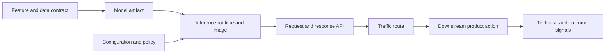
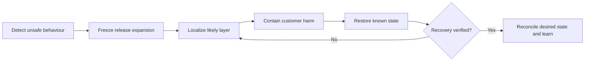
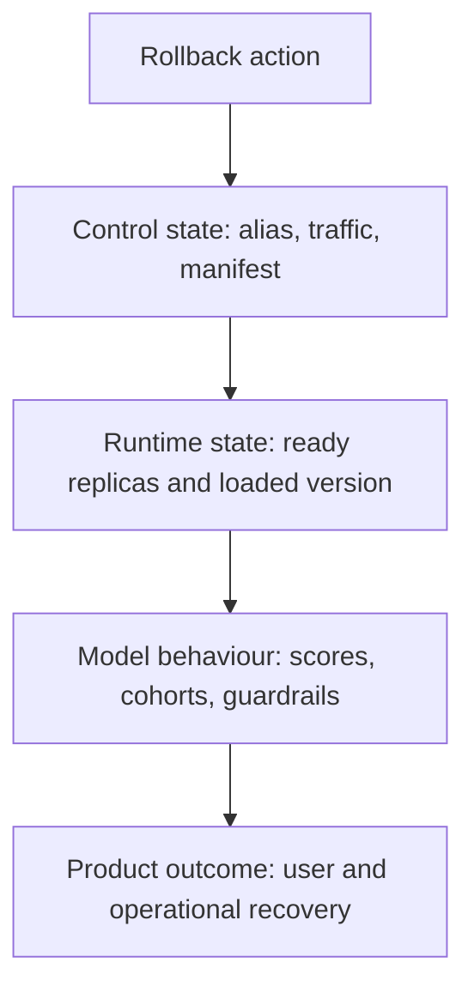

A **model rollback** restores production behaviour to a previously approved state after a release causes unacceptable risk. That state usually contains more than a model artifact. It may include the inference image, feature contract, request schema, configuration, traffic route, registry alias, caches, and downstream actions that consume predictions.

Rollback is therefore a state-restoration problem. The first task is to identify which part of the release changed behaviour. The second is to move the smallest safe control that reduces harm. The third is to verify customer recovery and make declared state agree with the emergency action.

## A Model Release Is A State Vector
<!-- section-summary: Production behaviour comes from several versioned layers, so rollback has to restore the layer that introduced the unsafe change. -->



The **release state vector** is the concrete version of each layer active in production:

| Layer | Example identity | Possible rollback control |
| --- | --- | --- |
| Feature or data contract | feature view version, transformation commit | restore feature definition or safe default |
| Model artifact | registry model version, artifact digest | load previous model version |
| Runtime | container image digest, dependency set | restore previous deployment revision |
| API contract | schema version | route to compatible endpoint or restore code |
| Configuration | threshold, route, policy bundle | revert config or feature flag |
| Traffic | candidate and stable weights | send traffic to stable deployment |
| Downstream action | automation rule or queue consumer | pause or disable harmful action |

This table explains why “move the model alias back” may fail. If the server loaded the candidate during startup and never resolves the alias again, the running process keeps serving it. If the inference image introduced a preprocessing bug, pointing to an older artifact inside the same broken image may not help. If a feature pipeline sends corrupt values to every version, model rollback treats the symptom while the bad input continues.

## Distinguish Containment, Rollback, And Recovery
<!-- section-summary: Immediate containment stops harm, rollback restores a known state, and recovery reconciles systems and confirms sustained outcomes. -->

**Containment** reduces exposure quickly. Examples include aborting a canary, disabling an automated decision, routing a cohort to manual review, or returning a deterministic fallback.

**Rollback** restores one or more release layers to a known approved version. It needs a target identity and a mechanism that actually changes the serving path.

**Recovery** verifies that technical and product signals improve, reconciles desired and live state, handles affected data or actions, and returns the service to a stable operating mode.

These phases can overlap during a fast incident. Keeping their purposes separate prevents a common mistake: declaring recovery because Kubernetes Pods are ready even though bad predictions already triggered downstream actions.

## Use A Seven-Step Rollback Control Loop
<!-- section-summary: A rollback proceeds through detection, freeze, localization, containment, restoration, verification, and reconciliation. -->



1. **Detect.** A technical, model, or product guardrail crosses its release boundary.
2. **Freeze.** Stop traffic expansion, retraining promotion, or repeated deployment.
3. **Localize.** Compare changed layers and live evidence.
4. **Contain.** Move users away from harm using the fastest safe control.
5. **Restore.** Apply the selected rollback to a concrete prior state.
6. **Verify.** Check loaded state, service health, prediction behaviour, and outcomes.
7. **Reconcile.** Update Git, registry records, configuration, incident state, and future tests.

The loop can return from verification to localization. If endpoint errors recover but prediction quality does not, the runtime rollback fixed one symptom and another layer still needs attention.

## Choose The Smallest Safe Rollback Layer
<!-- section-summary: Evidence about the symptom, changed surface, and known stable path determines which control can remove harm fastest. -->

Start by comparing the candidate with the stable release:

- Did only the model artifact change?
- Did preprocessing, dependencies, or API code change?
- Did a feature definition or source update at the same time?
- Did traffic reach a new region, accelerator, or cache path?
- Are latency and errors healthy while model or product signals degrade?
- Does the stable version still have compatible inputs and capacity?

Use the evidence to select the layer:

| Evidence | Likely first action |
| --- | --- |
| Canary quality fails; stable path is healthy | abort canary or set candidate weight to zero |
| Only registered artifact is wrong; service resolves alias dynamically | restore previous registry alias |
| New image or dependency causes failures | restore deployment revision or image digest |
| Several manifests changed together | restore the prior GitOps declaration |
| One feature or threshold causes harm | revert feature/config and validate compatibility |
| Predictions already trigger risky actions | pause downstream automation and review queued effects |

The smallest control is preferred only when it is genuinely safe. A model-only rollback can be unsafe if the old model expects feature schema v3 and production now emits v4. Compatibility evidence belongs in the rollback decision.

## Prepare The Decision Packet
<!-- section-summary: A compact packet binds the incident signal, current and target state, action owner, compatibility check, and verification criteria. -->

```yaml
incident: INC-2026-07-16-ETA-RAIN
impact: "ETA predictions are too optimistic for rainy London bike deliveries"
current_release:
  model_version: "18"
  image_digest: sha256:91ab...
  feature_contract: weather-features-v6
  candidate_traffic_percent: 25
last_approved_release:
  model_version: "17"
  image_digest: sha256:7f20...
  feature_contract: weather-features-v6
first_action: "abort canary and route all new requests to stable"
owner: ml-serving-oncall
compatibility: "stable release uses the current feature and API contracts"
verify:
  - candidate traffic is zero
  - prediction records show model version 17
  - endpoint errors and latency remain inside SLO
  - ETA error proxy for the affected cohort returns toward baseline
```

The packet is intentionally small. It gives the operator a concrete target, proves the previous path is compatible, and separates the first action from later diagnosis. It should be linked to the release record and incident timeline.

## Understand Registry Rollback Semantics
<!-- section-summary: A registry alias is a mutable reference; its operational effect depends on when and how the serving system resolves it. -->

Current MLflow guidance favours model version aliases and tags over deprecated registry stages. An alias such as `Champion` can point to a concrete version. Reassigning it can be a useful control when the serving workload resolves that alias at load time or on a controlled refresh.

Three states must be distinguished:

1. **Registry state:** which concrete version the alias points to.
2. **Deployment state:** which model reference the service configuration requests.
3. **Loaded state:** which concrete model each running replica actually holds.

Changing state 1 does not guarantee state 3 changed. A service may load once at startup, cache the artifact, poll periodically, or receive a deployment event. The runbook must document that path.

A focused MLflow operation can move and verify the alias:

```python
from mlflow import MlflowClient

client = MlflowClient()
client.set_registered_model_alias("prod.ml_team.delivery_eta", "Champion", "17")
restored = client.get_model_version_by_alias(
    "prod.ml_team.delivery_eta", "Champion"
)
assert restored.version == "17"
```

This verifies registry state only. Verification continues through deployment and prediction telemetry. Every prediction record should include the concrete loaded model version; an alias alone is too mutable for audit.

## Understand Traffic And Deployment Rollback
<!-- section-summary: Traffic controls protect users quickly, while deployment rollback restores the runtime when image, code, configuration, or model loading changed. -->

Progressive delivery keeps a stable workload available while a candidate receives limited traffic. When the candidate guardrail fails, traffic rollback is often the fastest containment.

For Argo Rollouts, `abort` scales the stable ReplicaSet and removes candidate traffic according to the rollout behaviour:

```bash
kubectl argo rollouts abort eta-api --namespace ml-serving
```

The rollout remains degraded because desired state still names the candidate. Restore the stable image or manifest after containment so the controller has a healthy target.

A standard Kubernetes Deployment can return to an earlier revision with `kubectl rollout undo`, provided the recorded revision contains the full desired runtime state. The operator should inspect history, choose the target, apply the rollback, and verify rollout status. If model loading happens outside the Deployment template, a Deployment rollback may leave the model unchanged.

Traffic safety also depends on stable capacity. A 10% stable path may not have enough replicas to accept 100% of requests. Progressive delivery should keep or rapidly recover enough stable capacity, and rollback drills should measure time to safe traffic.

## Reconcile GitOps After Emergency Action
<!-- section-summary: Emergency live changes protect traffic, then the source of truth must be updated so automation does not restore the unsafe release. -->

In GitOps, Git declares desired state and a controller such as Argo CD reconciles the cluster. An emergency traffic or rollout command changes live state. If Git still points to the candidate, automated reconciliation can try to restore it.

The preferred recovery is usually a reviewed revert or rollback commit that restores the stable image, model version, configuration, and traffic declaration. The live containment action remains in the incident record; the Git change makes the recovery durable.

Argo CD also supports application rollback to a previous deployment history entry. Its current documentation states that rollback cannot be performed while automated sync is enabled. A runbook using that mechanism must handle auto-sync through the owning configuration, especially for ApplicationSet-managed Applications, and then reconcile Git before normal automation resumes.

Avoid leaving live and declared state different after the incident. Drift hides the true production version and creates the next surprise.

## Verify Recovery Across Four Views
<!-- section-summary: Rollback verification checks control state, runtime state, model behaviour, and customer or operational outcomes on their appropriate clocks. -->



### Control state

Confirm the registry alias, traffic weights, deployment revision, Git commit, feature flag, and automation state that the action intended to change.

### Runtime state

Confirm healthy replicas, error rate, latency, saturation, and the concrete loaded model and image versions. A process health check should not be the only version evidence.

### Model behaviour

Check prediction distributions, missing-feature rates, uncertainty, guardrail proxies, and affected cohorts. Compare only new predictions produced after the rollback reached the runtime.

### Product outcome

Check customer complaints, manual-review volume, automated decisions, conversion, safety incidents, or later labels. Some outcomes arrive slowly. Keep the incident in a monitoring phase until enough evidence supports closure.

Verification needs explicit windows and sample requirements. A five-minute green service window may be enough for technical containment. Model and product recovery may need hours or days. Name the interim proxy and the final outcome separately.

## Handle Effects That Already Happened
<!-- section-summary: Restoring future predictions does not undo messages, decisions, queue items, or transactions already triggered by the bad release. -->

List downstream consumers and the time interval during which the candidate was active. Identify affected prediction IDs and action IDs. Depending on the product, recovery may require cancelling queued work, re-scoring records, notifying users, reversing a transaction through its domain workflow, or sending cases to human review.

Do not “undo” business effects by deleting records. Use the authoritative service's reversal or correction operation so audit and idempotency remain intact. Preserve the candidate's prediction records for investigation under the appropriate privacy and retention policy.

Batch releases need special handling. Reverting the model does not repair an output partition already consumed. Version batch outputs, record their consumers, and design reprocessing as a new run with a clear replacement relationship.

## Build The Runbook Before Release
<!-- section-summary: A useful rollback runbook records targets, mechanisms, authority, compatibility, verification, and reconciliation for each release layer. -->

For every production model, the runbook should answer:

- What is the complete current release state vector?
- Which previous state is approved and still compatible?
- Which control contains harm fastest?
- Who may operate and approve that control?
- How does the runtime load or resolve the model?
- How is the loaded version observed?
- Which technical, model, and product checks prove recovery?
- Which downstream effects need review?
- How does declared state converge after emergency action?
- When is the previous version safe to remove?

Practice the path. A rollback target that cannot load, an expired credential, a deleted image, or a stable deployment with insufficient capacity is not a usable recovery option. Drills should measure detection-to-freeze, freeze-to-safe-traffic, and safe-traffic-to-verified-recovery.

## The Durable Rollback Method
<!-- section-summary: Model rollback restores a known state through the smallest compatible control, then proves and reconciles the recovery. -->

Represent the release as a state vector. Freeze expansion when a guardrail fails. Localize the likely layer. Contain harm. Restore a concrete compatible target. Verify registry or configuration state, loaded runtime state, model behaviour, and product outcomes. Reconcile Git and automation. Review effects that already occurred, then turn the incident into a stronger release test and runbook.

The commands are the final mechanism. The transferable skill is knowing which state each command changes and which evidence proves that customers actually recovered.

## References

- [MLflow Model Registry workflows and aliases](https://mlflow.org/docs/latest/ml/model-registry/workflow/)
- [Kubernetes Deployment rollback](https://kubernetes.io/docs/concepts/workloads/controllers/deployment/#rolling-back-a-deployment)
- [Argo Rollouts abort behaviour](https://argo-rollouts.readthedocs.io/en/stable/getting-started/)
- [Argo Rollouts rollback windows](https://argo-rollouts.readthedocs.io/en/stable/features/rollback/)
- [Argo CD application rollback](https://argo-cd.readthedocs.io/en/stable/user-guide/commands/argocd_app_rollback/)
- [Argo CD automated sync policy](https://argo-cd.readthedocs.io/en/stable/user-guide/auto_sync/)
- [Google SRE incident response](https://sre.google/sre-book/managing-incidents/)
