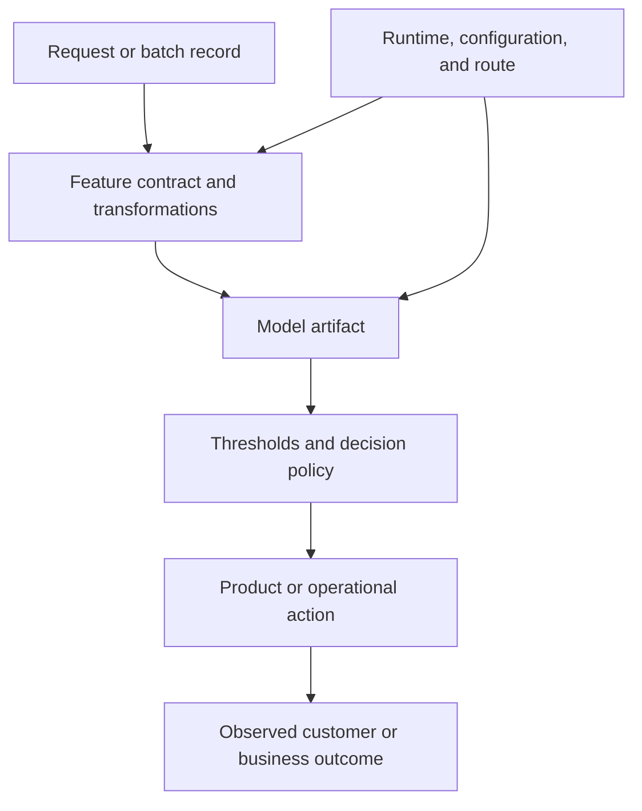
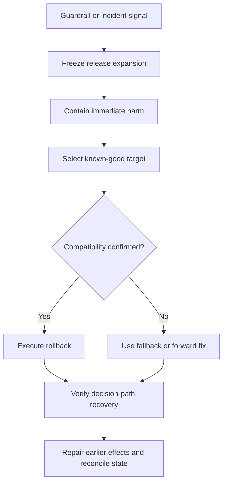
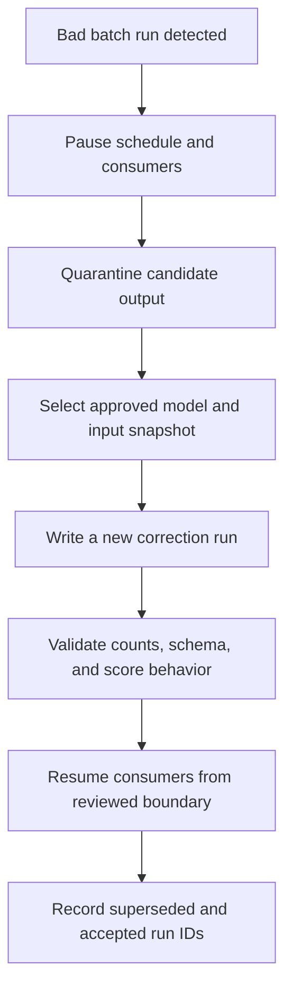
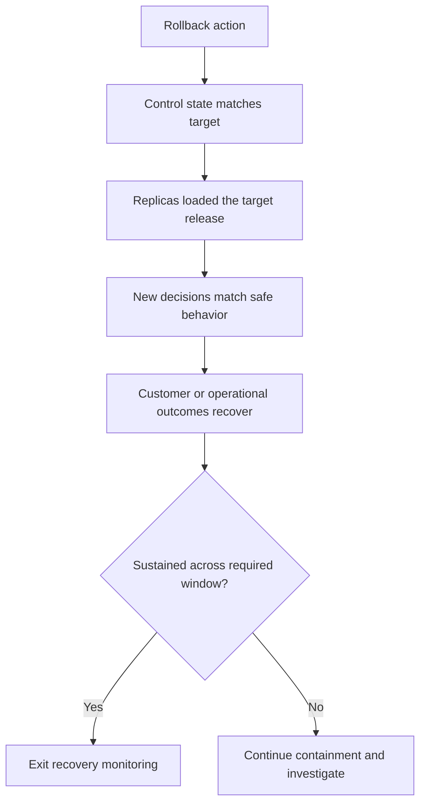

## Table of Contents

1. [What A Model Rollback Must Restore](#what-a-model-rollback-must-restore)
2. [What Rollback Can And Cannot Change](#what-rollback-can-and-cannot-change)
3. [Identify The Complete Release To Restore](#identify-the-complete-release-to-restore)
4. [Prepare And Test Rollback Before Release](#prepare-and-test-rollback-before-release)
5. [Define Rollback Triggers And Authorized Actions](#define-rollback-triggers-and-authorized-actions)
6. [Use Separate Steps For Containment, Rollback, And Recovery](#use-separate-steps-for-containment-rollback-and-recovery)
7. [Choose Between Rollback And A New Corrective Release](#choose-between-rollback-and-a-new-corrective-release)
8. [Roll Back an Online Decision Service Safely](#roll-back-an-online-decision-service-safely)
9. [Know Which Control Changes The Registry, Workload, Or Traffic](#know-which-control-changes-the-registry-workload-or-traffic)
10. [Check Feature, API, And Policy Compatibility Before Rollback](#check-feature-api-and-policy-compatibility-before-rollback)
11. [Include Caches, In-Flight Work, And State In Rollback](#include-caches-in-flight-work-and-state-in-rollback)
12. [Restore Batch Predictions As Versioned Data](#restore-batch-predictions-as-versioned-data)
13. [Verify Recovery From Infrastructure To Product Outcome](#verify-recovery-from-infrastructure-to-product-outcome)
14. [Repair Decisions Made By The Bad Release](#repair-decisions-made-by-the-bad-release)
15. [Update GitOps And The Release Record After Emergency Rollback](#update-gitops-and-the-release-record-after-emergency-rollback)
16. [Practice The Complete Rollback Path](#practice-the-complete-rollback-path)
17. [The Main Idea](#the-main-idea)
18. [References](#references)

## What A Model Rollback Must Restore
<!-- section-summary: A model rollback restores the complete set of compatible components that produced an approved decision instead of changing one model file in isolation. -->

At a high level, a **model rollback** moves production from an unsafe release to a previously approved way of making decisions. The goal is to stop new harm quickly and restore behavior the team already understands.

Imagine a new ranking model starts placing unavailable products at the top of search results. The API still returns `200 OK`, latency looks healthy, and every container is ready. Customers see poor results anyway. The team needs to send new searches back through the previous ranking path.

Changing the model file may solve the problem if the artifact was the only change. Production releases often change more. The candidate may use a new feature transformation, container image, request schema, threshold, fallback rule, or cache format. Loading the old model with those new components can produce errors or a different failure.

You can think of a decision path as a recipe, ingredients, and kitchen equipment working together. Restoring an old recipe gives an uncertain result if the ingredients and equipment have changed. In MLOps, the safe rollback target is therefore a **known-good decision path**: a compatible collection of model, data contract, runtime, policy, and routing versions.


```mermaid
flowchart TD
    Q["Request or batch record"] --> F["Feature contract and transformations"]
    F --> M["Model artifact"]
    M --> P["Thresholds and decision policy"]
    P --> A["Product or operational action"]
    R["Runtime, configuration, and route"] --> F
    R --> M
    A --> O["Observed customer or business outcome"]
```

Rollback restores enough of this path to produce safe future decisions. The exact boundary depends on what changed and which previous components remain compatible.

## What Rollback Can And Cannot Change
<!-- section-summary: Rollback changes future execution after the cutover point, while earlier decisions and downstream effects require separate correction work. -->

A rollback controls work that reaches the restored path after cutover. New requests can use the stable endpoint. New batch partitions can use the approved model and feature snapshot. New automated decisions can follow the earlier policy.

The rollback cannot travel backward through actions that already happened. A notification may already have reached a customer. A recommendation may already have changed behavior. A fraud decision may have blocked a payment. A batch score may already have entered a warehouse table, queue, or external system.

This creates two recovery tracks:

- **Prospective recovery** restores safe decisions for new work.
- **Retrospective repair** finds affected earlier decisions and applies the domain’s correction process.

For example, routing traffic to the stable fraud service stops new decisions from the candidate. Previously blocked payments still need review through the payment system. Deleting prediction logs would erase evidence and leave the business effect unchanged.

The cutover time matters. Record the first confirmed candidate exposure and the first confirmed stable decision after rollback. These two points define the interval for impact analysis. Prediction IDs, model versions, policy versions, and action IDs make that analysis possible.

## Identify The Complete Release To Restore
<!-- section-summary: A rollback target is a reviewed release bundle with immutable identities for every component that influences the decision. -->

The “previous model” is an ambiguous target. It might mean the previous registry version, previous endpoint deployment, previous Git commit, or previous policy. A **release bundle** removes that ambiguity by recording the concrete identity of every relevant layer.

The model should use an immutable registry version or artifact digest. The runtime should use an image digest. Feature transformations should use a code commit or feature-view version. Schemas, thresholds, fallbacks, and route configuration should carry their own versions. Batch jobs also need input snapshot and output-run identities.

A compact release record can preserve this relationship:

```yaml
release_id: search-ranking-r43
model_uri: models:/prod.search.ranker/43
image: registry.example/ml/search@sha256:8f3a...
feature_contract: search-features-v7
policy_version: ranking-policy-v12
api_schema: search-response-v4
deployment_revision: search-api-6d49f
previous_approved_release: search-ranking-r42
```

The release ID acts as the name of the whole decision path. The component fields explain what it contains. During an incident, the operator selects `search-ranking-r42` and verifies that its component versions are still available and compatible with current production inputs.

An alias such as `Champion` or `production` is helpful for discovery, yet it is mutable. Incident records and prediction telemetry should preserve the concrete model version resolved from that alias. Otherwise the same alias can refer to different artifacts at different moments.

## Prepare And Test Rollback Before Release
<!-- section-summary: A usable rollback depends on retained artifacts, compatibility evidence, stable capacity, observability, and rehearsed authority established before deployment. -->

Rollback speed is mostly designed before the incident. An operator cannot restore an image that the registry removed, a model whose dependencies vanished, or a stable endpoint that lacks capacity.

### Retain And Test The Known-Good Release

Keep the previous approved model, image, feature code, policy, schema, and deployment declaration for the agreed recovery window. Load the complete bundle in staging or a shadow environment. Run a small set of contract and behavioral checks against current request shapes and representative features.

The previous release also needs production capacity. A canary may send only a small share of traffic to stable or candidate workloads, depending on the rollout design. Confirm that the stable path can accept full load or scale quickly enough to meet the recovery objective.

### Expose The Active Release Identity

Every prediction record should carry the concrete model version, release ID, policy version, and feature contract. Service build information should expose the image or code revision. OpenTelemetry resource attributes, structured logs, and low-cardinality metrics can connect a request to the running release.

A readiness probe proves that a process can receive traffic. Model identity requires separate evidence. Add a safe version endpoint, startup record, or prediction field that reports the concrete loaded identity.

### Keep Rollback Authority And Access Ready

The runbook should name who can freeze a rollout, shift traffic, disable automation, reassign a registry alias, approve a batch correction, and reconcile Git. Emergency credentials need regular validation. A command written in a document has little value if the on-call engineer lacks permission to run it.

## Define Rollback Triggers And Authorized Actions
<!-- section-summary: Predefined technical, model, and product guardrails should identify both the rollback condition and the person authorized to act. -->

A rollback trigger is a condition that says the release has crossed an agreed risk boundary. Defining it before deployment removes a long debate while harm is growing.

Technical triggers include error rate, timeout rate, latency, resource saturation, failed readiness, and cost spikes. Model triggers include invalid outputs, missing-feature rates, score-distribution shifts, uncertainty, calibration proxies, and slice-specific quality. Product triggers include complaints, unsafe actions, cancellations, manual-review overload, or delayed ground-truth degradation.

Each trigger should state the measurement window, affected population, threshold, minimum sample, and action. A rare safety event may require immediate containment after one confirmed case. A noisy conversion metric may need a larger sample and statistical evidence. The trigger should match the severity and measurement delay of the risk.

The action can differ by signal. A crashing candidate can trigger automatic traffic removal. A fairness concern may pause automation and require human review. A suspicious delayed label may freeze promotion while the team validates label freshness. Automation should act only where the signal is reliable and the response is safely reversible.

## Use Separate Steps For Containment, Rollback, And Recovery
<!-- section-summary: Containment limits exposure, rollback restores a target path, and recovery proves that the system and affected outcomes have stabilized. -->

Rollback incidents involve immediate safety, technical restoration, and longer-term cleanup. Splitting that work into three phases helps the team say exactly what has been achieved and what remains open.

The phases are containment, rollback, and recovery. They can overlap during a fast response, yet each one has a different completion condition.

**Containment** reduces immediate harm. The team can freeze traffic expansion, set candidate weight to zero, disable an automated action, or use a deterministic fallback. Containment can happen before the exact root cause is known.

**Rollback** applies a chosen known-good release bundle. It changes the serving or batch path that will process new work.

**Recovery** proves that the restored path is active, customer behavior is improving, downstream effects are addressed, and declared configuration agrees with production.


```mermaid
flowchart TD
    D["Guardrail or incident signal"] --> F["Freeze release expansion"]
    F --> C["Contain immediate harm"]
    C --> T["Select known-good target"]
    T --> K{"Compatibility confirmed?"}
    K -->|"Yes"| R["Execute rollback"]
    K -->|"No"| X["Use fallback or forward fix"]
    R --> V["Verify decision-path recovery"]
    X --> V
    V --> E["Repair earlier effects and reconcile state"]
```

A successful command is only one step. If Kubernetes reports healthy Pods while the old candidate remains in a model cache, containment has failed. If new decisions recover while earlier automated actions remain queued, prospective recovery succeeded and retrospective repair remains open.

## Choose Between Rollback And A New Corrective Release
<!-- section-summary: Rollback is favored when a compatible approved target is ready; a forward fix is safer when earlier components cannot operate with current state. -->

A **forward fix** creates and deploys a new correction instead of restoring the previous release. Both paths can be valid. The safest choice depends on time to reduce harm, confidence in the target, and reversibility of recent changes.

Rollback usually fits if the previous path is available, compatible, recently proven, and fast to activate. It reduces the number of new decisions made by an uncertain release and gives the team time for careful diagnosis.

A forward fix may fit if a database or feature-schema migration is irreversible, the previous model cannot read current inputs, a security patch must remain, or the candidate wrote state the earlier runtime cannot understand. Even then, containment comes first: disable the risky action, route to manual review, or use a safe fallback while the fix is built and tested.

Avoid editing the failing release directly under pressure without a reproducible build. That creates an untracked production version and weakens later verification. Build a new immutable release, record its relationship to the incident, and send it through the shortest approved emergency path.

## Roll Back an Online Decision Service Safely
<!-- section-summary: Online rollback freezes expansion, protects traffic, activates a compatible stable path, and confirms that new requests use it. -->

Online systems make decisions request by request. Their rollback path should prioritize fast containment while preserving enough evidence for diagnosis.

### Freeze Changes And Record The Live State

Stop progressive promotion, automated model deployment, and retraining promotion. Record current traffic weights, replica counts, endpoint revisions, registry alias, loaded model versions, feature contract, and policy version. This snapshot explains what users were receiving before the team changes production.

### Move New Traffic To A Safe Path

If a pre-warmed stable deployment is healthy and compatible, route new traffic to it. Managed endpoints, service meshes, load balancers, and Argo Rollouts can change weights quickly. Watch capacity during the shift because a small stable pool may need to absorb the whole workload.

Keep the candidate available for a short evidence window if policy allows, while its traffic remains zero. Abruptly deleting it can remove logs, loaded-version evidence, or the environment needed to reproduce the failure.

### Update The Declared Production State

Traffic removal contains the incident. The deployment declaration should then point to the stable image, model reference, feature configuration, and policy. Restart or reload replicas through the documented mechanism. Confirm that new requests contain the stable release ID.

### Monitor The Traffic Cutover

Requests already in flight may finish on the candidate after weights change. Long-lived connections and client-side caches can extend this tail. Track the final candidate prediction time and the first stable prediction time. Verification queries should filter by concrete release identity and decision time instead of relying only on the wall-clock command time.

## Know Which Control Changes The Registry, Workload, Or Traffic
<!-- section-summary: Registry aliases, deployment revisions, and traffic weights affect different layers, so operators must verify their effect on the loaded runtime. -->

Production platforms offer several controls that can help reverse a release. Each control reaches a different layer. Operators need to know whether they changed a registry reference, the running workload, or request routing.

Several of these controls are called “rollback,” although their effects are different. Combining them safely requires verification at the loaded runtime.

### MLflow aliases select a registry version

MLflow Model Registry aliases map a readable name to a concrete model version. Reassigning an alias can restore the registry reference:

```python
from mlflow import MlflowClient

client = MlflowClient()
client.set_registered_model_alias("prod.search.ranker", "Champion", 42)
restored = client.get_model_version_by_alias("prod.search.ranker", "Champion")
assert restored.version == "42"
```

This confirms registry state. A workload that loads `models:/prod.search.ranker@Champion` on its next execution resolves version 42. A long-running process that loaded the candidate at startup keeps its in-memory object until a reload or restart occurs. Loaded-version telemetry closes that gap.

Managed registries provide similar immutable versions and deployment references. The same rule applies: changing a catalog reference and changing the model inside running replicas are separate events.

### Argo Rollouts can return traffic to stable

Argo Rollouts keeps a stable ReplicaSet during progressive delivery. Its abort command scales the stable version and removes the candidate from service:

```bash
kubectl argo rollouts abort search-api --namespace ml-serving
```

The Rollout remains `Degraded` because desired state still names the candidate. Apply or commit the previous stable specification after containment so the controller has a healthy desired target.

### Kubernetes undo restores the Pod template

A Kubernetes Deployment records revisions after changes to its Pod template. `kubectl rollout undo` restores an earlier Pod template revision:

```bash
kubectl rollout history deployment/search-api --namespace ml-serving
kubectl rollout undo deployment/search-api --to-revision=12 --namespace ml-serving
kubectl rollout status deployment/search-api --namespace ml-serving
```

This action covers the image and other fields inside the recorded Pod template. External ConfigMaps, registry aliases, feature tables, and database migrations remain unchanged. The release bundle shows which additional controls must move together.

## Check Feature, API, And Policy Compatibility Before Rollback
<!-- section-summary: The previous model is safe only if current features, request schemas, outputs, and decision policies still satisfy its contract. -->

Compatibility is the gate between selecting a target and activating it. The fact that a model performed well last week says little about whether it can consume today’s production contract.

### Feature compatibility

The stable model may expect `search-features-v6` while production now emits `v7`. A renamed column, changed category encoding, reordered tensor, new null policy, or unit conversion can cause a crash or silent prediction error. Validate the model signature and run representative records through the entire old feature transformation.

If the current feature store keeps versioned views, bind the stable model to its approved feature definition. If only the new schema exists, use a tested compatibility adapter or choose a forward fix. Reconstructing old features from guesswork during an incident creates further uncertainty.

### Request and response compatibility

The old endpoint must understand current requests, and its response must satisfy current consumers. A field removed from the old response can break an application even if predictions are accurate. Contract tests should cover required fields, types, null behavior, ranges, and fallback semantics.

### Policy compatibility

Models usually feed a threshold, ranking rule, eligibility policy, or human-review workflow. Rolling back the model while leaving a candidate threshold active produces a new untested combination. Store policy version with the model release and restore the approved pair unless the incident plan explicitly validates another combination.

## Include Caches, In-Flight Work, And State In Rollback
<!-- section-summary: Cached artifacts, long-running requests, online-learning state, and downstream queues can keep candidate behavior alive after configuration changes. -->

Production systems retain state in places that a deployment command cannot see. A model server may cache an artifact on local disk. A feature service may cache transformed values. An API gateway may cache responses. A stream processor may hold queued decisions. An online learner may update parameters or counters continuously.

Cache keys should include the release components that affect their value, such as model version, feature contract, and policy version. During rollback, invalidate candidate entries or advance the cache namespace. A global cache flush can overload databases and feature stores, so the runbook should prefer targeted invalidation and plan for refill capacity.

Stateful systems need a recovery point. If treatment updates an online model, bandit state, deduplication store, or aggregate feature, loading the old artifact leaves the mutated state in place. Recovery may restore an approved snapshot, replay events up to a safe offset, or launch a clean state namespace. The choice depends on data loss tolerance and replay semantics.

Queues and streams require a boundary too. Pause consumers that create harmful actions, record the candidate offset or message interval, and resume with an idempotent correction plan. Reprocessing without idempotency can duplicate emails, charges, tickets, or inventory changes.

## Restore Batch Predictions As Versioned Data
<!-- section-summary: Batch rollback creates a traceable replacement run and controls consumers, because changing the model cannot repair outputs already written. -->

Batch inference produces versioned datasets on a schedule. A faulty run may write millions of scores before monitoring detects the issue. The recovery unit is therefore the output run and its consumers.

First pause future schedules and downstream jobs. Record the candidate run ID, model version, feature snapshot, input partitions, output table version, and consumer checkpoints. Quarantine the candidate output so new consumers cannot read it. Preserve it for investigation under the normal retention policy.

Next create a correction run with the approved release bundle and the same reproducible input snapshot. Write the result under a new run identity with a `supersedes_run_id` relationship. This provides an audit trail and lets consumers select the current approved output without overwriting history.

For Delta Lake or Apache Iceberg tables in Databricks, table history records each modifying operation and supports time travel to a previous version. That can help inspect the pre-incident state or reproduce earlier outputs:

```sql
DESCRIBE HISTORY prod.daily_risk_scores;

SELECT *
FROM prod.daily_risk_scores VERSION AS OF 418
WHERE scoring_date = :affected_partition;
```

Table time travel cannot recall files already exported or actions already consumed. Resume each downstream consumer from a reviewed boundary, deduplicate by decision or action ID, and record whether it accepted the correction run.


```mermaid
flowchart TD
    B["Bad batch run detected"] --> P["Pause schedule and consumers"]
    P --> Q["Quarantine candidate output"]
    Q --> S["Select approved model and input snapshot"]
    S --> N["Write a new correction run"]
    N --> V["Validate counts, schema, and score behavior"]
    V --> C["Resume consumers from reviewed boundary"]
    C --> A["Record superseded and accepted run IDs"]
```

## Verify Recovery From Infrastructure To Product Outcome
<!-- section-summary: Recovery verification follows the change from declared control state through loaded runtime, model behavior, and customer outcomes. -->

Verification should answer a simple question: “Are new decisions safe again?” A green deployment status contributes one piece of evidence.

### Verify Control State

Confirm the intended registry version, traffic weights, deployment revision, feature configuration, policy version, scheduler state, and Git commit. This verifies that the requested controls moved.

### Verify The Loaded Runtime

Confirm healthy replicas and the concrete release ID loaded by each replica. Check errors, latency, saturation, cold-start behavior, and stable capacity. Query new prediction logs to prove that candidate traffic reached zero after the cutover tail.

### Verify Model And Decision Behaviour

Compare output distributions, missing-feature rates, thresholds, fallback frequency, and affected segments with the approved baseline. A service can be operationally healthy while returning harmful decisions, so model and policy guardrails stay active after rollback.

### Verify Product Outcomes

Review the user or business signal that triggered the incident. Complaints or manual-review volume may move quickly. Ground-truth quality, defaults, returns, or retention may arrive later. Use a named interim proxy for early confidence and keep the incident in monitoring until the final outcome window matures.


```mermaid
flowchart TD
    A["Rollback action"] --> C["Control state matches target"]
    C --> R["Replicas loaded the target release"]
    R --> D["New decisions match safe behavior"]
    D --> P["Customer or operational outcomes recover"]
    P --> X{"Sustained across required window?"}
    X -->|"Yes"| E["Exit recovery monitoring"]
    X -->|"No"| I["Continue containment and investigate"]
```

Every verification step needs an owner, query or dashboard, sample requirement, and time window. Save the evidence in the incident and release records so closure can be reviewed later.

## Repair Decisions Made By The Bad Release
<!-- section-summary: Downstream repair uses authoritative domain operations to find, review, reverse, or replace actions created during the unsafe interval. -->

Start from the candidate exposure interval and enumerate prediction IDs. Join them to policy decisions, queue messages, transactions, notifications, tickets, or other actions. This creates the actual blast radius.

The correction belongs to the system that owns the business action. A payment service reverses or releases a payment hold. A messaging service suppresses queued notifications. A case-management system reopens affected cases. A ranking system can re-score unconsumed items. Human review may be the safest path for high-impact decisions.

Use idempotent correction commands keyed by action ID. If a correction job retries, it should recognize completed repairs and avoid applying them twice. Preserve the original prediction, correction reason, approving person or policy, and final outcome.

Some effects cannot be fully reversed. A user may already have seen harmful content or acted on a recommendation. Recovery then includes communication, support, reporting, and prevention. The incident can close only after the accountable owner accepts the residual risk.

## Update GitOps And The Release Record After Emergency Rollback
<!-- section-summary: Emergency production changes become durable only after Git, automation, registry references, and release records agree with the recovered state. -->

GitOps controllers continuously move live infrastructure toward the state declared in Git. An emergency command may protect users immediately while Git still names the candidate. Automated reconciliation can then reintroduce the unsafe release.

Create a reviewed revert or recovery commit that restores the approved image, model reference, feature configuration, policy, and traffic declaration. Sync it through the normal controller, then confirm live state matches the commit. Record emergency commands separately in the incident timeline.

Argo CD documents that application rollback is unavailable while automated sync is enabled. Teams using that history mechanism need an approved procedure for managing sync and must still update the owning Git declaration. ApplicationSet-managed applications require changes through their owning ApplicationSet because temporary child-application changes can be overwritten.

The release record should capture the failed release, rollback target, trigger, cutover interval, operator, compatibility evidence, verification results, affected decisions, and follow-up work. This history helps later incidents answer why a release moved and which path was proven safe.

## Practice The Complete Rollback Path
<!-- section-summary: Rollback drills prove that artifacts, permissions, capacity, commands, verification, and downstream correction work under realistic conditions. -->

A runbook can look complete while its target image has expired, its alias points somewhere unexpected, or its operator lacks permission. Practice turns those hidden assumptions into evidence.

A rollback drill should activate a non-production or low-risk candidate, trigger containment, restore the approved release bundle, verify loaded versions, check cache behavior, and reconcile Git. Batch drills should produce a bad test run, quarantine it, create a correction run, and resume a test consumer without duplication.

Measure time from detection to frozen promotion, safe traffic, confirmed stable decisions, durable desired state, and completed downstream repair. The slowest step tells the team where to improve automation or ownership.

Keep the previous release only as long as policy and recovery objectives require, while ensuring at least one tested compatible target remains. Retention without compatibility tests gives false confidence. Compatibility tests without retained artifacts give no executable recovery path.

## The Main Idea
<!-- section-summary: Model rollback restores a compatible decision path, proves that new outcomes recovered, and repairs earlier decisions through their owning systems. -->

A production model is part of a larger decision path. Safe rollback identifies the complete previous release, confirms compatibility, contains harm, moves online traffic or batch work to the approved path, and verifies the concrete version that handled new decisions.

The work continues after the serving change. Caches, state, queues, batch outputs, GitOps declarations, and already-consumed actions can preserve candidate effects. A mature recovery process gives each of those effects an owner and an evidence-based closure condition.

The most important skill is understanding what each control changes. A registry alias changes a reference. A traffic weight changes routing. A deployment revision changes a Pod template. A batch correction creates replacement data. Recovery is complete only after those controls combine into safe customer and business outcomes.

## References

- [MLflow: Model Registry workflows and aliases](https://mlflow.org/docs/latest/ml/model-registry/workflow/)
- [Kubernetes: Rolling back a Deployment](https://kubernetes.io/docs/concepts/workloads/controllers/deployment/#rolling-back-a-deployment)
- [Argo Rollouts: Aborting a rollout](https://argo-rollouts.readthedocs.io/en/stable/getting-started/#4-aborting-a-rollout)
- [Argo Rollouts: Rollback windows](https://argo-rollouts.readthedocs.io/en/stable/features/rollback/)
- [Argo CD: Automated sync policy](https://argo-cd.readthedocs.io/en/stable/user-guide/auto_sync/)
- [Argo CD: Application rollback](https://argo-cd.readthedocs.io/en/stable/user-guide/commands/argocd_app_rollback/)
- [Databricks: Table history and time travel](https://docs.databricks.com/aws/en/tables/history)
- [OpenTelemetry: Semantic conventions](https://opentelemetry.io/docs/specs/semconv/)
- [Google SRE: Managing incidents](https://sre.google/sre-book/managing-incidents/)
