## What Experiment Design and Hyperparameter Optimization Solve
<!-- section-summary: Experiment design makes model comparisons fair, while hyperparameter optimization searches a declared configuration space under a fixed budget. -->

An **ML experiment** is a planned comparison that answers a specific question with fixed data, metrics, and decision rules. **Hyperparameter optimization (HPO)** is a controlled search over training settings chosen before training, such as learning rate, tree depth, regularization, or embedding size. HPO can find a useful configuration, while experiment design tells you whether the comparison deserves trust.

Imagine **MarketTrail**, a marketplace for outdoor equipment. Its search team ranks tents, climbing shoes, and camping stoves. The current ranking model uses product text, category, price, seller quality, and recent clicks. A proposed model adds a query-product embedding and a gradient-boosted ranker. The team wants to know whether the new model improves useful search results without hiding smaller sellers or adding too much scoring latency.

An engineer could launch 500 trials and keep the run with the largest validation score. That workflow creates several problems. The search can overfit one validation set. The best run may violate latency or fairness limits. Two trials may use different data snapshots. Failed runs may disappear from the report. Repeated test-set checks can turn the test set into another tuning set.

MarketTrail uses this workflow instead:

| Step | Question | Artifact |
|---|---|---|
| Hypothesis | What change should help, and why? | Experiment contract |
| Data | Which frozen examples support a fair comparison? | Dataset manifest and split hashes |
| Metrics | What improves, and what must stay safe? | Objective and guardrail definitions |
| Search | Which parameters and ranges may change? | Versioned search-space config |
| Execution | How are trials tracked and budgeted? | Optuna study plus MLflow parent and child runs |
| Selection | Which validation evidence chooses the candidate? | Candidate selection report |
| Final evaluation | How does the locked candidate perform on untouched data? | Test report with uncertainty and slices |

The sequence matters. HPO runs after the team defines the comparison. A leaked split, vague objective, or risk-blind metric will undermine every result from a larger search.

```mermaid
flowchart LR
    Hypothesis["Hypothesis and baseline"] --> Data["Frozen comparison data"]
    Data --> Metrics["Objective, guardrails, and uncertainty"]
    Metrics --> Space["Bounded search space and budget"]
    Space --> Trials["Tracked trials and pruning"]
    Trials --> Select["Validation-based candidate selection"]
    Select --> Test["One protected final evaluation"]
    Test --> Decision["Advance, reject, or revise hypothesis"]
```



The workflow fixes the scientific and product question before automation explores settings. Pruning and budget manage cost during the search. Candidate selection uses validation evidence, while the protected test remains outside the repeated tuning loop.

## Write the Experiment Contract
<!-- section-summary: An experiment contract records the hypothesis, baseline, change, data, metrics, budget, owners, and decision rule before trials run. -->

The **experiment contract** is a short reviewable record of what the team plans to learn. It keeps the question stable while code and trials change. MarketTrail's contract names one primary change: add the query-product embedding and tune the ranking model around it.

```yaml
experiment:
  id: search-ranking-embedding-v1
  owner: marketplace-search-ml
  reviewer: search-relevance-lead
  hypothesis: >-
    Query-product embeddings will improve ranking for long and specific queries,
    especially when exact product-title words differ from the query.
  baseline:
    model_version: search-ranker-41
    code_commit: 7e18f42
  candidate_change:
    feature_set: lexical-plus-query-product-embedding-v1
    model_family: lightgbm-lambdarank
  data_manifest: s3://markettrail-ml/manifests/search-2026-06-30.json
  primary_metric: ndcg_at_10
  guardrails:
    p95_scoring_latency_ms: "<= 35"
    small_seller_exposure_delta: ">= -0.02"
    zero_result_query_rate_delta: "<= 0.001"
  budget:
    max_trials: 80
    max_wall_clock_hours: 10
    max_cpu_hours: 320
  selection_rule: >-
    Highest mean validation nDCG@10 among trials that pass every guardrail,
    followed by a locked test evaluation.
```

**nDCG@10**, or normalized discounted cumulative gain at 10, measures whether relevant products appear near the top of the first ten results. The metric gives more credit to relevant items near the top because users pay more attention to those positions. MarketTrail will teach ranking metrics in depth in the evaluation module; this contract defines the exact variant and cutoff so every trial uses the same calculation.

A **guardrail** is a condition the candidate must satisfy even when the primary metric improves. MarketTrail uses latency, small-seller exposure, and zero-result queries. A trial with the best ranking metric can still fail selection if it makes live search too slow or harms an important seller group.

The contract also defines ownership. The ML owner runs the study. The relevance lead reviews metric definitions and judgments. The serving owner validates latency. A product analyst reviews seller exposure. Those approvals prevent one score from silently representing every product concern.

## Freeze the Comparison Data
<!-- section-summary: Fair HPO uses one immutable dataset manifest and split policy across all trials, with the final test labels protected from search decisions. -->

Every trial needs the same evidence. MarketTrail builds examples from search impressions, result positions, clicks, purchases, query text, product snapshots, and seller attributes. The data has a time boundary because future clicks cannot train a model evaluated on earlier searches.

The team uses three periods:

- Training: April 1 through May 31.
- Validation: June 1 through June 15.
- Test: June 16 through June 30.

The validation period chooses hyperparameters. The test period evaluates one locked candidate after selection. The team also groups events by user so one person's near-duplicate sessions do not cross split boundaries. A separate query slice marks brand-new or rare queries.

```json
{
  "manifest_id": "search-2026-06-30",
  "source_table": "warehouse.search_training_examples_v12",
  "feature_snapshot": "iceberg://ml/search_features@snapshot=9184112",
  "label_definition": "satisfied_click_or_purchase_v4",
  "splits": {
    "train": {"start": "2026-04-01", "end": "2026-05-31", "rows": 82104419},
    "validation": {"start": "2026-06-01", "end": "2026-06-15", "rows": 20182402},
    "test": {"start": "2026-06-16", "end": "2026-06-30", "rows": 20877114}
  },
  "group_key": "pseudonymous_user_id",
  "manifest_sha256": "dfe6c2a9..."
}
```

The search launcher verifies the manifest hash before every trial. It logs the manifest ID and refuses an unversioned table name. This prevents trial 3 from using Monday's features while trial 74 silently uses a rebuilt table from Thursday.

For smaller independent and identically distributed datasets, cross-validation may fit better than one validation period. **Cross-validation** trains and validates across several folds so each example can contribute to validation once. Time-dependent and grouped data need splitters that preserve those constraints. A default random K-fold split can leak future behavior or repeated users across folds.

The test set remains inaccessible to the objective function. The HPO worker credentials can read training and validation partitions only. A separate evaluation job reads the test partition after the candidate config has been committed. This access boundary supports the statistical rule with a technical control.

## Choose Metrics and a Baseline
<!-- section-summary: The baseline and metric code must stay fixed so the search measures parameter effects rather than changing evaluation rules. -->

A **baseline** is the current model or a simple reference that the candidate must beat. MarketTrail reruns `search-ranker-41` on the same frozen manifest. This creates an apples-to-apples result and catches changes in metric code or data extraction.

The validation report includes several metrics:

| Metric | Purpose | Selection role |
|---|---|---|
| Mean nDCG@10 | Overall ranking quality | Primary objective |
| Long-query nDCG@10 | Tests the embedding hypothesis | Required slice evidence |
| P95 scoring latency | Protects interactive response time | Hard guardrail |
| Small-seller exposure delta | Detects a product distribution regression | Hard guardrail |
| Zero-result query rate | Protects basic search coverage | Hard guardrail |
| Model size | Helps serving capacity review | Reported constraint |

MarketTrail versions the metric package in the container image. Every trial logs `metric_package_commit`, query-judgment version, and slice definition. If the team changes the relevance labels or nDCG calculation, it creates a new study rather than mixing incompatible trial scores.

The objective should avoid compressing unrelated risks into one unexplained formula. A weighted sum such as `nDCG - 0.001 * latency` can hide a severe latency failure behind a relevance gain. MarketTrail maximizes nDCG among trials that pass explicit guardrails. Multi-objective HPO can preserve a **Pareto frontier**: the set of trials where no objective can improve without making at least one other objective worse. Humans still need to choose a deployable point with product context.

## Design the Search Space
<!-- section-summary: A good search space uses plausible ranges, correct scales, conditional parameters, and enough room to learn within the available budget. -->

A **hyperparameter** is a setting chosen outside the normal training updates. For LightGBM, examples include learning rate, number of leaves, minimum examples per leaf, feature sampling, and regularization. The search space defines which values the optimizer may try.

MarketTrail starts with a small baseline study and domain knowledge. Learning rates often span orders of magnitude, so the team samples them on a logarithmic scale. Tree counts can rise when the learning rate falls. `num_leaves` and `min_data_in_leaf` control model complexity together.

```yaml
search_space:
  learning_rate:
    type: float
    low: 0.005
    high: 0.15
    log: true
  num_leaves:
    type: int
    low: 31
    high: 255
  min_data_in_leaf:
    type: int
    low: 100
    high: 5000
    log: true
  feature_fraction:
    type: float
    low: 0.6
    high: 1.0
  lambda_l2:
    type: float
    low: 0.0001
    high: 10.0
    log: true
  embedding_dim:
    type: categorical
    choices: [64, 128, 256]
```

Grid search evaluates every listed combination. It works for a tiny discrete space, yet it spends many trials changing parameters that may matter little. Random search samples a fixed number of configurations and is a strong baseline for larger spaces. Model-based samplers such as Optuna's Tree-structured Parzen Estimator use completed trials to suggest promising regions. The team should compare search methods under the same budget rather than assume a sophisticated sampler always wins.

Ranges need review. A maximum tree depth or embedding size should reflect serving memory, latency, and available training data. A parameter that the training code ignores should fail validation. Conditional choices should only appear when relevant; optimizer momentum, for example, should not be sampled for an optimizer that has no momentum setting.

## Run a Reproducible Search
<!-- section-summary: Each HPO trial should run as a tracked child run with fixed data, code, image, metric package, seed policy, and search-study identity. -->

MarketTrail uses Optuna for suggestions and pruning, MLflow for run tracking, and a Kubernetes batch queue for execution. Other industrial stacks may use Ray Tune, managed cloud tuning jobs, W&B Sweeps, or platform-specific services. The same evidence should survive the tool choice.

```python
import os

import mlflow
import optuna

from markettrail_search.train import train_and_validate


def objective(trial: optuna.Trial) -> float:
    params = {
        "learning_rate": trial.suggest_float("learning_rate", 0.005, 0.15, log=True),
        "num_leaves": trial.suggest_int("num_leaves", 31, 255),
        "min_data_in_leaf": trial.suggest_int("min_data_in_leaf", 100, 5000, log=True),
        "feature_fraction": trial.suggest_float("feature_fraction", 0.6, 1.0),
        "lambda_l2": trial.suggest_float("lambda_l2", 1e-4, 10.0, log=True),
        "embedding_dim": trial.suggest_categorical("embedding_dim", [64, 128, 256]),
    }

    with mlflow.start_run(run_name=f"trial-{trial.number}", nested=True):
        mlflow.log_params(params)
        mlflow.set_tags(
            {
                "study_id": "search-ranking-embedding-v1",
                "data_manifest": "search-2026-06-30",
                "code_commit": os.environ["CODE_COMMIT"],
                "image_digest": os.environ["IMAGE_DIGEST"],
                "trial_number": str(trial.number),
            }
        )

        def report_intermediate(step: int, score: float) -> None:
            trial.report(score, step)
            if trial.should_prune():
                mlflow.set_tag("trial_status", "pruned")
                raise optuna.TrialPruned()

        result = train_and_validate(
            params=params,
            manifest_uri=os.environ["MANIFEST_URI"],
            seed=17,
            report_intermediate=report_intermediate,
        )

        mlflow.log_metrics(result.metrics)
        mlflow.log_dict(result.slice_metrics, "reports/slice_metrics.json")
        mlflow.log_dict(result.runtime, "reports/runtime.json")

        failed_guardrails = []
        if result.metrics["p95_scoring_latency_ms"] > 35:
            failed_guardrails.append("p95_scoring_latency_ms")
        if result.metrics["small_seller_exposure_delta"] < -0.02:
            failed_guardrails.append("small_seller_exposure_delta")
        if result.metrics["zero_result_query_rate_delta"] > 0.001:
            failed_guardrails.append("zero_result_query_rate_delta")

        if failed_guardrails:
            mlflow.set_tag("guardrail_status", "failed")
            mlflow.set_tag("failed_guardrails", ",".join(failed_guardrails))
            return float("-inf")

        mlflow.set_tag("guardrail_status", "passed")
        return result.metrics["ndcg_at_10"]
```

The study itself runs inside one parent MLflow run. MLflow documents parent and child runs as a way to group tuning trials, and its scikit-learn autologging also creates child runs for parameter-search estimators. The parent stores the contract, search-space config, manifest, sampler, pruner, budget, and final selection report. Each child stores one trial's parameters, metrics, artifacts, status, runtime, and failure reason.

The seed policy deserves careful wording. A seed controls a pseudo-random sequence, yet libraries, hardware, parallel execution, and data order can still change results. MarketTrail uses the same declared seed for every configuration during the initial search so ranking is not mixed with a different random start per trial. It logs seeds and runtime evidence, then reruns finalists across the same multi-seed set to measure stability. It uses tolerances rather than promising identical results across every platform.

## Prune Trials and Control Cost
<!-- section-summary: Pruning stops weak trials from consuming the full budget, while minimum evidence and clear failure records keep the search fair. -->

**Pruning** stops a trial early when its intermediate results show little promise under a declared rule. Optuna supports several samplers and pruners. Its official documentation requires the objective to report intermediate values with `trial.report()` and ask `trial.should_prune()` whether to stop.

MarketTrail reports validation nDCG every 100 boosting rounds. The study uses a warmup so early noisy scores do not stop every slow-starting configuration. It also waits for several completed trials before comparing performance.

```python
sampler = optuna.samplers.TPESampler(seed=20260712)
pruner = optuna.pruners.MedianPruner(
    n_startup_trials=12,
    n_warmup_steps=5,
    interval_steps=2,
)

study = optuna.create_study(
    study_name="search-ranking-embedding-v1",
    storage=os.environ["OPTUNA_STORAGE_URL"],
    direction="maximize",
    sampler=sampler,
    pruner=pruner,
    load_if_exists=True,
)

with mlflow.start_run(run_name=study.study_name):
    mlflow.log_artifact("experiment-contract.yml")
    mlflow.log_artifact("search-space.yml")
    study.optimize(objective, n_trials=80, timeout=10 * 60 * 60)
```

Pruned trials stay in the study and tracking system. Failed trials also stay visible with an error class and log uniform resource identifier (URI). Deleting weak or failed runs makes the search look cleaner than it was and removes evidence about unstable parameter regions.

The platform enforces `max_trials`, wall-clock timeout, per-trial CPU and memory requests, concurrent-trial limit, and total compute budget. It gives production retraining and incident work higher priority than exploratory HPO. A trial that exceeds memory should count as a failed configuration, while a cluster outage may justify a retry with the same trial parameters.

## Select a Candidate Without Test Leakage
<!-- section-summary: Validation results choose and lock the candidate, and one separate job evaluates that locked configuration on the protected test set. -->

After 80 trials, MarketTrail filters out failed guardrails and reviews the strongest validation configurations. The top numeric score is a candidate rather than an automatic release. The team checks metric variance, slice results, latency, model size, and whether the best parameter lies at a search boundary. A boundary result may justify a follow-up study, while expanding the range after seeing the test result would leak test evidence into tuning.

The selection report records the chosen trial and its nearest alternatives:

```yaml
selection:
  study: search-ranking-embedding-v1
  chosen_trial: 57
  validation_ndcg_at_10: 0.6421
  baseline_validation_ndcg_at_10: 0.6314
  p95_scoring_latency_ms: 31.8
  small_seller_exposure_delta: -0.006
  reasons:
    - highest eligible mean validation score
    - all guardrails passed
    - stable across three rerun seeds
  alternatives:
    - trial: 44
      ndcg_at_10: 0.6418
      note: smaller model and 4 ms lower latency
    - trial: 72
      ndcg_at_10: 0.6423
      note: rejected because latency reached 41 ms
```

The team commits trial 57's resolved config and launches one test job. If the test result disappoints, the experiment report records that outcome. The team may form a new hypothesis and new study, yet it should avoid checking 20 more tuned candidates against the same test data and choosing the best. Repeated selection against the test set overfits organizational decisions to that set.

Nested cross-validation offers a more formal estimate when data is limited and HPO happens inside each outer fold. Scikit-learn's official example explains that selecting parameters and estimating generalization on the same folds can produce optimistic results. Nested cross-validation costs more because it repeats the search, so teams choose it when dataset size, risk, and decision value justify that cost.

## Review Uncertainty and Robustness
<!-- section-summary: Final review compares metric uncertainty, seed stability, important slices, and operational constraints instead of trusting a tiny score difference. -->

Model metrics are estimates from a sample. MarketTrail computes bootstrap confidence intervals for the test nDCG difference by resampling query groups. Grouping by query or user preserves the dependence inside a search session better than treating every result row as independent.

The final report includes:

- Baseline and candidate metric on the same examples.
- Paired difference and confidence interval.
- Results for long queries, rare queries, languages, categories, and seller groups.
- Results across several training seeds.
- Latency distribution under representative load.
- Model size and peak memory.
- Failed and pruned trial counts.
- Known limitations in relevance judgments and click labels.

A confidence interval that crosses zero tells the team the observed improvement may be too small for a strong conclusion under the current sample. The product can still choose a cautious online experiment if risk is low, yet the offline report should state the uncertainty honestly.

The team also reviews **multiple comparisons**. An HPO study evaluates many configurations, so the largest validation score benefits from search luck. Protected test evaluation, nested cross-validation when appropriate, preregistered metrics, and finalist reruns reduce that risk. HPO selects a useful candidate under the recorded search design rather than a universally optimal configuration.

## Operate Hyperparameter Optimization in a Shared Platform
<!-- section-summary: Production HPO needs quotas, resumable study storage, isolated trials, searchable lineage, and clear ownership for failed or expensive searches. -->

A shared HPO platform manages more than the optimization algorithm. It needs durable study storage, isolated trial containers, secret handling, dataset access, queues, quotas, logs, metrics, cancellation, and cleanup. The Optuna study uses a database rather than in-memory storage so the controller can resume after restart. Each trial uses a pinned container digest and writes artifacts to a unique run path.

The operations dashboard tracks queued, running, completed, pruned, and failed trials; compute hours; trial duration; best eligible score over time; guardrail failures; and cost by owner. An alert fires when failure rate exceeds 20%, no eligible trial completes within two hours, or compute reaches 80% of the study budget.

The runbook separates failures:

| Failure | Owner | Response |
|---|---|---|
| Invalid parameter combination | Model owner | Mark trial failed and constrain the next study |
| Out-of-memory trial | Model and platform owners | Record peak memory; reject or lower the range |
| Dataset hash mismatch | Data owner | Stop the study and restore the approved snapshot |
| Cluster interruption | Platform owner | Retry the same parameters if no result was produced |
| Metric package error | Evaluation owner | Invalidate affected trials and create a clean study |
| Budget exhausted | Study owner | Review evidence before requesting more compute |

This platform evidence also supports reproducibility. A future reviewer can find the parent run, every child trial, resolved config, source commit, image digest, data manifest, metric version, sampler state, selection report, and final test evaluation.

## Putting It Together
<!-- section-summary: Reliable HPO combines a fixed question, frozen evidence, bounded search, tracked trials, protected test data, and uncertainty-aware selection. -->

MarketTrail wanted to know whether query-product embeddings improved search relevance. The team wrote that hypothesis before launching trials. It froze a time-based dataset, protected the test period, reran the production baseline, defined nDCG@10 and product guardrails, reviewed a bounded search space, and capped the compute budget.

Optuna suggested and pruned configurations. MLflow stored one parent run and searchable child trials. The team selected an eligible configuration from validation evidence, locked it, and ran one separate test evaluation. Confidence intervals, slices, seed reruns, latency, and seller exposure shaped the final decision.

This process gives HPO the right role. It helps the team search efficiently inside a well-designed experiment. The experiment contract, data boundary, evaluation policy, and review evidence determine whether the selected model deserves the next release step.

The Tools and Registries submodule follows this work. It shows how MLflow and W&B store the runs, how a registry records the selected artifact, and how a reviewed candidate hands clean evidence to the later deployment module.

## References

- [scikit-learn: RandomizedSearchCV](https://scikit-learn.org/stable/modules/generated/sklearn.model_selection.RandomizedSearchCV.html) - Official API and guidance for sampled parameter search, distributions, cross-validation, multiple metrics, and refitting.
- [scikit-learn: Nested versus non-nested cross-validation](https://scikit-learn.org/stable/auto_examples/model_selection/plot_nested_cross_validation_iris.html) - Official example explaining optimistic selection when tuning and evaluation reuse the same data.
- [scikit-learn: Cross-validation strategies](https://scikit-learn.org/stable/modules/cross_validation.html) - Official guidance for grouped, stratified, and time-aware validation choices.
- [Optuna: Efficient Optimization Algorithms](https://optuna.readthedocs.io/en/stable/tutorial/10_key_features/003_efficient_optimization_algorithms.html) - Official sampler and pruner documentation, including `report()` and `should_prune()`.
- [Optuna: Study API](https://optuna.readthedocs.io/en/stable/reference/generated/optuna.study.Study.html) - Official study interface for persisted optimization and trial control.
- [MLflow: Parent and Child Runs](https://mlflow.org/docs/latest/ml/traditional-ml/tutorials/hyperparameter-tuning/part1-child-runs/) - Official tutorial for grouping HPO trials under a parent run.
- [MLflow: Automatic Logging](https://www.mlflow.org/docs/latest/ml/tracking/autolog) - Official behavior for parameter-search estimators and nested child runs.
- [PyTorch Reproducibility Notes](https://docs.pytorch.org/docs/stable/notes/randomness.html) - Official limits and controls for reproducibility across releases, platforms, and devices.
- [NIST AI RMF Core](https://airc.nist.gov/airmf-resources/airmf/5-sec-core/) - Primary guidance on experimental design, test documentation, uncertainty, benchmarks, and independent review.
