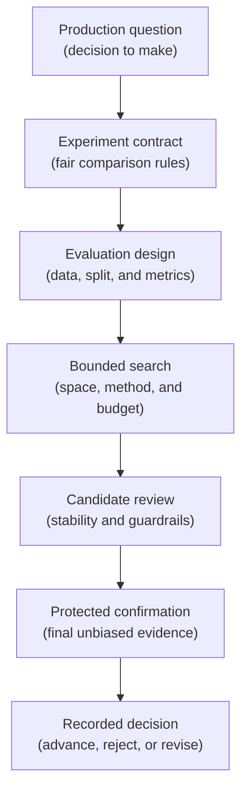
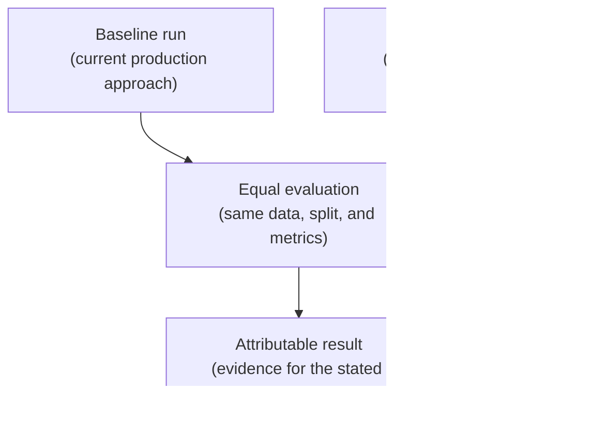
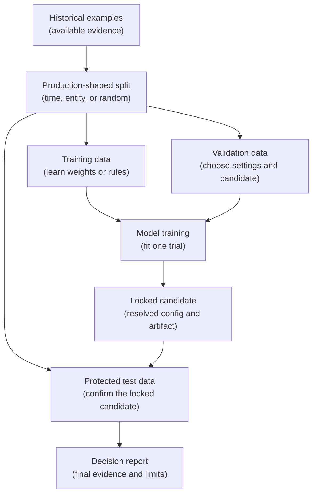
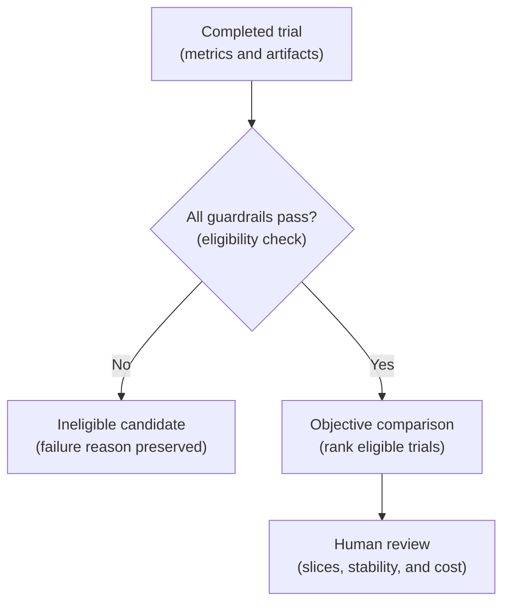
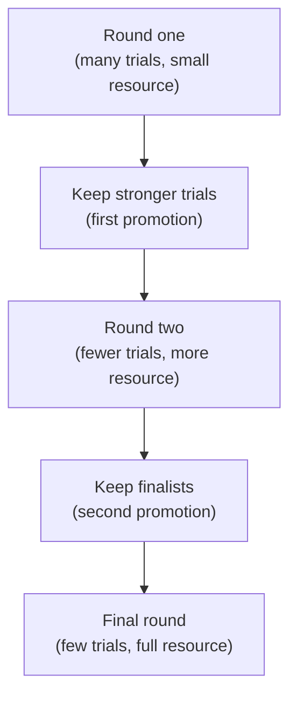
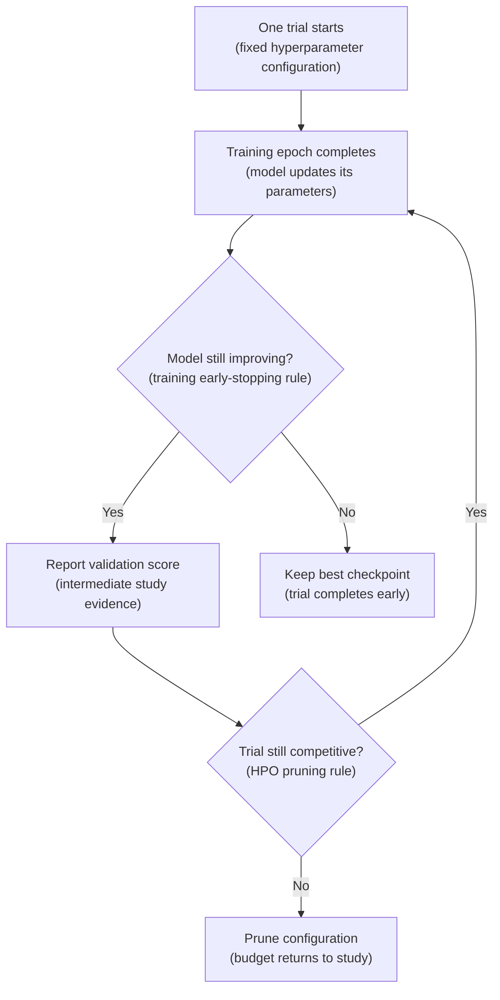
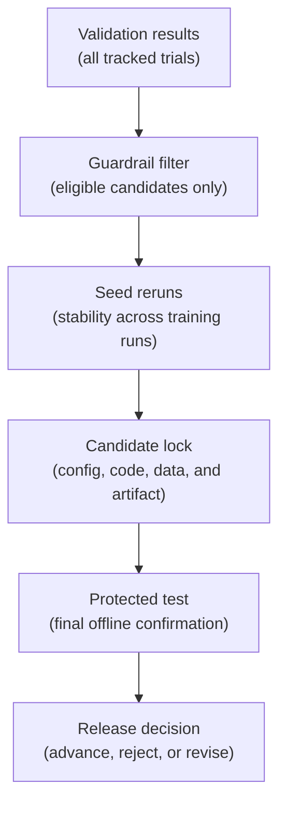
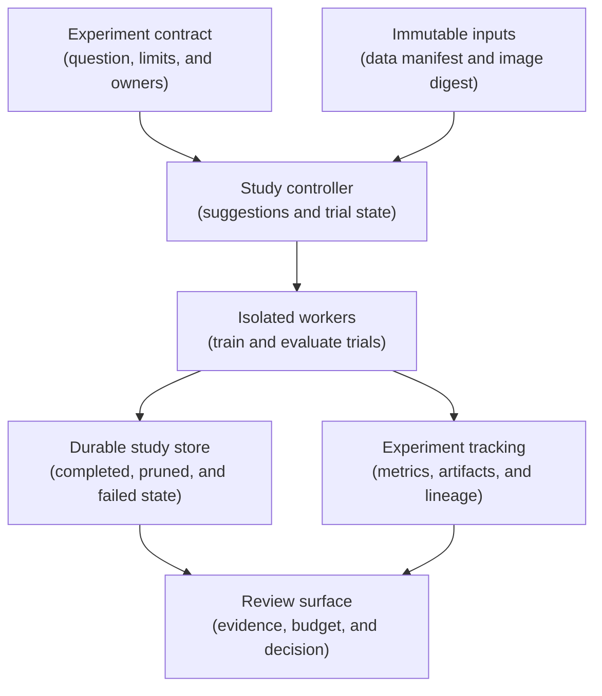

## Table of Contents

1. [A Higher Score Can Come From an Unfair Comparison](#a-higher-score-can-come-from-an-unfair-comparison)
2. [Decide What The Experiment Must Prove](#decide-what-the-experiment-must-prove)
3. [Compare One Controlled Change With A Baseline](#compare-one-controlled-change-with-a-baseline)
4. [Give Training, Validation, and Test Data Different Jobs](#give-training-validation-and-test-data-different-jobs)
5. [Choose a Split That Matches Production](#choose-a-split-that-matches-production)
6. [Decide What The Search Should Improve And Protect](#decide-what-the-search-should-improve-and-protect)
7. [Choose Which Hyperparameters The Search May Try](#choose-which-hyperparameters-the-search-may-try)
8. [Choose The Search Strategy And Compute Budget](#choose-the-search-strategy-and-compute-budget)
9. [Understand The Difference Between Early Stopping And Trial Pruning](#understand-the-difference-between-early-stopping-and-trial-pruning)
10. [Run Hyperparameter Search With Optuna And MLflow](#run-hyperparameter-search-with-optuna-and-mlflow)
11. [Recheck The Selected Model Before Approval](#recheck-the-selected-model-before-approval)
12. [Run Hyperparameter Search Reliably At Team Scale](#run-hyperparameter-search-reliably-at-team-scale)
13. [Record Which Model Was Chosen And Why](#record-which-model-was-chosen-and-why)
14. [The Main Idea](#the-main-idea)
15. [References](#references)

## A Higher Score Can Come From an Unfair Comparison
<!-- section-summary: A tuning result is trustworthy only if every candidate faces the same production-shaped evaluation. -->

Suppose an ML engineer is preparing a fraud-model review before the weekly release meeting. The production baseline reaches `0.41` average precision, while a newly tuned model reaches `0.48`. The larger number looks like a clear reason to promote the candidate.

During review, the team discovers that rows from the same customer appear in both training and validation. A feature also includes chargeback information that arrives several days after the model would make its decision. The candidate has learned from clues that production cannot provide at prediction time. A later time-based evaluation drops its score below the baseline.

If the team released the model from the first result, fraud operations would receive a larger queue of false alerts. Analysts would see the visible effect as extra manual reviews, even though the experiment dashboard had reported an improvement.

This is the central lesson of experiment design: **a model score measures the comparison that the team created**. It says very little about production if the comparison leaks future information, changes data between trials, or gives one candidate a different evaluation.

**Hyperparameter optimization**, usually shortened to **HPO**, automates the search over training settings such as learning rate, tree depth, regularization strength, and batch size. HPO can search a well-designed experiment efficiently. It cannot repair a weak baseline, a leaked split, a misleading metric, or a test set that has already influenced model selection.


```mermaid
flowchart TD
    Q["Production question<br/>(decision to make)"] --> C["Experiment contract<br/>(fair comparison rules)"]
    C --> E["Evaluation design<br/>(data, split, and metrics)"]
    E --> S["Bounded search<br/>(space, method, and budget)"]
    S --> R["Candidate review<br/>(stability and guardrails)"]
    R --> F["Protected confirmation<br/>(final unbiased evidence)"]
    F --> D["Recorded decision<br/>(advance, reject, or revise)"]
```

A sound study defines the decision and fair-comparison rules before an optimizer proposes configurations. This keeps the search focused on a stable question instead of letting attractive trial results reshape the evaluation.

## Decide What The Experiment Must Prove
<!-- section-summary: A useful experiment centers on the decision its evidence must support and the consequence of a wrong choice. -->

At a high level, an experiment turns an uncertain modeling idea into evidence for a specific action. “Find the best model” is too vague because *best* could refer to accuracy, latency, memory, fairness, cost, or several of them together.

### Connect One Experiment Question To One Decision

A clearer question sounds like this: **Should the model owner advance a tuned fraud classifier to shadow evaluation if it improves average precision while keeping the false-positive review queue and prediction latency within their approved limits?**

This sentence identifies the actor, the next action, the quality target, and the operational limits. It also makes failure concrete. A poor selection can overwhelm reviewers, delay legitimate payments, or exceed the serving budget. The visible outcome is a decision that the release team can carry out: advance the candidate, reject it, or revise the experiment.

### Write The Experiment Rules Before Running Trials

Before any trial runs, teams usually capture this agreement in an **experiment contract**. The contract is a small versioned document that stays stable across trials. It prevents the question from drifting after someone sees an attractive result.

```yaml
decision: advance one fraud candidate to shadow evaluation
owner: fraud-model-owner
hypothesis: stronger regularization will improve performance on recent cases
baseline: production-model-v18
controlled_change: regularization and learning-rate search
primary_objective: validation_average_precision
guardrails:
  false_positive_rate: "<= baseline + 0.01"
  p95_prediction_latency_ms: "<= 40"
budget:
  trials: 30
  wall_clock_minutes: 120
final_confirmation: protected_test_partition
```

The contract leaves the winning parameter values open. It defines the rules under which a result will count as credible evidence.

## Compare One Controlled Change With A Baseline
<!-- section-summary: A fair experiment compares a declared change with a meaningful baseline while holding the remaining conditions steady. -->

At a high level, this part of the design separates the idea being tested from the reference it must beat. That separation lets the team explain what the result actually supports.

### State Why The Change Should Beat The Baseline

A **hypothesis** explains why a proposed change should affect an outcome. For example, “stronger regularization should reduce overfitting to older fraud patterns and improve average precision on newer transactions.” This statement can be contradicted by evidence, which makes it useful.

The **baseline** is the reference the candidate must beat. In production work, the current deployed model is often the most important baseline because it represents the system users already receive. A transparent heuristic or linear model can add context, especially if a complex candidate barely improves on it.

### Keep Unrelated Conditions Fixed

The **controlled change** names what is allowed to vary. If a team changes the label definition, feature pipeline, model family, and tuning space in one study, the result measures the whole bundle. It cannot explain which part caused the improvement. That bundle comparison may still support a release decision, provided the contract says so. A study intended to learn whether one feature helps should keep the remaining choices fixed.

HPO creates a planned exception to the controlled-change rule. Several hyperparameters may vary, yet they vary inside a declared search space while the dataset, split, metric code, and training implementation remain fixed.


```mermaid
flowchart TD
    B["Baseline run<br/>(current production approach)"] --> E["Equal evaluation<br/>(same data, split, and metrics)"]
    C["Candidate run<br/>(declared controlled change)"] --> E
    E --> A["Attributable result<br/>(evidence for the stated change)"]
```

Consider a churn model review. The ML engineer wants to learn whether a new feature family helps before the monthly retraining run. The fair comparison trains the baseline and candidate on the same customer snapshot and tunes both under equal budgets. If the candidate alone receives five times more trials, the result mixes feature value with extra search effort. The product owner may approve an expensive feature pipeline for an improvement that actually came from unequal tuning.

## Give Training, Validation, and Test Data Different Jobs
<!-- section-summary: Training fits model parameters, validation guides choices, and protected test data estimates the locked candidate's performance. -->

At a high level, the three data partitions create boundaries between learning, choosing, and confirming. Those boundaries prevent evidence used to tune a model from also pretending to be an unbiased final check.

### Use Training Data To Fit The Model

The **training set** teaches the model. During training, the algorithm learns model parameters such as tree splits, coefficients, or neural-network weights.

### Use Validation Data To Choose A Model

The **validation set** guides development choices. HPO repeatedly evaluates trials on validation data, so information from this set influences hyperparameter selection. Validation performance is therefore useful for choosing a candidate, though its optimism grows as the team tries more ideas against the same examples.

### Use Test Data For The Final Check

The **test set** estimates how the locked candidate performs on evidence that played no role in selection. Its labels stay outside the HPO objective and outside informal trial review. The team opens that evidence after it has committed the chosen configuration and evaluation procedure.


```mermaid
flowchart TD
    H["Historical examples<br/>(available evidence)"] --> P["Production-shaped split<br/>(time, entity, or random)"]
    P --> TR["Training data<br/>(learn weights or rules)"]
    P --> VA["Validation data<br/>(choose settings and candidate)"]
    P --> TE["Protected test data<br/>(confirm the locked candidate)"]
    TR --> T["Model training<br/>(fit one trial)"]
    VA --> T
    T --> L["Locked candidate<br/>(resolved config and artifact)"]
    L --> TE
    TE --> DR["Decision report<br/>(final evidence and limits)"]
```

For a small medical-image dataset, one fixed validation partition may waste too much evidence. **Cross-validation** rotates several training and validation folds, allowing every example to contribute to validation. The split still has to respect patients, hospitals, and acquisition time. Images from the same patient in separate folds would make the estimate look stronger than performance on a new patient.

## Choose a Split That Matches Production
<!-- section-summary: The split policy should reproduce the separation the model will face after deployment and keep future or related evidence out of training. -->

At a high level, a split simulates the separation between the evidence available during development and the cases the deployed model will face later. The best policy mirrors the boundary that exists in the real product.

### Random and Stratified Splits

A random or stratified split can work for independent examples drawn from a stable population. **Stratification** preserves important class proportions, which is useful for rare outcomes.

### Group Splits

A group split keeps related examples together. If one customer, patient, machine, document, or account produces many rows, all of that entity's rows should usually stay in one partition. Otherwise the model can recognize the entity instead of learning a general pattern.

### Time Splits

A time split trains on the past and evaluates on the future. It is the natural choice for demand forecasting, fraud, churn, ranking, and many other systems whose data changes over time. Feature calculations must also follow the time boundary. A rolling 30-day purchase total for a decision on Monday can include data available through Monday, never purchases from the following week.

### Fit Preprocessing Only On Training Data

Preprocessing can leak too. Imputation values, vocabulary, normalization statistics, target encoding, and feature selection must be learned from the training portion inside each fold. Scikit-learn pipelines help enforce this order by fitting transforms during the training step and applying the learned transform to validation data.

Here is a concrete failure pattern. Before a quarterly risk-model review, a data scientist normalizes the full dataset and then creates folds. The mean and variance from validation records have already influenced the training inputs. The score increase may be small, yet it can decide a close comparison. The reviewer should require the transform inside the cross-validation pipeline. The visible correction is a rerun whose fold artifacts contain training-only preprocessing state.

## Decide What The Search Should Improve And Protect
<!-- section-summary: The objective ranks trials, while guardrails keep an attractive score from hiding an unacceptable product or system regression. -->

At a high level, the objective tells the optimizer what to pursue, while guardrails define outcomes the organization refuses to sacrifice. Reading both together prevents the search from optimizing a narrow metric at the product's expense.

### Choose The Main Optimization Metric

The **objective** is the number the optimizer tries to improve. It should represent the main decision as directly as the available offline evidence allows. Average precision is often more informative than raw accuracy for rare positive classes. Ranking systems may use nDCG at a declared cutoff. Forecasting systems may use a scale-aware error metric and evaluate important horizons separately.

### Set Limits Every Selected Model Must Meet

A **guardrail** is a condition that every eligible candidate must satisfy. Latency, memory, cost, false-positive rate, calibration error, fairness slices, and model size are common examples. Guardrails prevent one aggregate score from erasing an operational or product failure.

Suppose a loan-default model increases average precision from `0.37` to `0.40`, while the false-positive rate for a reviewed customer segment rises beyond policy. The model owner sees a better primary objective. The risk reviewer sees a failed guardrail. The candidate remains in the experiment record, though it cannot advance. The visible outcome is an ineligible trial with the failed segment and policy threshold attached.

Most teams should start with one primary objective and explicit eligibility constraints. **Multi-objective optimization** is useful where the product genuinely accepts a tradeoff, such as accuracy versus inference cost. The result is a **Pareto frontier**: candidates where improving one objective would worsen another. A human still chooses a deployable point using product context. Turning every concern into an arbitrary weighted formula often hides the real tradeoff.


```mermaid
flowchart TD
    T["Completed trial<br/>(metrics and artifacts)"] --> G{"All guardrails pass?<br/>(eligibility check)"}
    G -- No --> X["Ineligible candidate<br/>(failure reason preserved)"]
    G -- Yes --> O["Objective comparison<br/>(rank eligible trials)"]
    O --> R["Human review<br/>(slices, stability, and cost)"]
```

Metric definitions also need versions. A change to label logic, slice membership, or evaluation code creates a new study boundary. Trial scores from different metric definitions should never share one leaderboard.

## Choose Which Hyperparameters The Search May Try
<!-- section-summary: A search space defines the permitted hyperparameter values, and each trial evaluates one resolved configuration under the fixed experiment rules. -->

A model learns **parameters** from data. Linear-model coefficients and neural-network weights are parameters. A team chooses **hyperparameters** around that learning process. Regularization strength, learning rate, batch size, tree depth, and network width are hyperparameters.

The **search space** lists the hyperparameters that may vary and their allowed values. A **trial** is one resolved configuration trained and evaluated under the experiment contract.

Good ranges reflect model behavior, available data, hardware, and serving limits. Learning rate and regularization often span orders of magnitude, so logarithmic sampling gives values such as `0.0001`, `0.001`, and `0.01` meaningful coverage. Categorical choices suit optimizer types or model variants. Conditional parameters appear only for the branch that uses them.

```python
learning_rate = trial.suggest_float("learning_rate", 1e-4, 1e-1, log=True)
regularization = trial.suggest_float("regularization", 1e-6, 1e-2, log=True)
penalty = trial.suggest_categorical("penalty", ["l2", "elasticnet"])

if penalty == "elasticnet":
    l1_ratio = trial.suggest_float("l1_ratio", 0.05, 0.95)
```

Search ranges should fail validation if the training code ignores a field or the value cannot run on approved infrastructure. Imagine a platform engineer reviewing a nightly image-model study. The declared batch-size range includes values that exceed GPU memory. If every large trial crashes, the study spends its budget learning a platform limit that was already known. A preflight check can reject those values before workers start, leaving failed trial records for unexpected runtime errors.

## Choose The Search Strategy And Compute Budget
<!-- section-summary: Search algorithms propose configurations, while schedulers and pruners decide how much resource each trial receives. -->

At a high level, every HPO study has two allocation decisions. The search algorithm chooses the next configuration, and the resource policy chooses how long that trial may continue.

### Choose Between Grid, Random, And Bayesian Search

**Grid search** evaluates every listed combination. It is useful for a small discrete space, such as three regularization values crossed with two feature choices. Its cost grows rapidly as dimensions are added.

**Random search** samples independent configurations from declared distributions. It provides a strong baseline for larger spaces because it explores more distinct values along influential dimensions than a dense grid with the same number of trials.

**Bayesian optimization** uses completed results to propose promising configurations. Optuna's default Tree-structured Parzen Estimator, or **TPE**, models parameter values from stronger and weaker trials, then favors regions associated with stronger outcomes. Early suggestions still need broad exploration because the optimizer has little evidence at the start.

### Allocate More Compute To Promising Trials

The experiment budget should include maximum trials, wall-clock time, parallel workers, per-trial hardware, and a retry policy. These limits belong in the contract. Increasing parallelism can shorten elapsed time while consuming the same or greater compute. It can also reduce how much each new Bayesian suggestion learns from earlier completed trials.

**Multi-fidelity optimization** gives many configurations a small resource allowance and gives more resource to the promising ones. The resource might be training epochs, boosting rounds, dataset fraction, or image resolution. Successive Halving repeatedly keeps a stronger fraction of trials. Hyperband runs several brackets with different early-resource allocations. Asynchronous Successive Halving allows workers to continue without waiting for every trial in a rung, which suits shared clusters with variable trial duration.

Before a weekend tuning run, the study owner might approve 40 GPU-hours. The scheduler starts 32 configurations with short training budgets and promotes eight based on intermediate validation loss. A failed resource policy could spend the full 40 hours on weak configurations. A correct policy leaves a visible promotion history: which trials stopped, which continued, and how much resource each consumed.


```mermaid
flowchart TD
    R1["Round one<br/>(many trials, small resource)"] --> K1["Keep stronger trials<br/>(first promotion)"]
    K1 --> R2["Round two<br/>(fewer trials, more resource)"]
    R2 --> K2["Keep finalists<br/>(second promotion)"]
    K2 --> R3["Final round<br/>(few trials, full resource)"]
```

## Understand The Difference Between Early Stopping And Trial Pruning
<!-- section-summary: Training early stopping controls one model's fitting process, while HPO pruning abandons an entire configuration so the study can spend resources elsewhere. -->

At a high level, both mechanisms save compute by ending work early. Training early stopping judges progress inside one model, while HPO pruning judges whether an entire configuration deserves more of the study budget.

### Stop One Model's Training Early

**Training early stopping** belongs inside one trial. It watches that model's validation curve and ends fitting after improvement has stalled. The trial may still be a successful completed trial, and the selected checkpoint may come from an earlier epoch.

### Stop An Entire Trial Early

**HPO pruning** belongs to the study. It compares one trial's intermediate evidence with the study's pruning rule. If the configuration looks uncompetitive after the required warmup, the study abandons the whole trial and reallocates the remaining budget.


```mermaid
flowchart TD
    ST["One trial starts<br/>(fixed hyperparameter configuration)"] --> EP["Training epoch completes<br/>(model updates its parameters)"]
    EP --> ES{"Model still improving?<br/>(training early-stopping rule)"}
    ES -- Yes --> RP["Report validation score<br/>(intermediate study evidence)"]
    ES -- No --> CK["Keep best checkpoint<br/>(trial completes early)"]
    RP --> PR{"Trial still competitive?<br/>(HPO pruning rule)"}
    PR -- Yes --> EP
    PR -- No --> AB["Prune configuration<br/>(budget returns to study)"]
```

Both rules need a warmup. Some models improve slowly at the start, and noisy early metrics can remove a configuration that would later perform well. The study should preserve completed, pruned, and failed statuses. A pruned trial represents an intentional budget decision; a failed trial represents an execution or configuration error.

## Run Hyperparameter Search With Optuna And MLflow
<!-- section-summary: Optuna can suggest and prune trials while MLflow records the parameters, metrics, lineage, and outcomes needed for review. -->

Optuna is a current open-source HPO framework with samplers and pruners. MLflow provides experiment tracking. A common implementation uses one MLflow parent run for the study and a child run for each trial. The parent stores the experiment contract, data manifest, code revision, environment image, search method, and budget. Each child stores one configuration, its metrics, status, and artifacts.

A fraud-model study loads `X_train`, `X_valid`, `y_train`, and `y_valid` from one immutable manifest and uses average precision as its primary objective. Optuna proposes regularization settings, receives an intermediate score after each epoch, and prunes a weak trial after the warmup.

```python
import mlflow
import numpy as np
import optuna
from sklearn.linear_model import SGDClassifier
from sklearn.metrics import average_precision_score


def objective(trial: optuna.Trial) -> float:
    params = {
        "alpha": trial.suggest_float("alpha", 1e-6, 1e-2, log=True),
        "l1_ratio": trial.suggest_float("l1_ratio", 0.05, 0.95),
    }

    with mlflow.start_run(run_name=f"trial-{trial.number}", nested=True):
        mlflow.log_params(params)
        model = SGDClassifier(
            loss="log_loss",
            penalty="elasticnet",
            random_state=23,
            **params,
        )

        for epoch in range(30):
            model.partial_fit(X_train, y_train, classes=np.array([0, 1]))
            score = average_precision_score(
                y_valid, model.predict_proba(X_valid)[:, 1]
            )
            mlflow.log_metric("valid_average_precision", score, step=epoch)
            trial.report(score, step=epoch)
            if trial.should_prune():
                mlflow.set_tag("trial_status", "pruned")
                raise optuna.TrialPruned()

        return score


sampler = optuna.samplers.TPESampler(seed=23, n_startup_trials=8)
pruner = optuna.pruners.MedianPruner(
    n_startup_trials=8,
    n_warmup_steps=5,
)

with mlflow.start_run(run_name="fraud-regularization-study"):
    study = optuna.create_study(
        study_name="fraud-regularization-study",
        storage="postgresql+psycopg://...",
        load_if_exists=True,
        direction="maximize",
        sampler=sampler,
        pruner=pruner,
    )
    study.optimize(objective, n_trials=30, timeout=7_200)
```

`TPESampler` proposes configurations. `MedianPruner` compares an intermediate result with completed-trial evidence after the startup and warmup periods. PostgreSQL gives the study durable shared state, allowing workers to resume after a controller restart. Production credentials should arrive through the workload's secret manager instead of appearing in code.

At the review meeting, the model owner should see more than `study.best_value`. The MLflow parent run should link to every child, including pruned and failed trials. The visible study outcome includes the winning validation score, search-space boundaries, guardrail results, trial counts, compute use, and the exact data and code versions.

The same design works with other current industrial stacks. W&B Sweeps combines search configuration with tracked runs. Amazon SageMaker Automatic Model Tuning and Azure Machine Learning sweep jobs manage trial execution on their cloud training platforms. Distributed systems such as Ray Tune can coordinate large searches across a cluster. The tool can change; the experiment contract, leakage controls, budget, lineage, and final confirmation remain required.

## Recheck The Selected Model Before Approval
<!-- section-summary: The top validation trial is a candidate whose stability, guardrails, and protected test performance still need confirmation. -->

Searching many configurations creates **selection bias**. Some trial will benefit from random variation in the validation set, training seed, or execution. The largest validation score is therefore expected to look slightly better than its true future performance.

The team should rerun a small number of finalists across the same declared seed set. A **seed** initializes pseudo-random operations such as data shuffling and parameter initialization. Repeated seeds reveal whether a candidate's gain is stable or depends on one fortunate run. Hardware and library behavior can still introduce variation, so the run record also needs environment and device details.

After seed review and guardrail checks, the owner locks one resolved configuration, code revision, data manifest, and model artifact. A separate job evaluates that candidate on the protected test set. The test result estimates performance after all selection decisions have finished.


```mermaid
flowchart TD
    V["Validation results<br/>(all tracked trials)"] --> G["Guardrail filter<br/>(eligible candidates only)"]
    G --> S["Seed reruns<br/>(stability across training runs)"]
    S --> L["Candidate lock<br/>(config, code, data, and artifact)"]
    L --> T["Protected test<br/>(final offline confirmation)"]
    T --> D["Release decision<br/>(advance, reject, or revise)"]
```

Suppose the highest validation trial improves average precision by `0.018`, while its five-seed reruns range from `-0.006` to `+0.021` against the baseline. A slightly lower trial improves by `0.014` across every seed and uses less memory. Before the release review, the model owner can choose the stable candidate according to the declared selection rule. The visible report shows the full seed distribution and why the numeric winner was declined.

If the protected test result disappoints, the team records that outcome and forms a new hypothesis. Trying many discarded configurations against the same test set would gradually turn it into another validation set.

For limited datasets, **nested cross-validation** provides a stronger estimate. Each outer fold acts as unseen evaluation data, while an inner search selects hyperparameters using only the outer fold's training portion. It costs more because the tuning study repeats across outer folds. High-risk or data-constrained decisions may justify that expense.

## Run Hyperparameter Search Reliably At Team Scale
<!-- section-summary: Production tuning needs durable studies, isolated workers, quotas, searchable lineage, and explicit failure handling around the optimizer. -->

The optimization library is one component of a production HPO system. The surrounding platform owns durable study storage, immutable datasets, pinned containers, isolated workers, secrets, queues, quotas, logs, cancellation, and artifact retention.

You can think of the study controller as a ledger and dispatcher. It records each suggested configuration, assigns that work to an isolated training job, and receives the resulting metrics or failure state. The worker reads the approved data manifest and container image, so every trial starts from the same evidence and software. Experiment tracking keeps the larger artifacts and lineage needed by reviewers. Together, these components produce a resumable study whose cost and outcome remain visible after individual workers disappear.


```mermaid
flowchart TD
    C["Experiment contract<br/>(question, limits, and owners)"] --> O["Study controller<br/>(suggestions and trial state)"]
    M["Immutable inputs<br/>(data manifest and image digest)"] --> O
    O --> W["Isolated workers<br/>(train and evaluate trials)"]
    W --> ST["Durable study store<br/>(completed, pruned, and failed state)"]
    W --> TR["Experiment tracking<br/>(metrics, artifacts, and lineage)"]
    ST --> RV["Review surface<br/>(evidence, budget, and decision)"]
    TR --> RV
```

Trial failures need clear meaning. An invalid parameter combination belongs to the model owner and should constrain the next search. An out-of-memory trial belongs to both the model and platform owners because it may expose an unrealistic range or an incorrect resource request. A lost worker can retry the same configuration if it produced no valid result. A data-manifest mismatch should stop the study because later scores would no longer be comparable.

The platform needs an execution view that separates queued and running work from completed, pruned, and failed trials. A study view follows the best eligible score and the guardrails that excluded other candidates. A resource view attributes compute use and cost to the study owner. Before a scheduled training window closes, the owner can see whether more trials are likely to change the decision. If the budget is exhausted without an eligible candidate, the visible outcome is “no candidate selected.” Any extension requires a new reviewed budget.

Managed HPO services can reduce infrastructure ownership. SageMaker Automatic Model Tuning creates training jobs from declared ranges and an objective. Azure Machine Learning sweep jobs combine a search space, sampling algorithm, primary metric, limits, and early-termination policy. W&B Sweeps suits teams that already use W&B for tracked experiments. Optuna with MLflow gives teams direct control and works across local, Kubernetes, and managed-job environments. Choose the execution layer that matches the organization's existing training platform and operational ownership.

## Record Which Model Was Chosen And Why
<!-- section-summary: A decision record connects the experiment evidence to the action the team approved and preserves reasons for future reviewers. -->

The final artifact is a decision record. In essence, it connects the technical evidence to the action that an accountable owner approved. It links the contract, baseline, study, chosen trial, rejected alternatives, seed reruns, protected test report, guardrails, cost, limitations, approvers, and next action.

```yaml
decision: advance candidate to shadow evaluation
actor: fraud-model-owner
evidence:
  baseline_run: mlflow-run-7f2c
  tuning_study: optuna-study-regularization-v3
  selected_trial: 21
  seed_review: five-fixed-seeds
  protected_test_report: artifact://reports/test-summary.json
guardrails:
  false_positive_rate: passed
  p95_prediction_latency_ms: passed
reason: stable improvement under the approved budget
next_check: shadow traffic and reviewer-queue impact
```

This record keeps the model registry from turning into a collection of artifacts with no explanation. A future incident reviewer can reconstruct who made the decision, which evidence existed at the time, and what outcome the team planned to watch next.

The `next_check` field matters because offline confirmation is one gate in a longer release process. For the fraud candidate, the shadow stage measures traffic coverage, latency, score distribution, and the predicted effect on reviewer workload before customer-facing actions change. If those signals disagree with the experiment assumptions, the owner can stop the release and connect the rollback decision to the same evidence chain.

## The Main Idea
<!-- section-summary: HPO is trustworthy only inside a fair, budgeted, and reproducible experiment whose final candidate is confirmed on protected evidence. -->

Experiment design turns a modeling idea into a decision that evidence can support. The team states a hypothesis, chooses a meaningful baseline, controls the change, gives each data partition one job, selects a production-shaped split, and defines an objective with guardrails.

HPO then explores a bounded search space. Search algorithms propose configurations. Schedulers and pruners allocate resource. Tracking systems preserve the lineage of every completed, pruned, and failed trial. Repeated seeds test stability, and protected test data confirms one locked candidate after selection is complete.

A large study cannot rescue an unfair comparison. A modest, well-designed study can provide evidence that a model owner, platform engineer, reviewer, and release team can understand and act on.

## References

- [scikit-learn: Cross-validation strategies](https://scikit-learn.org/stable/modules/cross_validation.html) - Official guidance for train/test separation, grouped data, stratification, time-series splits, and preprocessing pipelines.
- [scikit-learn: Nested versus non-nested cross-validation](https://scikit-learn.org/stable/auto_examples/model_selection/plot_nested_cross_validation_iris.html) - Official example of selection bias from tuning and evaluating on the same data.
- [Optuna: Efficient Optimization Algorithms](https://optuna.readthedocs.io/en/stable/tutorial/10_key_features/003_efficient_optimization_algorithms.html) - Official sampler and pruner guide, including intermediate reporting and pruning.
- [Optuna: Multi-objective Optimization](https://optuna.readthedocs.io/en/stable/tutorial/20_recipes/002_multi_objective.html) - Official tutorial for multiple directions and Pareto-optimal trials.
- [Optuna: TPESampler](https://optuna.readthedocs.io/en/stable/reference/samplers/generated/optuna.samplers.TPESampler.html) - Official description of the Tree-structured Parzen Estimator sampler.
- [MLflow: Parent and Child Runs](https://mlflow.org/docs/latest/ml/traditional-ml/tutorials/hyperparameter-tuning/part1-child-runs/) - Official pattern for grouping a tuning study and its individual trials.
- [Weights & Biases: Sweeps](https://docs.wandb.ai/models/sweeps/) - Official documentation for tracked hyperparameter searches.
- [Ray Tune: Hyperparameter Tuning](https://docs.ray.io/en/latest/tune.html) - Official guidance for distributed trials, search algorithms, schedulers, and integrations.
- [Amazon SageMaker AI: Automatic Model Tuning](https://docs.aws.amazon.com/sagemaker/latest/dg/automatic-model-tuning.html) - Official managed tuning workflow for training jobs, ranges, objectives, and completion criteria.
- [Azure Machine Learning: Tune hyperparameters](https://learn.microsoft.com/en-us/azure/machine-learning/how-to-tune-hyperparameters?view=azureml-api-2) - Official sweep-job guidance for search spaces, sampling, limits, metrics, and early termination.
- [PyTorch: Reproducibility](https://docs.pytorch.org/docs/stable/notes/randomness.html) - Official guidance on random seeds and the limits of exact reproducibility across releases and platforms.
