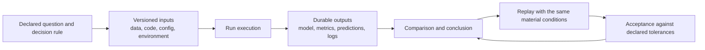
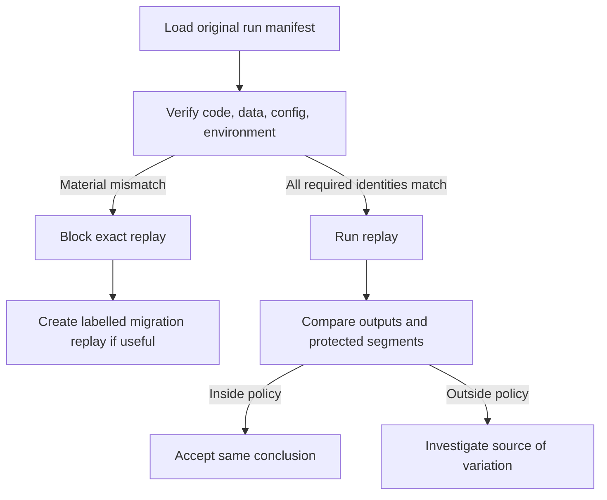

## Reproducibility Preserves the Reason Behind a Result
<!-- section-summary: A reproducible experiment lets another person explain a result, reconstruct its material inputs, and replay it closely enough to test the same conclusion. -->

An **ML experiment** is a planned attempt to answer a model question. A **reproducible experiment** leaves enough evidence for another person to understand what happened, reconstruct the material conditions, and run the same recipe again. The replay succeeds when it supports the same declared conclusion within an agreed tolerance.

Consider an online shop testing whether image embeddings improve product ranking. One training run reports a higher `nDCG@10`, a ranking metric that rewards relevant products near the top of the first ten results. A screenshot of that score cannot tell the team which data, feature definition, code, configuration, environment, or metric implementation produced it. It also cannot show whether catalog coverage or a protected language segment got worse.

Reproducibility supplies that missing chain. It lets the team compare candidates fairly, investigate unexpected differences, review an old production decision, and rebuild an important run after people or infrastructure change.



This flow has two important properties. The question exists before the result, which limits hindsight and metric shopping. The acceptance rule exists before the replay, which prevents the team from changing its standard after seeing small differences.

## Start With a Question That Can Survive Comparison
<!-- section-summary: A stable hypothesis, baseline, controlled change, metrics, guardrails, and decision rule give all runs a shared purpose. -->

A useful experiment starts with one question. The ranking team might ask: **Does adding `product_image_embedding_v2` improve ranking quality while preserving catalog coverage and batch-scoring time?**

The question identifies a baseline, a controlled change, an outcome metric, and two product guardrails. It prevents the experiment from expanding after results arrive. If the engineer changes the embedding model, negative-sampling method, feature set, and validation data together, the team cannot explain which change created the observed difference.

Several runs can answer the same question. Learning rate, regularization, or seed may vary across runs. Each run has its own identity, while the experiment or question groups them. MLflow calls an execution a **run** and uses an **experiment** to group related runs. W&B uses similar run and project concepts. The product question still belongs in a durable note or experiment record rather than living only in someone's memory.

The evaluation contract needs equal care. The team fixes the training and validation snapshots, metric version, segment definitions, latency measurement, and comparison baseline. A candidate is eligible only when it follows that contract. A high score on a newer validation snapshot answers a different question and should not enter the same ranking table without a clear label.

## A Run Has Five Groups of Evidence
<!-- section-summary: Reproducibility depends on the question, inputs, execution conditions, outputs, and acceptance rules that define one run. -->

### Question and decision

The run points to the experiment question, baseline, controlled change, primary metrics, guardrails, and decision rule. This tells a later reviewer why the run exists. A collection of parameters without this context records computation while losing the scientific and product purpose.

### Data and feature inputs

The training and validation data need immutable identities. A dataset manifest can record source tables, versions or snapshots, time windows, filters, label logic, row counts, schema, and content checksums. Feature definitions need their own versions because a feature name can keep the same spelling while its query or time window changes.

Data identity also includes the split. Rebuilding a random split from the same source data can move rows between training and validation. Entity and time boundaries matter for leakage. A replay should recover the exact split membership or a versioned rule with stable inputs that reconstructs it deterministically.

### Code, configuration, and environment

The source commit identifies reviewed code, and the run should also record whether the working tree contained uncommitted changes. Configuration needs its resolved values after defaults, environment variables, and command-line overrides. Recording only the original YAML file can hide the values the process actually used.

The environment includes package versions, operating system, container digest or lockfile, hardware class, drivers, and accelerator runtime where relevant. Moving tags such as `latest` are weak evidence because they can refer to different content later. Digests and immutable package locks give the replay a stable target.

### Randomness and execution conditions

Random seeds can control sampling, data order, initialization, and augmentation. They form one part of reproducibility. Framework algorithms, parallel execution, floating-point arithmetic, drivers, hardware, and library versions can still change a result.

PyTorch's reproducibility guidance explicitly warns that complete reproducibility is unavailable across releases, platforms, and CPU or GPU execution. Deterministic algorithms can also reduce performance, and some operations may lack a deterministic implementation. A mature run record therefore captures seeds and runtime conditions, then judges replay through tolerances rather than promising identical bits everywhere.

### Outputs and evidence

The run stores the trained model, model signature, metrics, segment reports, validation predictions, logs, learning curves, environment evidence, and failure information. The predictions matter because an average metric can stay similar while individual examples or protected segments move sharply.

Large artifacts belong in durable artifact storage. The experiment tracker records their stable locations, hashes, and relationships. Retention needs to match the lifetime of the product decision. Deleting an old dataset or image can make an important production model impossible to investigate even when the tracking metadata remains.

## The Run Manifest Connects the Evidence
<!-- section-summary: A machine-readable run manifest records immutable identities and references so tools and reviewers can verify the same conditions. -->

An experiment tracker makes runs searchable and comparable. A compact manifest also gives the team a portable summary of the evidence that a replay must resolve.

```yaml
run_id: rank-image-2026-07-14-0042
question_id: image-embedding-ablation-v3
code:
  commit: 8f24c91
  dirty: false
data:
  train: recs-rank-train-2026-06-30-r4
  validation: recs-rank-valid-2026-06-30-r4
  manifest_sha256: 4b116b6a2c83920d77ad4130a90e4ad1
config:
  resolved_uri: s3://luma-ml/runs/rank-image-0042/resolved.yaml
  sha256: d073f85b4acfa6bf684cd88f342535e0
runtime:
  image: registry.luma/ranker@sha256:81a21267df1652a97bd86fd53089fe02
  python: 3.12.9
  accelerator: NVIDIA-L40S
randomness:
  seed: 1947
  deterministic_algorithms: true
outputs:
  predictions: s3://luma-ml/runs/rank-image-0042/valid_predictions.parquet
  segment_report: s3://luma-ml/runs/rank-image-0042/segments.json
```

The `dirty` field catches a common gap: a recoverable commit can still differ from locally edited code. The resolved configuration hash captures the values that actually reached training. The container digest identifies the runtime content. The prediction and segment-report locations let reviewers inspect more than the headline metric.

This manifest can be produced by the training pipeline and logged as an artifact in MLflow or W&B. MLflow Tracking records parameters, code versions, metrics, runs, logged models, dataset links, and output files. W&B Experiments records run configuration, metrics, system metrics, and artifacts. These products help store and navigate evidence; the team still chooses which evidence is required for its experiment and replay policy.

## Replay Starts by Verifying Identity
<!-- section-summary: A replay should verify its inputs and runtime against the recorded run before training consumes compute. -->

A replay first resolves the recorded dataset manifest, configuration, code commit, and runtime image. It compares their identities and hashes with the original run. A mismatch stops the normal replay path because it would answer a different question.

This early check saves time and prevents misleading results. Quietly substituting a current dataset for a deleted snapshot can produce a plausible score with no connection to the original comparison. Using an updated metric implementation can change the number even when model predictions match.

When an exact ingredient is unavailable, the team can run a **migration replay**. The record explicitly names the changed data, library, hardware, or metric and explains why the old condition could not be recovered. The result helps assess portability or upgrade risk, while it stays distinct from an exact-condition replay.



The verification process should produce a run record even when it stops. A failed replay with `dataset_manifest_mismatch` is valuable evidence because it reveals that the original conditions cannot currently be reconstructed.

## Replay Acceptance Protects the Product Conclusion
<!-- section-summary: Replay policy defines which identities must match and which output differences the product can tolerate. -->

The replay acceptance rule follows the decision's risk. An exploratory ablation can tolerate more variation because it cannot ship directly. A candidate for a high-impact system may require several seeds, independent review, a fixed hardware class, and tight segment bounds.

The ranking team can define acceptance across several layers:

| Layer | Example rule | Why it matters |
|---|---|---|
| Inputs | Code, data, config, metric, and image identities match | The replay answers the same question |
| Headline metric | `nDCG@10` changes by at most `0.001` | Overall ranking conclusion remains stable |
| Guardrail | Catalog coverage changes by at most `0.005` | Improvement does not shrink useful inventory |
| Segments | Every protected language segment stays inside its bound | Average performance cannot hide concentrated change |
| Predictions | Fewer than 1% of frozen examples move by five or more ranks | Similar metrics still reflect similar behaviour |
| Artifacts | Model, predictions, and reports pass integrity checks | Review evidence is complete and untampered |

The team declares these bounds before the replay. A result that misses one protected segment fails even when the overall metric is close. The failure opens an investigation into data order, nondeterministic operations, environment drift, or an incomplete run record.

Exact equality can still be appropriate for deterministic preprocessing, dataset membership, configuration hashes, and artifact checksums. Statistical tolerances fit training metrics and predictions where controlled numerical variation exists. Reproducibility uses the right standard for each kind of evidence.

## Comparison Needs More Than a Tracking Dashboard
<!-- section-summary: Fair comparison requires eligible runs that share the declared data, metric, environment, and guardrail contract. -->

An experiment dashboard can place many runs in one table. That view does not guarantee that the comparison is fair. One run may use a newer validation snapshot, another may omit a protected segment, and a third may use a changed metric implementation.

The team should mark whether each run is **eligible for comparison**. Eligibility checks the experiment question, required input identities, output completeness, and evaluation contract. An ineligible run can remain useful for exploration, while its score should not decide the planned experiment.

Reproducibility also supports ablation studies. An **ablation** removes or changes one component to measure its contribution. Stable data, metrics, and runtime help the team attribute the difference to that component. When several material ingredients change together, the result is still an experiment, though its causal explanation is weaker.

Experiment trackers improve collaboration through searchable runs, plots, artifacts, notes, and APIs. A shared tracking server also separates metadata storage from large artifact storage. Teams need access control, retention, backup, and clear project organization so the evidence survives beyond one laptop.

## Common Reproducibility Failures
<!-- section-summary: Reproducibility fails through missing data identity, unresolved configuration, mutable environments, incomplete outputs, and vague replay standards. -->

A **seed-only claim** records one integer and omits data order, environment, hardware, and deterministic settings. The remedy is a full run record and a tolerance-based replay policy.

A **mutable input** uses `latest`, an unversioned table, or a file that can be overwritten. Immutable snapshots, object versions, table versions, and hashes give later runs a stable target.

A **hidden configuration** leaves command-line overrides, environment variables, or notebook state outside the record. The training entry point should log the resolved configuration and fail when required values have no declared source.

A **metric-only record** stores the final score and loses predictions, segments, learning curves, and failures. Durable output artifacts let the team see whether the same average hides different behaviour.

A **missing retention policy** preserves tracking rows while deleting the referenced data, image, or model. Important candidates and production models need evidence retention aligned with incident, audit, and product requirements.

A **moving acceptance rule** changes the tolerance after replay. Versioned policies and predeclared bounds keep the decision honest.

## How the Pieces Work Together
<!-- section-summary: A reproducible experiment connects a stable question to versioned inputs, recorded execution conditions, durable outputs, and a declared replay policy. -->

Reproducibility gives an experiment a traceable lifecycle. The team states the question and product guardrails, records the exact data, code, configuration, environment, randomness controls, and hardware, then stores the model, metrics, predictions, segment reports, and logs under one run identity.

A replay verifies those identities before execution and compares the outputs against a declared policy. Small numerical differences can be acceptable when the original product conclusion and protected segments remain stable. Missing or changed ingredients create an explicit replay failure or a labelled migration replay.

The next articles add tracking instrumentation and run comparison. Those tools make the evidence easier to capture and explore. The experiment remains reproducible because the team knows which evidence matters and which differences would change the decision.

## References

- [PyTorch Reproducibility Notes](https://docs.pytorch.org/docs/stable/notes/randomness.html)
- [MLflow Tracking](https://mlflow.org/docs/latest/ml/tracking/)
- [MLflow Dataset Tracking](https://mlflow.org/docs/latest/ml/dataset/)
- [Weights & Biases Experiments](https://docs.wandb.ai/models/track/)
- [scikit-learn common pitfalls](https://scikit-learn.org/stable/common_pitfalls.html)
- [DVC data and model versioning](https://doc.dvc.org/example-scenarios/versioning-data-and-models)
