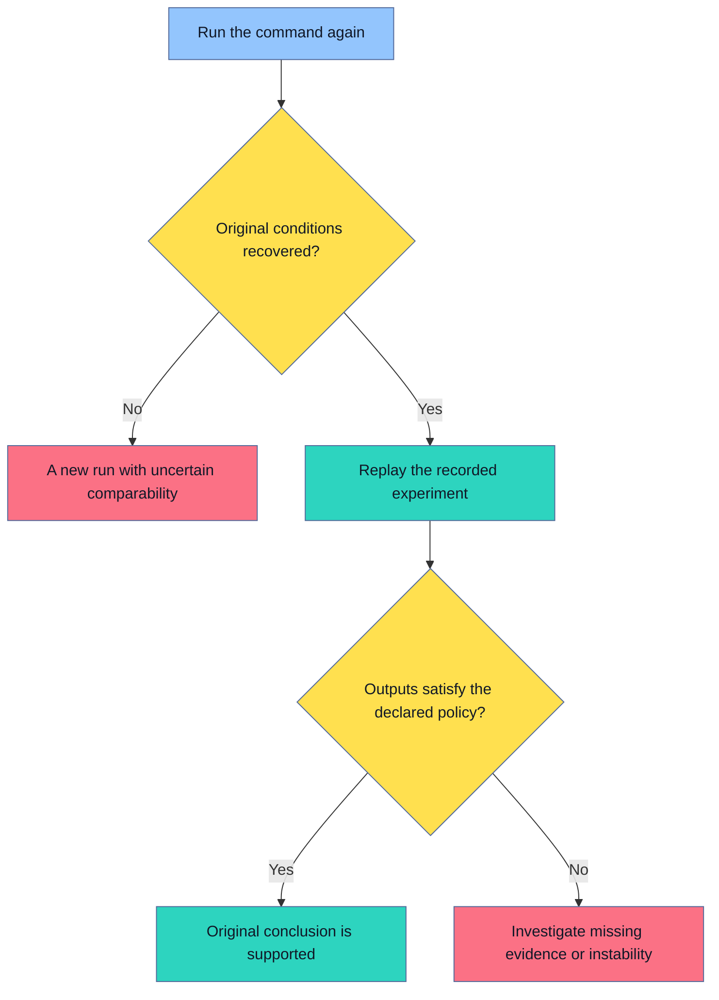
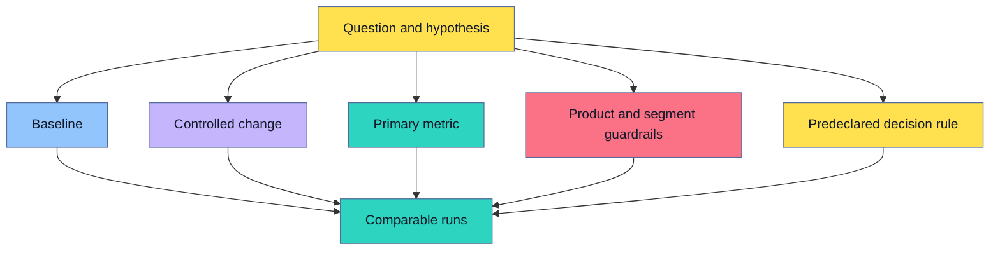
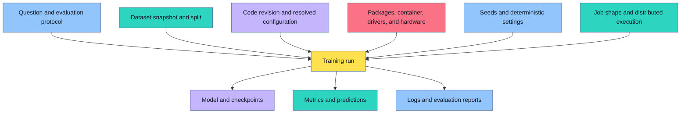
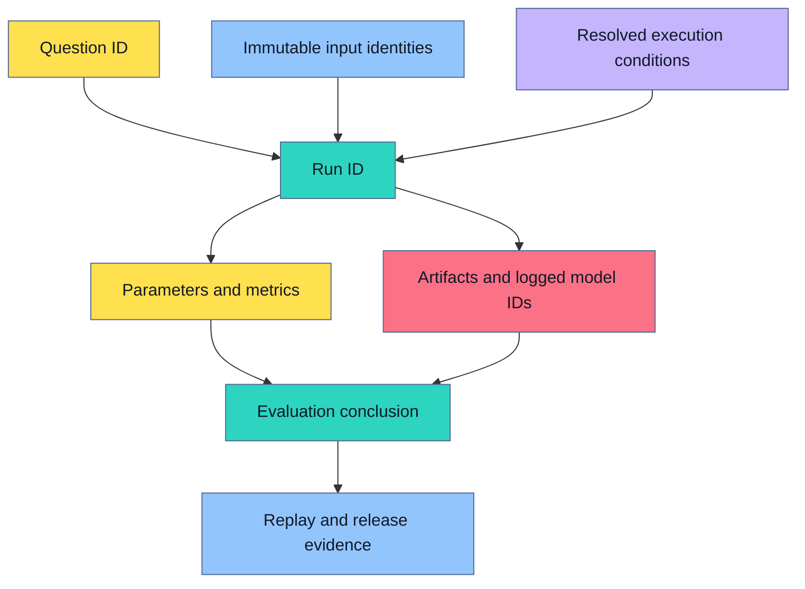
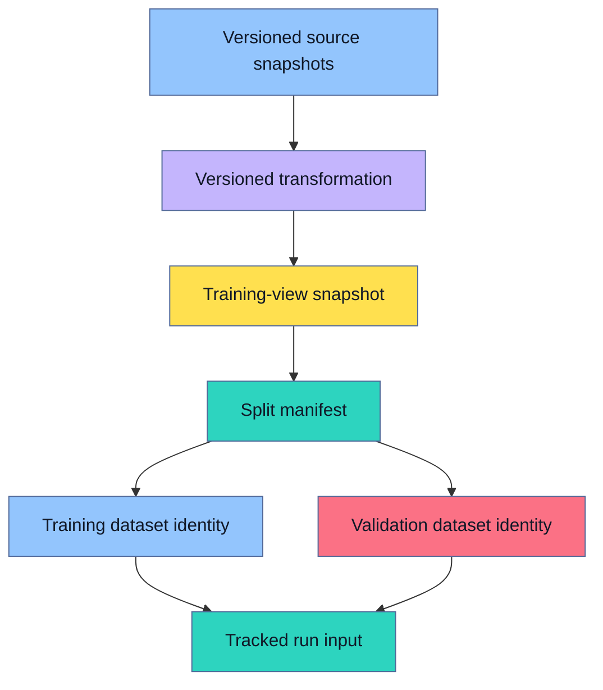
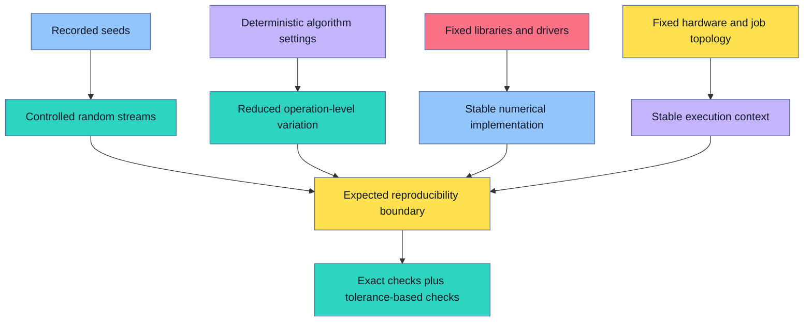
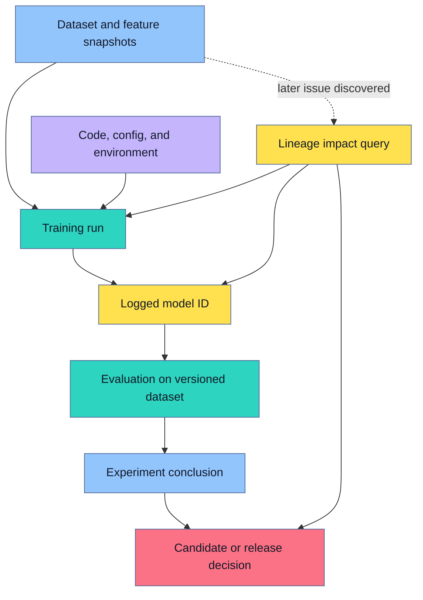
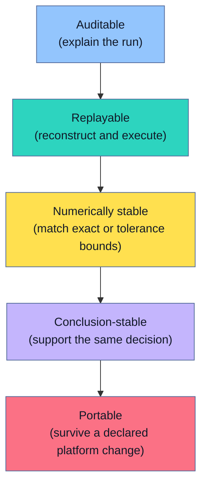
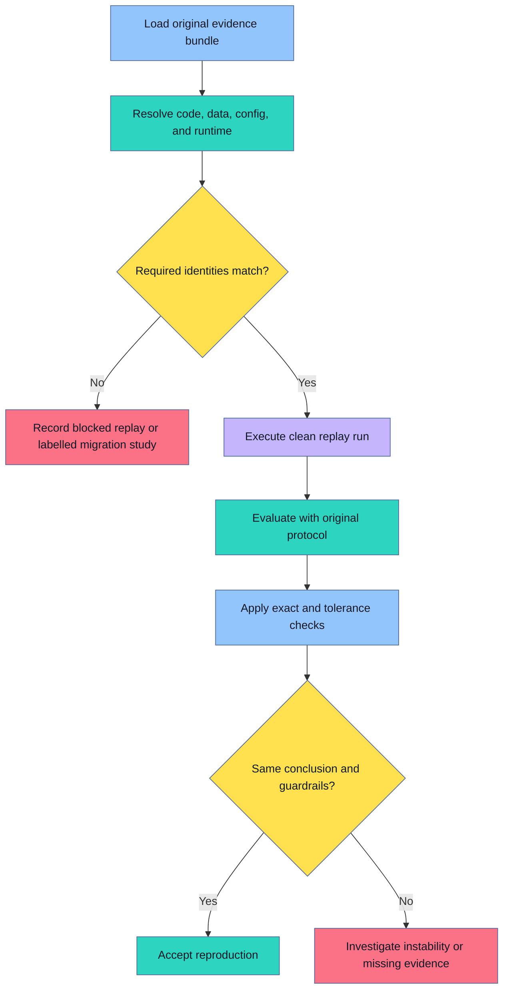

## Table of Contents

1. [Running the Code Again Is Only the First Step](#running-the-code-again-is-only-the-first-step)
2. [An ML Experiment Is a Structured Question](#an-ml-experiment-is-a-structured-question)
3. [Training Depends on More Than Source Code](#training-depends-on-more-than-source-code)
4. [The Evidence Bundle Reconstructs a Run](#the-evidence-bundle-reconstructs-a-run)
5. [Immutable Data Gives the Experiment a Stable World](#immutable-data-gives-the-experiment-a-stable-world)
6. [Capture the Code, Configuration, and Environment That Executed](#capture-the-code-configuration-and-environment-that-executed)
7. [Randomness and Hardware Set the Numerical Boundary](#randomness-and-hardware-set-the-numerical-boundary)
8. [Metrics and Artifacts Need Evaluation Context](#metrics-and-artifacts-need-evaluation-context)
9. [Lineage Connects Inputs, Runs, Models, and Decisions](#lineage-connects-inputs-runs-models-and-decisions)
10. [Reproducibility Has Several Useful Levels](#reproducibility-has-several-useful-levels)
11. [A Focused MLflow 3 Run](#a-focused-mlflow-3-run)
12. [Tracking Platforms Store Evidence; Teams Define It](#tracking-platforms-store-evidence-teams-define-it)
13. [Replay Tests the Original Conclusion](#replay-tests-the-original-conclusion)
14. [Common Gaps and Their Consequences](#common-gaps-and-their-consequences)
15. [The Main Idea](#the-main-idea)
16. [References](#references)

## Running the Code Again Is Only the First Step
<!-- section-summary: A successful rerun proves that code still executes, while reproduction tests whether the original result and conclusion can be reconstructed. -->

At a high level, **reproducibility** means preserving enough evidence to reconstruct an ML result and test the conclusion it supported. A training program can still execute after its data, dependencies, or hidden state have changed. Successful execution therefore proves less than successful reproduction.

Imagine an engineer finds an old training command and runs it again:

```bash
uv run python train.py --config configs/candidate.toml
```

The command finishes successfully, yet the validation score differs from the recorded result. The script read today's version of a warehouse table, the package resolver installed newer libraries, and the notebook that created the original split had uncommitted state. The team has rerun the program, but it has not reconstructed the original experiment.

At a high level, a **rerun** means that an executable workflow runs again. A **reproduction** means that the material conditions behind a result can be recovered and tested against a declared acceptance rule. The second idea is stronger. It asks which data entered training, which code and configuration executed, which environment and hardware supported it, how randomness was controlled, how evaluation was performed, and which outputs supported the conclusion.

A successful reproduction does not always require identical model bytes. GPU kernels, distributed execution, and floating-point arithmetic can produce small numerical differences. The goal may be exact equality for deterministic preprocessing and dataset membership, plus a tolerance for training metrics and predictions. The team defines that standard before comparing the replay.


```mermaid
flowchart TD
    A["Run the command again"] --> B{"Original conditions recovered?"}
    B -->|"No"| C["A new run with uncertain comparability"]
    B -->|"Yes"| D["Replay the recorded experiment"]
    D --> E{"Outputs satisfy the declared policy?"}
    E -->|"Yes"| F["Original conclusion is supported"]
    E -->|"No"| G["Investigate missing evidence or instability"]

    style A fill:#93C5FD,stroke:#536A9A,color:#111827
    style B fill:#FFE04F,stroke:#536A9A,color:#111827
    style C fill:#FB7185,stroke:#536A9A,color:#111827
    style D fill:#2DD4BF,stroke:#536A9A,color:#111827
    style E fill:#FFE04F,stroke:#536A9A,color:#111827
    style F fill:#2DD4BF,stroke:#536A9A,color:#111827
    style G fill:#FB7185,stroke:#536A9A,color:#111827
```

Reproducibility gives a result a history that another person can inspect. It supports fair model comparison, debugging, audits, incident investigation, and the ability to rebuild an important model after infrastructure or team members change.

## An ML Experiment Is a Structured Question
<!-- section-summary: An ML experiment changes a controlled part of a baseline to answer a declared question under a fixed evaluation protocol. -->

An **ML experiment** is a planned test of a model or data question. It compares a baseline with one or more controlled changes and measures the result through a fixed evaluation protocol. Training a model creates a run; the surrounding question turns that run into evidence.

Suppose positive cases are rare in a binary-classification problem. The team asks: **Does class weighting improve recall for the rare class while keeping precision and the worst segment gap inside their approved bounds?**

That question has five important parts. The current model is the baseline. Class weighting is the controlled change. Recall is the primary outcome. Precision and segment disparity are guardrails. The approved bounds define the decision rule. Several seeds or parameter choices may produce several runs, but each run answers the same question under the same protocol.

A weak experiment changes the data sample, feature logic, model family, threshold, and metric implementation together. A better score then has many possible explanations. A strong experiment keeps the comparison conditions stable and changes only the factors named in its hypothesis. Larger exploratory changes remain valuable, though the team should describe them as broad comparisons and avoid precise causal claims.

The evaluation protocol belongs beside the question before training starts. It defines the training, validation, and test snapshots; split logic; label definition; metric implementation; protected or high-risk segments; decision threshold; baseline; seed policy; and acceptance bounds. A metric name such as `recall` is incomplete without this context because label encoding, averaging, threshold, and data population can all change the number.


```mermaid
flowchart TD
    A["Question and hypothesis"] --> B["Baseline"]
    A --> C["Controlled change"]
    A --> D["Primary metric"]
    A --> E["Product and segment guardrails"]
    A --> F["Predeclared decision rule"]
    B --> G["Comparable runs"]
    C --> G
    D --> G
    E --> G
    F --> G

    style A fill:#FFE04F,stroke:#536A9A,color:#111827
    style B fill:#93C5FD,stroke:#536A9A,color:#111827
    style C fill:#C4B5FD,stroke:#536A9A,color:#111827
    style D fill:#2DD4BF,stroke:#536A9A,color:#111827
    style E fill:#FB7185,stroke:#536A9A,color:#111827
    style F fill:#FFE04F,stroke:#536A9A,color:#111827
    style G fill:#2DD4BF,stroke:#536A9A,color:#111827
```

The hypothesis should survive a disappointing result. If the team changes its preferred metric or tolerance after seeing the output, the experiment has lost its original decision rule. New observations can motivate a new question and a new protocol.

## Training Depends on More Than Source Code
<!-- section-summary: Training is stateful because its result depends on external data, resolved settings, runtime state, random processes, hardware, and evaluation logic. -->

Model training is **stateful**: the output depends on state that lives beyond the source file. Running the same function name does not guarantee the same computation.

Data changes as events arrive, labels are corrected, and upstream transformations evolve. Configuration values can come from files, defaults, environment variables, command-line flags, or a notebook cell. Python and native-library versions change numerical behavior. Random sampling affects the split, batch order, initialization, augmentation, and hyperparameter search. GPU type and distributed topology can alter operation order. Evaluation code and decision thresholds can change the final claim without changing the trained weights.

This dependence can be written as a relationship:


```mermaid
flowchart TD
    A["Question and evaluation protocol"] --> R["Training run"]
    B["Dataset snapshot and split"] --> R
    C["Code revision and resolved configuration"] --> R
    D["Packages, container, drivers, and hardware"] --> R
    E["Seeds and deterministic settings"] --> R
    F["Job shape and distributed execution"] --> R
    R --> G["Model and checkpoints"]
    R --> H["Metrics and predictions"]
    R --> I["Logs and evaluation reports"]

    style R fill:#FFE04F,stroke:#536A9A,color:#111827
    style A fill:#93C5FD,stroke:#536A9A,color:#111827
    style B fill:#2DD4BF,stroke:#536A9A,color:#111827
    style C fill:#C4B5FD,stroke:#536A9A,color:#111827
    style D fill:#FB7185,stroke:#536A9A,color:#111827
    style E fill:#93C5FD,stroke:#536A9A,color:#111827
    style F fill:#2DD4BF,stroke:#536A9A,color:#111827
    style G fill:#C4B5FD,stroke:#536A9A,color:#111827
    style H fill:#2DD4BF,stroke:#536A9A,color:#111827
    style I fill:#93C5FD,stroke:#536A9A,color:#111827
```

The practical consequence is clear: source control alone cannot reproduce an ML result. It remains essential, but it identifies only one part of the state. Reproducibility requires an evidence bundle that connects every material input and output to one execution.

## The Evidence Bundle Reconstructs a Run
<!-- section-summary: An evidence bundle records the material identities, settings, outputs, and relationships needed to understand and replay a run. -->

The **evidence bundle** is the complete record needed to explain and reconstruct a run. It is a framework, not a single file format. An experiment tracker can store much of it, while a source repository, versioned data platform, container registry, and artifact store preserve the underlying objects.

Start with the **question identity**. A stable `question_id` connects the hypothesis, baseline, guardrails, and acceptance policy. Human-readable titles can change; the identity remains stable.

The **run identity** names one execution. A tracker-generated `run_id` is safer than a descriptive run name because names can collide or be edited. MLflow 3 also gives each logged model a `model_id`, allowing one run to produce several checkpoints or models with their own metric links.

The **input evidence** covers dataset snapshots, split membership, code revision, resolved configuration, dependency lock, container digest, feature definitions, and any upstream artifact versions. Each reference must resolve to recoverable content. A label such as `latest` is mutable and insufficient.

The **execution evidence** records the command or job definition, framework settings, seeds, hardware class, accelerator runtime, driver, distributed world size, worker counts, and relevant environment variables. Secrets stay out of the tracker; record approved secret references or names if they materially select a resource.

The **output evidence** includes metrics, model files, signatures, checkpoints, predictions, segment reports, logs, plots, and failure details. Failed runs belong in the record because they reveal unstable configurations and prevent repeated dead ends.

Finally, **lineage** connects these objects: which snapshot fed which run, which run produced which model, which evaluation used which model and dataset, and which model later supported a release decision.


```mermaid
flowchart TD
    A["Question ID"] --> B["Run ID"]
    C["Immutable input identities"] --> B
    D["Resolved execution conditions"] --> B
    B --> E["Parameters and metrics"]
    B --> F["Artifacts and logged model IDs"]
    E --> G["Evaluation conclusion"]
    F --> G
    G --> H["Replay and release evidence"]

    style A fill:#FFE04F,stroke:#536A9A,color:#111827
    style B fill:#2DD4BF,stroke:#536A9A,color:#111827
    style C fill:#93C5FD,stroke:#536A9A,color:#111827
    style D fill:#C4B5FD,stroke:#536A9A,color:#111827
    style E fill:#FFE04F,stroke:#536A9A,color:#111827
    style F fill:#FB7185,stroke:#536A9A,color:#111827
    style G fill:#2DD4BF,stroke:#536A9A,color:#111827
    style H fill:#93C5FD,stroke:#536A9A,color:#111827
```

The bundle should be machine-readable enough for a replay job to verify identities before consuming expensive compute. It also needs plain-language notes so a reviewer can understand the question and outcome without reverse-engineering parameter keys.

## Immutable Data Gives the Experiment a Stable World
<!-- section-summary: A dataset snapshot preserves the exact records, schema, labels, and split used by an experiment. -->

Data is usually the largest reproducibility gap. A query can be versioned in Git while the table it reads continues to change. The same SQL text can therefore return different rows a day later.

An immutable dataset identity can use a Delta table version, an Iceberg snapshot ID, an object-storage version, or a manifest that lists immutable files and checksums. Delta Lake time travel and Iceberg snapshot reads are common industrial ways to recover a table state. A tracker digest provides an additional integrity check, but it does not store the underlying data or guarantee future access.

The dataset record should identify more than the source. Record its schema and row count first. Then capture the label definition and exact feature-definition versions. Filters, event-time boundaries, and exclusion policy explain which population entered the experiment. If data was joined from several sources, record each input snapshot plus the transformation that produced the training view.

Splits are separate artifacts. A training snapshot can remain fixed while random split membership changes because a seed, row order, or grouping rule changed. For entity-based or time-based splits, store the split manifest or the exact deterministic rule and all inputs it depends on. This protects against leakage and lets the replay evaluate the same examples.

Consider a forecast trained from a table named `features_current`. The table points to the latest successful feature build. Logging that name does little for a replay. A stronger record resolves it to `snapshot_id=784239`, stores the feature-pipeline commit, and writes the train/validation membership to a versioned manifest. A future run can now recover the same world even after the current pointer moves.


```mermaid
flowchart TD
    A["Versioned source snapshots"] --> B["Versioned transformation"]
    B --> C["Training-view snapshot"]
    C --> D["Split manifest"]
    D --> E["Training dataset identity"]
    D --> F["Validation dataset identity"]
    E --> G["Tracked run input"]
    F --> G

    style A fill:#93C5FD,stroke:#536A9A,color:#111827
    style B fill:#C4B5FD,stroke:#536A9A,color:#111827
    style C fill:#FFE04F,stroke:#536A9A,color:#111827
    style D fill:#2DD4BF,stroke:#536A9A,color:#111827
    style E fill:#93C5FD,stroke:#536A9A,color:#111827
    style F fill:#FB7185,stroke:#536A9A,color:#111827
    style G fill:#2DD4BF,stroke:#536A9A,color:#111827
```

Retention must match the importance of the decision. Keeping experiment metadata for years has little value if the referenced snapshot expires after a short period. Production candidates and high-impact decisions usually need longer retention than casual exploratory runs.

## Capture the Code, Configuration, and Environment That Executed
<!-- section-summary: Reproducibility records the exact code state, resolved settings, and runtime environment used by the training process. -->

A Git commit identifies reviewed source, but it can miss local edits. Record the commit and the working-tree state. If a controlled development run uses uncommitted changes, preserve the patch as an artifact and label the run clearly. Production candidates should normally come from a clean revision built by CI.

Configuration has the same hidden-state problem. A file may define `learning_rate=0.01`, while a command-line override changes it to `0.003`. A library default may also change across versions. Log the **resolved configuration** after defaults, inheritance, environment variables, and command-line overrides have been applied. Store the structured configuration as an artifact and log the important comparison fields as searchable parameters.

Dependency evidence starts with exact resolution. A checked-in `uv.lock`, Poetry lock, Conda lock, or hashed requirements file records package versions. `uv sync --frozen` can enforce the checked-in resolution for a uv project. The lock still does not capture the operating system, system libraries, CUDA runtime, drivers, or hardware.

A container image digest adds the operating-system and native-library layer. Tags such as `training:latest` can move; a digest identifies immutable image content. Record the Python version, ML framework, CUDA and cuDNN versions where applicable, accelerator type, CPU architecture, and relevant numerical-library settings. A managed job should also record its job definition, compute image, instance type, region, and distributed topology.

Notebook history creates another failure mode. A model may depend on cells executed out of order or variables left from an earlier exploration. A clean script, package entry point, or pipeline job turns the intended execution into an explicit graph. The notebook can still support exploration, but a candidate run should execute from a fresh process with recorded inputs.

```yaml
question_id: rare-class-recall-v2
run_id: tracker-assigned
code:
  commit: 8f24c91
  dirty: false
data:
  train_snapshot: snapshot-784239
  validation_snapshot: snapshot-784255
  split_manifest: s3://ml-evidence/splits/rare-class-v2.json
runtime:
  image_digest: sha256:81a21267df1652a97bd86fd53089fe02
  dependency_lock: uv.lock@sha256:5c1d0c
  accelerator: l40s
randomness:
  seeds: [17, 29, 43]
evaluation:
  protocol: binary-classification-v5
```

The manifest uses references and identities, so it contains no credentials or raw sensitive records. Access to the underlying evidence follows the same governance as the data and model artifacts themselves.

## Randomness and Hardware Set the Numerical Boundary
<!-- section-summary: Seeds control declared random streams, while algorithms, parallelism, libraries, and hardware can still change numerical results. -->

A random seed initializes a pseudorandom number generator. Training may use several generators: Python, NumPy, the ML framework, data-loader workers, augmentation libraries, and distributed samplers. Recording one seed controls only the generator connected to it.

The seed can affect weight initialization, sample order, dropout, negative sampling, augmentation, data splitting, and hyperparameter search. Record each relevant seed and how worker processes derive their own values. For a scientific comparison, run several predeclared seeds so the decision does not depend on a lucky initialization.

Determinism also depends on algorithms and execution order. GPU kernels may use parallel atomic operations. Floating-point addition can yield slightly different results after the order changes. Distributed workers can finish collectives in a different sequence. Libraries may select optimized kernels based on hardware and input shapes.

[PyTorch's reproducibility guidance](https://docs.pytorch.org/docs/stable/notes/randomness) states that complete reproducibility is not guaranteed across releases, platforms, or CPU and GPU execution. `torch.use_deterministic_algorithms(True)` can select deterministic implementations and raise an error for known operations without one. Deterministic paths can run more slowly. TensorFlow offers a similar determinism setting and also requires the same hardware and software environment for its strongest guarantee.

This limitation changes the acceptance rule. Dataset membership should usually match exactly. The same strict rule can apply to resolved configuration and deterministic preprocessing output. A deep-learning replay may accept small metric differences if predictions and segment guardrails stay inside predeclared bounds. The overall conclusion must stay stable too. Bitwise equality is valuable for debugging on a fixed stack, but it is a poor universal promise across hardware generations.


```mermaid
flowchart TD
    A["Recorded seeds"] --> B["Controlled random streams"]
    C["Deterministic algorithm settings"] --> D["Reduced operation-level variation"]
    E["Fixed libraries and drivers"] --> F["Stable numerical implementation"]
    G["Fixed hardware and job topology"] --> H["Stable execution context"]
    B --> I["Expected reproducibility boundary"]
    D --> I
    F --> I
    H --> I
    I --> J["Exact checks plus tolerance-based checks"]

    style A fill:#93C5FD,stroke:#536A9A,color:#111827
    style B fill:#2DD4BF,stroke:#536A9A,color:#111827
    style C fill:#C4B5FD,stroke:#536A9A,color:#111827
    style D fill:#2DD4BF,stroke:#536A9A,color:#111827
    style E fill:#FB7185,stroke:#536A9A,color:#111827
    style F fill:#93C5FD,stroke:#536A9A,color:#111827
    style G fill:#FFE04F,stroke:#536A9A,color:#111827
    style H fill:#C4B5FD,stroke:#536A9A,color:#111827
    style I fill:#FFE04F,stroke:#536A9A,color:#111827
    style J fill:#2DD4BF,stroke:#536A9A,color:#111827
```

## Metrics and Artifacts Need Evaluation Context
<!-- section-summary: Parameters describe intended inputs, metrics record observations, and artifacts preserve the evidence needed to interpret those observations. -->

At a high level, an experiment tracker stores both the settings supplied to a run and the evidence produced by it. Most trackers offer four related record types. Parameters and metrics describe inputs and observations. Tags and artifacts provide identity, context, and durable evidence. Each type answers a different question.

A **parameter** is an intended input that normally stays fixed during a run. Learning rate and class weighting are parameters because the training process receives them as choices. Log the resolved value used by the process, even if it came from a default or command-line override.

A **metric** is a numeric observation produced by the run. Training loss can form a time series across steps, while validation recall can be a summary value at the end. Metrics support comparison only if their model, dataset, and evaluation protocol are known.

A **tag** provides searchable context. A question ID, code commit, owner, or replay relationship belongs here because it identifies the run without acting as a numerical result. Stable identifiers make tags far safer than free-form naming conventions.

An **artifact** is a durable file or object. Models, prediction tables, plots, resolved configuration, environment reports, and evaluation reports belong in artifact storage. Record checksums and retention for decision-critical artifacts.

Metrics need identity. `validation_recall=0.81` is ambiguous until the reviewer knows which dataset and model produced it. The label definition and decision threshold determine which cases count as positive. The averaging method and metric implementation determine how the final value is calculated. MLflow 3 can link a metric to a logged-model ID and dataset input, which makes two important relationships explicit.

Average metrics also hide behavior. Preserve validation predictions or a governed evaluation table so reviewers can recompute the result. That evidence also supports inspection of changed examples and important segments. Store a confusion matrix or calibration report if it influences the decision. Learning curves and resource measurements belong in the bundle if they support convergence or efficiency claims. Sensitive evaluation artifacts need normal access, minimization, and retention controls.

Failures are outputs too. A run that ends with out-of-memory, non-finite loss, or a deterministic-algorithm error should retain its parameters, environment, logs, and status. Hiding failed runs biases the experiment history toward successful configurations and encourages repeated mistakes.

## Lineage Connects Inputs, Runs, Models, and Decisions
<!-- section-summary: Lineage records how versioned inputs move through executions to produce models, evaluations, and release evidence. -->

**Lineage** is the relationship graph connecting what a workflow consumed and produced. It lets a reviewer move from a model back to its training snapshot and code, or from a dataset forward to every model that used it.

Lineage answers practical questions. Which runs consumed a dataset later found to contain leakage? Which model produced the predictions used in an evaluation? Which evaluation approved a registry version? Which production release depends on a feature definition scheduled for retirement?


```mermaid
flowchart TD
    A["Dataset and feature snapshots"] --> B["Training run"]
    C["Code, config, and environment"] --> B
    B --> D["Logged model ID"]
    D --> E["Evaluation on versioned dataset"]
    E --> F["Experiment conclusion"]
    F --> G["Candidate or release decision"]
    A -. "later issue discovered" .-> H["Lineage impact query"]
    H --> B
    H --> D
    H --> G

    style A fill:#93C5FD,stroke:#536A9A,color:#111827
    style B fill:#2DD4BF,stroke:#536A9A,color:#111827
    style C fill:#C4B5FD,stroke:#536A9A,color:#111827
    style D fill:#FFE04F,stroke:#536A9A,color:#111827
    style E fill:#2DD4BF,stroke:#536A9A,color:#111827
    style F fill:#93C5FD,stroke:#536A9A,color:#111827
    style G fill:#FB7185,stroke:#536A9A,color:#111827
    style H fill:#FFE04F,stroke:#536A9A,color:#111827
```

Run tags alone form a weak lineage system because humans can mistype references. Prefer tracker-native dataset inputs and logged-model relationships, pipeline input/output metadata, and governed catalog identities. W&B Artifacts, Vertex ML Metadata, and managed MLflow environments can all represent parts of this graph. The evidence requirements remain the same across products.

## Reproducibility Has Several Useful Levels
<!-- section-summary: Different experiment decisions require different levels of auditability, replayability, numerical stability, and portability. -->

Teams use the word reproducible for several strengths of evidence. Naming the required level prevents an exploratory run from being judged like a regulated production model, or a high-impact candidate from relying on a screenshot.

**Auditable** means another person can explain what ran and inspect its recorded evidence without executing training. The question, inputs, configuration, metrics, and artifacts are recoverable.

**Replayable** means the recorded code, data, and environment can be reconstructed and the workflow completes. This level catches deleted snapshots, mutable images, and hidden notebook state.

**Numerically stable** means repeated runs on the declared execution context produce exact outputs or differences inside a defined tolerance. The policy can combine strict checks for deterministic artifacts with statistical bounds for training output.

**Conclusion-stable** means the replay supports the same experiment decision. A metric may shift slightly while the candidate still clears its primary threshold and every guardrail. A headline metric may remain close while one protected segment fails, which rejects the conclusion.

**Portable** means the conclusion survives a declared change such as a new accelerator generation, framework upgrade, or managed training platform. This is a stronger test of robustness and should be recorded as a migration or portability study, not silently treated as an exact replay.


```mermaid
flowchart TD
    A["Auditable<br/>(explain the run)"] --> B["Replayable<br/>(reconstruct and execute)"]
    B --> C["Numerically stable<br/>(match exact or tolerance bounds)"]
    C --> D["Conclusion-stable<br/>(support the same decision)"]
    D --> E["Portable<br/>(survive a declared platform change)"]

    style A fill:#93C5FD,stroke:#536A9A,color:#111827
    style B fill:#2DD4BF,stroke:#536A9A,color:#111827
    style C fill:#FFE04F,stroke:#536A9A,color:#111827
    style D fill:#C4B5FD,stroke:#536A9A,color:#111827
    style E fill:#FB7185,stroke:#536A9A,color:#111827
```

These levels are an operational vocabulary, not universal scientific terminology. Write the exact requirement in the experiment policy: required identities, replay environment, number of seeds, exact checks, metric tolerances, segment bounds, and evidence retention.

## A Focused MLflow 3 Run
<!-- section-summary: MLflow 3 can connect a run, versioned dataset inputs, resolved parameters, artifacts, a logged model, and model-linked evaluation metrics. -->

MLflow Tracking organizes executions as runs inside experiments. In MLflow 3, logged models are first-class objects with their own model IDs. Metrics can link directly to a logged model and a dataset, which is valuable for checkpoint comparison and reproducibility.

The binary-classification question from earlier can be captured with one focused training boundary. The data frames have already been loaded from immutable snapshot manifests, and `resolved_config` contains the final values used by the estimator.

```python
import mlflow
import mlflow.data
import mlflow.sklearn
from mlflow.models import infer_signature

mlflow.set_experiment("rare-class-recall")

train_input = mlflow.data.from_pandas(
    train_frame,
    source="s3://ml-evidence/manifests/train-snapshot-784239.json",
    name="training-snapshot",
    targets="label",
)
validation_input = mlflow.data.from_pandas(
    validation_frame,
    source="s3://ml-evidence/manifests/validation-snapshot-784255.json",
    name="validation-snapshot",
    targets="label",
)

with mlflow.start_run(
    run_name="class-weight-balanced",
    tags={
        "question.id": "rare-class-recall-v2",
        "code.commit": commit_sha,
        "runtime.image_digest": image_digest,
        "evaluation.protocol": "binary-classification-v5",
    },
) as run:
    mlflow.log_input(train_input, context="training")
    mlflow.log_input(validation_input, context="validation")
    mlflow.log_params({
        "class_weight": resolved_config["class_weight"],
        "regularization": resolved_config["regularization"],
        "seed": resolved_config["seed"],
    })
    mlflow.log_dict(experiment_protocol, "evidence/experiment-protocol.json")
    mlflow.log_dict(resolved_config, "evidence/resolved-config.json")
    mlflow.log_dict(runtime_manifest, "evidence/runtime.json")

    model = train_model(train_features, train_labels, resolved_config)
    input_example = train_features.head(5)
    signature = infer_signature(input_example, model.predict_proba(input_example))
    model_info = mlflow.sklearn.log_model(
        sk_model=model,
        name="classifier",
        input_example=input_example,
        signature=signature,
    )

    evaluation = evaluate_model(model, validation_frame)
    mlflow.log_dict(evaluation["report"], "evidence/evaluation-report.json")

    mlflow.log_metric(
        "validation_pr_auc",
        evaluation["pr_auc"],
        model_id=model_info.model_id,
        dataset=validation_input,
    )
    mlflow.log_metric(
        "max_segment_recall_gap",
        evaluation["max_segment_recall_gap"],
        model_id=model_info.model_id,
        dataset=validation_input,
    )
```

The `run_id` identifies the execution. The dataset objects carry names, sources, schemas, profiles, and tracker-computed digests. Their sources point to durable manifests because a digest does not preserve the data by itself. The model ID identifies the logged model independently from the run, and the two metrics name both the model and validation dataset they evaluate.

The training pipeline executes this boundary separately for each predeclared seed, so every execution receives its own run ID. The question ID and protocol group those runs for a fair aggregate conclusion.

The snippet intentionally leaves training and metric computation in tested functions. Reproducibility comes from the boundary around those functions: immutable input sources, resolved configuration, code and runtime identities, model signature, dataset-linked metrics, and durable evidence artifacts.

MLflow autologging can reduce instrumentation work for supported libraries. It should complement an explicit evidence contract. Autologging cannot infer the product hypothesis, validate that a source URI is immutable, choose protected segments, or decide which tolerances preserve the conclusion.

## Tracking Platforms Store Evidence; Teams Define It
<!-- section-summary: Tracking products provide run storage, comparison, artifacts, and lineage, while experiment policy defines which evidence is required. -->

Open-source MLflow is a common default because it supports runs, parameters, metrics, datasets, logged models, artifacts, search, and a separate tracking server. Teams can host it with a database-backed metadata store and durable object storage, or use a managed implementation.

Databricks-managed MLflow keeps the MLflow tracking interface and supplies the tracking service as part of the platform. Experiments connect to model evaluation and the registry, while Unity Catalog provides the surrounding governance context for data and models. Azure Machine Learning workspaces also expose MLflow-compatible tracking. These options reduce tracker operations and connect identity and access management to the managed platform. The experiment still needs recorded snapshots, resolved settings, evaluation policy, and replay acceptance.

Weights & Biases offers a different managed workflow around runs, configuration, metrics, system metrics, dashboards, and Artifacts. W&B Artifacts can version datasets and models as run inputs and outputs, then expose their lineage. It is a strong choice for teams that value collaborative experiment exploration and rich media logging.

Provider-native systems such as Vertex ML Metadata and SageMaker Experiments can connect runs to managed jobs, parameters, metrics, and artifacts. They fit teams already standardized on one cloud. Cross-cloud or portable teams may prefer the MLflow API or another tracker with fewer provider-specific concepts.

Selection criteria come from the evidence framework. Check whether the platform preserves immutable input references and distinct run and model identities. Then examine dataset-aware metrics and artifact lineage. Operational requirements include access control, retention, search, export, and backup. Integration with the team's training platform matters too. A polished comparison dashboard cannot compensate for mutable data or missing evaluation semantics.

## Replay Tests the Original Conclusion
<!-- section-summary: A replay verifies evidence identities before execution and compares new outputs with a predeclared acceptance policy. -->

A replay should create a new run linked to the original through a tag such as `replay.of_run_id`. Reusing the original run would mix two executions and destroy the audit trail.

Before training, the replay job resolves the code commit, dataset snapshots, split manifest, resolved configuration, dependency lock, container digest, and required hardware class. It compares these identities with the original bundle. A material mismatch blocks the exact replay before expensive compute starts.

The workflow then restores seeds and deterministic settings, executes from a clean process, and logs its own environment evidence. The evaluation uses the original protocol and produces the same artifact set. Comparison applies strict equality to identities, manifests, deterministic preprocessing, and schema. It applies declared tolerances to model metrics, predictions, and segment reports.


```mermaid
flowchart TD
    A["Load original evidence bundle"] --> B["Resolve code, data, config, and runtime"]
    B --> C{"Required identities match?"}
    C -->|"No"| D["Record blocked replay or labelled migration study"]
    C -->|"Yes"| E["Execute clean replay run"]
    E --> F["Evaluate with original protocol"]
    F --> G["Apply exact and tolerance checks"]
    G --> H{"Same conclusion and guardrails?"}
    H -->|"Yes"| I["Accept reproduction"]
    H -->|"No"| J["Investigate instability or missing evidence"]

    style A fill:#93C5FD,stroke:#536A9A,color:#111827
    style B fill:#2DD4BF,stroke:#536A9A,color:#111827
    style C fill:#FFE04F,stroke:#536A9A,color:#111827
    style D fill:#FB7185,stroke:#536A9A,color:#111827
    style E fill:#C4B5FD,stroke:#536A9A,color:#111827
    style F fill:#2DD4BF,stroke:#536A9A,color:#111827
    style G fill:#93C5FD,stroke:#536A9A,color:#111827
    style H fill:#FFE04F,stroke:#536A9A,color:#111827
    style I fill:#2DD4BF,stroke:#536A9A,color:#111827
    style J fill:#FB7185,stroke:#536A9A,color:#111827
```

An unavailable ingredient does not need to end all learning. A **migration replay** can replace the retired GPU, framework, or data format and state that change explicitly. It answers a portability question. Keeping it separate from an exact-condition replay prevents a plausible new result from being mistaken for reconstruction of the old one.

If the replay fails, compare intermediate evidence in order. Start with dataset membership and preprocessing output. Then inspect resolved configuration, environment, seed streams, and training curves. Finally compare predictions and segment reports. This order usually locates the first divergence faster than staring at the final metric.

## Common Gaps and Their Consequences
<!-- section-summary: Reproducibility fails through incomplete identity, hidden state, mutable inputs, weak retention, and acceptance rules chosen after results. -->

Reproducibility usually fails through small missing links. The training job may have a run ID and final score while the dataset moved, a configuration override stayed inside a notebook, or the replay tolerance was never defined. These gaps matter because each one removes the team's ability to explain a difference.

The following patterns describe common symptoms, their consequence, and the corrective habit that closes the evidence gap.

### A seed is treated as the whole solution

The run records `seed=42` and omits data-loader workers, split membership, libraries, hardware, and deterministic settings. The replay differs, and the team has no evidence to separate random-stream drift from environment drift. Record the whole numerical boundary and use several seeds for conclusions that should survive initialization noise.

### The tracker is treated as storage for the world

The run contains a dataset digest and source name, but the underlying table version has expired. Tracker metadata describes an object; it does not guarantee that the object still exists. Align snapshot and artifact retention with experiment risk.

### Mutable names stand in for identities

Inputs such as `features_current`, container tag `latest`, or a model alias can move. Resolve them to a table snapshot, image digest, and concrete model version at execution time. Store both the human-friendly name and immutable identity.

### Only the final score is saved

The dashboard shows a higher average metric, while validation predictions and segment reports are gone. The team cannot test a metric bug, recalculate a threshold, or investigate harm concentrated in one group. Preserve decision-relevant outputs under governed access.

### Configuration hides in defaults and notebooks

The committed YAML records the expected value. An old notebook cell has changed a global setting in the active process. Run candidate training from a clean entry point and log the resolved configuration after all overrides.

### Autologging is mistaken for experiment design

The framework captures optimizer settings and training loss, yet the question, data snapshot, segment guardrails, and acceptance rule are absent. Automatic capture reduces boilerplate; the team still owns the evidence contract.

### The tolerance is chosen after replay

The reproduced score misses the expected value, so the team widens the bound until it passes. Predeclare exact checks and statistical tolerances in a versioned evaluation protocol. A changed bound creates a new policy and needs its own review.

## The Main Idea

Reproducibility is the ability to reconstruct the material conditions behind an ML result and test the same conclusion. A training command is only one part of that capability because data, configuration, environment, randomness, hardware, evaluation, and hidden state all influence the run.

The evidence bundle connects a question ID and run ID to immutable dataset snapshots, split membership, code revision, resolved configuration, dependency lock, container digest, execution context, seeds, metrics, artifacts, logged models, and evaluation protocol. Lineage preserves the relationships among those objects.

MLflow 3, W&B, Databricks-managed MLflow, and cloud-native tracking services can store and navigate this evidence. The platform cannot decide which product guardrails matter, keep a mutable source from changing, or define an honest replay policy. Those responsibilities remain part of experiment design.

A strong replay verifies identities before compute, creates a new linked run, restores the recorded conditions, and applies exact checks plus predeclared tolerances. The result is valuable even if reproduction fails, because the first divergence reveals instability or missing evidence that the team can correct.

## References

- [MLflow Tracking](https://mlflow.org/docs/latest/tracking)
- [MLflow Dataset Tracking](https://mlflow.org/docs/latest/dataset/)
- [MLflow 3 migration guide](https://mlflow.org/docs/latest/ml/mlflow-3/)
- [MLflow Python tracking API](https://mlflow.org/docs/latest/api_reference/python_api/mlflow.html)
- [Databricks-managed MLflow](https://docs.databricks.com/aws/en/mlflow/)
- [Azure Machine Learning and MLflow](https://learn.microsoft.com/en-us/azure/machine-learning/concept-mlflow)
- [Weights & Biases Experiments](https://docs.wandb.ai/models/track)
- [Weights & Biases Artifacts](https://docs.wandb.ai/models/artifacts)
- [Vertex ML Metadata](https://cloud.google.com/vertex-ai/docs/ml-metadata/introduction)
- [Amazon SageMaker Experiments](https://docs.aws.amazon.com/sagemaker/latest/dg/experiments-mlops.html)
- [PyTorch reproducibility notes](https://docs.pytorch.org/docs/stable/notes/randomness)
- [TensorFlow operation determinism](https://www.tensorflow.org/api_docs/python/tf/config/experimental/enable_op_determinism)
- [Delta Lake time travel](https://docs.delta.io/)
- [Apache Iceberg snapshot reads](https://iceberg.apache.org/docs/latest/spark-configuration/)
- [uv project lockfiles](https://docs.astral.sh/uv/concepts/projects/layout/)
