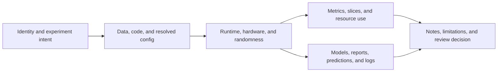

## Tracking Gives Each Run A Receipt
<!-- section-summary: Experiment tracking records the choices, results, files, lineage, and human notes for one run. -->

Experiment tracking is the practice of saving a structured receipt for every model run. The receipt says what choices went into the run, what results came out, which files were produced, which data and code were used, and what the team decided after looking at the evidence.

The previous article defined the experiment contract, run receipt, and replay acceptance rule. This article owns the instrumentation layer. Instead of keeping scores in file names, screenshots, chat threads, and notebook cells, the team sends parameters, metrics, artifacts, lineage, and notes to a tracking system such as MLflow or Weights & Biases.

The title answer is direct: **tracking experiment runs means logging the important facts of each training or evaluation attempt so the team can compare candidates, rerun important work, and explain why one result mattered**. An untracked run may still produce a model file. A tracked run gives that model file context.

If you have ever reopened an old notebook and wondered which setting produced the good score, this is the problem tracking solves. The run page should let you answer the basic questions without searching chat history: what changed, what data was used, what artifact was produced, and what decision did the team make after review?

The run record has six connected layers. The first three explain what executed. The next two explain what happened. The last explains what people decided.

| Layer | What it records | Failure when missing |
|---|---|---|
| **Identity and intent** | Run ID, experiment question, owner, parent search or pipeline run | Nobody knows why two runs should be compared |
| **Inputs** | Dataset, labels, features, resolved config, code commit | A result cannot be reproduced or explained |
| **Execution** | Container, packages, hardware, seeds, distributed settings | Environment changes hide behind the same source code |
| **Measurements** | Metric definitions, step curves, segments, uncertainty, runtime | A headline score hides behaviour and operating cost |
| **Outputs** | Model, schema, reports, predictions, logs, checksums | Reviewers see numbers without the files that produced them |
| **Decision context** | Notes, limitations, approval link, rejection reason | The dashboard records activity without preserving judgment |

These layers interact. A metric belongs to a specific dataset and metric implementation. A model artifact belongs to a specific code, config, and runtime. A review decision points to the complete record. One attractive chart cannot carry the evidence by itself.



The first three layers explain the execution that produced the result. Measurements and outputs show the observed behaviour and durable files. Decision context records what people concluded. Tracking stays useful when these relationships remain visible instead of flattening every run into a metric leaderboard.

## Apply The Run Record To Search Ranking
<!-- section-summary: A supporting example follows a marketplace search team that compares many ranking experiments. -->

Imagine **Cedar Market**, a marketplace where buyers search for handmade furniture, tools, fabric, and vintage electronics. The search ranking team owns the model that orders products after a user types a query such as "oak desk", "linen curtains", or "soldering station". Their current production model is `cedar-search-lambdamart:v6`.

The team is testing a new feature set called `seller_reliability_v2`. It adds seller response time, late shipment rate, return rate, and dispute rate features to the ranking model. The product goal is better buyer satisfaction, measured through click, add-to-cart, and purchase labels. The risk is that the model could push new sellers too far down the page, so the review also checks exposure for sellers with fewer than ten orders.

The experiment owner is Mateo, a search ML engineer. His run should record:

| Record type | Cedar Market example |
|---|---|
| Parameters | `learning_rate=0.03`, `num_leaves=127`, `feature_set=seller_reliability_v2` |
| Metrics | `valid/ndcg_at_10`, `valid/mrr_at_10`, `guardrail/new_seller_exposure` |
| Artifacts | `model.txt`, `feature_importance.csv`, `query_slice_metrics.parquet` |
| Data | `search_judgments_2026_06_30:v4`, `product_catalog_features_2026_06_30:v2` |
| Code | Git commit, repository URL, training entrypoint |
| Environment | Docker image digest, Python version, dependency lock file |
| Notes | Hypothesis, known risk, owner, review outcome |

This set of records gives the team enough evidence for a real review. The tracking tool is helpful because it stores the records in a searchable run page, comparison table, and artifact graph.

## Log Parameters And Configuration
<!-- section-summary: Parameters explain the choices that shaped the model, while config files preserve the full training recipe. -->

**Parameters** are the choices passed into the training process. They include model hyperparameters, feature groups, input windows, label definitions, thresholds, sampling rules, and evaluation settings. Parameters answer the question, "What did we ask this run to do?"

For Cedar Market, a short config file might look like this:

```yaml
run:
  project: cedar-search-ranking
  owner: mateo@cedar.example
  job_type: train
  model_name: cedar-search-lambdamart
  hypothesis: "Seller reliability features improve search quality while preserving new seller exposure."

data:
  judgments_artifact: cedar-market/search_judgments_2026_06_30:v4
  catalog_features_artifact: cedar-market/product_catalog_features_2026_06_30:v2
  train_window: "2026-05-01..2026-06-20"
  validation_window: "2026-06-21..2026-06-30"

features:
  base_set: search_ranker_features_v6
  add_groups:
    - seller_reliability_v2
    - query_product_text_match_v3

model:
  algorithm: lambdamart
  learning_rate: 0.03
  num_leaves: 127
  min_data_in_leaf: 100
  num_boost_round: 900
  early_stopping_rounds: 75

runtime:
  seed: 4107
  docker_image: ghcr.io/cedar/search-train@sha256:9f0b7821
```

Weights & Biases stores this kind of information in the run config. A practical training script can load the YAML, start a run, and send the config values to W&B:

```python
import os
import subprocess
from pathlib import Path

import wandb
import yaml


def git_commit() -> str:
    return subprocess.check_output(["git", "rev-parse", "HEAD"], text=True).strip()


config_path = Path("configs/search_ranker_seller_reliability.yaml")
config = yaml.safe_load(config_path.read_text())

run = wandb.init(
    project=config["run"]["project"],
    job_type=config["run"]["job_type"],
    name="seller-reliability-lambdamart-2026-07-04",
    config=config,
    tags=["ranking", "lambdamart", "seller-reliability-v2"],
    notes=config["run"]["hypothesis"],
)

run.config.update(
    {
        "code_commit": git_commit(),
        "entrypoint": "train_search_ranker.py",
        "docker_image": os.environ.get("IMAGE_DIGEST", config["runtime"]["docker_image"]),
    },
    allow_val_change=True,
)
```

The important part is consistency. If every run logs the same parameter names, the comparison table stays useful. If one run uses `learning_rate`, another uses `lr`, and another hides the value inside a notebook, the team loses the easy comparison that tracking should provide.


*Mateo's W&B run page keeps the seller reliability config, Docker image, Git commit, and search-ranking context together.*

When you design run tracking for a team, choose the keys as carefully as you choose function names in code. Future comparisons depend on those names staying stable across many experiments.

## Log Metrics And Segments
<!-- section-summary: Metrics show the result of the run, and segment metrics show whether the result holds across important groups. -->

**Metrics** are measured results. For search ranking, one score rarely tells the whole story. `nDCG@10` shows how useful the top ten results were according to relevance labels. `MRR@10` shows whether at least one highly relevant result appears early. Guardrail metrics protect the marketplace from unwanted side effects, such as hiding new sellers or increasing zero-result pages.

Cedar Market can use a metric table like this during review:

| Metric | Why it matters | Direction |
|---|---|---|
| `valid/ndcg_at_10` | Overall top-ten ranking quality | Higher |
| `valid/mrr_at_10` | First strong result appears earlier | Higher |
| `guardrail/new_seller_exposure` | New sellers still receive search visibility | Higher or stable |
| `guardrail/zero_result_rate` | Search should keep returning useful results | Lower |
| `serve/p95_latency_ms` | Ranking must fit the API latency budget | Lower or stable |

Mateo should also log segment metrics. A marketplace search model can improve common queries while hurting rare queries. It can help top sellers while hurting new sellers. It can perform well for furniture and poorly for electronics. Segment metrics give reviewers a way to see those patterns.

```python
overall_metrics, segment_metrics, query_examples = evaluate_ranker(model, validation_data)

wandb.log(
    {
        "valid/ndcg_at_10": overall_metrics["ndcg_at_10"],
        "valid/mrr_at_10": overall_metrics["mrr_at_10"],
        "guardrail/new_seller_exposure": overall_metrics["new_seller_exposure"],
        "guardrail/zero_result_rate": overall_metrics["zero_result_rate"],
        "serve/p95_latency_ms": overall_metrics["p95_latency_ms"],
    }
)

segment_table = wandb.Table(
    columns=["segment", "queries", "ndcg_at_10", "mrr_at_10", "new_seller_exposure"],
    data=[
        [
            row["segment"],
            row["queries"],
            row["ndcg_at_10"],
            row["mrr_at_10"],
            row["new_seller_exposure"],
        ]
        for row in segment_metrics
    ],
)

wandb.log({"evaluation/segment_metrics": segment_table})
```

W&B Tables are useful here because the table can hold segment rows, query examples, false-positive examples, or image/text/media examples depending on the model. For Cedar Market, a table of query examples might include the query text, top products from the baseline, top products from the candidate, labels, and the reason a reviewer flagged a result.

## Track Artifacts, Data, And Code
<!-- section-summary: Artifacts connect the run page to the files and versions the team may need later. -->

**Artifacts** are files or versioned collections that belong to a run. A training run usually consumes dataset artifacts and produces model or evaluation artifacts. The tracking system should show both sides: which inputs the run used and which outputs it created.

For Cedar Market, the training run uses two input artifacts:

- `cedar-market/search_judgments_2026_06_30:v4` for query-product labels.
- `cedar-market/product_catalog_features_2026_06_30:v2` for product and seller features.

The run produces output artifacts:

- `cedar-search-lambdamart:v7-candidate` for the trained model.
- `query_slice_metrics.parquet` for per-query and per-category review.
- `feature_importance.csv` for debugging and reviewer discussion.
- `environment.txt` for package versions.

The code below shows a practical W&B pattern. The run declares dataset artifact inputs, downloads them into the training workspace, trains the model, then logs a model artifact with metadata that links back to the run.

```python
judgments = run.use_artifact(config["data"]["judgments_artifact"], type="dataset")
catalog = run.use_artifact(config["data"]["catalog_features_artifact"], type="dataset")

judgments_dir = judgments.download(root="data/judgments")
catalog_dir = catalog.download(root="data/catalog_features")

model, evaluation = train_with_artifacts(config, judgments_dir, catalog_dir)

model_artifact = wandb.Artifact(
    name="cedar-search-lambdamart",
    type="model",
    metadata={
        "model_name": config["run"]["model_name"],
        "code_commit": run.config["code_commit"],
        "training_run": run.id,
        "primary_metric": "valid/ndcg_at_10",
        "validation_dataset": config["data"]["judgments_artifact"],
    },
)

model_artifact.add_file("artifacts/model.txt")
model_artifact.add_file("artifacts/feature_schema.json")
model_artifact.add_file("artifacts/feature_importance.csv")
model_artifact.add_file("artifacts/query_slice_metrics.parquet")

run.log_artifact(model_artifact, aliases=["candidate", "seller-reliability-v2"])
```

The code artifact story matters too. W&B captures some source context automatically, and teams often add explicit Git commit tags, repository URLs, build IDs, and CI job links. The point is practical: a teammate should be able to move from the run page to the code that produced the result.


*The run records which dataset artifacts trained the ranker and which model, feature, and query-slice artifacts came out of that run.*

When private data must stay in private storage, teams can track references instead of uploading raw data. For example, a dataset artifact can point to `s3://cedar-ml/search/judgments/snapshot_date=2026-06-30/` while W&B stores metadata and lineage. The data governance team should decide which artifact mode fits the organization's privacy and retention requirements.

## Write Notes And Review Decisions
<!-- section-summary: Notes explain the human reason for the run and the decision that followed review. -->

Numbers tell reviewers what changed. Notes explain why the run exists and what the team decided. Without notes, future teammates see a run list full of names such as `run-42`, `test-new-features`, and `final-final-v3`. That list may have useful models inside it, yet the team has to rediscover the story.

A good run note is short and specific:

```yaml
run_notes:
  hypothesis: "Seller reliability features improve quality for high-intent searches."
  risk: "New sellers may lose exposure because they have less reliability history."
  owner: mateo@cedar.example
  reviewer: search-ranking-review@cedar.example
  review_result: "Hold candidate. Re-run with new-seller exposure floor at 0.92."
  linked_ticket: SEARCH-4182
```

W&B Reports can turn a group of runs into a lightweight review document. The report can embed charts, comparison panels, tables, text notes, and links back to model artifacts. This is useful after a sweep or a weekly model review because the decision sits next to the evidence.

The review decision should use stable language. A future engineer should know whether the run was exploration, rejected, held for more checks, selected for registry, selected for shadow testing, or approved for canary. These states can live in tags, notes, report text, or an internal approval table.

## Check A Run Before Comparison
<!-- section-summary: A team should verify lineage, metrics, artifacts, and notes before using a run in candidate comparison. -->

Before a run enters a comparison table, the team should check that it has a complete record. A missing model artifact or a missing dataset version can waste review time because the candidate stalls even if the score is strong.

Cedar Market can use this run readiness checklist:

| Check | Good evidence |
|---|---|
| Code | Git commit, repository, CI job, and training entrypoint are logged |
| Data | Dataset artifact versions and snapshot dates are linked |
| Config | Full YAML config is stored in the run config or attached as an artifact |
| Environment | Container digest and dependency lock file are attached |
| Metrics | Primary metric, guardrails, and segment metrics are present |
| Artifacts | Model, feature schema, feature importance, and evaluation tables are logged |
| Notes | Hypothesis, risk, owner, reviewer, and review outcome are written |
| Baseline | Current production model was evaluated on the same validation snapshot |

The baseline check connects this article to the next one. Tracking a candidate is useful. Tracking the baseline under the same data and metric rules is what makes comparison fair.

## Keep Tracking Useful At Team Scale
<!-- section-summary: Naming, metric discipline, logging limits, and ownership keep the tracking system readable as run counts grow. -->

Tracking systems can get messy when a team grows. Thousands of runs with inconsistent names, duplicate metric keys, huge log payloads, and missing owners can make the tool harder to use. The fix usually comes from simple discipline before platform expansion.

Cedar Market can use these rules:

| Habit | Example |
|---|---|
| Use stable metric keys | Pick `valid/ndcg_at_10` as the canonical key and retire aliases such as `score`, `ndcg`, and `NDCG10` |
| Group related runs | `group=seller_reliability_v2_sweep_2026_07_04` |
| Use tags for filtering | `ranking`, `candidate`, `seller-reliability-v2`, `needs-review` |
| Keep large files as artifacts | Store model files and Parquet tables as artifacts instead of logging them as scalar fields |
| Log at reasonable frequency | Log training curves per epoch or useful interval instead of every tiny internal step |
| Add owners | Every candidate run should show who can answer questions |

The tracking tool should help the team answer review questions quickly. If the workspace is hard to search, the naming and logging conventions need the same care as the training code.


*Stable metric keys, groups, tags, artifacts, and owners turn a busy W&B project into a review-ready run table.*

## Putting It Together
<!-- section-summary: Tracking turns model runs into structured evidence for comparison, review, rerun, and debugging. -->

Tracking experiment runs means giving every important run a receipt. The receipt includes parameters, metrics, artifacts, data versions, code commit, environment, notes, and review decisions. With that record, the team can compare candidates, rerun promising work, and explain why a model moved forward or stopped.

For Cedar Market, W&B gives Mateo one page for the search ranking candidate: config choices, dataset artifacts, overall metrics, segment tables, model files, feature importance, notes, and the review result. That page is the bridge from one training attempt to a real model decision.

## What's Next
<!-- section-summary: The next article uses the tracked run records to compare candidates and choose a model. -->

The next step is comparison. Once every run has a clean record, the team can line candidates up against a baseline, inspect guardrails, check segments, and decide which model deserves a registry entry or release test.

## References

- [W&B Experiments](https://docs.wandb.ai/models/track) - Official W&B guide for logging metrics, hyperparameters, system metrics, and model artifacts.
- [W&B Artifacts](https://docs.wandb.ai/models/artifacts) - Official W&B guide for versioning datasets and model outputs as run inputs and outputs.
- [W&B Reports](https://docs.wandb.ai/models/reports) - Official W&B guide for organizing runs, embedding visualizations, and sharing findings.
- [W&B Tables](https://docs.wandb.ai/models/tables/visualize-tables) - Official W&B guide for comparing and visualizing table data from runs.
- [W&B Logging at Scale](https://docs.wandb.ai/models/track/limits) - Official W&B guidance on logging patterns and performance at larger project scale.
- [MLflow Tracking](https://mlflow.org/docs/latest/ml/tracking/) - Official MLflow guide for experiment runs, parameters, metrics, tags, artifacts, and comparisons.
