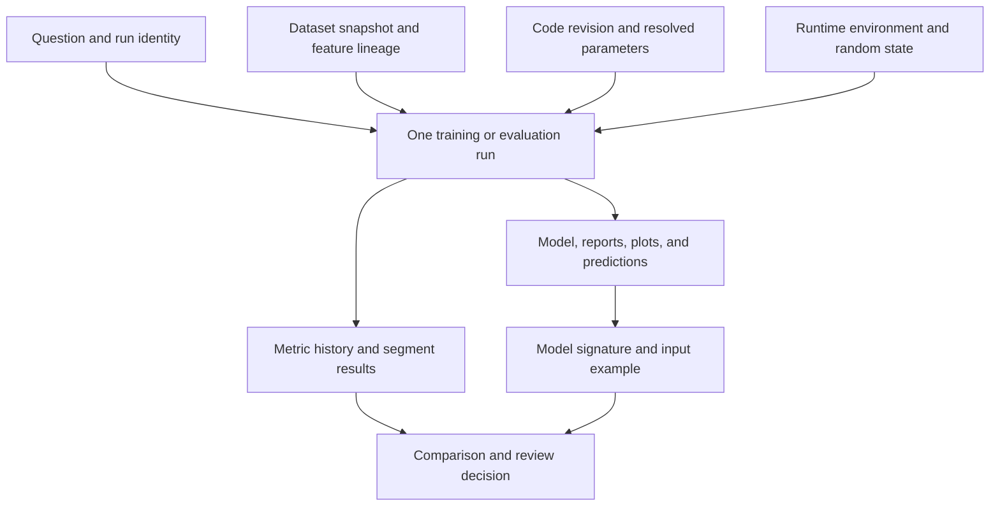
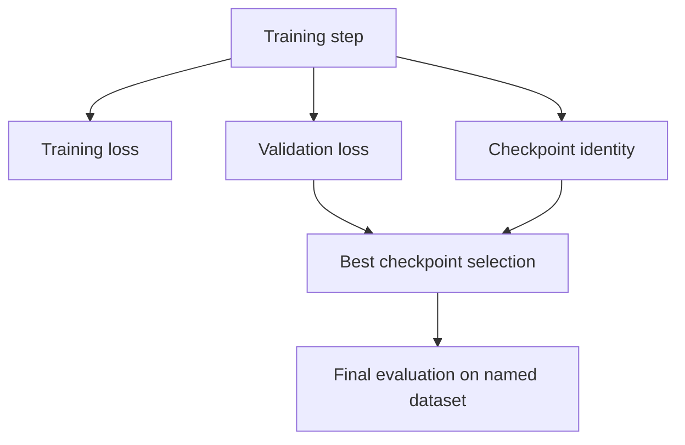
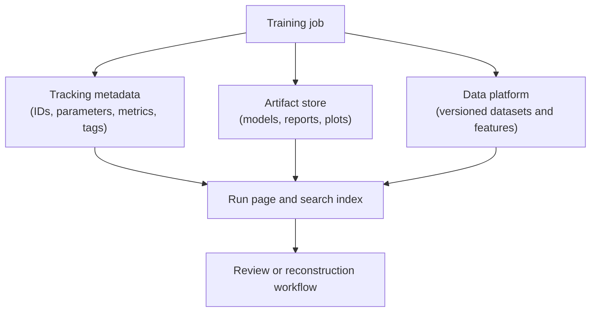
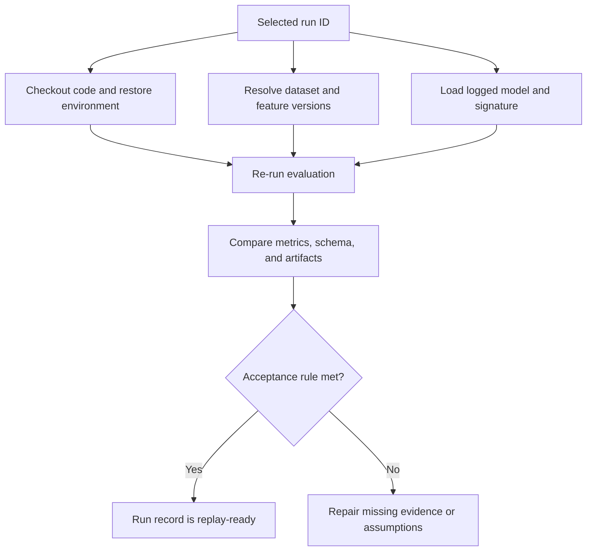

## Table of Contents

1. [A Final Score Cannot Explain a Training Run](#a-final-score-cannot-explain-a-training-run)
2. [Give Every Execution a Run Identity](#give-every-execution-a-run-identity)
3. [Think of Tracking as an Evidence Graph](#think-of-tracking-as-an-evidence-graph)
4. [Parameters Record the Choices](#parameters-record-the-choices)
5. [Metrics Record Behavior Over Steps and Time](#metrics-record-behavior-over-steps-and-time)
6. [Artifacts Preserve the Outputs Behind the Numbers](#artifacts-preserve-the-outputs-behind-the-numbers)
7. [Dataset Identity Connects a Score to Its Evidence](#dataset-identity-connects-a-score-to-its-evidence)
8. [Code and Environment Explain the Execution](#code-and-environment-explain-the-execution)
9. [Model Signatures Preserve the Serving Contract](#model-signatures-preserve-the-serving-contract)
10. [Parent and Child Runs Organize Search](#parent-and-child-runs-organize-search)
11. [Track a Small Run With MLflow 3](#track-a-small-run-with-mlflow-3)
12. [Store Each Kind of Evidence in the Right System](#store-each-kind-of-evidence-in-the-right-system)
13. [Keep Secrets and Sensitive Data Out of Run Metadata](#keep-secrets-and-sensitive-data-out-of-run-metadata)
14. [Design Logging for Scale and Failure](#design-logging-for-scale-and-failure)
15. [Verify Tracking by Reconstructing One Run](#verify-tracking-by-reconstructing-one-run)
16. [Choose a Platform Without Changing the Evidence Model](#choose-a-platform-without-changing-the-evidence-model)
17. [The Main Idea](#the-main-idea)
18. [References](#references)

## A Final Score Cannot Explain a Training Run
<!-- section-summary: A score earns trust through its connection to the choices, data, code, environment, and output that produced it. -->

Imagine running a small classifier and writing one line in a notebook: `validation_accuracy = 0.91`. The number looks promising. A week later, another engineer asks which dataset snapshot, feature columns, random seed, code commit, and package versions produced it. The notebook has changed, the terminal history is gone, and several model files share similar names.

The score still says how one evaluation ended. It cannot explain what was evaluated or recreate the conditions that produced it.

At a high level, **experiment tracking** gives each execution a durable evidence record. The record connects the training choices, measured behavior, output files, data lineage, source code, and runtime environment. A teammate can use that record to answer three practical questions:

- Why did this run produce its result?
- Is it fair to compare this run with another one?
- Can we reconstruct the model and its evaluation from the recorded evidence?

The tracking page is therefore more than a leaderboard. It is an index into the evidence behind a result. The UI helps people search and compare that evidence; the evidence model is the part that makes the page trustworthy.

## Give Every Execution a Run Identity
<!-- section-summary: A run identifies one bounded execution of training or evaluation so all of its inputs, observations, and outputs can be connected. -->

A **run** is one execution of a piece of ML work. Running `python train.py` once can create one run. Repeating the command with a different learning rate creates another. Evaluating an existing checkpoint on a new dataset can also create its own run.

The run ID is a unique key generated by the tracking system. It connects everything recorded during that execution. Human-readable names and tags help people search, yet the run ID remains the durable identity.

The boundary should match the question engineers want to compare. If one process trains five unrelated models, placing all five under one run makes their parameters and metrics hard to separate. If a distributed training job uses many workers to produce one model, those workers usually contribute to one logical run. The main process records shared metadata and aggregates worker metrics.

A run should also express intent. A short description can say “test stronger regularization after validation loss diverged,” while tags identify the owner, task, branch, and lifecycle purpose. This context distinguishes a deliberate experiment from a smoke test, failed setup attempt, or scheduled baseline evaluation.

## Think of Tracking as an Evidence Graph
<!-- section-summary: Experiment evidence forms a graph from data, code, configuration, and environment through one execution to metrics and model artifacts. -->

Experiment tracking records cause and effect as a connected evidence chain. Data, code, configuration, and environment shape an execution. That execution produces metrics and artifacts, and review decisions refer to those outputs and their lineage.


```mermaid
flowchart TD
    Q["Question and run identity"] --> R["One training or evaluation run"]
    D["Dataset snapshot and feature lineage"] --> R
    C["Code revision and resolved parameters"] --> R
    E["Runtime environment and random state"] --> R
    R --> M["Metric history and segment results"]
    R --> A["Model, reports, plots, and predictions"]
    A --> S["Model signature and input example"]
    M --> V["Comparison and review decision"]
    S --> V
```

Each edge carries meaning. A validation metric belongs to a particular validation dataset and metric implementation. A model artifact belongs to the exact run that created it. A signature describes the inputs and outputs expected by that model. A review decision points back to the full chain.

This structure also reveals gaps. A model with no dataset input has weak lineage. A loss curve with no step values hides its training history. A run with a Git commit and a dirty working tree still has uncertain code. Tracking works well once those gaps are visible and testable.

## Parameters Record the Choices
<!-- section-summary: Parameters preserve the resolved choices supplied to the run, including model settings and data or evaluation rules. -->

Parameters answer, “What did we ask this execution to do?” They are inputs chosen before or during the run. Metrics answer a different question by recording what happened after those choices were applied.

### Record the resolved recipe

**Parameters** are the choices that shape an execution. Hyperparameters such as learning rate, tree depth, batch size, and regularization are common examples. The same category also includes feature-set name, training window, label definition, sampling rule, split seed, threshold, and evaluation configuration.

Think of parameters as the resolved recipe. A templated YAML file may contain defaults and environment substitutions. The run should record the final values used by the process, plus the original config file as an artifact if it helps review. Logging only the template can hide an override passed through the command line or scheduler.

### Make comparisons stable

Parameter names should stay stable across related runs. `learning_rate`, `lr`, and `eta` may represent the same concept, yet three keys make automated comparison harder. A team-owned configuration schema can define canonical names, types, units, and required values.

Some values belong elsewhere. A database password belongs in the secret manager, outside experiment parameters. A million feature names form a file artifact, while the parameter can record the feature-set version or artifact URI. A long SQL query can live as a versioned artifact with its hash recorded in the run.

## Metrics Record Behavior Over Steps and Time
<!-- section-summary: Metrics preserve numerical observations together with their names, steps, timestamps, datasets, and interpretation. -->

Metrics turn the behavior of a run into comparable numerical evidence. Their meaning comes from context: the evaluation dataset, calculation rule, training step, time, segment, and model checkpoint associated with each value.

### Preserve the training history

A **metric** is a numerical observation produced during or after a run. Final accuracy, validation loss, inference latency, training cost, subgroup recall, and calibration error are all metrics.

One final value often hides the most useful behavior. A training loss recorded after every epoch forms a **metric history**. The step value gives those points an order, while the timestamp shows when they were recorded. A model whose validation loss improves and then worsens tells a different story from one that reaches the same final loss steadily.


```mermaid
flowchart TD
    T["Training step"] --> L["Training loss"]
    T --> V["Validation loss"]
    T --> C["Checkpoint identity"]
    V --> B["Best checkpoint selection"]
    C --> B
    B --> F["Final evaluation on named dataset"]
```

Metric keys need a clear contract. `valid/log_loss` should identify the validation split and log-loss definition. Units belong in names or documentation for latency, memory, energy, and cost. Direction should be known: lower log loss is better, while higher recall is better.

### Attach evaluation context

Segment metrics reveal whether an aggregate result hides a weak group. Record a bounded set of predeclared segments such as region, device class, label group, or data-quality bucket. Large per-example results fit an artifact or evaluation table; turning each segment and class combination into a metric key can overwhelm the tracking backend.

MLflow 3 can associate a metric with a specific logged model and dataset. This is valuable if one run creates several checkpoints or evaluates one model on several snapshots. The metric then answers “how did this exact model perform on this exact dataset?”

## Artifacts Preserve the Outputs Behind the Numbers
<!-- section-summary: Artifacts store durable files produced or consumed by a run, including models, reports, examples, and resolved configuration. -->

Metrics summarize a result, while artifacts preserve the files behind it. A reviewer can open those files to inspect failures, load the trained model, or recover configuration details that would be awkward as scalar fields.

### Keep the files that support review

An **artifact** is a file or directory connected to a run. Model weights are artifacts. Confusion matrices, evaluation reports, sample predictions, feature lists, resolved configs, and dependency lockfiles are also artifacts.

Artifacts provide the detail that scalar metrics leave out. Accuracy can say that ten percent of examples were wrong. A prediction table can show which examples failed, their labels, scores, segments, and error categories. A model file lets another process load the trained result instead of retraining from memory.

### Give artifacts identity and retention

Useful artifacts are deliberate. Saving every temporary checkpoint from every exploratory run can create high storage cost and a workspace full of indistinguishable files. Keep checkpoints needed for recovery, comparison, or long-running training. Apply shorter retention to disposable intermediate files, and preserve artifacts linked to promoted models or formal decisions according to governance policy.

An artifact needs its own integrity information. Object version, checksum, size, format, and creation run help detect missing or replaced content. The run record should keep a stable reference even if a friendly alias later points to a newer artifact.

## Dataset Identity Connects a Score to Its Evidence
<!-- section-summary: Dataset tracking records the exact snapshot, source, transformation lineage, schema, and role used by a run. -->

ML behavior depends heavily on data. Two runs with identical code and parameters can produce different models because the rows, labels, or point-in-time joins changed.

A dataset name such as `training_data` gives little evidence. A useful identity names the source and an immutable version: an Iceberg or Delta table version, object manifest, warehouse snapshot, dataset artifact version, or content digest. It should also record the label cutoff, feature-view versions, split rule, and transformation revision needed to construct the model input.

The **dataset role** explains how the run used the data. Training, validation, test, calibration, and evaluation datasets carry different statistical meaning. Logging the role prevents a test set from quietly appearing as training input and makes comparisons across validation snapshots explicit.

A fingerprint helps detect changed content, though a fingerprint alone cannot reconstruct lineage. Teams still need the source, query or transformation version, and snapshot semantics. A mutable table URI with no version can resolve to different rows tomorrow.

MLflow datasets can record a name, digest, source, schema, profile, and context through `mlflow.log_input()`. Metadata-only references are appropriate for governed data that remains in a lakehouse, warehouse, or object store. Raw customer rows can stay under the data platform’s access and retention controls.

## Code and Environment Explain the Execution
<!-- section-summary: Code revision and runtime identity capture the implementation and computing conditions that transformed inputs into outputs. -->

The Git commit identifies the versioned source tree. It should be accompanied by repository identity, entrypoint, and dirty-tree state. A commit alone misses uncommitted notebook cells or local edits. Teams can reject candidate runs from a dirty tree or attach a reviewed diff artifact.

Generated code matters too. A training job built from a container should record the image digest and build ID. A notebook job should record the exported source or immutable notebook revision. Shared libraries and feature code need versions that resolve independently of the application repository.

The **environment** describes where the code executed. Python version, dependency lockfile, ML framework, CUDA and driver versions, hardware type, worker count, distributed strategy, locale, and random seeds can influence the result. Exact bit-for-bit reproduction may still be impossible on nondeterministic accelerators, yet recording these conditions helps distinguish code changes from environment changes.

MLflow model logging writes environment files such as `requirements.txt`, `python_env.yaml`, and `conda.yaml` for supported model flavors. Those files describe model dependencies. The broader training environment still benefits from an image digest and infrastructure metadata.

## Model Signatures Preserve the Serving Contract
<!-- section-summary: A model signature records expected inputs, outputs, and inference parameters so the tracked artifact can be validated and integrated safely. -->

A model file can exist while its usage contract is unclear. A **model signature** describes the names, types, and shapes of inputs and outputs. It can also describe inference parameters. An **input example** gives a small concrete payload that satisfies the contract.

For a tabular classifier, the signature might require four numeric feature columns and return class probabilities. For an image model, it might require a tensor with a specific channel layout. For a text model, it might define structured message input and generation parameters.

Signatures support two practical checks. First, model logging can validate that the model accepts the example and produces the inferred output shape. Second, serving systems can validate incoming payloads against the stored contract. Databricks Unity Catalog requires a signature for registered models, making this evidence part of the governed model lifecycle.

The signature complements the feature contract. It describes the boundary presented to the model artifact. Feature lineage explains how production data is transformed into that boundary.

## Parent and Child Runs Organize Search
<!-- section-summary: Parent-child relationships group many related executions while preserving the parameters and metrics of each independent trial. -->

Hyperparameter optimization can create hundreds of trials. Flattening them into one experiment produces a long run list with little sense of which trials belong to the same search.

A **parent run** represents the study. It records the search space, objective, sampler, budget, shared dataset, and final selection. Each **child run** represents one trial with its resolved parameters, metric history, status, and optional model artifact.

```python
with mlflow.start_run(run_name="regularization-search"):
    mlflow.log_param("objective", "valid_log_loss")
    for trial_id, learning_rate in enumerate([0.01, 0.05, 0.1]):
        with mlflow.start_run(run_name=f"trial-{trial_id}", nested=True):
            mlflow.log_param("learning_rate", learning_rate)
            train_and_log_trial(learning_rate)
```

This structure also fits cross-validation if each fold needs its own diagnostics. The parent can record the aggregate result, while children preserve fold-specific evidence. Avoid placing every epoch in a child run; epochs are steps inside one training execution.

## Track a Small Run With MLflow 3
<!-- section-summary: A focused MLflow 3 run can connect resolved parameters, metric history, datasets, a model signature, and the logged model identity. -->

The following example trains a small gradient-boosted classifier. It records training and validation datasets, resolved parameters, metrics at each boosting stage, final metrics linked to the logged model and validation dataset, and a model signature.

```python
import mlflow
import mlflow.sklearn
from mlflow.models import infer_signature
from sklearn.datasets import load_wine
from sklearn.ensemble import GradientBoostingClassifier
from sklearn.metrics import accuracy_score, log_loss
from sklearn.model_selection import train_test_split

X, y = load_wine(as_frame=True, return_X_y=True)
X_train, X_valid, y_train, y_valid = train_test_split(
    X, y, test_size=0.25, random_state=17, stratify=y
)
train_frame = X_train.assign(target=y_train)
valid_frame = X_valid.assign(target=y_valid)
source = "https://archive.ics.uci.edu/dataset/109/wine"
train_data = mlflow.data.from_pandas(
    train_frame, source=source, name="wine-train", targets="target"
)
valid_data = mlflow.data.from_pandas(
    valid_frame, source=source, name="wine-valid", targets="target"
)

mlflow.set_experiment("wine-classifier")
with mlflow.start_run(run_name="gb-small-run", log_system_metrics=True):
    params = {"n_estimators": 30, "learning_rate": 0.05,
              "max_depth": 2, "random_state": 17}
    mlflow.log_params(params)
    mlflow.log_input(train_data, context="training")
    mlflow.log_input(valid_data, context="validation")

    model = GradientBoostingClassifier(**params).fit(X_train, y_train)
    for step, probabilities in enumerate(model.staged_predict_proba(X_valid), 1):
        mlflow.log_metric("valid/log_loss", log_loss(y_valid, probabilities), step=step)

    predictions = model.predict(X_valid)
    signature = infer_signature(X_valid, model.predict_proba(X_valid))
    model_info = mlflow.sklearn.log_model(
        model, name="model", signature=signature, input_example=X_valid.iloc[:3]
    )
    mlflow.log_metric(
        "final/accuracy", accuracy_score(y_valid, predictions),
        model_id=model_info.model_id, dataset=valid_data,
    )
```

The tracking server now knows the unique run ID and logged model ID. MLflow 3 gives the logged model its own identity, so evaluation metrics can point to that model and dataset directly. The code should also log the Git commit, image digest, resolved config, and review note in a real training job; those values depend on the surrounding CI and execution platform.

Autologging can capture standard parameters, metrics, and models for supported libraries. Teams should inspect what their integration records and add domain evidence such as dataset snapshot, feature contract, segment report, and decision context.

## Store Each Kind of Evidence in the Right System
<!-- section-summary: Tracking metadata indexes a run, artifact storage holds durable files, and governed data systems retain large datasets and sensitive records. -->

Experiment tracking connects several storage systems. Its value comes from giving each system a clear responsibility and preserving stable links among them, instead of copying every input and output into one database.

### Separate metadata from durable files

A tracking platform usually separates a metadata backend from an artifact store. The metadata backend holds run IDs, parameters, tags, metric points, statuses, and artifact references. The artifact store holds larger files such as model weights, plots, reports, and Parquet outputs. Object storage is a common artifact backend.

Training datasets usually remain in the lakehouse, warehouse, feature platform, or governed object store. The tracking run records their immutable references and lineage. Uploading a multi-terabyte training snapshot into every run duplicates data and weakens governance.


```mermaid
flowchart TD
    J["Training job"] --> T["Tracking metadata<br/>(IDs, parameters, metrics, tags)"]
    J --> A["Artifact store<br/>(models, reports, plots)"]
    J --> D["Data platform<br/>(versioned datasets and features)"]
    T --> I["Run page and search index"]
    A --> I
    D --> I
    I --> R["Review or reconstruction workflow"]
```

Use the tracking backend for values people filter, sort, and graph. Use the artifact store for durable run outputs. Use the data platform for governed datasets. Store links and immutable identities across these systems so the run page remains the entry point.

### Retain the complete evidence chain

Retention should follow value and obligation. Promoted models and formal evaluation evidence often need long retention. Failed setup runs, dense metric histories, and disposable checkpoints can expire earlier. A retention job should preserve referential integrity; keeping a run whose required model artifact has vanished creates a misleading record.

## Keep Secrets and Sensitive Data Out of Run Metadata
<!-- section-summary: Run metadata is widely searchable, so credentials, personal data, and sensitive examples require stricter systems and governed references. -->

Parameters, tags, notes, and artifact paths are often visible to many project members. Never log passwords, API keys, access tokens, private keys, or signed URLs. Read secrets from the platform’s secret manager and record only the secret name or configuration version if policy allows.

Dataset URIs need inspection because query strings can contain temporary credentials. Sanitize the URI before logging it. Access to the tracking server and artifact store should use workload identity or short-lived credentials managed outside the run.

Raw prediction examples can contain personal, health, financial, or confidential business data. Prefer pseudonymous identifiers, approved redaction, aggregates, and governed source references. If reviewers need row-level failure examples, keep them in an access-controlled table with an auditable link from the run.

Retention and deletion obligations apply to artifacts too. A copied customer row inside a confusion-analysis CSV can escape the controls attached to the source dataset. Data classification should decide which artifacts are permitted, who can read them, and how deletion requests propagate.

## Design Logging for Scale and Failure
<!-- section-summary: Batching, bounded metric frequency, explicit completion checks, and failure visibility keep tracking reliable during large or distributed jobs. -->

Logging every training batch from every worker can overload the tracking service and slow the job. Aggregate worker metrics through the main process, choose a meaningful step interval, and batch related values with `mlflow.log_metrics()`. Keep dense framework telemetry in the platform designed for it, while logging the curves needed for experiment comparison.

MLflow logging is synchronous by default. For a high-frequency loop, `synchronous=False` queues the operation and returns a future-like `RunOperations` object. The process can call `mlflow.flush_async_logging()` before exit. Critical identity, final metrics, and model artifacts deserve completion verification even if intermediate curves use asynchronous logging.

A job can train successfully while tracking fails because the network or artifact store is unavailable. Treat this as an evidence-integrity failure. Keep the local model and logs in a recoverable job output, mark the run incomplete, and retry upload through a controlled path. Avoid promoting a candidate whose required lineage is missing.

Distributed jobs need one logical owner for the run. If every worker creates a separate top-level run, the comparison view fills with noise. Log worker-specific system metrics with stable node identity only where they help diagnose scaling; keep shared parameters and model identity on the logical training run.

## Verify Tracking by Reconstructing One Run
<!-- section-summary: A tracking system proves its value when another engineer can rebuild one important run and reproduce its model contract and evaluation. -->

Completeness is difficult to judge from a run page alone. Reconstruction tests the record from a new engineer’s perspective and reveals which assumptions remained only in the original author’s notebook or memory.

### Rebuild from the run identity

The strongest tracking check is a reconstruction exercise. Select an important completed run and ask an engineer unfamiliar with it to rebuild the evaluation.

Start with the run ID. Resolve its code commit and confirm the working tree or packaged source. Retrieve the resolved configuration, environment definition, dataset versions, and feature lineage. Load the logged model by its model ID. Validate the input example against the signature. Re-run evaluation on the recorded validation dataset with the recorded metric implementation.


```mermaid
flowchart TD
    R["Selected run ID"] --> C["Checkout code and restore environment"]
    R --> D["Resolve dataset and feature versions"]
    R --> M["Load logged model and signature"]
    C --> E["Re-run evaluation"]
    D --> E
    M --> E
    E --> V["Compare metrics, schema, and artifacts"]
    V --> G{"Acceptance rule met?"}
    G -->|"Yes"| P["Run record is replay-ready"]
    G -->|"No"| F["Repair missing evidence or assumptions"]
```

Exact floating-point equality may be unrealistic across accelerators or nondeterministic operations. The acceptance rule can use metric tolerances, prediction agreement, schema equality, and checksum equality for deterministic artifacts. The rule should be written before the exercise.

### Repair the evidence contract

Common failures reveal actionable gaps: a mutable data URI, missing feature transformation, dirty source tree, expired artifact, incompatible dependency, absent random seed, or metric code that changed. Fix the logging contract and repeat the exercise. A beautiful dashboard cannot substitute for this proof.

## Choose a Platform Without Changing the Evidence Model
<!-- section-summary: MLflow, W&B, and managed tracking services package the workflow differently while preserving the same core evidence relationships. -->

MLflow provides open APIs and a separable tracking server, metadata backend, and artifact store. MLflow 3 also gives logged models first-class identity and links metrics to models and datasets. Databricks offers a managed MLflow tracking server for teams that want the same API with platform-managed hosting.

Weights & Biases centers the experience on runs, interactive comparison, and versioned Artifacts with lineage graphs. It can be a strong fit for teams that value a managed collaboration UI and media-rich evaluation. Cloud ML platforms also connect tracking to their managed jobs, registries, identities, and storage.

The choice affects hosting, governance, integrations, cost, and portability. The evidence contract remains the same. Every serious platform should let the team identify an execution, trace its inputs, inspect metric history, retrieve outputs, and reconstruct the basis of a decision.

## The Main Idea
<!-- section-summary: Experiment tracking turns one execution into connected evidence that another engineer can explain, compare, and reconstruct. -->

Experiment tracking records the evidence behind a result. Parameters capture resolved choices. Metric histories capture behavior. Artifacts preserve outputs. Dataset lineage, code revision, and environment identity explain how those outputs were produced. Model signatures describe how the trained artifact should be used.

MLflow 3 provides a practical implementation through runs, datasets, logged models, metric links, signatures, and artifact storage. Parent-child runs keep search studies understandable, while clear storage and privacy boundaries keep the tracking system scalable and governable.

The real quality gate is reconstruction. If another engineer can start from a run ID, restore its inputs and environment, load its model, and reproduce the accepted evaluation, the tracking record is doing useful engineering work.

## References

- [MLflow: Experiment tracking](https://mlflow.org/docs/latest/ml/tracking/)
- [MLflow: Dataset tracking](https://mlflow.org/docs/latest/ml/dataset/)
- [MLflow: Model signatures and input examples](https://mlflow.org/docs/latest/ml/model/signatures/)
- [MLflow: Python tracking APIs](https://mlflow.org/docs/latest/api_reference/python_api/mlflow.html)
- [MLflow: Hyperparameter tuning with child runs](https://mlflow.org/docs/latest/ml/getting-started/hyperparameter-tuning)
- [MLflow: Model format and dependency files](https://mlflow.org/docs/latest/ml/model/)
- [Databricks: Track model development with MLflow 3](https://docs.databricks.com/aws/en/mlflow/tracking)
- [Databricks: Managed MLflow tracking storage](https://docs.databricks.com/aws/en/mlflow/tracking-server-configuration)
- [Weights & Biases: Experiment tracking](https://docs.wandb.ai/models/track)
- [Weights & Biases: Artifact lineage graphs](https://docs.wandb.ai/models/artifacts/explore-and-traverse-an-artifact-graph)
