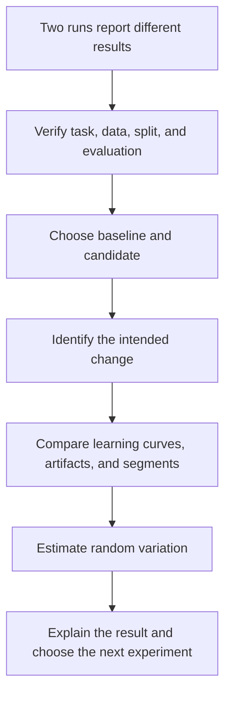
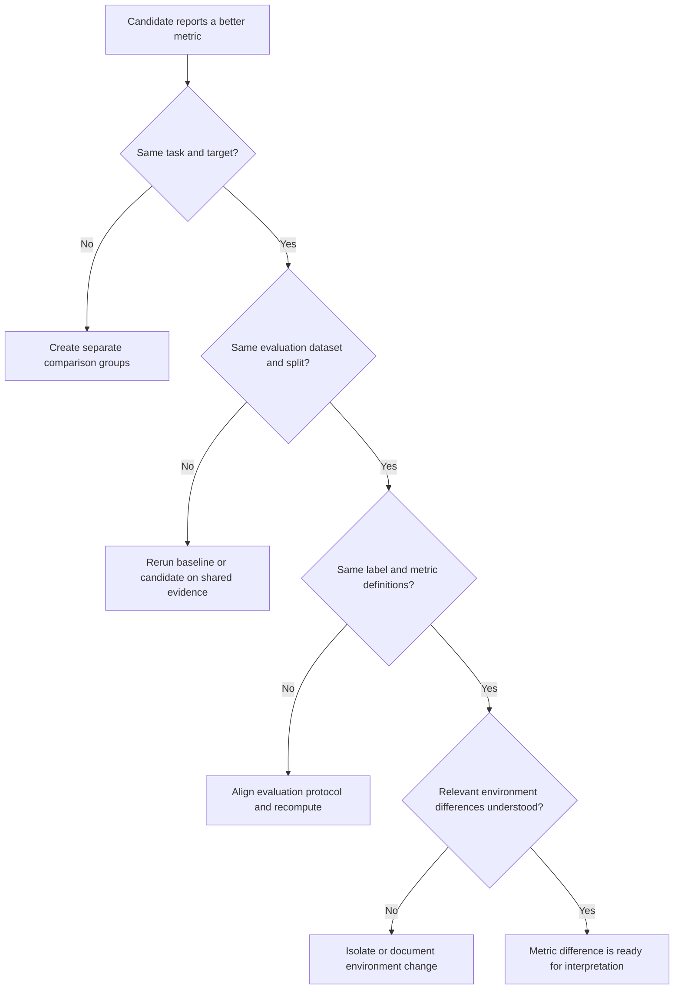
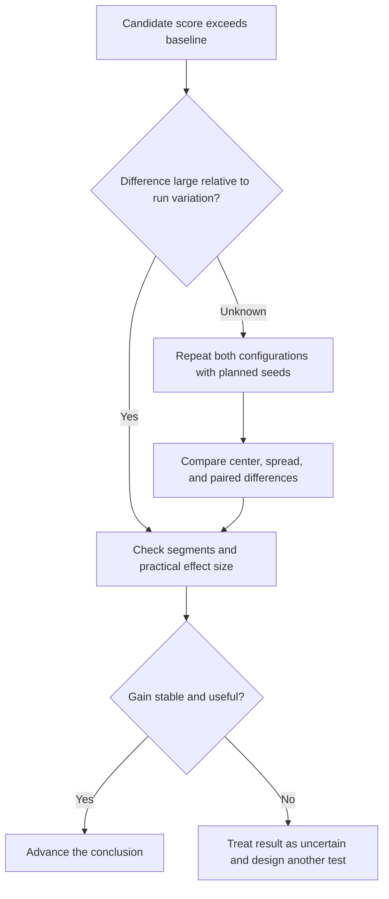
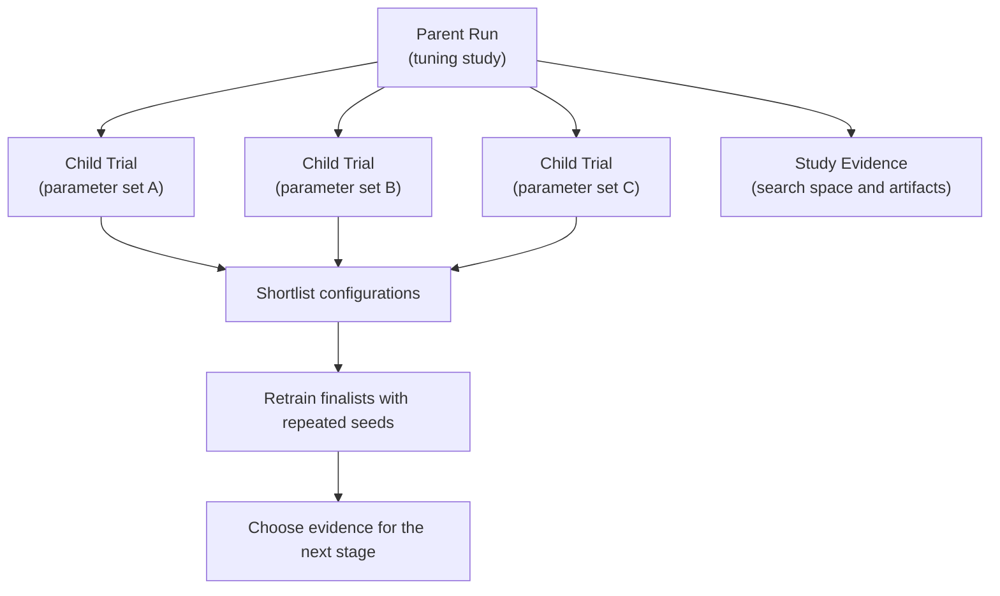

## Table of Contents

1. [Two Scores Can Hide Two Different Experiments](#two-scores-can-hide-two-different-experiments)
2. [Compare Runs To Find Why Results Changed](#compare-runs-to-find-why-results-changed)
3. [Prove That the Runs Are Comparable](#prove-that-the-runs-are-comparable)
4. [Choose The Reference Run And The New Run To Compare](#choose-the-reference-run-and-the-new-run-to-compare)
5. [Isolate the Intended Change](#isolate-the-intended-change)
6. [Read Learning Curves Alongside Final Metrics](#read-learning-curves-alongside-final-metrics)
7. [Compare Segments And Example-Level Results](#compare-segments-and-example-level-results)
8. [Separate Improvement From Random Variation](#separate-improvement-from-random-variation)
9. [Compare Hyperparameter Trials as One Study](#compare-hyperparameter-trials-as-one-study)
10. [Compare Runs And Models With MLflow 3](#compare-runs-and-models-with-mlflow-3)
11. [Know What the Comparison UI Cannot Decide](#know-what-the-comparison-ui-cannot-decide)
12. [An Experiment Winner Is Only a Release Candidate](#an-experiment-winner-is-only-a-release-candidate)
13. [Record the Conclusion and the Next Experiment](#record-the-conclusion-and-the-next-experiment)
14. [The Main Idea](#the-main-idea)
15. [References](#references)

## Two Scores Can Hide Two Different Experiments
<!-- section-summary: A higher metric has meaning only after the team confirms that both runs answered the same experimental question. -->

At a high level, **comparing experiment runs** means explaining why one training run produced a different result from another. The visible part is usually a pair of scores. The real work is deciding whether the score difference came from the intended model change or from some other part of the experiment.

Imagine two classification runs:

- The baseline reports an F1 score of `0.812`.
- The candidate reports an F1 score of `0.826`.

The candidate appears better. That conclusion is safe only if both runs used the same task definition, eligible data, split, label policy, metric code, prediction threshold, and evaluation environment. A new data snapshot could contain less challenging examples. A changed threshold could raise F1 without changing model quality. A lucky random seed could create a small temporary advantage. A dependency upgrade could alter preprocessing.

The metric difference tells us what happened; the comparison must explain why it happened.



This order prevents a familiar mistake: sorting a run table by one metric and treating the first row as the answer.

## Compare Runs To Find Why Results Changed
<!-- section-summary: A useful comparison connects a measured outcome to the controlled change that could have produced it. -->

An experiment asks a question such as, “Does adding recency features improve ranking quality?” or “Does a smaller learning rate improve calibration?” A run is one execution of that experiment. Run comparison evaluates the evidence across executions.

The strongest comparison changes one planned factor and holds the important alternatives steady. Reality is often messier: training code, data, compute images, and several parameters may move together. The team can still compare those runs, although its conclusion should match the evidence. If five meaningful inputs changed, the result supports “this bundle performed differently.” It cannot isolate which one caused the change.

A helpful framework has six layers:

1. **Question:** What hypothesis or engineering choice is being tested?
2. **Comparability:** Did the runs use compatible data and evaluation rules?
3. **Treatment:** Which intentional change separates candidate from baseline?
4. **Behavior:** How did training, segments, and errors differ?
5. **Uncertainty:** Is the result larger than ordinary run-to-run variation?
6. **Decision:** What conclusion is justified, and what experiment comes next?

For example, two demand-forecasting runs use the same code and evaluation window. The candidate adds holiday-distance features. Aggregate error improves, with the gain concentrated around holidays and stable error elsewhere. Repeated seeds show a similar pattern. This evidence supports a focused conclusion: the holiday features help forecast holiday periods. It says little about a new optimizer because the optimizer stayed fixed.

## Prove That the Runs Are Comparable
<!-- section-summary: A fair comparison aligns the task, eligible data, split, evaluation logic, and relevant execution environment before reading the metric delta. -->

**Comparability** means the runs answer the same question under sufficiently similar conditions. Exact byte-for-byte execution is unnecessary for every study. The conditions that can change the conclusion must be aligned or explicitly accounted for.

### Use The Same Prediction Task And Label Definition

Start with the task. Both runs should predict the same target for the same population and decision horizon. A churn model predicting cancellation in 30 days cannot be compared directly with one predicting cancellation in 90 days, even if both log `roc_auc`.

### Use The Same Data And Evaluation Boundary

Then verify the evidence boundary:

- **Data identity:** training and evaluation dataset names, digests, table versions, or immutable snapshot references;
- **Split identity:** row assignment, time cutoff, cross-validation folds, and leakage controls;
- **Label policy:** target construction, exclusions, adjudication, and label maturity;
- **Evaluation protocol:** metric implementation, averaging rule, threshold, sample weights, and segment definitions;
- **Environment:** code commit, dependency lock, container digest, framework version, and relevant hardware path.

The evaluation split deserves special attention. Suppose a recommendation candidate uses a random split while the baseline uses a time-based split. The random split may place near-duplicate user behavior on both sides, making the candidate look stronger. The runs measured different levels of difficulty, so the metric delta cannot establish a model improvement.



If comparability fails, the team has learned something useful: the current runs cannot answer the intended question. Rerunning one model on the other run’s evaluation snapshot is often faster and safer than debating incompatible scores.

## Choose The Reference Run And The New Run To Compare
<!-- section-summary: The baseline is the reference the team cares about, and the candidate is the controlled alternative being evaluated against it. -->

A **baseline** is the reference point for the decision. It gives the metric delta a practical meaning. The best baseline depends on the question:

- Use the current production model to evaluate a possible replacement.
- Use the simplest reasonable method to test whether added complexity earns its cost.
- Use the last accepted experiment to measure progress during research.
- Use a fixed control configuration to compare hyperparameter trials.

The candidate is the alternative under investigation. A candidate should carry a clear statement of its intended difference: “added two recency features,” “changed learning rate,” or “replaced the text encoder.” This statement is far more informative than a generated run name.

Consider an inference-cost experiment. A distilled model is three times faster and loses `0.003` in accuracy. The current production model is the right baseline because the product decision concerns latency and quality in the live path. The largest research model would answer a different question.

Baseline choice also guards against moving targets. If every new run is compared only with the latest temporary winner, the team can lose sight of production behavior and the original hypothesis. Keep stable reference runs pinned or tagged, and record why each one matters.

## Isolate the Intended Change
<!-- section-summary: Parameter and environment diffs reveal the intended treatment, hidden changes, and confounders that could explain the result. -->

A configuration comparison is a controlled diff. Its purpose is to identify the factor the experiment intended to test and expose extra differences that could also explain the result.

After the fair-comparison gate passes, line up the run configurations. Separate fields into three groups:

- **Held constant:** conditions intentionally shared by baseline and candidate;
- **Planned change:** the factor the experiment aims to test;
- **Unexpected difference:** any extra change that could affect the result.

Suppose the planned change is `max_depth: 8 → 12`. The run diff also reveals a new data digest and a different scikit-learn version. Those extra differences are **confounders**: alternative explanations for the result. The clean response is a new run that keeps the shared data and environment while changing only depth.

A small machine-readable comparison can keep this review repeatable:

```yaml
comparison:
  question: "Does a larger tree depth improve minority-class recall?"
  baseline_run: "run_baseline"
  candidate_run: "run_depth_12"
  held_constant:
    dataset_digest: "sha256:shared-evaluation-snapshot"
    split_id: "grouped-split-v3"
    metric_protocol: "classification-eval-v5"
    code_commit: "same-commit"
  planned_change:
    max_depth: [8, 12]
  unexpected_differences: []
```

In a large configuration, flatten nested values or log a normalized config artifact so the diff can compare actual values. Defaults matter too. A parameter missing from one run may mean “use the library default,” and library upgrades can change that default.

## Read Learning Curves Alongside Final Metrics
<!-- section-summary: Step metrics show how a run reached its final score and reveal instability, overfitting, slow convergence, or accidental checkpoint selection. -->

The final metric is one point at the end of a process. **Learning curves** record metrics across steps or epochs, helping the team understand how training evolved.

Align curves by a meaningful x-axis. Epoch number is useful if every epoch sees the same amount of data. Optimizer steps, tokens, examples processed, or wall-clock time may be fairer for runs with different batch sizes or distributed configurations.

Several curve shapes carry practical information:

- Training loss falls while validation loss rises: the run may be overfitting.
- Candidate improves early and later oscillates sharply: the learning rate may be aggressive.
- Two runs reach the same quality, yet one needs half the compute: the faster run may be more efficient.
- The selected checkpoint occurs at a different step for every run: checkpoint selection policy may explain the final-score difference.

For example, two language classifiers finish at nearly the same F1 score. The candidate reaches that level after one-third of the tokens and then plateaus. If training cost matters, the experiment found an efficiency improvement even though the final leaderboard barely moved.

Step metrics also reveal unfair stopping. Comparing the best checkpoint from one run with the final checkpoint from another gives each run a different selection rule. Choose the checkpoint policy before examining results and apply it consistently.

## Compare Segments And Example-Level Results
<!-- section-summary: Segment metrics and diagnostic artifacts reveal which examples improved, which regressed, and why the average moved. -->

An aggregate metric compresses many cases into one number. **Segment analysis** expands it again by looking at meaningful groups such as class, region, language, device, time horizon, or customer workflow.

### Start With Product-Relevant Segments

The right segments come from product risk and known data structure. They should be defined before inspecting candidate outcomes where possible. Creating a very specific slice after seeing an error can generate a convincing story from random noise.

Imagine a speech model whose overall word error rate improves by two percent. Error falls strongly for studio microphones and rises for mobile calls in noisy environments. A team serving a call-center product may reject that tradeoff even though the aggregate score is better.

Artifacts add the missing detail. Useful comparison artifacts include:

- confusion matrices and calibration plots;
- residual distributions and error quantiles;
- prediction tables keyed by stable example ID;
- representative false positives and false negatives;
- model cards, feature-importance reports, or data-profile differences;
- runtime profiles, checkpoints, and evaluation reports.

### Compare The Same Examples

The stable example ID is especially useful. Join baseline and candidate predictions on the same examples, then inspect cases that changed from correct to incorrect and incorrect to correct. This **paired comparison** is more informative than two separate error galleries because it shows exactly where behavior moved.

For an image classifier, a small gallery of changed predictions may reveal that the candidate learned the background instead of the object. For a forecasting model, residual plots may reveal improvement in ordinary weeks and severe underprediction during promotions. These explanations guide the next experiment.

## Separate Improvement From Random Variation
<!-- section-summary: Repeated trials and uncertainty estimates show whether a metric gain is stable enough to support a conclusion. -->

Many ML training procedures are stochastic. Weight initialization, data shuffling, augmentation, dropout, and distributed execution can produce different results from the same configuration. A single run therefore mixes the effect of the planned change with ordinary random variation.

Suppose the baseline reaches accuracies between `0.810` and `0.819` across repeated seeds. The candidate reaches `0.813` to `0.822`. Its best run beats every baseline run, yet the two distributions overlap heavily. Selecting only the best seed exaggerates the evidence.

A stronger design repeats baseline and candidate under a small, predeclared seed set. Compare the mean or median, the spread, and paired differences for matching seeds. For expensive training, bootstrap intervals over a fixed evaluation set can quantify prediction uncertainty, although they cannot replace repeated training runs if training randomness is important.



Statistical significance and practical significance answer different questions. A tiny improvement can be statistically credible on millions of examples and still have little product value. A larger but uncertain improvement may justify another run instead of immediate rejection.

## Compare Hyperparameter Trials as One Study
<!-- section-summary: Hyperparameter trials belong to one parent study, and the study design matters as much as the top child-run score. -->

Hyperparameter optimization can create hundreds of runs. MLflow represents this naturally with a **parent run** for the tuning study and **child runs** for individual trials. The parent stores the search space, optimizer, trial budget, dataset identity, evaluation protocol, and final summary. Each child stores one parameter combination and its result.



The highest trial score is an optimistic estimate because the search deliberately tried many alternatives and selected the maximum. The more trials a team runs, the more opportunity it has to find a configuration that benefited from random noise in the validation set.

Use the tuning study to shortlist promising configurations. Then retrain the finalists with controlled seeds and evaluate them on protected evidence that the search process did not repeatedly optimize against. Keep the final test set outside the tuning loop.

A parent-child structure also prevents unrelated trials from flooding the main experiment view. Compare child runs inside their study first. Compare the selected configuration with the production or research baseline after the confirmation runs exist.

## Compare Runs And Models With MLflow 3
<!-- section-summary: MLflow 3 can query comparable runs and first-class logged models, while the team still defines the experimental rules that make comparison valid. -->

MLflow Tracking stores parameters, step metrics, tags, dataset references, and artifacts for runs. Its search API can retrieve a fair comparison group instead of relying on whichever rows happen to be visible in the UI.

### Query Runs That Used The Same Evaluation

This focused query selects runs that share an evaluation dataset and protocol, then exposes the fields needed for review:

```python
import mlflow

runs = mlflow.search_runs(
    experiment_names=["ranking-feature-study"],
    filter_string=(
        'datasets.digest = "shared-eval-digest" '
        'AND tags.eval_protocol = "ranking-eval-v4"'
    ),
    output_format="pandas",
)

comparison = runs[[
    "run_id",
    "tags.hypothesis",
    "tags.code_commit",
    "params.feature_set",
    "params.random_seed",
    "metrics.ndcg_at_10",
    "metrics.p95_inference_ms",
]]
```

The query filters for comparable evidence before any sorting happens. A reviewer can then add segment metrics, artifact links, and repeated-trial summaries. MLflow search uses a SQL-like filter language with its own supported operators. It is a tracking query with narrower semantics than general SQL.

### Compare The Trained Models Recorded By MLflow 3

MLflow 3 also treats logged models as first-class entities. One run can log several checkpoints, each with its own model ID, and metrics can be linked to a specific model and dataset. `mlflow.search_logged_models()` can filter and rank those model objects. This is useful for checkpoint comparison because “run” and “model checkpoint” are no longer forced to mean the same thing.

W&B offers a similar investigation workflow through baseline and pinned runs, metric deltas, line plots, tables, media panels, reports, and its public API. Managed platforms such as SageMaker Experiments also group and compare runs, metrics, charts, and output artifacts. The platform changes how evidence is explored; the fair-comparison rules remain the team’s responsibility.

## Know What the Comparison UI Cannot Decide
<!-- section-summary: Tracking interfaces accelerate exploration, while causal interpretation, uncertainty, product tradeoffs, and release judgment still require an explicit review. -->

A comparison UI is excellent for filtering runs, overlaying curves, viewing parameter diffs, and opening artifacts. It also encourages fast visual conclusions. Several important questions live outside the default table:

- Are the datasets truly equivalent, beyond sharing a friendly name?
- Did metric semantics or thresholds change?
- Was the best checkpoint selected under the same rule?
- Is the metric delta larger than seed variation?
- Which examples changed, and do those changes matter to the product?
- How many alternatives were tried before this winner was selected?
- Can the model run safely in the production environment?

W&B baseline deltas, for example, make relative changes visible in a workspace. Its own documentation describes limits around grouping, reports, and panel types. These are interface boundaries. The deeper limitation applies to every tracker: the UI displays logged evidence and cannot repair missing experiment design.

For repeatable decisions, export a review table or query runs through an API. This also supports automated checks and independent review.

Preserve the comparison specification beside the conclusion. Another person should be able to reconstruct which runs, datasets, metrics, and filters were included.

## An Experiment Winner Is Only a Release Candidate
<!-- section-summary: Winning an offline comparison earns further validation, while release evidence covers serving compatibility, operational limits, governance, and rollback. -->

Run comparison answers an experiment question. Model release asks a broader production question. A candidate can win offline and still lack the evidence required for deployment.

Before release, teams commonly add:

- packaging and model-signature checks;
- inference latency, throughput, memory, and cost tests on the target runtime;
- security, privacy, fairness, or regulatory review appropriate to the use case;
- shadow, canary, or online evaluation;
- monitoring thresholds and outcome joins;
- an immutable release identity and tested rollback path.

For example, a larger ranking model improves offline relevance and doubles p95 latency. The experiment conclusion can still be “the architecture improves relevance.” The release decision may choose a smaller variant because the larger model misses the service objective. Both conclusions can be correct because they answer different questions.

MLflow Model Registry or a managed registry can hold the reviewed candidate and its lineage. Registry status should point to the evidence; it cannot manufacture missing repeated trials, segment analysis, or runtime tests.

## Record the Conclusion and the Next Experiment
<!-- section-summary: A comparison is complete after the team records what the evidence supports, its limits, and the next test that will reduce uncertainty. -->

The final output is a short decision record, not a screenshot of the winning row. It should connect the hypothesis, run identities, shared evidence, observed effect, uncertainty, limitations, and next action.

```yaml
comparison_decision:
  question: "Do recency features improve ranking quality?"
  baseline_run: "baseline_run_id"
  candidate_runs:
    - "candidate_seed_1"
    - "candidate_seed_2"
    - "candidate_seed_3"
  shared_evidence:
    evaluation_dataset_digest: "shared-eval-digest"
    split_id: "time-split-v2"
    evaluation_protocol: "ranking-eval-v4"
  conclusion: >-
    Recency features improved NDCG@10 across the planned seeds, with the
    largest gains on returning-user queries and no observed latency regression.
  limitations:
    - "New-user queries showed no clear gain."
    - "Offline evidence has not tested live feedback effects."
  next_experiment: >-
    Run a shadow evaluation with production traffic and preserve the same
    baseline route for paired comparison.
```

Notice how the conclusion names the change and where the gain occurred. It avoids the vague statement “candidate won.” The limitations keep the evidence honest. The next experiment follows directly from what remains uncertain.

Rejecting a candidate can be equally valuable. If a feature improves the average and damages a protected segment, record that result and the suspected mechanism. The team then avoids repeating the same test and can design a targeted correction.

## The Main Idea
<!-- section-summary: Strong run comparison explains a result through fair evidence, controlled differences, behavioral analysis, uncertainty, and a recorded next decision. -->

Comparing runs is an investigation into cause, not a leaderboard ritual. First establish that the runs answer the same question. Then identify the planned change, inspect learning behavior and errors, account for random variation, and decide what the evidence truly supports.

MLflow, W&B, and managed experiment platforms make runs searchable and visible. The scientific structure comes from the team: shared evidence, explicit baselines, controlled changes, repeated trials, protected evaluation, and clear conclusions.

The best result of a comparison is a justified next step. Sometimes that step is a release candidate. Sometimes it is a cleaner experiment. Both are progress if the team can explain why.

## References

- [MLflow: Experiment tracking](https://mlflow.org/docs/latest/tracking)
- [MLflow: Search runs](https://mlflow.org/docs/latest/ml/search/search-runs)
- [MLflow: Search logged models](https://mlflow.org/docs/latest/ml/search/search-models/)
- [MLflow: Hyperparameter tuning with parent and child runs](https://mlflow.org/docs/latest/ml/getting-started/hyperparameter-tuning)
- [MLflow: Model evaluation](https://mlflow.org/docs/latest/ml/evaluation)
- [Weights & Biases: Pin and compare runs](https://docs.wandb.ai/models/runs/compare-runs)
- [Weights & Biases: Public API](https://docs.wandb.ai/models/ref/python/public-api/api)
- [Amazon SageMaker AI: View experiments and runs](https://docs.aws.amazon.com/sagemaker/latest/dg/experiments-view-compare.html)
