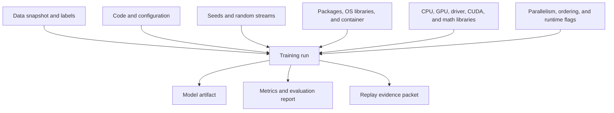
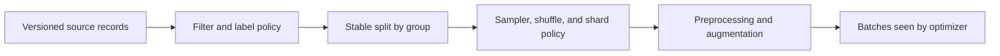
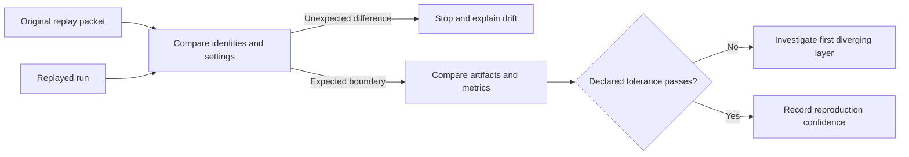

Two training runs can use the same `train.py` and produce different models. Data may arrive in a different order. A library may select another kernel. The container tag may point to a rebuilt image. A GPU architecture or driver may change floating-point behaviour. One worker may use an unseeded random generator.

**Reproducibility controls** make those inputs fixed or observable. Their purpose is not always to create an identical sequence of bytes on every machine forever. Their purpose is to make a result repeatable within a declared boundary and to make remaining differences explainable.

## Reproducibility Is A Layered Run Contract
<!-- section-summary: A training result depends on data, code, configuration, randomness, software, hardware, and execution order; each layer needs an identity or policy. -->

Use Vela Circuit Works, which trains a vision model to detect cracked solder joints. A June run must be compared with a July replay after false alarms rise on shiny circuit boards.



The contract has three kinds of control:

1. **Pin:** use an immutable identity, such as a data snapshot, code commit, lockfile, or container digest.
2. **Configure:** request a known behaviour, such as deterministic algorithms, worker count, thread count, or explicit random generators.
3. **Record:** capture conditions that cannot be made universal, such as GPU model, driver, library build, and scheduler topology.

A mutable tag such as `trainer:latest` is a name, not evidence. A package constraint such as `torch>=2` permits many environments. “Use the June dataset” is not an immutable data reference. The replay packet should point to exact content or a digest that can verify it.

## A Seed Controls A Random Stream
<!-- section-summary: A seed initializes one pseudo-random number generator; it does not automatically control every library, worker, process, device, or nondeterministic operation. -->

Machine-learning code uses **pseudo-random number generators (PRNGs)** for weight initialization, data shuffling, sampling, augmentation, dropout, and hyperparameter search. Given the same algorithm, initial state, and sequence of calls, a PRNG produces the same number stream. A **seed** helps construct that initial state.

The limitation is important: a process may contain several independent generators. Python, NumPy, PyTorch, an augmentation library, data-loader workers, and a distributed training framework can each own state. Seeding one global generator does not reach them all. Changing the number or order of random calls also changes later values even when the seed stays constant.

A small centralized function makes the intended scope visible:

```python
def configure_randomness(seed: int) -> None:
    random.seed(seed)
    np.random.seed(seed)
    torch.manual_seed(seed)
    torch.use_deterministic_algorithms(True)
```

This small function illustrates centralized configuration. A complete production policy also seeds local NumPy `Generator` objects, defines PyTorch data-loader worker behaviour, and gives distributed workers independent reproducible streams so they do not draw identical augmentations.

Prefer passing generator objects into components instead of relying only on mutable global state. Derive child streams from a recorded root seed and stable identifiers such as trial and worker number. Record the derivation rule. This preserves independence while allowing a failed sample or trial to be replayed.

Seeds are for statistical computation, not cryptographic security. Do not reuse ML PRNGs to create passwords, tokens, or signing keys.

## Determinism Is Broader Than Randomness
<!-- section-summary: A deterministic algorithm returns the same result for the same inputs in its supported environment; parallel floating-point execution and some accelerator kernels may not. -->

An operation can be nondeterministic without drawing a random number. Parallel threads may accumulate floating-point values in different orders. Because floating-point addition is not perfectly associative, tiny rounding differences can appear. During nonlinear optimization, those differences can grow into different weights.

Accelerator libraries choose algorithms based on shapes, hardware, benchmarking, and performance. Some operations use atomic updates or other parallel strategies whose execution order is not fixed. Framework deterministic modes select deterministic implementations where available and can raise errors when none exists.

Current PyTorch guidance explicitly says complete reproducibility is not guaranteed across releases, commits, platforms, or CPU versus GPU, even with identical seeds. It also notes that deterministic operations can be slower. That is why “set the seed” is an incomplete production promise.

Define the determinism boundary:

| Level | Intended guarantee | Typical use |
| --- | --- | --- |
| Exact replay | same supported environment and execution policy produce identical artifacts or tensors | unit tests, debugging a narrow failure |
| Numerical replay | outputs agree within specified numeric tolerance | export/runtime comparison, stable training checks |
| Statistical replay | repeated runs produce equivalent metric distributions | stochastic training and research claims |
| Decision replay | model meets the same product gates and conclusions | production replacement or audit |

Do not enable the strongest deterministic mode everywhere without measuring its cost. A useful strategy is strict determinism in tests and investigations, plus a production training mode that records nondeterministic settings and evaluates variance across several seeds.

## Data Identity Includes Order And Transformation
<!-- section-summary: The exact examples are only part of data reproducibility; splits, ordering, sampling, preprocessing, and label revisions also affect the run. -->

A data snapshot should identify content, not merely a path. Record dataset version or commit, manifest digest, source partitions, label revision, filtering query, split assignment, preprocessing graph, and feature definitions.

Order matters for stochastic optimization. The same rows in a different shuffle can lead to a different model. Distributed samplers divide data across workers; worker count, sharding, dropped final batches, and resume position can change which examples each update sees. Record sampler type, root and worker seeds, world size, batch size, gradient accumulation, shuffle policy, and checkpoint position.



Generated features need lineage to source data and transformation code. A feature table rebuilt under the same name can change after a bug fix. If training reads “latest,” the dataset is not replayable. Materialize or reference an immutable snapshot at run start, then record it before optimization begins.

## Pin Software By Content, Then Record Hardware
<!-- section-summary: Lockfiles and image digests constrain the software graph, while build provenance and hardware records explain what executed that graph. -->

A dependency lock resolves transitive package versions and, ideally, artifact hashes for a platform. It is stronger than a hand-written list of top-level libraries. Keep the installer and lockfile format version because resolver behaviour can change.

Containers capture user-space software, not the entire machine. Pin the image by digest, retain build provenance, and record the base image digest. The host kernel, container runtime, GPU driver, and attached accelerator remain outside the image. CUDA libraries can also be split between image and host compatibility layers.

For every run, capture:

- code commit and dirty-worktree status;
- configuration artifact and digest;
- dependency lock and resolved inventory;
- container image digest and build provenance;
- Python, framework, compiler, and key native-library versions;
- operating system, kernel, CPU architecture, and thread settings;
- GPU model, count, topology, driver, CUDA, cuDNN, and distributed backend;
- orchestrator, node pool, and resource request where scheduling matters.

Do not assume a container rebuild from the same Dockerfile is identical. Package repositories and base tags can move. Keep the built image or ensure every external input is content-addressed and still available.

## Distributed Runs Add Topology To The Contract
<!-- section-summary: Multi-process training depends on world size, rank assignment, collective libraries, batch partitioning, and checkpoint state as well as code and seeds. -->

Distributed training adds a **topology**, which describes how processes and devices divide the work. The same global batch size can produce a different update path when world size, per-worker batch size, gradient accumulation, sampler sharding, or reduction order changes. A retry scheduled on a different number of GPUs may therefore represent a changed experiment.

Checkpoint contents determine whether a resumed job continues the same training path. Model weights preserve learned parameters, while a faithful resume usually also needs optimizer state, learning-rate scheduler state, gradient-scaler state, epoch and step counters, sampler position, and the relevant random-generator states. Loading weights alone starts a related training run from a warm model; it does not continue every part of the interrupted computation.

The replay policy should state which topology changes are allowed. Exact debugging may require the same device count and software stack. A resilience test may deliberately resume on a different node while accepting numerical or statistical variation. The run record should preserve both the original and resumed topology so later comparison can explain the boundary.

| Distributed control | Evidence to capture | Failure when missing |
| --- | --- | --- |
| Process topology | world size, ranks, node and GPU mapping | data and reductions follow another order |
| Sampler state | shard policy, epoch, position, worker seeds | examples repeat or disappear after resume |
| Optimizer state | moments, step count, scheduler, scaler | learning dynamics restart from a different state |
| Communication stack | framework, backend, NCCL or equivalent version | collective behaviour and performance drift |
| Checkpoint lineage | parent checkpoint digest and resume event | investigators cannot tell a restart from a continuation |

This evidence also helps incident response. If a replay first diverges immediately after resume, investigators can inspect checkpoint completeness and sampler position before searching the entire software graph.

## Capture The Replay Packet At Run Start
<!-- section-summary: Reproduction evidence is most reliable when the pipeline validates and stores it before training, then adds outputs and comparisons after completion. -->

The pipeline should fail early when required identities are missing. Capture evidence before training so a crashed run remains diagnosable.

```yaml
run_id: pcb-defect-2026-07-16-0042
code:
  commit: 9c41e8a
  dirty: false
data:
  snapshot: lakefs://vision/pcb@9f4c2a1
  manifest_sha256: 67b2...
randomness:
  root_seed: 4815162342
  worker_derivation: seedsequence-v1
  deterministic_algorithms: true
software:
  lock_sha256: 10ac...
  image: registry.vela/pcb-trainer@sha256:81d3...
hardware:
  gpu: NVIDIA-L4
  count: 4
  driver: "..."
  distributed_world_size: 4
outputs:
  checkpoint_sha256: pending
  eval_report: pending
```

Secrets and personal data do not belong in this packet. Redact environment variables and command arguments. Store references to protected configuration, not credentials.

After training, add artifact digests, metric histories, evaluation results, logs, and checkpoint lineage. If the run resumes, record the exact checkpoint, optimizer and scheduler state, sampler position, and changed topology. Resuming only model weights is not the same experiment as resuming the complete training state.

## Compare Within A Declared Tolerance
<!-- section-summary: A replay succeeds according to an explicit exact, numerical, statistical, or product decision criterion rather than a vague expectation that metrics look close. -->



Define the acceptance rule before looking at results. An exact unit test may compare tensors byte for byte. Numerical parity may use relative and absolute tolerances. A stochastic training study may compare mean, variance, and confidence intervals across seeds. A production replay may require every safety-critical slice and release gate to pass.

Track both expected variability and unexpected drift. If a GPU family changed under a statistical reproducibility policy, record it as an allowed boundary. If the data digest changed, the run is not a replay of the same data even when final accuracy happens to match.

Begin investigation at the first differing layer: data and split, code and config, random-stream policy, software inventory, hardware/runtime, then training trace. This is faster than adjusting seeds until metrics look familiar.


*The same training file sits beside hidden inputs such as data order, dependency resolution, image digest, and accelerator runtime, so the run record must preserve the whole contract.*

## Reproduce Honestly
<!-- section-summary: Good reproducibility fixes what can be fixed, records what cannot, and states the environment and tolerance under which the result is expected to hold. -->

A seed is one control inside a larger system. Pin data, code, configuration, dependency resolution, and container content. Configure every relevant random stream and deterministic policy. Record hardware, drivers, parallel topology, and runtime details. Capture the packet before work begins and compare the replay under a declared tolerance.

That does not promise that every future platform will emit identical bits. It gives the team a defensible statement about what was repeated, what changed, and why the result should be considered the same—or not.

## References

- [PyTorch reproducibility notes](https://docs.pytorch.org/docs/stable/notes/randomness.html)
- [PyTorch deterministic algorithms](https://docs.pytorch.org/docs/stable/generated/torch.use_deterministic_algorithms.html)
- [NumPy random sampling](https://numpy.org/doc/stable/reference/random/index.html)
- [NumPy random compatibility policy](https://numpy.org/doc/stable/reference/random/compatibility.html)
- [scikit-learn common pitfalls](https://scikit-learn.org/stable/common_pitfalls.html)
- [MLflow dataset tracking](https://mlflow.org/docs/latest/ml/dataset/)
- [DVC data versioning](https://dvc.org/doc/start/data-management/data-versioning)
- [lakeFS data versioning model](https://docs.lakefs.io/latest/understand/model/)
- [Docker image digests](https://docs.docker.com/dhi/core-concepts/digests/)
- [SLSA provenance](https://slsa.dev/spec/v1.2/provenance)
- [conda-lock](https://conda.github.io/conda-lock/)
