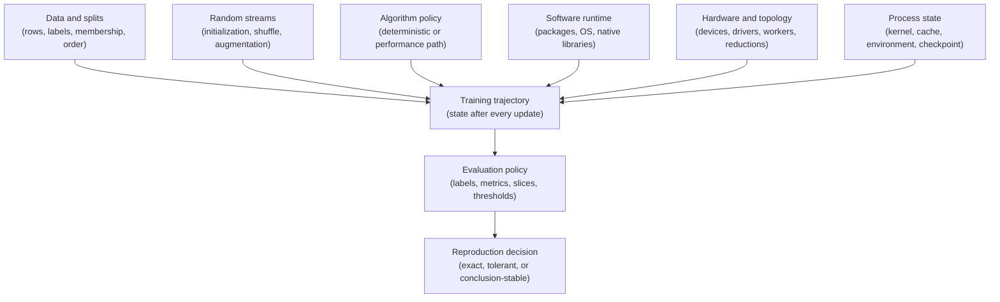
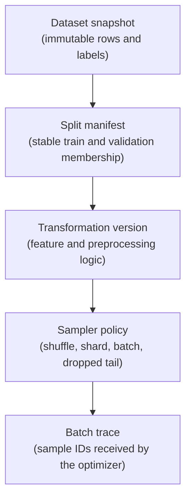
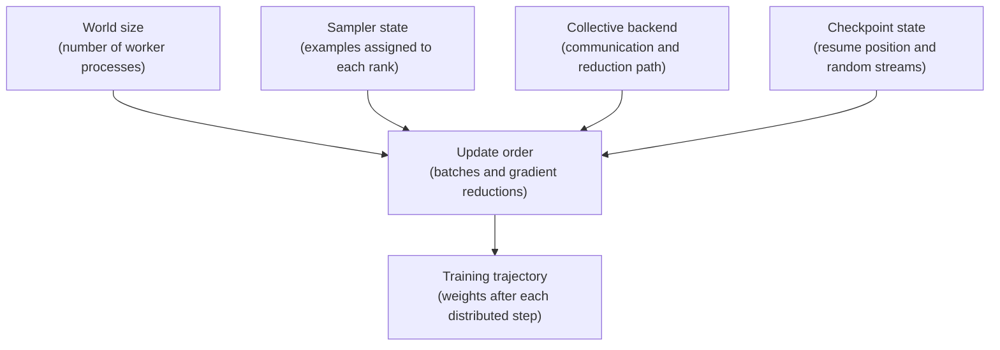
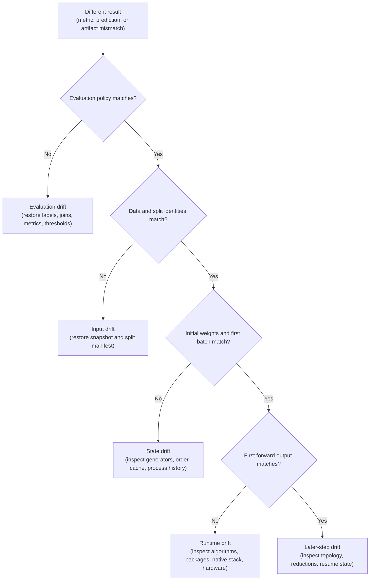

## Table of Contents

1. [The Same Command Can Produce a Different Run](#the-same-command-can-produce-a-different-run)
2. [Find The First Step Where The Runs Differ](#find-the-first-step-where-the-runs-differ)
3. [Compare The Training Data And Split Membership](#compare-the-training-data-and-split-membership)
4. [Understand What A Random Seed Controls](#understand-what-a-random-seed-controls)
5. [Use Deterministic Algorithms Where Exact Replays Matter](#use-deterministic-algorithms-where-exact-replays-matter)
6. [Record Python Packages And Native Runtime Libraries](#record-python-packages-and-native-runtime-libraries)
7. [Record Hardware And Numerical Precision](#record-hardware-and-numerical-precision)
8. [Record Distributed Training Topology And Execution Order](#record-distributed-training-topology-and-execution-order)
9. [Run Reproduction Tests In A Clean Process](#run-reproduction-tests-in-a-clean-process)
10. [Keep The Evaluation Pipeline Fixed](#keep-the-evaluation-pipeline-fixed)
11. [Investigate The Earliest Causes First](#investigate-the-earliest-causes-first)
12. [Choose How Closely The Reproduced Result Must Match](#choose-how-closely-the-reproduced-result-must-match)
13. [Main Idea](#main-idea)
14. [References](#references)

## The Same Command Can Produce a Different Run
<!-- section-summary: Repeated training diverges because the command is only one input to a stateful numerical process. -->

An ML engineer runs the same checkout-fraud training command twice from the same Git commit. The first run reaches 82 percent recall while staying under the product's false-positive limit. The second reaches 77 percent recall and fails the release gate. Both logs print the same seed. A release review is due that afternoon, so the engineer must decide whether the candidate is trustworthy or whether the difference exposes a broken experiment. Approving the weaker result could miss fraudulent payments; rejecting a healthy candidate delays a useful protection.

At a high level, **training reproducibility is the ability to repeat a declared computation and explain any remaining difference.** The word *declared* matters. A training command names the program, while the result also depends on the data rows, split membership, random-number streams, algorithm implementations, installed libraries, native runtime, hardware, process history, parallel execution, and evaluation policy.

Training is stateful because each optimization step depends on the steps before it. A changed first batch creates a changed gradient. That gradient creates changed weights, which alter the next gradient. A tiny numerical difference can therefore grow across thousands of updates. Comparing only the final metric reveals that the runs differ; it gives no clue where the paths separated.

The practical goal is to find the **first divergence**: the earliest point at which two runs receive different inputs or produce different state. The first divergence identifies the responsible layer and prevents a team from changing seeds, thresholds, or packages at random until a familiar metric appears.

## Find The First Step Where The Runs Differ
<!-- section-summary: A layered view connects every source of run drift to a control and to the earliest evidence that can reveal it. -->

A training run passes through a stack of conditions around one optimization process. The upper layers define what should be computed. Lower layers determine how that computation executes. Evaluation interprets the result at the end.


```mermaid
flowchart TD
    A["Data and splits<br/>(rows, labels, membership, order)"] --> R["Training trajectory<br/>(state after every update)"]
    B["Random streams<br/>(initialization, shuffle, augmentation)"] --> R
    C["Algorithm policy<br/>(deterministic or performance path)"] --> R
    D["Software runtime<br/>(packages, OS, native libraries)"] --> R
    E["Hardware and topology<br/>(devices, drivers, workers, reductions)"] --> R
    F["Process state<br/>(kernel, cache, environment, checkpoint)"] --> R
    R --> G["Evaluation policy<br/>(labels, metrics, slices, thresholds)"]
    G --> H["Reproduction decision<br/>(exact, tolerant, or conclusion-stable)"]
```

Some layers have immutable identities that the run can **pin**. Dataset snapshots, split manifests, code commits, lockfiles, and container digests belong in this group.

Runtime behaviour needs explicit **configuration**. The training job sets its random generators, deterministic algorithm policy, thread counts, and worker topology before optimization starts.

Conditions outside the portable artifact need a **record**. The host kernel, GPU model, driver, collective-library version, and scheduler placement explain the machine that executed the pinned software.

The diagnostic evidence should be close to the layer it describes. A dataset manifest proves row identity. The first batch of record IDs proves sampler order. A hash of initialized weights checks model initialization. Early logits and losses show whether the numerical path has separated. A versioned evaluator proves that the same outputs received the same interpretation.

## Compare The Training Data And Split Membership
<!-- section-summary: Reproducible training fixes the rows, labels, split membership, transformations, and sample order presented to the optimizer. -->

Two queries can use the same SQL text and return different training data. New events arrive, labels are corrected, duplicated records are removed, and an upstream table is rebuilt. A path called `training/current` or a table read without a snapshot describes a moving population.

### Keep Training Rows And Split Membership Fixed

The first control is an immutable data identity: a table version, snapshot ID, commit, or content manifest that can recover the same source rows. The training record should also preserve the filtering and feature code, label definition, allowed observation time, and any upstream artifact versions. A snapshot protects the data state; it cannot repair a changed transformation.

Split membership needs its own identity. Re-running `train_test_split` after rows were inserted can move examples between training and validation even with the same seed. A stable split can hash an entity identifier into a bucket or store an explicit manifest of example IDs.

A grouped split records the group key so related rows cannot leak across training and validation. A time-based split records the cutoff, timezone, exclusion window, and late-data policy. These fields let a replay rebuild the same boundary after the source table receives newer records.

### Record The Order Of Training Examples

Order matters after membership is fixed. Stochastic gradient methods update the model batch by batch, so a changed shuffle or shard order changes the optimization path. Record the sampler type, seed, batch size, dropped-tail policy, worker count, and the first sample IDs for each epoch. Augmentation belongs here too: the stored image may match while a random crop presented to the model differs.


```mermaid
flowchart TD
    A["Dataset snapshot<br/>(immutable rows and labels)"] --> B["Split manifest<br/>(stable train and validation membership)"]
    B --> C["Transformation version<br/>(feature and preprocessing logic)"]
    C --> D["Sampler policy<br/>(shuffle, shard, batch, dropped tail)"]
    D --> E["Batch trace<br/>(sample IDs received by the optimizer)"]
```

Suppose a nightly retraining job reads a fraud-label table without a version. A label correction lands between two runs, moving several transactions into the positive class. The release owner sees a recall change before the morning promotion window and may blame model randomness. Comparing the dataset snapshot and split-manifest hashes exposes the changed population before anyone modifies the training code. The repair is to bind the run to a recoverable table version, rebuild the split manifest from that version, and verify the first batch IDs against the original trace.

## Understand What A Random Seed Controls
<!-- section-summary: A seed initializes a pseudorandom generator; reproducibility also requires the same generator, call order, and independently controlled worker streams. -->

A computer usually creates training randomness with a **pseudorandom number generator**, or **PRNG**. The generator holds an internal state. A seed initializes that state. The same generator algorithm, starting state, and sequence of calls produce the same stream of values.

### Account For Multiple Random Streams In One Process

That definition explains both the value and the limit of a seed. Weight initialization, shuffling, dropout, augmentation, sampling, and hyperparameter search may use separate generators. Python, NumPy, PyTorch, data-loader workers, and third-party libraries can each own one. An extra random call during debugging shifts every later value from that stream. A library upgrade may also change the generator or how an operation consumes it.

### Give Each Worker Its Own Reproducible Seed

For parallel work, independent streams are important. Giving every worker the same copied NumPy state can make several workers apply identical augmentations. Giving workers unrecorded entropy prevents replay. A recorded root seed plus a stable derivation rule produces separate, recoverable worker or trial streams.

This PyTorch setup is appropriate for a strict replay or diagnostic run. It seeds Python, NumPy's legacy global generator, PyTorch, and the data-loader workers. The explicit `torch.Generator` controls shuffle order.

```python
import random

import numpy as np
import torch
from torch.utils.data import DataLoader

SEED = 731

def seed_worker(worker_id: int) -> None:
    worker_seed = torch.initial_seed() % 2**32
    random.seed(worker_seed)
    np.random.seed(worker_seed)

torch.manual_seed(SEED)
torch.use_deterministic_algorithms(True)
torch.backends.cudnn.benchmark = False

loader = DataLoader(
    train_dataset,
    shuffle=True,
    num_workers=4,
    worker_init_fn=seed_worker,
    generator=torch.Generator().manual_seed(SEED),
)
```

`torch.manual_seed` seeds PyTorch's generator across CPU and CUDA devices. The data loader derives a PyTorch seed for each worker; `worker_init_fn` carries that seed into Python and NumPy code running inside the worker. A separately created NumPy `Generator`, such as `np.random.default_rng()`, still needs an explicit seed or `SeedSequence` because `np.random.seed` controls only the legacy global generator.

The proof should come from observed state. Record the root seed and derivation policy, then compare initialized-weight hashes, the first shuffled sample IDs, and the first augmented batch. Equal final seeds with different first-batch hashes point toward a missing generator or a changed call sequence.

## Use Deterministic Algorithms Where Exact Replays Matter
<!-- section-summary: Framework determinism selects repeatable implementations where available and reports operations that cannot satisfy the requested policy. -->

Random numbers are one source of variation. Parallel numerical algorithms create another. A GPU may add thousands of values through many threads. Floating-point addition has limited precision and depends on operation order, so different reduction orders can produce slightly different results even though the mathematical expression is equivalent.

Frameworks often choose kernels through benchmarking or performance heuristics. The fastest implementation may use an execution order that varies. A deterministic mode requests repeatable implementations for the same supported inputs, software, and hardware. An unsupported operation can then fail explicitly and identify the hidden source.

PyTorch provides `torch.use_deterministic_algorithms(True)`. It selects deterministic alternatives for supported operations and raises a `RuntimeError` for known operations without one. Disabling cuDNN benchmarking prevents benchmark noise from selecting another convolution algorithm. PyTorch limits reproducibility guarantees to a specific release, platform, and device path; CPU and GPU results can differ.

TensorFlow exposes the same policy in a compact form:

```python
tf.keras.utils.set_random_seed(731)
tf.config.experimental.enable_op_determinism()
```

`set_random_seed` configures Python, NumPy, and TensorFlow seeds. `enable_op_determinism` requests deterministic TensorFlow operations and deterministic `tf.data` behaviour. Some input transformations may run serially, and unsupported operations can raise `UnimplementedError`. The strict mode can therefore reduce throughput substantially.

Use strict determinism for regression tests, incident reproduction, and narrow comparisons where exactness matters. A throughput-oriented production training mode may permit faster algorithms after the team measures variation across several seeds, records every runtime setting, and defines a numerical or product-level acceptance policy. This makes the tradeoff explicit: strict mode improves diagnosis, while performance mode accepts measured variability.

## Record Python Packages And Native Runtime Libraries
<!-- section-summary: A lockfile fixes the Python resolution, an image digest fixes user-space content, and a runtime manifest exposes native components outside those boundaries. -->

Source code can stay unchanged while its imported behaviour changes. A broad requirement such as `torch>=2` permits different framework builds. A transitive dependency may update preprocessing, serialization, or metrics. Binary wheels may link to different native libraries on different platforms.

### Lock Python Dependencies And Verify The Lockfile

A dependency lock records the resolved package graph. With uv, `uv.lock` contains exact resolved versions and belongs in version control. The `--locked` option rejects a stale or missing lock and leaves it unchanged. The `--frozen` option trusts the existing lock without checking whether project metadata still agrees with it. That distinction matters in CI: freshness validation protects a reviewed build, while frozen behaviour is useful only when the caller intentionally trusts the recorded lock.

```bash
uv lock --check
uv sync --locked
uv run --locked python -m training.run
uv export --frozen --format cyclonedx1.5 > dependencies.cdx.json
```

`uv sync` performs an exact synchronization by default, so undeclared packages are removed from the project environment. Running `uv run` alone uses an inexact sync by default and can leave unrelated packages present. A clean build job should synchronize first, save the lock digest and resolved inventory, then launch training from that environment.

Python packages are only one layer. The operating system, C runtime, BLAS implementation, compiler-built framework options, CUDA user-space libraries, and environment variables can change numerical behaviour. For PyTorch, `torch.__config__.show()` records useful build configuration.

An **environment manifest** is the structured snapshot used to compare those runtime conditions across runs. Generate it at job startup from the running environment and attach it to the run. The exact schema can vary, although the diagnostic identities should be explicit:

```yaml
environment:
  uv_lock_sha256: "<sha256>"
  image_digest: "sha256:<digest>"
  python: "<version>"
  framework_build_sha256: "<torch-config-output-digest>"
  os_kernel: "<name-and-version>"
  accelerator: "<model-and-count>"
  driver: "<version>"
  distributed: "<backend-and-world-size>"
```

Keep the full generated files too: the dependency inventory, framework build output, OS details, and accelerator report. The compact manifest supplies comparison keys; the attached files provide the evidence needed after one key differs.

### Pin The Container Image By Digest

A container packages much of this user-space environment. Tags remain movable: rebuilding `trainer:reviewed` can point the same name at new content. An image digest is a SHA-256 identity for immutable image content.

```bash
docker buildx imagetools inspect registry.example/trainer:reviewed
docker pull registry.example/trainer@sha256:4be93e9b0ad86950868696a9e30edc8309b86ac48f7c7136f7a0a3df41fd6d80
```

Multi-platform images have an index digest plus a digest for each platform variant. Record the variant that actually ran. Keep the built image and its provenance; rebuilding the same Dockerfile can resolve new base images or package content.

## Record Hardware And Numerical Precision
<!-- section-summary: The container stops at user space, while the host, accelerator, driver, and precision policy still shape numerical execution. -->

The same image can run on a CPU, one GPU family, or another GPU family. Those devices may use different kernels, instruction sets, reduction strategies, and precision paths. The host kernel, container runtime, GPU driver, and attached accelerator also sit outside the image.

This is why an environment record includes the GPU or accelerator model, count, topology, driver, CUDA runtime, cuDNN or equivalent library, distributed backend, CPU architecture, and thread configuration. Mixed-precision policy and matrix-multiplication precision deserve explicit fields because faster reduced-precision paths can change the numerical boundary.

Hardware variation is often legitimate. A team may need to validate a new accelerator before migrating training. Label that work as a portability study. Keep the data, code, evaluation, and other controls fixed; compare predictions and product gates under a declared tolerance; record the hardware change as an experimental variable.

Suppose an ML platform team moves a ranking model from one GPU generation to another before a scheduled capacity migration. The same container produces slightly different logits, although ranking quality remains stable. The team compares per-query score differences, ranking metrics, latency, and important segment guardrails before approving the new pool. A failed guardrail blocks the migration even if the average metric remains close. The observed outcome is a documented hardware compatibility result with measured numerical bounds.

## Record Distributed Training Topology And Execution Order
<!-- section-summary: Worker count, sharding, collective order, and checkpoint state alter the sequence of batches and numerical reductions. -->

Distributed training divides work across processes called **ranks**. The **world size** is the total number of ranks. Each rank sees a data shard, computes gradients, and participates in collective operations that combine those gradients.

### Understand How Topology Changes Model Updates

Changing world size changes more than capacity. It can alter sample assignment, per-rank batch size, dropped-tail handling, gradient accumulation, and reduction order. The same global batch size can therefore follow a different numerical path. PyTorch DistributedDataParallel also relies on the application to shard inputs, commonly through a `DistributedSampler`; the sampler epoch and seed must stay aligned across ranks.


```mermaid
flowchart TD
    A["World size<br/>(number of worker processes)"] --> E["Update order<br/>(batches and gradient reductions)"]
    B["Sampler state<br/>(examples assigned to each rank)"] --> E
    C["Collective backend<br/>(communication and reduction path)"] --> E
    D["Checkpoint state<br/>(resume position and random streams)"] --> E
    E --> F["Training trajectory<br/>(weights after each distributed step)"]
```

### Restore The Full Training State From A Checkpoint

A faithful resume needs more than model weights. Optimizer moments, the learning-rate scheduler, and the gradient scaler preserve the update rule. Epoch and step counters, sampler position, and random-generator states preserve the job's position in that rule. The parent checkpoint digest connects the resumed run to the exact state it loaded.

Loading weights alone starts a related run from a warm model. The original optimizer, sampler position, and random state are then absent.

Consider a training job interrupted after epoch three. The retry receives four GPUs after the original used eight. The pipeline owner must decide whether to meet the release window by continuing or to preserve exact replay. A four-GPU resume may change shard and reduction order, so the safe record marks it as a changed-topology recovery run. Recovery succeeds after the resumed run passes the declared tolerance and product gates; an exact investigation waits for the original topology or restarts from the beginning.

## Run Reproduction Tests In A Clean Process
<!-- section-summary: Fresh jobs replace notebook history, mutable globals, caches, and implicit resume behaviour with explicit inputs. -->

A notebook cell can show identical code while reading different in-memory state. An earlier cell may have filtered a DataFrame in place, changed a global seed, reloaded a module, installed a package, or populated a cache. Re-running the training cell continues from that history.

Long-lived Python processes have similar risks. Module globals, singleton clients, current working directory, locale, timezone, environment variables, temporary files, and automatically discovered checkpoints can all affect behaviour. A cache key that omits the data snapshot may return features from another run.

Production training should launch in a fresh process from an explicit entrypoint. The job checks out a recorded commit, loads a resolved configuration, synchronizes a locked environment, reads immutable data references, and receives an explicit checkpoint argument. Caches use content-based keys and a clean job workspace. The pipeline records an allowlist of non-secret environment settings; credentials remain in the secret system and never enter the run evidence.

Notebook work still has a useful verification step: restart the kernel and run all cells from top to bottom. The production proof is stronger. Export the discovered logic into importable modules, call it through the same job entrypoint used by automation, and compare the input and early-state fingerprints with the notebook run.

For example, a data scientist tests an image model after several interactive preprocessing experiments. The current notebook kernel contains an old normalization object, so a later training cell uses different statistics from a clean job. The engineer responsible for packaging sees different first-batch hashes before the candidate review. Without that check, reviewers would compare candidates trained on different inputs. Moving normalization into versioned code and starting a fresh process produces matching batch hashes and removes the hidden dependency.

## Keep The Evaluation Pipeline Fixed
<!-- section-summary: Identical model outputs can receive different scores after labels, cohorts, joins, thresholds, or metric implementations change. -->

A reproduction can train the same model and still report a different result because evaluation changed. The evaluator has its own data, code, and release rules.

The data identity covers the evaluation snapshot and label-availability cutoff. The join policy defines the prediction and outcome keys, duplicate handling, and required coverage. These controls prevent missing or repeated outcomes from quietly changing the score.

The evaluator identity covers metric code and library versions. The release policy preserves the score threshold, required slices, baseline, and final decision rule. Together, these records let the same predictions receive the same interpretation.

Consider a payment-fraud release review. The original protocol waits until chargeback labels have matured for thirty days. A replay uses labels only seven days old, so many fraudulent payments still appear legitimate and the candidate seems safer than it is. The release owner must decide before traffic expands. Recomputing both models on the original maturity window and checking join coverage restores a fair comparison. Success means the same predictions receive the same evaluation policy and every release guardrail is assessed from mature outcomes.

Evaluation drift has a distinctive signature: prediction hashes match, while metrics differ. That observation sends the investigation to labels, joins, metric code, or thresholds and avoids unnecessary retraining.

## Investigate The Earliest Causes First
<!-- section-summary: Layer fingerprints narrow a final mismatch to the first different input, state, operation, or evaluation rule. -->

Preserve both runs before investigating. Overwriting a failed run removes the evidence needed to compare it. Then confirm the reproduction target: exact execution in one fixed environment, numerical agreement across an allowed boundary, or the same product conclusion.

A useful investigation works backward from the visible mismatch while comparing evidence from the earliest possible checkpoints. Matching final metrics can hide different run paths, while different final metrics reveal only the symptom. The sequence must test one boundary at a time.

First decide whether the difference came from interpretation or computation. Matching prediction hashes with different metrics point to evaluation. Different data or split identities show that training received another population. If those identities match, initialized weights, transformed batches, and early outputs reveal whether the path separated in randomness, hidden state, the numerical runtime, or later distributed execution.


```mermaid
flowchart TD
    A["Different result<br/>(metric, prediction, or artifact mismatch)"] --> B{"Evaluation policy matches?"}
    B -->|No| C["Evaluation drift<br/>(restore labels, joins, metrics, thresholds)"]
    B -->|Yes| D{"Data and split identities match?"}
    D -->|No| E["Input drift<br/>(restore snapshot and split manifest)"]
    D -->|Yes| F{"Initial weights and first batch match?"}
    F -->|No| G["State drift<br/>(inspect generators, order, cache, process history)"]
    F -->|Yes| H{"First forward output matches?"}
    H -->|No| I["Runtime drift<br/>(inspect algorithms, packages, native stack, hardware)"]
    H -->|Yes| J["Later-step drift<br/>(inspect topology, reductions, resume state)"]
```

### Compare Data, Code, And Environment Identities First

Start with identities because they are cheap and decisive. Compare the evaluation protocol, dataset snapshot, split manifest, code commit, resolved configuration, lock digest, and image digest. Then compare hardware and topology. An unexpected identity mismatch means the runs are different experiments. Restore the original condition or label the comparison as a migration study.

### Compare The First Training Steps

If identities match, compare state at small checkpoints:

1. ordered sample IDs for the first batches;
2. transformed batch hash after augmentation;
3. initialized model-weight hash;
4. first forward outputs and loss;
5. gradients and optimizer state after the first update;
6. checkpoint state after each epoch;
7. final prediction hashes before evaluation.

The earliest mismatch maps to a short list of causes. Equal sample IDs with a different transformed batch point to augmentation randomness or preprocessing. Equal batch and initialized weights with different logits point to the numerical runtime or hardware. Stable single-device execution with multi-device drift points toward sharding, collective order, or topology. A mismatch appearing immediately after resume points toward incomplete checkpoint or sampler state. Equal predictions with different metrics point to the evaluator.

After repairing the responsible layer, rerun from a clean environment and prove that the first divergence has disappeared. Avoid changing several controls together; a bundle of fixes can make the symptom vanish without revealing the cause.

## Choose How Closely The Reproduced Result Must Match
<!-- section-summary: A reproduction policy states which identities must match, which outputs allow tolerance, and which product decision must remain unchanged. -->

Exact equality is useful for narrow regression tests in one supported environment. Dataset and split identities, code, configuration, locks, and image digests should usually match exactly. Selected tensors or predictions may also match exactly under a fixed deterministic runtime.

**Numerical reproduction** accepts bounded floating-point differences. Use both absolute tolerance, which limits difference near zero, and relative tolerance, which scales with the value. Set bounds from the purpose and known numerical behaviour before seeing replay results. A tolerance wide enough to accept any observed output provides no evidence.

**Conclusion-stable reproduction** asks whether the run supports the same decision. A metric can move slightly while the candidate still clears every release gate. The reverse also matters: a small average change can cross a safety threshold for one important segment. Product guardrails remain mandatory even if aggregate metrics satisfy numerical tolerance.

A compact policy makes these boundaries reviewable:

```yaml
reproduction:
  exact_identities:
    - dataset_snapshot
    - split_manifest
    - code_commit
    - uv_lock_sha256
    - image_digest
  numerical_checks:
    prediction_atol: 1.0e-6
    prediction_rtol: 1.0e-5
    auc_absolute_change: 0.002
  decision_checks:
    minimum_recall: 0.80
    maximum_false_positive_rate: 0.015
    all_required_segments_must_pass: true
```

Statistically variable training may need several seeded runs. Compare distributions and confidence intervals under the same protocol, then apply the product gates to the declared aggregation rule. A single lucky seed cannot establish a stable result.

The reproduction report should state the matched identities, allowed changes, first observed divergence, tolerance results, product conclusion, and owner who accepted any exception. That record turns “close enough” into an auditable engineering decision.

## Main Idea
<!-- section-summary: Reproducibility comes from controlling every layer that can alter the training path and diagnosing the earliest difference. -->

A repeated command is only the outer shell of a repeated experiment. Data and splits define the population. Seeds define recoverable random streams. Deterministic modes constrain algorithm choice. Locks and image digests constrain software. Hardware, topology, process state, and evaluation policy complete the boundary.

Strong reproducibility work finds the first divergence and repairs that layer. It also states the level of agreement the product requires. Some checks demand exact identity, some permit measured numerical tolerance, and production decisions require every important guardrail to remain valid.

The operating habit matters as much as any individual flag. Preserve both runs, compare immutable identities, inspect early state, and change one control at a time. The result is a clear explanation of why two runs matched, why they differed, and whether the difference changes the decision the model supports.

## References

- [PyTorch: Reproducibility](https://docs.pytorch.org/docs/stable/notes/randomness.html)
- [PyTorch: `torch.use_deterministic_algorithms`](https://docs.pytorch.org/docs/stable/generated/torch.use_deterministic_algorithms.html)
- [PyTorch: Data loading and worker randomness](https://docs.pytorch.org/docs/stable/data.html)
- [PyTorch: Numerical accuracy](https://docs.pytorch.org/docs/stable/notes/numerical_accuracy.html)
- [PyTorch: Build configuration](https://docs.pytorch.org/docs/stable/config_mod.html)
- [PyTorch: Distributed communication package](https://docs.pytorch.org/docs/stable/distributed.html)
- [TensorFlow: Enable operation determinism](https://www.tensorflow.org/api_docs/python/tf/config/experimental/enable_op_determinism)
- [NumPy: Random sampling](https://numpy.org/doc/stable/reference/random/)
- [uv: Locking and syncing](https://docs.astral.sh/uv/concepts/projects/sync/)
- [uv: Project structure and lockfiles](https://docs.astral.sh/uv/concepts/projects/layout/)
- [Docker: Image digests](https://docs.docker.com/dhi/core-concepts/digests/)
