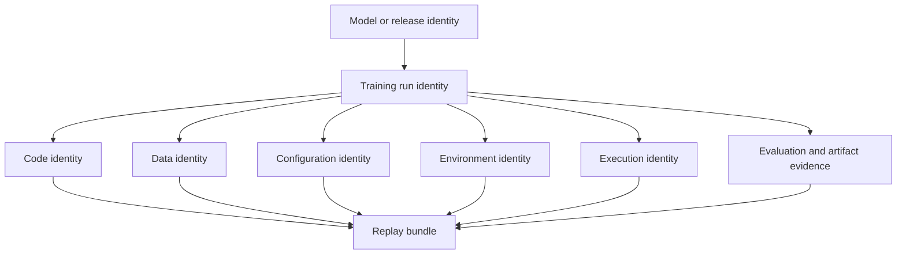
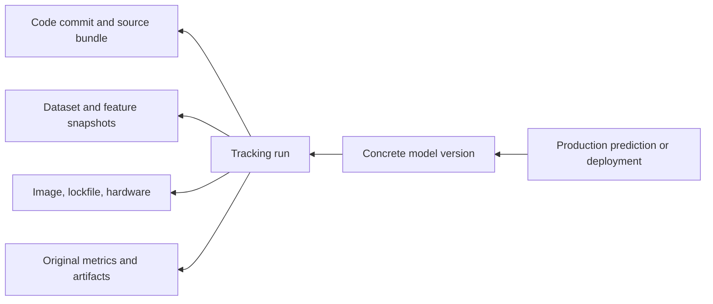

To **reproduce an old training run**, a team reconstructs the conditions that produced a model, executes an equivalent training process when needed, and compares the result with recorded evidence. The work starts from a model or run identity. It does not start by running the current training script and hoping for a similar metric.

Reproduction is valuable during incident investigation, audit, migration, scientific review, and platform change. It answers questions such as: Which data created the model that served this prediction? Can the old training path still run? Does a new environment preserve accepted behaviour? Which missing record prevents a confident explanation?

## Define What “Reproduce” Means For The Question
<!-- section-summary: Exact replay, functional reproduction, and forensic reconstruction have different success criteria and evidence requirements. -->

Teams use the word *reproduce* for several goals:

| Goal | Main question | Reasonable success condition |
| --- | --- | --- |
| **Exact replay** | Can the same ingredients create the same bytes? | Identical artifact hash where the stack is deterministic |
| **Numerical reproduction** | Can the same process create equivalent numerical results? | Metrics and predictions within declared tolerances |
| **Functional reproduction** | Does a rebuilt system preserve approved behaviour? | Contract, cohort, robustness, latency, and outcome gates pass |
| **Forensic reconstruction** | Can we explain what most likely produced the old model? | Evidence chain is complete enough to support the investigation |

Bit-for-bit identity is sometimes possible for deterministic preprocessing or packaging. Training on accelerators can remain nondeterministic even with the same seeds and software. A hardware or library change may alter floating-point order. PyTorch explicitly warns that complete reproducibility is not guaranteed across releases, platforms, or CPU and GPU execution.

The success contract must therefore come before the replay. An audit may require the original artifact hash and provenance. A platform migration may care about prediction equivalence and cohort metrics. An incident may only need to prove that the production model used an outdated data snapshot.

## The Reproducibility Bundle Has Seven Identities
<!-- section-summary: A replayable run records model, code, data, configuration, environment, execution, and evidence identities as one bundle. -->



### Model and run identity

Start from the object that production actually used: a registry model version, deployment manifest, artifact digest, or release record. That object should link to the training run. An experiment name is too broad; it may contain hundreds of runs.

### Code identity

Record the repository, immutable commit, training entry point, and any generated or vendored code. A Git commit does not capture uncommitted notebook cells or a package downloaded dynamically during the run. Store the submitted source bundle or a hash when the platform supports it.

### Data identity

Record the exact training, validation, and test snapshots. A table name or object-store folder can move. Strong identities include an immutable lakeFS commit, DVC content reference, table snapshot or time-travel version, object manifest with checksums, or a dataset registry version.

Also capture the transformation contract. Raw-data identity alone cannot reproduce features if query text, feature code, reference data, join windows, or label cut-off rules changed.

### Configuration identity

Parameters include model hyperparameters and system choices: split boundaries, feature lists, target definition, early stopping, seed values, batch size, precision mode, checkpoint policy, and resource topology. Preserve the resolved configuration after defaults and overrides, not only the source file.

### Environment identity

Record the container image digest, operating system, language version, dependency lock, ML and accelerator libraries, and relevant environment variables. A mutable image tag such as `trainer:latest` is a label, not an environment identity.

### Execution identity

Record hardware class, worker count, region, distributed topology, random controls, and runtime flags. For distributed training, collective algorithms and worker count can affect results. For managed services, keep the submitted job specification and provider job ID.

### Evidence identity

Preserve metrics, cohort reports, predictions on a stable comparison set, feature schema, logs, plots, checkpoints, final model artifact, and their hashes. These records define what the replay will compare.

## Follow The Chain Backward From Production
<!-- section-summary: The safest investigation starts with the served model and traces lineage backward to the run and its ingredients. -->



This direction matters. Starting from a current branch can reproduce today's pipeline while telling you little about the model under investigation. The production record should reveal a concrete model version. The registry version should reveal its source run and artifact. The tracking run should reveal the remaining ingredients.

Useful systems split the evidence across several stores:

| Store | Expected evidence |
| --- | --- |
| Deployment or prediction record | loaded model version, release ID, timestamp |
| Model registry | concrete version, artifact URI, run link, approval |
| Experiment tracker | parameters, metrics, tags, artifacts, dataset inputs |
| Source control | immutable commit and build definition |
| Data version system | snapshot identity and manifest |
| Image registry | container digest and provenance |
| Orchestrator or compute platform | submitted job spec, hardware, logs, state |

The chain should be traversable by identity, not by guessing from timestamps and filenames. Missing links are findings. Do not silently substitute the nearest available run.

## Assemble A Replay Bundle Before Starting Compute
<!-- section-summary: A replay bundle freezes recovered identities, expected evidence, known gaps, and the planned comparison before training starts. -->

A compact, human-readable manifest can coordinate the work:

```yaml
replay_id: demand-v27-replay-2026-07-16
target:
  registered_model: demand-forecast
  model_version: "27"
  original_run_id: demand-2026-05-31-0315
ingredients:
  code_commit: 4f2c8d1
  dataset_snapshot: lakefs://demand-lake/forecasting@7a91cf2
  resolved_config_artifact: artifacts://demand-2026-05-31-0315/config.yml
  image_digest: registry.example.com/demand-trainer@sha256:8e73...
  hardware: nvidia-a10g-1x
  seed: 1407
comparison:
  stable_dataset: demand-eval-2026-05-31
  primary_metric: wape
  metric_tolerance: 0.002
  prediction_max_abs_delta: 0.01
known_gaps: []
```

The manifest separates the **target** from the **replay**. The replay receives a new identity and should never overwrite the original run. It also declares comparison rules before results are visible, which prevents convenient tolerances from being chosen afterward.

Verify the bundle before launching expensive work:

- Can the code commit and source bundle still be retrieved?
- Does the dataset snapshot resolve, and do row counts and checksums match recorded evidence?
- Can the image be pulled by digest?
- Does the resolved configuration exist?
- Are the original metrics and comparison predictions available?
- Does the chosen platform still support the hardware and runtime?
- Are secrets and external dependencies replaced with approved replay access?

A replay should avoid live mutable dependencies. If preprocessing reads a current exchange-rate table or feature definition, pin the old version or record that exact replay is impossible.

## Rebuild In Layers So Failures Stay Explainable
<!-- section-summary: Recover data, code, environment, and execution separately before combining them into the replay run. -->

Reconstruction is easier when each layer is verified independently.

### Verify code and configuration

Check out the immutable commit in a separate workspace and compare the stored resolved configuration with the files at that commit. If the original run used uncommitted code, record the gap. Avoid editing the old commit to make it run on a new platform; create a documented compatibility patch and treat the result as a modified replay.

### Verify the dataset

Resolve the snapshot and compare schema, row count, date range, label distribution, important cohort counts, and content checksums where feasible. The row count alone is weak: rows can change while the count stays constant.

Feature computation must preserve point-in-time rules. Rebuilding from today's corrected source data can remove the very condition under investigation. Keep separate paths for “as recorded then” and “corrected now.”

### Verify the environment

Pull the original image by digest. If it is unavailable, rebuild from the old definition and lockfiles. Label that result **reconstructed environment** rather than **original environment**. Capture the new image digest and list unavoidable changes.

Run a lightweight environment probe before training: language and package versions, accelerator visibility, driver and runtime libraries, CPU architecture, locale, and critical environment flags. This detects a mismatched execution envelope without spending hours on a training run.

### Verify execution controls

Restore seeds, deterministic settings, worker count, precision mode, and checkpoint behaviour. Some deterministic settings reduce performance or reject unsupported operations; use them according to the reproduction goal.

If the original accelerator is unavailable, decide whether a different device supports the success contract. A functional comparison may allow it. An exact numerical investigation may not.

## Execute As A Linked, Read-Only Replay
<!-- section-summary: The replay creates new evidence linked to the original run and avoids mutating production aliases, artifacts, or datasets. -->

Submit the replay under a new run ID with tags that identify the original model and run. Write outputs to a new immutable location. Disable registration, alias movement, deployment, notifications, and downstream business actions unless the isolated replay explicitly needs them.

The execution path should be observable. Capture the resolved bundle, environment probe, data verification, logs, metrics, checkpoints, and final artifact. If a failure occurs, the team should know which reconstruction layer failed.

Replay code may require temporary compatibility changes because an old dependency no longer runs on current infrastructure. Keep those patches separate and hash them. Compare both the original commit and the replay patch in the final report.

Security still applies. Old images and dependencies can contain known vulnerabilities. Run them in an isolated environment with restricted data and egress. Reproduction authority is not permission to expose historic secrets or run untrusted software on a production network.

## Compare Results As A Ladder
<!-- section-summary: Comparison moves from ingredient identity through intermediate outputs to model behaviour, using declared tolerances and uncertainty. -->

Compare from the bottom of the stack upward:

1. **Ingredient match:** code, data, configuration, image, and hardware identities.
2. **Data match:** schema, counts, distributions, splits, and feature fingerprints.
3. **Process match:** completed steps, logs, checkpoints, training curves, and warnings.
4. **Metric match:** primary and cohort metrics within declared tolerances.
5. **Prediction match:** outputs on a frozen comparison set.
6. **Artifact match:** model hash when exact determinism is expected.

If the data fingerprint differs, a later metric comparison has limited meaning. If data and environment match while predictions differ slightly within an accepted tolerance, the replay may satisfy numerical reproduction. If predictions differ materially, compare intermediate checkpoints or training curves to locate when divergence appeared.

Tolerance should reflect the goal, metric variability, sample size, and impact. Report absolute and relative differences, confidence intervals where appropriate, and cohort results. One global average can hide a failed segment.

Artifact hashes are strong evidence only when identical bytes are expected. Serialization metadata, archive timestamps, or ordering can change a hash without changing predictions. Conversely, matching metrics do not prove identical models.

## Grade The Confidence Of The Result
<!-- section-summary: An evidence grade communicates how closely the replay matched the original conditions and what conclusions remain unsupported. -->

Use an explicit confidence statement:

| Grade | Evidence condition | Safe claim |
| --- | --- | --- |
| **A: original replay** | Original code, data, image, config, hardware class, and expected evidence recovered | Strong reproduction under recorded controls |
| **B: equivalent replay** | Known substitutions with passed functional or numerical contract | Behaviour reproduced within declared scope |
| **C: partial reconstruction** | Important ingredients or outputs missing | Some mechanism or lineage claims supported |
| **D: unreproducible** | Critical identity or evidence missing | Cause cannot be established from available records |

Record every gap: missing image, mutable dataset, absent seed, lost package index, unavailable hardware, or incomplete model lineage. Explain how the gap affects the conclusion and how future runs will preserve the missing evidence.

“The script ran” is not a reproduction result. A useful result states the target, goal, recovered identities, substitutions, comparison, differences, confidence grade, and remaining uncertainty.

## Design Future Runs For Replay
<!-- section-summary: Automatic evidence bundles make reproduction a routine capability for every production candidate. -->

The best time to prepare an old-run replay is during the original run. The training platform should automatically capture code identity, data inputs, resolved configuration, environment digest, execution shape, source run, metrics, comparison predictions, artifact hashes, and ownership.

Retention policy must cover dependencies as well as metadata. A run record that points to a deleted container or expired dataset cannot replay. Align retention with audit, incident, and model-lifecycle needs. Periodically test a small sample of old bundles so gaps appear before a serious investigation.

## The Durable Reproduction Method
<!-- section-summary: Old-run reproduction is a traceable comparison between a production target and a new, isolated replay with explicit evidence and uncertainty. -->

Define the reproduction goal. Start from the concrete model used in production. Follow lineage to the source run. Recover seven identities: model, code, data, configuration, environment, execution, and evidence. Assemble and verify a replay bundle. Rebuild in layers, execute under a new identity, compare through the evidence ladder, and state the confidence honestly.

That method teaches more than a list of recovery commands. It shows which records make an ML system explainable months after training has finished.

## References

- [PyTorch reproducibility](https://docs.pytorch.org/docs/stable/notes/randomness.html)
- [MLflow Tracking](https://mlflow.org/docs/latest/ml/tracking/)
- [MLflow Model Registry](https://mlflow.org/docs/latest/ml/model-registry/)
- [MLflow dataset tracking](https://mlflow.org/docs/latest/ml/tracking/data-api/)
- [DVC data and model versioning](https://dvc.org/doc/user-guide/data-management)
- [lakeFS commits](https://docs.lakefs.io/latest/understand/model/)
- [OCI image digests](https://github.com/opencontainers/image-spec/blob/main/descriptor.md)
- [NVIDIA framework reproducibility](https://docs.nvidia.com/deeplearning/frameworks/reproducibility/)
