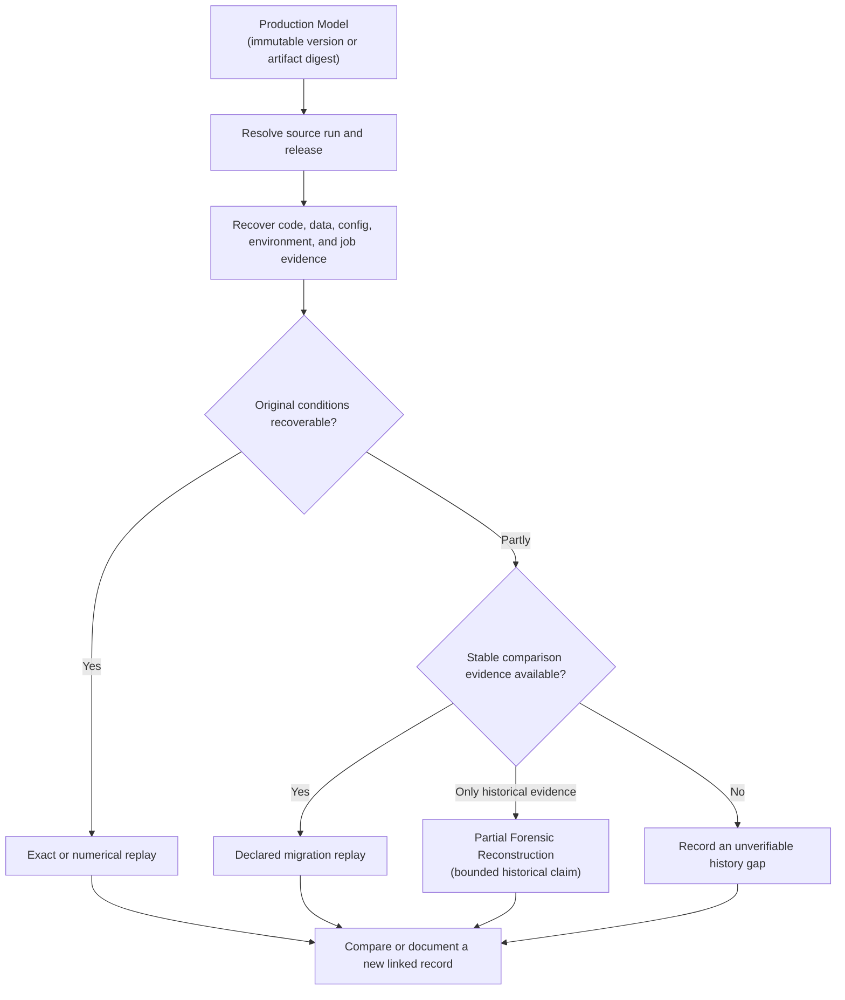
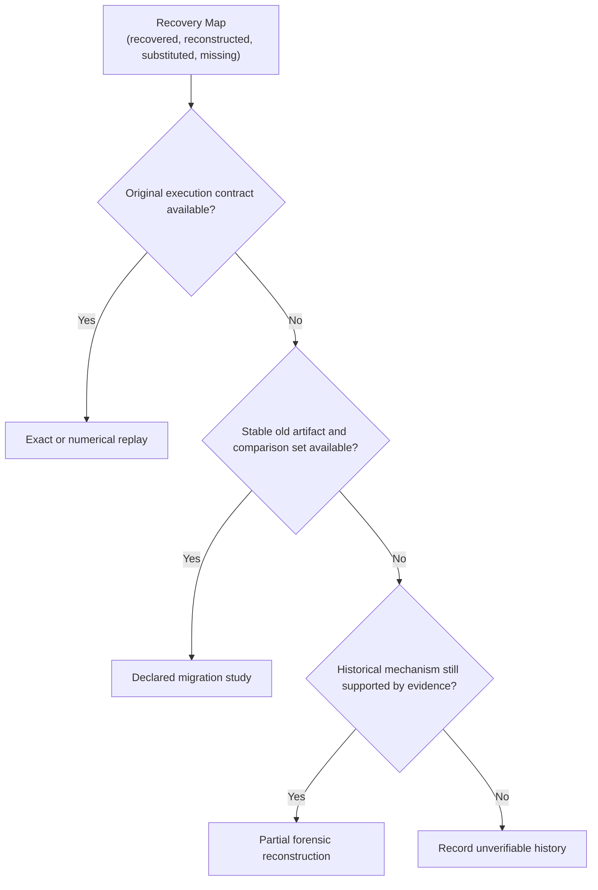
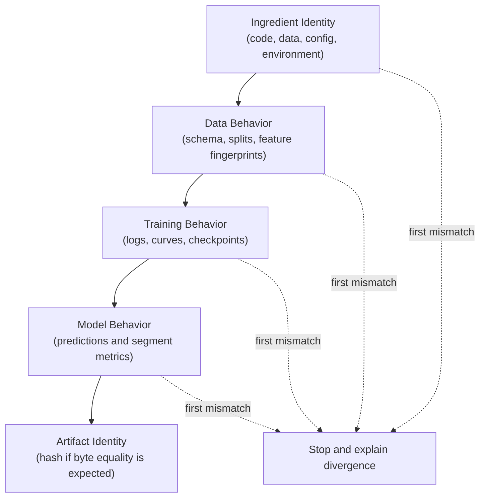

## Table of Contents

1. [An Old Production Model Has to Be Rebuilt](#an-old-production-model-has-to-be-rebuilt)
2. [Understand The Four Possible Reproduction Outcomes](#understand-the-four-possible-reproduction-outcomes)
3. [Start With The Exact Model Used In Production](#start-with-the-exact-model-used-in-production)
4. [List The Required Inputs Before Starting Compute](#list-the-required-inputs-before-starting-compute)
5. [Verify That The Original Training Data Still Exists](#verify-that-the-original-training-data-still-exists)
6. [Reconstruct the Environment Without Hiding Changes](#reconstruct-the-environment-without-hiding-changes)
7. [Restore Authorized Access To Required Services And Data](#restore-authorized-access-to-required-services-and-data)
8. [Decide Whether To Replay Or Migrate The Run](#decide-whether-to-replay-or-migrate-the-run)
9. [Run Preflight Checks Before Training](#run-preflight-checks-before-training)
10. [Run The Replay Under A New Run ID](#run-the-replay-under-a-new-run-id)
11. [Compare The Replay From Inputs To Final Metrics](#compare-the-replay-from-inputs-to-final-metrics)
12. [Limit The Claim To The Evidence You Recovered](#limit-the-claim-to-the-evidence-you-recovered)
13. [Preserve History Instead of Replacing It](#preserve-history-instead-of-replacing-it)
14. [Follow A Practical Recovery Workflow](#follow-a-practical-recovery-workflow)
15. [The Main Idea](#the-main-idea)
16. [References](#references)

## An Old Production Model Has to Be Rebuilt
<!-- section-summary: Rebuilding an old model is a recovery investigation because its source, data, environment, people, and infrastructure may have changed since the original run. -->

Imagine a demand-forecasting model that has served production for more than a year. A security review now requires a new training image because the old base operating system contains vulnerable libraries. The people who trained the model have moved to other teams. The model registry still contains the production model version, and the experiment tracker still contains a source run. The original container tag no longer pulls from the registry.

The new team receives a deceptively simple request: “Rebuild the same model in a supported environment.”

That request contains two different questions. First, can the team reconstruct the original training run closely enough to verify how the existing model was produced? Second, can it migrate the training process to a supported stack while preserving accepted behavior? Losing the original container may make the first goal impossible at the environment level. The second goal may still be achievable through a declared migration study.

At a high level, **reproducing an old run** means recovering historical evidence and executing a controlled replay if that evidence supports one. The final claim must stay within the recovered facts.

The work resembles archaeology. Start from an object known to have existed in production, follow its identities backward, and preserve every gap or substitution found along the way.


```mermaid
flowchart TD
    A["Production Model<br/>(immutable version or artifact digest)"] --> B["Resolve source run and release"]
    B --> C["Recover code, data, config, environment, and job evidence"]
    C --> D{"Original conditions recoverable?"}
    D -- "Yes" --> E["Exact or numerical replay"]
    D -- "Partly" --> F{"Stable comparison evidence available?"}
    F -- "Yes" --> G["Declared migration replay"]
    F -- "Only historical evidence" --> I["Partial Forensic Reconstruction<br/>(bounded historical claim)"]
    F -- "No" --> J["Record an unverifiable history gap"]
    E --> H["Compare or document a new linked record"]
    G --> H
    I --> H
    J --> H
```

## Understand The Four Possible Reproduction Outcomes
<!-- section-summary: Exact replay, migration replay, partial forensic reconstruction, and unverifiable history support different claims and require different evidence. -->

The word *reproduce* can hide several standards. Recovery work is clearer if the team chooses one of four outcomes before running training or writing a historical conclusion.

### The Old Run Replays Exactly Or Within A Declared Tolerance

The team recovers the original code, data snapshots, resolved configuration, dependency environment, execution shape, and comparison evidence. It runs those conditions again. Some deterministic pipelines may produce identical bytes. Accelerator training often aims for predictions and metrics within a declared numerical tolerance because library, driver, and hardware behavior can introduce small differences.

The claim is narrow and strong: “We replayed the recorded conditions and obtained the expected result within the declared boundary.”

### The Rebuilt Run Requires A Documented Migration

At least one historical component is obsolete, unsafe, or unavailable. The team intentionally replaces it and treats the work as a migration experiment. Examples include moving from an unsupported Python runtime, rebuilding a deleted image from its lockfile, changing GPU generation, or replacing an expired feature client.

The claim identifies the substitution: “We could not execute the original environment. The migrated environment passed the agreed functional and quality contract against the old artifact.”

### Only Part Of The Old Run Can Be Reconstructed

Some historical evidence remains, while the team lacks the ingredients for a trustworthy replay or migration comparison. The registry may still resolve the model to a source run, code commit, and configuration. Meanwhile, the training snapshot or stable comparison set has expired.

That evidence can support a bounded lineage claim: “This run and configuration produced the registered artifact.” It may also explain a historical mechanism, such as how a recovered feature query supplied an input. It cannot establish that the model can be trained again or that a migrated stack preserves its behavior.

Partial forensic reconstruction is therefore weaker than a replay. It explains the surviving lineage or mechanism without adding a new controlled execution that reproduces the result.

### The Available Evidence Cannot Support A Reproduction Claim

A critical identity or artifact is missing. The training data may be overwritten, the source run unresolved, the label query lost, or stable comparison evidence unavailable. Running today’s pipeline could still create a useful new model. That result offers no verification of the historical model.

The correct result is a documented gap. This protects future reviewers from mistaking a plausible reconstruction for evidence.

## Start With The Exact Model Used In Production
<!-- section-summary: Recovery starts from an immutable model or release identity and follows lineage to the source run instead of guessing from current code or familiar names. -->

The safest starting point is the exact object that served traffic: a registered model version, MLflow logged-model ID, artifact digest, or deployment release ID. Friendly names such as `forecast-model` or aliases such as `champion` can point somewhere else later.

For an MLflow registry version, the recovery path may start like this:

```python
import mlflow
from mlflow import MlflowClient

client = MlflowClient()
model_version = client.get_model_version(
    name="prod.forecasting.demand_model",
    version="27",
)

if not model_version.run_id:
    raise RuntimeError("Registered model version has no source run lineage")

original_run = mlflow.get_run(model_version.run_id)
print("source run:", original_run.info.run_id)
print("code commit:", original_run.data.tags.get("mlflow.source.git.commit"))
print("dataset inputs:", original_run.inputs.dataset_inputs)
```

This resolves the registry version to the source run. The run then exposes parameters, tags, metrics, and logged dataset inputs.

An MLflow dataset input provides lineage metadata about the data used by the run. Its source description may still lack the transformed rows required for replay. The recovery map therefore needs the immutable table version, object manifest, or dataset snapshot referenced by that input.

If the registry link is absent, check the deployment manifest, release record, model metadata, artifact store, and managed training-job history. A SageMaker training-job description, for example, can retain container, input channels, hyperparameters, resources, output location, and job status. Similar managed job records exist in Gemini Enterprise Agent Platform (formerly Vertex AI), Azure Machine Learning, and Databricks Jobs.

Never choose a source run because its timestamp looks close to the model creation time. A nearby timestamp offers a hypothesis to investigate and no verified identity link.

## List The Required Inputs Before Starting Compute
<!-- section-summary: A recovery map records which historical ingredients resolve, which have expired, and which substitutions would change the replay claim. -->

The previous lesson explained the evidence bundle captured during a reproducible run. Old-run recovery uses the same categories: code, data, configuration, environment, execution, and outputs. Here the question is different: *Which of them can still be retrieved and trusted today?*

Create a recovery map with four states:

- **Recovered:** the immutable object exists and its digest or version matches the historical record.
- **Reconstructed:** the original object is missing, but preserved instructions can rebuild a candidate replacement.
- **Substituted:** the old component must change because of safety, support, access, or hardware constraints.
- **Missing:** available evidence cannot recover or justify a replacement.

```yaml
recovery_map:
  target:
    model_version: "prod.forecasting.demand_model/27"
    source_run_id: "original-run-id"
  evidence:
    code_commit: {state: recovered, value: "4f2c8d1"}
    resolved_config: {state: recovered, artifact: "config/resolved.yaml"}
    train_data: {state: recovered, delta_version: 842}
    evaluation_data: {state: recovered, object_manifest: "sha256:..."}
    container_image: {state: missing, expected_digest: "sha256:..."}
    dependency_lock: {state: recovered, artifact: "environment/uv.lock"}
    gpu_class: {state: substituted, original: "older-gpu", planned: "supported-gpu"}
  proposed_outcome: migration_replay
```

The map prevents accidental claim inflation. A recreated container built from the old Dockerfile and lockfile is a reconstructed environment. It may be excellent evidence, yet it is distinct from pulling the original image by digest.

## Verify That The Original Training Data Still Exists
<!-- section-summary: A table name or object path is historical evidence only if the exact files, snapshot, and transformation rules remain available. -->

Data retention often decides whether reproduction is possible. A tracker may preserve a dataset name and digest while the storage system has already deleted the underlying files. A table called `training_features` usually points to its current state, not the state used by the old run.

For Delta Lake, recover and query the recorded table version:

```python
training = (
    spark.read.format("delta")
    .option("versionAsOf", 842)
    .table("ml_features.demand_training")
)
```

For Apache Iceberg, use the recorded snapshot ID:

```python
training = (
    spark.read
    .option("snapshot-id", "10963874102873")
    .table("catalog.ml_features.demand_training")
)
```

These queries work only while the required snapshot metadata and data files remain retained. Delta `VACUUM` and Iceberg snapshot expiration can remove historical files. Object-store inputs need an immutable manifest containing exact object versions and checksums; a mutable prefix can silently collect different files over time.

After the snapshot resolves, validate more than row count. Compare schema, feature names, label definition, time range, group boundaries, null rates, key cohort counts, and a content fingerprint where feasible. If the old run logged split IDs or evaluation predictions, verify them too.

Transformation history matters as much as raw data. An old SQL query may depend on a dimension table, time-zone rule, feature function, or label cutoff that changed later. Point-in-time reconstruction should read every temporal input as it existed at the decision cutoff. Reading corrected current data creates migration evidence and cannot establish an exact replay.

## Reconstruct the Environment Without Hiding Changes
<!-- section-summary: Environment recovery prefers the original image digest, then a locked reconstruction, and finally an explicit migration with every unavoidable difference recorded. -->

The strongest environment identity is a container image digest. A tag such as `trainer:release` is mutable, while the digest addresses exact image content.

First recover the digest from the original run, build record, or managed job specification. Compare it with the historical recovery map, then pull that exact object into the isolated replay environment:

```bash
docker pull registry.example.com/ml/trainer@sha256:8a6c1f2d9b7e4a5083cf6d1e7b9a2c4f5e60718293a4b5c6d7e8f90123456789
```

If that pull succeeds, keep the environment isolated and scan it before execution. Historic images may contain known vulnerabilities or expired package credentials. Pulling the image supplies identity evidence. Safe execution still requires isolation, restricted credentials, and reviewed network access.

If the image is gone, recover its Dockerfile, base-image digest, dependency lock, build arguments, and package indexes. For a Python project using uv, check and install from the historical lockfile without resolving newer packages:

```bash
uv lock --check
uv sync --frozen
uv run --frozen python -m training.preflight
```

`uv lock --check` verifies that the project metadata and lockfile agree. `uv sync --frozen` uses the existing lockfile and avoids updating it. Exact sync also removes undeclared packages, reducing hidden environment state.

A lockfile cannot recover every historical dependency. Packages may have disappeared from configured indexes, system libraries may be absent from the record, and private wheels may lack retention. Record each unresolved dependency. If a newer package is required, the work has crossed into migration replay.

Hardware creates a similar boundary. The original GPU class may no longer be available, or its driver may reject the historical framework. A different GPU can support a functional migration test while changing floating-point execution and performance. Preserve device model, worker count, precision mode, distributed topology, accelerator libraries, and deterministic flags so the comparison can explain the new boundary.

## Restore Authorized Access To Required Services And Data
<!-- section-summary: Old credentials should never be restored blindly; replay uses current, scoped access to the historical resources it is authorized to read. -->

Training runs often depend on package registries, object stores, feature services, experiment trackers, or licensed datasets. The original secret value may have expired, and storing that secret in a run artifact would have been a security failure.

Recovery starts from the **access requirement** recorded by the old job. Issue a current short-lived identity with read-only permission to the retained snapshot and artifact locations. Restrict network egress and write access. Use a separate replay namespace for outputs.

Some external services hold mutable state. Calling today’s geocoding API, feature endpoint, or tokenizer service can return different results from the historical call. Prefer preserved responses, a versioned local artifact, or a snapshot-capable service. If no historical view exists, list the dependency as substituted or missing.

For example, an old risk model may have used a vendor-provided industry classification. A current credential can reach the service, but the vendor now returns a revised taxonomy. Successful authentication has recovered access; it has not recovered the old input semantics. The migration report must name that change.

## Decide Whether To Replay Or Migrate The Run
<!-- section-summary: The replay mode follows from the recovered evidence and determines which claims and comparison rules are valid. -->

The recovery map now tells the team which historical conditions are intact and which have changed. That evidence determines the kind of replay the team can run and the strength of the conclusion it can later make.

Choose **exact or numerical replay** if the original code, data, configuration, environment, and execution controls are available and safe enough to run in isolation. Declare the expected boundary: artifact hash, prediction tolerance, metric tolerance, or a combination.

Choose a **migration study** if a component must change. Define the original artifact as the behavioral reference and list every substitution. The success contract may cover prediction agreement, primary and cohort metrics, feature schema, latency, and memory. Add domain invariants such as monotonicity or safety rules where relevant.

Stop with **unverifiable history** if the missing evidence prevents a meaningful comparison. Missing training data may still allow behavioral comparison against the original artifact. Missing both training data and the original artifact may leave only partial lineage claims. The claim boundary depends on what remains.


```mermaid
flowchart TD
    A["Recovery Map<br/>(recovered, reconstructed, substituted, missing)"] --> B{"Original execution contract available?"}
    B -- "Yes" --> C["Exact or numerical replay"]
    B -- "No" --> D{"Stable old artifact and comparison set available?"}
    D -- "Yes" --> E["Declared migration study"]
    D -- "No" --> F{"Historical mechanism still supported by evidence?"}
    F -- "Yes" --> G["Partial forensic reconstruction"]
    F -- "No" --> H["Record unverifiable history"]
```

## Run Preflight Checks Before Training
<!-- section-summary: Preflight proves that recovered inputs and runtime components can load together before the team spends hours on training. -->

A preflight is a short validation job that stops early on broken recovery assumptions. It should run in the same isolated environment and resource family planned for the replay.

Check the following mechanisms in order:

1. Resolve the source run, model artifact, data snapshots, source commit, and output namespace.
2. Verify checksums or immutable versions for recovered artifacts.
3. Import the training package and print the resolved dependency, framework, accelerator, and driver versions.
4. Load a small batch from every data input and validate schema and feature order.
5. Recompute a known preprocessing fixture and compare its fingerprint.
6. Load the old model artifact and score a frozen sample if functional comparison is planned.
7. Confirm that deployment, registry alias movement, production writes, and business side effects are disabled.

Suppose the old model expects 84 features and the reconstructed pipeline emits 83. Discovering this in a five-minute preflight points directly to feature reconstruction. Discovering it after an eight-hour training job wastes compute and obscures the first failure.

Managed training platforms can run the same preflight entry point as a small job. Reuse the intended container, input channels, IAM role or service account, network controls, and output location. Then promote the verified job specification to the full replay resource size.

## Run The Replay Under A New Run ID
<!-- section-summary: A replay runs in an isolated workspace, writes fresh evidence, and links back to the historical target without mutating it. -->

Every replay receives a new run ID. The old run is historical evidence and stays immutable. Add explicit lineage tags to the new run:

```python
import mlflow

with mlflow.start_run(run_name="replay-of-model-v27") as replay:
    mlflow.set_tags({
        "replay.kind": "migration",
        "replay.original_run_id": original_run.info.run_id,
        "replay.original_model_version": "27",
        "replay.recovery_map": "artifacts/recovery-map.yaml",
        "replay.approved_side_effects": "none",
    })
    run_training_and_evaluation()
```

Write checkpoints, logs, metrics, predictions, environment probes, and final artifacts to a new immutable location. Keep model registration, production aliases, feature writes, notifications, and downstream actions disabled unless the recovery plan explicitly authorizes them.

Use a clean workspace and a fresh compute job. An engineer’s long-lived notebook may contain imported modules, cached data, manually installed packages, or environment variables absent from the recovery map. A containerized job or managed training job creates a clearer execution boundary.

If the replay fails, keep the failed run. Its logs and recovery state explain which layer broke. A new attempt should link to the failed replay and name the correction.

## Compare The Replay From Inputs To Final Metrics
<!-- section-summary: Layered comparison finds the first divergence across ingredients, data, processing, training, predictions, and accepted product behavior. -->

Replay comparison works like fault isolation. It checks the recovered ingredients first, then follows their effects through data preparation, training, and final model behavior. The first mismatch usually offers the clearest explanation for later differences.

First compare **ingredients**: commit, resolved configuration, data snapshots, lockfile, image digest, hardware, worker count, and runtime flags. Then compare **data and preprocessing**: schema, split membership, feature fingerprints, label counts, and known fixtures. Next compare **training behavior**: warnings, step counts, loss curves, checkpoints, and early-stopping choice.

Only after those layers line up should the team compare final metrics, cohort metrics, predictions, and artifacts.


```mermaid
flowchart TD
    A["Ingredient Identity<br/>(code, data, config, environment)"] --> B["Data Behavior<br/>(schema, splits, feature fingerprints)"]
    B --> C["Training Behavior<br/>(logs, curves, checkpoints)"]
    C --> D["Model Behavior<br/>(predictions and segment metrics)"]
    D --> E["Artifact Identity<br/>(hash if byte equality is expected)"]

    A -. "first mismatch" .-> X["Stop and explain divergence"]
    B -. "first mismatch" .-> X
    C -. "first mismatch" .-> X
    D -. "first mismatch" .-> X
```

The success contract determines how far the ladder must match. An exact packaging replay may require the same artifact hash. A numerical replay may accept a small prediction delta. A migration study may accept changed weights if quality, calibration, important segments, and runtime gates remain inside their approved ranges.

Artifact hash differences need interpretation. Archive timestamps or serialization order can change bytes while predictions stay identical. Matching aggregate metrics also provide limited evidence; two models can have the same accuracy and disagree on many individual examples. A frozen prediction set and cohort results reveal those differences.

## Limit The Claim To The Evidence You Recovered
<!-- section-summary: Missing evidence sets a hard boundary on what the team can say about the old run, even if a modern pipeline trains successfully. -->

Recovery work creates pressure to “get something running.” A successful current training job can be operationally valuable and historically irrelevant.

Use explicit decision rules:

- If the source model cannot be resolved to an artifact or run, avoid claiming that a guessed run produced it.
- If the old training snapshot is gone, avoid calling current-data training an exact replay.
- If the evaluation set or metric definition is missing, avoid claiming metric equivalence from a newly invented test.
- If the old artifact is gone, behavioral equivalence against that artifact cannot be measured.
- If the environment changed, label the result as migration evidence and list the substitution.
- If hardware nondeterminism exceeds the declared tolerance, report numerical divergence and preserve both outputs.

An honest conclusion might read: “The model version resolves to its source run and artifact. Code and configuration were recovered. The training table version expired, so the original data cannot be reconstructed. We verified artifact behavior on a retained evaluation set. Training replay remains unsupported by the available evidence.”

That statement is useful. It separates verified lineage, verified behavior, and the missing historical claim.

## Preserve History Instead of Replacing It
<!-- section-summary: The replay appends a new linked record containing its own evidence, substitutions, result, and confidence statement. -->

Never edit the original run to attach replay metrics or replace its artifacts. Doing so mixes evidence from two executions and removes the historical boundary.

The new replay record should contain:

- the original model, run, release, and artifact identities;
- the selected outcome: exact replay, migration replay, partial reconstruction, or unverifiable;
- the recovery map and preflight report;
- every compatibility patch and its commit or digest;
- original and replay environments;
- comparison datasets, metrics, tolerances, predictions, and cohort reports;
- reviewers, decision, remaining gaps, and allowed next action.

If a migration replay succeeds, register its output as a new model version. Link it to the migration run and approval evidence. Preserve the older registry version for audit and rollback according to retention policy. A registry alias may move later through the release process; the immutable versions remain distinct.

## Follow A Practical Recovery Workflow
<!-- section-summary: Industrial recovery moves through identity resolution, retention checks, reconstruction, preflight, isolated execution, comparison, and a recorded decision. -->

The recovery process has a deliberate sequence. Each step either strengthens the replay claim or reveals a boundary that the team must carry into the result. Compute comes after identity, retention, access, and preflight have been checked.

The complete operational sequence is:

1. **Freeze the target.** Record the deployed release, immutable model version or model ID, artifact digest, and incident or migration reason.
2. **Resolve lineage.** Follow the registry or release record to the source run and managed job. Reject timestamp-based guesses.
3. **Build the recovery map.** Mark code, data, config, environment, execution, and output evidence as recovered, reconstructed, substituted, or missing.
4. **Test retention.** Read the exact Delta version, Iceberg snapshot, or object manifest. Pull artifacts and container images by immutable identity.
5. **Choose the claim.** Select exact replay, migration study, partial reconstruction, or unverifiable history before seeing new results.
6. **Create isolated access.** Issue short-lived read-only credentials, restrict egress, and create a new output namespace.
7. **Run preflight.** Validate imports, versions, data schemas, feature fixtures, model loading, and disabled side effects.
8. **Execute cleanly.** Submit a new containerized or managed job with the recovered specification and a new MLflow run ID.
9. **Compare by layers.** Find the first divergence across ingredients, data, processing, training, predictions, and product gates.
10. **Record the result.** Preserve new artifacts, substitutions, confidence, reviewers, and next action without changing the old run.

The demand-forecasting scenario from the opening would probably follow the migration path. The original image is missing, so exact environment replay is unavailable. If the remaining evidence exists, the team can reconstruct a container and run controlled preflight. It can then retrain on supported hardware and compare behavior. The final record must state that the environment and hardware changed.

## The Main Idea
<!-- section-summary: Old-run recovery succeeds through honest identity resolution and evidence boundaries, not through making current code produce a familiar score. -->

Reproducing an old run is a recovery decision before it is a training job. Start with the immutable model that production used. Follow its lineage backward. Test whether the referenced code, data, environment, access, hardware, and comparison evidence still exist.

If the original contract survives, replay it. If an old component must change, run a declared migration study. If critical evidence is gone, document the point where trustworthy claims end.

Every attempt receives a new identity and preserves the original history. That discipline lets future engineers distinguish what was replayed, what was migrated, and what can no longer be known.

## References

- [MLflow: Tracking API](https://mlflow.org/docs/latest/api_reference/python_api/mlflow.html)
- [MLflow: Model Registry](https://mlflow.org/docs/latest/ml/model-registry/)
- [MLflow: Dataset tracking](https://mlflow.org/docs/latest/dataset/)
- [Delta Lake: Time travel and retention](https://docs.delta.io/delta-batch/)
- [Apache Iceberg: Spark time travel](https://iceberg.apache.org/docs/latest/spark-queries/)
- [uv: Locking and syncing](https://docs.astral.sh/uv/concepts/projects/sync/)
- [Docker: Pull an image by digest](https://docs.docker.com/reference/cli/docker/image/pull/)
- [Amazon SageMaker AI: DescribeTrainingJob](https://docs.aws.amazon.com/sagemaker/latest/APIReference/API_DescribeTrainingJob.html)
- [Google Cloud: Gemini Enterprise Agent Platform Name Changes](https://docs.cloud.google.com/gemini-enterprise-agent-platform/vertex-ai-name-changes)
- [PyTorch: Reproducibility](https://docs.pytorch.org/docs/stable/notes/randomness.html)
