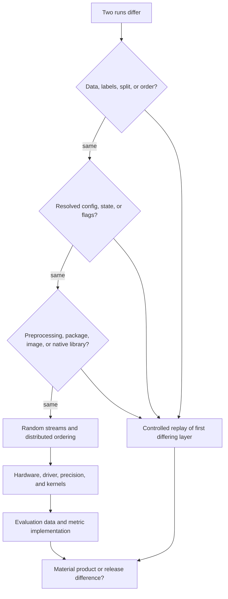

## Why Same Code Can Train a New Model
<!-- section-summary: The source commit can match while data, config, environment, randomness, hardware, and evaluation details still change the trained model. -->

**Same code can train a new model** because source code is one ingredient in a training run. The controls article already defined the full receipt. This article starts after a difference appears and uses that receipt to isolate which changed input explains the important output movement.

That answer matters because teams often treat an unchanged Git commit as proof that a model should match exactly. In production MLOps, the source commit gives you one anchor. You still need to compare the rest of the run packet before deciding whether the new model is expected, acceptable, risky, or broken.

Diagnose the difference through a causal tree. Start with data and label snapshots. Then compare code commit, dirty state, configuration, and feature flags. Compare preprocessing, package locks, container and native libraries. Compare randomness, data order, distributed partitioning, and checkpoint or optimizer state. Compare hardware, drivers, kernels, and distributed settings. Finally, compare evaluation data and metric implementation before deciding whether the model difference is material.

| Causal layer | What can change under the same commit | Evidence to compare |
|---|---|---|
| **Data and labels** | Rows, time window, corrections, entity mix, label maturity | Snapshot IDs, manifests, data and label reports |
| **Resolved behaviour** | Config overrides, feature flags, dirty files, checkpoint resume | Resolved config, dirty-state record, checkpoint and optimizer IDs |
| **Preprocessing and dependencies** | Category ordering, defaults, compiled libraries, container contents | Feature-array hashes, package lock, image digest |
| **Randomness and order** | Worker seeds, shuffling, augmentation, distributed partitions | Seed policy, sampler state, worker count, batch order |
| **Hardware and runtime** | GPU kernels, drivers, precision, reductions, thread scheduling | GPU SKU, driver, CUDA, libraries, distributed settings |
| **Evaluation** | Holdout rows, metric code, thresholds, aggregation | Evaluation manifest, metric package version, segment report |

Work down this tree and change one layer at a time. A blind rerun changes several layers again and produces another unexplained model. A controlled replay holds the other layers fixed so the team can connect an input difference to an output difference.



The first differing layer supplies the next test. This keeps several plausible causes from moving together and gives the final incident record a causal finding instead of a list of differences.

**StreamNest**, a streaming media company with a recommendation ranker, supplies concrete run evidence for that framework. Two runs share a source commit, while the candidate has slightly higher overall NDCG and worse documentary performance.

The investigation is not only "why are the files different?" The useful production question is, "Does this difference matter for users, and do we have enough evidence to ship, replay, or stop?"

## Apply The Causal Tree To Recommendation Ranking
<!-- section-summary: A specific same-code incident gives every comparison a concrete model, dataset, run, metric, artifact, and owner. -->

StreamNest trains `home-feed-ranker` from impression logs, watch-time labels, catalog metadata, and user-session features. The training job uses PyTorch for the ranking model and scikit-learn preprocessing for a few tabular features such as country, device family, and subscription plan. MLflow stores runs and artifacts, and lakeFS stores immutable data snapshots over the feature lake.

The two runs share the same source commit:

```yaml
same_code_case:
  model_name: home-feed-ranker
  old_run_id: ranker-2026-06-10-0200
  new_run_id: ranker-2026-06-17-0200
  code_commit: 4d1e7c9
  training_entrypoint: train_ranker.py
  owner: ranking-platform
  business_question: "Why did documentary coverage drop in the candidate model?"
```

The first comparison should list every major ingredient side by side:

| Ingredient | Old run | New run |
|---|---|---|
| Code commit | `4d1e7c9` | `4d1e7c9` |
| Dataset snapshot | `lakefs://recsys/features@a81d44e` | `lakefs://recsys/features@d73c92b` |
| Config | `configs/home_feed/prod.yml` | `configs/home_feed/prod.yml` |
| Seed | `1931` | `1931` |
| Image digest | `registry.streamnest.ai/recsys/ranker@sha256:aa19...` | `registry.streamnest.ai/recsys/ranker@sha256:f80c...` |
| PyTorch | `2.5.1` | `2.6.0` |
| scikit-learn | `1.5.2` | `1.6.1` |
| GPU | `NVIDIA A100 40GB` | `NVIDIA L40S` |
| Main metric | NDCG@10 `0.412` | NDCG@10 `0.416` |
| Segment concern | Documentary NDCG@10 `0.388` | Documentary NDCG@10 `0.371` |


*Both runs use the same source commit, yet the data snapshot, image digest, package set, GPU runtime, and segment metrics show why the trained recommendation model can move.*

The same code commit is real. The rest of the table shows several changes. The team should work through them in an order that usually finds the largest causes first: data, preprocessing and dependencies, runtime and hardware, randomness, then evaluation.

## Data and Snapshot Differences
<!-- section-summary: Data changes are the first same-code suspect because new examples, labels, catalog values, and feature distributions can train a different model. -->

Data is usually the first place to look. A ranking model learns from examples, so a new snapshot can change the learned model even with the same code. The new StreamNest snapshot includes seven more days of impressions, new catalog items, updated content taxonomy, corrected watch-time labels for auto-play sessions, and a larger share of sports highlight traffic after a tournament weekend.

The replay packet should compare data snapshots before comparing model files:

```sql
SELECT
  snapshot_id,
  COUNT(*) AS training_rows,
  COUNT(DISTINCT user_id) AS users,
  COUNT(DISTINCT item_id) AS items,
  AVG(label_watch_seconds) AS avg_watch_seconds,
  AVG(CASE WHEN genre = 'documentary' THEN 1 ELSE 0 END) AS documentary_share,
  AVG(CASE WHEN surface = 'home' THEN 1 ELSE 0 END) AS home_surface_share
FROM training_examples
WHERE snapshot_id IN ('a81d44e', 'd73c92b')
GROUP BY snapshot_id
ORDER BY snapshot_id;
```

Example output:

```console
snapshot_id  training_rows  users      items   avg_watch_seconds  documentary_share  home_surface_share
a81d44e      812441203      38201944   884203  184.2              0.071              0.642
d73c92b      931770044      40198220   912880  177.6              0.058              0.661
```

The snapshot changed in ways that can move the model. Documentary examples have a smaller share of the new training set, and average watch time changed after label correction. The code can match perfectly while the training signal pushes the model toward different ranking weights.


*The new snapshot adds more rows, users, items, and sports traffic while documentary share drops, giving the team a concrete data-side explanation to test before blaming the source commit.*

The data comparison should also check feature distribution and label quality:

| Data check | Why it matters for ranking |
|---|---|
| Row count and date window | Confirms the run used the intended snapshot and time range |
| Label correction count | Shows whether watch-time targets changed under the model |
| New item count | Reveals catalog churn that may affect cold-start behavior |
| Genre distribution | Explains segment metric movement such as documentary NDCG |
| Null and default rates | Finds pipeline changes that fill missing features differently |
| Entity leakage checks | Ensures future interactions did not enter training features |

If the data diff explains the model movement, the next step is a product decision. A new model can be different for a valid reason. The team still needs to decide whether the change helps the home feed overall while staying fair to important segments.

## Resolved Config, Randomness, And Hidden State
<!-- section-summary: The same config path or seed value can hide different overrides, sampler order, checkpoints, optimizer state, and early-stopping history. -->

A matching config filename does not prove matching behaviour. Environment variables, command-line overrides, feature flags, secret-backed settings, and defaults can change the resolved values that reach training. The run should save the resolved config after every override and compare its content hash.

Randomness also has several layers. A top-level seed can initialize the model while data-loader workers, augmentations, distributed samplers, and hyperparameter libraries use separate random number generators. Changing worker count or world size can change example order even when the visible seed stays `1931`.

Checkpoint resume adds hidden state. A checkpoint may include weights, optimizer moments, learning-rate scheduler position, automatic mixed-precision scaler state, epoch, and sampler state. Resuming weights without the other state changes the training path. Early stopping also depends on prior validation history and patience counters.

```yaml
resolved_behaviour_diff:
  old:
    config_sha256: 41dd8c0a
    dataloader_workers: 8
    world_size: 4
    resume_checkpoint: null
    feature_flag_snapshot: home-feed-2026-06-10
  new:
    config_sha256: 9a63e7f2
    dataloader_workers: 12
    world_size: 4
    resume_checkpoint: ranker-epoch-6-step-18400
    feature_flag_snapshot: home-feed-2026-06-17
```

This diff gives the replay plan concrete tests. Run the candidate data with the old resolved config. Start both runs from the same initial checkpoint or from fresh initialization. Keep worker count and world size fixed. If the predictions move only after resume, inspect optimizer, scheduler, scaler, sampler, and early-stopping state before blaming the source code.

## Dependencies and Preprocessing Differences
<!-- section-summary: Package and preprocessing changes can alter feature arrays, category ordering, metric calculations, and model artifacts under the same code commit. -->

Dependencies are the second same-code suspect. StreamNest's training source imports PyTorch, pandas, NumPy, and scikit-learn. The same source line can behave differently when package versions, compiled libraries, or preprocessing defaults differ. A scikit-learn transformer can change category handling, a pandas version can change dtype behavior, and a PyTorch release can change supported deterministic operations or numerical kernels.

The environment diff should be part of every same-code investigation:

```yaml
environment_diff:
  old_image: registry.streamnest.ai/recsys/ranker@sha256:aa19c7
  new_image: registry.streamnest.ai/recsys/ranker@sha256:f80c42
  lockfile_old: locks/requirements-2026-06-10.lock
  lockfile_new: locks/requirements-2026-06-17.lock
  package_changes:
    torch: "2.5.1 -> 2.6.0"
    scikit_learn: "1.5.2 -> 1.6.1"
    pandas: "2.2.3 -> 2.3.0"
    numpy: "2.0.2 -> 2.1.1"
```

This table does not prove the package update caused the model change. It tells the team that the same-code claim is incomplete. To isolate dependency effects, the team can run a small replay matrix:

| Replay | Code | Data snapshot | Image digest | Purpose |
|---|---|---|---|---|
| A | `4d1e7c9` | `a81d44e` | `aa19c7` | Recreate the old run |
| B | `4d1e7c9` | `a81d44e` | `f80c42` | Test environment change with old data |
| C | `4d1e7c9` | `d73c92b` | `aa19c7` | Test data change with old environment |
| D | `4d1e7c9` | `d73c92b` | `f80c42` | Match the new candidate |

Replay B is the environment test. Replay C is the data test. Replay D is the candidate reproduction. This matrix costs more compute than a single rerun, yet it gives the team a much cleaner answer when both data and environment changed during the same week.

Preprocessing deserves its own artifact. StreamNest should save the feature schema and category map used during training:

```yaml
feature_schema:
  schema_version: home-feed-features-v12
  categorical_features:
    country:
      encoder: sklearn.preprocessing.OneHotEncoder
      categories_hash: 93ef12a7
    device_family:
      encoder: sklearn.preprocessing.OneHotEncoder
      categories_hash: d821c0b9
  numeric_features:
    - user_7d_watch_minutes
    - item_24h_completion_rate
    - creator_30d_follow_rate
  feature_array_sha256: 8cd3e1f0
```

If the feature array hash changes for the same frozen sample, the difference may live in preprocessing rather than model training. This is why scikit-learn pipeline artifacts, category maps, and feature schemas belong in the run record.

## Hardware, GPU, and Runtime Differences
<!-- section-summary: GPU type, CUDA, cuDNN, driver versions, threads, distributed settings, and nondeterministic operations can move a model even with fixed seeds. -->

Hardware and runtime can add another layer of same-code movement. StreamNest trains on GPUs because ranking batches are large. The old run used an A100 node, and the new run used an L40S node after a scheduler change. Both nodes run NVIDIA GPUs, yet the exact kernels, memory behavior, driver versions, and performance settings differ.

The same point applies to newer fleets. In 2026, a platform may offer L4 or L40S nodes for inference and smaller training jobs, H100 or H200 nodes for larger deep learning jobs, and B200 or other Blackwell-class nodes for the largest accelerator pools. A same-code comparison should record the exact SKU and runtime rather than treating those nodes as interchangeable.

A seed helps control random choices. It cannot erase every difference across releases, devices, or kernels. PyTorch documents limits around reproducibility across releases and platforms, and it provides deterministic settings that reduce many sources of nondeterminism for a chosen platform. The practical lesson is to record the platform and set deterministic flags for replay-sensitive jobs.

The runtime diff should be concrete:

```yaml
runtime_diff:
  old:
    gpu: "NVIDIA A100 40GB"
    driver: "550.54"
    cuda_runtime: "12.4"
    cudnn: "9.1"
    torch_deterministic_algorithms: true
    cublas_workspace_config: ":4096:2"
    dataloader_workers: 12
  new:
    gpu: "NVIDIA L40S"
    driver: "555.42"
    cuda_runtime: "12.6"
    cudnn: "9.3"
    torch_deterministic_algorithms: true
    cublas_workspace_config: ":4096:2"
    dataloader_workers: 12
```

This diff gives reviewers a way to rank the uncertainty. If the replay matrix shows the old data and old image still produce a close match on the new GPU, hardware probably explains less of the documentary drop. If the old data and old image drift on the new GPU, the team needs a hardware-specific tolerance or a replay on the original node pool.

For distributed jobs, also record world size, process count, batch size per device, gradient accumulation, mixed precision settings, and reduction behavior. Those settings control how examples flow through training and how floating-point values are combined. Ranking teams often accept tiny numerical movement, and they still need to know whether the movement can change top-ten ordering for important segments.

## Decide Whether the Difference Matters
<!-- section-summary: Teams decide impact by comparing acceptance thresholds, segment metrics, frozen-sample predictions, artifacts, latency, and product risk. -->

After the ingredient comparison, the team has to decide what to do. A different model can be a good candidate, a harmless replay variation, a segment regression, or a broken pipeline. The decision should use thresholds that product, data science, and platform owners agreed on before the urgent incident.

StreamNest uses an acceptance table for the home feed:

| Check | Ship threshold | New run result | Decision |
|---|---:|---:|---|
| Overall NDCG@10 | improves by >= 0.002 | +0.004 | pass |
| Documentary NDCG@10 | no drop below -0.005 | -0.017 | stop and review |
| New-user NDCG@10 | no drop below -0.004 | -0.001 | pass |
| Creator diversity score | no drop below -0.010 | -0.003 | pass |
| P95 ranking latency | <= 45 ms | 43 ms | pass |
| Frozen 250k prediction delta | <= 2% of items change rank by 5+ slots | 6.8% | review |


*The candidate can pass the overall metric and latency checks while documentary NDCG and frozen-sample movement send the release to review or hold.*

The overall metric improved, and the documentary segment failed. That combination is common in ranking systems because a global metric can hide a business-important group. The team should pause promotion, compare documentary examples, and ask whether the data snapshot underrepresented that genre or the new feature values changed the model's behavior.

A frozen prediction sample helps separate training movement from evaluation movement. StreamNest keeps a fixed file of 250,000 user-item candidates that every candidate model scores:

```bash
python tools/score_frozen_sample.py \
  --model-uri runs:/ranker-2026-06-10-0200/model \
  --input s3://streamnest-ml/replay/frozen_home_feed_250k.parquet \
  --output reports/old_scores.parquet

python tools/score_frozen_sample.py \
  --model-uri runs:/ranker-2026-06-17-0200/model \
  --input s3://streamnest-ml/replay/frozen_home_feed_250k.parquet \
  --output reports/new_scores.parquet

python tools/compare_rank_deltas.py \
  --old reports/old_scores.parquet \
  --new reports/new_scores.parquet \
  --group-by genre \
  --out reports/rank_delta_by_genre.md
```

This comparison shows whether the new model changed rankings for the same candidate set. If documentary items move down for the same users and the data snapshot also reduced documentary share, the team has a focused investigation path. They can rebalance training, adjust sample weights, repair labels, or hold the candidate while the data team checks the snapshot.

## Record The Causal Finding And Decision
<!-- section-summary: The investigation record connects changed inputs, controlled replays, material output movement, and the release decision. -->

The investigation should end with a causal claim and a decision. Comparison output supports that record. The record should be readable by someone outside the training team. It says what changed, how the team isolated the change, which outputs moved beyond tolerance, what uncertainty remains, and why the candidate shipped, stopped, or needs another replay. It can live as a Markdown report attached to the MLflow run and linked from the model registry review.

Here is a compact version:

```yaml
same_code_debug_packet:
  case_id: recsys-same-code-2026-06-17
  model: home-feed-ranker
  code_commit: 4d1e7c9
  old_run: ranker-2026-06-10-0200
  new_run: ranker-2026-06-17-0200
  changed_inputs:
    data_snapshot: "a81d44e -> d73c92b"
    image_digest: "aa19c7 -> f80c42"
    torch: "2.5.1 -> 2.6.0"
    scikit_learn: "1.5.2 -> 1.6.1"
    gpu: "A100 -> L40S"
  replay_matrix:
    old_data_old_env:
      ndcg_at_10: 0.412
      documentary_ndcg_at_10: 0.388
    old_data_new_env:
      ndcg_at_10: 0.413
      documentary_ndcg_at_10: 0.386
    new_data_old_env:
      ndcg_at_10: 0.416
      documentary_ndcg_at_10: 0.373
    new_data_new_env:
      ndcg_at_10: 0.416
      documentary_ndcg_at_10: 0.371
  decision:
    status: hold_candidate
    reason: "Documentary segment regression exceeds threshold; data snapshot explains most of the drop."
    owner: ranking-platform
    next_review: "2026-06-19"
```

This packet tells a useful story. The new data explains most of the documentary movement because replay C and replay D both show the drop. The new environment adds small noise, and it does not explain the main segment issue. The team can hold the candidate and create a data-focused fix rather than spending days chasing the unchanged source commit.

The packet also protects future training. The next model review can ask whether the documentary share, label correction, and category coverage have been fixed in the new snapshot. That makes reproducibility a normal review habit instead of a special emergency exercise.

## Putting It Together
<!-- section-summary: Same-code differences are solved by comparing the full training packet and deciding impact with agreed metric, segment, artifact, and runtime checks. -->

Same source code can train a different model because training uses code plus data, config, dependencies, preprocessing, seeds, hardware, runtime libraries, and evaluation. StreamNest's `home-feed-ranker` used the same commit in both runs, yet the dataset snapshot, image digest, PyTorch version, scikit-learn version, and GPU class changed. The documentary segment regression made the candidate risky even though the overall metric improved.

The workflow is straightforward. Compare the run ingredients, run a small replay matrix when several ingredients changed, score a frozen sample, inspect segment metrics, and decide with written thresholds. That gives the team a clear answer: ship, hold, replay on the old environment, repair the data, or open a new candidate run with a controlled change.

## References

- [PyTorch Reproducibility Notes](https://docs.pytorch.org/docs/stable/notes/randomness.html) - Official notes on reproducibility limits across releases, platforms, CPU/GPU execution, randomness, and deterministic controls.
- [PyTorch deterministic algorithms](https://docs.pytorch.org/docs/stable/generated/torch.use_deterministic_algorithms.html) - Official API reference for deterministic algorithm settings.
- [scikit-learn common pitfalls](https://scikit-learn.org/stable/common_pitfalls.html) - Official guidance on pipelines, preprocessing consistency, leakage, and randomness.
- [MLflow Tracking](https://mlflow.org/docs/latest/ml/tracking/) - Official tracking documentation for runs, metrics, parameters, tags, artifacts, and model search.
- [MLflow Dataset Tracking](https://mlflow.org/docs/latest/ml/dataset/) - Official dataset tracking documentation for lineage and dataset version evidence.
- [MLflow artifacts API](https://mlflow.org/docs/latest/api_reference/python_api/mlflow.artifacts.html) - Official API reference for downloading run and model artifacts.
- [lakeFS concepts](https://docs.lakefs.io/understand/model/) - Official lakeFS documentation for commits, branches, tags, and immutable data references.
- [DVC Get Started](https://doc.dvc.org/start) - Official DVC guide for tracked data versions and workspace checkout.
- [Docker image tag reference](https://docs.docker.com/reference/cli/docker/image/tag/) - Official Docker reference for image references and tags.
- [NVIDIA AI Enterprise Infrastructure Support Matrix](https://docs.nvidia.com/ai-enterprise/support-matrix/latest/index.html) - Official NVIDIA support matrix for data center GPU and software compatibility checks.
