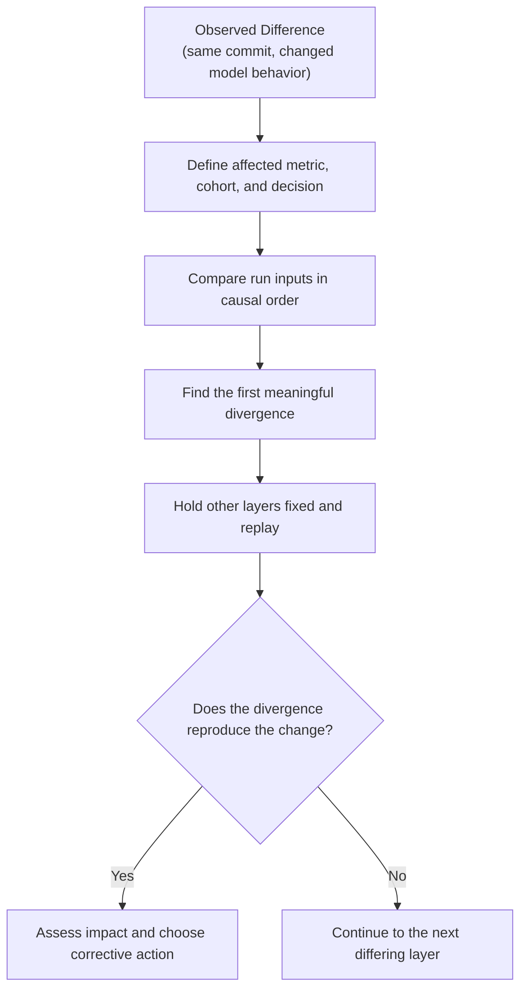
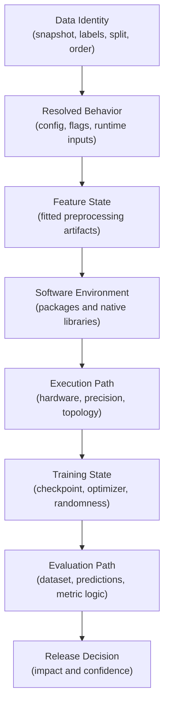
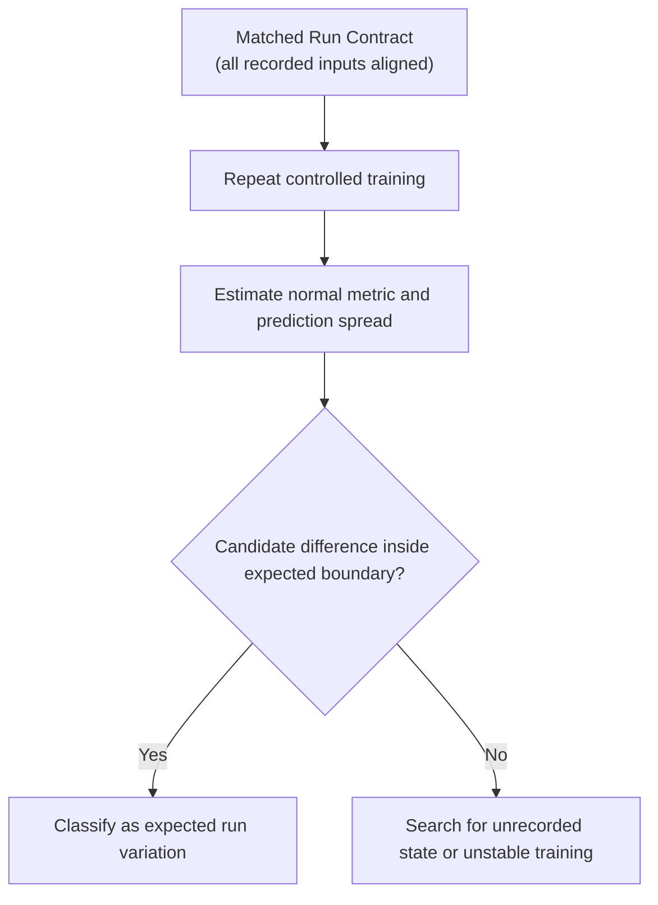

## Table of Contents

1. [The Commit Matches and the Model Still Changed](#the-commit-matches-and-the-model-still-changed)
2. [Find The First Step Where The Runs Differ](#find-the-first-step-where-the-runs-differ)
3. [Define the Difference Before Investigating It](#define-the-difference-before-investigating-it)
4. [Compare Data Snapshot, Split, and Order](#compare-data-snapshot-split-and-order)
5. [Compare The Final Configuration Used By Each Run](#compare-the-final-configuration-used-by-each-run)
6. [Compare The Learned Preprocessing Values](#compare-the-learned-preprocessing-values)
7. [Compare Dependencies And Native Libraries](#compare-dependencies-and-native-libraries)
8. [Inspect Hardware, Kernels, and Precision](#inspect-hardware-kernels-and-precision)
9. [Compare Distributed Training Topology](#compare-distributed-training-topology)
10. [Verify Checkpoint and Resume State](#verify-checkpoint-and-resume-state)
11. [Measure Variation From Nondeterministic Operations](#measure-variation-from-nondeterministic-operations)
12. [Verify the Evaluation Path](#verify-the-evaluation-path)
13. [Isolate the Cause With Controlled Replays](#isolate-the-cause-with-controlled-replays)
14. [Decide Whether the Difference Is Acceptable](#decide-whether-the-difference-is-acceptable)
15. [Add A Production Check For The Confirmed Cause](#add-a-production-check-for-the-confirmed-cause)
16. [Record What Caused The Difference](#record-what-caused-the-difference)
17. [The Main Idea](#the-main-idea)
18. [References](#references)

## The Commit Matches and the Model Still Changed
<!-- section-summary: A matching source commit proves one shared input, while many other run inputs can still change the learned artifact and its behavior. -->

At 08:15, an ML engineer reviews the candidate produced by the nightly fraud-training job. The source commit matches the currently approved run. Yet the frozen evaluation set shows a higher false-positive rate for prepaid-card transactions. If the candidate is promoted at midday, more legitimate payments may be blocked. If it is rejected without investigation, the team may discard a valid response to newly confirmed fraud labels.

The engineer owns a concrete decision: approve the candidate, hold it, or rerun training before the deployment window. Success requires more than obtaining the old headline metric. The team needs to locate the first meaningful difference between the runs and show, through a controlled comparison, whether that difference explains the prepaid-card regression.

A Git commit identifies source files, yet it says nothing about which rows arrived, how they were split, which defaults were resolved, which kernels ran, or whether training resumed from a checkpoint. **The same code can produce a different model because training executes over data, state, software, and hardware.**


```mermaid
flowchart TD
    A["Observed Difference<br/>(same commit, changed model behavior)"] --> B["Define affected metric, cohort, and decision"]
    B --> C["Compare run inputs in causal order"]
    C --> D["Find the first meaningful divergence"]
    D --> E["Hold other layers fixed and replay"]
    E --> F{"Does the divergence reproduce the change?"}
    F -- "Yes" --> G["Assess impact and choose corrective action"]
    F -- "No" --> H["Continue to the next differing layer"]
```

The matching commit is valuable. It removes one large branch from the investigation. It is not a complete run identity.


*A matching commit proves one part of the run identity. The remaining rows reveal the larger contract that can change independently and must be compared before the team explains the new model.*

## Find The First Step Where The Runs Differ
<!-- section-summary: The investigation follows the training path in order and tests the earliest changed layer before interpreting differences farther downstream. -->

Training is a chain of transformations. Raw records become splits, batches, tensors, gradients, checkpoints, predictions, and finally evaluation metrics. A difference near the start can affect every later stage.

The **first divergence** is the earliest point where the baseline and candidate stop being equivalent. For example, if the training split already differs, changed weights and predictions are expected downstream consequences. Comparing GPU kernels first would skip over the stronger explanation.

Work through the path in this order:


```mermaid
flowchart TD
    A["Data Identity<br/>(snapshot, labels, split, order)"] --> B["Resolved Behavior<br/>(config, flags, runtime inputs)"]
    B --> C["Feature State<br/>(fitted preprocessing artifacts)"]
    C --> D["Software Environment<br/>(packages and native libraries)"]
    D --> E["Execution Path<br/>(hardware, precision, topology)"]
    E --> F["Training State<br/>(checkpoint, optimizer, randomness)"]
    F --> G["Evaluation Path<br/>(dataset, predictions, metric logic)"]
    G --> H["Release Decision<br/>(impact and confidence)"]
```

This order is a diagnostic strategy, not a claim that data always causes the problem. It starts with causes that can create large, structured changes and moves toward numerical variation and measurement.

Use a known-good run as the baseline. The candidate is the unexpected run. Preserve both before launching more jobs. A blind rerun can change data arrival, worker scheduling, or hardware assignment again and create a third unexplained artifact.

## Define the Difference Before Investigating It
<!-- section-summary: The incident statement names the affected output, comparison boundary, operational consequence, and evidence required for closure. -->

“The model changed” is too broad. Any stochastic training run can produce different weight bytes. The team needs to describe the behavior that triggered concern.

A good incident statement contains four parts:

- **Observed change:** which prediction, metric, segment, artifact, or runtime property moved;
- **Comparison boundary:** which baseline, candidate, and frozen evidence set produced the observation;
- **Consequence:** which user or operational decision could change;
- **Closure evidence:** what result would justify approval, correction, or another investigation step.

For the payment model, the investigation can start with this statement:

```yaml
same_code_incident:
  baseline_run: "approved_run_id"
  candidate_run: "nightly_candidate_run_id"
  shared_commit: "4d1e7c9"
  observed_change:
    metric: "false_positive_rate"
    cohort: "payment_method=prepaid_card"
    delta: "+0.014"
  consequence: "More legitimate prepaid-card payments may be blocked."
  closure_evidence: >-
    Identify the first divergent run input and reproduce the cohort movement
    while all earlier layers remain fixed.
```

This keeps the investigation centered on a decision. A different model hash matters only if byte identity was part of the run contract. A cohort regression, corrupted feature map, or unexplained route change usually deserves more attention.

## Compare Data Snapshot, Split, and Order
<!-- section-summary: Changed rows, labels, split membership, or batch order can alter training even if the source commit and visible seed match. -->

Data is the first layer because the model learns from the examples it receives. “Same table” is weak evidence if the table is mutable. Compare immutable Delta versions, Iceberg snapshots, object manifests, or dataset registry versions.

Then separate three related identities:

### Check Which Data Snapshot Each Run Used

The snapshot determines which feature rows and labels exist. Late-arriving labels, corrected records, deleted examples, or a shifted time window can change the learned relationship.

MLflow records useful dataset metadata: name, digest, schema, profile, source, and training or evaluation context. That metadata connects the run to its input. The data platform has a separate responsibility: retain an immutable Delta version, Iceberg snapshot, or object manifest that the team can read again.

### Check Which Rows Belonged To Each Split

The split determines which examples become training, validation, and test evidence. A matching dataset with a new random split is a different experiment. For grouped or temporal tasks, compare group assignments and cutoffs as well as row counts.

### Check The Order Of Training Examples

Stochastic gradient training also depends on batch order. The same rows in another order can follow a different optimization path. Data-loader worker count, sampler state, sharding, dropped final batches, and distributed world size can all affect order.

A compact data fingerprint makes the layers visible:

```json
{
  "snapshot": "delta:ml.features.payments@842",
  "label_snapshot": "iceberg:ml.labels.chargebacks#10963874102873",
  "train_ids_sha256": "9d9f...",
  "validation_ids_sha256": "7ac1...",
  "ordered_batch_ids_sha256": "3be2...",
  "rows": 18402113,
  "positive_labels": 92411
}
```

Suppose the snapshots match, while `train_ids_sha256` differs. The first divergence is split construction. Replay both runs with the same stored split membership before inspecting the optimizer or GPU.

If snapshot and split match but ordered batches differ, compare sampler configuration, worker count, `drop_last`, and distributed sharding. PyTorch data-loader workers receive their own seeds, and randomness from NumPy or other libraries inside worker code must follow the intended worker seed policy.

## Compare The Final Configuration Used By Each Run
<!-- section-summary: The same configuration file can resolve to different behavior through defaults, overrides, feature flags, environment variables, and secret-backed settings. -->

A path such as `configs/train.yaml` identifies a source file. The training process usually merges that file with command-line arguments, environment variables, orchestrator parameters, feature flags, and library defaults.

The useful artifact is the **resolved configuration**: the final values training actually consumed. Compare both its digest and its human-readable diff.

```yaml
resolved_config_diff:
  baseline:
    learning_rate: 0.0003
    batch_size_per_worker: 256
    precision: "bf16"
    feature_contract: "fraud-features-v14"
    negative_sampling_ratio: 4
  candidate:
    learning_rate: 0.0003
    batch_size_per_worker: 256
    precision: "bf16"
    feature_contract: "fraud-features-v15"
    negative_sampling_ratio: 6
```

Here the source commit and training YAML may match, while an orchestrator override changes negative sampling and a runtime flag selects a new feature contract. Either can explain changed segment behavior.

Also capture values that appear incidental: locale, time zone, thread count, cache mode, temporary directory behavior, and endpoint versions. They deserve attention if they can affect parsing, ordering, input selection, or numerical execution.

The diagnostic control is simple: materialize the resolved configuration at job start, hash it, log it as an artifact, and fail the comparison gate if an unexplained field differs.

## Compare The Learned Preprocessing Values
<!-- section-summary: Fitted encoders, tokenizers, scalers, imputers, vocabularies, and reference tables can change the tensors even if transformation source code stays fixed. -->

Preprocessing often contains learned state. A standard scaler stores means and variances. A categorical encoder stores category order. A tokenizer stores a vocabulary and normalization rules. An imputer may store replacement values. These objects are part of the model-producing system.

The source code can call `transform()` in both runs while loading different fitted state. A category map rebuilt from a new snapshot may assign another column position. A tokenizer downloaded through a mutable model name may contain a newer vocabulary. A current reference table may change a country or industry mapping.

Use a frozen feature fixture to test this layer. It is a small approved set of raw examples with expected tensor schema and values:

```python
baseline = baseline_preprocessor.transform(frozen_examples)
candidate = candidate_preprocessor.transform(frozen_examples)

assert baseline.shape == candidate.shape
report_array_difference(
    baseline,
    candidate,
    feature_names=baseline_preprocessor.get_feature_names_out(),
)
```

If the arrays differ, inspect the fitted preprocessing artifacts before training another model. Log the artifact digest, input schema, output feature order, vocabulary or category digest, fitted statistics, and reference-data version.

For example, a customer-risk model may use the same Python transformer while a newly fitted category encoder sorts values differently after a new category arrives. Every downstream weight now corresponds to a changed input position. The first divergence is preprocessing state, far upstream of the optimizer.

## Compare Dependencies And Native Libraries
<!-- section-summary: Python packages, compiled extensions, BLAS libraries, framework builds, and container contents can change behavior below unchanged application source. -->

Application code calls into libraries. Those libraries call native code and hardware kernels. A source commit therefore runs inside a larger software stack.

Compare the container digest first. If it differs, compare the dependency lock and an environment probe from inside each image. Useful fields include Python, ML framework, NumPy, preprocessing libraries, compiler runtime, BLAS implementation, CUDA or ROCm runtime, cuDNN or equivalent libraries, and driver compatibility.

```bash
python -VV
uv tree --frozen > environment/uv-tree.txt
python -m torch.utils.collect_env > environment/torch-env.txt
sha256sum uv.lock environment/uv-tree.txt environment/torch-env.txt
```

`uv tree --frozen` reads the existing lock without updating it. The container digest remains the stronger identity because a Python lockfile excludes operating-system and driver layers.

Package differences are evidence of an alternative cause. They are not proof. Isolate them by running the same data, split, configuration, preprocessing artifact, and initial state in each environment.

Consider a tabular pipeline whose source calls the same encoder and estimator. A library upgrade changes dtype coercion for a nullable column. The resulting tensor fingerprint changes before training starts. The environment replay should reproduce that feature difference without relying on final accuracy as the first clue.

## Inspect Hardware, Kernels, and Precision
<!-- section-summary: Device type, precision mode, kernel selection, drivers, and floating-point reduction order can create numerical differences that grow during training. -->

Floating-point operations have limited precision, and addition is order-dependent. PyTorch documents that mathematically identical computations may produce different floating-point results across releases, devices, or execution forms. CPU and GPU results can differ even after random sources are controlled.

Record the execution path:

- CPU or accelerator model and count;
- framework build, driver, CUDA or ROCm, and math libraries;
- `float32`, TF32, `float16`, or `bfloat16` policy;
- automatic mixed-precision and gradient-scaler state;
- deterministic-algorithm settings;
- compiler, graph-capture, attention backend, and kernel-selection flags.

```yaml
numerical_path:
  accelerator: "recorded-gpu-sku"
  workers: 4
  precision: "bf16"
  matmul_fp32_precision: "tf32"
  deterministic_algorithms: true
  compile_mode: "default"
  framework_build: "recorded-build-id"
  driver: "recorded-driver-version"
```

The goal is to measure the boundary, not to demand byte equality from every GPU training job. Run the same fixed input through the baseline and candidate environment. Compare intermediate features, initial forward outputs, first-step loss, early checkpoints, and final predictions. The point where numerical drift first appears tells the team how far the hardware explanation reaches.

Small numerical differences can remain harmless. They can also grow in unstable optimization or change top-k ordering near a decision threshold. The acceptance rule should reflect the product consequence.

## Compare Distributed Training Topology
<!-- section-summary: Worker count, sharding, effective batch size, reduction order, and sampler behavior can alter optimization under the same code and seed. -->

Distributed training changes the shape of the computation. Suppose the baseline used four workers and the candidate used eight. Even if batch size per worker stays fixed, the effective batch size doubles:

```text
effective batch size = batch size per worker × worker count × accumulation steps
```

That change can alter the number of optimizer updates per epoch, learning-rate schedule, gradient noise, batch-normalization statistics, and which examples share a batch.

Compare:

- world size and processes per node;
- batch size per worker and gradient accumulation;
- data-sharding and `DistributedSampler` settings;
- sampler epoch and shuffle policy;
- gradient-reduction strategy and bucket settings;
- behavior after worker failure or elastic restart.

In PyTorch, distributed samplers need a consistent seed and a changing epoch to generate the intended shuffle across epochs. Iterable datasets need explicit worker sharding to avoid duplicated examples. These details are part of the observed training input order.

A concrete investigation might find that an autoscaling change increased world size while leaving the learning-rate schedule untouched. The candidate performs fewer optimizer steps over the same examples. Replay with the baseline topology; if the training curve and model behavior return, topology is the first supported cause.

## Verify Checkpoint and Resume State
<!-- section-summary: Resuming from a checkpoint restores a history of weights, optimizer moments, scheduler position, scaler state, and data progress. -->

A checkpoint is more than model weights. The optimizer and learning-rate scheduler describe how the next update should proceed. Mixed-precision scaler and random-generator state influence numerical execution. Epoch, global step, sampler progress, early-stopping counters, and data cursor locate the exact training position.

Two runs can use the same commit and configuration while one starts fresh and the other resumes. Even two resumed runs can diverge if they load different portions of state.

```yaml
resume_state:
  checkpoint_sha256: "2df4..."
  global_step: 18400
  epoch: 6
  contains:
    model: true
    optimizer: true
    scheduler: true
    amp_scaler: true
    random_generators: true
    sampler: false
```

The missing sampler state identifies another possible cause. Training can resume from the same weights and still consume examples in another order.

Also distinguish **training checkpoints** from **activation checkpointing**. Training checkpoints persist state for later resume. Activation checkpointing saves memory by recomputing forward operations during backpropagation. PyTorch notes that activation checkpointing interacts with random-generator state, especially if code moves tensors to unexpected device types.

The controlled test starts both runs from the same verified full-state checkpoint, or starts both from the same initial weights. Mixing fresh and resumed paths prevents a clean causal conclusion.

## Measure Variation From Nondeterministic Operations
<!-- section-summary: Repeated identical-condition runs establish the normal variation range before the team attributes every difference to a changed system input. -->

After the recorded inputs match, some variation may remain. Random initialization, augmentation, worker timing, nondeterministic kernels, and parallel reduction order can create a distribution of valid outcomes.

Run a small number of identical-condition repetitions. Keep the same snapshot, split, configuration, environment, topology, checkpoint policy, and evaluation. Use a declared seed set if seed variation is part of the contract. Compare prediction deltas and important cohort metrics. Final weight hashes alone say little about product behavior.


```mermaid
flowchart TD
    A["Matched Run Contract<br/>(all recorded inputs aligned)"] --> B["Repeat controlled training"]
    B --> C["Estimate normal metric and prediction spread"]
    C --> D{"Candidate difference inside expected boundary?"}
    D -- "Yes" --> E["Classify as expected run variation"]
    D -- "No" --> F["Search for unrecorded state or unstable training"]
```

Suppose repeated runs vary by up to `0.002` on a cohort metric, while the candidate moved by `0.014`. Ordinary run variation is an incomplete explanation. Continue looking for hidden state or an unstable training region.

Deterministic settings can help locate the cause, although they may reduce performance or reject unsupported operations. Use them as a diagnostic boundary tied to a specific platform and framework release.

## Verify the Evaluation Path
<!-- section-summary: A changed metric can come from evaluation data, predictions, thresholds, aggregation, or metric implementation even if the trained model is unchanged. -->

The final observed difference may live entirely in measurement. Before declaring that training changed, score both model artifacts on the same frozen evaluation examples and store the raw predictions.

Then compare:

- evaluation snapshot and split membership;
- label maturity and exclusion rules;
- model input preprocessing;
- prediction threshold or ranking cutoff;
- sample weights and aggregation method;
- metric library and custom metric commit;
- segment definitions and minimum sample rules.

```python
baseline_score = evaluate_predictions(
    predictions="baseline_predictions.parquet",
    labels="frozen_labels.parquet",
    protocol="fraud-eval-v6",
)
candidate_score = evaluate_predictions(
    predictions="candidate_predictions.parquet",
    labels="frozen_labels.parquet",
    protocol="fraud-eval-v6",
)
```

If raw predictions match and metrics differ, the evaluation implementation or data join is the first divergence. If predictions differ on identical tensors, move back toward model state, runtime, and training.

For example, one evaluation job may average false-positive rates equally across merchants while another pools every transaction. Both can log a field called `false_positive_rate` and report different values from the same predictions. Version the protocol and keep the aggregation definition beside the metric.

## Isolate the Cause With Controlled Replays
<!-- section-summary: Controlled replays change one supported cause at a time and show whether that change reproduces the observed model behavior. -->

The run diff identifies candidate causes. A controlled replay tests them. Start with the earliest meaningful divergence and hold earlier layers fixed.

Suppose data snapshot and container image changed together. Use four jobs:

```yaml
replay_matrix:
  baseline:       {data: old_snapshot, environment: old_image}
  environment:    {data: old_snapshot, environment: new_image}
  data:           {data: new_snapshot, environment: old_image}
  candidate:      {data: new_snapshot, environment: new_image}
```

If the prepaid-card regression appears in the two jobs using the new snapshot, the data change is strongly supported. If it appears in the two jobs using the new image, investigate preprocessing or dependency differences. If only the combined candidate fails, the cause may be an interaction.

Full training can be expensive. Use the cheapest test that preserves the suspected mechanism. Feature fixtures can isolate preprocessing. A few deterministic steps can expose order or kernel divergence. A reduced but representative dataset can test environment behavior. Confirm the final causal claim on the full relevant path before making a high-impact release decision.

Avoid changing several controls in the “fix” run. If the team updates data, dependencies, topology, and seed together, a recovered metric supplies no explanation.


*The matrix changes data and environment independently. Because the regression appears in both jobs using the new snapshot, the data path is the first supported cause and the environment is a weaker explanation.*

## Decide Whether the Difference Is Acceptable
<!-- section-summary: The release decision considers causal confidence, prediction movement, important cohorts, runtime constraints, and the risk of the affected product action. -->

A different artifact can be valid. New labels should sometimes change a model. A dependency migration may preserve behavior inside the accepted boundary. Harmless numerical variation may alter bytes without changing product decisions.

Judge the candidate across three questions:

1. **Is the cause understood?** The first divergence and controlled replay support a credible explanation.
2. **Is the effect acceptable?** Primary metrics, important cohorts, calibration, invariants, prediction deltas, latency, and cost stay inside declared limits.
3. **Is the path controlled?** The run packet is complete, monitoring covers the affected behavior, and rollback remains available.

For the payment scenario, a new label snapshot might correctly include a recent prepaid-card fraud campaign. Yet a higher false-positive rate may still exceed the product’s acceptance limit. The team can hold automated promotion, retrain with corrected sampling or cost weights, and keep the existing production model while fraud operations review the tradeoff.

Cause and acceptance are separate decisions. Understanding why a model changed supplies causal confidence. Release safety still depends on the size and consequence of that change.

## Add A Production Check For The Confirmed Cause
<!-- section-summary: The permanent fix captures the missing identity or comparison at the earliest layer where the investigation lost visibility. -->

Incident prevention should follow the causal finding. Add the smallest control that would have exposed the divergence before full training or promotion.

- A changed split leads to stored split membership and a split digest.
- Unexplained configuration drift leads to resolved-config artifacts and promotion diffs.
- Preprocessing drift leads to fitted-artifact digests and frozen feature fixtures.
- Dependency drift leads to image-digest pinning and in-container environment probes.
- Topology drift leads to an explicit execution specification and effective-batch validation.
- Incomplete resume state leads to a versioned checkpoint contract and load validation.
- Evaluation drift leads to protocol identities and recomputation from stored predictions.

The control belongs near the first divergence. A final accuracy alert is a late signal for a category-map change that a feature fixture could detect in seconds.

An industrial training job can log one compact fingerprint at startup and another after preprocessing:

```json
{
  "run_contract_sha256": "5bf1...",
  "data_snapshot": "delta:ml.features.payments@842",
  "split_sha256": "9d9f...",
  "resolved_config_sha256": "421a...",
  "preprocessor_sha256": "88ce...",
  "feature_fixture_sha256": "3f07...",
  "image_digest": "sha256:4be9...",
  "topology": "4x256x1",
  "resume_checkpoint_sha256": null,
  "evaluation_protocol": "fraud-eval-v6"
}
```

MLflow can store these values as tags, parameters, dataset inputs, and artifacts. Large state still belongs in governed artifact or data storage; the run record keeps immutable references and digests.

## Record What Caused The Difference
<!-- section-summary: The investigation record links the observed difference, first divergence, controlled test, impact decision, and new prevention control. -->

A causal finding is the handoff from diagnosis to engineering action. It explains which input first changed, what controlled test isolated its effect, and how the evidence shaped the release decision. Without this record, a future team sees a held model or a new validation rule with no reason behind it.

Close the investigation with a result another engineer can challenge and reproduce. Separate observed facts from interpretation. Include alternative causes that remain plausible, and connect the prevention control directly to the first divergence.

Record:

- baseline and candidate run and model IDs;
- shared source commit;
- observed behavior and consequence;
- first meaningful divergence;
- controlled replay design and results;
- remaining alternative explanations;
- acceptance or rejection decision;
- preventive control, owner, and verification.

```yaml
causal_finding:
  observed_change: "Prepaid-card false-positive rate increased by 0.014."
  first_divergence: "Training split membership changed after late labels arrived."
  controlled_test: >-
    Candidate split reproduced the cohort movement in the baseline environment;
    baseline split stayed inside the accepted range in both environments.
  conclusion: "Split and label changes explain the material regression."
  decision: "Hold candidate and revise cohort weighting."
  prevention:
    control: "Log split membership digest and compare it before promotion."
    owner: "fraud-ml-platform"
```

Use causal language at the strength supported by the test. “Associated with” is appropriate for an unresolved diff. “Explains” requires a controlled comparison that reproduces the behavior while relevant alternatives stay fixed.

The record should also state what the test could not establish. A replay that isolates the data snapshot may explain the metric movement while leaving uncertainty about future traffic. That uncertainty belongs in the release plan and monitoring design.

## The Main Idea
<!-- section-summary: Same-code incidents are solved by finding the earliest changed training input and testing whether it explains the product-relevant model difference. -->

An unchanged source commit is one verified fact, not a guarantee of an identical model. Data, splits, order, resolved settings, fitted preprocessing, dependencies, hardware, topology, checkpoints, randomness, and evaluation can all move independently of application source.

Define the behavior that matters. Compare run paths from data to evaluation. Stop at the first meaningful divergence and isolate it through a controlled replay. Then decide whether the resulting behavior is safe and add a control at the layer that failed.

This approach turns “the model changed” into an evidence-backed explanation and a concrete production improvement.


*A complete investigation produces two outputs: an evidence-backed release decision and a preventive control placed beside the first divergence that caused the incident.*

## References

- [PyTorch: Reproducibility](https://docs.pytorch.org/docs/stable/notes/randomness.html)
- [PyTorch: Numerical accuracy](https://docs.pytorch.org/docs/stable/notes/numerical_accuracy.html)
- [PyTorch: Data loading and worker randomness](https://docs.pytorch.org/docs/stable/data.html)
- [PyTorch: Optimizer state](https://docs.pytorch.org/docs/stable/optim.html)
- [PyTorch: Activation checkpointing](https://docs.pytorch.org/docs/stable/checkpoint.html)
- [scikit-learn: Common pitfalls and recommended practices](https://scikit-learn.org/stable/common_pitfalls.html)
- [MLflow: Dataset tracking](https://mlflow.org/docs/latest/dataset/)
- [MLflow: Search runs](https://mlflow.org/docs/latest/ml/search/search-runs)
- [uv: Locking and syncing](https://docs.astral.sh/uv/concepts/projects/sync/)
- [Docker: Pull an image by digest](https://docs.docker.com/reference/cli/docker/image/pull/)
