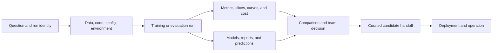
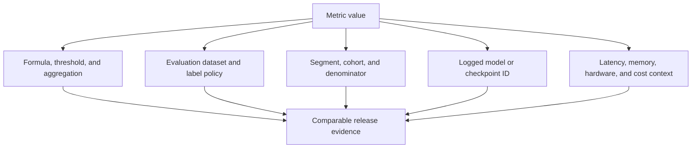
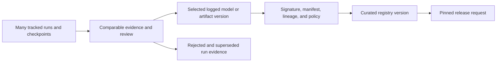

## Compare Experiment Systems By Responsibility
<!-- section-summary: MLflow and W&B both preserve experiment evidence, so a useful comparison starts with run, artifact, collaboration, handoff, and operating responsibilities. -->

**MLflow** and **Weights & Biases (W&B)** are platforms for recording and working with machine-learning experiments. Both can store runs, parameters, metrics, artifacts, dataset references, and models. Both can support comparison and lifecycle handoffs. A product-tour comparison quickly turns into a list of overlapping buttons.

The stronger comparison starts with the work an experiment system must support:

1. Give every execution a stable **run identity** and purpose.
2. Connect the run to **data, code, configuration, and environment evidence**.
3. Record **metrics, curves, slices, and resource use** with enough context for comparison.
4. Version **artifacts** and preserve their lineage through runs.
5. Support **collaboration, review, reports, and discovery**.
6. Organize **searches, sweeps, trials, and parent-child runs**.
7. Hand selected artifacts into a **registry and release process**.
8. Meet the organisation’s needs for **hosting, identity, retention, security, scale, support, and cost**.



MLflow and W&B implement this chain with different product emphasis and operating models. The framework lets a team compare them against the same needs and also reveals whether an existing managed cloud platform already covers part of the work.

## Run Identity Holds One Execution Together
<!-- section-summary: A run links one training or evaluation attempt to its intent, inputs, measurements, outputs, owner, and orchestration state. -->

A **run** represents one execution of training, evaluation, preprocessing, or another model-development task. The run ID should connect the tracking system with the orchestrator, logs, storage, and later registry version. A readable name helps people browse; the stable ID protects identity.

MLflow organizes runs inside experiments and supports parameters, metrics, tags, datasets, artifacts, and logged models. W&B organizes runs inside projects and supports configuration, summary and history metrics, tags, groups, jobs, artifacts, and workspace views. Both need a team-defined run contract because the tools cannot infer which evidence your release process requires.

```yaml
run_contract:
  purpose: test-seller-reliability-features
  owner: marketplace-ranking
  orchestrator_run_id: ranking-train-2026-07-17-0042
  source_commit: 3a6c9f2
  dataset_version: search-judgments-2026-07-10-r3
  feature_set: ranking-features-v8
  label_policy: purchase-within-24h-v4
  container_digest: sha256:30af...
  evaluation_protocol: marketplace-ranking-review-v6
```

The wrapper around either client should reject a run that lacks required identities before expensive training starts. It should write the tracking run ID back into the orchestrator record. This two-way link lets an operator start from a failed pipeline or a surprising chart and reach the same evidence.

Run status also needs care. A process can crash before the client records completion. A retry can create a second run for the same logical attempt. The integration should carry an operation ID, mark interrupted runs honestly, and connect retries or resumes through parent and checkpoint lineage. Deleting failed runs removes useful operational evidence.

## Reproducibility Evidence Extends Beyond Parameters
<!-- section-summary: Useful tracking records connect a run to immutable data, source, resolved behaviour, software, hardware, and replay policy. -->

Hyperparameters describe only part of a run. A production receipt also needs the data snapshot and label cutoff, source commit and dirty state, fully resolved configuration, feature definitions, dependency lock, container digest, hardware, random-stream policy, distributed topology, and checkpoint lineage.

MLflow provides dataset tracking and can link dataset metadata to runs. Current MLflow 3 tracking also gives logged models their own model IDs and can associate metrics with specific models and datasets. W&B Artifacts can represent versioned run inputs and outputs, including datasets and models, and W&B lineage graphs connect artifacts through runs.

Neither product automatically freezes a mutable table or object prefix. The integration should resolve a table snapshot, lakehouse version, lakeFS commit, DVC revision, or dataset manifest before logging it. Recording `warehouse.training.latest` preserves a name while the content continues to move.

The distinction between copied artifacts and reference artifacts matters. Copying data into a tracking-managed artifact can improve retention and identity while increasing storage and data-governance surface. Referencing an external governed snapshot keeps the authoritative bytes in the data platform while requiring that platform to retain and authorize them. Choose one ownership model and test replay after the original worker is gone.

## Metrics Need Definitions And Context
<!-- section-summary: Metric names and values support a decision only when the run also records datasets, slices, denominators, aggregation, uncertainty, and evaluation code. -->

Both systems can chart scalar metrics over steps and compare runs. W&B emphasizes interactive workspaces, panels, tables, reports, and collaborative visualization. MLflow provides run and model search, comparison views, metric histories, and dataset-aware model tracking. The user experience differs, while the evidence requirement stays the same.

A metric called `accuracy` is incomplete. The record should identify the evaluation dataset and version, label policy, metric implementation, threshold, aggregation, denominator, important slices, and uncertainty method. Training curves need step meaning because epoch, batch, token, and wall-clock progress are different axes.



This context prevents false leaderboards. Two runs should not compare directly when they used different holdouts or metric code. A tracking system can make the mismatch visible when the team logs the relevant identities. It cannot decide that a comparison is scientifically or operationally fair.

## Artifacts Carry The Evidence Files
<!-- section-summary: Artifacts connect run inputs and outputs through immutable versions, digests, manifests, retention, and access policy. -->

An **artifact** is a durable run input or output such as a model package, checkpoint, evaluation report, prediction table, feature-importance file, plot, or dataset manifest. The tracking record should identify the artifact version and digest, while an artifact store preserves the bytes.

MLflow separates metadata in its backend store from large files in an artifact store such as object storage. Logged models have model metadata and artifacts, and the Model Registry can later curate selected versions. W&B Artifacts version inputs and outputs, attach aliases and metadata, and expose lineage through runs. W&B Registry curates artifact versions into organisation-level registries and collections with permissions and audit history.

The tool should never be the only place where the team understands artifact completeness. A model release may need weights, tokenizer, label map, schema, preprocessing, runtime dependencies, and evaluation. A manifest should list those parts and their digests. The registry handoff then verifies the complete inference unit.

Retention follows meaning. Current and rollback releases need complete artifacts. Failed candidates may remain long enough for investigation. Disposable trial checkpoints can expire earlier. If bytes expire, the metadata should stop claiming that replay or loading remains available.

## Collaboration Changes The Review Workflow
<!-- section-summary: Collaboration features help teams compare, discuss, and report evidence, while policy still defines authority and approval. -->

W&B has strong collaborative workspace and report workflows for teams that spend substantial time exploring curves, media, tables, and shared analyses. Managed W&B deployments can also reduce the amount of tracking infrastructure a team operates. MLflow offers an open platform that many organisations self-host or receive through managed data and cloud platforms, with flexible APIs and a growing set of model, evaluation, and GenAI capabilities.

These tendencies should guide a proof of concept rather than act as universal verdicts. A managed MLflow service can offer integrated collaboration and governance. A self-managed W&B deployment has a different operating boundary from multi-tenant cloud. Licensing, supported authentication, network placement, export, and administrative features can change the fit.

Review authority stays outside chart comments. The tracker should link to the model review packet, issue, pull request, or policy decision. Notes explain the experiment and known limitations. A registry state or approval record states what the candidate may do next. This separation keeps an edited dashboard description from changing release authority.

## Sweeps Organize Many Related Trials
<!-- section-summary: Search and sweep systems create related runs under one study contract, while the team controls search space, budget, pruning, and final evaluation. -->

Both platforms support or integrate with hyperparameter search. W&B Sweeps coordinates trials and visualizes results. MLflow commonly records trials launched by systems such as Optuna, Hyperopt, Ray Tune, or managed training services; parent-child runs can group related attempts.

The tracker should preserve the **study contract**: objective, direction, search space, sampler, pruning rule, maximum trials, compute budget, dataset, baseline, and protected final test policy. Each trial remains a run with its own config, metrics, and artifact. The parent study links them without pretending they are independent product decisions.

Search tools can overfit the validation set through repeated selection. The final candidate should run against protected evidence after the search stops. Tracking makes every trial visible, which supports honest accounting of how many choices influenced the selected model.

## Registry Handoff Curates A Smaller Set
<!-- section-summary: Experiment systems preserve the broad history of attempts, while registry workflows curate reviewed artifacts for release and rollback. -->

Most runs should never enter a model registry. The handoff selects one logged model, verifies its artifact and signature, attaches evaluation and lineage, and gives it a stable candidate version. MLflow has a Model Registry with versions, tags, and aliases. Current MLflow guidance deprecates fixed Model Stages and uses aliases and tags for flexible lifecycle workflows.

W&B Registry curates W&B Artifact versions into registries and collections. It supports access control, lifecycle management, lineage, audit history, tags, and downstream automation. The registry still needs an organisation-specific approval and deployment design.



Deployment should pin a concrete registry or artifact version. Moving an alias can express current intent, while runtime and traffic systems own actual release state. This boundary applies to both products.

## Portability Depends On Evidence Contracts
<!-- section-summary: A tool migration succeeds when stable run, dataset, artifact, metric, and decision contracts survive outside the original dashboard. -->

Teams sometimes describe experiment metadata as portable because both platforms expose APIs. API access is only the first layer. A useful migration must preserve run grouping, dataset identities, metric histories, artifact versions and digests, lineage edges, notes, owners, and links to registry or deployment records.

Define an internal evidence schema for the facts the organisation considers mandatory. The tracker adapter can map that schema into MLflow tags, datasets, logged models, and artifacts or into W&B run config, summaries, artifacts, and lineage. Product-specific features can remain valuable, while the release process reads the stable contract rather than scraping a dashboard.

Export and restore should be part of platform testing. Select a parent study, several child runs, a dataset artifact, a model, and a review record. Export them, verify checksums, rebuild the important relationships in an isolated destination, and confirm that the team can still answer which candidate used which data and why it advanced. This exercise reveals fields or relationships trapped inside a report or proprietary query.

Portability has a cost. A lowest-common-denominator adapter can hide useful capabilities and create maintenance work. Protect the evidence and workflows that support a plausible migration, audit, or recovery. Allow product-specific visualization and collaboration where they improve day-to-day work.

## Operations Can Decide The Tool
<!-- section-summary: Hosting, authentication, storage, scale, backup, retention, export, support, and cost can outweigh differences in the tracking UI. -->

The selection decision should include who operates the service. A shared MLflow deployment needs a tracking server or managed service, a database-backed metadata store for team and registry use, artifact storage, authentication, authorization, upgrades, backups, telemetry, and capacity planning. W&B deployment options shift different amounts of that work to the vendor or to a self-managed environment.

Evaluate identity integration, workload authentication, network and data residency, encryption, audit export, artifact permissions, retention, backup and restore, API limits, high-cardinality metric behaviour, concurrent runs, support, licensing, and data-export paths. Tracking data can reveal source code, data locations, model behaviour, business metrics, and sensitive examples, so the security review should classify it explicitly.

Run a representative proof of concept. Submit concurrent training, resume a failed run, log a large artifact, compare slice metrics, trace a dataset into a model, promote one candidate, revoke one user, restore metadata and artifacts, and export evidence. Measure developer work and operator work separately.

## Choose From The Operating Model
<!-- section-summary: A sound choice matches the team’s experiment workflow, artifact lineage, review style, registry path, security boundary, and operating capacity. -->

Choose MLflow when its open ecosystem, APIs, managed-platform integrations, model tracking and registry path, and preferred hosting model fit the organisation. Choose W&B when its run exploration, collaborative reports, artifact workflows, managed service, or team experience solves the more important constraints. Some organisations integrate both or pair either one with a cloud registry, though duplicated sources of truth need explicit boundaries.

The framework keeps the decision grounded. Define the required run contract, reproduction evidence, metric context, artifact lineage, collaboration, study organization, registry handoff, and operational controls. Test both products against one real lifecycle. The selected system should help the team preserve and use evidence without turning the tool’s default fields into the experiment method.

## References

- [MLflow Tracking](https://mlflow.org/docs/latest/tracking/)
- [MLflow dataset tracking](https://mlflow.org/docs/latest/ml/dataset/)
- [MLflow search runs](https://mlflow.org/docs/latest/ml/search/search-runs/)
- [MLflow Model Registry workflows](https://mlflow.org/docs/latest/ml/model-registry/workflow/)
- [W&B experiment tracking](https://docs.wandb.ai/models/track/)
- [W&B Artifacts overview](https://docs.wandb.ai/models/artifacts/)
- [W&B artifact lineage graphs](https://docs.wandb.ai/models/artifacts/explore-and-traverse-an-artifact-graph)
- [W&B Sweeps](https://docs.wandb.ai/models/sweeps/)
- [W&B Registry overview](https://docs.wandb.ai/models/registry/)
- [W&B deployment options](https://docs.wandb.ai/platform/hosting/)
