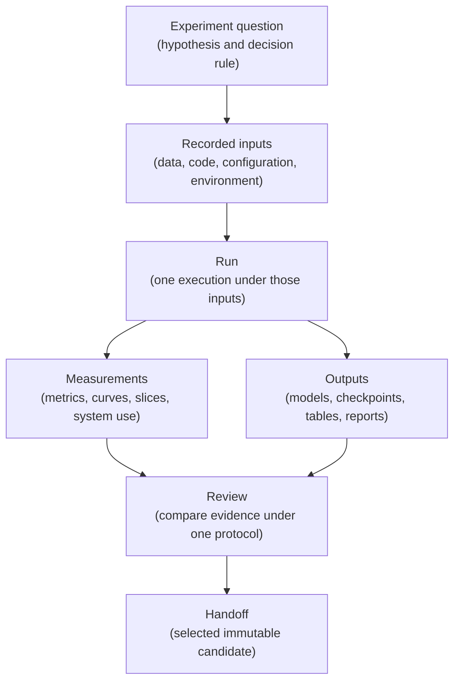
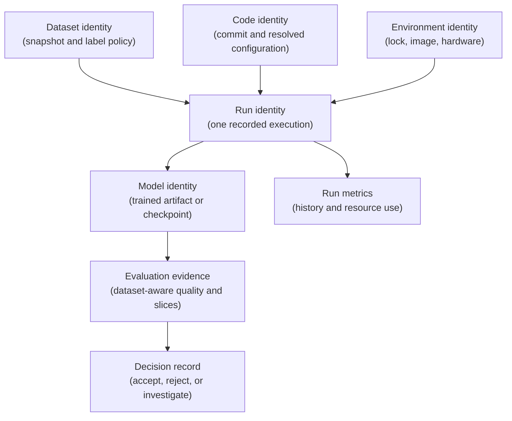
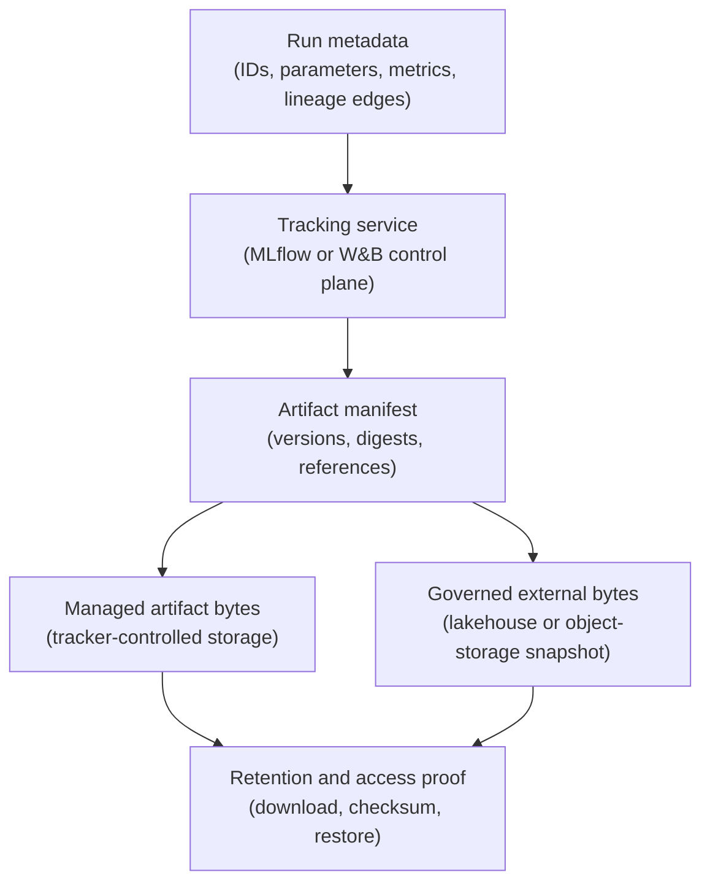
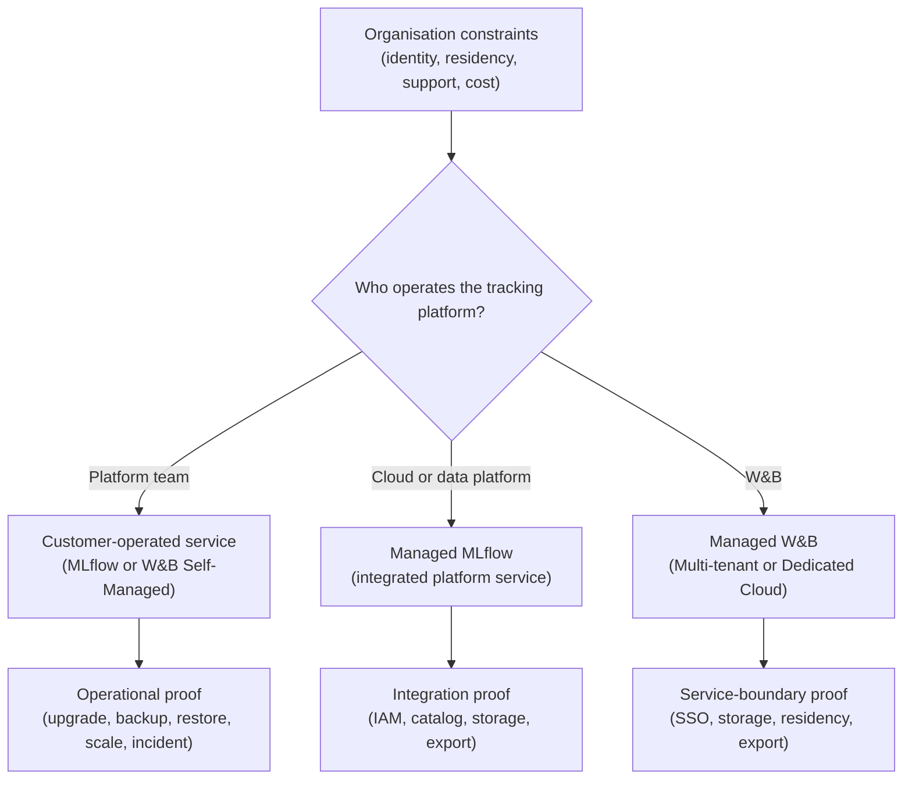
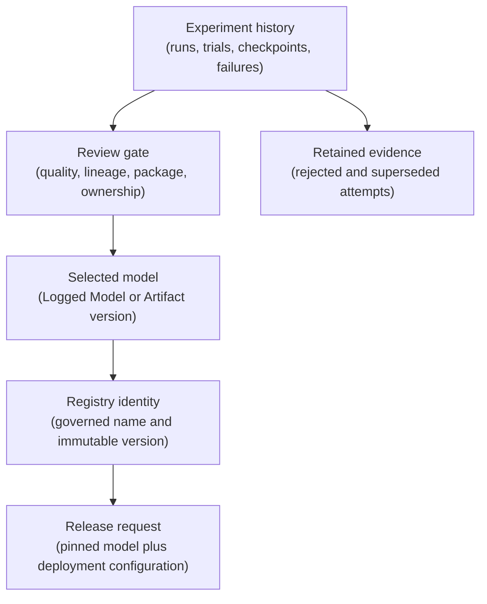

## Table of Contents

1. [Use Experiment Tracking To Preserve A Decision Trail](#use-experiment-tracking-to-preserve-a-decision-trail)
2. [Understand What Both Platforms Record](#understand-what-both-platforms-record)
3. [Track Trained Models Separately In MLflow 3](#track-trained-models-separately-in-mlflow-3)
4. [Use W&B For Shared Run Analysis](#use-wb-for-shared-run-analysis)
5. [Decide Where Large Artifacts And Sensitive Data Live](#decide-where-large-artifacts-and-sensitive-data-live)
6. [Use Search, Sweeps, Tables, And Reports For Different Tasks](#use-search-sweeps-tables-and-reports-for-different-tasks)
7. [Choose Who Operates And Governs The Tracking Platform](#choose-who-operates-and-governs-the-tracking-platform)
8. [Send Only Reviewed Model Candidates To The Registry](#send-only-reviewed-model-candidates-to-the-registry)
9. [Choose Between MLflow And W&B Based On Operating Requirements](#choose-between-mlflow-and-wb-based-on-operating-requirements)
10. [Define Which Platform Owns Each Record](#define-which-platform-owns-each-record)
11. [Migrate The Required Run Evidence](#migrate-the-required-run-evidence)
12. [Test The Platform With One Complete Model Workflow](#test-the-platform-with-one-complete-model-workflow)
13. [Main Idea](#main-idea)
14. [References](#references)

## Use Experiment Tracking To Preserve A Decision Trail
<!-- section-summary: Experiment tracking connects a model-development question to the exact evidence used to accept, reject, or investigate a candidate. -->

A model-review group has forty training runs from two feature branches. The highest recall belongs to a run that used a newer validation snapshot. Another run meets the overall target but fails for card-present transactions. The release reviewer has one hour before the candidate cutoff and must decide which model can advance. Choosing from a screenshot could promote a model evaluated on incomparable evidence; rejecting every run delays a fraud-control improvement.

At a high level, **experiment tracking is the practice of preserving the identity, inputs, measurements, outputs, and relationships of model-development work.** A useful tracker lets the reviewer answer five questions: What did the team try? What exact conditions produced the result? Which model and dataset does each metric describe? Which files support the claim? What decision followed?

MLflow and **Weights & Biases**, commonly called **W&B**, both support this work. They overlap across runs, metrics, artifacts, lineage, comparison, and model handoff. Their deeper differences appear in the object model, collaboration experience, deployment architecture, and amount of platform operation a team accepts.


```mermaid
flowchart TD
    A["Experiment question<br/>(hypothesis and decision rule)"] --> B["Recorded inputs<br/>(data, code, configuration, environment)"]
    B --> C["Run<br/>(one execution under those inputs)"]
    C --> D["Measurements<br/>(metrics, curves, slices, system use)"]
    C --> E["Outputs<br/>(models, checkpoints, tables, reports)"]
    D --> F["Review<br/>(compare evidence under one protocol)"]
    E --> F
    F --> G["Handoff<br/>(selected immutable candidate)"]
```

The tracker supplies the record and the ways to inspect it. The team still owns the experiment question, fair comparison policy, release thresholds, retention rules, and approval authority. That boundary remains the same with either platform.

## Understand What Both Platforms Record
<!-- section-summary: MLflow and W&B use different names around a common evidence graph linking one execution to its inputs, measurements, outputs, and decision. -->

Before comparing products, the fundamental objects need clear jobs. An **experiment** groups related attempts around one question or protocol. A **run** is one execution, such as one training job, evaluation job, or preprocessing step. A run ID provides the stable address; a human-readable name helps people browse.

### Record The Choices Given To Each Run

A **parameter** is a resolved choice used by the run: learning rate, model family, feature flag, batch size, or label window. Track the final value after configuration files, defaults, command-line flags, and environment overrides have been combined. A path to `config.yaml` leaves the actual choice hidden.

A run also needs immutable input identities. The source commit identifies code. The dataset snapshot identifies rows and labels. A dependency lock and container digest identify software. Hardware, random-stream policy, and distributed topology describe the execution boundary. These facts form the reproduction evidence around the parameter set.

### Record Metrics With Their Evaluation Context

A **metric** is a numerical observation about one part of a run. Training loss and validation recall describe model behaviour. Latency and GPU memory describe the cost of producing that behaviour. A history metric records values over a step axis, while a summary metric records the value used for comparison. The name alone is insufficient. For example, `recall = 0.82` needs the model identity and evaluation dataset. The label policy and decision threshold explain how outcomes became predictions. The segment and denominator show which population the number represents, and the metric implementation completes the definition.

This context protects the review group from a false leaderboard. Runs evaluated on different datasets or decision thresholds can sit on the same chart and still be incomparable. A platform can expose the mismatch after the relevant identities are logged; the review policy decides whether a comparison is valid.

### Link Files And Their Origins To Each Run

An **artifact** is a durable input or output: a model package, checkpoint, split manifest, prediction table, plot, or evaluation report. A useful artifact has a version or digest, a retention policy, and enough metadata to interpret its contents.

**Lineage** is the set of relationships among those identities. A dataset artifact enters a training run. The run emits a model. An evaluation run consumes that model and a validation snapshot. The review links the selected model to a candidate record. Lineage turns separate files and charts into one traceable result.


```mermaid
flowchart TD
    A["Dataset identity<br/>(snapshot and label policy)"] --> D["Run identity<br/>(one recorded execution)"]
    B["Code identity<br/>(commit and resolved configuration)"] --> D
    C["Environment identity<br/>(lock, image, hardware)"] --> D
    D --> E["Model identity<br/>(trained artifact or checkpoint)"]
    D --> F["Run metrics<br/>(history and resource use)"]
    E --> G["Evaluation evidence<br/>(dataset-aware quality and slices)"]
    G --> H["Decision record<br/>(accept, reject, or investigate)"]
```

This shared evidence graph is the stable comparison framework. MLflow and W&B place different product objects and workflows on top of it.

## Track Trained Models Separately In MLflow 3
<!-- section-summary: MLflow 3 links runs, datasets, logged models, and model-specific metrics so several checkpoints inside one run remain independently searchable. -->

MLflow organizes runs inside **experiments**. Runs hold parameters, tags, metric histories, dataset inputs, and ordinary artifacts. MLflow 3 adds a model-centric layer through the **Logged Model**.

A Logged Model is a tracked model object with its own `model_id`. One run can produce several checkpoints, and each checkpoint can carry model-specific parameters and metrics. Dataset-aware metrics can identify both the model and the dataset used to calculate the value. This is useful for deep learning, cross-validation, and any workflow where “the run metric” is too broad because several model objects exist inside one execution.

The smallest complete path is: start a run, log the immutable dataset identity, log the resolved parameters, create the model object, and attach evaluation metrics to that exact model and dataset.

```python
import mlflow
import mlflow.sklearn

validation = mlflow.data.from_pandas(
    validation_df,
    source="warehouse://risk/validation@snapshot-184",
    name="fraud_validation",
)

with mlflow.start_run(run_name="feature-review"):
    mlflow.log_input(validation, context="validation")
    mlflow.log_params({"max_depth": 8, "label_window_days": 30})

    model_info = mlflow.sklearn.log_model(
        sk_model=model,
        name="fraud_candidate",
        signature=signature,
        input_example=validation_df.head(3),
    )

    mlflow.log_metric(
        "recall",
        0.82,
        model_id=model_info.model_id,
        dataset=validation,
    )
```

The experiment groups related runs. The run records this execution. The dataset object gives the validation evidence a name, source, and digest. The Logged Model identifies the trained object. `model_id` connects recall to that object, while `dataset=validation` connects it to the evidence used for calculation.

MLflow can then search Logged Models through model parameters, metrics, attributes, and dataset conditions. A reviewer can ask for models that clear a recall threshold on one named validation dataset, then inspect the source run and supporting artifacts.

### Package Models For Different Deployment Targets

An MLflow Model packages model files with flavor metadata. A model signature describes expected inputs and outputs. The same immutable package can be loaded into a batch job, an application service, a managed endpoint, or an MLflow-compatible serving path. The release system still owns infrastructure, traffic, secrets, health checks, and rollback.

The MLflow Model Registry can curate selected model versions through names, versions, tags, and aliases. Fixed Model Stages are deprecated, so new workflows should use aliases, tags, and environment-specific governance. Registry and deployment design receive deeper treatment in the following lessons; the important boundary here is that a Logged Model belongs to experiment evidence, while a registered version belongs to the smaller candidate handoff.

## Use W&B For Shared Run Analysis
<!-- section-summary: W&B combines tracked runs with versioned artifacts, rich tables and media, workspaces, reports, and managed collaboration workflows. -->

W&B organizes runs inside **projects**. `wandb.init` creates a run with a unique ID, configuration, state, and links to logged history. `run.log` records metrics and rich objects over steps. The SDK writes local run data and synchronizes it to W&B Cloud or a private W&B Server deployment.

W&B **Artifacts** describe versioned inputs and outputs of runs. `run.use_artifact` declares an input edge. `run.log_artifact` creates an output edge. Those declarations power the lineage graph and distinguish a file uploaded for display from a model or dataset that participated in the computation.

```python
import wandb

with wandb.init(
    project="fraud-feature-review",
    job_type="training",
    config={"max_depth": 8, "label_window_days": 30},
) as run:
    validation = run.use_artifact(
        "fraud-validation:v12",
        type="dataset",
    )

    run.log({"epoch": epoch, "validation_recall": 0.82})
    run.log({
        "segment_results": wandb.Table(
            columns=["segment", "recall", "false_positive_rate"],
            data=segment_rows,
        )
    })

    candidate = wandb.Artifact(
        "fraud-candidate",
        type="model",
        metadata={"evaluation_protocol": "fraud-review-v6"},
    )
    candidate.add_file("model.onnx")
    run.log_artifact(candidate)
```

The explicit `v12` input identifies one dataset artifact version. The Table preserves row-oriented segment evidence that reviewers can filter and visualize. The model artifact records the output file and its metadata. W&B now has lineage from the dataset version through the run to the model artifact.

A W&B Artifact is a general versioned bundle. The team still defines whether a model artifact is complete enough for inference. A tabular model may need its preprocessing graph and input schema beside the weights. A language model may need tokenizer files and generation settings. Every serving package also needs a declared runtime and a digest manifest so the release system can verify that it received the reviewed bytes.

### Review Example-Level Results With Tables, Media, And Reports

W&B Tables can combine typed columns with images, audio, video, and other rich media. This matters for error analysis. A computer-vision reviewer can filter false negatives, inspect the source image beside the prediction, and compare two runs on the same examples. Aggregate metrics reveal that a problem exists; example-level evidence helps explain it.

Workspaces organize interactive panels over runs. Reports combine those panels with a written interpretation and can be shared with collaborators. These objects are especially useful for teams whose review work depends on curves, generated samples, qualitative errors, and a continuing written record.

Comments and reports support discussion. Approval authority should live in a governed review or registry record with an accountable owner. Editing a report explains the evidence; it should never silently change what the candidate is allowed to do.

## Decide Where Large Artifacts And Sensitive Data Live
<!-- section-summary: The choice to upload bytes or reference governed storage determines retention, access, cost, and replay behaviour in either platform. -->

Tracking metadata is usually small. Model weights, checkpoints, prediction tables, and datasets can be large. The platform design must decide where those bytes live and which system remains authoritative.

MLflow stores run and model metadata in a backend store and large files in an artifact store. A tracking server can proxy artifact access so clients use server credentials, or clients can access the remote store directly. Proxying centralizes access through the tracking service, although every user allowed through that service may inherit the artifact permissions of its server role. Direct access shifts credentials and authorization to each client workload.

W&B Artifacts can store files managed through W&B or track references to external object storage. Managed deployments can also use customer-controlled storage options. A reference protects an external identity only while the referenced bytes remain immutable and accessible. W&B reports an error if an external artifact can no longer be reconstructed after the source changes.


```mermaid
flowchart TD
    A["Run metadata<br/>(IDs, parameters, metrics, lineage edges)"] --> B["Tracking service<br/>(MLflow or W&B control plane)"]
    B --> C["Artifact manifest<br/>(versions, digests, references)"]
    C --> D["Managed artifact bytes<br/>(tracker-controlled storage)"]
    C --> E["Governed external bytes<br/>(lakehouse or object-storage snapshot)"]
    D --> F["Retention and access proof<br/>(download, checksum, restore)"]
    E --> F
```

Uploading a moderate model package to the artifact system gives the tracker direct retention and checksum control. Copying a sensitive multi-terabyte training table expands cost and governance surface. A governed snapshot reference is usually the stronger choice for that table, provided the data platform guarantees retention, immutable identity, and workload access.

The practical test is reconstruction from a clean worker. Resolve the recorded data identity, download every required model file, verify checksums, and run a small evaluation. A green dashboard with expired artifact bytes cannot support replay or release.

## Use Search, Sweeps, Tables, And Reports For Different Tasks
<!-- section-summary: Search finds comparable evidence, sweeps coordinate trial generation, tables expose examples, and reports preserve the interpretation. -->

Experiment platforms place search, automated trials, example analysis, and written reports close together. That layout can make them feel like four versions of the same feature. In practice, they support four stages of reasoning: find comparable evidence, generate new trials, inspect individual outcomes, and preserve the team's interpretation. A sound workflow gives each stage a clear job.

**Search and run comparison** ask, “Which recorded attempts satisfy this fair comparison?” The query should constrain the experiment, dataset identity, evaluation protocol, model family, and important guardrails before sorting by a metric. MLflow supports run search and model-centric Logged Model search. W&B workspaces and run tables support filtering, grouping, and comparison over project runs.

**Sweeps** ask, “Which configurations should the system try under a fixed study contract?” W&B Sweeps provides a coordinator and a search configuration; agents execute the resulting trials across machines. MLflow commonly records trials created by an external optimizer or managed training system, and nested runs can connect each trial to its parent study. In either design, the team declares the objective and the allowed search space before execution. It also fixes the compute budget, pruning policy, dataset, and protected final evaluation so the optimizer cannot quietly change the rules of comparison.

**Tables and media** ask, “Which examples explain the aggregate result?” W&B provides first-class Tables and rich-media views. MLflow can log prediction tables, evaluation artifacts, and images, although the interactive review experience depends more heavily on the MLflow UI or its managed platform.

**Reports** ask, “What did the team learn and why did it choose this candidate?” W&B Reports provide a collaborative narrative around live panels. An MLflow-based team may use experiment notes plus a model card, pull request, or separate review system. The durable decision record should link to immutable run and model identities in either case.

Consider a search across fifty fraud-model trials. The sweep finds three configurations with similar recall. A run query restricts comparison to the same dataset and label policy. An error table reveals that one candidate blocks too many low-value international purchases. The review report records why another candidate advances. Search, sweep, table, and report each contribute a different piece of that decision.

## Choose Who Operates And Governs The Tracking Platform
<!-- section-summary: MLflow and W&B can run under several hosting models, and each model assigns upgrades, identity, storage, backup, and security to different owners. -->

The interface is only one part of the choice. A production tracker is a shared service, so somebody must keep it available and upgrade it safely. Identity, authorization, and encryption protect the evidence. Storage and retention rules preserve it. Backup, restore, capacity planning, and support determine whether the service survives growth and incidents. The deployment model decides which of these responsibilities belong to the customer and which belong to a provider.

### Run MLflow Yourself Or Use A Managed Service

Open-source MLflow can start locally and grow into a shared tracking service. A team deployment uses an MLflow Tracking Server, a database-backed metadata store, and an artifact store. The server exposes REST APIs and the UI. Database storage supports reliable team use and the Model Registry; the legacy file backend is in maintenance mode.

The operating team must design TLS, identity integration, permissions, database migrations, backups, object-store access, monitoring, and scaling. MLflow includes security controls and authentication features, while many organisations place the server behind existing network and identity infrastructure. A managed MLflow offering can transfer much of this work to a cloud or data platform and may integrate with its catalog and IAM model.

### Choose A W&B Deployment Model

W&B Multi-tenant Cloud is a managed shared service. W&B Dedicated Cloud uses isolated infrastructure managed by W&B. W&B Self-Managed runs W&B Server on infrastructure operated by the customer. Enterprise security and administrative features depend on the selected deployment and license.

Multi-tenant and Dedicated Cloud transfer routine platform operation toward W&B. The provider applies service upgrades and manages capacity. It also operates the backup machinery and secures the underlying platform. Customer administrators remain responsible for account access and project boundaries. The customer also governs the data sent to the service.

Self-Managed moves the service infrastructure back to the customer's platform team. Engineers provision the application with its database and object storage. They schedule upgrades and maintenance windows. They also need a security-patching process and regular restore drills. This choice serves organisations whose network or regulatory boundary requires customer-operated infrastructure, and it carries a real operating cost.


```mermaid
flowchart TD
    A["Organisation constraints<br/>(identity, residency, support, cost)"] --> B{"Who operates the tracking platform?"}
    B -->|Platform team| C["Customer-operated service<br/>(MLflow or W&B Self-Managed)"]
    B -->|Cloud or data platform| D["Managed MLflow<br/>(integrated platform service)"]
    B -->|W&B| E["Managed W&B<br/>(Multi-tenant or Dedicated Cloud)"]
    C --> F["Operational proof<br/>(upgrade, backup, restore, scale, incident)"]
    D --> G["Integration proof<br/>(IAM, catalog, storage, export)"]
    E --> H["Service-boundary proof<br/>(SSO, storage, residency, export)"]
```

Governance needs a concrete threat model. Run metadata can reveal source paths and data locations. Logged metrics may expose business performance, while prediction tables may contain sensitive examples. Test whether projects truly isolate teams and whether training jobs receive narrow workload identities. Then verify artifact permissions, audit export, deletion, and retention with the exact deployment under consideration.

## Send Only Reviewed Model Candidates To The Registry
<!-- section-summary: Tracking preserves many attempts, while a registry handoff selects one immutable model and the evidence required for release. -->

Experiment history is intentionally broad. It includes failed runs, abandoned hypotheses, intermediate checkpoints, sweep trials, and diagnostic artifacts. A model registry should receive the much smaller set of candidates that passed review.

In MLflow, the Logged Model identifies a model inside experiment tracking. Registering a selected model creates a registered-model version under a governed name. Tags describe review state, and aliases provide movable names for selected versions. The release request should still pin the concrete version or digest.

In W&B, a model Artifact version can be linked into a Registry collection. The collection curates versions from projects and exposes their lineage and usage. A downstream release workflow consumes the selected immutable artifact version.


```mermaid
flowchart TD
    A["Experiment history<br/>(runs, trials, checkpoints, failures)"] --> B["Review gate<br/>(quality, lineage, package, ownership)"]
    B --> C["Selected model<br/>(Logged Model or Artifact version)"]
    C --> D["Registry identity<br/>(governed name and immutable version)"]
    D --> E["Release request<br/>(pinned model plus deployment configuration)"]
    A --> F["Retained evidence<br/>(rejected and superseded attempts)"]
```

Both registries preserve identity and curation. Deployment remains a separate control boundary. The serving system combines the reviewed model package with inference code and runtime infrastructure. It also owns secrets and traffic policy, then observes the release and keeps a tested rollback target. An alias expresses current intent; it is a movable pointer and cannot replace a pinned release record.

MLflow's model packaging supports several deployment paths because the model artifact can be loaded through its flavor interfaces. A W&B model Artifact can also feed any deployment system that understands the files inside it. W&B versioning supplies identity and lineage; the team supplies the serving contract and loader.

## Choose Between MLflow And W&B Based On Operating Requirements
<!-- section-summary: The strongest selection criteria are evidence needs, collaboration style, existing platform, security boundary, deployment path, and operating capacity. -->

Start with the bottleneck the team is trying to remove. A group already operating a lakehouse or cloud platform with managed MLflow may gain run tracking, model packaging, registry integration, and governed storage with few new systems. A research-heavy group that reviews images, generated samples, large run sets, and shared reports may value W&B's collaborative analysis more strongly.

The hosting boundary can dominate both preferences. A small platform team may prefer a managed service because operating a reliable tracker would displace work on training and serving. An organisation with strict network isolation may compare self-managed MLflow with W&B Self-Managed and evaluate the full database, storage, upgrade, backup, and support burden.

Artifact and dataset scale also changes the fit. Test real checkpoints, long metric histories, prediction tables, and reference datasets. Measure upload behaviour after network interruption, query latency across a realistic run count, storage growth, retention controls, and export time.

The final choice should cover the full path: run creation, evidence capture, comparison, qualitative review, candidate handoff, access control, incident recovery, and export. A beautiful run chart cannot compensate for missing lineage or an untested restore path.

## Define Which Platform Owns Each Record
<!-- section-summary: Teams can combine MLflow and W&B if each run, artifact, registry version, and deployment state has one authoritative owner. -->

Some teams have a real reason to use both platforms. A research group may track exploration and qualitative review in W&B while a production platform requires MLflow Model packaging and an MLflow-compatible registry. Another organisation may inherit both systems through acquisitions or separate business units.

The safe design gives every object one authority. One tracker owns the complete run history. The data platform owns immutable datasets. One artifact system owns the selected model bytes. One registry owns candidate identity. The deployment system owns production traffic and rollback state.

For a W&B-to-MLflow handoff, a promotion job can resolve one exact W&B Artifact version, verify its digest, package the model with an MLflow signature, and create a linked MLflow candidate. The MLflow record stores the W&B project, run ID, artifact version, and digest. The W&B run stores the resulting MLflow model or registry identity. Reviewers can cross the boundary in either direction.

Dual logging every metric to both systems creates harder failure modes. One SDK may lose connectivity while the other succeeds. Step counters, summaries, retries, and artifact versions can drift. If dual logging is unavoidable, use a shared operation ID, make writes idempotent, cross-link both run IDs, reconcile required fields, and define which record wins after disagreement.

Coexistence earns its cost only if it solves a durable boundary. Temporary curiosity about another dashboard is a weak reason to maintain two histories.

## Migrate The Required Run Evidence
<!-- section-summary: A trustworthy migration preserves mandatory evidence and lineage while documenting product-specific views and controls that have no exact mapping. -->

MLflow and W&B expose APIs for reading runs and artifacts, yet they do not share a universal experiment-storage format. Their model objects, artifact graphs, reports, sweep controllers, permission models, aliases, and registry collections have different semantics.

Define a small internal evidence contract before moving data. It should cover the original run ID, parent or study ID, owner, source commit, resolved configuration, dataset identities, metric histories with step axes, model and artifact digests, lineage edges, evaluation protocol, review outcome, and external deployment links.

The migration then follows a controlled sequence. Inventory the source objects and retention policies. Export metadata and artifact manifests. Copy required bytes while verifying digests. Import into new platform identities. Store a crosswalk from old IDs to new IDs. Rebuild the mandatory lineage edges. Keep the old system read-only until representative audits and restores pass.

Some product experience will remain in the source. A W&B Report with interactive panels has no direct MLflow equivalent. An MLflow Logged Model with dataset-aware metrics may need several W&B objects. Sweep-agent state, comments, project roles, and aliases also need explicit migration decisions. Preserve a rendered report or source link where historical interpretation matters, and avoid claiming full fidelity after only scalar metrics were copied.

Test the questions the migration is supposed to preserve. Can an engineer start from a candidate and find its source run, code, data, environment, evaluation, and owner? Can the team restore the model bytes and verify their digest? Can a reviewer explain why the candidate advanced? Passing those questions matters more than matching the old screen layout.

## Test The Platform With One Complete Model Workflow
<!-- section-summary: A representative proof of concept exposes developer, reviewer, operator, governance, and migration costs before many projects depend on the platform. -->

A useful proof of concept follows one real model through both success and failure. Track a baseline and candidate on an immutable dataset. Log a metric history, segment evidence, one large model artifact, and the environment record. Run a small sweep or grouped study. Interrupt and resume one trial. Compare only runs that share the evaluation protocol.

Then exercise the human workflow. Ask a reviewer to find the strongest candidate, inspect its worst examples, explain the tradeoff, and create the candidate handoff. Ask an operator to trace a failed job to the tracker, restore metadata and artifacts, revoke a user's access, and confirm retention behaviour.

Finally, export the selected run and model into an isolated location. Verify checksums and reconstruct the data-to-model lineage. Measure integration effort, reviewer time, query performance, artifact transfer, platform maintenance, backup recovery, support, and expected cost.

The result should be a written operating decision. It names the chosen deployment model, authoritative objects, required evidence contract, security boundary, recovery objective, and exit path. That decision gives the platform a clear job before hundreds of projects depend on it.

## Main Idea
<!-- section-summary: MLflow and W&B solve the same evidence problem through different model, collaboration, and operating designs. -->

Experiment tracking preserves the path from a question to a model decision. Runs identify executions. Parameters record the recipe. Metrics record behaviour in context. Artifacts preserve inputs and outputs. Lineage connects them.

MLflow 3 adds a strong model-centric path through Logged Models, dataset-aware metrics, open packaging, and registry integration. W&B combines runs and artifact lineage with rich Tables, media, workspaces, Reports, Sweeps, and managed collaboration.

The right platform fits the team's evidence contract, review style, existing infrastructure, deployment path, governance boundary, and operating capacity. Coexistence and migration remain possible after every important object has one authoritative identity and every handoff preserves its lineage.

## References

- [MLflow: Experiment tracking](https://mlflow.org/docs/latest/tracking/)
- [MLflow: MLflow 3 migration and model tracking](https://mlflow.org/docs/latest/ml/mlflow-3/)
- [MLflow: Search Logged Models](https://mlflow.org/docs/latest/ml/search/search-models/)
- [MLflow: Dataset tracking](https://mlflow.org/docs/latest/ml/dataset/)
- [MLflow: Tracking Server architecture](https://mlflow.org/docs/latest/self-hosting/architecture/tracking-server/)
- [MLflow: Backend stores](https://mlflow.org/docs/latest/self-hosting/architecture/backend-store/)
- [MLflow: Artifact stores](https://mlflow.org/docs/latest/self-hosting/architecture/artifact-store/)
- [MLflow: Model Registry workflows](https://mlflow.org/docs/latest/ml/model-registry/workflow/)
- [W&B: Runs](https://docs.wandb.ai/models/runs/)
- [W&B: Log metrics and media](https://docs.wandb.ai/models/track/log/)
- [W&B: Artifacts](https://docs.wandb.ai/models/artifacts/)
- [W&B: Artifact lineage graphs](https://docs.wandb.ai/models/artifacts/explore-and-traverse-an-artifact-graph)
- [W&B: Tables](https://docs.wandb.ai/models/tables/log_tables/)
- [W&B: Reports](https://docs.wandb.ai/models/reports/)
- [W&B: Sweeps](https://docs.wandb.ai/models/sweeps/)
- [W&B: Registry](https://docs.wandb.ai/models/registry/)
- [W&B: Deployment options](https://docs.wandb.ai/platform/hosting/)
- [W&B: Public API import and export](https://docs.wandb.ai/models/track/public-api-guide/)
