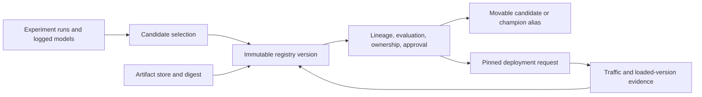

## What A Model Registry Stores
<!-- section-summary: A model registry stores controlled model versions, artifact links, run evidence, approvals, aliases, ownership, and deployment readiness metadata. -->

A **model registry** is the controlled catalog for model versions that may be tested, deployed, audited, or rolled back. It gives a model a stable name, a version number, a link to the actual artifact, and the evidence that explains why the version exists. It also records who owns the model, which approvals it has, and which deployment alias or stage points to it.

The registry sits between experiment tracking and serving. Experiment tracking may contain hundreds of runs from training and tuning. Serving systems need a smaller set of reviewed versions with clear release state. The registry is the handoff point where a promising run receives a production identity such as `trailmarket-search-ranker:42`.

The beginner-friendly version is this: the artifact store keeps the files, and the registry explains the files. The registry tells the team that a specific model file came from a specific run, trained on a specific dataset version, passed specific checks, and has a specific release status. When a deployment reads `models:/trailmarket-search-ranker@production`, it should land on the exact version that the team approved.

A registry is a control-plane system with several separate responsibilities:

| Responsibility | Stable record | Why it exists |
|---|---|---|
| **Candidate identity** | Model name and immutable version | Gives every reviewed candidate one durable subject |
| **Artifact integrity** | Artifact location, digest, signature, input example | Proves which exact bytes and interface the version contains |
| **Lineage** | Training run, code, data, config, environment | Explains how the candidate was produced |
| **Evaluation evidence** | Metrics, slices, robustness, latency, limitations | Shows which release claims reviewers checked |
| **Ownership and approval** | Owner, approvers, policy result, decision time | Makes authority and accountability explicit |
| **Movable intent** | Aliases such as `candidate` or `champion` | Lets automation express current intent without changing version identity |
| **Deployment links** | Environments and release records using the version | Connects registry state to real runtime state without pretending the registry routes traffic |

The boundaries matter. Object storage owns large bytes. Experiment tracking owns the full history of attempts. The registry owns the smaller set of governed candidates. Deployment systems own traffic, environment configuration, and rollback execution.



The registry is the control-plane bridge in the middle. It connects a smaller set of candidates with their durable artifacts and evidence. Aliases help discovery, while deployment pins a concrete version and reports actual runtime state back to operations.

## Apply The Registry Framework To Marketplace Ranking
<!-- section-summary: A marketplace ranking model needs a registry because many training runs produce only a few reviewed candidates for search traffic. -->

TrailMarket is a marketplace for outdoor gear. Users search for tents, packs, stoves, and used climbing equipment. The ranking model decides which listings appear near the top of the results page. If the model over-promotes stale listings or hides trusted sellers, buyers leave and sellers complain about lost traffic.

The ranking team trains a model named `trailmarket-search-ranker`. It uses a dataset called `ranking_training_clicks_2026_06_29`, which joins search impressions, clicks, add-to-cart events, seller quality signals, listing freshness, price bands, and moderation status. The model artifact includes an XGBoost ranker, a feature order file, a preprocessing pipeline, and an evaluation report.

The team may train many runs in MLflow or W&B. Only one candidate should move to release review. The registry entry for that candidate needs to answer practical questions:

| Question | Registry evidence |
|---|---|
| Which model is this? | `trailmarket-search-ranker`, version `42` |
| Where did it come from? | Tracking run `mlflow-run-20260703-1842` |
| Which data trained it? | `ranking_training_clicks_2026_06_29`, label cutoff `2026-06-22` |
| What files deploy? | Model artifact uniform resource identifier (URI) plus feature and dependency files |
| Why is it trusted? | Offline metrics, segment checks, latency test, risk review |
| Who approved it? | Ranking owner, marketplace product owner, trust-and-safety reviewer |
| What can use it? | Alias `candidate`, later `shadow`, `canary`, or `production` |

That evidence helps both humans and automation. Humans can review the candidate. CI/CD can read the approved alias. Incident responders can find the previous production version if a release hurts search quality.


*A registry record gives TrailMarket version 42 a production identity and keeps the key release evidence in one place.*

## Model Name, Version, And Artifact
<!-- section-summary: The registry gives a model version a stable identity while artifact storage keeps the deployable files. -->

The first registry job is identity. A registered model name groups versions of the same task. A version is one immutable release candidate under that name. The artifact URI points to the files that training produced and serving will load.

A practical registry record for TrailMarket might look like this:

```yaml
registered_model:
  name: trailmarket-search-ranker
  version: 42
  task: marketplace_search_ranking
  owner: search-ml-platform
  source_run:
    tracker: mlflow
    experiment: marketplace-ranking
    run_id: mlflow-run-20260703-1842
  artifact:
    uri: s3://trailmarket-ml-artifacts/search-ranker/42/model/
    files:
      - model.xgb
      - feature_order.json
      - preprocessing_pipeline.pkl
      - requirements.lock
      - evaluation/segment_metrics.csv
  aliases:
    - candidate
  created_by: ci-train-ranking
  created_at: 2026-07-03T18:42:11Z
```

The registry record should be small enough to search and stable enough to trust. It should avoid storing giant model binaries directly in the registry database. The binary files belong in object storage or a managed artifact store. The registry keeps names, versions, links, tags, aliases, and review metadata.

This split matters during deployment. The ranking service may receive a model URI such as `models:/trailmarket-search-ranker@candidate`. The registry resolves that alias to version `42`. The artifact URI then tells the service where to download `model.xgb`, `feature_order.json`, and the preprocessing files. A stable registry identity keeps deployment code from hardcoding object storage paths.

## Run Evidence And Lineage
<!-- section-summary: A registry version should point back to the training run, data version, metrics, artifact digest, and evaluation files that justify the candidate. -->

Lineage means you can trace a model version back to the work that produced it. For TrailMarket, lineage should connect version `42` to the training run, dataset snapshot, feature code, metrics, and review files. Without lineage, the registry is just a list of files with nice names.

The ranking team cares about several metrics. Overall NDCG tells the team whether the ranked list improved. Query coverage shows whether the model can score enough searches. Seller exposure checks whether small sellers lose too much visibility. Moderation leakage checks whether flagged listings rise in ranking. Latency checks whether the model can run inside the search request budget.

```yaml
lineage:
  model: trailmarket-search-ranker
  version: 42
  training:
    run_id: mlflow-run-20260703-1842
    git_sha: 51de8f0
    image: ghcr.io/trailmarket/ranking-train@sha256:ef42c4cf4fc8b506248cd65738eb108cc2f6897dddc38b4073a99f98fb1ec86f
    feature_pipeline: ranking_features_v9
    training_table: warehouse.ml.ranking_training_clicks_2026_06_29
    label_cutoff: 2026-06-22
  metrics:
    ndcg_at_10: 0.421
    click_through_rate_lift_offline: 0.018
    small_seller_exposure_delta: -0.006
    moderation_leakage_rate: 0.0008
    p95_score_latency_ms: 34
  evidence_files:
    - s3://trailmarket-ml-reviews/search-ranker/42/model_card.md
    - s3://trailmarket-ml-reviews/search-ranker/42/segment_metrics.csv
    - s3://trailmarket-ml-reviews/search-ranker/42/offline_replay.sql
```

This record gives the reviewer a path. If small seller exposure drops too far, the reviewer can open `segment_metrics.csv`. If moderation leakage rises, the trust-and-safety reviewer can open the replay query and flagged listing examples. If latency breaches the request budget, the platform owner can compare model file size and feature count against the current production version.

Lineage also helps with audits and incidents. If the marketplace team later sees a search-quality regression for used climbing gear, the registry version should point to the exact run and dataset. The response should start from recorded evidence rather than guesses about which notebook produced the artifact.


*Lineage lets TrailMarket trace the search ranker from version 42 back through data, code, run evidence, and evaluation files.*

## Approval Metadata
<!-- section-summary: Approval metadata records the review decision, approvers, gates, risk notes, and next allowed deployment step. -->

Approval metadata tells the organization what a model version is allowed to do. A model can be registered as a candidate after offline evaluation, approved for shadow testing after review, approved for canary after live replay, and approved for production after release checks. Teams can use different names, yet the registry should record both the current decision and the evidence behind it.

For TrailMarket, approval includes more than model quality. Search ranking affects seller visibility, buyer experience, and trust-and-safety exposure. The candidate needs approval from the ranking model owner, marketplace product owner, and trust-and-safety reviewer before it receives live traffic.

```yaml
approval_packet:
  model: trailmarket-search-ranker
  version: 42
  requested_stage: shadow
  requested_by: maya.chen@trailmarket.example
  approvers:
    - name: Luis Ortega
      role: ranking-ml-owner
      decision: approved
      checked:
        - ndcg_at_10 >= 0.415
        - p95_score_latency_ms <= 40
    - name: Priya Raman
      role: marketplace-product-owner
      decision: approved
      checked:
        - small_seller_exposure_delta >= -0.010
        - category_coverage >= 0.985
    - name: Hana Volk
      role: trust-and-safety-reviewer
      decision: approved
      checked:
        - moderation_leakage_rate <= 0.001
        - flagged_listing_examples_reviewed
  risk_notes:
    - Watch used-climbing-gear queries during shadow replay.
    - Roll back to trailmarket-search-ranker:41 if category coverage drops below 0.980.
```

This packet teaches the registry how to serve both people and automation. People can read the decision. Automation can enforce that version `42` has the required approvals before a deployment pipeline assigns the `shadow` or `canary` alias. Audit teams can see who approved the release and which checks they reviewed.

In managed registries, this metadata may appear as tags, custom metadata, approval status fields, model cards, or linked artifacts. The exact field names vary by platform. The engineering standard should stay consistent inside the company: every promoted version needs owner, evidence, approvers, target stage, rollback target, and decision time.

## Registry Versus Artifact Storage
<!-- section-summary: Artifact storage holds the model files, while the registry stores identity, lifecycle state, metadata, aliases, and review history. -->

Teams often confuse the registry with artifact storage because both systems mention model files. The difference is practical. Artifact storage holds bytes. The registry holds meaning around those bytes.

For TrailMarket, the artifact store might contain this folder:

```yaml
s3://trailmarket-ml-artifacts/search-ranker/42/model:
  model.xgb: "sha256:3a1c..."
  feature_order.json: "sha256:9bf2..."
  preprocessing_pipeline.pkl: "sha256:f82d..."
  requirements.lock: "sha256:77c0..."
  evaluation/segment_metrics.csv: "sha256:2dd4..."
```

The registry record points to that folder and adds release context:

```yaml
registry_state:
  name: trailmarket-search-ranker
  version: 42
  artifact_uri: s3://trailmarket-ml-artifacts/search-ranker/42/model/
  artifact_digest: sha256:81a0e1f42d8a
  source_run: mlflow-run-20260703-1842
  approval_status: approved_for_shadow
  aliases:
    candidate: 42
    production: 41
  rollback_target: 41
```

The artifact store should be durable and locked down. The registry should be searchable and reviewable. If a serving service can download artifacts directly from object storage without checking registry state, it can accidentally load an unapproved model. A clean production path makes the registry the source for allowed model versions.

## Where Managed Registries Fit
<!-- section-summary: Managed registries provide model version catalogs inside cloud or platform workflows, with different strengths around lineage, approval, deployment, and sharing. -->

The registry idea shows up in several platforms. You can understand the workflow before memorizing every product. Start from the questions: where does the model version live, which metadata travels with it, how do approvals work, and how does deployment find the approved version?

| Registry surface | Where it often fits | Useful capability to understand |
|---|---|---|
| MLflow Model Registry | Teams using MLflow tracking, Databricks, or an open ML platform | Registered models, versions, aliases, tags, and model URIs |
| W&B Registry | Teams using W&B artifacts and collaborative model review | Artifact versions, collections, aliases, governance, and automation hooks |
| SageMaker Model Registry | AWS teams using SageMaker training, pipelines, model packages, and endpoints | Model package groups, model versions, approval status, lineage, model cards |
| Vertex AI Model Registry | Google Cloud teams using Vertex AI training, BigQuery ML, endpoints, and model metadata | Central model catalog, versions, evaluation, deployment to endpoints |
| Azure ML registries | Azure teams sharing models, environments, and components across workspaces | Cross-workspace asset sharing and promotion across environments |
| Databricks Unity Catalog models | Databricks teams governing MLflow models with data and AI assets | Three-level names, permissions, aliases, lineage, audit, and serving integration |

TrailMarket might train in Databricks, track runs with MLflow, store the registered model in Unity Catalog, and deploy the `production` alias to a model serving endpoint. Another team might use SageMaker Pipelines and SageMaker Model Registry so a pipeline condition updates approval status. Another team might use W&B for experiment collaboration and link the winning artifact into W&B Registry before CI pushes the artifact to a separate serving platform.

The product names matter less than the release contract. A registry should give every model version a name, version, artifact link, lineage, approval state, owner, and deployment reference. The serving platform should read that contract rather than hunting through raw training outputs.

For Databricks specifically, use Unity Catalog as the default modern model-governance surface. Workspace Model Registry exists for older workflows, yet Databricks documents it as legacy for new accounts and points lifecycle management toward Unity Catalog models, aliases, permissions, lineage, and deployment jobs.

## Release Checks From A Registry Record
<!-- section-summary: A registry record should give release automation enough evidence to block unsafe deployment and enough context for humans to review failures. -->

A useful registry record can drive release checks. Before assigning `shadow`, `canary`, or `production`, a pipeline can read registry metadata and verify required evidence. This keeps deployment from treating every uploaded model file as release-ready.

Here is a simplified release check for TrailMarket:

```yaml
release_check:
  model: trailmarket-search-ranker
  requested_alias: shadow
  version: 42
  required:
    source_run_present: true
    artifact_digest_present: true
    model_signature_present: true
    offline_metrics:
      ndcg_at_10: ">= 0.415"
      moderation_leakage_rate: "<= 0.001"
      p95_score_latency_ms: "<= 40"
    approvals:
      - ranking-ml-owner
      - marketplace-product-owner
      - trust-and-safety-reviewer
    rollback_target: 41
```

A CI job can check these fields through the registry API before it changes aliases:

```bash
python scripts/check_registry_release.py \
  --model trailmarket-search-ranker \
  --version 42 \
  --target-alias shadow \
  --policy policies/search-ranker-shadow.yml
```

Example output should be direct and reviewable:

```console
model=trailmarket-search-ranker version=42 target_alias=shadow
source_run=mlflow-run-20260703-1842
artifact_digest=sha256:81a0e1f42d8a
approvals=ranking-ml-owner,marketplace-product-owner,trust-and-safety-reviewer
rollback_target=41
decision=pass
```

If the check fails, the error should name the missing evidence. A message such as `missing trust-and-safety approval` helps the team fix the review packet. A message such as `release denied` wastes time because the owner has to inspect many systems to find the missing field.


*Release automation can read registry evidence, pass the complete checks, and block a move when an approval is missing.*

## Putting It Together
<!-- section-summary: A model registry turns a promising experiment into a reviewed, traceable, deployable model version. -->

A model registry gives production identity to reviewed model versions. It stores model names, versions, artifact links, run evidence, metrics, approvals, aliases, owners, and rollback targets. It helps people review releases and helps automation find the version that is allowed to move forward.

For TrailMarket, the registry connects `trailmarket-search-ranker:42` to the exact run, dataset, metrics, artifacts, approvers, and rollback target. The search team can promote the model with evidence, and the serving platform can load an approved alias instead of a raw object storage path. The next article builds on this by showing how a registered version moves through candidate, shadow, canary, production, archive, and rollback steps.

## References

- [MLflow Model Registry](https://mlflow.org/docs/latest/ml/model-registry/) - Official MLflow guide for registered models, model versions, aliases, tags, and metadata.
- [W&B Registry](https://docs.wandb.ai/models/registry) - Official W&B guide for registry collections, artifact versions, aliases, governance, and automation.
- [Amazon SageMaker Model Registry](https://docs.aws.amazon.com/sagemaker/latest/dg/model-registry.html) - Official SageMaker guide for cataloging models, versions, metadata, approval status, lineage, model cards, and lifecycle stages.
- [Update the Approval Status of a Model in SageMaker](https://docs.aws.amazon.com/sagemaker/latest/dg/model-registry-approve.html) - Official SageMaker guide for changing model version approval status.
- [Vertex AI Model Registry](https://docs.cloud.google.com/gemini-enterprise-agent-platform/machine-learning/model-registry/introduction) - Official Google Cloud guide for central model lifecycle management, versions, evaluation, and deployment.
- [Azure Machine Learning registries for MLOps](https://learn.microsoft.com/en-us/azure/machine-learning/concept-machine-learning-registries-mlops?view=azureml-api-2) - Official Azure guide for using registries across development, testing, and production environments.
- [Register and work with models in Azure Machine Learning](https://learn.microsoft.com/en-us/azure/machine-learning/how-to-manage-models?view=azureml-api-2) - Official Azure guide for registering model assets with the CLI and SDK.
- [Manage model lifecycle in Unity Catalog](https://docs.databricks.com/aws/en/machine-learning/manage-model-lifecycle/) - Official Databricks guide for registered models, versions, aliases, permissions, and lifecycle management.
- [Databricks Workspace Model Registry legacy guide](https://docs.databricks.com/aws/en/machine-learning/manage-model-lifecycle/workspace-model-registry) - Official Databricks legacy registry page that explains Workspace Model Registry status for newer workspaces.
