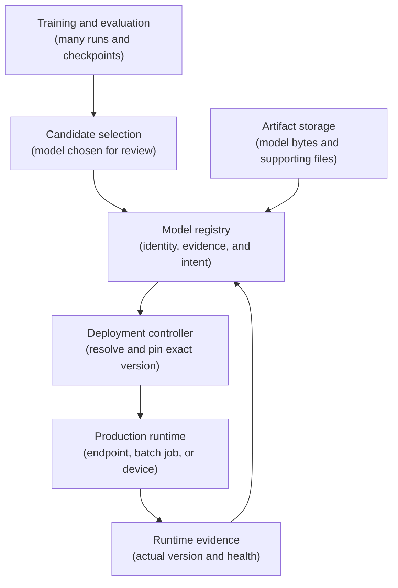
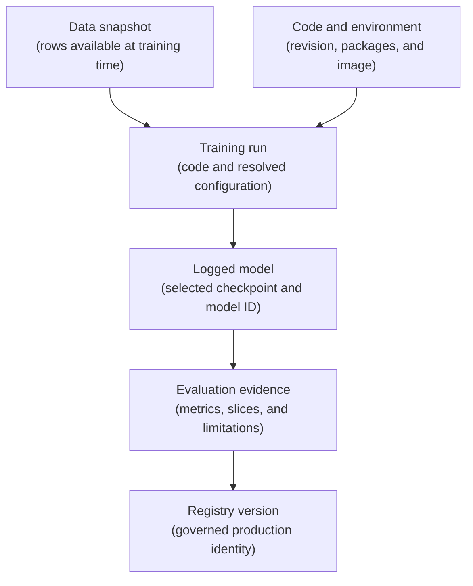
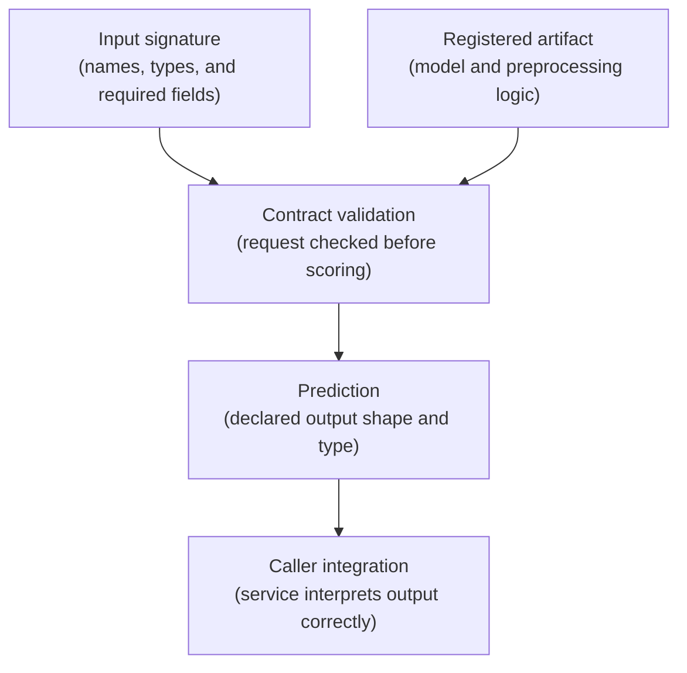
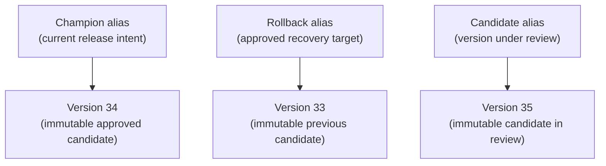
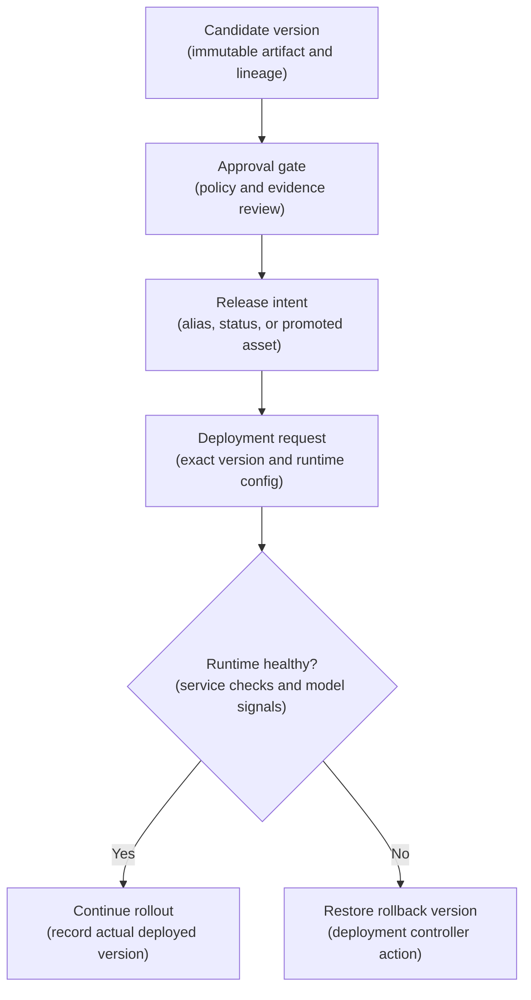
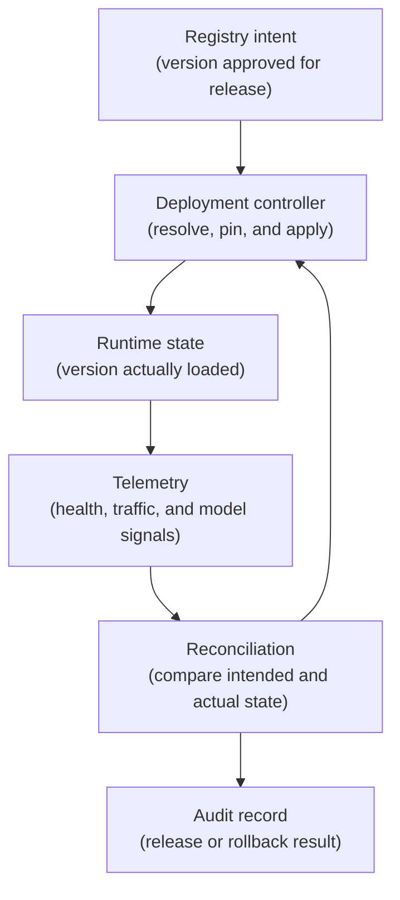

## Table of Contents

1. [A Folder of Model Files Cannot Answer a Release Question](#a-folder-of-model-files-cannot-answer-a-release-question)
2. [What A Model Registry Does](#what-a-model-registry-does)
3. [Give the Model, Version, and Artifact Separate Identities](#give-the-model-version-and-artifact-separate-identities)
4. [Trace Every Model Version Back To Its Training Inputs](#trace-every-model-version-back-to-its-training-inputs)
5. [Record Expected Inputs, Outputs, And Validation Results](#record-expected-inputs-outputs-and-validation-results)
6. [Use Movable Labels Without Changing Model Versions](#use-movable-labels-without-changing-model-versions)
7. [Make Ownership, Permissions, and Approval Explicit](#make-ownership-permissions-and-approval-explicit)
8. [Record What A Model Version Is Approved To Do](#record-what-a-model-version-is-approved-to-do)
9. [Retain Enough Evidence for Audit and Rollback](#retain-enough-evidence-for-audit-and-rollback)
10. [Keep the Registry Separate From Deployment](#keep-the-registry-separate-from-deployment)
11. [Implement A Model Registry With MLflow 3](#implement-a-model-registry-with-mlflow-3)
12. [Compare How Managed Registries Represent Models](#compare-how-managed-registries-represent-models)
13. [Check Registry Evidence Before Deployment](#check-registry-evidence-before-deployment)
14. [The Main Idea](#the-main-idea)
15. [References](#references)

## A Folder of Model Files Cannot Answer a Release Question
<!-- section-summary: A registry gives an incident or release team a trusted identity and evidence trail for the exact model version under discussion. -->

Imagine an on-call engineer responding to a prediction-quality alert after a new fraud model reaches production. The endpoint reports `fraud-model-v34`, while object storage contains `model.pkl`, `model-final.pkl`, and `model-final-2.pkl` from several training jobs. A deployment file points to a path ending in `latest`.

The engineer needs to decide whether to roll back before the payment-review queue grows. That decision requires precise answers. Which bytes are running? Which data and code produced them? Which input schema does the model expect? Which tests passed? Who approved the release? Which previous version can still run with the current feature pipeline?

A folder of files cannot answer those questions consistently. A **model registry** is the controlled catalog that gives each reviewed model version a durable identity and connects it to the evidence needed for release, audit, and recovery.

You can think of the registry as the model system's control desk. It rarely stores every large model byte in its own database. It records which artifact is version 34, where that artifact lives, how it was produced, what interface it exposes, which checks it passed, and what the organization currently intends to do with it.

The visible outcome during the incident is a dependable rollback subject: an immutable version such as `fraud-risk/33`, plus the artifact digest, feature contract, serving environment, and approval history required to restore it safely.

## What A Model Registry Does
<!-- section-summary: The registry narrows many experimental outputs into governed model versions and hands exact release intent to deployment automation. -->

Model development produces many runs, checkpoints, and evaluation reports. Production systems need a smaller set of candidates with stable identities and reviewed evidence. The registry sits between those two worlds.

Experiment tracking answers, “What happened during this run?” Artifact storage answers, “Where are the files?” The registry answers, “Which reviewed model version do these files represent, and what may happen to that version next?” Deployment automation then turns approved intent into a real endpoint, batch job, or edge release.


```mermaid
flowchart TD
    R["Training and evaluation<br/>(many runs and checkpoints)"] --> S["Candidate selection<br/>(model chosen for review)"]
    S --> G["Model registry<br/>(identity, evidence, and intent)"]
    A["Artifact storage<br/>(model bytes and supporting files)"] --> G
    G --> D["Deployment controller<br/>(resolve and pin exact version)"]
    D --> P["Production runtime<br/>(endpoint, batch job, or device)"]
    P --> O["Runtime evidence<br/>(actual version and health)"]
    O --> G
```

This boundary keeps each system honest. A registry entry may say that version 34 is approved for canary traffic. The deployment controller still has to create or update the runtime, assign traffic, verify health, and record which version is actually serving. Approval and deployment are related states with different owners and failure modes.

## Give the Model, Version, and Artifact Separate Identities
<!-- section-summary: A registered model names the product capability, a version identifies one governed candidate, and an artifact points to the exact deployable bytes. -->

A product capability can outlive many trained candidates and many storage locations. The registry separates that lasting identity from one candidate and from the files implementing it. This prevents a storage path, release label, and product name from being treated as the same thing.

A **registered model** is the stable logical name for one prediction capability, such as `fraud-risk`, `delivery-time-forecast`, or `support-ticket-router`. It groups candidates that solve the same operational task and share an ownership boundary.

A **model version** is one numbered entry beneath that name. Version 34 should identify one fixed candidate. Its model bytes, inference interface, and source lineage stay stable. Descriptions, tags, and approval evidence may accumulate as reviewers work, though a change to the deployable artifact should create version 35.

The **artifact** is the file or directory that a runtime can load. It may contain learned weights, preprocessing logic, an MLflow `MLmodel` file, a tokenizer, dependency metadata, or a serving container reference. Large artifacts usually live in object storage or a managed artifact repository. The registry stores a durable pointer and, where the platform allows, a digest or equivalent integrity record.

```yaml
registered_model: fraud-risk
version: 34
artifact:
  uri: s3://ml-artifacts/fraud-risk/34/model/
  digest: sha256:8f7a2c...
interface:
  signature: artifact://fraud-risk/34/signature.json
lineage:
  source_run: run-91fd
  data_snapshot: transactions_features@1842
  code_revision: 2e7c819
  image_digest: sha256:41ac0b...
owner: fraud-ml
validation_status: pending_review
```

The version number is an identity inside one registry namespace. It is never a quality score. Version 35 can perform worse than version 34, and two different registries can assign different version numbers to equivalent artifacts. The artifact digest gives the release system a stronger byte-level comparison where the packaging format supports stable hashing.

### Why A Model Version Must Stay Unchanged

Suppose a model engineer replaces the weights behind version 34 after a latency test. The approval record still refers to “version 34,” yet reviewers evaluated different bytes. An incident team can no longer reconstruct the decision. Creating a new version preserves both histories: version 34 remains the reviewed candidate, and version 35 represents the changed artifact.

Azure Machine Learning enforces this idea for model assets by allowing updates to description and tags while keeping the other model-version properties immutable. MLflow and other registries express the same operational pattern through versioned model records. Platform teams should also protect the underlying artifact path from overwrite and deletion.

## Trace Every Model Version Back To Its Training Inputs
<!-- section-summary: Lineage connects a registry version to the run, logged model, data, code, configuration, and environment that produced it. -->

**Lineage** is the evidence chain that explains where a model version came from. It lets a reviewer walk backward from a production identity to the exact training process and inputs that created it.

Useful lineage includes the source run or job, the selected logged model or checkpoint, the training-data snapshot, feature definitions, label policy, code revision, resolved training configuration, dependency lock, container image, and evaluation artifacts. A registry can store some fields directly and link to the rest. The important property is navigability: a reviewer should move from version to evidence without guessing across unrelated systems.

MLflow 3 makes the **logged model** a first-class tracked object with its own model ID. One run can produce several checkpoints, and metrics can be associated with specific logged models and datasets. Registering the selected logged model creates a governed model version while preserving the link back to that richer training history.


```mermaid
flowchart TD
    DA["Data snapshot<br/>(rows available at training time)"] --> RU["Training run<br/>(code and resolved configuration)"]
    CO["Code and environment<br/>(revision, packages, and image)"] --> RU
    RU --> LM["Logged model<br/>(selected checkpoint and model ID)"]
    LM --> EV["Evaluation evidence<br/>(metrics, slices, and limitations)"]
    EV --> MV["Registry version<br/>(governed production identity)"]
```

Consider a demand forecast that starts underestimating holiday volume. The model owner opens the deployed version and follows its lineage to the training snapshot. The snapshot ends before a late holiday-promotion update, while the feature pipeline revision already expects that promotion field. This concrete mismatch gives the owner a defensible recovery plan: restore the previous compatible version and rebuild the candidate from a corrected snapshot.

Lineage has limits. A link to `main` or an unversioned table gives a location, though it cannot recreate historical state. Strong lineage uses immutable commits, dataset versions or manifests, pinned environments, and stable artifact identifiers.

## Record Expected Inputs, Outputs, And Validation Results
<!-- section-summary: A deployable registry version needs an input-output contract and the evidence that supports its release claims. -->

A model file can load successfully and still be unusable by its service. The service may send strings where training expected floats, omit a required feature, change column order, or interpret an output incorrectly. A registry therefore needs an **interface contract** alongside the artifact.

In MLflow, a **model signature** describes the expected model inputs, parameters, and outputs. You can think of it as the boundary agreement between the model and its caller. It covers interface compatibility; prediction quality requires separate evaluation evidence. The signature gives validation and serving systems a structured way to catch incompatible requests and outputs.

For example, a credit-risk model expects `income` as a double, `account_age_days` as a long, and `country_code` as a string. The candidate's service integration test sends a null `account_age_days` and receives a schema error before deployment. The API owner can correct the feature contract while the release is still in staging. Without that check, the visible production outcome could be a stream of failed or misinterpreted predictions.


```mermaid
flowchart TD
    I["Input signature<br/>(names, types, and required fields)"] --> V["Contract validation<br/>(request checked before scoring)"]
    M["Registered artifact<br/>(model and preprocessing logic)"] --> V
    V --> P["Prediction<br/>(declared output shape and type)"]
    P --> C["Caller integration<br/>(service interprets output correctly)"]
```

The registry version also needs **validation evidence**. This is the material supporting the claim that the candidate is suitable for its next release step.

Quality evidence compares the candidate with its baseline. The primary metric and uncertainty describe the overall result. Slice, calibration, and robustness reports expose weaknesses hidden by that aggregate. Operational evidence covers latency and memory. Governance evidence links security results and known limitations to the model card or evaluation report.

The registry database is a poor home for a large report. Store compact decision fields as version metadata and link immutable reports as artifacts. The trust behind a tag such as `validation_status=passed` comes from its links to the policy version, evaluator, report, and exact model version.

## Use Movable Labels Without Changing Model Versions
<!-- section-summary: Versions stay fixed, aliases provide movable names, and tags describe review or lifecycle state without rewriting model identity. -->

An **alias** is a movable name that points to one immutable version. You can think of `candidate`, `champion`, or `rollback` as labeled pointers. Version 34 remains version 34, while the `champion` alias may move from version 33 to version 34 after approval.

A **tag** is descriptive key-value metadata. Tags can record `validation_status=passed`, `risk_tier=high`, or `training_region=eu`. Aliases answer “Which version currently has this role?” Tags answer “What do we know about this version?”


```mermaid
flowchart TD
    V33["Version 33<br/>(immutable previous candidate)"]
    V34["Version 34<br/>(immutable approved candidate)"]
    V35["Version 35<br/>(immutable candidate in review)"]
    CH["Champion alias<br/>(current release intent)"] --> V34
    RB["Rollback alias<br/>(approved recovery target)"] --> V33
    CA["Candidate alias<br/>(version under review)"] --> V35
```

MLflow's fixed model stages are deprecated. Current MLflow workflows use model-version tags for status and aliases for named references. Unity Catalog models also use aliases and tags; fixed stages are unsupported there. This shift matters because real release workflows need more than a universal `Staging` or `Production` label. One version may be a batch champion, a regional canary, and a rollback target at the same time.

Mutable aliases require care. A batch job that loads `models:/fraud-risk@champion` at the start of every run will follow the newest alias assignment. An online deployment controller should usually resolve that alias to version 34, update the endpoint with the exact version, and record version 34 in the release. If the alias moves again during a rollout, the running endpoint remains attributable to the version it actually loaded.


*The registered model, immutable version, deployable artifact, and movable alias answer different questions and should remain separate in release records.*

## Make Ownership, Permissions, and Approval Explicit
<!-- section-summary: Registry governance defines who owns a model, who may create versions, who may approve release intent, and which evidence supported that decision. -->

A production model needs an accountable **owner**. The owner maintains the model's purpose, evaluation policy, operational contacts, and retirement plan. Ownership may belong to a team instead of an individual so responsibility survives staff changes.

Permissions turn that ownership model into enforceable actions. Mature registries distinguish reading a model, creating a version, editing metadata, assigning aliases, approving a release, and deleting history. The training service account may create candidate versions. A validation role may attach evaluation results. A release role may move a protected alias after approval. Very few principals should delete versions or artifacts.

An **approval** is a recorded decision that the available evidence satisfies a declared policy for a specific next step. Its subject identifies the actor, exact model version, and target release phase. Its basis identifies the policy version and evidence links. Its outcome records the decision plus any expiry or conditions. A free-form comment can add context, though automation needs structured fields.

```yaml
approval:
  model: clinical-coding-assistant
  version: 12
  requested_intent: shadow
  policy: clinical-model-shadow-v4
  evidence:
    evaluation_report: artifact://clinical-coding/12/evaluation.json
    interface_test: artifact://clinical-coding/12/contract-test.json
    security_scan: artifact://clinical-coding/12/security.json
  decisions:
    clinical-validation: approved
    privacy-review: approved
    platform-readiness: approved
  rollback_version: 11
```

Suppose the clinical validator finds a large error increase for rare procedure codes before the shadow window. The aggregate metric passes, while the required slice gate fails. The validator records a rejection against version 12 and links the slice report. The deployment role cannot assign the protected `shadow` intent. The visible outcome is a blocked release with a specific remediation path, instead of an unexplained permission error.

Provider capabilities vary. Open-source MLflow supplies registry APIs and metadata; access control depends on MLflow Authentication or the surrounding managed platform. Unity Catalog adds centralized privileges, ownership, auditing, and cross-workspace governance. SageMaker uses IAM and resource policies around model package groups and versions. The organization's approval policy should remain explicit even where the provider offers a convenient status field.

## Record What A Model Version Is Approved To Do
<!-- section-summary: Promotion records that a reviewed version may enter a release phase, while deployment automation performs the runtime change. -->

**Promotion** means the organization has advanced a model version to a new release intent. For example, version 34 moves from “candidate” to “approved for shadow,” and later to “approved for canary.” The artifact often stays at the same immutable location. The registry changes the reviewed status, protected alias, or environment-specific record that automation consumes.

This is why promotion should preserve a decision trail. Before the scheduled canary window, the model owner submits version 34. The risk reviewer approves the evidence. The release role assigns the canary intent. The deployment controller resolves that intent to version 34 and creates a runtime revision. If endpoint health fails, the controller restores version 33. Each step has a separate actor and timestamp in the audit log.


```mermaid
flowchart TD
    C["Candidate version<br/>(immutable artifact and lineage)"] --> G["Approval gate<br/>(policy and evidence review)"]
    G --> I["Release intent<br/>(alias, status, or promoted asset)"]
    I --> R["Deployment request<br/>(exact version and runtime config)"]
    R --> H{"Runtime healthy?<br/>(service checks and model signals)"}
    H -- Yes --> K["Continue rollout<br/>(record actual deployed version)"]
    H -- No --> B["Restore rollback version<br/>(deployment controller action)"]
```

Some organizations separate development and production with different accounts, projects, workspaces, catalogs, or registries. Their promotion process may copy a model version into a production-governed namespace. MLflow and Unity Catalog provide version-copy workflows, while Azure Machine Learning registries can publish assets for use across workspaces. In these designs, promotion must preserve the source identity, digest, lineage, and approval evidence so the copied version remains traceable.

Promoting code can be safer than moving a trained artifact across environments. A production training pipeline can run approved code against production-governed data and register a new production version. The right choice depends on retraining cost, data boundaries, regulatory requirements, and reproducibility. The registry records the resulting identity either way.

## Retain Enough Evidence for Audit and Rollback
<!-- section-summary: Retention preserves active versions, recovery targets, lineage, approvals, and compatible runtime assets for the required operational and audit window. -->

Registry history has operational value. A previous model version may be the fastest recovery path during an incident. An old approval packet may be required for an audit. A data or code lineage record may explain a slow quality decline months after release.

A retention policy should cover more than model weights. The executable package needs the artifact, serving image, and dependencies. Compatibility depends on the feature contract, runtime configuration, and access to the expected features. Policy evidence explains why the version remains an approved recovery target. Keeping version 33 while deleting its tokenizer or container image creates a rollback label with no executable recovery path.

Archiving usually changes discoverability or lifecycle state while leaving a model version available to referenced workflows. Deletion removes evidence or bytes and deserves stronger controls. Azure Machine Learning, for example, allows archived model assets to remain referenceable. Each team should verify its provider's archive and deletion behavior before automating cleanup.

Consider a ranking model whose current version depends on a new feature-service schema. The incident commander chooses the older rollback alias, yet version 33 expects a field that the feature service has removed. The deployment succeeds and predictions fail. A registry-backed rollback plan would record compatibility requirements and pair the model version with the matching feature and serving release.

The audit trail should capture version creation, metadata changes, approval decisions, alias movements, copies across environments, deployment requests, archive actions, and deletions. These events let reviewers reconstruct what the organization knew and intended at each point.

## Keep the Registry Separate From Deployment
<!-- section-summary: The registry records approved identity and intent, while deployment and orchestration systems change compute, traffic, schedules, and runtime state. -->

The registry is a control-plane catalog. The deployment system owns runtime changes. For an online endpoint, deployment creates model servers, configures CPU or GPU resources, attaches secrets and networking, runs health checks, and shifts traffic. For batch inference, orchestration schedules jobs, resolves input data, retries failures, and writes outputs.

Moving an alias changes registry intent. A deployment-system endpoint update or a workload resolving that alias on its next run changes traffic. This distinction prevents dashboards from claiming that version 34 is live solely because `champion` points to it.


```mermaid
flowchart TD
    RI["Registry intent<br/>(version approved for release)"] --> DC["Deployment controller<br/>(resolve, pin, and apply)"]
    DC --> RT["Runtime state<br/>(version actually loaded)"]
    RT --> TE["Telemetry<br/>(health, traffic, and model signals)"]
    TE --> RC["Reconciliation<br/>(compare intended and actual state)"]
    RC --> DC
    RC --> AU["Audit record<br/>(release or rollback result)"]
```

The same separation applies to rollback. The registry identifies the approved recovery version and its evidence. The deployment controller restores it, verifies runtime health, and records the outcome. Airflow, Dagster, Argo Workflows, GitHub Actions, cloud pipelines, or a managed deployment service may perform that work. The registry remains the source of governed model identity across those execution choices.


*The registry preserves approved identity and evidence, while the deployment system owns runtime configuration, traffic, and proof of the loaded model.*

## Implement A Model Registry With MLflow 3
<!-- section-summary: MLflow 3 tracks models as first-class objects and registers selected logged models as governed versions with signatures, aliases, and tags. -->

MLflow 3 separates the rich tracking identity of a **logged model** from the governed release identity of a **registered model version**. A logged model receives a unique model ID, can represent a checkpoint within a run, and can carry model-specific parameters and metrics. Registration places the selected model under a stable registered-model name and version.

The training job for a fraud classifier can infer its input-output signature, log the candidate, and register that logged model. The registry version starts in review; later automation attaches validation evidence and assigns a protected alias.

```python
import mlflow
import mlflow.sklearn
from mlflow import MlflowClient
from mlflow.models import infer_signature

with mlflow.start_run():
    signature = infer_signature(
        X_valid,
        classifier.predict_proba(X_valid),
    )

    logged = mlflow.sklearn.log_model(
        sk_model=classifier,
        name="fraud_classifier",
        signature=signature,
        input_example=X_valid.head(3),
    )

registered = mlflow.register_model(
    model_uri=f"models:/{logged.model_id}",
    name="fraud-risk",
)

client = MlflowClient()
client.set_model_version_tag(
    name="fraud-risk",
    version=registered.version,
    key="validation_status",
    value="pending",
)
```

After review, a release role can assign an alias to the exact approved version:

```python
client.set_registered_model_alias(
    name="fraud-risk",
    alias="candidate",
    version=registered.version,
)

resolved = client.get_model_version_by_alias("fraud-risk", "candidate")
release_version = resolved.version
```

The deployment request should carry `release_version`, the exact artifact identity, and the runtime configuration. That preserves attribution if the alias later moves. Open-source MLflow registries need a database-backed backend store, and production access controls need MLflow Authentication or a governed managed backend.

## Compare How Managed Registries Represent Models
<!-- section-summary: Managed registries implement the shared identity-and-evidence pattern through different resources, permissions, aliases, and deployment integrations. -->

Managed registries share broad goals, though their objects and lifecycle rules differ. A portable release process maps the organization's contract onto each platform instead of assuming identical APIs.

### Databricks Models in Unity Catalog

Databricks provides a hosted MLflow Model Registry in Unity Catalog. Models use a three-level name such as `prod.risk.fraud_model`. New model versions require a model signature. Unity Catalog adds centralized ownership, privileges, lineage, auditing, and access across attached workspaces. It uses aliases and tags for lifecycle workflows; fixed model stages are unsupported.

The catalog and schema can express an environment boundary with separate permissions. The enclosing `prod` catalog says where governance applies, while an alias such as `Champion` expresses deployment intent. A serving or batch deployment job resolves the alias and updates the runtime. Databricks recommends Models in Unity Catalog over the legacy Workspace Model Registry for governed lifecycle management.

### Amazon SageMaker Model Registry

SageMaker groups versions in a **Model Package Group**. Each **model package** is a versioned model record containing artifact and inference information. A package can carry metrics, lineage, model-card information, and an approval status such as `PendingManualApproval`, `Approved`, or `Rejected`.

An `Approved` status expresses eligibility for deployment. A SageMaker Project or EventBridge-driven workflow may react to that status, yet the status change and endpoint update remain distinct operations. Deployment creates a SageMaker model and endpoint configuration, then creates or updates an endpoint. IAM and model-package-group resource policies govern who can register, approve, share, and deploy versions.

### Gemini Enterprise Agent Platform Model Registry

Gemini Enterprise Agent Platform Model Registry (formerly Vertex AI Model Registry) organizes several versions beneath one model resource. Version aliases are mutable within that model, and one version carries the required `default` alias. Custom aliases can express roles such as a stable or candidate version. A model version can also carry description, labels, and evaluation information.

The runtime object is separate. Gemini Enterprise Agent Platform deploys a selected model version into an Endpoint as a DeployedModel, and the endpoint owns the traffic split. A deployment request can name a version ID or alias; omitting both selects the default version. Release automation should still record the concrete version that the endpoint loaded.

### Azure Machine Learning Registries

Azure Machine Learning represents a registered model as a versioned model asset. For a model version, description and tags are mutable while the remaining properties are immutable. An exact registry asset URI includes registry name, model name, and version.

Azure Machine Learning registries also share models, environments, components, and data assets across workspaces. This makes the registry useful for development, test, and production workspaces that live in separate subscriptions or regions. A model can be published to the registry and deployed from that asset into an endpoint in another workspace. Azure's versioned asset and archive semantics differ from MLflow's alias-centered workflow, so release code should use Azure's native identifiers and permissions.

## Check Registry Evidence Before Deployment
<!-- section-summary: A release gate converts registry evidence into a clear allow or deny decision for one exact version and target release phase. -->

A registry provides the evidence source for an automated release gate. The gate evaluates one immutable version against a versioned policy. It should resolve aliases once, inspect the exact version record, verify evidence links and permissions, and emit a decision that a human can understand.

```yaml
release_request:
  model: fraud-risk
  version: 34
  target: canary
required_evidence:
  signature: present
  artifact_digest: present
  lineage: complete
  evaluation_policy: fraud-canary-v6
  evaluation_status: passed
  latency_status: passed
  security_status: passed
  approvers:
    - fraud-model-owner
    - risk-reviewer
    - serving-owner
  rollback_version: 33
decision_output:
  deployment_subject: fraud-risk/34
  result: allow
```

Suppose the model owner requests the canary before the release window. The gate finds complete offline evidence and approval, then discovers that the rollback version's container image has expired from the registry. The request fails with `rollback runtime unavailable`. The serving owner can restore the image or choose another validated recovery version. The visible error identifies the operational gap before traffic changes.

The gate should never infer approval from a high metric alone. It reads the policy, model signature, lineage, evaluation report, ownership, and rollback evidence as separate requirements. The deployment system then consumes the allowed exact version and reports the real runtime result.

## The Main Idea
<!-- section-summary: A registry turns a model artifact into a governed version whose origin, interface, evidence, ownership, release intent, and recovery path remain traceable. -->

A model registry gives production meaning to model artifacts. The registered-model name identifies the capability. The immutable version identifies one reviewed candidate. The artifact pointer and digest identify the deployable bytes. Lineage explains how those bytes were produced, while the model signature explains how callers interact with them.

Aliases and tags express current intent and status without changing version identity. Permissions define who may create, review, promote, archive, or delete. Approval evidence explains why a version may enter a release phase. Retention keeps the artifact, environment, policy, and rollback path available for the required operational and audit window.

The registry records identity and intent. Deployment automation changes endpoints, jobs, devices, and traffic. Keeping that boundary explicit gives release teams, incident responders, auditors, and platform automation one dependable answer to the same question: which exact model version are we talking about, and why is it allowed to run?


*A registry connects training evidence to production through an exact reviewed version, while runtime verification confirms what the serving system actually loaded.*

## References

- [MLflow: Model Registry](https://mlflow.org/docs/latest/ml/model-registry/) - Official concepts for registered models, versions, aliases, tags, lineage, signatures, and MLflow 3 model registration.
- [MLflow: Model Registry Workflows](https://mlflow.org/docs/latest/ml/model-registry/workflow/) - Official API workflow and guidance for aliases, tags, environment promotion, and deprecated stages.
- [MLflow: Experiment Tracking](https://mlflow.org/docs/latest/tracking) - Official MLflow 3 logged-model identity, checkpoint, metric, parameter, and dataset tracking concepts.
- [Databricks: Manage Model Lifecycle in Unity Catalog](https://docs.databricks.com/aws/en/machine-learning/manage-model-lifecycle/) - Official guidance for three-level names, required signatures, privileges, aliases, tags, lineage, and deployment jobs.
- [Amazon SageMaker AI: Model Registry](https://docs.aws.amazon.com/sagemaker/latest/dg/model-registry.html) - Official model package group, version, metadata, lineage, approval, and deployment overview.
- [Amazon SageMaker AI: Register a Model Version](https://docs.aws.amazon.com/sagemaker/latest/dg/model-registry-version.html) - Official model-package registration and approval-status fields.
- [Amazon SageMaker AI: Deploy a Model From the Registry](https://docs.aws.amazon.com/sagemaker/latest/dg/model-registry-deploy.html) - Official separation between an approved model package and endpoint deployment.
- [Gemini Enterprise Agent Platform: Use Model Version Aliases](https://docs.cloud.google.com/gemini-enterprise-agent-platform/machine-learning/model-registry/model-alias) - Official model-version alias, required default alias, and upload semantics.
- [Gemini Enterprise Agent Platform: Model Registry](https://docs.cloud.google.com/gemini-enterprise-agent-platform/machine-learning/model-registry/introduction) - Official model registry, version, alias, evaluation, and endpoint relationship.
- [Google Cloud: Gemini Enterprise Agent Platform Name Changes](https://docs.cloud.google.com/gemini-enterprise-agent-platform/vertex-ai-name-changes) - Official mapping from the former Vertex AI platform name to the current name.
- [Azure Machine Learning: Work With Registered Models](https://learn.microsoft.com/en-us/azure/machine-learning/how-to-manage-models?view=azureml-api-2) - Official model-version immutability, archive behavior, asset URIs, and CLI or SDK lifecycle operations.
- [Azure Machine Learning: Registries for MLOps](https://learn.microsoft.com/en-us/azure/machine-learning/concept-machine-learning-registries-mlops?view=azureml-api-2) - Official cross-workspace registry pattern for models, environments, components, and data assets.
