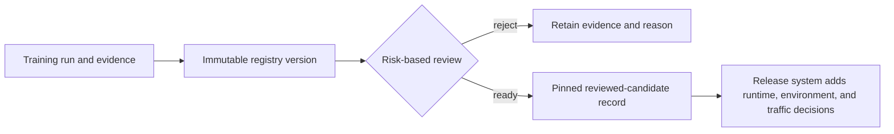
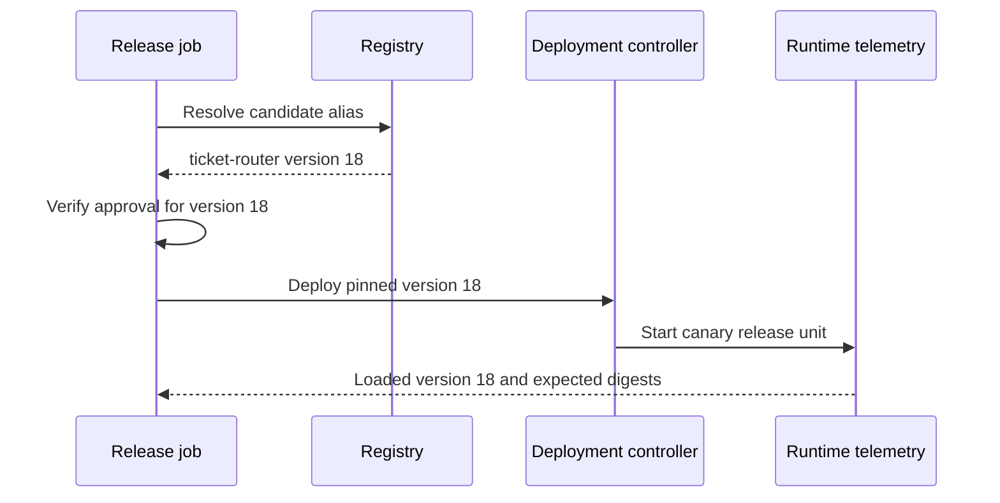
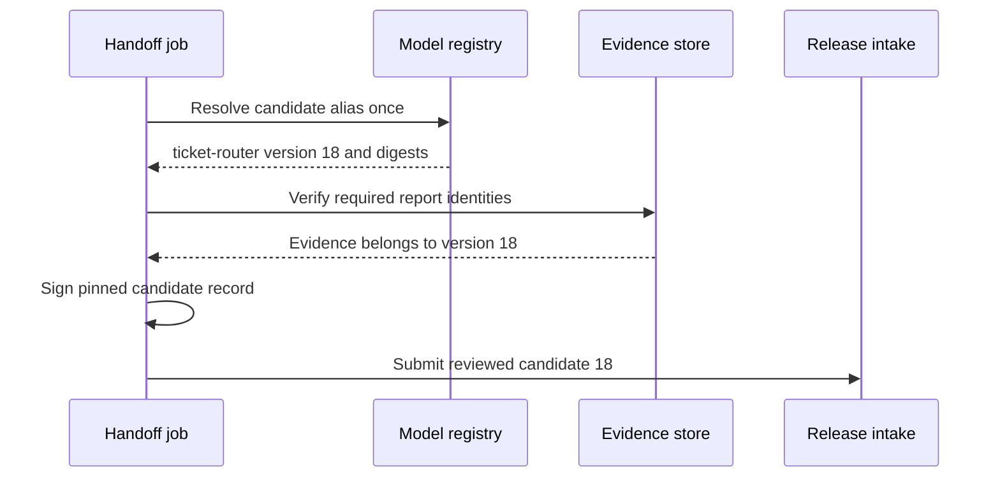

## A Registry Creates a Reviewed Candidate Handoff
<!-- section-summary: A model registry preserves one candidate's identity and evidence so release systems receive an exact, reviewable input. -->

A training run produces files and metrics. A release system needs something more stable: one candidate that can be named, inspected, rejected, compared, and handed forward without changing underneath the reviewers. A **model registry** provides that boundary.

The registry article owns five responsibilities:

1. **Candidate identity** gives the model artifact and its required inference assets an immutable version.
2. **Lineage** connects that version to the run, data, code, configuration, and build environment that produced it.
3. **Evidence links** attach evaluation results, signatures, limitations, and ownership to the same version.
4. **Aliases and review states** help people find current candidates without replacing immutable history.
5. **Candidate handoff** resolves every movable reference and sends one pinned, reviewed record to the release process.

The registry stops at that handoff. It does not define the complete production release manifest, move bytes across an environment trust boundary, allocate traffic, or prove what runtime handled a request. Those responsibilities belong to the later Model Versioning, Artifact Promotion, and Model Release Strategies articles.

This boundary matters because one mutable label cannot answer every lifecycle question. An alias called `candidate` can help reviewers find a version, but it cannot prove which serving image is compatible, whether production may read the artifact, or which model actually handled live predictions.



Candidate identity, lineage, aliases, evidence, and the reviewed handoff form this article's framework. The next module adds production authority and running state without redefining the candidate.

## A Version Preserves The Candidate
<!-- section-summary: A registry version keeps the candidate artifact and the assets required to evaluate it stable while evidence accumulates. -->

A **model version** is an immutable registry identity for one model candidate. The version should resolve to the same model bytes every time. It should also link to the training run, dataset snapshot, source commit, environment, input signature, evaluation report, and owner.

The word “model” can hide an important evaluation detail. An estimator alone may be impossible to load or score consistently. A text classifier can require a tokenizer, label map, normalization rules, and input signature. A forecasting model can require preprocessing and post-processing assets. The registry candidate should therefore include or immutably reference everything needed to reproduce the behaviour that evaluation measured.

Suppose a support team registers `ticket-router` version `18`. The review packet identifies these parts:

| Candidate part | Stable registry evidence |
| --- | --- |
| Model | Registry name, version, artifact digest |
| Data | dataset snapshot and label-policy version |
| Code | source commit and training entry point |
| Load contract | input signature, label map, required inference assets |
| Environment | dependency lock or reproducible model environment |
| Evaluation | report identity, slices, baseline, limitations |

If the tokenizer or preprocessing changes after evaluation, the measured behaviour no longer belongs to the same candidate. The team should create a new candidate version and repeat the affected checks. Some registries store these pieces inside a packaged model. Others keep a candidate manifest in an artifact store and attach its digest to the registry version. Either design works when the references are immutable and verification can follow them.

Registration should include a candidate load test. The test retrieves the version in a clean environment, verifies its digest and signature, sends a known fixture, and checks the output shape and label order. This is not a production capacity or compatibility test; it proves that the reviewed candidate is self-consistent enough for evaluation and release packaging. A registry row that points to a missing preprocessor has failed the handoff even though registration itself succeeded.

## Aliases Are Movable Pointers
<!-- section-summary: Aliases make current intent convenient to discover, while immutable versions protect evaluation, deployment, and incident evidence from races. -->

An **alias** is a readable name that currently points to one model version. Names such as `candidate`, `champion`, or `rollback` can help reviewers and automation find relevant versions without memorising numbers. The pointer can later move from version `18` to version `19`.

That movement creates a concurrency risk. Imagine a release job that evaluates `candidate` when it points to version `18`. Another job moves the alias to version `19` before deployment starts. If the release job resolves the alias a second time, it can deploy a model that never received the first job’s approval.

The safe pattern has two steps. Resolve the alias once at the start of the handoff, then store and use the concrete version for every later check. The candidate record should carry `ticket-router:18`, the artifact and candidate-manifest digests, and the evidence identities. Release intake should receive those concrete values rather than resolving a moving alias again.



Current MLflow Model Registry workflows use aliases and tags for this purpose. MLflow’s fixed Model Stages were deprecated starting in version 2.9. Aliases provide movable references, while tags can describe review status such as `pending`, `approved`, `rejected`, or `superseded`. Teams maintaining older stage-based workflows should plan a migration rather than extending stage names into new release logic.

## Review States Describe Candidate Readiness
<!-- section-summary: A registry review state records whether one candidate's evidence is ready for release review, rejected, or superseded. -->

A **review state** describes what happened to the candidate's evidence before the production release is assembled. Terms such as `under_review`, `reviewed_candidate`, `rejected_for_safety_slice`, and `superseded_before_review` communicate more than a generic `Production` stage.

`reviewed_candidate` is deliberately narrower than `approved_for_production`. It means that the model identity is stable, the expected evaluation evidence exists, and the candidate can enter the release process. The release process must still pin a runtime and contracts, validate the target environment, obtain any required release authority, and choose a traffic scope.

Review depth should follow product risk. A low-risk internal recommendation may use automated gates and an accountable model owner. A model that affects safety, credit, employment, or access to essential services usually needs domain, risk, legal, or compliance review defined by the organisation’s governance process. The registry can store the status and links, while the policy defines who has authority.

The candidate packet should answer four groups of questions:

1. **Identity:** Which candidate artifact, data, code, load contract, and environment did reviewers inspect?
2. **Quality:** Which baseline, metrics, slices, uncertainty, and failure examples support the decision?
3. **Use:** Which intended use, population, exclusions, and known limitations did evaluation cover?
4. **Handoff:** Which concrete version and digests must the release system consume without resolving aliases again?

A compact machine-readable record can carry the handoff:

```yaml
candidate_review_id: review-2026-07-17-1842
model: ticket-router
version: "18"
artifact_sha256: sha256:ee115a66...
candidate_manifest_sha256: sha256:0d7493c1...
status: reviewed_candidate
intended_use: route non-safety-critical support tickets
excluded_queues: [safety-critical]
evaluation_report: eval-ticket-router-18
known_limitations: [low evidence for newly launched locale]
```

The release intake gate verifies this record against registry metadata before it builds a production release. A digest mismatch, missing slice report, or unresolved alias stops the handoff. Later release gates add runtime compatibility, environment policy, traffic, monitoring, and rollback evidence without silently rewriting what the candidate review concluded.

## Build A Pinned Candidate Handoff
<!-- section-summary: The handoff resolves aliases once, verifies registry evidence, and gives release automation one immutable candidate record. -->

The handoff is a read boundary between experiment systems and release systems. It should not ask production automation to rediscover which run the team meant. The registry workflow resolves the selected alias once, reads the concrete version, verifies that required metadata and evidence links belong to that version, and emits a candidate record whose own digest can be checked later.

For `ticket-router:18`, the handoff process checks:

| Check | Reason |
| --- | --- |
| Version and candidate-manifest digests resolve | The model under review has not moved or disappeared |
| Training run, dataset, and source references exist | Release reviewers can trace where the candidate came from |
| Input signature and load fixture pass | The release system receives a usable candidate rather than disconnected bytes |
| Required evaluation report and slices exist | `reviewed_candidate` has concrete evidence behind it |
| Intended use, exclusions, limitations, and owner are present | Later release decisions do not invent a broader claim |

The operation should be idempotent. Retrying handoff for the same review ID returns the same candidate record. It must never resolve `candidate` again and silently pick up version `19`. If an alias or review state changed after the process began, the workflow pauses and requires a fresh review or explicit reconciliation.



The audit event records the concrete version, source alias at resolution time, candidate-review ID, evidence identities, actor or workload identity, time, and result. Failed and superseded handoffs remain in history because they explain why a candidate did not enter release planning.

## Release Systems Add Production Meaning
<!-- section-summary: After candidate handoff, other systems add the runtime, environment authority, traffic plan, live verification, and rollback release. -->

The registry record is an input to release management, not a production declaration. The Model Versioning article combines the candidate with a serving-image digest, request and response contracts, feature contract, decision policy, and rollback target to create a complete release identity. Artifact Promotion decides whether to copy or reference the exact artifact across an environment trust boundary and verifies the destination. Model Release Strategies control blue-green, canary, or shadow traffic. Monitoring records which release actually served each decision.

Keeping this boundary explicit prevents several common errors:

- A registry alias move cannot bypass a deployment review or alter running workers by itself.
- A `reviewed_candidate` state cannot be mistaken for permission to send production traffic.
- A release-specific image, threshold, feature contract, or fallback does not get written back as if training produced it.
- Runtime telemetry remains the source of truth for what served users, while the registry remains the source of truth for which candidate and evidence entered the release process.

The handoff is complete when release intake can verify the candidate without trusting a mutable name. What happens to that candidate next belongs to the production release framework.

## Rejection And Supersession Preserve Learning
<!-- section-summary: Rejected and superseded candidates keep enough evidence to explain experiment decisions and prevent repeated mistakes. -->

A rejected version still contains useful evidence. Its failed slice, incompatible schema, or excessive latency can prevent the same mistake in a later experiment. The review record should state the reason and the evidence that failed. `Rejected` means a decision occurred; `superseded` can describe a candidate that another version replaced before review finished.

Retention follows lifecycle meaning. Recently rejected candidates may need artifacts for investigation. Old exploratory versions may retain metadata while large disposable artifacts expire. Candidates referenced by a release or audit record need a dependency-aware retention decision. When bytes disappear, the registry must stop claiming that the version remains loadable or reproducible.

Deletion therefore queries release references, audit requests, legal holds, and retention policy before removing an artifact. The production modules define rollback retention and environment revocation in detail; the registry's job is to preserve truthful candidate history and expose dependencies.

## The Complete Registry Handoff
<!-- section-summary: A reliable registry workflow uses immutable versions for candidate identity, aliases for discovery, evidence-linked review states, and a pinned handoff. -->

Registry versions give training and evaluation a shared subject. Aliases make current intent convenient to find. Review states record what happened to the candidate evidence. The handoff resolves those movable references into one immutable record that release systems can verify.

This separation gives a beginner a reliable way to inspect any registry. Ask which identity stays immutable, which pointer can move, what evidence belongs to the version, what `reviewed` actually promises, and whether the next system receives concrete versions and digests. Environment authority, traffic, runtime identity, and rollback begin after this handoff.

## References

- [MLflow Model Registry workflows](https://mlflow.org/docs/latest/ml/model-registry/workflow/)
- [MLflow Model Registry](https://mlflow.org/docs/latest/ml/model-registry/)
- [Databricks: Manage model lifecycle in Unity Catalog](https://docs.databricks.com/aws/en/machine-learning/manage-model-lifecycle/)
- [AWS SageMaker AI Model Registry](https://docs.aws.amazon.com/sagemaker/latest/dg/model-registry.html)
- [Azure Machine Learning model management and deployment](https://learn.microsoft.com/en-us/azure/machine-learning/concept-model-management-and-deployment?view=azureml-api-2)
- [Vertex AI Model Registry](https://cloud.google.com/vertex-ai/docs/model-registry/introduction)
