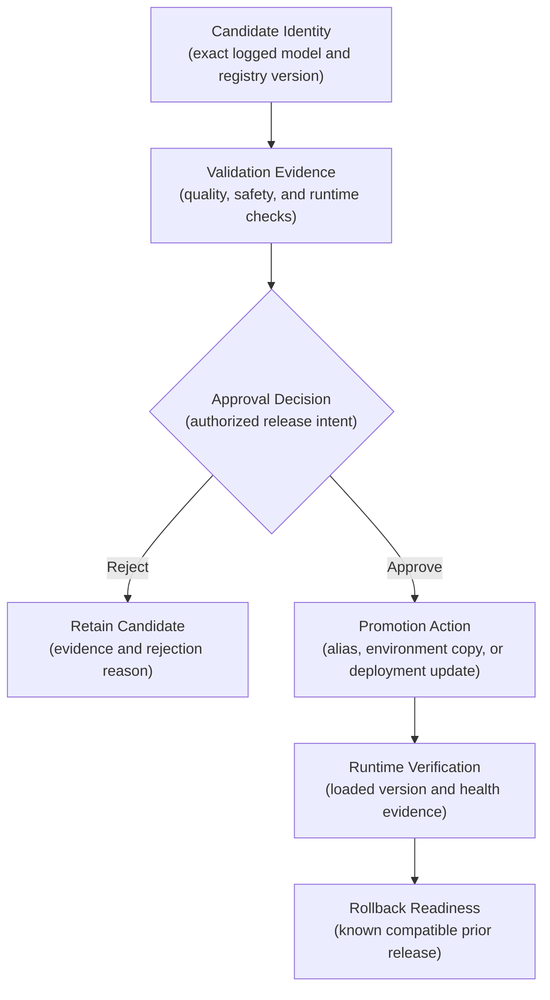
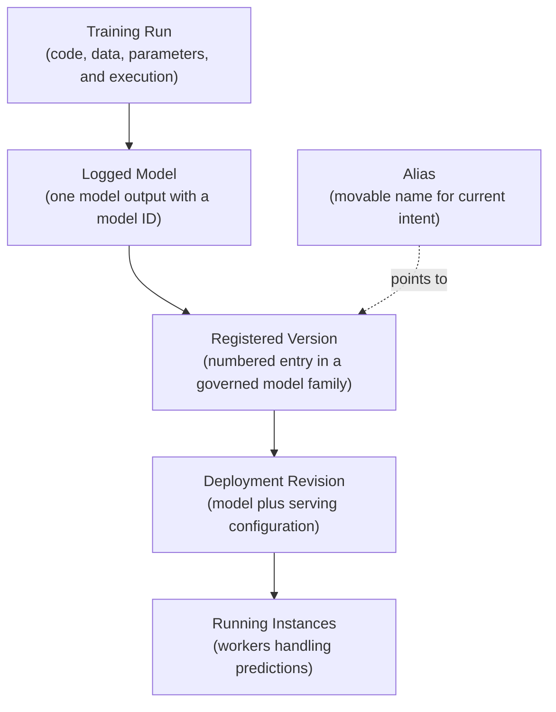
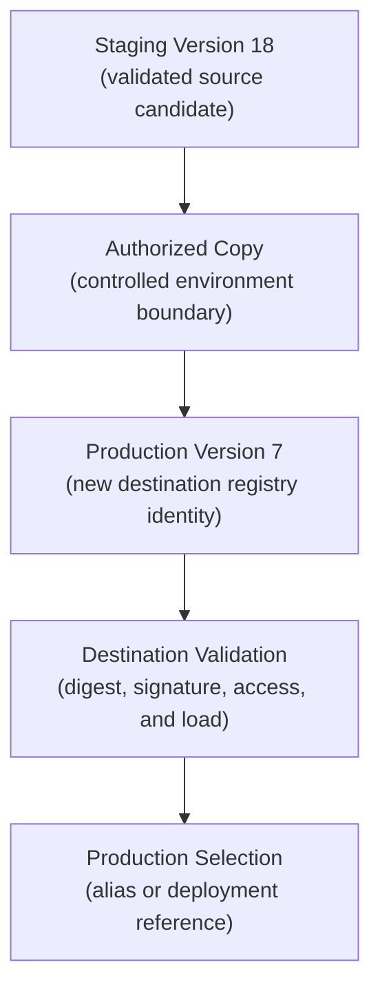
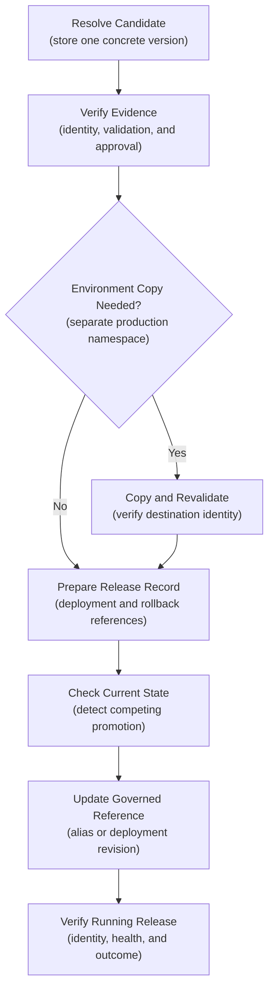
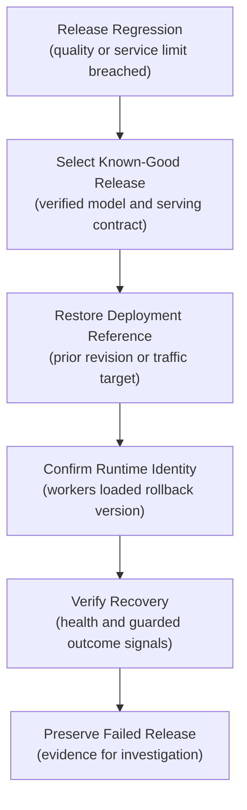

## Table of Contents

1. [Decide Which Model Version May Enter Production](#decide-which-model-version-may-enter-production)
2. [Understand Models, Versions, Aliases, And Deployments](#understand-models-versions-aliases-and-deployments)
3. [Keep A Model Version Unchanged During Review](#keep-a-model-version-unchanged-during-review)
4. [Use Aliases To Point To Approved Versions](#use-aliases-to-point-to-approved-versions)
5. [Validate One Exact Model Version](#validate-one-exact-model-version)
6. [Record Approval Separately From Deployment](#record-approval-separately-from-deployment)
7. [Move Beyond Deprecated MLflow Stages](#move-beyond-deprecated-mlflow-stages)
8. [Choose How Models Move Between Environments](#choose-how-models-move-between-environments)
9. [Automate Promotion With Approval Controls](#automate-promotion-with-approval-controls)
10. [Deploy The Exact Approved Model Version](#deploy-the-exact-approved-model-version)
11. [Verify the Version That Entered Service](#verify-the-version-that-entered-service)
12. [Map Each Cloud Registry To The Same Lifecycle](#map-each-cloud-registry-to-the-same-lifecycle)
13. [Roll Back To A Tested Model Version](#roll-back-to-a-tested-model-version)
14. [Record What Was Approved, Deployed, And Verified](#record-what-was-approved-deployed-and-verified)
15. [The Main Idea](#the-main-idea)
16. [References](#references)

## Decide Which Model Version May Enter Production
<!-- section-summary: Model promotion is a governed decision to let a specific validated version become the intended input to a production workflow. -->

At 10:00, a release owner receives the evaluation results for version `42` of a payment-fraud model. The current version, `41`, is blocking too many legitimate prepaid-card transactions. Version `42` improves that cohort without pushing the fraud-loss metric beyond its approved limit. A production change is scheduled for 15:00, so the release owner must decide which exact model the deployment controller may use.

The mistake would be costly in either direction. Promoting the wrong candidate could block valid payments or allow more fraud. Rejecting the candidate without understanding its evidence would leave the known false-positive problem in service. A successful release therefore needs stronger proof than a green dashboard: the approval names version `42`, the evaluation belongs to version `42`, the deployment loads version `42`, and version `41` remains available as a tested rollback target.

At a high level, **model promotion** is the governed act of changing which immutable model version a downstream system is allowed or expected to use. The downstream system may be an online endpoint, a batch-scoring job, or a release pipeline. Promotion can move an alias, copy a model into a production-controlled registry namespace, update a deployment specification, or combine those actions.


```mermaid
flowchart TD
    A["Candidate Identity<br/>(exact logged model and registry version)"] --> B["Validation Evidence<br/>(quality, safety, and runtime checks)"]
    B --> C{"Approval Decision<br/>(authorized release intent)"}
    C -- "Reject" --> D["Retain Candidate<br/>(evidence and rejection reason)"]
    C -- "Approve" --> E["Promotion Action<br/>(alias, environment copy, or deployment update)"]
    E --> F["Runtime Verification<br/>(loaded version and health evidence)"]
    F --> G["Rollback Readiness<br/>(known compatible prior release)"]
```

Approval, selection, and actual runtime state are separate claims. Each one needs its own evidence.

## Understand Models, Versions, Aliases, And Deployments
<!-- section-summary: Logged models, registered versions, aliases, and deployments identify different parts of the lifecycle and change at different rates. -->

A registry workflow uses several identifiers because training, review, and deployment refer to different objects. A logged model identifies one training output. A registered model groups versions of the same capability. A version identifies one reviewed entry, while an alias points to the version currently intended for a named role.

**A logged model** identifies one model output created during training. In MLflow 3, each logged model receives a unique `model_id`. Model artifacts live under that model identity, and model-specific metrics can be linked to it. This matters because one training run may log several checkpoints or model variants. The run explains the execution; the logged-model identity tells reviewers which output they are discussing.

**A registered model** is the governed family name, such as `prod.risk.fraud_detection`. It groups versions that solve the same production problem under one access and ownership boundary.

**A model version** is a numbered entry inside that family. Version `42` should continue to resolve to the same logged model, artifact, signature, and required inference assets. Descriptions, tags, and aliases may change around the version, while its model identity remains stable.

**An alias** is a readable pointer such as `Candidate`, `Champion`, or `Rollback`. It can move from one version to another. An alias expresses current intent. A durable release record preserves the history of each decision.

**A deployment revision** describes running infrastructure. It usually combines the model version with an image, dependency environment, feature contract, scaling policy, and endpoint configuration. The registry identifies the candidate. The deployment revision identifies the runnable release.


```mermaid
flowchart TD
    A["Training Run<br/>(code, data, parameters, and execution)"] --> B["Logged Model<br/>(one model output with a model ID)"]
    B --> C["Registered Version<br/>(numbered entry in a governed model family)"]
    D["Alias<br/>(movable name for current intent)"] -. "points to" .-> C
    C --> E["Deployment Revision<br/>(model plus serving configuration)"]
    E --> F["Running Instances<br/>(workers handling predictions)"]
```

During an incident, these identifiers answer different questions. The run explains how training happened. The version identifies what reviewers approved. The alias shows current registry intent. The deployment revision and runtime telemetry show what served requests.

## Keep A Model Version Unchanged During Review
<!-- section-summary: A reviewed version must keep the same model bytes and load contract so every later decision refers to the behavior that validation measured. -->

An immutable candidate is a model whose meaningful contents stay fixed after registration. In essence, the version acts as a sealed subject for testing and approval. If its tokenizer, preprocessing state, dependency requirements, label map, or weights change, the behavior under review has changed too.

Create a new logged model and a new registered version for any change that could affect predictions or loading. Registry systems commonly allow mutable descriptions, tags, and aliases because those fields describe the version. That convenience should never be used to replace the artifact behind an approved version.

MLflow 3 makes the logged-model identity visible in code:

```python
with mlflow.start_run():
    model_info = mlflow.sklearn.log_model(
        sk_model=model,
        name="fraud-candidate",
        signature=signature,
        input_example=input_example,
    )

logged_model_id = model_info.model_id
logged_model_uri = model_info.model_uri
```

The registry version should retain that `model_id` or an equally strong source reference. For artifact stores outside the registry, record a content digest as well. A path such as `s3://models/fraud/latest/` can point to different bytes after its contents are replaced. A version plus a digest makes accidental replacement detectable.

A clean-environment load test provides the first useful check. Fetch the exact version, load its packaged dependencies or approved runtime, score a small fixture, and verify the input and output schema. This check catches missing tokenizers, changed class order, and incomplete packaging before promotion reaches a serving system.

## Use Aliases To Point To Approved Versions
<!-- section-summary: Release automation resolves a candidate alias once, stores the concrete version, and uses that version throughout the release. -->

An alias gives humans and automation a stable word for a changing choice. `Candidate` can point to the version under review, and `Champion` can point to the version intended for normal production use. MLflow resolves an alias through `models:/<registered-model>@<alias>` or `get_model_version_by_alias()`.

The registry guarantees that an alias resolves to one version inside that registered model at a given moment. The expected result of resolution is a concrete version number that the release job can preserve. Reassigning the alias later changes future resolutions; the stored version number and artifact stay fixed.

```python
from mlflow import MlflowClient

client = MlflowClient()
model_name = "prod.risk.fraud_detection"

candidate = client.get_model_version_by_alias(model_name, "Candidate")
candidate_version = candidate.version

client.set_registered_model_alias(
    name=model_name,
    alias="Champion",
    version=candidate_version,
)
```

The important line is the resolution of `candidate.version`. Every validation query, approval check, deployment update, and audit event in that release should use the concrete value afterward.

Consider two releases running close together. The first job resolves `Candidate` to version `42`. A second job later moves `Candidate` to version `43`. If the first job resolves the alias again during deployment, it may deploy version `43` using version `42`'s approval. A release controller prevents this race by storing the resolved version, serializing promotion for the same model, and checking that the expected old `Champion` still owns the alias before changing it. If the state changed, the controller stops and asks for reconciliation.

Aliases also behave differently across workloads. A batch job that loads `@Champion` at startup can record the resolved version for that run. An online service may keep a model in memory for hours. Its running workers retain the loaded model until a deployment integration observes the alias change and creates a new serving revision.

## Validate One Exact Model Version
<!-- section-summary: Validation evidence explains why one exact version is suitable for a defined use, population, and operating boundary. -->

Validation asks a concrete question: *does this version meet the requirements for this intended use?* A single aggregate accuracy score rarely answers it. The release owner needs evidence about the important cohorts, the current baseline, runtime behavior, and the limits of the evaluation.

For the payment-fraud candidate, the evidence may include:

- the evaluation dataset identity and label-policy version;
- metric definitions and acceptance thresholds;
- fraud loss, false-positive rate, and calibration by payment type and region;
- comparison with the running version `41` on the same examples;
- schema and clean-load results;
- latency, throughput, memory, and cost under the intended serving configuration;
- known limitations, excluded uses, and the owner of each risk decision.

A machine-readable result keeps the gate tied to the version:

```yaml
subject:
  registered_model: prod.risk.fraud_detection
  version: "42"
  logged_model_id: m-7f3c...
  artifact_sha256: sha256:91c4...
evaluation:
  report_id: eval-fraud-v42
  dataset_snapshot: fraud-eval-q2-r3
  policy_version: fraud-release-policy-v6
  result: passed
  limitation: insufficient labels for a newly launched payment method
```

The dataset name above identifies one snapshot. The report establishes its time coverage, label maturity, join coverage, uncertainty, and cohort definitions. The candidate receives approval only for the use that this evidence supports.

## Record Approval Separately From Deployment
<!-- section-summary: Approval authorizes a specific release intent, while deployment and runtime verification prove that the intent was carried out. -->

Approval records an accountable decision about evidence. Deployment changes a technical system. Keeping them separate prevents a tag edit or alias move from silently becoming production authority.

For a low-risk internal model, an automated policy gate and an accountable service owner may provide sufficient approval. Higher-impact decisions need a broader review shaped by the product risk. A credit model, for example, may need domain and risk reviewers plus the legal or compliance roles defined in organizational policy. The registry displays the review state; the policy determines who has authority.

MLflow model-version tags are useful for visible state such as `validation_status=passed`. Tags are mutable metadata, so a durable approval record should also capture the actor, policy version, evidence digest, exact model version, decision, and reason. Many teams store this record in a deployment system, governed database, or append-only audit stream and link it back to the registry version.

The wording of the decision matters. `validation_passed` says that required checks succeeded. `approved_for_release` says an authorized actor permits a defined promotion. `serving` should come from deployment state or runtime evidence. One status field should not carry all three meanings.

## Move Beyond Deprecated MLflow Stages
<!-- section-summary: Current MLflow workflows replace fixed registry stages with aliases, tags, and access-controlled registered models for each environment. -->

Older MLflow tutorials often move a version through `Staging`, `Production`, and `Archived`. Those fixed Model Registry stages are deprecated and are planned for removal in a future major release. New workflows should use aliases and tags first. Models in Databricks Unity Catalog exclude the old stages entirely.

The replacement separates responsibilities that the old stage field mixed together:

- A model-version tag such as `validation_status=passed` describes review state.
- An alias such as `Candidate` or `Champion` points to a selected version inside one registered model.
- Separate registered models or governed namespaces represent environments with distinct access controls.
- CI/CD or a deployment controller updates the production deployment and records the result.

For example, old loading code may use `models:/fraud_detection/Production`. A current Unity Catalog workload can use `models:/prod.risk.fraud_detection@Champion` for a movable production selection or `models:/prod.risk.fraud_detection/42` for an exact version. Release automation should resolve the alias and pin the version before it performs approval-sensitive work.

Legacy migration needs more than renaming `Production` to `Champion`. First determine whether the stage helped people discover a model or authorized an environment change. Then trace any deployment trigger attached to it. Replace each responsibility with its current mechanism before retiring `transition_model_version_stage()` and stage-based model URIs.

## Choose How Models Move Between Environments
<!-- section-summary: Teams either produce models inside each controlled environment or copy an exact validated version across an environment boundary. -->

An **environment-qualified registered model** includes the environment in its governed name or namespace. `staging.risk.fraud_detection` and `prod.risk.fraud_detection` are separate model families with separate permissions. This design makes production write access explicit instead of treating a label inside one shared registry as the security boundary.

### Produce the Model Inside Production

The mature default is to promote code and pipeline definitions through source control and CI/CD, then train or register the production model inside the production environment. This keeps data access, feature computation, monitoring, and retraining under production controls.

### Copy the Validated Artifact

Some models are too expensive to retrain in every environment, or the reviewed artifact itself must cross the boundary. In that case, copy the exact version into the production-controlled registered model. Databricks Unity Catalog supports this with `copy_model_version()`:

```python
from mlflow import MlflowClient

client = MlflowClient(registry_uri="databricks-uc")

promoted = client.copy_model_version(
    src_model_uri="models:/staging.risk.fraud_detection/18",
    dst_name="prod.risk.fraud_detection",
)

production_version = promoted.version
```

The destination version number may differ from the source. The promotion record therefore keeps both identities and verifies that their model contents match. After the copy completes, run destination-side permission, digest, signature, and load checks. Only then should the production alias or deployment reference move.


```mermaid
flowchart TD
    A["Staging Version 18<br/>(validated source candidate)"] --> B["Authorized Copy<br/>(controlled environment boundary)"]
    B --> C["Production Version 7<br/>(new destination registry identity)"]
    C --> D["Destination Validation<br/>(digest, signature, access, and load)"]
    D --> E["Production Selection<br/>(alias or deployment reference)"]
```

The copy is part of promotion. The deployment update and runtime verification establish that the destination endpoint uses the copied version.

## Automate Promotion With Approval Controls
<!-- section-summary: A reliable promotion resolves the candidate once, checks evidence, records approval, changes controlled references, and verifies the outcome. -->

Promotion works best as one idempotent workflow owned by release automation. *Idempotent* means a retry with the same release ID produces the same intended result instead of selecting a newer candidate or creating duplicate decisions.

The workflow follows a clear order:

1. Resolve `Candidate` once and store the concrete source version.
2. Verify the logged-model identity, artifact digest, signature, and required assets.
3. Confirm that evaluation evidence and approval refer to that exact version.
4. Copy the version across the environment boundary if the operating model requires it.
5. Verify the destination version and record the source-to-destination mapping.
6. Create a release record with the intended deployment and rollback target.
7. Re-read the current alias and deployment state to detect a competing release.
8. Move the governed alias or update the deployment to the pinned version.
9. Confirm that the runtime loaded the intended release and passed health checks.


```mermaid
flowchart TD
    A["Resolve Candidate<br/>(store one concrete version)"] --> B["Verify Evidence<br/>(identity, validation, and approval)"]
    B --> C{"Environment Copy Needed?<br/>(separate production namespace)"}
    C -- "Yes" --> D["Copy and Revalidate<br/>(verify destination identity)"]
    C -- "No" --> E["Prepare Release Record<br/>(deployment and rollback references)"]
    D --> E
    E --> F["Check Current State<br/>(detect competing promotion)"]
    F --> G["Update Governed Reference<br/>(alias or deployment revision)"]
    G --> H["Verify Running Release<br/>(identity, health, and outcome)"]
```

A failed step leaves the prior production reference intact whenever possible. The workflow records the failure and can resume from verified state. A retry never goes back to the `Candidate` alias to discover a different version.

## Deploy The Exact Approved Model Version
<!-- section-summary: Deployment automation uses a concrete model version so the running release cannot change through an unrelated alias update. -->

The deployment specification should name the exact version that passed the release gate. This is the bridge between registry intent and running infrastructure.

```yaml
release_id: fraud-model-release-42
model:
  registered_name: prod.risk.fraud_detection
  version: "42"
  logged_model_id: m-7f3c...
  artifact_sha256: sha256:91c4...
serving:
  image: registry.example/ml/fraud-serving@sha256:6bd1...
  feature_contract: fraud-features-v12
rollback_release: fraud-model-release-41
```

An online endpoint usually creates a new deployment revision containing this reference. Traffic can remain on the existing revision during smoke tests, then move gradually or all at once according to the release strategy. An alias may still show which version is the intended champion, but the endpoint configuration and runtime identity provide stronger evidence of what is serving.

Batch workflows have a slightly different boundary. A scheduled job can resolve `@Champion` at the beginning of each run, immediately store the resolved version in run metadata, and use that pinned value for every partition. This allows the next batch run to adopt a newly promoted version without mixing versions inside the current run.

## Verify the Version That Entered Service
<!-- section-summary: Post-deployment verification connects the approved registry version to the deployment revision and the workers that actually handle predictions. -->

Promotion is incomplete until the target system confirms the running identity. A successful registry update only proves that registry state changed.

For an online service, inspect the deployment resource and startup telemetry. The deployment should report the registered name, concrete version, artifact or image digest, and release ID. Send a smoke request through the real endpoint path, then confirm that logs, metrics, or traces attribute it to the new release. Health checks cover load success, schema compatibility, latency, error rate, and resource behavior before broader traffic moves.

Suppose `Champion` points to version `42`, while the endpoint still reports release `41`. That can be a temporary and intentional state during rollout. It can also reveal a failed deployment trigger. The release dashboard should display registry intent and serving reality as separate fields so operators can tell the difference.

Prediction logging should preserve the model version or release ID for later outcome analysis. Without that field, a team can see that performance changed after a promotion but cannot reliably separate decisions made by the old and new versions.

## Map Each Cloud Registry To The Same Lifecycle
<!-- section-summary: Managed registries use different names for versions, approval, aliases, lifecycle state, and deployments, so teams should map each object to its actual responsibility. -->

Cloud platforms implement the same lifecycle responsibilities with different objects. Copying their vocabulary without checking its behavior can blur approval and deployment again.

**Amazon SageMaker AI** groups numbered model packages inside a Model Package Group. `ModelApprovalStatus` can move through states such as `PendingManualApproval`, `Approved`, and `Rejected`, and an approval event can trigger CI/CD if the team configures that integration. SageMaker also has a configurable `ModelLifeCycle` stage and stage status with IAM controls and EventBridge events. This current SageMaker construct is separate from MLflow’s deprecated fixed stages. A release record should still keep the exact model-package ARN or version and the endpoint deployment that consumed it.

**Gemini Enterprise Agent Platform Model Registry (formerly Vertex AI Model Registry)** stores versions under a model and supports mutable version aliases. One version owns the `default` alias. An operation that omits the version can therefore select whichever version currently owns `default`. Release automation should pass the intended version explicitly, treat alias movement as a governed selection, and record deployment evidence separately.

**Azure Machine Learning** stores registered model assets with explicit versions such as `azureml:<name>:<version>`. An online deployment points to a model asset, while the endpoint controls traffic across deployments. This separation is useful: the model version, serving deployment, and traffic decision remain visible as different resources.

**Databricks Unity Catalog** uses three-level model names, permissions, lineage, model versions, aliases, and audit logs. Stages are unsupported. Environment-specific catalogs or schemas provide access boundaries, and `copy_model_version()` supports artifact promotion if production retraining is unsuitable.

The product names differ, but the review questions stay stable: Which identity is immutable? Which pointer can move? Who may approve or change it? Which deployment consumed the version? Which telemetry proves that it ran?

## Roll Back To A Tested Model Version
<!-- section-summary: Rollback restores a previously verified release by changing the deployment reference or traffic, then confirming that the prior version is running again. -->

A rollback target is a known compatible release. The previous number in a registry qualifies only if its artifact remains available, its serving image and feature contract still work, and production evidence shows that it previously met the required operating limits. Version `41` satisfies those conditions in the payment-fraud release.

Prepare that target before promotion. Retain its model artifact, image digest, configuration, feature contract, and deployment recipe. Run a periodic load check if rollback assets have a long retention period. A model-only rollback may fail after a breaking feature or request-schema change, so the rollback reference should identify the complete prior release.


```mermaid
flowchart TD
    A["Release Regression<br/>(quality or service limit breached)"] --> B["Select Known-Good Release<br/>(verified model and serving contract)"]
    B --> C["Restore Deployment Reference<br/>(prior revision or traffic target)"]
    C --> D["Confirm Runtime Identity<br/>(workers loaded rollback version)"]
    D --> E["Verify Recovery<br/>(health and guarded outcome signals)"]
    E --> F["Preserve Failed Release<br/>(evidence for investigation)"]
```

For the payment-fraud release, operators direct traffic back to release `41`, confirm that workers report model version `41`, and watch request health plus the fastest trustworthy outcome signals. They may also move `Champion` back to version `41` so registry intent matches the recovered service. Reassigning the alias alone would be insufficient for workers that already loaded version `42`.

Rollback history must remain visible. Keep the failed version, its evidence, the triggering alert, the actor, and the recovery result. Deleting the candidate removes the material needed to explain the incident and improve the next gate.

## Record What Was Approved, Deployed, And Verified
<!-- section-summary: A durable release record connects immutable model identity, validation, approval, reference changes, runtime verification, and rollback. -->

The release record is the lifecycle narrative in machine-readable form. It answers what changed, why the change was allowed, who authorized it, what the system actually ran, and how recovery would work.

Create the record from resolved versions and avoid human-entered aliases. The record should exist before the deployment begins, because it gives every retry one stable release ID and one rollback target. Deployment automation can append observed results without changing the candidate or approval that started the release.

```yaml
release_id: fraud-model-release-42
candidate:
  source: staging.risk.fraud_detection/18
  destination: prod.risk.fraud_detection/42
  artifact_sha256: sha256:91c4...
evidence:
  evaluation_report: eval-fraud-v42
  evaluation_sha256: sha256:c1a8...
approval:
  policy: fraud-release-policy-v6
  decision: approved-by-ml-release-reviewer
change:
  previous_release: fraud-model-release-41
  deployment_revision: fraud-green-42
verification:
  loaded_version: "42"
  smoke_test: passed
  rollout_state: canary
```

Store the record before traffic moves, then append deployment and verification results. If the release fails, append the failure and rollback outcome instead of rewriting the original approval. This preserves the difference between what the team intended and what the production system achieved.

## The Main Idea
<!-- section-summary: Safe promotion keeps immutable model identity, mutable intent, approval evidence, deployment state, and rollback evidence distinct but connected. -->

Model promotion is a controlled change of intent and deployment, built around an exact model version. Logged-model identity and registry versions hold the candidate steady. Validation evidence explains its supported use. Approval grants authority. Aliases make current intent discoverable. Environment-qualified models enforce ownership boundaries. Deployment references and runtime telemetry prove what served predictions.

A reliable review can follow five questions: Which exact version is under consideration? What evidence belongs to it? Who authorized the change? Which deployment loaded it? Which complete release can restore service? If every answer points to an immutable identity and a durable record, promotion and rollback remain understandable under pressure.

## References

- [MLflow 3 migration guide](https://mlflow.org/docs/latest/ml/mlflow-3/)
- [MLflow Model Registry workflows](https://mlflow.org/docs/latest/ml/model-registry/workflow/)
- [MLflow Tracking](https://mlflow.org/docs/latest/ml/tracking/)
- [Databricks: Manage model lifecycle in Unity Catalog](https://docs.databricks.com/aws/en/machine-learning/manage-model-lifecycle/)
- [Databricks: Migrate workflows and models to Unity Catalog](https://docs.databricks.com/aws/en/machine-learning/manage-model-lifecycle/migrate-to-uc)
- [Amazon SageMaker AI: Model Registry models and versions](https://docs.aws.amazon.com/sagemaker/latest/dg/model-registry-models.html)
- [Amazon SageMaker AI: Update model approval status](https://docs.aws.amazon.com/sagemaker/latest/dg/model-registry-approve.html)
- [Amazon SageMaker AI: Model lifecycle staging construct](https://docs.aws.amazon.com/sagemaker/latest/dg/model-registry-staging-construct.html)
- [Gemini Enterprise Agent Platform: Model version aliases](https://docs.cloud.google.com/gemini-enterprise-agent-platform/machine-learning/model-registry/model-alias)
- [Google Cloud: Gemini Enterprise Agent Platform name changes](https://docs.cloud.google.com/gemini-enterprise-agent-platform/vertex-ai-name-changes)
- [Azure Machine Learning: Work with registered models](https://learn.microsoft.com/en-us/azure/machine-learning/how-to-manage-models?view=azureml-api-2)
- [Azure Machine Learning: Deploy a model as an online endpoint](https://learn.microsoft.com/en-us/azure/machine-learning/tutorial-deploy-model?view=azureml-api-2)
